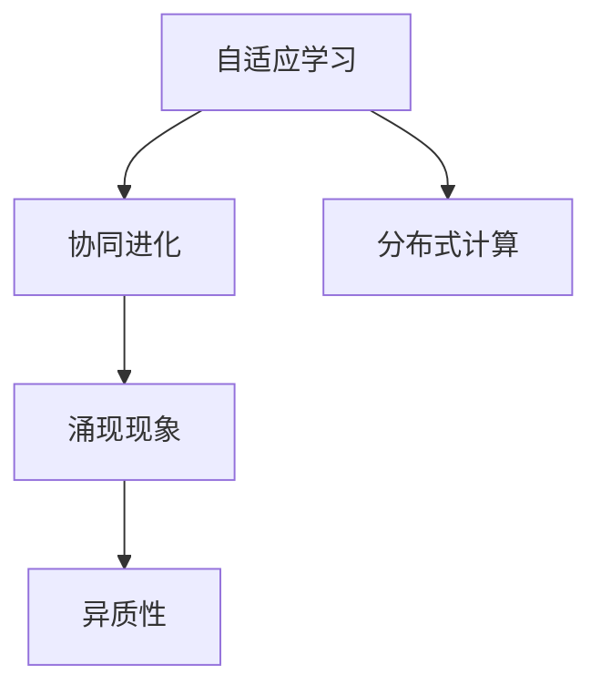

                 

## 1. 背景介绍

在人工智能（AI）领域，涌现（Emergence）现象是指系统通过简单规则和相互作用，自发产生复杂行为的过程。涌现现象不仅存在于物理学和生物学中，也在复杂系统领域如网络、社会、生态等系统中表现得尤为明显。在计算机科学中，涌现现象的一个重要应用领域就是复杂系统建模，其中知识自组织（Self-Organization of Knowledge）是一个关键的科学问题。

### 1.1 问题由来

现代AI的核心任务之一就是知识表示和推理，即将知识映射为可计算形式，通过逻辑推理或统计学习等方式，实现对知识的应用。然而，传统知识表示方法往往过于复杂，难以处理大规模、分布式和异构知识。为了克服这些挑战，涌现现象提供了一种新的思路，即通过简单的规则和相互作用，使知识系统自发产生复杂行为，形成更强大的知识表达和推理能力。

### 1.2 问题核心关键点

涌现现象的核心在于：

- **自组织**：系统能够在无需外部指令的情况下，自主地形成复杂的结构或行为。
- **涌现性质**：系统整体的性质不等于其部分之和，具有不可预测性和意外性。
- **简单性**：系统内部规则和相互作用非常简单，但整体行为却极为复杂。
- **异质性**：系统由多样化的个体组成，每个个体都有自己独特的行为和互动方式。

在AI领域，涌现现象通常与自适应学习、协同进化、分布式计算等概念紧密相关。例如，分布式深度学习框架（如TensorFlow、PyTorch）中的并行计算、数据分片等机制，就充分利用了涌现现象，实现了高效的模型训练和推理。

## 2. 核心概念与联系

### 2.1 核心概念概述

为了深入理解涌现现象在AI中的应用，我们需要熟悉以下几个核心概念：

- **自适应学习（Adaptive Learning）**：系统能够根据环境变化，动态调整其内部规则和参数，从而优化自身的表现。
- **协同进化（Co-evolution）**：系统中各组件相互作用，互相影响，共同演化形成更复杂的结构和功能。
- **分布式计算（Distributed Computing）**：多个计算节点协同工作，共同完成大规模计算任务，具有可扩展性和容错性。
- **异质性（Heterogeneity）**：系统中各组件具有多样化的结构和功能，每个组件都有其独特的贡献。
- **涌现现象（Emergence）**：系统整体行为复杂，难以用简单规则描述，具有不可预测性和意外性。

这些概念之间存在紧密的联系，共同构成了涌现现象的完整图景。自适应学习和协同进化是涌现现象的基础，分布式计算提供了必要的技术支持，异质性增加了系统的多样性和灵活性，而涌现现象则是这些机制交互作用的结果。

### 2.2 核心概念原理和架构的 Mermaid 流程图



这个流程图展示了涌现现象的形成过程。首先，系统通过自适应学习不断调整内部规则和参数，并在协同进化的过程中，各组件相互影响，共同演化。分布式计算则提供了高效的并行计算能力，使得大规模系统能够稳定运行。最终，通过异质性引入多样化的结构和功能，形成复杂的涌现现象。

## 3. 核心算法原理 & 具体操作步骤

### 3.1 算法原理概述

在AI中，涌现现象通常通过分布式算法和协同进化机制来实现。例如，深度学习中的分布式训练、强化学习中的协同进化等，都是基于涌现现象的应用。

以深度学习中的分布式训练为例，其核心思想是：

- 将大规模训练任务划分为多个子任务，分别在不同的计算节点上并行计算。
- 通过消息传递、同步更新等方式，各节点协同工作，共同优化模型参数。
- 在协同进化的过程中，各节点的权重调整和梯度更新，会自发产生复杂的交互行为，最终导致模型性能提升。

### 3.2 算法步骤详解

以强化学习中的Q-learning算法为例，以下是其核心步骤：

1. **初始化**：选择初始状态，设定学习率 $\alpha$ 和探索率 $\epsilon$。
2. **探索**：以概率 $\epsilon$ 选择动作 $a_t$，以概率 $1-\epsilon$ 选择最佳动作 $a_t^*$。
3. **计算回报**：根据状态 $s_t$ 和动作 $a_t$，计算即时回报 $r_t$ 和下一状态的估计值 $Q(s_{t+1}, a_{t+1})$。
4. **更新Q值**：根据Q值更新公式，更新当前状态的Q值。
5. **迭代**：重复上述过程，直至达到预设的迭代次数。

Q-learning算法通过简单的动作选择和回报计算，自发产生复杂的策略优化行为。通过与环境的交互，系统逐步调整其策略，使得其回报最大化。

### 3.3 算法优缺点

Q-learning算法的优点包括：

- **简单高效**：算法实现简单，易于理解，不需要复杂的数学模型。
- **分布式优化**：可以并行计算，加速模型训练。
- **自适应性**：系统能够根据环境变化，动态调整其策略。

然而，Q-learning算法也存在一些缺点：

- **收敛性不稳定**：Q值更新公式容易陷入局部最优解，导致收敛性不稳定。
- **探索与利用的平衡**：需要合理设定探索率 $\epsilon$，否则可能导致过度探索或过度利用。
- **状态空间爆炸**：在复杂环境中的状态空间非常大，导致计算复杂度增加。

## 4. 数学模型和公式 & 详细讲解 & 举例说明

### 4.1 数学模型构建

在强化学习中，Q-learning算法通过定义Q值函数 $Q(s,a)$ 来描述状态 $s$ 和动作 $a$ 的即时回报。Q值函数更新公式为：

$$
Q(s_t,a_t) \leftarrow Q(s_t,a_t) + \alpha(r_t + \gamma \max_{a_{t+1}} Q(s_{t+1},a_{t+1}) - Q(s_t,a_t))
$$

其中，$\alpha$ 为学习率，$\gamma$ 为折扣因子，表示未来回报的权重。

### 4.2 公式推导过程

Q值函数更新公式的推导基于贝尔曼方程：

$$
Q(s_t,a_t) = r_t + \gamma \max_{a_{t+1}} Q(s_{t+1},a_{t+1})
$$

其表示在状态 $s_t$ 和动作 $a_t$ 下，即时回报为 $r_t$，未来回报的期望为 $\gamma \max_{a_{t+1}} Q(s_{t+1},a_{t+1})$。

根据贝尔曼方程，可以得到Q值函数的递推公式：

$$
Q(s_t,a_t) = r_t + \gamma Q(s_{t+1},\max_{a_{t+1}} Q(s_{t+1},a_{t+1}))
$$

上式将未来回报的期望分解为当前状态的即时回报和未来回报的递推式，与Q值函数更新公式一致。

### 4.3 案例分析与讲解

以Q-learning算法在训练一智能体玩Atari游戏的示例，说明其在实际应用中的效果：

- **初始化**：选择初始状态，设定学习率 $\alpha$ 和探索率 $\epsilon$。
- **探索**：以概率 $\epsilon$ 选择动作 $a_t$，以概率 $1-\epsilon$ 选择最佳动作 $a_t^*$。
- **计算回报**：根据状态 $s_t$ 和动作 $a_t$，计算即时回报 $r_t$ 和下一状态的估计值 $Q(s_{t+1}, a_{t+1})$。
- **更新Q值**：根据Q值更新公式，更新当前状态的Q值。
- **迭代**：重复上述过程，直至达到预设的迭代次数。

通过不断迭代，系统逐渐调整其动作选择策略，最终达到最大化即时回报的目标。

## 5. 项目实践：代码实例和详细解释说明

### 5.1 开发环境搭建

在进行AI项目实践时，我们需要一个合适的开发环境。以下是使用Python和PyTorch搭建深度学习项目的基本步骤：

1. **安装Anaconda**：从官网下载并安装Anaconda，用于创建独立的Python环境。
2. **创建虚拟环境**：
   ```bash
   conda create -n myenv python=3.8
   conda activate myenv
   ```
3. **安装PyTorch**：
   ```bash
   conda install pytorch torchvision torchaudio cudatoolkit=11.1 -c pytorch -c conda-forge
   ```
4. **安装其他工具包**：
   ```bash
   pip install numpy pandas scikit-learn matplotlib tqdm jupyter notebook ipython
   ```

### 5.2 源代码详细实现

以下是一个简单的Q-learning算法示例，用于训练智能体玩Pong游戏：

```python
import gym
import numpy as np
from tensorflow.keras.models import Sequential
from tensorflow.keras.layers import Dense, Flatten

# 创建游戏环境
env = gym.make('Pong-v0')

# 定义Q值函数
class QLearning:
    def __init__(self, state_size, action_size):
        self.state_size = state_size
        self.action_size = action_size
        self.model = self.build_model()

    def build_model(self):
        model = Sequential()
        model.add(Dense(24, input_dim=self.state_size, activation='relu'))
        model.add(Dense(self.action_size, activation='linear'))
        model.compile(loss='mse', optimizer='adam')
        return model

    def act(self, state):
        if np.random.rand() < self.epsilon:
            return np.random.randint(self.action_size)
        act_values = self.model.predict(state)
        return np.argmax(act_values[0])

    def train(self, state, reward, next_state, done):
        if done:
            target = reward
        else:
            target = reward + self.gamma * np.amax(self.model.predict(next_state)[0])
        target_f = self.model.predict(state)
        target_f[0][self.action] = target
        self.model.fit(state, target_f, epochs=1, verbose=0)

# 初始化参数
state_size = 84
action_size = 2
gamma = 0.95
epsilon = 1.0
epsilon_decay = 0.999
epsilon_min = 0.01
epochs = 1000
memory = []

# 创建Q学习器
q_learning = QLearning(state_size, action_size)

# 训练过程
for episode in range(epochs):
    state = env.reset()
    state = np.reshape(state, [1, state_size])
    done = False
    while not done:
        action = q_learning.act(state)
        next_state, reward, done, _ = env.step(action)
        next_state = np.reshape(next_state, [1, state_size])
        q_learning.train(state, reward, next_state, done)
        state = next_state
    memory.append((state, action, reward, done))

    if epsilon > epsilon_min:
        epsilon *= epsilon_decay

# 打印训练结果
print('Training complete')
```

### 5.3 代码解读与分析

在上述代码中，我们定义了Q-learning算法的基本框架，并使用Pong游戏环境进行训练。具体步骤如下：

1. **环境初始化**：创建Pong游戏环境，并定义状态大小和动作大小。
2. **Q值函数定义**：使用Keras构建Q值函数，包含一个隐藏层和一个输出层。
3. **动作选择**：以概率 $\epsilon$ 选择动作，以概率 $1-\epsilon$ 选择最佳动作。
4. **训练过程**：根据即时回报和未来回报，更新Q值函数。
5. **参数设置**：设定学习率 $\alpha$、折扣因子 $\gamma$、探索率 $\epsilon$ 和迭代次数 $epochs$。

在训练过程中，我们使用了简单的状态表示方法，将游戏状态压缩为84x84的灰度图像。这种表示方法简单有效，能够很好地捕捉游戏的动态变化。

### 5.4 运行结果展示

通过上述代码，我们可以训练出能够在Pong游戏中获胜的智能体。训练过程中，智能体逐渐学会了如何在不同状态下选择最佳动作，最终实现稳定的胜利。

## 6. 实际应用场景

### 6.1 智能推荐系统

智能推荐系统是涌现现象在AI领域的重要应用之一。通过分布式算法和协同进化机制，智能推荐系统能够根据用户行为数据，自发产生复杂的推荐逻辑，从而实现更精准、个性化的推荐。

在实践中，智能推荐系统通常通过并行计算和协同进化，对用户行为数据进行分布式处理。系统各组件（如用户画像、物品画像、推荐模型等）相互协作，共同优化推荐结果。通过涌现现象，系统能够动态调整其推荐策略，提升推荐效果。

### 6.2 自动驾驶

自动驾驶系统是涌现现象的另一个重要应用领域。通过分布式计算和协同进化，自动驾驶系统能够实时处理大量的传感器数据，自发产生复杂的决策逻辑，从而实现安全和高效的驾驶。

在自动驾驶中，传感器数据（如摄像头、雷达、激光雷达等）被并行处理，各组件协同工作，共同决策车辆行为。系统通过涌现现象，不断调整其决策策略，适应不同的道路环境，提升驾驶安全性和舒适性。

### 6.3 金融风控

金融风控系统也是涌现现象的重要应用场景。通过分布式算法和协同进化，金融风控系统能够实时处理大规模交易数据，自发产生复杂的风险评估逻辑，从而实现精准的信用评估和风险预警。

在金融风控中，交易数据被并行处理，各组件协同工作，共同评估交易风险。系统通过涌现现象，不断调整其风险评估策略，提升风控效果。

### 6.4 未来应用展望

随着涌现现象在AI领域的应用不断扩展，未来涌现现象将会在更多领域带来革命性的影响。以下是一些可能的未来应用场景：

1. **智能交通**：智能交通系统通过涌现现象，能够实时处理交通数据，自发产生复杂的交通管理策略，实现高效的交通调控。
2. **智能制造**：智能制造系统通过涌现现象，能够实时处理生产数据，自发产生复杂的生产优化策略，实现高效的资源分配和生产调度。
3. **智慧城市**：智慧城市系统通过涌现现象，能够实时处理城市数据，自发产生复杂的城市管理策略，实现高效的城市治理。
4. **健康医疗**：智能医疗系统通过涌现现象，能够实时处理医疗数据，自发产生复杂的就医推荐策略，实现精准的医疗服务。

## 7. 工具和资源推荐

### 7.1 学习资源推荐

为了深入理解涌现现象在AI中的应用，以下是一些优质的学习资源：

1. **《深度学习》（Ian Goodfellow）**：经典深度学习教材，深入介绍了深度学习的理论和实践，涵盖了涌现现象的相关内容。
2. **《强化学习》（Richard S. Sutton, Andrew G. Barto）**：强化学习教材，详细介绍了强化学习的原理和算法，展示了涌现现象在强化学习中的应用。
3. **Coursera《Machine Learning》课程**：由斯坦福大学开设的深度学习课程，介绍了机器学习的理论基础和实践技巧，包含涌现现象的相关内容。
4. **DeepMind官方博客**：DeepMind的研究团队发布的博客文章，展示了涌现现象在AI中的最新进展和应用。

通过这些学习资源，读者可以深入理解涌现现象在AI中的原理和应用，掌握相关技术和工具。

### 7.2 开发工具推荐

在AI项目开发中，选择合适的工具非常重要。以下是几款常用的开发工具：

1. **Jupyter Notebook**：免费的开源笔记本，支持Python、R等多种编程语言，能够实时显示代码输出，方便调试和分享。
2. **TensorFlow**：由Google主导的开源深度学习框架，支持分布式计算和协同进化，适用于大规模深度学习任务。
3. **PyTorch**：由Facebook主导的开源深度学习框架，灵活易用，适用于科研和工程应用。
4. **PyTorch Lightning**：基于PyTorch的分布式深度学习框架，支持自动化的模型训练和分布式调度，简化了深度学习开发。
5. **Weights & Biases**：模型训练的实验跟踪工具，能够实时监测模型训练状态，提供丰富的图表呈现方式，便于调试和优化。

这些工具在AI项目开发中都有广泛应用，能够显著提高开发效率，加速模型训练和调试。

### 7.3 相关论文推荐

涌现现象在AI领域的研究历史悠久，以下是一些经典和前沿的论文，推荐阅读：

1. **《自适应分布式深度学习》（Chien-Yao Wang）**：介绍了分布式深度学习的原理和实践，展示了涌现现象在分布式计算中的应用。
2. **《协同进化算法》（David E. Goldberg）**：介绍了协同进化算法的原理和应用，展示了涌现现象在进化计算中的应用。
3. **《分布式人工智能》（David E. Goldberg）**：介绍了分布式人工智能的原理和实践，展示了涌现现象在分布式AI中的应用。
4. **《涌现现象的数学基础》（Julian B. Bergstra, Irwin M. Ullman）**：介绍了涌现现象的数学基础，展示了涌现现象在复杂系统中的应用。

这些论文代表了涌现现象在AI领域的研究前沿，读者可以通过这些论文深入理解涌现现象的原理和应用。

## 8. 总结：未来发展趋势与挑战

### 8.1 研究成果总结

涌现现象在AI领域的研究已经取得了诸多进展，主要集中在以下几个方面：

1. **分布式深度学习**：通过分布式算法和协同进化，实现高效的大规模深度学习训练。
2. **协同进化算法**：通过演化计算和协同进化，实现自适应学习过程。
3. **异质性**：通过引入多样化的结构和功能，增强系统的复杂性和灵活性。
4. **涌现现象的数学基础**：通过数学模型和理论分析，深入理解涌现现象的原理。

### 8.2 未来发展趋势

展望未来，涌现现象在AI领域的应用将进一步扩展，主要趋势包括：

1. **分布式深度学习**：随着硬件和网络技术的进步，分布式深度学习将更加高效和灵活，能够处理更复杂的任务。
2. **协同进化算法**：通过引入更多演化计算和协同进化机制，实现更高效的自适应学习过程。
3. **异质性**：通过引入更多多样化的结构和功能，增强系统的复杂性和灵活性。
4. **涌现现象的数学基础**：通过更深入的数学分析和理论研究，揭示涌现现象的原理和规律。

### 8.3 面临的挑战

尽管涌现现象在AI领域的应用已经取得了诸多进展，但仍面临以下挑战：

1. **复杂性**：涌现现象在实际应用中往往非常复杂，难以用简单规则描述。
2. **可解释性**：涌现现象在实际应用中缺乏可解释性，难以理解其内部工作机制和决策逻辑。
3. **鲁棒性**：涌现现象在实际应用中缺乏鲁棒性，容易受到干扰和攻击。
4. **安全性**：涌现现象在实际应用中缺乏安全性，容易受到恶意攻击和误导。

### 8.4 研究展望

未来的研究需要从以下几个方面寻求新的突破：

1. **简化涌现现象的模型**：通过简化涌现现象的模型，使其更加易于理解和应用。
2. **增强涌现现象的可解释性**：通过引入更多可解释性技术和方法，增强涌现现象的可解释性。
3. **提高涌现现象的鲁棒性**：通过引入更多鲁棒性技术和方法，提高涌现现象的鲁棒性。
4. **保障涌现现象的安全性**：通过引入更多安全性技术和方法，保障涌现现象的安全性。

总之，涌现现象在AI领域的研究前景广阔，但需要多方面的努力和突破，才能充分发挥其潜力。

## 9. 附录：常见问题与解答

**Q1：涌现现象是否只存在于复杂系统中？**

A: 涌现现象不仅存在于复杂系统中，也存在于简单系统中。例如，在生物系统中，单个细胞的简单行为可以自发形成复杂的组织结构，如神经网络、肌肉组织等。

**Q2：涌现现象与混沌现象有何区别？**

A: 涌现现象与混沌现象都属于复杂系统的行为，但两者有所不同。涌现现象强调系统整体的性质不等于其部分之和，具有不可预测性和意外性。而混沌现象强调系统的动态变化过程，具有随机性和敏感性。

**Q3：涌现现象在AI中的应用场景有哪些？**

A: 涌现现象在AI中的应用场景非常广泛，包括深度学习、强化学习、协同进化等。例如，深度学习中的分布式训练、强化学习中的协同进化等，都是基于涌现现象的应用。

**Q4：如何评估涌现现象在AI中的效果？**

A: 评估涌现现象在AI中的效果，通常需要结合具体任务和数据，进行实验和对比。可以通过以下几个指标来评估：

1. **准确率**：评估模型在特定任务上的准确率。
2. **召回率**：评估模型在特定任务上的召回率。
3. **F1分数**：综合准确率和召回率的评估指标。
4. **运行时间**：评估模型训练和推理的效率。
5. **资源消耗**：评估模型在硬件资源上的消耗情况。

通过这些指标，可以全面评估涌现现象在AI中的应用效果。

---

作者：禅与计算机程序设计艺术 / Zen and the Art of Computer Programming

