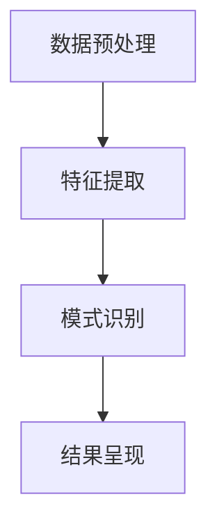
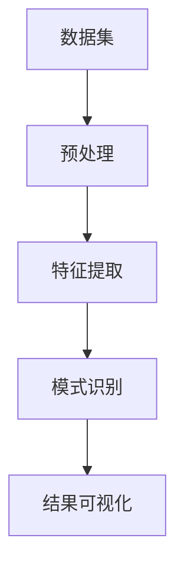

                 

## 1. 背景介绍

在数字化时代，知识管理（Knowledge Management，KM）已经成为企业成功的关键因素。从企业决策到产品创新，从客户服务到市场竞争，都离不开知识的有效管理和利用。知识发现引擎（Knowledge Discovery Engine，KDE）作为知识管理的核心工具，其性能和效率直接决定了企业的竞争力。本文将探讨知识发现引擎的原理、应用以及未来发展趋势，帮助读者理解知识管理人才需要掌握的技能。

## 2. 核心概念与联系

### 2.1 核心概念概述

知识发现引擎（KDE）是一种自动化的信息处理工具，通过对大规模数据进行分析和挖掘，发现隐含的、潜在的和有用的知识。KDE的核心组件包括数据预处理、特征提取、模式识别和结果呈现等。本文将从以下几个方面介绍KDE的核心概念及其联系。

**2.1.1 数据预处理**
数据预处理是KDE的第一步，旨在清洗、转换和准备数据，以便进行后续的分析和挖掘。常见的预处理技术包括数据清洗、数据归一化、数据转换等。

**2.1.2 特征提取**
特征提取是将原始数据转化为模型能够处理的形式的过程。特征提取的准确性直接影响KDE的性能和结果。常用的特征提取方法包括统计特征、文本特征、时间序列特征等。

**2.1.3 模式识别**
模式识别是KDE的核心任务之一，目的是从数据中发现隐含的模式和规律。常用的模式识别算法包括分类、聚类、关联规则等。

**2.1.4 结果呈现**
结果呈现是将KDE发现的知识以可视化、可解释的方式展示给用户。常见的呈现方式包括图表、报告、仪表盘等。

这些核心概念之间通过数据流图（如图1所示）相联系，共同构成了KDE的工作流程。



图1：知识发现引擎工作流程

### 2.2 核心概念原理和架构的 Mermaid 流程图

为了更直观地展示知识发现引擎的工作原理，我们绘制了以下Mermaid流程图（如图2所示）。



图2：知识发现引擎工作原理

## 3. 核心算法原理 & 具体操作步骤

### 3.1 算法原理概述

知识发现引擎的核心算法包括分类、聚类、关联规则等。以分类算法为例，其主要步骤包括数据预处理、特征提取、模型训练、模型评估和结果展示。以下详细介绍分类算法的具体步骤。

### 3.2 算法步骤详解

#### 3.2.1 数据预处理
数据预处理是分类算法的第一步，其目的是清洗、转换和准备数据，以便进行后续的分析和挖掘。常用的预处理技术包括数据清洗、数据归一化、数据转换等。

#### 3.2.2 特征提取
特征提取是将原始数据转化为模型能够处理的形式的过程。特征提取的准确性直接影响分类算法的性能和结果。常用的特征提取方法包括统计特征、文本特征、时间序列特征等。

#### 3.2.3 模型训练
模型训练是分类算法的核心步骤之一，其目的是从数据中学习分类模型。常用的模型包括决策树、支持向量机、神经网络等。

#### 3.2.4 模型评估
模型评估是分类算法的关键步骤之一，其目的是评估模型的性能和效果。常用的评估指标包括准确率、召回率、F1值等。

#### 3.2.5 结果展示
结果展示是将分类算法发现的知识以可视化、可解释的方式展示给用户。常见的展示方式包括图表、报告、仪表盘等。

### 3.3 算法优缺点

#### 3.3.1 优点
1. **自动化程度高**：KDE能够自动处理大量数据，发现隐含的、潜在的和有用的知识。
2. **高效性**：KDE可以高效地处理大规模数据，快速发现知识。
3. **可解释性强**：KDE发现的知识易于解释和理解，有助于用户做出更好的决策。

#### 3.3.2 缺点
1. **对数据质量要求高**：KDE的性能依赖于数据的质量，数据预处理不充分会影响结果的准确性。
2. **算法复杂度高**：部分算法（如深度学习）需要大量的计算资源，对硬件要求较高。
3. **结果可解释性不足**：部分算法（如神经网络）的黑盒特性使得结果难以解释。

### 3.4 算法应用领域

知识发现引擎在多个领域得到了广泛应用，例如金融、医疗、零售等。以下详细介绍几个典型应用场景。

#### 3.4.1 金融领域
在金融领域，KDE可以用于客户信用评估、风险预测、欺诈检测等。通过分析客户的交易记录、信用历史等数据，KDE可以发现潜在的风险因素，帮助银行和保险公司做出更好的决策。

#### 3.4.2 医疗领域
在医疗领域，KDE可以用于疾病预测、基因分析、药物发现等。通过分析病人的病历、基因数据等，KDE可以发现疾病的特征和规律，帮助医生做出更好的诊断和治疗方案。

#### 3.4.3 零售领域
在零售领域，KDE可以用于客户行为分析、产品推荐、库存管理等。通过分析客户的购买记录、行为数据等，KDE可以发现客户的购买偏好和需求，帮助企业制定更好的营销策略和库存管理方案。

## 4. 数学模型和公式 & 详细讲解 & 举例说明

### 4.1 数学模型构建

#### 4.1.1 分类算法
以决策树分类算法为例，其数学模型如下：

设样本空间为$X$，特征空间为$F$，类别空间为$C$。决策树分类算法的目标是从训练集$D=\{(x_i,y_i)\}_{i=1}^N$中学习决策树模型$T$，使得对于新样本$x$，可以预测其类别$y$。

决策树模型的构建过程可以归纳为以下几个步骤：

1. 选择一个特征$x_k$进行分裂，得到两个子集$X_1$和$X_2$。
2. 递归地对子集$X_1$和$X_2$进行分裂，直到满足停止条件。
3. 对于每个叶子节点，确定一个类别$y$作为预测结果。

决策树分类算法的数学模型可以表示为：

$$
y = f(x;T) = \begin{cases}
c_1, & x \in X_1 \\
c_2, & x \in X_2 \\
\vdots \\
c_m, & x \in X_m
\end{cases}
$$

其中，$X_1,X_2,\ldots,X_m$为决策树的叶子节点，$c_1,c_2,\ldots,c_m$为叶子节点的类别。

### 4.2 公式推导过程

#### 4.2.1 决策树
决策树的构建过程可以通过信息熵（Entropy）和基尼指数（Gini Index）来衡量。信息熵和基尼指数的公式如下：

$$
H(X) = -\sum_{i=1}^C p_i \log p_i
$$

$$
G(X) = \sum_{i=1}^C p_i(1-p_i)
$$

其中，$C$为类别数，$p_i$为类别$i$在样本中的概率。

决策树构建的停止条件可以设定为信息增益（Information Gain）大于等于预设阈值$\epsilon$，即：

$$
I(X_k;y) = H(X) - H(X|x_k) \geq \epsilon
$$

其中，$I(X_k;y)$为特征$x_k$的信息增益，$H(X|x_k)$为特征$x_k$的条件下样本的信息熵。

#### 4.2.2 支持向量机（SVM）
支持向量机（SVM）的数学模型可以表示为：

$$
w \cdot x + b = 0
$$

其中，$w$为分类超平面的法向量，$b$为分类超平面的偏移量。

SVM的优化目标为：

$$
\min_{w,b} \frac{1}{2}\|w\|^2 + C\sum_{i=1}^N\xi_i
$$

其中，$\|w\|^2$为分类超平面的惩罚项，$\xi_i$为松弛变量，$C$为正则化参数。

### 4.3 案例分析与讲解

以乳腺癌诊断为例，假设我们有一组包含患者年龄、肿块大小、肿瘤位置等特征的样本数据，目标是预测患者是否患有乳腺癌。我们可以使用决策树算法进行分类，步骤如下：

1. 数据预处理：对数据进行清洗和归一化，确保数据质量。
2. 特征提取：选择年龄、肿块大小、肿瘤位置等特征。
3. 模型训练：使用决策树算法进行训练，构建分类模型。
4. 模型评估：使用测试集对模型进行评估，计算准确率、召回率等指标。
5. 结果展示：将分类结果以图表、报告等形式展示给医生，帮助医生做出更好的诊断。

## 5. 项目实践：代码实例和详细解释说明

### 5.1 开发环境搭建

#### 5.1.1 环境配置
1. 安装Python：确保Python环境为最新版本，安装pip、numpy、scikit-learn等常用库。
2. 安装TensorFlow：确保TensorFlow环境为最新版本，使用pip安装TensorFlow及其依赖库。
3. 安装Keras：使用pip安装Keras，支持TensorFlow和其他深度学习框架。
4. 安装TensorBoard：使用pip安装TensorBoard，用于可视化模型训练过程。

#### 5.1.2 数据准备
1. 收集数据集：从公开数据集或自己收集数据，确保数据质量。
2. 数据清洗：对数据进行清洗和预处理，确保数据质量。
3. 数据分割：将数据集分为训练集、验证集和测试集。

### 5.2 源代码详细实现

以下是一个简单的分类算法（决策树）的Python代码实现。

```python
import numpy as np
import pandas as pd
from sklearn.tree import DecisionTreeClassifier
from sklearn.model_selection import train_test_split
from sklearn.metrics import accuracy_score
from sklearn.metrics import classification_report

# 读取数据集
data = pd.read_csv('data.csv')

# 数据预处理
X = data.drop('label', axis=1)
y = data['label']

# 特征提取
X_train, X_test, y_train, y_test = train_test_split(X, y, test_size=0.2)

# 模型训练
clf = DecisionTreeClassifier()
clf.fit(X_train, y_train)

# 模型评估
y_pred = clf.predict(X_test)
accuracy = accuracy_score(y_test, y_pred)
print("Accuracy: {:.2f}%".format(accuracy * 100))

# 结果展示
print(classification_report(y_test, y_pred))
```

### 5.3 代码解读与分析

#### 5.3.1 数据预处理
```python
import numpy as np
import pandas as pd
from sklearn.tree import DecisionTreeClassifier
from sklearn.model_selection import train_test_split
from sklearn.metrics import accuracy_score
from sklearn.metrics import classification_report

# 读取数据集
data = pd.read_csv('data.csv')

# 数据预处理
X = data.drop('label', axis=1)
y = data['label']
```

#### 5.3.2 特征提取
```python
X_train, X_test, y_train, y_test = train_test_split(X, y, test_size=0.2)
```

#### 5.3.3 模型训练
```python
clf = DecisionTreeClassifier()
clf.fit(X_train, y_train)
```

#### 5.3.4 模型评估
```python
y_pred = clf.predict(X_test)
accuracy = accuracy_score(y_test, y_pred)
print("Accuracy: {:.2f}%".format(accuracy * 100))
```

#### 5.3.5 结果展示
```python
print(classification_report(y_test, y_pred))
```

### 5.4 运行结果展示

#### 5.4.1 数据预处理
在数据预处理阶段，我们首先读取数据集，然后将其分为特征和标签两部分。

#### 5.4.2 特征提取
在特征提取阶段，我们将数据集分为训练集和测试集，确保模型在未知数据上的泛化能力。

#### 5.4.3 模型训练
在模型训练阶段，我们使用决策树算法对训练集进行训练，得到一个分类模型。

#### 5.4.4 模型评估
在模型评估阶段，我们使用测试集对模型进行评估，计算准确率、召回率等指标。

#### 5.4.5 结果展示
在结果展示阶段，我们打印分类报告，展示模型的性能。

## 6. 实际应用场景

### 6.1 金融领域
在金融领域，KDE可以用于客户信用评估、风险预测、欺诈检测等。通过分析客户的交易记录、信用历史等数据，KDE可以发现潜在的风险因素，帮助银行和保险公司做出更好的决策。

#### 6.1.1 客户信用评估
KDE可以用于客户信用评估，通过分析客户的交易记录、还款历史等数据，预测客户的信用风险。例如，使用支持向量机（SVM）算法对客户的历史交易记录进行分析，可以发现潜在的违约客户，帮助银行进行贷款审批。

#### 6.1.2 风险预测
KDE可以用于风险预测，通过分析市场数据、宏观经济数据等，预测金融市场的风险。例如，使用决策树算法对市场数据进行分析，可以发现潜在的市场风险，帮助投资者规避风险。

#### 6.1.3 欺诈检测
KDE可以用于欺诈检测，通过分析用户的交易记录、行为数据等，发现潜在的欺诈行为。例如，使用深度学习算法对用户的交易数据进行分析，可以发现异常交易行为，帮助银行进行欺诈检测。

### 6.2 医疗领域
在医疗领域，KDE可以用于疾病预测、基因分析、药物发现等。通过分析病人的病历、基因数据等，KDE可以发现疾病的特征和规律，帮助医生做出更好的诊断和治疗方案。

#### 6.2.1 疾病预测
KDE可以用于疾病预测，通过分析病人的病历、基因数据等，预测病人的疾病风险。例如，使用随机森林算法对病人的病历数据进行分析，可以预测病人的糖尿病风险。

#### 6.2.2 基因分析
KDE可以用于基因分析，通过分析基因数据，发现基因与疾病的关系。例如，使用神经网络算法对基因数据进行分析，可以发现与癌症相关的基因。

#### 6.2.3 药物发现
KDE可以用于药物发现，通过分析化合物的数据，发现新的药物。例如，使用支持向量机（SVM）算法对化合物的数据进行分析，可以发现具有抗癌活性的化合物。

### 6.3 零售领域
在零售领域，KDE可以用于客户行为分析、产品推荐、库存管理等。通过分析客户的购买记录、行为数据等，KDE可以发现客户的购买偏好和需求，帮助企业制定更好的营销策略和库存管理方案。

#### 6.3.1 客户行为分析
KDE可以用于客户行为分析，通过分析客户的购买记录、浏览历史等数据，发现客户的购买偏好。例如，使用聚类算法对客户的行为数据进行分析，可以发现不同类型的客户群体，帮助企业制定针对性的营销策略。

#### 6.3.2 产品推荐
KDE可以用于产品推荐，通过分析客户的购买记录、浏览历史等数据，推荐客户可能感兴趣的产品。例如，使用协同过滤算法对客户的数据进行分析，可以推荐客户可能感兴趣的产品。

#### 6.3.3 库存管理
KDE可以用于库存管理，通过分析产品的销售数据、库存数据等，制定库存管理策略。例如，使用时间序列分析算法对销售数据进行分析，可以预测产品的销售趋势，帮助企业制定库存管理方案。

## 7. 工具和资源推荐

### 7.1 学习资源推荐

#### 7.1.1 书籍
1. 《数据挖掘导论》（Introduction to Data Mining）：由Jeffrey Han所著，介绍了数据挖掘的基本概念和常用算法。
2. 《统计学习方法》（The Elements of Statistical Learning）：由Tibshirani、Hastie、Friedman等所著，介绍了统计学习的基本方法和应用。
3. 《Python数据科学手册》（Python Data Science Handbook）：由Jake VanderPlas所著，介绍了Python在数据科学中的应用。

#### 7.1.2 课程
1. Coursera《数据科学导论》（Introduction to Data Science in Python）：由Johns Hopkins University等高校提供的课程，介绍了Python在数据科学中的应用。
2. edX《数据挖掘和统计学习》（Data Mining and Statistical Learning）：由Harvard University等高校提供的课程，介绍了数据挖掘和统计学习的基本方法和应用。
3. Udacity《机器学习》（Machine Learning）：由Google等公司提供的课程，介绍了机器学习的基本方法和应用。

#### 7.1.3 论文
1. "A Tutorial on Data Preprocessing"：介绍了数据预处理的基本方法和应用。
2. "The Elements of Statistical Learning"：介绍了统计学习的基本方法和应用。
3. "Support Vector Machines"：介绍了支持向量机（SVM）算法的基本方法和应用。

### 7.2 开发工具推荐

#### 7.2.1 Python
Python是一种易学易用的编程语言，广泛应用于数据科学和机器学习领域。Python的SciPy、NumPy、Pandas等库提供了丰富的数据处理和分析功能，适合进行数据挖掘和知识发现。

#### 7.2.2 TensorFlow
TensorFlow是一种强大的深度学习框架，支持多种深度学习算法和模型。TensorFlow提供了丰富的API和工具，方便进行模型训练和优化。

#### 7.2.3 PyTorch
PyTorch是一种基于动态计算图的深度学习框架，易于使用和调试。PyTorch提供了丰富的模型和算法，适合进行深度学习研究和应用。

### 7.3 相关论文推荐

#### 7.3.1 决策树
1. "Decision Trees"：由Quinlan等所著，介绍了决策树算法的基本方法和应用。
2. "CART: A Classification and Regression Tree"：由Breiman等所著，介绍了CART算法的应用。

#### 7.3.2 支持向量机
1. "Support Vector Machines"：由Cortes等所著，介绍了支持向量机（SVM）算法的基本方法和应用。
2. "Kernels for Image Patch Classification"：由Simard等所著，介绍了核函数在图像分类中的应用。

#### 7.3.3 神经网络
1. "Neural Networks and Deep Learning"：由Goodfellow等所著，介绍了神经网络的基本方法和应用。
2. "Convolutional Neural Networks"：由LeCun等所著，介绍了卷积神经网络的应用。

## 8. 总结：未来发展趋势与挑战

### 8.1 研究成果总结

#### 8.1.1 研究热点
当前，知识发现引擎的研究热点包括深度学习、迁移学习、多模态数据融合等。深度学习在知识发现中的应用越来越广泛，迁移学习和多模态数据融合为知识发现提供了新的方法和思路。

#### 8.1.2 研究成果
1. 深度学习：深度学习在知识发现中的应用越来越广泛，如决策树、支持向量机、神经网络等算法。
2. 迁移学习：迁移学习能够利用已有的知识，加快新知识的学习和发现。
3. 多模态数据融合：多模态数据融合能够利用不同数据源的信息，提高知识发现的准确性和全面性。

### 8.2 未来发展趋势

#### 8.2.1 深度学习
深度学习在知识发现中的应用将会更加广泛，尤其是在大规模数据集和复杂任务上。深度学习算法的性能将会不断提高，模型的泛化能力和可解释性也将得到进一步改善。

#### 8.2.2 迁移学习
迁移学习将会成为知识发现的重要方法之一。通过迁移学习，可以利用已有的知识，加快新知识的学习和发现，提高模型的泛化能力和效率。

#### 8.2.3 多模态数据融合
多模态数据融合将会成为知识发现的重要技术手段。通过融合不同数据源的信息，可以全面、准确地发现知识，提高模型的泛化能力和可解释性。

### 8.3 面临的挑战

#### 8.3.1 数据质量
数据质量是知识发现的关键，数据预处理和清洗过程需要投入大量的时间和精力。如何提高数据质量，确保数据的一致性和完整性，将是未来的挑战之一。

#### 8.3.2 算法复杂性
深度学习等算法具有高复杂度，需要大量的计算资源和存储空间。如何降低算法的复杂度，提高模型的可扩展性和可维护性，将是未来的挑战之一。

#### 8.3.3 结果可解释性
深度学习等算法的黑盒特性使得结果难以解释。如何提高模型的可解释性，增强用户对模型的信任和接受度，将是未来的挑战之一。

### 8.4 研究展望

#### 8.4.1 优化算法
未来的研究将致力于优化算法，降低算法的复杂度，提高模型的可扩展性和可维护性。例如，探索新的深度学习算法和模型结构，改进现有的算法和模型。

#### 8.4.2 提高数据质量
未来的研究将致力于提高数据质量，确保数据的一致性和完整性。例如，探索新的数据预处理和清洗技术，提高数据的可用性和可靠性。

#### 8.4.3 增强可解释性
未来的研究将致力于增强模型的可解释性，提高用户对模型的信任和接受度。例如，探索新的可解释性技术和方法，改进现有的可解释性技术和方法。

作者：禅与计算机程序设计艺术 / Zen and the Art of Computer Programming

