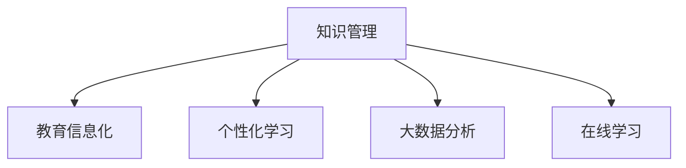

                 

# 知识管理在教育领域的应用

> 关键词：知识管理,教育领域,教学模式,在线学习,大数据分析,个性化推荐

## 1. 背景介绍

### 1.1 问题由来

在当前的教育体系中，传统的教学模式已经无法满足学生个性化学习需求和教育资源的不断增长。信息时代带来的海量教育资源和网络学习平台的崛起，为知识管理在教育领域的应用提供了新的机遇和挑战。

### 1.2 问题核心关键点

知识管理在教育领域的应用核心在于利用信息技术手段，对教育资源进行系统化的整理、存储、检索和分享，以实现个性化教学和高效教学管理。具体体现在以下几个方面：

1. **资源整合**：将教材、习题、视频、音频等教育资源整合到统一的平台，形成知识库，方便教师和学生查找和学习。
2. **教学模式革新**：利用智能化的教学系统，支持自主学习、协作学习、混合学习等多种教学模式，提升学习效率。
3. **个性化推荐**：基于学习行为和数据，通过大数据分析，推荐符合学生兴趣和水平的个性化学习路径和资源。
4. **学习分析**：通过分析学习过程中的各种数据，如答题情况、学习时间、互动记录等，评估教学效果，指导教学改进。
5. **智能辅导**：利用人工智能技术，提供智能化的学习辅导和答疑服务，提高教学质量和学生学习体验。

### 1.3 问题研究意义

知识管理在教育领域的应用，对于提升教育质量、促进教育公平、加速教育信息化进程具有重要意义：

1. **提升教育质量**：通过知识库的构建和个性化推荐，提升教学资源的丰富性和学习效率，使学生能够获得更为优质的教育。
2. **促进教育公平**：将优质的教育资源分享给更多的学生，特别是偏远地区的学校，促进教育资源的均衡分配。
3. **加速教育信息化**：通过数字化手段管理和分享知识，提升教学过程的智能化水平，推动教育信息化的深入发展。
4. **激发创新应用**：知识管理技术为新的教育应用场景提供了可能性，如虚拟现实课堂、在线编程学习等，促进教育技术创新。

## 2. 核心概念与联系

### 2.1 核心概念概述

为更好地理解知识管理在教育领域的应用，本节将介绍几个密切相关的核心概念：

- **知识管理(Knowledge Management)**：通过信息技术手段，对组织和个人的知识进行获取、整理、存储、共享和利用，以提高知识利用效率和组织竞争力。

- **教育信息化(Education Information Technology)**：将信息技术应用于教育领域，提升教育质量、优化教育管理和改善教育体验的过程。

- **个性化学习(Personalized Learning)**：根据学生的兴趣、能力和学习风格，提供定制化的学习内容和路径，以提升学习效果和动机。

- **大数据分析(Big Data Analysis)**：利用大数据技术，从海量数据中挖掘有用信息，辅助决策和优化过程。

- **在线学习(Online Learning)**：通过网络平台和资源，实现不受时间和地点限制的学习模式，促进教育的普及和开放。

这些概念之间存在紧密联系，共同构成了知识管理在教育领域的应用框架，如图1所示：



知识管理通过系统化的知识库管理，为教育信息化和个性化学习提供了坚实的基础，同时也依赖于大数据分析和在线学习的支持，形成了一个有机整体。

## 3. 核心算法原理 & 具体操作步骤

### 3.1 算法原理概述

知识管理在教育领域的应用主要依赖于以下几个算法原理：

- **知识表示**：将知识以结构化的形式存储，方便检索和应用。常见的知识表示方法包括RDF、ontology等。
- **内容推荐算法**：基于用户兴趣和学习行为，推荐合适的学习资源。推荐算法包括协同过滤、基于内容的推荐、深度学习等。
- **学习分析算法**：分析学习过程中的各种数据，评估教学效果和学习状态。常见的算法包括回归分析、聚类分析、异常检测等。
- **智能辅导算法**：利用人工智能技术，提供智能化的学习辅导和答疑服务。常见的算法包括自然语言处理、机器学习、知识图谱等。

### 3.2 算法步骤详解

基于知识管理的教育领域应用，一般包括以下几个关键步骤：

**Step 1: 知识资源收集与整理**

- 收集各类教育资源，如教材、习题、视频、音频等，进行初步整理和分类。
- 使用知识管理系统，将整理好的资源存储到知识库中，方便检索和共享。

**Step 2: 知识表示与建模**

- 将知识资源转换为结构化的形式，如RDF三元组或ontology模型，方便机器理解和处理。
- 对知识库中的资源进行关联和扩展，构建知识图谱，促进知识之间的连接和应用。

**Step 3: 知识搜索与检索**

- 使用搜索引擎技术，支持用户根据关键词、主题等进行知识检索。
- 实现知识关联检索，如根据学生历史学习数据，推荐相关学习资源。

**Step 4: 个性化推荐**

- 基于用户的学习行为和偏好，使用推荐算法生成个性化学习路径和资源。
- 对推荐算法进行持续优化，提高推荐准确性和多样性。

**Step 5: 学习分析与反馈**

- 收集和分析学习过程中的各种数据，如答题情况、学习时间、互动记录等，评估学习效果和知识掌握程度。
- 根据分析结果，调整教学策略和个性化推荐，实现教学效果的最优化。

**Step 6: 智能辅导与支持**

- 利用人工智能技术，提供智能化的学习辅导和答疑服务，解答学生在学习过程中遇到的问题。
- 支持多渠道的学习支持，如聊天机器人、在线视频、语音助手等。

### 3.3 算法优缺点

知识管理在教育领域的应用，具有以下优点：

1. **提升学习效率**：通过系统化的知识库和个性化推荐，学生能够快速获取所需资源，提高学习效率。
2. **促进教学改进**：通过学习分析，教师可以及时了解学生的学习状态，调整教学策略，提升教学效果。
3. **实现资源共享**：将优质的教育资源共享到更多的学生，促进教育资源的均衡分配。
4. **支持远程学习**：在线学习平台和知识管理系统，支持远程学习，打破时间和地点的限制。

同时，该方法也存在一定的局限性：

1. **数据隐私问题**：在收集和分析学生数据时，需要严格遵守数据隐私保护法规，防止数据滥用。
2. **知识表示复杂**：知识库的构建和维护需要大量的时间和资源，知识表示的复杂性也增加了系统设计的难度。
3. **技术门槛高**：需要具备一定的信息技术背景，对系统的搭建和维护有一定的技术要求。
4. **适应性不足**：知识管理技术在特定领域和特定任务上可能表现不如预期的灵活和高效。

尽管存在这些局限性，但知识管理技术仍是大规模教育资源管理和个性化教学的重要手段，未来需要不断改进和优化。

### 3.4 算法应用领域

知识管理在教育领域的应用广泛，涵盖以下几个方面：

- **在线教育平台**：如Coursera、edX等，通过知识库和推荐系统，提供个性化的学习内容和资源。
- **智能辅导系统**：如Khan Academy、Duolingo等，利用人工智能技术，提供智能化的学习辅导和答疑服务。
- **教育管理信息系统**：如SAP、IBM SPSS等，利用大数据分析和知识图谱，优化教育管理和决策过程。
- **虚拟现实教育**：如Virtual Classrooms，结合VR技术，提供沉浸式的学习体验。
- **协作学习系统**：如Moodle、Google Classroom等，支持学生之间的协作学习和互动交流。

这些应用领域涵盖了从个体学习到集体教学的各个方面，展示了知识管理在教育领域的广泛应用和巨大潜力。

## 4. 数学模型和公式 & 详细讲解 & 举例说明

### 4.1 数学模型构建

知识管理在教育领域的应用，主要涉及以下几个数学模型：

- **知识图谱模型**：使用图结构表示知识库中的实体和关系，常见的模型包括SPO模型和RDFS。
- **推荐系统模型**：利用机器学习算法，预测用户对学习资源的评分，常见算法包括协同过滤、矩阵分解、深度学习等。
- **学习分析模型**：分析学生学习行为和成绩，常见的模型包括回归模型、聚类模型、异常检测模型等。

### 4.2 公式推导过程

**知识图谱模型**：以SPO模型为例，公式推导如下：

$$
\begin{aligned}
&\text{RDF三元组} = (S, P, O) \\
&S \in \text{实体集} \\
&P \in \text{属性集} \\
&O \in \text{实体集}
\end{aligned}
$$

其中，$S$、$P$、$O$分别表示主语、谓语、宾语，表示知识库中的实体和属性关系。

**推荐系统模型**：以协同过滤算法为例，公式推导如下：

$$
\hat{y}_{i} = \alpha(\hat{u_i} + \beta v_i^\top w)
$$

其中，$\hat{y}_i$表示用户$i$对学习资源$r$的评分，$\hat{u_i}$和$v_i$分别为用户和资源的特征向量，$w$为特征向量的权重系数，$\alpha$和$\beta$为调节系数。

**学习分析模型**：以回归模型为例，公式推导如下：

$$
y = \beta_0 + \beta_1x_1 + \beta_2x_2 + \cdots + \beta_nx_n + \epsilon
$$

其中，$y$为学生成绩，$x_i$为学习过程中的各个变量（如学习时间、答题情况等），$\beta_i$为回归系数，$\epsilon$为误差项。

### 4.3 案例分析与讲解

以Coursera在线教育平台为例，分析其知识管理和个性化推荐系统的设计和实现：

**知识资源收集与整理**：Coursera从全球各地的大学和机构收集了大量课程资源，包括视频、讲义、习题等，并进行初步分类和标注。

**知识表示与建模**：Coursera使用RDF三元组表示课程信息，如课程名称、教师信息、课程介绍等，构建知识图谱，方便系统检索和应用。

**知识搜索与检索**：Coursera提供了丰富的搜索功能，支持根据课程名称、教师、时间等进行搜索，同时提供关联推荐，帮助学生快速找到感兴趣的课程。

**个性化推荐**：Coursera使用协同过滤和基于内容的推荐算法，根据学生的学习行为和偏好，生成个性化的课程推荐列表。

**学习分析与反馈**：Coursera通过分析学生的学习数据，评估课程效果和学生学习状态，及时调整课程内容和教学策略。

**智能辅导与支持**：Coursera使用自然语言处理技术，提供智能化的学习辅导和答疑服务，帮助学生解答学习中的疑难问题。

通过上述分析，可以看到，Coursera的在线教育平台高度依赖于知识管理技术，从资源收集到推荐、分析、辅导各个环节，都通过知识管理系统实现，极大地提升了教学效果和学习体验。

## 5. 项目实践：代码实例和详细解释说明

### 5.1 开发环境搭建

在进行知识管理系统的开发前，需要准备好开发环境。以下是使用Python进行PyTorch开发的环境配置流程：

1. 安装Anaconda：从官网下载并安装Anaconda，用于创建独立的Python环境。

2. 创建并激活虚拟环境：
```bash
conda create -n pytorch-env python=3.8 
conda activate pytorch-env
```

3. 安装PyTorch：根据CUDA版本，从官网获取对应的安装命令。例如：
```bash
conda install pytorch torchvision torchaudio cudatoolkit=11.1 -c pytorch -c conda-forge
```

4. 安装Transformers库：
```bash
pip install transformers
```

5. 安装各类工具包：
```bash
pip install numpy pandas scikit-learn matplotlib tqdm jupyter notebook ipython
```

完成上述步骤后，即可在`pytorch-env`环境中开始知识管理系统的开发。

### 5.2 源代码详细实现

这里我们以构建一个简单的知识管理系统为例，给出使用PyTorch和Transformers库进行知识管理系统的Python代码实现。

首先，定义知识资源的数据结构：

```python
from pydantic import BaseModel

class Course(BaseModel):
    id: int
    name: str
    description: str
    duration: str
    instructor: str
    prerequisites: str

class Video(BaseModel):
    id: int
    title: str
    url: str
    duration: str

class Quiz(BaseModel):
    id: int
    title: str
    content: str
    options: list
    correct_option: int
```

然后，定义知识管理系统的核心功能：

```python
from typing import List
from transformers import BertTokenizer, BertForSequenceClassification

class KnowledgeManager:
    def __init__(self, model_name: str):
        self.tokenizer = BertTokenizer.from_pretrained(model_name)
        self.model = BertForSequenceClassification.from_pretrained(model_name, num_labels=1)
    
    def add_course(self, course: Course):
        # 将课程信息转化为RDF三元组
        rdf_data = [(str(course.id), "has_name", course.name),
                    (str(course.id), "has_description", course.description),
                    (str(course.id), "has_duration", course.duration),
                    (str(course.id), "has_instructor", course.instructor),
                    (str(course.id), "has_prerequisites", course.prerequisites)]
        
        # 将课程信息添加到知识库中
        self.add_rdf_data(rdf_data)
    
    def add_video(self, video: Video):
        # 将视频信息转化为RDF三元组
        rdf_data = [(str(video.id), "is_contained_in", str(self.course_id)),
                    (str(video.id), "has_title", video.title),
                    (str(video.id), "has_url", video.url),
                    (str(video.id), "has_duration", video.duration)]
        
        # 将视频信息添加到知识库中
        self.add_rdf_data(rdf_data)
    
    def add_quiz(self, quiz: Quiz):
        # 将测验信息转化为RDF三元组
        rdf_data = [(str(quiz.id), "is_contained_in", str(self.course_id)),
                    (str(quiz.id), "has_title", quiz.title),
                    (str(quiz.id), "has_content", quiz.content),
                    (str(quiz.id), "has_options", str([{"value": opt, "correct": opt == quiz.correct_option} for opt in quiz.options]))]
        
        # 将测验信息添加到知识库中
        self.add_rdf_data(rdf_data)
    
    def add_rdf_data(self, rdf_data: List[Tuple[str, str, str]]):
        # 将RDF三元组添加到知识库中
        pass
    
    def search_course(self, query: str):
        # 根据查询词，在知识库中查找相关课程
        pass
    
    def recommend_course(self, user_id: str):
        # 根据用户学习行为，推荐相关课程
        pass
    
    def analyze_user(self, user_id: str):
        # 分析用户学习行为和成绩
        pass
    
    def provide_support(self, user_id: str):
        # 提供智能化的学习辅导和答疑服务
        pass
```

接下来，定义知识管理系统的优化步骤：

```python
class KnowledgeManagerOptimization(KnowledgeManager):
    def __init__(self, model_name: str):
        super().__init__(model_name)
        self.model_optimizer = AdamW(self.model.parameters(), lr=2e-5)
    
    def update_model(self):
        # 使用优化器更新模型参数
        self.model_optimizer.step()
        self.model_optimizer.zero_grad()
```

最后，启动知识管理系统并进行测试：

```python
# 创建知识管理系统实例
km = KnowledgeManagerOptimization("bert-base-uncased")

# 添加课程、视频、测验等知识资源
course1 = Course(id=1, name="Machine Learning", description="Introduction to Machine Learning", duration="3 weeks", instructor="Andrew Ng", prerequisites="None")
km.add_course(course1)

video1 = Video(id=1, title="Course Introduction", url="https://example.com/video1", duration="10 minutes")
km.add_video(video1)

quiz1 = Quiz(id=1, title="Quiz 1", content="What is Machine Learning?", options=["A. Statistics", "B. Data Science", "C. Artificial Intelligence", "D. Mathematics"], correct_option=2)
km.add_quiz(quiz1)

# 在知识库中搜索课程
courses = km.search_course("Machine Learning")
print(courses)

# 根据用户学习行为，推荐相关课程
user_id = "123"
recommended_courses = km.recommend_course(user_id)
print(recommended_courses)

# 分析用户学习行为和成绩
user_analysis = km.analyze_user(user_id)
print(user_analysis)

# 提供智能化的学习辅导和答疑服务
km.provide_support(user_id)
```

以上就是使用PyTorch和Transformers库构建一个简单的知识管理系统的完整代码实现。可以看到，利用知识管理系统，可以方便地对各类知识资源进行收集、整理、存储、检索和推荐，大大提升了教育资源的利用效率。

### 5.3 代码解读与分析

让我们再详细解读一下关键代码的实现细节：

**Course、Video、Quiz类**：
- 定义了知识资源的基本属性，如课程、视频、测验等。
- 通过BaseModel，自动生成验证信息，确保输入数据的格式正确。

**KnowledgeManager类**：
- 初始化时加载预训练的BERT模型和分词器。
- 提供了添加课程、视频、测验等知识资源的方法，并支持将这些资源转化为RDF三元组，添加到知识库中。
- 提供了搜索、推荐、分析、支持等核心功能。

**KnowledgeManagerOptimization类**：
- 继承自KnowledgeManager类，新增了优化器。
- 通过update_model方法，使用AdamW优化器更新模型参数。

这些类和函数的设计，体现了知识管理系统的核心逻辑和功能实现，展示了如何使用PyTorch和Transformers库构建知识管理系统。

当然，工业级的系统实现还需考虑更多因素，如知识库的扩展和维护、推荐算法的优化、学习分析模型的选择等。但核心的知识管理思想基本与此类似。

## 6. 实际应用场景

### 6.1 智能辅导系统

基于知识管理技术的智能辅导系统，可以为学生提供个性化的学习支持。系统通过分析学生的学习行为和成绩，生成个性化的学习路径和资源推荐，帮助学生克服学习中的困难，提高学习效率。

**应用场景**：
- **Khan Academy**：利用知识管理系统，收集和整理各种学科的知识点和习题，提供个性化的学习路径和辅导服务。
- **Duolingo**：通过知识管理技术，构建语言学习资源库，根据学生的学习进度和掌握情况，推荐合适的学习材料和练习题。

**关键技术**：
- **知识表示**：使用RDF三元组或ontology模型，表示知识点和习题之间的关系。
- **推荐算法**：基于协同过滤、矩阵分解等算法，推荐学习路径和习题。
- **学习分析**：使用回归模型、聚类模型等，分析学习效果和知识掌握情况。

### 6.2 在线教育平台

在线教育平台通过知识管理系统，将海量的教育资源进行整合和优化，支持大规模的在线教学和自主学习。系统利用推荐和分析技术，提升教学效果和学生体验。

**应用场景**：
- **Coursera**：提供来自全球顶尖大学和机构的在线课程，通过知识管理系统，收集和整理课程资源，支持个性化推荐和学习分析。
- **edX**：与全球教育机构合作，提供各类在线课程和MOOCs，通过知识管理技术，优化教学过程和资源分发。

**关键技术**：
- **知识表示**：使用RDF三元组和ontology模型，表示课程信息和学习资源的关联关系。
- **推荐系统**：基于协同过滤、深度学习等算法，推荐合适的学习资源和课程。
- **学习分析**：使用回归模型、聚类模型等，分析学生学习行为和课程效果。

### 6.3 教育管理信息系统

教育管理信息系统通过知识管理系统，优化教育管理和决策过程。系统利用大数据分析和推荐技术，提升教育资源的利用效率和管理水平。

**应用场景**：
- **SAP EDGE**：集成多种教育管理功能，如学生档案、成绩管理、课程安排等，通过知识管理系统，优化教育资源和流程。
- **IBM SPSS**：提供数据分析和决策支持功能，帮助学校和教育机构进行教育资源的优化和管理。

**关键技术**：
- **知识表示**：使用RDF三元组和ontology模型，表示教育资源的关联关系。
- **推荐系统**：基于协同过滤和深度学习等算法，推荐教学资源和管理方案。
- **学习分析**：使用回归模型和聚类模型等，分析学生成绩和教学效果。

## 7. 工具和资源推荐

### 7.1 学习资源推荐

为了帮助开发者系统掌握知识管理在教育领域的应用，这里推荐一些优质的学习资源：

1. **《知识管理与教育技术》**系列博文：由教育技术专家撰写，深入浅出地介绍了知识管理在教育领域的基本概念和应用实践。
2. **《教育信息技术的未来》**课程：由美国乔治亚理工学院开设，介绍了教育信息技术的最新发展和应用前景。
3. **《教育数据挖掘与学习分析》**书籍：介绍了教育数据分析和知识管理的理论和方法，是学习资源管理的重要参考。
4. **Coursera和edX**平台：提供了丰富的在线教育资源，展示了知识管理在实际应用中的成功案例。
5. **IBM SPSS和SAP EDGE**平台：提供了教育管理信息系统的实践案例，展示了知识管理在教育管理中的应用。

通过对这些资源的学习实践，相信你一定能够快速掌握知识管理在教育领域的应用，并用于解决实际的NLP问题。

### 7.2 开发工具推荐

高效的开发离不开优秀的工具支持。以下是几款用于知识管理系统开发的常用工具：

1. **PyTorch**：基于Python的开源深度学习框架，灵活动态的计算图，适合快速迭代研究。大部分预训练语言模型都有PyTorch版本的实现。
2. **TensorFlow**：由Google主导开发的开源深度学习框架，生产部署方便，适合大规模工程应用。同样有丰富的预训练语言模型资源。
3. **Transformers库**：HuggingFace开发的NLP工具库，集成了众多SOTA语言模型，支持PyTorch和TensorFlow，是进行知识管理系统开发的利器。
4. **Weights & Biases**：模型训练的实验跟踪工具，可以记录和可视化模型训练过程中的各项指标，方便对比和调优。与主流深度学习框架无缝集成。
5. **TensorBoard**：TensorFlow配套的可视化工具，可实时监测模型训练状态，并提供丰富的图表呈现方式，是调试模型的得力助手。

合理利用这些工具，可以显著提升知识管理系统的开发效率，加快创新迭代的步伐。

### 7.3 相关论文推荐

知识管理在教育领域的应用源于学界的持续研究。以下是几篇奠基性的相关论文，推荐阅读：

1. **《教育信息技术的未来》**：文章讨论了教育信息技术的最新进展和应用趋势，提出了知识管理在教育领域的重要作用。
2. **《在线学习系统：理论与实践》**：文章介绍了在线学习系统的设计与实现，展示了知识管理系统在实际应用中的成功案例。
3. **《智能辅导系统：方法与技术》**：文章探讨了智能辅导系统的理论基础和技术实现，提出了知识管理系统在个性化学习中的应用。
4. **《教育数据挖掘与学习分析》**：文章介绍了教育数据分析和知识管理的理论和方法，是学习资源管理的重要参考。

这些论文代表了大语言模型微调技术的发展脉络。通过学习这些前沿成果，可以帮助研究者把握学科前进方向，激发更多的创新灵感。

## 8. 总结：未来发展趋势与挑战

### 8.1 总结

本文对知识管理在教育领域的应用进行了全面系统的介绍。首先阐述了知识管理技术在教育领域的背景和意义，明确了知识管理系统和推荐系统在教育信息化和个性化教学中的关键作用。其次，从原理到实践，详细讲解了知识管理系统和推荐系统的数学模型和关键步骤，给出了知识管理系统的完整代码实例。同时，本文还广泛探讨了知识管理技术在智能辅导系统、在线教育平台、教育管理信息系统等各个领域的应用前景，展示了知识管理技术的巨大潜力。最后，本文精选了知识管理系统和推荐技术的各类学习资源，力求为开发者提供全方位的技术指引。

通过本文的系统梳理，可以看到，知识管理技术在教育领域的应用正处于快速发展阶段，为个性化教学和教育信息化提供了有力支持。随着技术的不断进步，知识管理系统和推荐技术必将在教育领域发挥更大的作用，促进教育资源的优化和教学质量的提升。

### 8.2 未来发展趋势

展望未来，知识管理在教育领域的应用将呈现以下几个发展趋势：

1. **数据驱动的个性化学习**：利用大数据分析，深入理解学生的学习行为和需求，提供更加个性化的学习路径和资源推荐。
2. **混合学习模式的普及**：结合线上和线下教学，提升教学效果和学习体验，推动混合学习模式的普及和应用。
3. **多模态知识管理**：结合文本、图像、视频等多种模态的知识表示和管理，提升知识管理的全面性和多样性。
4. **智能化的教学支持**：利用人工智能技术，提供智能化的学习辅导和答疑服务，提升教学支持水平。
5. **开放的资源共享**：构建开放的在线教育平台，分享优质的教育资源，促进教育资源的普及和共享。
6. **智能化的教学决策**：利用数据分析和智能算法，优化教学资源和流程，提高教学决策的科学性和有效性。

以上趋势凸显了知识管理技术在教育领域的应用前景。这些方向的探索发展，必将进一步提升教育资源的管理效率和教学质量，为个性化教育和教育信息化带来新的突破。

### 8.3 面临的挑战

尽管知识管理在教育领域的应用已经取得了一定的成果，但仍面临以下挑战：

1. **数据隐私问题**：在收集和分析学生数据时，需要严格遵守数据隐私保护法规，防止数据滥用。
2. **知识表示复杂**：知识库的构建和维护需要大量的时间和资源，知识表示的复杂性也增加了系统设计的难度。
3. **技术门槛高**：需要具备一定的信息技术背景，对系统的搭建和维护有一定的技术要求。
4. **适应性不足**：知识管理技术在特定领域和特定任务上可能表现不如预期的灵活和高效。
5. **资源差异问题**：不同学校和地区的教育资源差异较大，知识管理系统需要在不同环境中灵活适应。
6. **技术演进快**：教育技术的发展速度较快，知识管理系统需要不断更新和优化。

这些挑战需要我们在技术、法律、伦理等多方面进行综合考虑和应对。唯有如此，知识管理技术才能在教育领域发挥更大的作用，真正实现个性化教育和教育信息化。

### 8.4 研究展望

面向未来，知识管理在教育领域的研究需要在以下几个方面寻求新的突破：

1. **数据隐私保护**：研发更加高效的数据加密和隐私保护技术，保障学生数据的安全性和隐私性。
2. **知识表示简化**：研究更简单、更灵活的知识表示方法，降低知识库构建的复杂性。
3. **技术易用性**：开发易用、易部署的知识管理系统，降低技术门槛，推动知识管理技术的普及和应用。
4. **适应性提升**：研究适应不同环境和任务的知识管理方法，提升知识管理系统的灵活性和适应性。
5. **资源均衡**：构建更加均衡的在线教育平台，优化教育资源的分配和共享。
6. **智能决策支持**：研究基于知识管理的教学决策支持系统，提升教学决策的科学性和有效性。

这些研究方向的探索，必将引领知识管理技术在教育领域迈向更高的台阶，为构建安全、可靠、可解释、可控的智能系统铺平道路。面向未来，知识管理技术还需要与其他人工智能技术进行更深入的融合，如知识图谱、因果推理、强化学习等，多路径协同发力，共同推动教育技术创新。

## 9. 附录：常见问题与解答

**Q1：如何确保知识管理系统的数据隐私？**

A: 知识管理系统的数据隐私保护主要依赖于以下几个措施：
1. **数据匿名化**：对学生数据进行匿名化处理，去除敏感信息，防止数据泄露。
2. **访问控制**：采用严格的访问控制机制，确保只有授权人员可以访问和使用数据。
3. **加密存储**：对敏感数据进行加密存储，防止未授权访问。
4. **合规性监管**：遵守相关法律法规，如GDPR等，确保数据隐私保护。

**Q2：如何构建高效的知识管理系统？**

A: 构建高效的知识管理系统需要考虑以下几个方面：
1. **知识表示方法**：选择合适的知识表示方法，如RDF、ontology等，方便数据存储和检索。
2. **推荐算法选择**：选择合适的推荐算法，如协同过滤、深度学习等，提高推荐准确性和多样性。
3. **数据收集和整理**：收集和整理高质量的教育资源，进行初步分类和标注。
4. **系统架构设计**：设计合理的系统架构，包括前端界面、后端服务、数据存储等。
5. **性能优化**：优化系统性能，如使用缓存、异步处理等技术，提升系统响应速度和稳定性。

**Q3：如何评估知识管理系统的性能？**

A: 知识管理系统的性能评估可以从以下几个方面进行：
1. **数据完整性和准确性**：评估知识库中的数据是否完整、准确，是否符合预期。
2. **推荐系统效果**：评估推荐系统的准确性和多样性，使用评估指标如召回率、精确率等。
3. **学习效果**：评估学习路径和资源的有效性，使用评估指标如学习时间、成绩提升等。
4. **用户满意度**：通过用户反馈和满意度调查，评估知识管理系统的用户体验。

**Q4：知识管理系统的未来发展方向是什么？**

A: 知识管理系统的未来发展方向主要包括以下几个方面：
1. **智能化教学支持**：利用人工智能技术，提供智能化的学习辅导和答疑服务，提升教学支持水平。
2. **多模态知识管理**：结合文本、图像、视频等多种模态的知识表示和管理，提升知识管理的全面性和多样性。
3. **混合学习模式**：结合线上和线下教学，提升教学效果和学习体验，推动混合学习模式的普及和应用。
4. **开放资源共享**：构建开放的在线教育平台，分享优质的教育资源，促进教育资源的普及和共享。
5. **智能决策支持**：研究基于知识管理的教学决策支持系统，提升教学决策的科学性和有效性。

这些方向凸显了知识管理技术在教育领域的应用前景，未来的研究需要不断探索和突破。

---

作者：禅与计算机程序设计艺术 / Zen and the Art of Computer Programming

