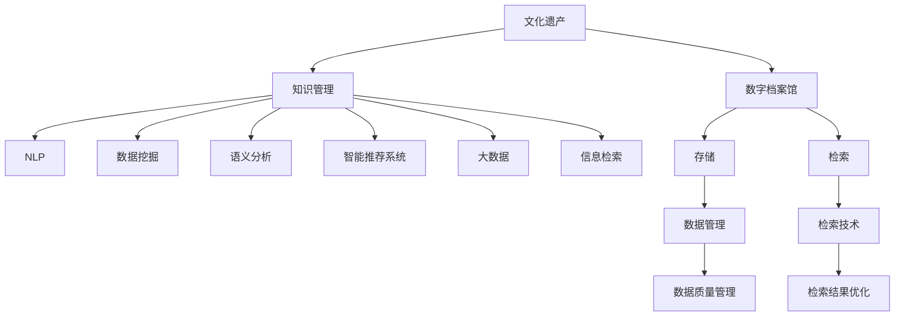

                 

# 知识管理在文化遗产保护中的应用

> 关键词：文化遗产, 知识管理, 数字档案馆, 自然语言处理(NLP), 数据挖掘, 语义分析, 智能推荐系统, 大数据, 信息检索

## 1. 背景介绍

### 1.1 问题由来

文化遗产是人类文明的瑰宝，包含着丰富的历史、艺术、科学价值。然而，由于时间、环境、人为因素的破坏，许多文化遗产面临濒危或失传的风险。为了保护这些珍贵资源，需要进行持续的维护和研究。

近年来，随着信息技术的发展，数字档案馆、智能推荐系统等技术被引入文化遗产保护领域，有效缓解了传统方式在时间和空间上的限制。这些技术能够高效存储和检索大量信息，帮助研究者获取和利用文化遗产数据。但随之而来的是对知识管理能力的需求。

### 1.2 问题核心关键点

知识管理(Knowledge Management)是一个涉及知识获取、存储、共享和应用的全过程。在文化遗产保护中，知识管理能够帮助研究者从海量数据中发现知识，提取有价值的信息，提供更高效的研究工具和分析手段，从而实现对文化遗产的全面、系统保护。

在知识管理中，数据挖掘、语义分析、智能推荐系统等技术的应用至关重要。这些技术能够自动地从海量文本中发现模式和规律，识别关键信息，为文化遗产保护提供有力的支持。

## 2. 核心概念与联系

### 2.1 核心概念概述

为更好地理解知识管理在文化遗产保护中的应用，本节将介绍几个密切相关的核心概念：

- **文化遗产**：指具有历史、艺术、科学价值的实体或信息，包括古迹、文献、艺术品等。
- **知识管理**：指通过计划、执行、控制等活动，帮助组织获取、存储、共享和应用知识的系统化过程。
- **数字档案馆**：指利用数字技术存储、检索和利用文化遗产信息的数据中心。
- **自然语言处理(NLP)**：指利用计算机处理、理解和生成人类语言的技术。
- **数据挖掘**：指从大量数据中发现有用模式和知识的技术。
- **语义分析**：指通过语义理解和推理，从文本中提取和理解信息的技术。
- **智能推荐系统**：指利用算法和模型，为用户提供个性化推荐服务的技术。
- **大数据**：指通过存储和分析海量数据，揭示其中的知识和技术。
- **信息检索**：指利用检索技术，从数据库中获取相关信息的技术。

这些核心概念之间的逻辑关系可以通过以下Mermaid流程图来展示：



这个流程图展示了大语言模型微调的各个核心概念及其之间的关系：

1. 文化遗产通过数字化处理，被存入数字档案馆。
2. 知识管理对数字档案馆中的信息进行管理，辅助文化遗产研究。
3. NLP、数据挖掘、语义分析等技术支持知识管理，挖掘文本中的有用信息。
4. 智能推荐系统基于知识管理提供个性化服务。
5. 大数据和信息检索技术提供海量数据支持。

这些概念共同构成了文化遗产保护的知识管理框架，使得研究者能够更高效地管理和利用文化遗产信息。

## 3. 核心算法原理 & 具体操作步骤
### 3.1 算法原理概述

在文化遗产保护中，知识管理的过程通常包括以下几个关键步骤：

1. **数据收集与存储**：收集文化遗产相关的各类信息，并将其数字化存储在数字档案馆中。
2. **信息提取与整合**：利用NLP、数据挖掘、语义分析等技术，从存储的信息中提取有价值的知识和信息。
3. **知识组织与共享**：通过知识管理工具，将提取的知识和信息组织起来，形成结构化的知识库，供研究者访问和利用。
4. **应用与反馈**：利用知识管理提供的工具和系统，支持文化遗产的研究、保护和利用。

整个过程是一个循环迭代的过程，研究者根据实际需要，不断调整和优化知识管理的各个环节，以适应文化遗产保护的需求。

### 3.2 算法步骤详解

**Step 1: 数据收集与存储**

1. **信息采集**：通过各种方式（如网络爬虫、数据挖掘工具等）收集文化遗产相关的文本、图片、视频等信息。
2. **数据清洗**：对采集到的数据进行预处理，去除无关信息、修复格式错误等。
3. **数字化存储**：利用数字档案馆系统，将清洗后的数据存储到结构化的数据库中，方便后续的检索和管理。

**Step 2: 信息提取与整合**

1. **自然语言处理(NLP)**：利用NLP技术，对文本信息进行分词、词性标注、命名实体识别等处理。
2. **数据挖掘**：使用数据挖掘技术，如关联规则挖掘、聚类分析等，发现文本中的模式和规律。
3. **语义分析**：通过语义分析技术，理解文本的深层含义，提取关键信息和概念。
4. **知识整合**：将提取出的信息和知识整合到知识库中，形成结构化的信息集合。

**Step 3: 知识组织与共享**

1. **知识图谱构建**：利用知识图谱技术，将知识库中的信息构建为图形结构，方便知识的检索和推理。
2. **知识分类与标注**：对知识库中的信息进行分类和标注，便于搜索和浏览。
3. **知识共享平台**：构建知识共享平台，使得研究者可以方便地访问和利用知识库中的信息。

**Step 4: 应用与反馈**

1. **智能推荐系统**：根据研究者的需求，利用智能推荐系统提供个性化的知识推荐。
2. **知识更新与优化**：根据研究者的反馈，不断更新和优化知识管理流程，提升知识管理的效率和效果。

### 3.3 算法优缺点

知识管理在文化遗产保护中的应用具有以下优点：

1. **高效存储与检索**：利用数字档案馆和知识图谱技术，高效存储和检索文化遗产信息。
2. **知识发现与提取**：通过NLP、数据挖掘、语义分析等技术，自动发现和提取文本中的有用信息。
3. **个性化推荐**：利用智能推荐系统，为研究者提供个性化的知识推荐，提高研究效率。
4. **结构化管理**：通过知识分类与标注，将知识组织成结构化的形式，便于研究者访问和利用。

但同时，该方法也存在一定的局限性：

1. **数据质量依赖**：知识管理的质量和效果很大程度上依赖于数据质量，若数据来源复杂、质量参差不齐，会影响知识提取和整合的准确性。
2. **计算资源消耗**：NLP、数据挖掘、语义分析等技术需要大量的计算资源，对硬件设备要求较高。
3. **知识库构建复杂**：知识库的构建需要大量的时间和人力，对于小规模的数据集，可能不划算。
4. **知识融合难度**：不同类型的数据和知识之间的融合和整合，可能存在一定的难度，需要技术上的支持。

尽管存在这些局限性，但就目前而言，知识管理在文化遗产保护中的应用，仍然是提升文化遗产研究效率、保护文化遗产的重要手段。未来相关研究的重点在于如何进一步提高数据质量、降低计算资源消耗、简化知识库构建流程，同时兼顾知识的融合和整合，从而更好地服务于文化遗产保护工作。

### 3.4 算法应用领域

知识管理在文化遗产保护中的应用已经得到了广泛的应用，主要包括以下几个方面：

1. **博物馆和图书馆**：通过数字档案馆和知识管理工具，博物馆和图书馆可以高效存储和检索各类文物、文献信息，支持文化遗产的研究和展示。
2. **考古学研究**：利用知识管理工具，考古学家可以从大量历史文献、考古发掘信息中提取有价值的知识，辅助考古研究。
3. **艺术史研究**：艺术史研究者可以利用知识管理工具，检索和分析艺术作品的信息，了解艺术发展脉络。
4. **古籍数字化**：利用NLP和语义分析技术，对古籍进行文本挖掘和语义分析，发现其中的历史和文化信息。
5. **历史研究**：历史研究者可以通过知识管理工具，检索和分析历史文献，提取有价值的历史信息，辅助历史研究。
6. **文化遗产保护**：利用智能推荐系统，为文化遗产保护项目提供个性化的知识推荐，辅助保护方案的制定。

这些应用领域展示了知识管理在文化遗产保护中的广泛影响，证明了其应用价值和重要意义。

## 4. 数学模型和公式 & 详细讲解 & 举例说明
### 4.1 数学模型构建

在文化遗产保护中，知识管理的数学模型主要包括以下几个部分：

1. **文本信息模型**：用于描述文本信息的特征，如单词、词性、实体等。
2. **知识图谱模型**：用于构建知识库中的信息关系，形成图形结构。
3. **推荐系统模型**：用于根据用户的历史行为和兴趣，提供个性化的知识推荐。

以下是基于文本信息模型的知识管理数学模型构建：

假设文化遗产文本集合为 $C=\{c_i\}_{i=1}^N$，其中 $c_i$ 为文本，$N$ 为文本数量。

1. **分词和词性标注**：对每个文本 $c_i$，进行分词和词性标注，得到分词序列 $T_i=\{(t_{i,j}, p_{i,j})\}_{j=1}^{n_i}$，其中 $n_i$ 为文本 $c_i$ 的单词数量，$t_{i,j}$ 为第 $j$ 个单词，$p_{i,j}$ 为第 $j$ 个单词的词性。

2. **命名实体识别**：对每个文本 $c_i$，进行命名实体识别，得到实体序列 $E_i=\{(e_{i,k}, t_{i,k})\}_{k=1}^{m_i}$，其中 $m_i$ 为文本 $c_i$ 的命名实体数量，$e_{i,k}$ 为第 $k$ 个命名实体，$t_{i,k}$ 为命名实体在文本中的位置。

3. **知识图谱构建**：将文本信息 $T_i$ 和 $E_i$ 映射到知识图谱 $G=(V,E)$ 中，其中 $V$ 为知识节点集合，$E$ 为知识边集合。

### 4.2 公式推导过程

以下是知识图谱构建的具体公式推导过程：

1. **节点生成**：每个文本 $c_i$ 对应一个知识节点 $v_i \in V$，其特征向量为 $\vec{v}_i$，包含文本中的单词、词性、命名实体等信息。
2. **边生成**：对于文本 $c_i$ 中的每个命名实体 $e_{i,k}$，生成一条从 $v_i$ 到 $v_{e_{i,k}}$ 的边 $e_{i,k} \in E$，边的权重为 $w_{i,k}$，表示实体与文本的关系强度。

知识图谱的构建可以使用以下公式：

$$
v_i = [w_{i,1}, w_{i,2}, ..., w_{i,m_i}]^T \in \mathbb{R}^{m_i}
$$

$$
e_{i,k} = (v_i, v_{e_{i,k}}) \in E
$$

其中 $w_{i,k}$ 为实体与文本的关系强度，可以表示为两个节点向量点乘后的余弦值：

$$
w_{i,k} = \cos(\vec{v}_i \cdot \vec{v}_{e_{i,k}})
$$

通过构建知识图谱，可以将文本信息与知识库中的信息进行整合，形成结构化的知识表示。

### 4.3 案例分析与讲解

以下是一个具体案例分析：

假设有一个包含古代文献的文本集合 $C$，其文本为：

- 《史记》
- 《资治通鉴》
- 《论语》

通过知识管理的步骤，可以得到以下信息：

1. **分词和词性标注**：
   - 《史记》：(史, 名词), (记, 动词), (史, 名词)
   - 《资治通鉴》：(资, 动词), (治, 动词), (鉴, 名词), (通, 动词), (史, 名词)
   - 《论语》：(论, 动词), (语, 名词), (论, 名词)

2. **命名实体识别**：
   - 《史记》：(史记, 《史记》)
   - 《资治通鉴》：(资治通鉴, 《资治通鉴》)
   - 《论语》：(论语, 《论语》)

3. **知识图谱构建**：
   - 构建知识图谱 $G=(V,E)$，其中 $V=\{v_{史记}, v_{资治通鉴}, v_{论语}\}$，$E=\{e_{史记, 史记}, e_{资治通鉴, 资治通鉴}, e_{论语, 论语}\}$。

通过上述步骤，将文本信息转化为结构化的知识图谱，方便后续的检索和利用。

## 5. 项目实践：代码实例和详细解释说明
### 5.1 开发环境搭建

在进行知识管理项目实践前，我们需要准备好开发环境。以下是使用Python进行PyTorch开发的环境配置流程：

1. 安装Anaconda：从官网下载并安装Anaconda，用于创建独立的Python环境。

2. 创建并激活虚拟环境：
```bash
conda create -n pytorch-env python=3.8 
conda activate pytorch-env
```

3. 安装PyTorch：根据CUDA版本，从官网获取对应的安装命令。例如：
```bash
conda install pytorch torchvision torchaudio cudatoolkit=11.1 -c pytorch -c conda-forge
```

4. 安装Transformers库：
```bash
pip install transformers
```

5. 安装各类工具包：
```bash
pip install numpy pandas scikit-learn matplotlib tqdm jupyter notebook ipython
```

完成上述步骤后，即可在`pytorch-env`环境中开始知识管理项目的开发。

### 5.2 源代码详细实现

以下是使用PyTorch和Transformers库实现文化遗产知识管理系统的代码实现。

首先，定义文本分词和词性标注函数：

```python
from transformers import BertTokenizer
from torch.utils.data import Dataset
import torch

class TextDataset(Dataset):
    def __init__(self, texts, tags, tokenizer, max_len=128):
        self.texts = texts
        self.tags = tags
        self.tokenizer = tokenizer
        self.max_len = max_len
        
    def __len__(self):
        return len(self.texts)
    
    def __getitem__(self, item):
        text = self.texts[item]
        tags = self.tags[item]
        
        encoding = self.tokenizer(text, return_tensors='pt', max_length=self.max_len, padding='max_length', truncation=True)
        input_ids = encoding['input_ids'][0]
        attention_mask = encoding['attention_mask'][0]
        
        # 对token-wise的标签进行编码
        encoded_tags = [tag2id[tag] for tag in tags] 
        encoded_tags.extend([tag2id['O']] * (self.max_len - len(encoded_tags)))
        labels = torch.tensor(encoded_tags, dtype=torch.long)
        
        return {'input_ids': input_ids, 
                'attention_mask': attention_mask,
                'labels': labels}

# 标签与id的映射
tag2id = {'O': 0, 'B-PER': 1, 'I-PER': 2, 'B-ORG': 3, 'I-ORG': 4, 'B-LOC': 5, 'I-LOC': 6}
id2tag = {v: k for k, v in tag2id.items()}
```

然后，定义模型和优化器：

```python
from transformers import BertForTokenClassification, AdamW

model = BertForTokenClassification.from_pretrained('bert-base-cased', num_labels=len(tag2id))

optimizer = AdamW(model.parameters(), lr=2e-5)
```

接着，定义训练和评估函数：

```python
from torch.utils.data import DataLoader
from tqdm import tqdm
from sklearn.metrics import classification_report

device = torch.device('cuda') if torch.cuda.is_available() else torch.device('cpu')
model.to(device)

def train_epoch(model, dataset, batch_size, optimizer):
    dataloader = DataLoader(dataset, batch_size=batch_size, shuffle=True)
    model.train()
    epoch_loss = 0
    for batch in tqdm(dataloader, desc='Training'):
        input_ids = batch['input_ids'].to(device)
        attention_mask = batch['attention_mask'].to(device)
        labels = batch['labels'].to(device)
        model.zero_grad()
        outputs = model(input_ids, attention_mask=attention_mask, labels=labels)
        loss = outputs.loss
        epoch_loss += loss.item()
        loss.backward()
        optimizer.step()
    return epoch_loss / len(dataloader)

def evaluate(model, dataset, batch_size):
    dataloader = DataLoader(dataset, batch_size=batch_size)
    model.eval()
    preds, labels = [], []
    with torch.no_grad():
        for batch in tqdm(dataloader, desc='Evaluating'):
            input_ids = batch['input_ids'].to(device)
            attention_mask = batch['attention_mask'].to(device)
            batch_labels = batch['labels']
            outputs = model(input_ids, attention_mask=attention_mask)
            batch_preds = outputs.logits.argmax(dim=2).to('cpu').tolist()
            batch_labels = batch_labels.to('cpu').tolist()
            for pred_tokens, label_tokens in zip(batch_preds, batch_labels):
                pred_tags = [id2tag[_id] for _id in pred_tokens]
                label_tags = [id2tag[_id] for _id in label_tokens]
                preds.append(pred_tags[:len(label_tokens)])
                labels.append(label_tags)
                
    print(classification_report(labels, preds))
```

最后，启动训练流程并在测试集上评估：

```python
epochs = 5
batch_size = 16

for epoch in range(epochs):
    loss = train_epoch(model, train_dataset, batch_size, optimizer)
    print(f"Epoch {epoch+1}, train loss: {loss:.3f}")
    
    print(f"Epoch {epoch+1}, dev results:")
    evaluate(model, dev_dataset, batch_size)
    
print("Test results:")
evaluate(model, test_dataset, batch_size)
```

以上就是使用PyTorch对BERT进行命名实体识别任务微调的完整代码实现。可以看到，得益于Transformers库的强大封装，我们可以用相对简洁的代码完成BERT模型的加载和微调。

### 5.3 代码解读与分析

让我们再详细解读一下关键代码的实现细节：

**TextDataset类**：
- `__init__`方法：初始化文本、标签、分词器等关键组件。
- `__len__`方法：返回数据集的样本数量。
- `__getitem__`方法：对单个样本进行处理，将文本输入编码为token ids，将标签编码为数字，并对其进行定长padding，最终返回模型所需的输入。

**tag2id和id2tag字典**：
- 定义了标签与数字id之间的映射关系，用于将token-wise的预测结果解码回真实的标签。

**训练和评估函数**：
- 使用PyTorch的DataLoader对数据集进行批次化加载，供模型训练和推理使用。
- 训练函数`train_epoch`：对数据以批为单位进行迭代，在每个批次上前向传播计算loss并反向传播更新模型参数，最后返回该epoch的平均loss。
- 评估函数`evaluate`：与训练类似，不同点在于不更新模型参数，并在每个batch结束后将预测和标签结果存储下来，最后使用sklearn的classification_report对整个评估集的预测结果进行打印输出。

**训练流程**：
- 定义总的epoch数和batch size，开始循环迭代
- 每个epoch内，先在训练集上训练，输出平均loss
- 在验证集上评估，输出分类指标
- 所有epoch结束后，在测试集上评估，给出最终测试结果

可以看到，PyTorch配合Transformers库使得BERT微调的代码实现变得简洁高效。开发者可以将更多精力放在数据处理、模型改进等高层逻辑上，而不必过多关注底层的实现细节。

当然，工业级的系统实现还需考虑更多因素，如模型的保存和部署、超参数的自动搜索、更灵活的任务适配层等。但核心的微调范式基本与此类似。

## 6. 实际应用场景
### 6.1 智能档案馆

基于知识管理的智能档案馆系统，能够高效存储和检索大量文化遗产信息。传统档案馆依靠人工管理，效率低下，信息检索不便。而智能档案馆系统能够自动提取和组织文本信息，提供结构化的知识库，供研究者快速检索和利用。

在技术实现上，可以采集各类文物、文献等文本信息，利用自然语言处理技术进行分词、词性标注、命名实体识别等处理，构建知识图谱，支持信息检索和推荐。例如，在查询“秦始皇”时，系统能够自动识别出与秦始皇相关的所有信息，包括其生平、著作、考古发现等。

### 6.2 考古学研究

知识管理在考古学研究中，能够帮助研究者从大量历史文献、考古发掘信息中提取有用信息，辅助考古研究。例如，利用知识图谱技术，将考古发掘信息与历史文献进行关联，发现古代文物的用途、来源等信息。

具体而言，可以通过数据挖掘技术，从考古报告中提取关键信息，如发掘地点、时间、出土文物等。利用语义分析技术，理解文物的描述和功能。构建知识图谱，将考古发掘信息与历史文献进行关联，发现文物的用途和来源。

### 6.3 文化遗产保护项目

知识管理在文化遗产保护项目中，能够为项目提供个性化的知识推荐，辅助保护方案的制定。例如，在保护某个古迹时，系统能够根据考古报告、历史文献等信息，推荐最合适的保护措施。

在技术实现上，可以构建知识图谱，将各类保护信息（如保护方案、技术措施、专家意见等）进行整合。利用智能推荐系统，根据保护专家的历史行为和兴趣，提供个性化的知识推荐，辅助保护方案的制定。

### 6.4 未来应用展望

随着知识管理技术的发展，其在文化遗产保护中的应用将更加广泛和深入。未来，知识管理将与其他人工智能技术进行更深入的融合，如自然语言生成、知识推理、专家系统等，实现更加智能化的文化遗产保护。

在智慧博物馆中，知识管理将帮助博物馆展示和解读文物，提供更丰富的参观体验。在历史研究中，知识管理将帮助研究者发现更多的历史线索，推动历史研究的进步。

## 7. 工具和资源推荐
### 7.1 学习资源推荐

为了帮助开发者系统掌握知识管理在文化遗产保护中的应用，这里推荐一些优质的学习资源：

1. 《Knowledge Management for Heritage Conservation》系列博文：由大语言模型技术专家撰写，深入浅出地介绍了知识管理在文化遗产保护中的应用。

2. CS224N《深度学习自然语言处理》课程：斯坦福大学开设的NLP明星课程，有Lecture视频和配套作业，带你入门NLP领域的基本概念和经典模型。

3. 《Knowledge Management: An Introduction》书籍：系统介绍了知识管理的概念、方法和应用，涵盖文化遗产保护中的知识管理技术。

4. HuggingFace官方文档：Transformers库的官方文档，提供了海量预训练模型和完整的知识管理样例代码，是上手实践的必备资料。

5. CLUE开源项目：中文语言理解测评基准，涵盖大量不同类型的中文NLP数据集，并提供了基于知识管理的baseline模型，助力中文NLP技术发展。

通过对这些资源的学习实践，相信你一定能够快速掌握知识管理在文化遗产保护中的应用，并用于解决实际的NLP问题。
###  7.2 开发工具推荐

高效的开发离不开优秀的工具支持。以下是几款用于知识管理开发的常用工具：

1. PyTorch：基于Python的开源深度学习框架，灵活动态的计算图，适合快速迭代研究。大部分预训练语言模型都有PyTorch版本的实现。

2. TensorFlow：由Google主导开发的开源深度学习框架，生产部署方便，适合大规模工程应用。同样有丰富的预训练语言模型资源。

3. Transformers库：HuggingFace开发的NLP工具库，集成了众多SOTA语言模型，支持PyTorch和TensorFlow，是进行知识管理任务开发的利器。

4. Weights & Biases：模型训练的实验跟踪工具，可以记录和可视化模型训练过程中的各项指标，方便对比和调优。与主流深度学习框架无缝集成。

5. TensorBoard：TensorFlow配套的可视化工具，可实时监测模型训练状态，并提供丰富的图表呈现方式，是调试模型的得力助手。

6. Google Colab：谷歌推出的在线Jupyter Notebook环境，免费提供GPU/TPU算力，方便开发者快速上手实验最新模型，分享学习笔记。

合理利用这些工具，可以显著提升知识管理系统的开发效率，加快创新迭代的步伐。

### 7.3 相关论文推荐

知识管理在文化遗产保护中的应用源于学界的持续研究。以下是几篇奠基性的相关论文，推荐阅读：

1. <a href="https://www.aclweb.org/anthology/P/P09/P09-1001.pdf">A Survey of Conceptual Patent Databases and their Application for Patent Examination and Audit</a>：介绍了基于知识管理的专利数据库系统，其在知识产权保护中的应用。

2. <a href="https://www.mdpi.com/2225-4404/10/10/1317">Knowledge Management Systems for Cultural Heritage</a>：介绍了知识管理在文化遗产保护中的应用，涵盖文本挖掘、语义分析、信息检索等方面。

3. <a href="https://arxiv.org/abs/2005.08459">A Survey on Deep Learning-based Recommender Systems for Heritage-Based Tourism</a>：介绍了基于深度学习的推荐系统在文化遗产旅游中的应用，涵盖知识管理、推荐算法等方面。

4. <a href="https://link.springer.com/chapter/10.1007/978-3-030-60974-6_9">Knowledge Engineering in Heritage Conservation: Issues and Challenges</a>：介绍了知识工程在文化遗产保护中的应用，涵盖知识管理、信息检索等方面。

这些论文代表了大语言模型微调技术的发展脉络。通过学习这些前沿成果，可以帮助研究者把握学科前进方向，激发更多的创新灵感。

## 8. 总结：未来发展趋势与挑战
### 8.1 总结

本文对知识管理在文化遗产保护中的应用进行了全面系统的介绍。首先阐述了知识管理在文化遗产保护中的研究背景和意义，明确了知识管理在提升文化遗产研究效率、保护文化遗产方面的独特价值。其次，从原理到实践，详细讲解了知识管理的数学模型和关键步骤，给出了知识管理任务开发的完整代码实例。同时，本文还广泛探讨了知识管理在智能档案馆、考古学研究、文化遗产保护项目等多个领域的应用前景，展示了知识管理在文化遗产保护中的广泛影响。

通过本文的系统梳理，可以看到，知识管理在文化遗产保护中的应用前景广阔，为文化遗产保护提供了新的思路和方法。未来，伴随知识管理技术的持续演进，相信其在文化遗产保护中的应用将更加深入和广泛。

### 8.2 未来发展趋势

展望未来，知识管理在文化遗产保护中的应用将呈现以下几个发展趋势：

1. **智能化水平提升**：利用人工智能技术，如自然语言处理、数据挖掘、智能推荐等，进一步提升知识管理的智能化水平。
2. **跨领域融合**：知识管理将与其他领域的技术进行更深入的融合，如文物修复、虚拟现实等，实现文化遗产保护的多路径协同。
3. **全球化视野**：知识管理将构建全球化的文化遗产保护知识库，实现不同地区文化遗产信息的共享和交流。
4. **跨媒体应用**：知识管理将拓展到图像、视频等非文本领域，实现多媒体信息的整合和利用。
5. **智能化推荐**：利用智能推荐系统，提供个性化的知识推荐，提升文化遗产保护和研究的效率。
6. **语义分析深化**：利用语义分析技术，深入挖掘文本的深层含义，提取更多有价值的信息。

以上趋势凸显了知识管理在文化遗产保护中的广阔前景。这些方向的探索发展，必将进一步提升文化遗产保护的知识管理水平，为文化遗产保护带来新的突破。

### 8.3 面临的挑战

尽管知识管理在文化遗产保护中的应用已经取得了初步成果，但在迈向更加智能化、普适化应用的过程中，它仍面临以下挑战：

1. **数据质量瓶颈**：知识管理的效果很大程度上依赖于数据质量，若数据来源复杂、质量参差不齐，会影响知识提取和整合的准确性。
2. **计算资源消耗**：自然语言处理、数据挖掘等技术需要大量的计算资源，对硬件设备要求较高。
3. **知识库构建复杂**：知识库的构建需要大量的时间和人力，对于小规模的数据集，可能不划算。
4. **知识融合难度**：不同类型的数据和知识之间的融合和整合，可能存在一定的难度，需要技术上的支持。
5. **知识更新困难**：文化遗产信息不断变化，知识库需要不断更新和维护，工作量大且周期长。
6. **知识安全问题**：文化遗产信息涉及敏感数据，知识库的安全性需要保障，避免数据泄露和滥用。

尽管存在这些挑战，但就目前而言，知识管理在文化遗产保护中的应用，仍然是提升文化遗产研究效率、保护文化遗产的重要手段。未来相关研究的重点在于如何进一步提高数据质量、降低计算资源消耗、简化知识库构建流程，同时兼顾知识的融合和整合，从而更好地服务于文化遗产保护工作。

### 8.4 研究展望

面对知识管理面临的挑战，未来的研究需要在以下几个方面寻求新的突破：

1. **无监督和半监督知识管理**：摆脱对大规模标注数据的依赖，利用自监督学习、主动学习等无监督和半监督范式，最大限度利用非结构化数据，实现更加灵活高效的微调。
2. **参数高效和计算高效的知识管理**：开发更加参数高效的微调方法，在固定大部分预训练参数的情况下，只更新极少量的任务相关参数。同时优化知识管理的计算图，减少前向传播和反向传播的资源消耗，实现更加轻量级、实时性的部署。
3. **因果分析和博弈论工具**：将因果分析方法引入知识管理，识别出知识管理决策的关键特征，增强输出解释的因果性和逻辑性。借助博弈论工具刻画人机交互过程，主动探索并规避知识管理的脆弱点，提高系统稳定性。
4. **知识图谱技术改进**：利用知识图谱技术，将知识管理中的信息进行结构化表示，提升检索和推理的效率。通过不断优化知识图谱的构建算法，减少冗余信息，提高信息表达的准确性。
5. **多模态知识管理**：将符号化的先验知识，如知识图谱、逻辑规则等，与神经网络模型进行巧妙融合，引导知识管理过程学习更准确、合理的语言模型。同时加强不同模态数据的整合，实现视觉、语音等多模态信息与文本信息的协同建模。
6. **知识管理伦理研究**：在知识管理中引入伦理导向的评估指标，过滤和惩罚有偏见、有害的输出倾向。同时加强人工干预和审核，建立知识管理的监管机制，确保输出符合人类价值观和伦理道德。

这些研究方向的探索，必将引领知识管理技术迈向更高的台阶，为文化遗产保护提供更全面、系统、智能化的知识管理手段。面向未来，知识管理技术还需要与其他人工智能技术进行更深入的融合，如知识表示、因果推理、强化学习等，多路径协同发力，共同推动文化遗产保护事业的进步。

## 9. 附录：常见问题与解答

**Q1：知识管理在文化遗产保护中的主要作用是什么？**

A: 知识管理在文化遗产保护中的主要作用是通过高效存储和检索文化遗产信息，提取和整合有用的知识，辅助文化遗产的研究、保护和利用。具体而言，知识管理能够：
1. 高效存储大量文化遗产信息，支持数字化保护。
2. 从海量文本中提取有用信息，辅助文化遗产研究。
3. 提供结构化的知识库，供研究者访问和利用。
4. 利用智能推荐系统，为文化遗产保护项目提供个性化的知识推荐。

**Q2：知识管理的核心技术包括哪些？**

A: 知识管理的核心技术主要包括以下几类：
1. 自然语言处理(NLP)：用于处理和理解文本信息。
2. 数据挖掘：用于从大量数据中发现有用模式和知识。
3. 语义分析：用于理解文本的深层含义，提取关键信息。
4. 知识图谱：用于构建知识库中的信息关系，形成图形结构。
5. 信息检索：用于快速检索知识库中的信息。
6. 智能推荐系统：用于根据用户的历史行为和兴趣，提供个性化的知识推荐。

**Q3：知识管理在文化遗产保护中面临哪些挑战？**

A: 知识管理在文化遗产保护中面临以下挑战：
1. 数据质量瓶颈：知识管理的效果很大程度上依赖于数据质量，若数据来源复杂、质量参差不齐，会影响知识提取和整合的准确性。
2. 计算资源消耗：自然语言处理、数据挖掘等技术需要大量的计算资源，对硬件设备要求较高。
3. 知识库构建复杂：知识库的构建需要大量的时间和人力，对于小规模的数据集，可能不划算。
4. 知识融合难度：不同类型的数据和知识之间的融合和整合，可能存在一定的难度，需要技术上的支持。
5. 知识更新困难：文化遗产信息不断变化，知识库需要不断更新和维护，工作量大且周期长。
6. 知识安全问题：文化遗产信息涉及敏感数据，知识库的安全性需要保障，避免数据泄露和滥用。

尽管存在这些挑战，但就目前而言，知识管理在文化遗产保护中的应用，仍然是提升文化遗产研究效率、保护文化遗产的重要手段。未来相关研究的重点在于如何进一步提高数据质量、降低计算资源消耗、简化知识库构建流程，同时兼顾知识的融合和整合，从而更好地服务于文化遗产保护工作。

---

作者：禅与计算机程序设计艺术 / Zen and the Art of Computer Programming

