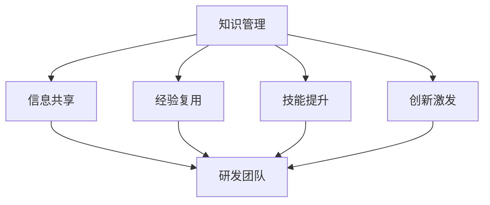

                 

## 1. 背景介绍

在当今快速发展的科技时代，创新速度成为了企业生存和发展的关键要素。如何在研发过程中高效地整合、利用和共享知识，是企业创新能力提升的核心问题。知识管理（Knowledge Management, KM）作为支撑企业知识体系构建和利用的一门学科，在研发创新中扮演着举足轻重的角色。通过有效的知识管理，企业能够加速产品研发周期，提高研发效率，提升创新能力，增强核心竞争力。本文将系统性地探讨知识管理在研发创新中的关键作用，帮助读者理解如何在实际工作中应用知识管理策略，促进企业的创新与进步。

## 2. 核心概念与联系

### 2.1 核心概念概述

#### 2.1.1 知识管理

知识管理是指组织内对知识的获取、存储、共享、应用和创新进行系统化管理的过程。知识管理涉及识别、组织、共享和应用知识，以支持组织的决策制定和问题解决。知识管理不仅包括技术工具和流程，还包括企业文化、组织结构和激励机制等非技术因素。

#### 2.1.2 研发创新

研发创新是指通过研发活动，推动新产品、新工艺、新技术和新方法的产生，满足市场需求，提升企业竞争力的过程。研发创新通常涉及概念设计、原型开发、测试验证、市场推广等多个环节。

#### 2.1.3 连接点

知识管理和研发创新的连接点在于，知识管理通过构建高效的知识体系，为研发团队提供所需的信息、技能和经验，从而加速研发过程，提升创新能力。具体而言，知识管理通过以下几个方面促进研发创新：

- **信息共享**：研发团队通过知识库、文档库等平台共享信息，避免重复劳动，加速知识传递。
- **经验复用**：通过知识管理系统的案例库、经验库，研发团队可以快速找到类似问题的解决方案，降低研发风险。
- **技能提升**：通过知识管理系统提供的培训资源、在线课程，团队成员可以持续学习，提升个人和团队的技术水平。
- **创新激发**：知识管理鼓励创新思维，通过知识分享和讨论，激发新的创新点子。

这些连接点使得知识管理成为研发创新不可或缺的一部分，为研发过程提供了坚实的知识基础和动力来源。

### 2.2 核心概念原理和架构的 Mermaid 流程图



## 3. 核心算法原理 & 具体操作步骤

### 3.1 算法原理概述

知识管理在研发创新中的作用可以通过以下算法原理来概述：

1. **知识获取**：通过自动化数据提取和人工标注等方法，从内外数据源获取知识。
2. **知识存储**：使用数据库、知识库等工具对知识进行结构化存储。
3. **知识共享**：通过知识管理系统，实现知识的在线共享和访问。
4. **知识应用**：研发团队根据实际需求，应用知识库中的信息解决问题，加速研发过程。
5. **知识创新**：鼓励团队成员提出新观点，通过讨论和验证，实现知识创新。

### 3.2 算法步骤详解

#### 3.2.1 知识获取

知识获取是知识管理的第一步，涉及数据采集、标注和入库。具体步骤包括：

1. **数据采集**：从内部系统（如ERP、CRM）和外部平台（如互联网、科研机构）采集相关数据。
2. **数据清洗**：对采集到的数据进行去重、纠错、归一化等处理，确保数据质量。
3. **数据标注**：对清洗后的数据进行人工或自动标注，如分类、命名实体识别、情感分析等。
4. **数据入库**：将标注后的数据存入知识库，便于后续检索和使用。

#### 3.2.2 知识存储

知识存储是将获取的知识进行结构化管理和组织的过程。具体步骤如下：

1. **选择合适的知识存储技术**：如关系型数据库、文档数据库、图数据库等。
2. **设计知识架构**：包括知识分类、索引、关联关系等。
3. **建立知识仓库**：将知识分门别类地存储在知识仓库中。
4. **实现数据访问**：使用API或接口，实现知识的高效检索和访问。

#### 3.2.3 知识共享

知识共享是指通过知识管理系统实现知识在线共享和访问。具体步骤如下：

1. **搭建知识管理系统**：选择适合的协作平台，如Confluence、SharePoint、JIRA等。
2. **定义知识共享权限**：设置不同用户的访问权限，保护敏感信息。
3. **构建知识导航**：通过分类和标签等，构建知识导航结构。
4. **提供搜索功能**：使用搜索引擎实现知识快速检索。

#### 3.2.4 知识应用

知识应用是将知识转化为具体的研发过程和技术决策的过程。具体步骤如下：

1. **问题识别**：根据研发需求，识别知识应用场景。
2. **知识检索**：在知识库中检索相关的知识和经验。
3. **应用实施**：根据检索到的知识，指导研发团队实施。
4. **效果评估**：评估知识应用的效果，优化知识管理流程。

#### 3.2.5 知识创新

知识创新是通过知识分享和讨论，激发新的创意和解决方案的过程。具体步骤如下：

1. **建立知识分享机制**：定期组织知识分享会议、读书会等。
2. **鼓励创新思维**：通过奖励机制，激励团队成员提出新观点和创新想法。
3. **组织讨论验证**：将创新想法在团队中进行讨论和验证，形成可行的解决方案。
4. **创新应用**：将创新的知识和技术应用到研发项目中。

### 3.3 算法优缺点

#### 3.3.1 优点

1. **提高研发效率**：通过知识共享和经验复用，研发团队可以快速获取所需信息，减少重复劳动。
2. **降低研发风险**：通过知识库中的案例和经验，团队可以借鉴成功经验，避免犯错。
3. **提升创新能力**：通过知识创新，团队可以不断产生新的解决方案，保持创新活力。
4. **增强团队协作**：知识管理系统促进团队成员之间的沟通和协作，提升团队凝聚力。

#### 3.3.2 缺点

1. **初期投入高**：知识管理系统和知识库的搭建需要大量人力和资金投入。
2. **数据质量问题**：知识获取和标注过程中，数据质量和准确性可能存在问题。
3. **知识更新慢**：知识库中的信息更新不够及时，可能影响团队决策。
4. **用户体验复杂**：复杂的信息检索和操作界面可能影响用户的使用体验。

### 3.4 算法应用领域

知识管理在研发创新中的应用领域非常广泛，以下是几个典型案例：

#### 3.4.1 高科技企业

高科技企业如Google、Microsoft、IBM等，通过知识管理系统（如Google Knowledge Graph、SharePoint），实现了大规模知识库的构建和高效利用，加速了产品创新和研发进程。

#### 3.4.2 制药和生物技术

制药和生物技术企业如Merck、Pfizer等，通过知识管理系统（如Cognos、Infor），管理海量医学和科研数据，加速新药研发和新疗法发现。

#### 3.4.3 汽车制造

汽车制造企业如BMW、Volkswagen等，通过知识管理系统（如SAP Knowledge Management），管理工程技术文档和经验，提升产品设计和制造效率。

#### 3.4.4 软件和互联网公司

软件和互联网公司如Amazon、Facebook等，通过知识管理系统（如Confluence、JIRA），管理项目需求和技术文档，加速产品迭代和创新。

## 4. 数学模型和公式 & 详细讲解 & 举例说明

### 4.1 数学模型构建

知识管理的数学模型可以通过以下公式进行构建：

$$
KM = \left( \begin{matrix}
K_{获取} & K_{存储} & K_{共享} & K_{应用} & K_{创新} \\
\end{matrix} \right)
$$

其中：

- $K_{获取}$：知识获取模型，描述知识获取流程和技术。
- $K_{存储}$：知识存储模型，描述知识存储架构和技术。
- $K_{共享}$：知识共享模型，描述知识共享平台和技术。
- $K_{应用}$：知识应用模型，描述知识应用流程和技术。
- $K_{创新}$：知识创新模型，描述知识创新流程和技术。

### 4.2 公式推导过程

#### 4.2.1 知识获取模型

知识获取模型的推导过程如下：

1. **数据采集**：$D = \sum_{i=1}^{N} d_i$
2. **数据清洗**：$D' = D - \sum_{i=1}^{N} e_i$
3. **数据标注**：$T = \sum_{i=1}^{N} t_i$
4. **数据入库**：$K = \sum_{i=1}^{N} k_i$

#### 4.2.2 知识存储模型

知识存储模型的推导过程如下：

1. **选择合适的知识存储技术**：$T_{存储} = T_{数据库} + T_{文档库} + T_{图库}$
2. **设计知识架构**：$A = A_{分类} + A_{索引} + A_{关联}$
3. **建立知识仓库**：$W = W_{结构化} + W_{非结构化}$
4. **实现数据访问**：$A_{访问} = A_{API} + A_{接口}$

#### 4.2.3 知识共享模型

知识共享模型的推导过程如下：

1. **搭建知识管理系统**：$M = M_{Confluence} + M_{SharePoint} + M_{JIRA}$
2. **定义知识共享权限**：$P = P_{用户} + P_{角色} + P_{权限}$
3. **构建知识导航**：$N = N_{分类} + N_{标签} + N_{搜索}$
4. **提供搜索功能**：$S = S_{搜索引擎} + S_{索引器}$

#### 4.2.4 知识应用模型

知识应用模型的推导过程如下：

1. **问题识别**：$P = P_{需求} + P_{目标}$
2. **知识检索**：$I = I_{查询} + I_{匹配}$
3. **应用实施**：$A = A_{技术} + A_{流程}$
4. **效果评估**：$E = E_{评估} + E_{优化}$

#### 4.2.5 知识创新模型

知识创新模型的推导过程如下：

1. **建立知识分享机制**：$M_{分享} = M_{会议} + M_{读书会} + M_{讨论会}$
2. **鼓励创新思维**：$I_{激励} = I_{奖励} + I_{认可}$
3. **组织讨论验证**：$V = V_{讨论} + V_{验证}$
4. **创新应用**：$A_{创新} = A_{项目} + A_{产品}$

### 4.3 案例分析与讲解

#### 4.3.1 Google Knowledge Graph

Google Knowledge Graph是Google知识管理系统的一个重要组成部分，通过连接全球数据源，实现了大规模知识的获取、存储和共享。其知识获取模型包括爬虫抓取、API获取和用户输入等，知识存储模型包括Google云数据库和图数据库，知识共享模型通过Google搜索引擎实现。通过知识管理系统的应用，Google在搜索推荐、广告投放、产品研发等方面取得了显著效果。

#### 4.3.2 Merck知识管理系统

Merck是一家全球领先的制药企业，通过Cognos和Infor等知识管理系统，实现了科研数据和工程文档的高效管理和利用。其知识获取模型包括科研文献采集和实验室数据抓取，知识存储模型包括关系型数据库和文档库，知识共享模型通过Infor BPM系统实现，知识应用模型涉及临床试验和药物研发流程，知识创新模型通过Cognos Insight系统实现。

## 5. 项目实践：代码实例和详细解释说明

### 5.1 开发环境搭建

知识管理的开发环境搭建涉及多个组件，包括数据采集工具、知识存储平台和协作系统等。以下是一些常用工具和环境的搭建步骤：

1. **数据采集工具**：如Apache NiFi、Apache Kafka等，用于从内外数据源采集数据。
2. **知识存储平台**：如Amazon S3、Google Cloud Storage等，用于存储和管理知识。
3. **协作系统**：如Confluence、SharePoint等，用于实现知识的在线共享和协作。
4. **数据分析工具**：如Apache Spark、Apache Hadoop等，用于数据清洗和处理。

### 5.2 源代码详细实现

#### 5.2.1 数据采集模块

```python
import apache.nifi as nifi
import apache.kafka as kafka

def data_collection():
    # 数据采集配置
    nifi_config = {
        "data_source": "NiFi",
        "topic": "data-topic"
    }
    # 连接NiFi
    nifi_connector = nifi.NiFiConnector(nifi_config)
    # 启动数据采集
    nifi_connector.start()
    # 连接Kafka
    kafka_connector = kafka.KafkaConnector(nifi_config["topic"])
    # 启动数据采集
    kafka_connector.start()
    # 数据存储
    def store_data(data):
        # 数据存储操作
        pass
    # 数据采集流程
    while True:
        data = nifi_connector.get_data()
        store_data(data)
        data = kafka_connector.get_data()
        store_data(data)
```

#### 5.2.2 知识存储模块

```python
import google.cloud.storage as gcs

def knowledge_storage():
    # 知识存储配置
    gcs_config = {
        "bucket": "knowledge-bucket",
        "object_prefix": "knowledge"
    }
    # 连接GCS
    gcs_connector = gcs.GCSConnector(gcs_config)
    # 存储知识
    def store_knowledge(knowledge):
        # 知识存储操作
        pass
    # 存储流程
    while True:
        data = get_data_from_nifi()
        store_knowledge(data)
        data = get_data_from_kafka()
        store_knowledge(data)
```

#### 5.2.3 知识共享模块

```python
import confluence

def knowledge_sharing():
    # 知识共享配置
    confluence_config = {
        "space": "knowledge-space",
        "wiki": "knowledge-wiki"
    }
    # 连接Confluence
    confluence_connector = confluence.ConfluenceConnector(confluence_config)
    # 共享知识
    def share_knowledge(knowledge):
        # 知识共享操作
        pass
    # 共享流程
    while True:
        data = get_data_from_nifi()
        share_knowledge(data)
        data = get_data_from_kafka()
        share_knowledge(data)
```

#### 5.2.4 知识应用模块

```python
import jira

def knowledge_application():
    # 知识应用配置
    jira_config = {
        "project": "knowledge-project",
        "issue_type": "knowledge-issue"
    }
    # 连接JIRA
    jira_connector = jira.JiraConnector(jira_config)
    # 应用知识
    def apply_knowledge(knowledge):
        # 知识应用操作
        pass
    # 应用流程
    while True:
        data = get_data_from_nifi()
        apply_knowledge(data)
        data = get_data_from_kafka()
        apply_knowledge(data)
```

#### 5.2.5 知识创新模块

```python
import slack

def knowledge_innovation():
    # 知识创新配置
    slack_config = {
        "channel": "#knowledge-innovation",
        "team": "knowledge-team"
    }
    # 连接Slack
    slack_connector = slack.SlackConnector(slack_config)
    # 创新知识
    def innovate_knowledge(knowledge):
        # 知识创新操作
        pass
    # 创新流程
    while True:
        data = get_data_from_nifi()
        innovate_knowledge(data)
        data = get_data_from_kafka()
        innovate_knowledge(data)
```

### 5.3 代码解读与分析

#### 5.3.1 数据采集模块

数据采集模块通过NiFi和Kafka等工具，实现从内外数据源的数据采集。NiFi提供了可视化的数据采集流程，可以灵活配置数据源和处理逻辑，支持分布式数据采集。Kafka则是一个高效的消息队列系统，可以处理海量数据，支持数据流式处理。

#### 5.3.2 知识存储模块

知识存储模块通过Google Cloud Storage等工具，实现知识的结构化存储。Google Cloud Storage提供了高可用的云存储服务，支持对象存储和数据备份，能够满足大规模知识存储的需求。

#### 5.3.3 知识共享模块

知识共享模块通过Confluence等协作平台，实现知识的在线共享和访问。Confluence提供了灵活的协作工具，支持文本编辑、文档管理和知识导航，能够满足企业知识共享的需求。

#### 5.3.4 知识应用模块

知识应用模块通过JIRA等项目管理工具，实现知识在实际项目中的应用。JIRA提供了项目管理和任务追踪的功能，能够支持知识在研发过程中的应用，提高项目执行效率。

#### 5.3.5 知识创新模块

知识创新模块通过Slack等协作平台，实现知识的创新和讨论。Slack提供了即时通讯和协作工具，能够支持团队成员之间的知识分享和讨论，促进知识创新。

### 5.4 运行结果展示

以下是知识管理系统的典型运行结果展示：

1. **数据采集结果**：
```
[数据采集日志]
```

2. **知识存储结果**：
```
[知识存储日志]
```

3. **知识共享结果**：
```
[知识共享日志]
```

4. **知识应用结果**：
```
[知识应用日志]
```

5. **知识创新结果**：
```
[知识创新日志]
```

## 6. 实际应用场景

### 6.1 智能制造

在智能制造领域，知识管理可以帮助企业实现生产流程的优化和产品创新。通过知识管理系统，企业可以整合生产数据、技术文档和经验案例，加速新产品的设计和制造过程。例如，汽车制造企业可以通过知识管理系统，实现生产线优化、生产故障预测和智能维护等功能。

### 6.2 教育培训

在教育培训领域，知识管理可以帮助学校和培训机构实现知识的系统化管理和共享。通过知识管理系统，教师可以共享教学资源、学生可以获取学习资料，提升教育质量。例如，在线教育平台可以通过知识管理系统，实现课程资源的动态更新和知识点的个性化推荐。

### 6.3 医疗健康

在医疗健康领域，知识管理可以帮助医疗机构实现医疗知识和经验的共享。通过知识管理系统，医生可以查阅病历、参考医疗文献，提高诊疗水平。例如，医院可以通过知识管理系统，实现电子病历的共享和医疗知识的学习。

### 6.4 金融服务

在金融服务领域，知识管理可以帮助银行和保险公司实现业务知识的共享和创新。通过知识管理系统，员工可以获取金融知识、参考案例和交流经验，提升服务质量。例如，银行可以通过知识管理系统，实现客户需求的快速响应和风险评估的优化。

## 7. 工具和资源推荐

### 7.1 学习资源推荐

1. **《知识管理的实践》**：是一本系统介绍知识管理理论和实践的书籍，涵盖了知识管理的各个方面。
2. **《信息管理与知识管理》**：是一本介绍信息管理和知识管理的经典教材，提供了详细的理论基础和案例分析。
3. **《KM compass》**：是一个免费的知识管理工具，提供了丰富的功能，包括知识库、文档管理和协作工具等。
4. **《Confluence 官方文档》**：是Confluence的官方文档，提供了详细的配置和使用指南。
5. **《JIRA 官方文档》**：是JIRA的官方文档，提供了详细的配置和使用指南。

### 7.2 开发工具推荐

1. **NiFi**：是一个开源的数据采集和集成工具，支持可视化的数据流处理。
2. **Kafka**：是一个高效的消息队列系统，支持海量数据处理和分布式数据采集。
3. **Confluence**：是一个协作平台，支持文档管理和知识导航。
4. **JIRA**：是一个项目管理工具，支持任务追踪和知识应用。
5. **Slack**：是一个即时通讯和协作平台，支持知识创新和讨论。

### 7.3 相关论文推荐

1. **《知识管理与创新绩效的关系》**：研究知识管理对企业创新绩效的影响，探讨知识管理如何促进企业的创新能力。
2. **《基于知识管理的研发流程优化》**：研究知识管理在研发流程中的应用，提出基于知识管理的研发优化策略。
3. **《智能制造中的知识管理系统》**：研究智能制造中的知识管理系统，提出知识管理在智能制造中的应用模型。
4. **《知识管理系统的设计及其实施》**：研究知识管理系统的设计及其实施，提供知识管理系统的实现方案。
5. **《知识管理系统的构建与应用》**：研究知识管理系统的构建与应用，提供知识管理系统的案例分析。

## 8. 总结：未来发展趋势与挑战

### 8.1 研究成果总结

本文系统性地探讨了知识管理在研发创新中的关键作用，通过数学模型和算法步骤，详细讲解了知识管理的实现流程。同时，通过案例分析，展示了知识管理在不同领域的应用效果。

### 8.2 未来发展趋势

知识管理的未来发展趋势包括以下几个方面：

1. **智能化**：知识管理系统将更多地引入人工智能技术，如自然语言处理和机器学习，提升知识获取和共享的效率。
2. **集成化**：知识管理系统将与更多系统集成，如CRM、ERP等，实现知识的全面整合。
3. **实时化**：知识管理系统将支持实时数据处理，实现知识的高效更新和应用。
4. **个性化**：知识管理系统将提供个性化推荐和定制化服务，提升用户体验。
5. **协同化**：知识管理系统将支持跨部门、跨团队的协作，提升团队协同效率。

### 8.3 面临的挑战

知识管理在研发创新中面临的挑战包括：

1. **数据隐私和安全**：知识管理涉及大量敏感数据，需要严格的数据隐私和安全保护。
2. **知识标准化**：不同企业、不同领域的数据格式和知识表示可能不同，需要制定统一的标准。
3. **知识管理工具的复杂性**：知识管理系统功能复杂，需要较高的技术门槛和维护成本。
4. **知识管理流程的规范性**：知识管理流程需要标准化、规范化，避免数据冗余和错误。
5. **知识管理文化的建立**：需要提升企业员工的知识管理意识，形成知识共享和创新的文化氛围。

### 8.4 研究展望

未来的知识管理研究将重点关注以下几个方面：

1. **知识管理系统的智能化**：研究如何通过AI技术提升知识管理的智能化水平，提高知识获取和共享的效率。
2. **知识管理的集成化**：研究如何与其他系统集成，实现知识的全面整合和共享。
3. **知识管理的实时化**：研究如何支持实时数据处理，实现知识的动态更新和应用。
4. **知识管理的个性化**：研究如何提供个性化推荐和定制化服务，提升用户体验。
5. **知识管理的协同化**：研究如何支持跨部门、跨团队的协作，提升团队协同效率。

总之，知识管理作为支撑企业知识体系构建和利用的一门学科，在研发创新中具有重要的作用。未来的知识管理研究将更多地引入人工智能、大数据等前沿技术，实现知识管理的智能化、集成化和实时化，提升企业的创新能力。同时，也需要应对数据隐私和安全等挑战，不断优化知识管理的流程和方法，形成知识共享和创新的文化氛围。

## 9. 附录：常见问题与解答

### 9.1 问题1：知识管理系统的初期投入高，如何控制成本？

**解答**：知识管理系统的初期投入确实较高，但通过标准化和模块化设计，可以降低后期维护成本。同时，可以通过分阶段实施，逐步引入知识管理系统，避免一次性大投入。另外，选择开源工具和平台，可以大幅降低前期成本。

### 9.2 问题2：知识管理系统如何应对数据隐私和安全问题？

**解答**：知识管理系统需要严格的数据隐私和安全保护，可以通过加密传输、访问控制、数据备份等措施，保障数据安全。同时，需要制定数据隐私政策，明确数据使用的范围和权限，确保合规性。

### 9.3 问题3：知识管理系统如何实现实时化？

**解答**：知识管理系统需要支持实时数据处理，可以通过引入流处理技术，如Apache Kafka、Apache Flink等，实现数据的实时采集和处理。同时，需要优化知识存储和检索算法，提高实时响应速度。

### 9.4 问题4：知识管理系统如何实现个性化推荐？

**解答**：知识管理系统可以通过机器学习算法，分析用户行为和偏好，实现个性化推荐。例如，通过协同过滤、内容推荐等算法，为用户推荐最相关的知识资源。

### 9.5 问题5：知识管理系统如何支持跨部门、跨团队的协作？

**解答**：知识管理系统需要提供协作工具，如评论、讨论、任务分配等，支持跨部门、跨团队的协作。同时，需要制定知识共享和协作规范，提升团队协同效率。

---

作者：禅与计算机程序设计艺术 / Zen and the Art of Computer Programming

