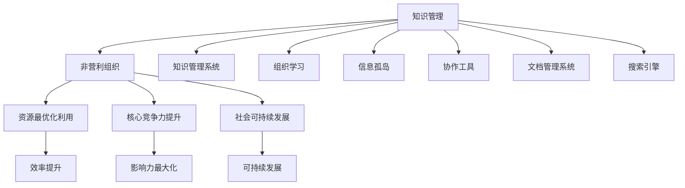

                 

## 1. 背景介绍

### 1.1 问题由来

在当今信息爆炸的时代，非营利组织（NPOs）面临着巨大的挑战。这些挑战包括资金短缺、人力资源不足、信息孤岛等问题。如何有效地管理知识和信息，使NPOs能够更高效地运作，成为它们迫切需要解决的问题。

非营利组织通常面临以下问题：
- **知识分散**：知识存储在员工个人的笔记本、邮件和纸质文档中，难以统一管理和共享。
- **信息孤立**：缺乏统一的平台，各个部门和人员之间的信息交流不畅。
- **知识流失**：员工流动率高，知识和经验的流失对组织造成了巨大的损失。
- **决策低效**：由于信息不透明，决策过程耗时长且效率低下。

### 1.2 问题核心关键点

知识管理在非营利组织中扮演着至关重要的角色，能够帮助组织提升知识共享、优化决策流程、提高员工效率、降低信息孤岛等。

1. **知识共享**：通过知识管理系统，员工可以方便地查找、共享和更新知识，提升组织的协作效率。
2. **优化决策**：统一的决策知识库，可以为决策者提供全面的信息支持，提高决策的准确性和效率。
3. **员工培训**：新员工可以迅速掌握工作所需的知识，减少培训成本。
4. **创新驱动**：知识管理有助于发现和激发组织内部的创新潜力，推动组织不断进步。
5. **知识保护**：防止关键知识和经验流失，维护组织的长期利益。

### 1.3 问题研究意义

非营利组织通过有效的知识管理，可以实现资源的最优化利用，提升组织的核心竞争力。它不仅有助于提高组织效率，还能够在有限资源条件下最大化影响力，推动社会的可持续发展。

## 2. 核心概念与联系

### 2.1 核心概念概述

- **知识管理（Knowledge Management, KM）**：通过系统化的方法和技术，对组织内部的知识进行识别、创建、组织、检索、分享、利用和保存的过程。

- **非营利组织（Nonprofit Organizations, NPOs）**：不以盈利为目的，致力于社会公益事业的组织，如慈善机构、社区组织、教育机构等。

- **知识管理系统（Knowledge Management System, KMS）**：用于支持组织知识管理活动的软件平台，包含文档管理系统、搜索引擎、协作工具等。

- **组织学习（Organizational Learning）**：组织通过不断学习新知识和技能，优化自身的运作方式和决策能力的过程。

- **信息孤岛（Information Silos）**：由于信息系统的割裂和隔离，导致信息无法有效共享和利用的现象。

- **协作工具（Collaboration Tools）**：如在线讨论板、即时通讯工具、项目管理软件等，促进组织内部的沟通与合作。

- **文档管理系统（Document Management System, DMS）**：用于管理和检索文档的系统，支持版本控制、权限管理等功能。

- **搜索引擎（Search Engine）**：用于快速查找文档和信息的工具，支持全文搜索、分类查询等。

这些概念之间的逻辑关系可以通过以下Mermaid流程图来展示：



这个流程图展示的知识管理在非营利组织中的作用和相关概念之间的联系：

1. 知识管理通过组织学习，优化资源利用，提升组织的效率和竞争力。
2. 信息孤岛、协作工具等概念是知识管理过程中需要克服的障碍。
3. 文档管理系统和搜索引擎是知识管理的工具，帮助员工共享和检索知识。

## 3. 核心算法原理 & 具体操作步骤
### 3.1 算法原理概述

知识管理在非营利组织中的实现，通常包括以下几个步骤：

1. **知识识别与采集**：识别组织内部和外部的知识来源，收集相关文档、经验、流程等。
2. **知识组织与存储**：通过文档管理系统和搜索引擎，对知识进行分类、编码和存储。
3. **知识共享与传播**：利用协作工具和知识管理系统，促进知识的内部传播和共享。
4. **知识利用与创新**：通过组织学习，利用知识管理系统中的知识，推动组织创新和决策优化。
5. **知识保护与维护**：建立知识保存和更新的机制，确保知识的长期存续。

### 3.2 算法步骤详解

以知识管理系统为例，以下是具体的实现步骤：

1. **系统设计**：根据组织的业务需求，设计知识管理系统的功能模块，如文档管理、知识搜索、协作平台等。
2. **数据导入**：将现有的文档、流程和经验等数据导入知识管理系统，建立初步的知识库。
3. **权限设置**：根据不同角色的需求，设置文档的访问权限和修改权限，保障数据安全。
4. **知识分类与编码**：对知识进行分类和编码，如项目文档、政策文件、培训材料等，方便检索和浏览。
5. **知识共享与传播**：通过协作工具和知识管理系统，促进知识在组织内的传播和共享。
6. **知识利用与创新**：利用知识管理系统的数据分析功能，识别组织内部的知识漏洞和创新机会，推动组织发展。
7. **知识保护与维护**：定期对知识库进行更新和维护，确保知识的准确性和完整性。

### 3.3 算法优缺点

知识管理在非营利组织中的应用，具有以下优点：
1. **提高效率**：通过统一的知识管理平台，减少信息孤岛，提升组织的协作效率。
2. **优化决策**：提供全面的决策支持信息，帮助决策者做出更加准确和高效的决策。
3. **促进创新**：通过知识共享和组织学习，激发组织内部的创新潜力，推动组织进步。
4. **保障知识安全**：建立知识保护机制，防止关键知识流失，维护组织长期利益。

同时，也存在一些局限性：
1. **实施难度**：知识管理系统的建设需要投入大量的时间和资源。
2. **员工抵触**：部分员工可能对新的知识管理系统存在抵触情绪，需要逐步推广和培训。
3. **数据质量**：如果知识库中的数据质量不高，可能会影响系统的使用效果。
4. **成本问题**：知识管理系统的建设和维护需要一定的成本，对于小型NPOs可能存在经济压力。

### 3.4 算法应用领域

知识管理在非营利组织中的应用领域非常广泛，包括但不限于以下几个方面：

- **慈善机构**：通过知识管理，慈善机构可以更高效地募集和管理资金，提升项目管理能力。
- **教育机构**：知识管理系统可以支持课程开发、教师培训、学生学习等，提升教育质量。
- **医疗机构**：通过知识管理，医疗机构可以优化诊疗流程，提升医疗服务质量。
- **社区组织**：知识管理可以帮助社区组织更好地开展公益活动，提升服务效果。
- **环境保护组织**：知识管理可以支持环境监测、项目评估等工作，推动环境保护事业发展。

## 4. 数学模型和公式 & 详细讲解  
### 4.1 数学模型构建

知识管理的数学模型可以概括为：

$$ KMS = (K, O, I, P, T) $$

其中：
- $K$：知识库，包含组织内部的文档、流程、经验等。
- $O$：组织学习，包括知识共享、协作、反馈等。
- $I$：信息孤岛，表示知识系统的隔离和分割。
- $P$：权限管理，控制知识的访问和使用权限。
- $T$：技术支持，包括搜索引擎、协作工具等。

### 4.2 公式推导过程

知识管理的核心目标是通过知识库的构建和优化，实现知识的有效管理和利用。知识库的构建和优化可以通过以下公式推导：

$$ KMS_{opt} = \mathop{\arg\min}_{K,O,I,P,T} C(K,O,I,P,T) $$

其中，$C$为代价函数，表示知识管理的总成本。这个公式表达了知识管理系统的优化目标：在成本一定的条件下，通过优化知识库、组织学习、信息孤岛、权限管理和技术支持，实现知识管理的最优化。

### 4.3 案例分析与讲解

以慈善机构为例，知识管理系统的优化过程可以如下：

1. **识别与采集**：
   - **案例**：慈善机构对现有的捐赠项目、志愿者培训材料等进行整理和收集。
   - **公式**：$K_{charity} = \{捐赠项目文档, 培训材料, 志愿者手册\}$

2. **组织与存储**：
   - **案例**：将收集到的知识进行分类和编码，建立结构化的知识库。
   - **公式**：$K_{charity_{organized}} = \text{分类}(K_{charity})$

3. **共享与传播**：
   - **案例**：在知识库基础上，搭建协作平台，方便员工和志愿者获取和使用知识。
   - **公式**：$O_{charity} = \text{协作平台}(K_{charity_{organized}})$

4. **利用与创新**：
   - **案例**：利用知识库中的项目文档和数据分析，优化捐赠流程和项目管理。
   - **公式**：$K_{charity_{utilized}} = \text{数据分析}(O_{charity})$

5. **保护与维护**：
   - **案例**：定期更新知识库，保证知识的准确性和完整性。
   - **公式**：$K_{charity_{maintained}} = \text{定期更新}(K_{charity_{utilized}})$

## 5. 项目实践：代码实例和详细解释说明
### 5.1 开发环境搭建

- **开发环境**：使用Python和Django框架，搭建基于Web的知识管理系统。
- **安装依赖**：
  ```
  pip install django django-crispy-forms django-widget-tweaks django-filepond
  ```

### 5.2 源代码详细实现

```python
# Django项目设置
INSTALLED_APPS = [
    'crispy_forms',
    'widget_tweaks',
    'filepond',
    ...
]

# 文档上传模型
class Document(models.Model):
    title = models.CharField(max_length=255)
    content = models.TextField()
    file = models.FileField(upload_to='documents/')
    created_at = models.DateTimeField(auto_now_add=True)
    updated_at = models.DateTimeField(auto_now=True)
    
    def __str__(self):
        return self.title

# 知识管理表单
class KnowledgeForm(forms.Form):
    title = forms.CharField(label='Title', max_length=255, required=True)
    content = forms.CharField(label='Content', widget=forms.Textarea, required=True)
    file = forms.FileField(label='File', required=False)
    
    def clean(self):
        cleaned_data = super().clean()
        title = cleaned_data.get('title')
        content = cleaned_data.get('content')
        file = cleaned_data.get('file')
        # 验证文档上传，确保文件大小和类型符合要求
        if file:
            if file.size > 1024*1024*10:
                raise forms.ValidationError('File size should be less than 10MB.')
            if not file.name.split('.')[-1].lower() in ['docx', 'pdf', 'txt']:
                raise forms.ValidationError('Only docx, pdf, txt files are allowed.')
        return cleaned_data

# 视图函数
def document_view(request):
    if request.method == 'POST':
        form = KnowledgeForm(request.POST, request.FILES)
        if form.is_valid():
            document = Document(title=form.cleaned_data['title'],
                               content=form.cleaned_data['content'],
                               file=form.cleaned_data['file'])
            document.save()
            messages.success(request, 'Document uploaded successfully.')
    else:
        form = KnowledgeForm()
    return render(request, 'document.html', {'form': form})
```

### 5.3 代码解读与分析

在上述代码中，我们使用了Django框架来构建基于Web的知识管理系统。

1. **模型定义**：通过`Document`模型，实现了文档的基本属性，如标题、内容、上传文件等。
2. **表单定义**：通过`KnowledgeForm`表单，收集用户上传文档的信息，并进行基本验证。
3. **视图函数**：`document_view`函数处理文档上传的请求，将表单数据保存到数据库，并返回成功或失败的反馈。

## 6. 实际应用场景
### 6.1 慈善机构

慈善机构在面对大量的捐赠项目和志愿者工作时，知识管理系统的应用可以有效提升其效率和透明度。例如，通过知识管理系统，慈善机构可以：
- **管理捐赠项目**：保存项目文档、预算、进度等信息，方便追踪和管理。
- **培训志愿者**：提供项目手册、培训材料等，提升志愿者技能和工作效率。
- **优化捐赠流程**：通过数据分析，识别高效的捐赠途径和方式，优化捐赠流程。

### 6.2 教育机构

教育机构的知识管理系统可以支持课程开发、教师培训、学生学习等多个方面，具体应用包括：
- **课程管理**：保存和分享课程文档、教材、案例等，方便教师和学生获取和学习。
- **教师培训**：提供培训视频、讲义、教师手册等，提升教师的教学水平。
- **学生学习**：提供学习资源、讨论区、作业提交等，促进学生的自主学习和合作学习。

### 6.3 医疗机构

医疗机构的知识管理系统可以帮助提升诊疗效率和医疗服务质量，具体应用包括：
- **病例管理**：保存和查询病例记录、诊断报告、治疗方案等，方便医生和护士的协作。
- **医疗培训**：提供医疗案例、指南、操作手册等，提升医护人员的医疗技能。
- **病患教育**：提供健康知识、疾病预防、康复指导等，提高患者的自我管理能力。

### 6.4 社区组织

社区组织的知识管理系统可以支持组织的活动策划、志愿者培训、信息发布等，具体应用包括：
- **活动策划**：保存和分享活动方案、志愿者手册、物资清单等，方便组织活动的策划和执行。
- **志愿者培训**：提供培训资料、案例分析、技能培训等，提升志愿者的工作能力。
- **信息发布**：发布组织活动、通知、公告等，方便社区成员的参与和了解。

## 7. 工具和资源推荐
### 7.1 学习资源推荐

- **书籍**：《知识管理：从理论到实践》、《非营利组织的知识管理》
- **在线课程**：Coursera上的《知识管理与组织学习》、edX上的《非营利组织的管理》
- **论文**：Knowledge Management in Nonprofit Organizations: Challenges and Opportunities

### 7.2 开发工具推荐

- **Django**：基于Python的开源Web框架，适合构建知识管理系统。
- **Filepond**：支持文件上传、编辑、预览等功能的文件管理工具。
- **Crispy Forms**：美观的表单组件，支持表单验证和自定义。
- **Widget Tweaks**：优化表单组件，提升用户体验。

### 7.3 相关论文推荐

- **论文1**：Kobayashi, H., & Kuroda, S. (2011). Knowledge Management Systems in Nonprofit Organizations: Case Studies of Six Knowledge Management Systems.
- **论文2**：Smith, P. L., & Vourvoulias, C. (2013). The Impact of Knowledge Management on Nonprofit Organizations: A Review.
- **论文3**：Liu, M., & Zhang, J. (2014). A Comparative Analysis of Knowledge Management Systems in Nonprofit Organizations: A Survey.

## 8. 总结：未来发展趋势与挑战
### 8.1 研究成果总结

本文系统介绍了知识管理在非营利组织中的作用，涵盖知识管理系统的构建、实施步骤和应用场景。研究表明，知识管理可以显著提升非营利组织的效率和竞争力。

### 8.2 未来发展趋势

1. **云化部署**：随着云计算技术的发展，知识管理系统将更多地采用云服务部署，降低运维成本，提升系统的扩展性和可靠性。
2. **人工智能应用**：利用AI技术，对知识进行智能分类、推荐和检索，提升知识管理的效率和效果。
3. **区块链技术**：采用区块链技术，确保知识共享和传播的安全性和透明性。
4. **开源社区**：更多的开源知识管理工具和平台将涌现，促进知识管理的普及和应用。

### 8.3 面临的挑战

1. **实施难度**：知识管理系统的实施需要高度的组织参与和技术支持，实施过程复杂。
2. **数据质量**：知识库中的数据质量直接影响系统的使用效果，需要持续更新和维护。
3. **员工抵触**：部分员工可能对新系统存在抵触情绪，需要逐步推广和培训。
4. **成本问题**：知识管理系统的建设和维护需要一定的成本，对于小型NPOs可能存在经济压力。

### 8.4 研究展望

未来，知识管理在非营利组织中的应用将更加普及和深入。随着技术的不断进步，知识管理系统将更加智能化、便捷化，为NPOs带来更多的创新和价值。同时，面对挑战，需要不断探索和优化知识管理的方法和工具，确保知识管理的有效性和可持续性。

## 9. 附录：常见问题与解答

**Q1：知识管理系统的实施难度大吗？**

A: 知识管理系统的实施确实存在一定的难度，需要组织内部的充分准备和参与。但通过合理的规划和分阶段实施，可以逐步推进知识管理系统的建设，并取得显著的成效。

**Q2：如何提升知识库的数据质量？**

A: 数据质量的提升需要持续的维护和更新。可以通过定期的数据清洗和审核，确保知识库中的数据准确性和完整性。同时，建立数据验证机制，及时发现和修正错误数据。

**Q3：知识管理系统的成本问题如何解决？**

A: 知识管理系统的成本问题可以通过分阶段实施、开源工具的使用和云服务部署等方式缓解。小型NPOs可以通过逐步引入和优化知识管理，降低初始投入。

**Q4：如何应对员工的抵触情绪？**

A: 员工的抵触情绪需要通过培训和引导来逐步克服。可以通过内部宣传和示范，展示知识管理系统的好处，让员工了解其对工作的支持和提升。同时，建立反馈机制，听取员工的意见和建议，不断改进知识管理系统。

通过本文的探讨，我们看到了知识管理在非营利组织中的重要作用和广泛应用前景。未来，随着技术的不断进步和组织认识的提高，知识管理必将成为NPOs不可或缺的战略资产，推动社会的可持续发展。

---

作者：禅与计算机程序设计艺术 / Zen and the Art of Computer Programming

