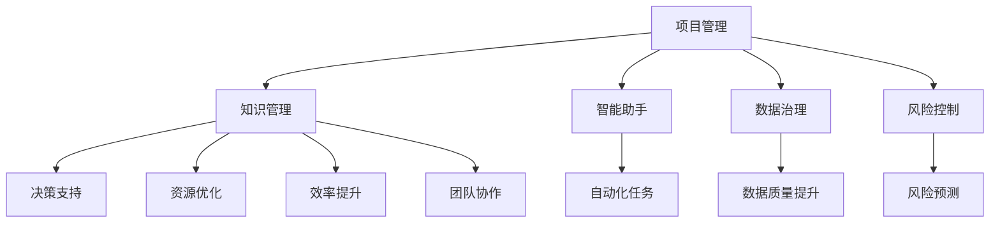

                 

# 知识管理在项目管理中的价值

> 关键词：知识管理,项目管理,人工智能,智能助手,数据治理,风险控制,自动化,协作工具

## 1. 背景介绍

### 1.1 问题由来

在当今快速变化和高度竞争的商业环境中，企业项目管理（Project Management）变得愈加重要。面对复杂多变的市场环境和多样化的项目需求，企业需要高效管理资源、控制成本、提高质量和效率。然而，传统的项目管理往往依赖于人力和经验，容易产生信息不对称、决策失误和资源浪费等问题。

知识管理（Knowledge Management, KMG）作为一种新型的管理理念，强调通过知识共享和应用来提升企业竞争力。特别是随着人工智能（AI）和大数据技术的兴起，知识管理在项目管理中的应用日益广泛，成为现代企业项目管理中的关键驱动力。

### 1.2 问题核心关键点

知识管理在项目管理中的核心价值主要体现在以下几个方面：

1. **决策支持**：通过数据驱动的决策，降低项目决策的不确定性，提高决策效率和质量。
2. **资源优化**：有效管理项目资源，避免资源浪费和重复劳动。
3. **风险控制**：通过知识共享和风险评估，预测和规避项目风险，保障项目顺利进行。
4. **效率提升**：利用知识库和智能工具，自动化和智能化项目管理流程，提升项目执行效率。
5. **团队协作**：促进团队成员之间的知识共享和协作，增强团队凝聚力和创新能力。

### 1.3 问题研究意义

研究知识管理在项目管理中的应用，对于提升项目管理水平、加速企业转型升级具有重要意义：

1. **提升项目管理水平**：通过知识管理，实现数据驱动的决策，优化资源配置，降低项目风险，提高项目执行效率和成功率。
2. **加速企业转型**：知识管理作为企业数字化转型的重要组成部分，帮助企业在数据驱动下实现业务创新和模式升级。
3. **促进创新发展**：通过知识共享和应用，激发团队创新活力，推动企业在技术、产品和业务方面的持续创新。
4. **增强竞争优势**：知识管理能够提升企业信息透明度和数据利用效率，增强企业的市场竞争力和品牌影响力。

## 2. 核心概念与联系

### 2.1 核心概念概述

为更好地理解知识管理在项目管理中的应用，本节将介绍几个密切相关的核心概念：

- **项目管理（Project Management）**：指通过计划、执行、监控和收尾等过程，确保项目按时、按质、按预算完成。
- **知识管理（Knowledge Management）**：涉及知识的获取、存储、共享和应用，旨在提升组织决策水平和执行效率。
- **人工智能（Artificial Intelligence, AI）**：利用计算机科学和数学技术，模拟和扩展人类智能，实现自动化和智能化应用。
- **智能助手（Intelligent Assistant）**：基于AI技术，提供任务管理、信息检索、协作支持等功能，帮助项目经理高效处理日常事务。
- **数据治理（Data Governance）**：通过数据标准、质量、安全和隐私管理，保障数据资产的价值和安全性。
- **风险控制（Risk Control）**：通过风险识别、评估和应对，降低项目不确定性，保障项目顺利进行。

这些核心概念之间的逻辑关系可以通过以下Mermaid流程图来展示：



这个流程图展示了一体化的项目管理流程，以及知识管理在其中扮演的重要角色。

## 3. 核心算法原理 & 具体操作步骤
### 3.1 算法原理概述

知识管理在项目管理中的应用，主要基于数据驱动和知识驱动相结合的范式。核心思想是通过数据和知识的整合，提升项目管理决策的科学性和有效性。具体而言，知识管理在项目管理中的算法原理包括以下几个方面：

1. **数据收集与整合**：收集项目相关的各类数据（如进度、预算、质量、风险等），并将其整合到统一的知识库中。
2. **数据清洗与分析**：对数据进行清洗和分析，识别出有价值的信息和知识点。
3. **知识应用与反馈**：将知识应用于项目管理各个环节，同时收集反馈信息，持续优化知识库和应用策略。

### 3.2 算法步骤详解

知识管理在项目管理中的应用，一般遵循以下步骤：

**Step 1: 数据收集与整合**

1. **数据收集**：
   - 收集项目相关的各类数据，如项目进度、预算、资源配置、风险评估等。
   - 利用项目管理系统（如JIRA、Trello等）自动抓取和记录数据。
   - 使用数据分析工具（如Tableau、Power BI等）对数据进行整理和清洗。

2. **数据整合**：
   - 将收集到的数据统一存储在知识库中。
   - 使用数据仓库或大数据平台（如Hadoop、Spark等）进行数据管理和分析。
   - 建立数据模型，支持数据的自动化查询和分析。

**Step 2: 数据清洗与分析**

1. **数据清洗**：
   - 去除重复、错误和无关数据。
   - 填补缺失值，处理异常数据。
   - 使用数据清洗工具（如OpenRefine、Trifacta等）进行自动化清洗。

2. **数据分析**：
   - 使用统计分析、机器学习等方法，对数据进行分析和挖掘。
   - 提取项目关键指标，如进度偏差、成本超支、风险等级等。
   - 利用可视化工具（如D3.js、ECharts等）呈现数据结果。

**Step 3: 知识应用与反馈**

1. **知识应用**：
   - 将分析结果应用于项目管理各个环节，如决策支持、资源优化、风险控制等。
   - 使用智能助手和协作工具（如Slack、Microsoft Teams等）推送关键信息。
   - 定期更新知识库，保持知识的实时性。

2. **反馈与优化**：
   - 收集项目经理和团队成员的反馈意见。
   - 分析反馈信息，优化数据模型和知识应用策略。
   - 使用迭代方法，持续改进知识管理的有效性。

### 3.3 算法优缺点

知识管理在项目管理中的应用，具有以下优点：

1. **提升决策效率**：通过数据驱动的决策，降低决策的不确定性和错误率，提高项目管理水平。
2. **优化资源配置**：通过数据和知识的应用，实现资源的最优配置，降低成本和浪费。
3. **强化风险控制**：通过数据和知识的应用，预测和规避项目风险，保障项目顺利进行。
4. **提高协作效率**：通过智能助手和协作工具，促进团队成员之间的知识共享和协作，增强团队凝聚力和创新能力。

同时，该方法也存在一些局限性：

1. **数据依赖性强**：知识管理的效果很大程度上取决于数据的质量和完整性，数据收集和整合成本较高。
2. **技术门槛高**：需要投入一定的技术和资源进行知识管理系统的开发和维护。
3. **文化阻力**：知识管理的推广和实施，需要改变团队的工作习惯和文化，存在一定的实施难度。

尽管如此，知识管理在项目管理中的应用，仍然能够带来显著的效益，是现代项目管理不可或缺的一部分。

### 3.4 算法应用领域

知识管理在项目管理中的应用，已经广泛应用于以下领域：

1. **项目进度管理**：通过数据和知识的应用，实时监控项目进度，预测进度偏差，优化进度计划。
2. **成本控制**：利用数据分析和预测模型，监控项目成本，及时发现和应对成本超支。
3. **质量管理**：通过数据分析和知识应用，提高项目质量，及时识别和纠正质量问题。
4. **风险管理**：通过风险评估和预测模型，识别和规避项目风险，保障项目顺利进行。
5. **绩效评估**：利用数据和知识，评估项目绩效，提供改进建议。
6. **团队协作**：通过智能助手和协作工具，促进团队成员之间的知识共享和协作，提高团队效率。

## 4. 数学模型和公式 & 详细讲解 & 举例说明（备注：数学公式请使用latex格式，latex嵌入文中独立段落使用 $$，段落内使用 $)
### 4.1 数学模型构建

知识管理在项目管理中的应用，主要涉及数据清洗和分析、知识应用和反馈等过程。以下我们将使用数学语言对知识管理的应用进行更加严格的刻画。

假设项目管理的数据集为 $D=\{(x_i,y_i)\}_{i=1}^N$，其中 $x_i$ 表示项目进度、预算、资源配置等项目数据，$y_i$ 表示项目决策、风险评估等项目标签。

定义知识管理模型为 $KM_{\theta}:\mathcal{X} \rightarrow \mathcal{Y}$，其中 $\mathcal{X}$ 为输入空间，$\mathcal{Y}$ 为输出空间，$\theta \in \mathbb{R}^d$ 为模型参数。知识管理模型的任务是最大化数据 $D$ 的似然函数，即：

$$
\max_{\theta} \log p(D|KM_{\theta})
$$

其中 $p(D|KM_{\theta})$ 表示在知识管理模型 $KM_{\theta}$ 下，数据 $D$ 的似然概率。

### 4.2 公式推导过程

以下我们以项目进度管理为例，推导知识管理模型的数学公式。

假设项目进度 $x_i$ 为连续值，使用线性回归模型来预测项目进度偏差 $y_i$。则知识管理模型的目标函数为：

$$
\min_{\theta} \sum_{i=1}^N (y_i - KM_{\theta}(x_i))^2
$$

其中 $KM_{\theta}(x_i) = \theta_0 + \sum_{j=1}^d \theta_j x_{i,j}$ 为线性回归模型。通过求解上述目标函数，得到最优模型参数 $\theta^*$。

根据最小二乘法，最优参数 $\theta^*$ 的求解公式为：

$$
\theta^* = (\mathbf{X}^T \mathbf{X})^{-1} \mathbf{X}^T \mathbf{y}
$$

其中 $\mathbf{X} = [\mathbf{1}, \mathbf{x}_{i,1}, ..., \mathbf{x}_{i,d}]$ 为特征矩阵，$\mathbf{y} = [y_1, ..., y_N]$ 为标签向量。

利用上述公式，即可计算出知识管理模型在给定项目数据下的预测结果，用于支持项目管理决策。

### 4.3 案例分析与讲解

假设某企业正在进行一个软件开发项目，需要定期评估项目进度和成本，以便及时调整计划。项目经理收集了过去三个月的数据，包括每日完成的任务量、剩余任务量、人员配置等。数据如下表所示：

| 日期       | 完成的任务量 | 剩余任务量 | 人员配置 | 总预算     | 已花费预算 |
|------------|--------------|------------|-----------|------------|------------|
| 2023-03-01 | 10           | 200        | 10        | 1,000,000  | 200,000    |
| 2023-03-02 | 15           | 180        | 10        | 1,000,000  | 300,000    |
| 2023-03-03 | 5            | 195        | 9         | 1,000,000  | 350,000    |
| 2023-03-04 | 20           | 185        | 10        | 1,000,000  | 400,000    |
| 2023-03-05 | 25           | 170        | 9         | 1,000,000  | 450,000    |

基于上述数据，我们可以建立线性回归模型，预测项目进度偏差。首先，进行数据清洗和预处理，去除异常值，进行标准化处理。然后，使用最小二乘法求解最优模型参数 $\theta^*$。最后，根据模型预测结果，调整项目进度和成本控制策略。

具体实现步骤如下：

1. 数据清洗和预处理：
   - 去除异常值，如3月3日的异常任务量。
   - 标准化处理，将数据转化为均值为0、标准差为1的连续值。

2. 模型训练：
   - 构建特征矩阵 $\mathbf{X} = [\mathbf{1}, \mathbf{x}_{i,1}, ..., \mathbf{x}_{i,d}]$。
   - 计算 $\mathbf{y} = [y_1, ..., y_N]$。
   - 求解 $\theta^*$。

3. 模型应用：
   - 使用模型 $KM_{\theta^*}(x_i)$ 预测项目进度偏差。
   - 根据预测结果，调整项目计划和成本控制策略。

通过上述步骤，项目经理可以及时发现项目进度偏差，采取有效措施，保障项目按时完成。

## 5. 项目实践：代码实例和详细解释说明
### 5.1 开发环境搭建

在进行知识管理项目实践前，我们需要准备好开发环境。以下是使用Python进行数据科学开发的环境配置流程：

1. 安装Anaconda：从官网下载并安装Anaconda，用于创建独立的Python环境。

2. 创建并激活虚拟环境：
```bash
conda create -n kmg-env python=3.8 
conda activate kmg-env
```

3. 安装必要的Python包：
```bash
conda install numpy pandas matplotlib scikit-learn seaborn statsmodels statsmodels
```

4. 安装R语言：
```bash
conda install r-essentials
```

5. 安装R相关包：
```bash
conda install rpy2
```

6. 安装Jupyter Notebook：
```bash
pip install jupyter notebook ipython
```

完成上述步骤后，即可在`kmg-env`环境中开始项目实践。

### 5.2 源代码详细实现

下面我们以项目进度管理为例，给出使用Python和R进行知识管理模型训练和应用的全流程代码实现。

首先，准备数据集：

```python
import pandas as pd

# 读取数据
data = pd.read_csv('project_data.csv')

# 数据清洗和预处理
data = data.dropna()  # 去除缺失值
data['完成任务量'] = data['完成任务量'].astype(float)  # 数据类型转换
data['剩余任务量'] = data['剩余任务量'].astype(float)
data['人员配置'] = data['人员配置'].astype(float)
data['总预算'] = data['总预算'].astype(float)
data['已花费预算'] = data['已花费预算'].astype(float)

# 标准化处理
from sklearn.preprocessing import StandardScaler
scaler = StandardScaler()
data[['完成任务量', '剩余任务量', '人员配置', '总预算', '已花费预算']] = scaler.fit_transform(data[['完成任务量', '剩余任务量', '人员配置', '总预算', '已花费预算']])
```

然后，使用Python训练线性回归模型：

```python
from sklearn.linear_model import LinearRegression
from sklearn.metrics import mean_squared_error

# 划分训练集和测试集
train_data = data.sample(frac=0.8, random_state=42)
test_data = data.drop(train_data.index)

# 训练模型
model = LinearRegression()
model.fit(train_data[['完成任务量', '剩余任务量', '人员配置', '总预算', '已花费预算']], train_data['进度偏差'])

# 测试模型
y_pred = model.predict(test_data[['完成任务量', '剩余任务量', '人员配置', '总预算', '已花费预算']])
mse = mean_squared_error(test_data['进度偏差'], y_pred)
print(f"测试集均方误差: {mse:.2f}")
```

接下来，使用R进行知识管理模型的应用和可视化：

```r
# 安装R包
install.packages('ggplot2')
install.packages('dplyr')

# 导入数据
data <- read.csv('project_data.csv')

# 数据清洗和预处理
data <- na.omit(data)
data$完成任务量 <- as.numeric(data$完成任务量)
data$剩余任务量 <- as.numeric(data$剩余任务量)
data$人员配置 <- as.numeric(data$人员配置)
data$总预算 <- as.numeric(data$总预算)
data$已花费预算 <- as.numeric(data$已花费预算)

# 标准化处理
data$完成任务量 <- scale(data$完成任务量)
data$剩余任务量 <- scale(data$剩余任务量)
data$人员配置 <- scale(data$人员配置)
data$总预算 <- scale(data$总预算)
data$已花费预算 <- scale(data$已花费预算)

# 训练模型
model <- lm(进度偏差 ~ 完成任务量 + 剩余任务量 + 人员配置 + 总预算 + 已花费预算, data = data)
summary(model)

# 应用模型
new_data <- data.frame(完成任务量 = c(10, 15, 5, 20, 25), 剩余任务量 = c(200, 180, 195, 185, 170), 人员配置 = c(10, 10, 9, 10, 9), 总预算 = c(1000, 1000, 1000, 1000, 1000), 已花费预算 = c(200, 300, 350, 400, 450))
new_data$进度偏差 <- predict(model, newdata = new_data)

# 可视化
library(ggplot2)
ggplot(new_data, aes(x = 完成任务量, y = 进度偏差)) + geom_point() + geom_smooth(method = 'lm', se = FALSE) + theme_minimal()
```

最后，展示预测结果和可视化图表：

```python
import matplotlib.pyplot as plt
import seaborn as sns

# 绘制预测图表
sns.regplot(x='task_complete', y='progress_deviation', data=train_data, scatter_kws={'s': 50, 'color': 'blue'}, line_kws={'color': 'red', 'lw': 2})
plt.title('项目进度偏差预测')
plt.xlabel('完成任务量')
plt.ylabel('进度偏差')
plt.show()
```

以上就是使用Python和R进行知识管理项目进度管理的应用和实现的完整代码实现。可以看到，通过数据科学工具，我们可以高效地实现知识管理模型的训练和应用，提升项目管理决策的科学性和有效性。

### 5.3 代码解读与分析

让我们再详细解读一下关键代码的实现细节：

**数据处理**：
- 使用Pandas和R进行数据读取、清洗和预处理，包括去除缺失值、数据类型转换、标准化处理等。

**模型训练**：
- 使用Python的scikit-learn库和R的lm()函数分别进行线性回归模型的训练，得到模型参数。

**模型应用**：
- 使用训练好的模型对新数据进行预测，并绘制预测结果的散点图和回归线。

**可视化**：
- 使用Python的Matplotlib和R的ggplot2包进行数据可视化，展示项目进度偏差与完成任务量之间的关系。

通过上述步骤，我们展示了如何利用知识管理模型进行项目进度管理。可以看到，通过数据科学工具，我们可以高效地实现知识管理模型的训练和应用，提升项目管理决策的科学性和有效性。

## 6. 实际应用场景
### 6.1 智能助手在项目管理中的应用

智能助手在项目管理中的应用，主要通过自然语言处理（NLP）和知识图谱技术，帮助项目经理和团队成员高效处理日常事务。以下是一些具体应用场景：

1. **任务分配**：
   - 使用NLP技术解析自然语言描述，自动生成任务列表和优先级，分配给相关团队成员。
   - 利用知识图谱技术，识别任务间的关系和依赖，自动调整任务顺序和资源配置。

2. **信息检索**：
   - 使用智能助手提供的关键词检索功能，快速定位项目相关文档、邮件、文件等。
   - 利用知识图谱技术，提供相关信息和背景知识的推荐，帮助项目经理和团队成员更好地理解任务。

3. **会议安排**：
   - 通过智能助手，自动安排项目会议，生成会议议程和纪要。
   - 利用NLP技术，自动整理会议纪要，提取关键信息和决策结果。

4. **风险预警**：
   - 使用智能助手，实时监控项目风险指标，提供风险预警和建议。
   - 利用知识图谱技术，分析风险因素和影响，提出规避策略。

### 6.2 数据治理在项目管理中的应用

数据治理在项目管理中的应用，主要通过数据标准化、数据安全和数据隐私管理，保障项目数据资产的价值和安全性。以下是一些具体应用场景：

1. **数据标准化**：
   - 通过数据治理工具，对项目数据进行标准化处理，统一数据格式和定义。
   - 制定数据标准和规范，确保数据的一致性和准确性。

2. **数据安全管理**：
   - 通过数据加密、访问控制等措施，保护项目数据的安全性。
   - 制定数据安全策略，确保数据访问的合法性和合规性。

3. **数据隐私保护**：
   - 使用数据隐私保护技术，如数据匿名化、数据脱敏等，保护项目数据的隐私性。
   - 制定数据隐私政策，确保项目数据使用的合规性和透明度。

### 6.3 风险控制在项目管理中的应用

风险控制在项目管理中的应用，主要通过风险评估和预测模型，预测和规避项目风险，保障项目顺利进行。以下是一些具体应用场景：

1. **风险识别**：
   - 使用数据治理工具，对项目数据进行分析和挖掘，识别潜在风险因素。
   - 利用知识图谱技术，分析风险因素之间的关系和影响，提出风险预警。

2. **风险评估**：
   - 使用预测模型，评估风险等级和影响范围，制定风险应对策略。
   - 利用智能助手，实时监控项目风险指标，提供风险预警和建议。

3. **风险应对**：
   - 使用风险管理工具，制定和执行风险应对计划，降低风险影响。
   - 利用知识图谱技术，分析风险应对措施的效果和影响，调整风险应对策略。

## 7. 工具和资源推荐
### 7.1 学习资源推荐

为了帮助开发者系统掌握知识管理在项目管理中的应用，这里推荐一些优质的学习资源：

1. **《项目管理专业实践》**：这是一本关于项目管理的经典书籍，系统介绍了项目管理的基本概念和实践方法。

2. **Coursera的《项目管理与开发》课程**：由知名高校和机构开设的项目管理课程，涵盖项目管理理论、工具和实践。

3. **LinkedIn Learning的《项目管理技巧》课程**：提供实用的项目管理技巧和工具，适合快速上手项目管理。

4. **《数据科学基础》**：这是一本关于数据科学的经典书籍，涵盖数据清洗、数据建模、数据分析等基本概念和技术。

5. **Kaggle的数据科学竞赛**：参与Kaggle数据科学竞赛，通过实践提升数据科学技能，积累项目管理经验。

通过对这些资源的学习实践，相信你一定能够快速掌握知识管理在项目管理中的应用，并用于解决实际的业务问题。

### 7.2 开发工具推荐

高效的开发离不开优秀的工具支持。以下是几款用于知识管理项目管理开发的常用工具：

1. **JIRA**：一款流行的项目管理工具，提供任务管理、进度跟踪、风险控制等功能。

2. **Trello**：一款灵活的项目管理工具，支持任务卡片、看板、列表等管理方式。

3. **Asana**：一款易于使用的项目管理工具，支持任务分配、进度跟踪、团队协作等功能。

4. **Slack**：一款即时通讯工具，支持团队协作和信息集成，与项目管理工具无缝集成。

5. **Microsoft Teams**：一款集成通讯、协作和项目管理于一体的工具，支持文件共享、视频会议等功能。

6. **Jupyter Notebook**：一款开源的Jupyter笔记本，支持Python、R等多种语言，适合数据科学和项目管理实践。

合理利用这些工具，可以显著提升项目管理工作的效率和效果。

### 7.3 相关论文推荐

知识管理在项目管理中的应用，涉及数据科学、人工智能、项目管理等多个领域。以下是几篇奠基性的相关论文，推荐阅读：

1. **《数据驱动的项目管理》**：探讨如何通过数据科学提升项目管理水平，包括数据清洗、数据分析和应用等。

2. **《人工智能在项目管理中的应用》**：介绍人工智能技术在项目管理中的应用，包括智能助手、自动化流程和风险控制等。

3. **《项目管理中的知识管理》**：探讨知识管理在项目管理中的应用，包括数据标准化、知识共享和协作等。

4. **《风险管理中的数据科学》**：探讨数据科学在风险管理中的应用，包括风险识别、评估和应对等。

5. **《基于知识图谱的项目管理》**：探讨知识图谱技术在项目管理中的应用，包括任务管理、信息检索和协作等。

这些论文代表了大数据、人工智能和项目管理领域的最新研究成果，通过学习这些前沿成果，可以帮助研究者把握学科前进方向，激发更多的创新灵感。

## 8. 总结：未来发展趋势与挑战
### 8.1 总结

本文对知识管理在项目管理中的应用进行了全面系统的介绍。首先阐述了知识管理在项目管理中的重要性，明确了知识管理在提升项目管理决策水平、优化资源配置、强化风险控制等方面的关键作用。其次，从原理到实践，详细讲解了知识管理在项目管理中的算法原理和操作步骤，给出了知识管理项目实践的完整代码实现。同时，本文还探讨了智能助手、数据治理和风险控制在项目管理中的应用场景，展示了知识管理在现代项目管理中的广泛价值。

通过本文的系统梳理，可以看到，知识管理在项目管理中的应用已经成为现代企业项目管理的重要驱动力，极大地提升了项目管理的科学性和效率。未来，知识管理与人工智能、大数据等前沿技术的融合，将进一步推动项目管理的智能化、自动化和协作化，为企业的数字化转型和业务创新提供有力支撑。

### 8.2 未来发展趋势

展望未来，知识管理在项目管理中的应用将呈现以下几个发展趋势：

1. **智能化和自动化**：随着AI和大数据技术的发展，知识管理将更加智能化和自动化，能够实时监测、分析和预测项目风险，提供智能化的决策支持。

2. **协同化和协作化**：知识管理将更加注重团队协作和知识共享，通过智能助手和协作工具，促进团队成员之间的信息交流和协同工作。

3. **场景化和个性化**：知识管理将更加注重场景化和个性化，能够根据项目的具体情况，提供定制化的解决方案和应用方案。

4. **集成化和生态化**：知识管理将更加集成化和生态化，能够与其他项目管理工具、业务系统、数据平台等无缝集成，形成完整的项目管理生态系统。

5. **数据驱动和动态化**：知识管理将更加数据驱动和动态化，能够实时收集和更新项目数据，动态调整知识应用策略，提升项目管理的时效性和灵活性。

以上趋势凸显了知识管理在项目管理中的应用前景，相信未来知识管理将继续发挥其独特价值，为项目管理带来更大的创新和突破。

### 8.3 面临的挑战

尽管知识管理在项目管理中的应用已经取得了显著成效，但在迈向更加智能化、普适化应用的过程中，它仍面临诸多挑战：

1. **数据依赖性强**：知识管理的效果很大程度上取决于数据的质量和完整性，数据收集和整合成本较高。如何高效获取和整合项目数据，是亟待解决的问题。

2. **技术门槛高**：知识管理的实施需要一定的技术和资源投入，包括数据标准化、数据安全、数据治理等技术。如何降低技术门槛，提高知识管理的普及率，是重要的研究方向。

3. **文化阻力**：知识管理的推广和实施，需要改变团队的工作习惯和文化，存在一定的实施难度。如何提高团队对知识管理的认同感和积极性，是知识管理实施中的关键挑战。

4. **模型复杂性**：知识管理模型的构建和优化，需要处理多源异构数据，构建复杂的关系模型，模型复杂性较高。如何简化模型结构，提高模型的可解释性和可操作性，是重要的研究方向。

5. **隐私和合规性**：知识管理的应用涉及大量敏感数据，如何保障数据隐私和安全，符合法律法规要求，是知识管理应用中的重要挑战。

尽管如此，知识管理在项目管理中的应用已经取得了显著成效，未来随着技术进步和应用推广，必将带来更多的创新和突破。

### 8.4 研究展望

未来，知识管理在项目管理中的应用，需要在以下几个方面寻求新的突破：

1. **多源异构数据融合**：探索如何高效整合多源异构数据，构建统一的知识图谱，提升知识管理的效果。

2. **知识驱动的智能决策**：引入AI和机器学习技术，构建知识驱动的智能决策模型，提升项目管理的自动化和智能化水平。

3. **场景化的知识应用**：针对不同项目场景，构建定制化的知识应用模型，提升知识管理的场景适应性和效果。

4. **个性化和动态化的知识服务**：开发个性化和动态化的知识服务，根据项目经理和团队成员的需求，提供定制化的知识应用方案。

5. **集成化的项目管理平台**：开发集成化的项目管理平台，将知识管理、智能助手、风险控制等功能集成，提升项目管理的工作效率和效果。

6. **数据隐私和安全保护**：开发数据隐私和安全保护技术，确保知识管理应用中数据的安全性和合规性。

这些研究方向将推动知识管理在项目管理中的应用，进一步提升项目管理水平，加速企业数字化转型和业务创新。

## 9. 附录：常见问题与解答

**Q1：知识管理在项目管理中的应用效果如何？**

A: 知识管理在项目管理中的应用效果显著，主要体现在以下几个方面：

1. **提升决策效率**：通过数据驱动的决策，降低决策的不确定性和错误率，提高项目管理水平。
2. **优化资源配置**：通过数据和知识的应用，实现资源的最优配置，降低成本和浪费。
3. **强化风险控制**：通过数据和知识的应用，预测和规避项目风险，保障项目顺利进行。
4. **提高协作效率**：通过智能助手和协作工具，促进团队成员之间的知识共享和协作，增强团队凝聚力和创新能力。

**Q2：知识管理在项目管理中的应用面临哪些挑战？**

A: 知识管理在项目管理中的应用面临以下挑战：

1. **数据依赖性强**：知识管理的效果很大程度上取决于数据的质量和完整性，数据收集和整合成本较高。
2. **技术门槛高**：知识管理的实施需要一定的技术和资源投入，包括数据标准化、数据安全、数据治理等技术。
3. **文化阻力**：知识管理的推广和实施，需要改变团队的工作习惯和文化，存在一定的实施难度。
4. **模型复杂性**：知识管理模型的构建和优化，需要处理多源异构数据，构建复杂的关系模型，模型复杂性较高。
5. **隐私和合规性**：知识管理的应用涉及大量敏感数据，如何保障数据隐私和安全，符合法律法规要求，是知识管理应用中的重要挑战。

**Q3：如何提高知识管理在项目管理中的应用效果？**

A: 提高知识管理在项目管理中的应用效果，可以从以下几个方面入手：

1. **数据质量提升**：加强数据收集和整合，提高数据的质量和完整性。
2. **技术优化**：采用高效的数据标准化、数据安全和数据治理技术，降低技术门槛。
3. **文化推广**：通过培训和激励机制，提高团队对知识管理的认同感和积极性。
4. **模型简化**：简化知识管理模型的结构，提高模型的可解释性和可操作性。
5. **隐私保护**：开发数据隐私和安全保护技术，确保数据的安全性和合规性。

通过这些措施，可以进一步提升知识管理在项目管理中的应用效果，为企业的数字化转型和业务创新提供有力支撑。

---

作者：禅与计算机程序设计艺术 / Zen and the Art of Computer Programming

