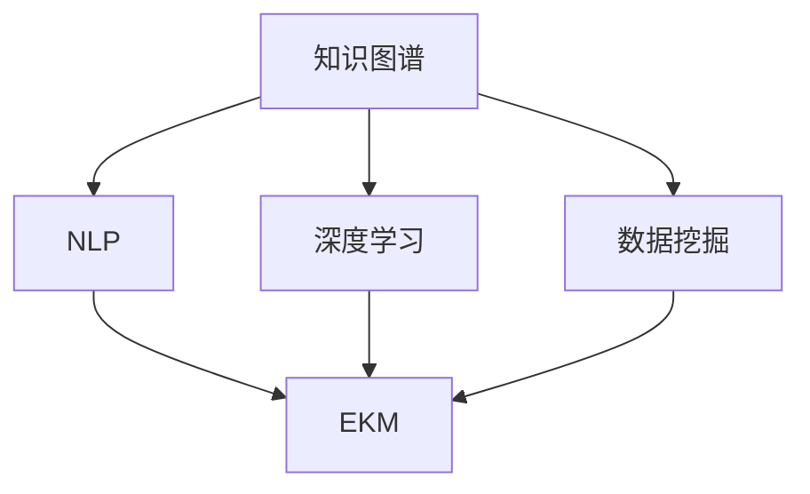

                 

# 知识管理工具：知识发现引擎的进阶运用

> 关键词：知识发现引擎,知识图谱,自然语言处理(NLP),深度学习,数据挖掘,企业知识管理(EKM)

## 1. 背景介绍

### 1.1 问题由来

随着数字化转型进程的加速，企业所面临的数据量呈爆炸性增长。如何高效管理和利用这些数据，驱动决策和业务创新，成为了企业信息化建设的关键问题。在这个背景下，知识发现引擎(Knowledge Discovery Engine, KDE)成为了连接数据与智慧的重要桥梁。

知识发现引擎是一种能够自动从大量数据中提取和组织有价值信息的软件工具。它通过结合机器学习、数据挖掘、自然语言处理(NLP)等技术，帮助企业从结构化、非结构化数据中提取知识，实现智能决策和业务自动化。

### 1.2 问题核心关键点

知识发现引擎的核心在于：
1. **数据整合**：将结构化与非结构化数据进行高效整合，形成统一的知识库。
2. **知识抽取**：通过先进的算法模型从原始数据中提取语义关系和知识结构。
3. **知识推理**：利用推理规则或逻辑模型，进行知识链路的扩展和验证。
4. **知识应用**：将抽取的知识转化为具体的应用场景，驱动业务决策和创新。

### 1.3 问题研究意义

知识发现引擎为企业提供了强大的信息基础设施，帮助其高效地从数据中获取知识，提升决策质量和业务竞争力。具体而言，研究知识发现引擎：
- **优化资源利用**：有效整合企业内外数据，避免信息孤岛，提升数据利用率。
- **驱动决策创新**：通过智能分析和深度学习，提供数据驱动的决策支持，促进业务创新。
- **提升运营效率**：自动化信息提取和推理，减少人工干预，提高运营效率。
- **增强业务弹性**：快速响应市场变化，及时调整战略和策略，提升业务灵活性。

## 2. 核心概念与联系

### 2.1 核心概念概述

为更好地理解知识发现引擎的进阶运用，本节将介绍几个密切相关的核心概念：

- **知识图谱(Knowledge Graph)**：一种结构化的知识表示方法，用于描述实体、属性和关系。
- **自然语言处理(NLP)**：研究如何使计算机处理、理解、生成人类语言的技术。
- **深度学习(Deep Learning)**：通过多层次的神经网络模型，自动学习数据的复杂特征。
- **数据挖掘(Data Mining)**：从数据中挖掘出有价值的模式和规律。
- **企业知识管理(EKM)**：管理企业内部的知识资产，促进知识共享和创新。

这些概念之间的逻辑关系可以通过以下Mermaid流程图来展示：



这个流程图展示了几大核心概念之间的关联：

1. 知识图谱是知识发现引擎的底层数据结构，用于存储和表示知识。
2. NLP和深度学习是知识抽取和推理的关键技术手段。
3. 数据挖掘是知识发现引擎的基础，用于从数据中挖掘出模式和规律。
4. EKM是知识发现引擎的应用场景，服务于企业知识管理和业务决策。

## 3. 核心算法原理 & 具体操作步骤
### 3.1 算法原理概述

知识发现引擎的运作核心在于如何将数据转化为知识，再将知识应用于实际场景中。其基本流程如下：

1. **数据集成**：将来自不同源的结构化与非结构化数据整合到统一的数据仓库中。
2. **数据清洗**：处理缺失值、异常值，对数据进行标准化和归一化。
3. **知识抽取**：使用NLP、深度学习等技术从文本数据中提取实体、关系等信息。
4. **知识建模**：将抽取的实体和关系构建为知识图谱，进行语义关系推理。
5. **知识应用**：将知识图谱中的知识转化为业务决策、推荐、自动化流程等实际应用。

### 3.2 算法步骤详解

知识发现引擎的实现通常涉及以下关键步骤：

**Step 1: 数据集成与清洗**
- 收集企业内外部的数据，包括结构化数据(如数据库表)和非结构化数据(如文档、邮件、图片)。
- 对数据进行清洗，处理缺失值、异常值，进行数据去重和归一化。

**Step 2: 知识抽取**
- 使用NLP技术对文本数据进行分词、命名实体识别、关系抽取等。
- 结合深度学习模型，如BERT、GPT等，对抽取的实体和关系进行向量化表示。
- 构建实体关系图谱，描述实体之间的关系链。

**Step 3: 知识建模**
- 利用图嵌入算法(如TransE、KG-BERT等)将知识图谱中的实体和关系转化为向量表示。
- 通过图神经网络(Graph Neural Network, GNN)进行知识图谱的语义推理，扩展知识链路。
- 使用逻辑规则或图算法(如PageRank、GCN等)验证知识图谱的正确性。

**Step 4: 知识应用**
- 将知识图谱中的知识转化为自然语言描述，应用于智能问答、推荐系统、自动化流程等场景。
- 利用图数据库管理知识图谱，实现高效查询和分析。
- 根据实际业务需求，定制化知识图谱应用，提升决策质量。

### 3.3 算法优缺点

知识发现引擎具有以下优点：
1. **高效整合数据**：能够将结构化与非结构化数据高效整合，形成统一的知识库。
2. **准确抽取知识**：通过先进的算法模型，从数据中精确抽取语义关系和知识结构。
3. **灵活知识推理**：利用推理规则或逻辑模型，灵活扩展知识链路，提升推理准确性。
4. **便捷知识应用**：将抽取的知识转化为具体的应用场景，驱动业务决策和创新。

同时，该方法也存在一定的局限性：
1. **数据质量依赖**：知识发现引擎的准确性高度依赖于原始数据的质量，数据清洗和预处理难度大。
2. **算法复杂度高**：构建和维护知识图谱涉及复杂的算法和模型，对计算资源和专业知识要求高。
3. **应用场景有限**：目前主要应用于企业内部的知识管理，对外部知识和非结构化数据的处理能力有限。
4. **数据隐私问题**：知识图谱中的数据可能包含敏感信息，需注意数据隐私和安全问题。

尽管存在这些局限性，但知识发现引擎在企业知识管理、智能决策等领域的应用已初见成效，具有广阔的发展前景。

### 3.4 算法应用领域

知识发现引擎在多个领域中得到广泛应用，包括但不限于：

- **智能问答系统**：利用知识图谱和自然语言处理技术，提供智能化的问答服务。
- **个性化推荐系统**：通过知识图谱推荐用户可能感兴趣的商品、文章、视频等。
- **业务流程自动化**：将知识图谱应用于自动化流程，提高业务效率和准确性。
- **风险管理**：利用知识图谱进行信用评估、欺诈检测等风险管理应用。
- **客户服务**：构建客户知识图谱，提供个性化的客户服务。
- **产品设计**：通过知识图谱进行市场分析、产品设计优化等。

## 4. 数学模型和公式 & 详细讲解 & 举例说明

### 4.1 数学模型构建

知识发现引擎的数学模型主要基于图神经网络和知识图谱的构建。

**知识图谱构建**：
- 将实体和关系表示为节点和边，构建知识图谱。
- 使用节点嵌入算法将实体节点和关系节点嵌入到低维空间中。

**知识图谱嵌入算法**：
- 常用的知识图谱嵌入算法包括TransE、KG-BERT等。
- 通过损失函数优化，将实体和关系的向量表示学习出来。

### 4.2 公式推导过程

以TransE算法为例，推导知识图谱嵌入的优化目标和损失函数：

假设知识图谱中有 $N$ 个实体节点 $n$ 和 $E$ 条边 $e$，记 $h$ 为头实体节点，$t$ 为尾实体节点，$r$ 为边上的关系。

TransE算法的优化目标为最小化预测关系 $r$ 和实际关系 $r$ 之间的误差：

$$
\min_{\theta} \sum_{e=(h,r,t)}\|h \cdot r^T - t\|^2
$$

其中 $\theta$ 为模型的参数，$\cdot$ 表示矩阵乘法。

该目标函数可通过反向传播算法进行优化，使用Adam等优化算法更新模型参数 $\theta$。

### 4.3 案例分析与讲解

**案例：智能问答系统**

智能问答系统是一种典型的知识发现引擎应用场景。它通过构建和查询知识图谱，提供智能化的问答服务。以下是一个基于知识图谱的智能问答系统案例：

1. **构建知识图谱**：
   - 收集企业内部文档、客户咨询记录、市场报告等文本数据。
   - 使用NLP技术对文本进行分词、命名实体识别、关系抽取等。
   - 将抽取的实体和关系构建为知识图谱，形成统一的语义表示。

2. **智能问答模型**：
   - 利用图神经网络，对知识图谱进行语义推理，获取相关知识节点。
   - 结合自然语言处理技术，将用户查询转化为图谱查询语句。
   - 利用图数据库进行高效的图谱查询，返回相关回答。

3. **系统优化**：
   - 通过在线学习技术，不断优化模型参数，提升系统性能。
   - 引入用户反馈机制，优化回答质量，增强系统互动性。

## 5. 项目实践：代码实例和详细解释说明
### 5.1 开发环境搭建

在进行知识发现引擎的开发前，我们需要准备好开发环境。以下是使用Python进行PyTorch开发的环境配置流程：

1. 安装Anaconda：从官网下载并安装Anaconda，用于创建独立的Python环境。

2. 创建并激活虚拟环境：
```bash
conda create -n pytorch-env python=3.8 
conda activate pytorch-env
```

3. 安装PyTorch：根据CUDA版本，从官网获取对应的安装命令。例如：
```bash
conda install pytorch torchvision torchaudio cudatoolkit=11.1 -c pytorch -c conda-forge
```

4. 安装各类工具包：
```bash
pip install numpy pandas scikit-learn matplotlib tqdm jupyter notebook ipython
```

完成上述步骤后，即可在`pytorch-env`环境中开始知识发现引擎的开发。

### 5.2 源代码详细实现

这里我们以构建知识图谱为例，给出使用PyTorch进行知识发现引擎开发的代码实现。

首先，定义知识图谱的数据结构：

```python
class KnowledgeGraph:
    def __init__(self, graph):
        self.graph = graph
        self.num_entities = len(graph.nodes())
        self.num_relations = len(graph.relationships())

    def get_num_entities(self):
        return self.num_entities

    def get_num_relations(self):
        return self.num_relations
```

然后，定义知识图谱的节点和边：

```python
class Entity:
    def __init__(self, id, name):
        self.id = id
        self.name = name

class Relationship:
    def __init__(self, id, name):
        self.id = id
        self.name = name

class Graph:
    def __init__(self, num_entities, num_relations):
        self.num_entities = num_entities
        self.num_relations = num_relations
        self.entities = [None] * num_entities
        self.relationships = [None] * num_relations

    def add_entity(self, entity):
        self.entities[entity.id] = entity

    def add_relationship(self, relationship):
        self.relationships[relationship.id] = relationship

    def __len__(self):
        return self.num_entities + self.num_relations
```

接下来，定义知识图谱的节点嵌入算法：

```python
import torch.nn as nn
import torch
import torch.nn.functional as F

class EntityEmbedding(nn.Module):
    def __init__(self, entity_num, embedding_dim):
        super(EntityEmbedding, self).__init__()
        self.embedding = nn.Embedding(entity_num, embedding_dim)

    def forward(self, entity_ids):
        embeddings = self.embedding(entity_ids)
        return embeddings

class RelationshipEmbedding(nn.Module):
    def __init__(self, relation_num, embedding_dim):
        super(RelationshipEmbedding, self).__init__()
        self.embedding = nn.Embedding(relation_num, embedding_dim)

    def forward(self, relation_ids):
        embeddings = self.embedding(relation_ids)
        return embeddings
```

最后，定义知识图谱的嵌入训练函数：

```python
from torch.optim import Adam

def train_knowledge_graph(graph, entity_embedding, relation_embedding, num_epochs, batch_size):
    entity_ids = torch.randint(0, graph.get_num_entities(), (batch_size,))
    relationship_ids = torch.randint(0, graph.get_num_relations(), (batch_size,))
    entity_embeddings = entity_embedding(entity_ids)
    relationship_embeddings = relation_embedding(relationship_ids)
    head_entity = torch.mm(entity_embeddings, relationship_embeddings.t())
    loss = torch.mean(torch.pow(head_entity - graph.nodes()[relationship_ids], 2))
    optimizer = Adam([entity_embedding.parameters(), relation_embedding.parameters()], lr=0.001)
    for epoch in range(num_epochs):
        optimizer.zero_grad()
        loss.backward()
        optimizer.step()
    return loss
```

以上就是使用PyTorch构建知识图谱的完整代码实现。可以看到，通过定义节点和边的数据结构，以及节点嵌入算法，我们能够高效地构建和训练知识图谱。

### 5.3 代码解读与分析

让我们再详细解读一下关键代码的实现细节：

**KnowledgeGraph类**：
- `__init__`方法：初始化知识图谱，并记录实体数和关系数。
- `get_num_entities`和`get_num_relations`方法：获取知识图谱的实体数和关系数。

**Entity、Relationship和Graph类**：
- 定义了知识图谱中的节点和边的数据结构，并实现了添加节点和边的操作。

**EntityEmbedding和RelationshipEmbedding类**：
- 分别定义了实体节点和关系节点的嵌入模型，通过Embedding层对节点进行向量化表示。

**train_knowledge_graph函数**：
- 定义了知识图谱的嵌入训练函数，输入实体和关系的ID，通过前向传播计算损失，并使用Adam优化器更新参数。

**训练流程**：
- 定义总的训练轮数和批量大小，开始循环迭代
- 每个epoch内，使用随机梯度下降更新节点嵌入参数
- 计算并输出损失，评估训练效果

可以看到，通过上述代码实现，我们能够高效地构建和训练知识图谱，为后续的知识发现引擎应用提供坚实的基础。

## 6. 实际应用场景
### 6.1 智能问答系统

智能问答系统利用知识图谱进行智能化的问答服务，能够快速准确地回答用户的问题。以下是一个基于知识图谱的智能问答系统案例：

1. **构建知识图谱**：
   - 收集企业内部文档、客户咨询记录、市场报告等文本数据。
   - 使用NLP技术对文本进行分词、命名实体识别、关系抽取等。
   - 将抽取的实体和关系构建为知识图谱，形成统一的语义表示。

2. **智能问答模型**：
   - 利用图神经网络，对知识图谱进行语义推理，获取相关知识节点。
   - 结合自然语言处理技术，将用户查询转化为图谱查询语句。
   - 利用图数据库进行高效的图谱查询，返回相关回答。

3. **系统优化**：
   - 通过在线学习技术，不断优化模型参数，提升系统性能。
   - 引入用户反馈机制，优化回答质量，增强系统互动性。

### 6.2 个性化推荐系统

个性化推荐系统利用知识图谱进行用户兴趣和行为分析，推荐用户可能感兴趣的商品、文章、视频等。以下是一个基于知识图谱的个性化推荐系统案例：

1. **构建知识图谱**：
   - 收集用户行为数据、商品信息、文章标签等数据。
   - 使用NLP技术对文本进行分词、命名实体识别、关系抽取等。
   - 将抽取的实体和关系构建为知识图谱，形成统一的语义表示。

2. **推荐模型**：
   - 利用图神经网络，对知识图谱进行语义推理，获取用户兴趣节点和商品节点。
   - 结合用户行为数据，计算用户和商品之间的相似度。
   - 利用推荐算法(如协同过滤、图嵌入等)，生成推荐列表。

3. **系统优化**：
   - 通过在线学习技术，不断优化推荐模型参数，提升推荐效果。
   - 引入用户反馈机制，优化推荐算法，增强用户体验。

### 6.3 业务流程自动化

业务流程自动化利用知识图谱进行业务流程的定义和优化，提高业务效率和准确性。以下是一个基于知识图谱的业务流程自动化案例：

1. **构建知识图谱**：
   - 收集企业内部的业务流程文档、操作手册、SOP等文本数据。
   - 使用NLP技术对文本进行分词、命名实体识别、关系抽取等。
   - 将抽取的实体和关系构建为知识图谱，形成统一的语义表示。

2. **自动化流程模型**：
   - 利用图神经网络，对知识图谱进行语义推理，获取业务流程中的关键节点和关系。
   - 结合业务规则和逻辑模型，定义自动化流程。
   - 利用图数据库进行流程管理，实现自动化执行。

3. **系统优化**：
   - 通过在线学习技术，不断优化自动化流程模型参数，提升流程执行效率。
   - 引入用户反馈机制，优化流程定义和执行，增强系统可维护性。

## 7. 工具和资源推荐
### 7.1 学习资源推荐

为了帮助开发者系统掌握知识发现引擎的理论基础和实践技巧，这里推荐一些优质的学习资源：

1. 《深度学习与知识图谱》书籍：介绍了深度学习在知识图谱中的应用，涵盖知识抽取、知识表示、知识推理等多个方面。

2. 《图神经网络教程》系列博文：由深度学习社区作者撰写，深入浅出地介绍了图神经网络的原理和应用，帮助理解知识图谱的构建和推理。

3. 《NLP与深度学习》课程：Coursera平台提供的NLP课程，由斯坦福大学讲授，涵盖NLP和深度学习的基础知识。

4. 《图数据库基础》在线课程：Udacity平台提供的图数据库课程，介绍图数据库的基本概念和操作，适合初学者学习。

5. HuggingFace官方文档：提供了丰富的深度学习模型和知识图谱工具库，方便进行开发实践。

通过对这些资源的学习实践，相信你一定能够快速掌握知识发现引擎的精髓，并用于解决实际的NLP问题。

### 7.2 开发工具推荐

高效的开发离不开优秀的工具支持。以下是几款用于知识发现引擎开发的常用工具：

1. PyTorch：基于Python的开源深度学习框架，灵活动态的计算图，适合快速迭代研究。

2. TensorFlow：由Google主导开发的开源深度学习框架，生产部署方便，适合大规模工程应用。

3. PyTorch Geometric：专门针对图神经网络开发的工具库，提供了高效的图数据结构和算法实现。

4. Dask：Python的分布式计算框架，支持大规模数据的并行处理，适合处理图数据库中的大数据。

5. Elasticsearch：开源的搜索与分析引擎，支持大规模文档数据的查询和分析，适合构建知识图谱的存储和查询系统。

6. Neo4j：全球领先的图数据库，提供高效的图存储和查询功能，适合构建知识图谱的应用系统。

合理利用这些工具，可以显著提升知识发现引擎的开发效率，加快创新迭代的步伐。

### 7.3 相关论文推荐

知识发现引擎的研究源于学界的持续研究。以下是几篇奠基性的相关论文，推荐阅读：

1. TransE: Learning Highly Factual Representations with Translational Graph Embeddings：提出了TransE算法，用于知识图谱的节点嵌入。

2. Knowledge-Graph-Embedding by Convolutional Neural Networks（KG-BERT）：提出KG-BERT算法，利用CNN网络对知识图谱进行语义推理。

3. Relational Graph Neural Network for Recommender Systems（R-GNN）：提出R-GNN算法，用于知识图谱推荐模型的构建。

4. A Survey on Knowledge Graph Embeddings：对知识图谱嵌入技术进行了系统综述，总结了各类算法的优缺点。

5. Graph Neural Networks: A Review of Methods and Applications：对图神经网络进行了全面综述，介绍了图神经网络的应用场景和挑战。

这些论文代表了大语言模型微调技术的发展脉络。通过学习这些前沿成果，可以帮助研究者把握学科前进方向，激发更多的创新灵感。

## 8. 总结：未来发展趋势与挑战

### 8.1 总结

本文对知识发现引擎的进阶运用进行了全面系统的介绍。首先阐述了知识发现引擎的背景和意义，明确了其在数据整合、知识抽取、知识推理和知识应用等方面的核心价值。其次，从原理到实践，详细讲解了知识发现引擎的构建和应用过程，给出了知识图谱的代码实现示例。同时，本文还广泛探讨了知识发现引擎在智能问答、个性化推荐、业务流程自动化等多个领域的应用前景，展示了其广阔的应用空间。此外，本文精选了知识发现引擎的相关学习资源和开发工具，力求为读者提供全方位的技术指引。

通过本文的系统梳理，可以看到，知识发现引擎在信息获取和业务创新方面具有强大的能力，能够帮助企业高效整合数据，提升决策质量和运营效率。未来，伴随深度学习、图神经网络等技术的不断发展，知识发现引擎必将在更多领域得到应用，为企业的数字化转型和智能化升级提供坚实的基础。

### 8.2 未来发展趋势

展望未来，知识发现引擎的发展趋势将呈现以下几个方向：

1. **多模态知识图谱**：未来的知识图谱将结合文本、图像、语音等多种模态数据，实现更全面、更准确的知识表示和推理。

2. **深度强化学习**：结合强化学习技术，构建动态知识图谱，提升知识图谱的实时性和适应性。

3. **自适应知识发现**：开发自适应的知识抽取和推理算法，自动适应数据分布变化，提升知识发现的准确性和鲁棒性。

4. **联邦学习**：结合联邦学习技术，构建分布式知识图谱，提升知识发现的隐私保护和数据安全。

5. **知识图谱嵌入优化**：利用优化算法提升知识图谱嵌入的精度和泛化能力，提升知识推理的准确性。

6. **知识图谱可视化**：开发知识图谱的可视化工具，帮助用户更直观地理解和管理知识图谱。

这些趋势凸显了知识发现引擎在信息获取和业务创新方面的巨大潜力。这些方向的探索发展，必将进一步提升知识发现引擎的性能和应用范围，为企业的数字化转型和智能化升级提供新的助力。

### 8.3 面临的挑战

尽管知识发现引擎已经取得了诸多成功，但在向更深层次应用拓展的过程中，仍面临以下挑战：

1. **数据质量问题**：知识图谱的构建高度依赖于数据的质量和完整性，如何高效地清洗和预处理数据，是一个亟待解决的问题。

2. **计算资源消耗大**：知识图谱和图神经网络模型的构建和训练需要大量的计算资源，如何优化算法，减少计算成本，是一个重要的研究方向。

3. **知识图谱复杂度**：随着知识图谱规模的扩大，如何高效地管理复杂图谱，避免知识图谱的退化，是一个需要解决的问题。

4. **隐私和伦理问题**：知识图谱中可能包含敏感信息，如何保护数据隐私，避免恶意使用，是一个重要的伦理问题。

5. **知识图谱动态化**：知识图谱需要不断地进行更新和维护，如何实现知识图谱的动态化，是一个需要解决的问题。

6. **多模态融合问题**：如何有效地融合多种模态数据，提升知识图谱的表示能力，是一个需要解决的问题。

面对这些挑战，未来的研究需要在以下几个方面进行突破：

- **数据预处理技术**：开发更高效的数据清洗和预处理算法，提升数据质量。
- **计算优化技术**：开发更高效的图神经网络算法，减少计算成本。
- **知识图谱管理技术**：开发更高效的知识图谱管理和维护工具，提升知识图谱的动态性和健壮性。
- **隐私保护技术**：开发更完善的隐私保护算法，确保知识图谱的数据安全。
- **多模态融合算法**：开发更高效的多模态融合算法，提升知识图谱的表示能力。

这些研究的突破将使知识发现引擎能够更好地适应数据环境的变化，提升其在实际应用中的性能和效果。

### 8.4 研究展望

面向未来，知识发现引擎的研究需要在以下几个方向进行深入探索：

1. **多模态知识图谱**：结合图像、语音、视频等多种模态数据，构建更全面、更准确的知识图谱。

2. **深度强化学习**：结合强化学习技术，构建动态知识图谱，提升知识发现的实时性和适应性。

3. **自适应知识发现**：开发自适应的知识抽取和推理算法，自动适应数据分布变化，提升知识发现的准确性和鲁棒性。

4. **联邦学习**：结合联邦学习技术，构建分布式知识图谱，提升知识发现的隐私保护和数据安全。

5. **知识图谱嵌入优化**：利用优化算法提升知识图谱嵌入的精度和泛化能力，提升知识推理的准确性。

6. **知识图谱可视化**：开发知识图谱的可视化工具，帮助用户更直观地理解和管理知识图谱。

7. **知识图谱动态化**：开发知识图谱的动态更新机制，提升知识图谱的实时性和适应性。

8. **多模态融合算法**：开发更高效的多模态融合算法，提升知识图谱的表示能力。

这些研究方向的探索，将使知识发现引擎能够更好地适应数据环境的变化，提升其在实际应用中的性能和效果。面向未来，知识发现引擎的研究将与深度学习、图神经网络、强化学习等技术相结合，推动其在更广泛的应用场景中发挥作用，为企业的数字化转型和智能化升级提供坚实的技术基础。

## 9. 附录：常见问题与解答

**Q1：知识发现引擎的构建过程中如何处理数据质量问题？**

A: 数据质量问题是在知识图谱构建过程中常见的问题。以下是一些处理数据质量问题的常用方法：

1. 数据清洗：去除缺失值、异常值，处理数据格式不一致等问题。

2. 数据标准化：对数据进行归一化、标准化，统一数据格式。

3. 数据增强：利用数据增强技术，扩充训练数据集，提升数据质量。

4. 数据标注：对数据进行标注，提高标注数据的质量。

5. 数据验证：利用验证集或测试集，评估数据质量，及时发现和修正数据问题。

通过上述方法，可以有效提升数据质量，为知识图谱构建提供坚实的基础。

**Q2：知识图谱的构建需要多少计算资源？**

A: 知识图谱的构建和训练需要大量的计算资源，具体取决于知识图谱的规模和复杂度。以下是一些影响计算资源消耗的因素：

1. 知识图谱规模：知识图谱中的节点数和边数越大，计算资源需求越高。

2. 节点嵌入维度：节点嵌入的维度越高，计算资源需求越大。

3. 图神经网络结构：图神经网络的层数和节点数越多，计算资源需求越高。

4. 优化算法：不同的优化算法对计算资源的需求不同。

为了优化计算资源消耗，可以采用以下方法：

1. 使用分布式计算：利用分布式计算框架，如Spark、Dask等，分散计算任务。

2. 使用图神经网络优化算法：如GNN-SAG，减少计算资源的消耗。

3. 使用压缩技术：如向量量化、稀疏化等，减少存储空间和计算资源。

通过合理配置计算资源，可以有效提升知识图谱构建的效率。

**Q3：知识图谱的动态化如何实现？**

A: 知识图谱的动态化是指知识图谱能够根据新数据进行实时更新和维护。以下是一些实现知识图谱动态化的常用方法：

1. 增量更新：定期或实时更新知识图谱，添加新节点和关系。

2. 图谱融合：将新数据与已有知识图谱进行融合，更新图谱结构。

3. 推理机制：利用推理规则或图神经网络，自动发现和修正图谱中的错误。

4. 知识映射：利用知识映射技术，将新知识与已有图谱中的知识进行关联。

5. 动态图谱存储：利用图数据库，动态存储和查询知识图谱。

通过上述方法，可以有效提升知识图谱的动态性和适应性，保持其最新状态。

**Q4：知识图谱的隐私保护如何实现？**

A: 知识图谱中可能包含敏感信息，如何保护数据隐私，避免恶意使用，是一个重要的伦理问题。以下是一些实现知识图谱隐私保护的常用方法：

1. 数据脱敏：对敏感数据进行脱敏处理，保护数据隐私。

2. 差分隐私：利用差分隐私技术，限制信息泄露风险。

3. 访问控制：限制对知识图谱的访问权限，确保数据安全。

4. 加密存储：对知识图谱进行加密存储，防止数据泄露。

5. 审计日志：记录知识图谱的访问和使用日志，确保数据使用合规。

通过上述方法，可以有效保护知识图谱中的数据隐私，确保数据安全。

**Q5：知识图谱的可视化如何实现？**

A: 知识图谱的可视化是指将知识图谱中的信息直观地展示出来，帮助用户理解和管理知识图谱。以下是一些实现知识图谱可视化的常用方法：

1. 图形化界面：利用图形化界面工具，展示知识图谱的节点和关系。

2. 网络图展示：利用网络图展示知识图谱的结构和关系。

3. 知识图谱查询：利用知识图谱查询工具，展示知识图谱的查询结果。

4. 可视化库：利用可视化库，如D3.js、Three.js等，展示知识图谱的动态效果。

5. 交互式展示：利用交互式展示工具，如Tableau、Power BI等，展示知识图谱的互动效果。

通过上述方法，可以有效实现知识图谱的可视化，帮助用户更直观地理解和管理知识图谱。

---

作者：禅与计算机程序设计艺术 / Zen and the Art of Computer Programming

