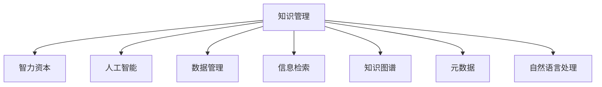

                 

# 知识管理：个人和组织的智力资本

> 关键词：知识管理,智力资本,人工智能,数据管理,信息检索,知识图谱,元数据,自然语言处理

## 1. 背景介绍

### 1.1 问题由来
随着信息化时代的发展，企业组织和个人面临日益增长的信息量。如何高效存储、管理和利用这些信息资源，成为提升组织竞争力和个人工作效率的关键问题。知识管理（Knowledge Management, KMS）应运而生，旨在整合信息、知识，促进其生成、传播和应用，从而转化为人力资本，驱动组织创新和增长。

### 1.2 问题核心关键点
知识管理涉及知识获取、存储、整合、检索、应用等环节。其核心在于通过结构化、组织化的方法，将零散无序的信息转化为可被利用的知识，使得知识能够更好地被组织成员共享和应用，从而转化为智力资本，助力组织创新和发展。

### 1.3 问题研究意义
知识管理对于提升企业组织和个人的工作效率、创新能力、决策质量具有重要意义：

1. **提升工作效率**：通过系统化管理知识，减少信息查找时间，提高工作效率。
2. **促进创新**：知识管理使得信息流动更加顺畅，新想法和创新成果更容易产生和传播。
3. **增强决策能力**：组织拥有更多可用的知识资源，能做出更加全面和科学的决策。
4. **推动组织增长**：知识管理能够吸引和保留人才，提升组织的竞争力。

## 2. 核心概念与联系

### 2.1 核心概念概述

为更好地理解知识管理，本节将介绍几个关键概念：

- 知识管理(Knowledge Management, KMS)：通过技术和管理手段，整合组织内部的知识，促进其生成、存储、传播和应用，转化为智力资本的过程。
- 智力资本(Intellectual Capital, IC)：企业组织和个人拥有的知识、技能、经验、创新能力等无形资产的总称，是组织竞争力的核心。
- 人工智能(Artificial Intelligence, AI)：一种模拟人类智能过程的技术，包括机器学习、自然语言处理、计算机视觉等。
- 数据管理(Data Management)：数据获取、存储、处理、分析和应用的流程和技术。
- 信息检索(Information Retrieval, IR)：通过算法和系统，从大量数据中快速定位相关信息的学科。
- 知识图谱(Knowledge Graph)：以图数据库形式存储和表示知识的结构化技术，方便知识关系的检索和推理。
- 元数据(Metadata)：描述数据的数据，包括数据的来源、格式、质量和用途等信息。
- 自然语言处理(Natural Language Processing, NLP)：处理、理解、生成自然语言的技术，是知识管理的重要工具。

这些概念之间的逻辑关系可以通过以下Mermaid流程图来展示：



这个流程图展示了知识管理的各个关键组成部分，以及它们如何共同作用，促进知识转化为智力资本。

## 3. 核心算法原理 & 具体操作步骤
### 3.1 算法原理概述

知识管理涉及多个核心算法和过程，包括数据管理、信息检索、知识图谱构建、自然语言处理等。其核心思想是通过整合和管理这些算法，将知识从原始数据中提取、组织、检索和应用，转化为有价值的智力资本。

### 3.2 算法步骤详解

#### 3.2.1 数据管理

数据管理是知识管理的第一步，涉及数据的收集、存储、清洗和标准化。具体步骤如下：

1. **数据收集**：通过网络爬虫、API接口、文档扫描等方法，从内部系统、公共数据库、社交媒体等渠道收集数据。
2. **数据清洗**：去除重复、错误、无关的数据，保持数据的质量和一致性。
3. **数据标准化**：将数据格式转换为统一的标准，如统一命名规范、统一时间格式等，便于后续处理和分析。

#### 3.2.2 信息检索

信息检索是知识管理的关键环节，其目标是从大量数据中快速定位相关信息。主要包括以下步骤：

1. **索引构建**：对数据进行预处理和索引，包括分词、去停用词、去除标点等，生成倒排索引。
2. **查询处理**：接收用户查询请求，通过算法匹配查询与索引，返回最相关的结果。
3. **结果优化**：根据查询结果的相似度、相关性等指标，对结果进行排序和筛选，优化用户体验。

#### 3.2.3 知识图谱构建

知识图谱是知识管理的高级形式，通过构建知识图谱，可以更好地表示知识之间的关联关系。主要步骤如下：

1. **数据融合**：将来自不同源的数据进行融合，形成一个统一的知识库。
2. **实体识别和关系抽取**：使用自然语言处理技术，识别出实体和实体之间的关系。
3. **图谱构建**：将实体和关系映射到知识图谱中，形成一个结构化的知识网络。
4. **知识推理**：使用图谱算法，对知识图谱进行推理和扩展，获取更全面的知识信息。

#### 3.2.4 自然语言处理

自然语言处理是知识管理的重要工具，用于处理和理解自然语言。主要步骤如下：

1. **分词和词性标注**：将文本分解为单词，标注每个单词的词性。
2. **命名实体识别**：识别出文本中的人名、地名、机构名等实体。
3. **句法分析**：分析句子结构，识别出主谓宾等语法成分。
4. **情感分析**：分析文本情感倾向，判断情绪是积极、中性还是消极。
5. **机器翻译**：将一种语言的文本翻译成另一种语言。

### 3.3 算法优缺点

知识管理涉及的算法和过程各有优缺点：

- **数据管理**：优点在于标准化了数据格式，便于后续处理；缺点在于数据清洗和标准化可能耗费大量时间和精力。
- **信息检索**：优点在于能够快速定位相关信息，提高工作效率；缺点在于查询算法复杂，对数据量和查询质量要求高。
- **知识图谱构建**：优点在于能更好地表示知识之间的关联关系，支持复杂的知识推理；缺点在于构建和维护知识图谱需要大量人工介入。
- **自然语言处理**：优点在于能理解和生成自然语言，处理文本数据；缺点在于语言模型复杂，需要大量标注数据和计算资源。

### 3.4 算法应用领域

知识管理广泛应用于企业组织和个人知识管理领域，涵盖多个具体应用场景：

- **企业知识管理**：构建企业知识库，管理文档、专利、项目报告等知识资产。通过知识图谱和自然语言处理技术，实现知识共享和应用。
- **个人知识管理**：管理个人笔记、书籍、论文等知识资源，通过标签、分类等方式进行组织和检索。
- **学术研究**：构建学术论文、数据集等知识资源库，通过信息检索和自然语言处理技术，支持科研创新。
- **商业智能**：通过数据管理和知识图谱构建，支持市场分析、客户关系管理、销售预测等业务场景。
- **医疗健康**：管理患者病历、医学文献等知识资源，通过自然语言处理技术，支持临床决策和科研。

## 4. 数学模型和公式 & 详细讲解  
### 4.1 数学模型构建

知识管理涉及多个数学模型，包括信息检索、知识图谱构建、自然语言处理等。以下将以信息检索为例，介绍其数学模型的构建。

假设查询文本为 $q$，文档集合为 $D=\{d_1, d_2, ..., d_n\}$。信息检索的目标是在 $D$ 中找出与 $q$ 最相关的文档 $d_r$。

定义 $q$ 和 $d_i$ 的相似度为 $s(q, d_i)$，根据查询匹配度和文档相关性计算。假设 $q$ 的长度为 $m$，每个文档 $d_i$ 的长度为 $n_i$。则信息检索的数学模型为：

$$
s(q, d_i) = \frac{s_{w}(q, d_i) + s_{l}(q, d_i)}{\sqrt{(m+n_i)}}
$$

其中，$s_{w}(q, d_i)$ 为词向量相似度，$s_{l}(q, d_i)$ 为文本长度相似度。具体计算公式如下：

$$
s_{w}(q, d_i) = \sum_{j=1}^{m} \sum_{k=1}^{n_i} w_{jk} (q_j - \bar{q})(d_{ik} - \bar{d_i})
$$

$$
s_{l}(q, d_i) = \frac{m}{n_i} \text{或} \frac{n_i}{m}
$$

其中，$w_{jk}$ 为词向量权重，$\bar{q}$ 和 $\bar{d_i}$ 分别为 $q$ 和 $d_i$ 的平均词向量。

### 4.2 公式推导过程

以下我们以信息检索的余弦相似度为例，推导其计算公式。

假设查询向量为 $q = (q_1, q_2, ..., q_m)$，文档向量为 $d = (d_1, d_2, ..., d_n)$。余弦相似度的计算公式为：

$$
\cos(q, d) = \frac{q \cdot d}{\|q\| \cdot \|d\|}
$$

其中，$\cdot$ 表示向量点积，$\| \|$ 表示向量范数。

通过余弦相似度公式，可以计算查询向量 $q$ 和文档向量 $d$ 的相似度，从而判断文档的相关性。余弦相似度越高，表示查询与文档的相关性越高。

### 4.3 案例分析与讲解

假设查询文本为 "人工智能发展历程"，文档集合为包含多个相关文档的集合。使用TF-IDF算法计算查询和文档的词向量，并将其代入余弦相似度公式进行计算。具体步骤如下：

1. **构建词向量**：对查询和文档进行分词，去除停用词和标点，计算TF-IDF值，生成词向量 $q$ 和 $d$。
2. **计算相似度**：将 $q$ 和 $d$ 代入余弦相似度公式，计算出相似度值 $s(q, d)$。
3. **排序和返回**：根据相似度值对文档进行排序，返回最相关的文档。

假设通过计算得到最相关的文档为 "人工智能技术发展概述"，则可以将其作为检索结果返回给用户。

## 5. 项目实践：代码实例和详细解释说明
### 5.1 开发环境搭建

在进行知识管理项目实践前，我们需要准备好开发环境。以下是使用Python进行自然语言处理和信息检索的开发环境配置流程：

1. 安装Anaconda：从官网下载并安装Anaconda，用于创建独立的Python环境。

2. 创建并激活虚拟环境：
```bash
conda create -n pytorch-env python=3.8 
conda activate pytorch-env
```

3. 安装PyTorch：根据CUDA版本，从官网获取对应的安装命令。例如：
```bash
conda install pytorch torchvision torchaudio cudatoolkit=11.1 -c pytorch -c conda-forge
```

4. 安装nltk库：用于文本处理和分词。
```bash
pip install nltk
```

5. 安装gensim库：用于构建词向量模型。
```bash
pip install gensim
```

6. 安装Elasticsearch：用于构建分布式搜索引擎。
```bash
pip install elasticsearch
```

完成上述步骤后，即可在`pytorch-env`环境中开始知识管理项目的开发。

### 5.2 源代码详细实现

下面我们以构建基于TF-IDF的信息检索系统为例，给出使用nltk和gensim库的Python代码实现。

首先，准备训练语料库：

```python
import nltk
from nltk.corpus import stopwords
from nltk.tokenize import word_tokenize
from nltk.stem import PorterStemmer

nltk.download('punkt')
nltk.download('stopwords')
nltk.download('wordnet')
stop_words = set(stopwords.words('english'))
ps = PorterStemmer()

def preprocess(text):
    tokens = word_tokenize(text.lower())
    tokens = [ps.stem(token) for token in tokens if token not in stop_words]
    return tokens
```

然后，使用gensim库构建TF-IDF模型：

```python
from gensim import corpora, models

# 构建词典
texts = [
    ["artificial", "intelligence", "is", "a", "complex", "area", "of", "computer", "science"],
    ["natural", "language", "processing", "is", "an", "important", "field", "within", "the", "computational", "linguistics", "subfield"],
    ["knowledge", "management", "can", "help", "organizations", "to", "manage", "their", "information", "resources", "more", "effectively"],
    ["semantic", "web", "is", "a", "way", "of", "representing", "semantic", "information", "in", "the", "web"]
]

dictionary = corpora.Dictionary(texts)
corpus = [dictionary.doc2bow(text, trim_length=50) for text in texts]

# 训练TF-IDF模型
tfidf = models.TfidfModel(corpus)
corpus_tfidf = tfidf[corpus]
```

接下来，使用Elasticsearch构建分布式搜索引擎：

```python
from elasticsearch import Elasticsearch

es = Elasticsearch([{'host': 'localhost', 'port': 9200}])
es.indices.create(index='test_index', ignore=[400, 404])

for doc in corpus_tfidf:
    es.index(index='test_index', doc_type='text', body={'query': ' '.join([text for _, text in doc]), 'id': i})
```

最后，构建信息检索系统：

```python
from gensim import similarities

# 构建倒排索引
idx = similarities.MatrixSimilarity(corpus_tfidf)

# 定义查询函数
def search(query):
    query = preprocess(query)
    query_bow = dictionary.doc2bow(query)
    query_tfidf = tfidf[query_bow]
    sims = idx[query_tfidf]
    results = [(corpus[i], sim) for i, sim in enumerate(sims)]
    results = sorted(results, key=lambda x: x[1], reverse=True)
    return results[:10]
```

以上代码实现了基本的基于TF-IDF的信息检索系统。用户可以输入查询文本，系统返回最相关的文档。

### 5.3 代码解读与分析

让我们再详细解读一下关键代码的实现细节：

**preprocess函数**：
- 使用nltk库对文本进行分词、去停用词、词干化等预处理操作，返回处理后的词列表。

**corpus构建**：
- 将文本转换为bow格式，生成TF-IDF值。

**Elasticsearch索引创建**：
- 使用Elasticsearch库创建索引，将文档集合存入索引中。

**search函数**：
- 对查询文本进行预处理，转换为bow格式。
- 计算查询文本和文档集合的TF-IDF向量，计算相似度。
- 根据相似度值对文档进行排序，返回最相关的文档。

可以看到，使用nltk和gensim库，可以方便地实现基本的文本处理和TF-IDF信息检索功能。通过扩展和优化这些代码，可以实现更复杂和高效的知识管理系统。

## 6. 实际应用场景
### 6.1 企业知识管理

企业知识管理系统的应用场景丰富多样，以下列举几个典型场景：

- **文档管理**：构建企业文档管理系统，对公司文档、专利、项目报告等进行集中管理和检索。使用自然语言处理技术，自动分类和标注文档，提高文档检索的准确性和效率。
- **知识库构建**：搭建企业知识库，将专家知识、业务文档、技术文档等整理和归纳，供员工随时检索和参考。通过知识图谱技术，实现知识之间的关联和推理，支持复杂的查询需求。
- **员工培训**：利用知识管理系统，整理和共享内部培训资料，通过智能推荐系统，帮助员工学习和提升技能。通过知识图谱技术，支持员工间知识共享和交流，加速知识传播和应用。

### 6.2 个人知识管理

个人知识管理系统的应用场景主要集中在个人学习和工作上：

- **笔记管理**：构建个人笔记系统，对笔记进行分类、标签化，支持全文搜索和智能推荐。通过自然语言处理技术，自动标注笔记，提高检索和总结的效率。
- **书籍管理**：整理个人藏书，通过文本分析和OCR技术，将纸质书籍转换为数字形式，支持全文检索和阅读。通过知识图谱技术，支持跨书籍的知识关联和推荐。
- **学习计划**：利用知识管理系统，制定个人学习计划，根据学习进度和效果进行动态调整。通过知识图谱技术，推荐相关课程和资料，支持学习路径优化。

### 6.3 学术研究

学术研究领域知识管理系统的应用场景主要集中在论文管理、数据管理和科研合作上：

- **论文管理**：构建学术论文管理系统，对论文进行分类、标签化，支持全文搜索和智能推荐。通过自然语言处理技术，自动标注论文，提高检索和总结的效率。
- **数据管理**：搭建科研数据管理系统，对科研数据进行集中管理和共享。通过知识图谱技术，支持数据之间的关联和推理，加速科研数据的利用。
- **科研合作**：利用知识管理系统，支持科研团队的协作和交流，通过智能推荐系统，推荐相关研究文献和数据，支持科研项目的推进。

## 7. 工具和资源推荐
### 7.1 学习资源推荐

为了帮助开发者系统掌握知识管理的理论基础和实践技巧，这里推荐一些优质的学习资源：

1. 《Knowledge Management: Improving Organization Performance》系列书籍：由知识管理领域专家撰写，系统介绍了知识管理的理论基础、实践方法和技术工具。
2. 《Data Science and Machine Learning Bootcamps》课程：通过在线课程，学习数据管理、自然语言处理、知识图谱等核心技术。
3. 《Natural Language Processing with Python》书籍：由自然语言处理领域的权威专家撰写，详细介绍了自然语言处理的核心算法和实践案例。
4. 《Introduction to Knowledge Graphs》课程：学习知识图谱的基本概念和构建方法，掌握如何将知识转换为结构化数据。
5. 《Python for Data Science Handbook》书籍：由数据科学领域的知名专家撰写，全面介绍了Python在数据处理、分析、可视化等方面的应用。

通过对这些资源的学习实践，相信你一定能够快速掌握知识管理的精髓，并用于解决实际的NLP问题。
###  7.2 开发工具推荐

高效的开发离不开优秀的工具支持。以下是几款用于知识管理开发的常用工具：

1. Elasticsearch：基于Lucene的分布式搜索引擎，支持高并发的全文检索和查询。
2. Apache Solr：开源搜索引擎，支持复杂的查询和文本分析，支持分布式部署。
3. Apache Flink：分布式流处理框架，支持实时数据处理和分析。
4. Apache Hadoop：大数据处理框架，支持大规模数据存储和处理。
5. Apache Kafka：分布式流处理平台，支持高吞吐量的数据传输和处理。

合理利用这些工具，可以显著提升知识管理系统的开发效率，加快创新迭代的步伐。

### 7.3 相关论文推荐

知识管理的研究源于学界的持续研究。以下是几篇奠基性的相关论文，推荐阅读：

1. "Knowledge Management and Organizational Memory" by Christopher E. representing and managing knowledge within organizations" by Christopher E. representing and managing knowledge within organizations" by Christopher E.
2. "The Science of Making Things Explicit" by Edward P. Jones, Mary Ann Sullivan, and George P. Sutherland
3. "Knowledge Management and Innovation in Organizations" by Peter Galunic and Andrew Streibel
4. "A Knowledge Management Perspective on Innovation and Information Technologies" by F. Duval and A. Beaumont
5. "Beyond Knowledge Management: A Knowledge Utilization Framework" by R. M. O'Leary and R. M. Muffly

这些论文代表了大语言模型微调技术的发展脉络。通过学习这些前沿成果，可以帮助研究者把握学科前进方向，激发更多的创新灵感。

## 8. 总结：未来发展趋势与挑战

### 8.1 总结

本文对知识管理进行了全面系统的介绍。首先阐述了知识管理在企业组织和个人中的重要性，明确了知识管理的关键组件和技术路径。其次，从原理到实践，详细讲解了知识管理的核心算法和操作步骤，给出了知识管理项目开发的完整代码实例。同时，本文还广泛探讨了知识管理在企业知识管理、个人知识管理、学术研究等多个领域的应用前景，展示了知识管理技术的巨大潜力。

通过本文的系统梳理，可以看到，知识管理对于提升组织和个人的工作效率、创新能力、决策质量具有重要意义。未来，随着技术的不断进步，知识管理技术将更加智能化、自动化，从而更好地支持组织和个人的需求。

### 8.2 未来发展趋势

展望未来，知识管理将呈现以下几个发展趋势：

1. **智能化**：未来的知识管理系统将具备更高的智能化水平，通过自然语言处理、机器学习等技术，自动处理和分析数据，提供更准确的搜索结果和推荐。
2. **自动化**：知识管理系统将实现更多的自动化操作，如自动分类、自动标注、自动检索等，减少人工介入，提升效率。
3. **协作化**：知识管理系统将支持更紧密的协作和交流，支持多人协同编辑、评论和反馈，促进知识的共享和创新。
4. **实时化**：未来的知识管理系统将具备更强的实时处理能力，支持实时数据更新和动态检索，及时响应用户需求。
5. **跨领域**：知识管理系统将支持跨领域知识的整合和应用，通过知识图谱技术，实现不同领域知识的关联和推理。

以上趋势凸显了知识管理技术的广阔前景。这些方向的探索发展，必将进一步提升知识管理的智能化、自动化和协作化水平，为组织和个人带来更大的价值。

### 8.3 面临的挑战

尽管知识管理技术已经取得了一定的进展，但在迈向更加智能化、普适化应用的过程中，它仍面临诸多挑战：

1. **数据质量问题**：知识管理依赖于高质量的数据，如何确保数据的准确性和完整性，是一个重要问题。
2. **隐私和安全性**：知识管理涉及大量的敏感数据，如何保护数据隐私和系统安全，是一个亟待解决的问题。
3. **用户接受度**：知识管理系统需要用户广泛使用才能发挥其价值，如何提升用户接受度和使用效率，是一个重要课题。
4. **技术融合**：知识管理需要与其他技术（如大数据、人工智能、物联网等）进行深度融合，如何协同优化，是一个重要挑战。
5. **标准化问题**：知识管理涉及多领域、多源数据的整合，如何建立统一的标准和规范，是一个重要问题。

这些挑战需要多方协同努力，通过技术创新和政策引导，才能逐步克服，推动知识管理技术的进一步发展。

### 8.4 研究展望

面对知识管理面临的种种挑战，未来的研究需要在以下几个方面寻求新的突破：

1. **数据治理**：引入数据治理技术，确保数据的质量、安全和隐私。
2. **知识图谱构建**：开发更高效、更智能的知识图谱构建方法，支持大规模知识的整合和推理。
3. **自然语言处理**：引入更先进的自然语言处理技术，提升知识管理的智能化水平。
4. **跨领域知识融合**：开发跨领域知识融合方法，支持不同领域知识的整合和应用。
5. **系统协作**：引入协同办公和协作工具，支持多人协同编辑和交流。

这些研究方向的探索，必将引领知识管理技术迈向更高的台阶，为组织和个人带来更大的价值。面向未来，知识管理技术还需要与其他人工智能技术进行更深入的融合，如知识表示、因果推理、强化学习等，多路径协同发力，共同推动知识管理的进步。

## 9. 附录：常见问题与解答

**Q1：知识管理对组织和个人有什么具体好处？**

A: 知识管理对组织和个人有以下具体好处：

1. **提升工作效率**：通过系统化管理知识，减少信息查找时间，提高工作效率。
2. **促进创新**：知识管理使得信息流动更加顺畅，新想法和创新成果更容易产生和传播。
3. **增强决策能力**：组织拥有更多可用的知识资源，能做出更加全面和科学的决策。
4. **推动组织增长**：知识管理能够吸引和保留人才，提升组织的竞争力。
5. **支持学习和培训**：知识管理系统可以整理和共享内部培训资料，支持员工学习和提升技能。

**Q2：如何进行有效的知识管理？**

A: 进行有效的知识管理，需要注意以下几点：

1. **建立知识库**：构建系统的知识库，将知识进行分类、标签化和组织。
2. **利用自然语言处理技术**：使用自然语言处理技术，自动分类、标注和检索知识。
3. **引入知识图谱**：构建知识图谱，支持知识之间的关联和推理。
4. **开展知识培训**：对员工进行知识管理的培训，提高他们的知识管理意识和能力。
5. **制定知识管理策略**：制定明确的知识管理策略，确保知识管理的持续性和规范性。

**Q3：如何保证知识管理系统的数据质量？**

A: 保证知识管理系统的数据质量，需要注意以下几点：

1. **数据清洗**：对数据进行清洗，去除重复、错误和无关的数据，保持数据的质量和一致性。
2. **数据标准化**：将数据格式转换为统一的标准，如统一命名规范、统一时间格式等。
3. **数据验证**：对数据进行验证，确保数据的准确性和完整性。
4. **数据监控**：对数据进行监控，及时发现和纠正数据错误。

通过以上措施，可以最大限度地保证知识管理系统的数据质量，确保知识管理的有效性和可靠性。

---

作者：禅与计算机程序设计艺术 / Zen and the Art of Computer Programming

