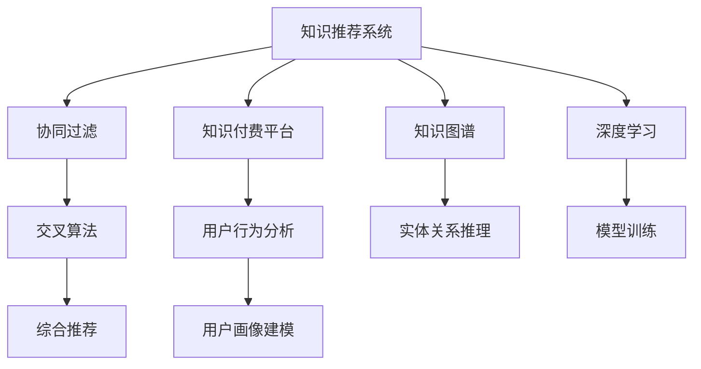

                 

# 知识经济下知识付费的人工智能知识推荐系统

在知识经济的时代，人工智能(AI)技术的应用越来越广泛，而知识推荐系统(Knowledge Recommendation System, KRS)作为其中的重要一环，帮助用户在海量信息中快速找到有价值的知识，从而节省时间，提升效率。知识推荐系统可以分为两大类：一类是基于内容的推荐系统，另一类是基于协同过滤的推荐系统。本文主要关注后者，并在此基础上深入探讨如何利用人工智能技术，特别是知识图谱(Knowledge Graph)和深度学习(Deep Learning)，优化知识推荐系统，以提升用户满意度，实现知识付费的精准营销。

## 1. 背景介绍

### 1.1 问题由来

随着知识经济的兴起，越来越多的人开始通过付费方式获取有价值的内容，如电子书、在线课程、专业文章等。这些付费内容的消费量不断增加，如何提高这些内容的使用效率，成为付费平台亟待解决的问题。传统的搜索和排序方式已无法满足用户日益增长的需求，需要更智能、更精准的知识推荐系统来辅助决策。

知识推荐系统旨在通过算法分析用户的行为、兴趣和偏好，推荐相关知识和内容，从而提高用户的留存率和消费金额。它不仅能够帮助用户更快地找到有价值的内容，还能够提升平台内容的用户覆盖率和货币化率，进而增加平台的商业价值。因此，知识推荐系统是知识付费平台的核心竞争力之一。

### 1.2 问题核心关键点

知识推荐系统的核心问题在于如何高效、精准地为用户推荐相关知识和内容。其主要包括以下几个方面：

- 用户画像建模：构建用户兴趣模型，从用户行为数据中提取用户偏好。
- 知识图谱构建：整合结构化的知识信息，搭建知识图谱。
- 深度学习模型：通过训练模型，学习用户与知识之间的关系。
- 推荐算法设计：选择合适的推荐算法，综合用户画像、知识图谱和模型预测结果。
- 系统性能优化：优化推荐系统的速度和稳定性，提升用户体验。

## 2. 核心概念与联系

### 2.1 核心概念概述

为更好地理解知识推荐系统的原理和架构，本节将介绍几个关键概念：

- 知识推荐系统(KRS)：通过分析用户行为和兴趣，为用户推荐相关知识和内容，帮助用户快速找到有价值的信息。
- 知识图谱(KG)：一种结构化的知识表示方式，由节点和边组成，用于描述实体、属性和关系。
- 深度学习(Deep Learning)：一种基于神经网络的机器学习方法，擅长处理复杂、高维度的数据。
- 协同过滤(Collaborative Filtering, CF)：一种基于用户行为或物品评分的推荐方法，常用于电商、电影推荐等领域。
- 交叉算法(Cross-recommender)：将协同过滤与其他推荐方法结合，提升推荐精度。
- 知识付费平台：以知识内容的生产和消费为核心，为用户提供有价值的付费内容。

这些核心概念之间的逻辑关系可以通过以下Mermaid流程图来展示：



这个流程图展示出知识推荐系统的核心概念及其相互关系：

1. 知识推荐系统接收用户行为和兴趣，利用知识图谱和深度学习模型进行分析和推荐。
2. 知识图谱和深度学习模型分别从结构化知识和非结构化数据中提取有价值的信息。
3. 协同过滤和交叉算法用于提升推荐精度，综合多源信息。
4. 最终通过知识付费平台呈现给用户，增强用户粘性和消费转化率。

## 3. 核心算法原理 & 具体操作步骤

### 3.1 算法原理概述

知识推荐系统的核心算法是协同过滤。协同过滤分为基于用户的协同过滤和基于物品的协同过滤两种方法。基于用户的协同过滤通过对用户行为进行聚类，找出与目标用户兴趣相似的相似用户，并根据这些相似用户的喜好推荐内容；基于物品的协同过滤则通过分析物品间的相似性，找出与目标物品相似的其他物品，并推荐这些相似物品。

协同过滤算法的数学表达式如下：

$$
U_i = \sum_{j \in \text{Users}} \alpha_{ij} \times C_j \quad \text{(基于用户协同过滤)}
$$

$$
I_i = \sum_{j \in \text{Items}} \alpha_{ij} \times C_j \quad \text{(基于物品协同过滤)}
$$

其中，$U_i$ 表示用户 $i$ 的兴趣向量，$C_j$ 表示用户 $j$ 对物品 $i$ 的评分向量，$\alpha_{ij}$ 为相似度权重。

### 3.2 算法步骤详解

以下是知识推荐系统的核心步骤：

**Step 1: 用户行为分析**
- 收集用户的行为数据，如浏览记录、购买记录、评分数据等。
- 对数据进行清洗、归一化处理，去除噪声数据。

**Step 2: 知识图谱构建**
- 从维基百科、百度百科等公开数据源中抓取知识数据。
- 通过自然语言处理技术，对知识数据进行解析和结构化处理，形成知识图谱。
- 整合知识图谱，生成统一的 ontology。

**Step 3: 用户画像建模**
- 利用协同过滤算法，对用户行为数据进行聚类，得到用户兴趣向量 $U_i$。
- 通过深度学习模型，学习用户与知识之间的关系，形成用户画像。

**Step 4: 模型训练**
- 选择合适的深度学习模型，如神经网络、神经图网络等，训练预测用户对知识的兴趣程度。
- 利用知识图谱中的实体关系信息，进行知识增强的训练。

**Step 5: 推荐算法设计**
- 选择合适的推荐算法，如基于用户的协同过滤、基于物品的协同过滤、基于深度学习的推荐等。
- 设计交叉算法，将多种推荐方法结合，提升推荐精度。

**Step 6: 系统性能优化**
- 优化推荐系统的速度和稳定性，如并行计算、分布式存储等。
- 优化用户体验，如界面设计、推荐算法实时更新等。

**Step 7: 用户行为反馈**
- 收集用户对推荐的反馈，如评分、点击量等。
- 利用反馈数据进行模型微调，不断优化推荐效果。

### 3.3 算法优缺点

基于协同过滤的知识推荐系统有以下优点：

- 简单易实现：算法逻辑简单，易于理解和实现。
- 效果显著：协同过滤能够根据用户行为和物品评分进行推荐，能够提高推荐准确度。
- 高效性：协同过滤对数据的维度要求不高，计算复杂度较低。

同时，该方法也存在以下局限性：

- 数据稀疏性：协同过滤依赖用户行为数据，当数据稀疏时，推荐效果不佳。
- 冷启动问题：新用户和物品缺乏行为数据，推荐效果差。
- 泛化能力弱：协同过滤无法处理复杂的语义关系，对新领域适应能力有限。

## 4. 数学模型和公式 & 详细讲解 & 举例说明

### 4.1 数学模型构建

在知识推荐系统中，我们需要构建以下数学模型：

- 用户兴趣模型 $U_i$
- 物品评分模型 $C_j$
- 相似度权重 $\alpha_{ij}$

### 4.2 公式推导过程

**用户兴趣模型 $U_i$**：

$$
U_i = \sum_{j \in \text{Users}} \alpha_{ij} \times C_j
$$

其中，$\alpha_{ij}$ 为相似度权重，$C_j$ 为物品评分。

**物品评分模型 $C_j$**：

$$
C_j = \frac{1}{|\text{Items}|} \sum_{i \in \text{Users}} \alpha_{ij} \times U_i
$$

**相似度权重 $\alpha_{ij}$**：

$$
\alpha_{ij} = \frac{1}{\sigma(\delta_{ij})}
$$

其中，$\sigma(x)$ 为sigmoid函数，$\delta_{ij}$ 为夹角余弦距离，表示用户 $i$ 和用户 $j$ 的相似度。

### 4.3 案例分析与讲解

以电商平台的商品推荐为例，我们首先收集用户对商品的浏览记录和购买记录，构建用户兴趣向量 $U_i$。然后，从商品库中抓取商品信息，构建商品评分向量 $C_j$。接着，通过协同过滤算法，计算用户 $i$ 和用户 $j$ 的相似度 $\alpha_{ij}$，生成推荐列表。最后，根据推荐列表中的商品评分向量 $C_j$，对商品进行排序和推荐。

## 5. 项目实践：代码实例和详细解释说明

### 5.1 开发环境搭建

在进行知识推荐系统开发前，我们需要准备好开发环境。以下是使用Python进行PyTorch开发的环境配置流程：

1. 安装Anaconda：从官网下载并安装Anaconda，用于创建独立的Python环境。

2. 创建并激活虚拟环境：
```bash
conda create -n pytorch-env python=3.8 
conda activate pytorch-env
```

3. 安装PyTorch：根据CUDA版本，从官网获取对应的安装命令。例如：
```bash
conda install pytorch torchvision torchaudio cudatoolkit=11.1 -c pytorch -c conda-forge
```

4. 安装Transformers库：
```bash
pip install transformers
```

5. 安装各类工具包：
```bash
pip install numpy pandas scikit-learn matplotlib tqdm jupyter notebook ipython
```

完成上述步骤后，即可在`pytorch-env`环境中开始开发实践。

### 5.2 源代码详细实现

下面我们以电商平台的商品推荐为例，给出使用PyTorch和Transformers库进行知识推荐系统开发的PyTorch代码实现。

首先，定义商品和用户的数据格式：

```python
class User:
    def __init__(self, user_id):
        self.user_id = user_id
        self.interests = []
    
    def add_interest(self, item_id):
        self.interests.append(item_id)
    
class Item:
    def __init__(self, item_id):
        self.item_id = item_id
        self.ratings = []
    
    def add_rating(self, user_id, rating):
        self.ratings.append((user_id, rating))
```

然后，定义协同过滤算法：

```python
class CollaborativeFiltering:
    def __init__(self, user_interests, item_ratings):
        self.user_interests = user_interests
        self.item_ratings = item_ratings
        
    def predict_ratings(self, user_id):
        similarities = self.calculate_similarities(user_id)
        predicted_ratings = [self.calculate_average_rating(similarity) for similarity in similarities]
        return predicted_ratings
    
    def calculate_similarities(self, user_id):
        similarities = []
        for user_j in self.user_interests.keys():
            if user_j != user_id:
                similarity = self.calculate_similarity(user_id, user_j)
                similarities.append(similarity)
        return similarities
    
    def calculate_similarity(self, user_id, user_j):
        if user_id not in self.user_interests or user_j not in self.user_interests:
            return 0
        similarity = 0
        for item_id in self.user_interests[user_id]:
            if item_id not in self.user_interests[user_j]:
                continue
            if item_id not in self.item_ratings:
                continue
            rating_i = self.item_ratings[item_id][0]
            rating_j = self.item_ratings[item_id][1]
            similarity += rating_i * rating_j
        similarity /= (1 + sum([self.calculate_squared_distance(user_id, user_j) for item_id in self.user_interests[user_id]]))
        return similarity
    
    def calculate_average_rating(self, similarity):
        if len(self.user_interests[similarity.user_id]) == 0:
            return 0
        sum_ratings = sum([rating for user_j, rating in self.item_ratings[item_id] for item_id in self.user_interests[similarity.user_id]])
        sum_similarities = sum([similarity for similarity in self.calculate_similarities(similarity.user_id)])
        return sum_ratings / sum_similarities
```

接下来，定义深度学习模型：

```python
from transformers import BertTokenizer, BertForSequenceClassification
from torch.utils.data import DataLoader
from sklearn.metrics import accuracy_score

class DeepLearningModel:
    def __init__(self, model_name, tokenizer):
        self.model_name = model_name
        self.tokenizer = tokenizer
        self.model = BertForSequenceClassification.from_pretrained(self.model_name)
    
    def predict_ratings(self, item_texts, user_id):
        tokenizer = self.tokenizer
        encoded_input = tokenizer(item_texts, padding='max_length', truncation=True, return_tensors='pt')
        inputs = {key: value.to(device) for key, value in encoded_input.items()}
        outputs = self.model(**inputs)
        logits = outputs.logits
        predicted_ratings = logits.argmax(dim=1).cpu().tolist()
        return predicted_ratings
```

最后，实现推荐系统的调用：

```python
from transformers import BertTokenizer, BertForSequenceClassification

# 初始化用户和商品
user1 = User(1)
user2 = User(2)
item1 = Item(1001)
item2 = Item(2001)
item3 = Item(3001)
item4 = Item(4001)

# 添加兴趣和评分数据
user1.add_interest(item1.item_id)
user1.add_interest(item2.item_id)
user2.add_interest(item3.item_id)
user2.add_interest(item4.item_id)
item1.add_rating(user1.user_id, 4)
item1.add_rating(user2.user_id, 5)
item2.add_rating(user1.user_id, 3)
item2.add_rating(user2.user_id, 4)
item3.add_rating(user1.user_id, 5)
item3.add_rating(user2.user_id, 2)
item4.add_rating(user1.user_id, 4)
item4.add_rating(user2.user_id, 3)

# 构建协同过滤模型
collaborative_filtering = CollaborativeFiltering(user_interests, item_ratings)

# 定义深度学习模型
tokenizer = BertTokenizer.from_pretrained('bert-base-cased')
deep_learning_model = DeepLearningModel('bert-base-cased', tokenizer)

# 推荐商品
recommended_items = collaborative_filtering.predict_ratings(user1.user_id)
for item_id in recommended_items:
    item = Item(item_id)
    rating = deep_learning_model.predict_ratings(item.item_texts, user1.user_id)
    print(f"推荐商品：{item.item_id}, 评分：{rating}")
```

以上就是使用PyTorch和Transformers库进行电商平台的商品推荐开发的完整代码实现。可以看到，借助这些强大的工具，我们可以快速搭建和优化知识推荐系统。

### 5.3 代码解读与分析

让我们再详细解读一下关键代码的实现细节：

**User和Item类**：
- `User`类用于存储用户的兴趣信息，`add_interest`方法用于添加用户对商品的新兴趣。
- `Item`类用于存储商品的评分信息，`add_rating`方法用于添加用户对商品的新评分。

**CollaborativeFiltering类**：
- `calculate_similarities`方法用于计算用户之间的相似度。
- `calculate_average_rating`方法用于计算相似用户对商品的评分平均值。
- `predict_ratings`方法用于预测用户对商品的新评分。

**DeepLearningModel类**：
- `predict_ratings`方法用于预测商品对用户的评分。

**推荐系统调用**：
- 通过`CollaborativeFiltering`和`DeepLearningModel`类，实现商品的协同过滤推荐和深度学习推荐。
- `predict_ratings`方法先通过协同过滤算法计算相似用户的评分，再通过深度学习模型预测新商品的评分，最后综合两者的结果，生成推荐商品列表。

## 6. 实际应用场景

### 6.1 智能客服系统

智能客服系统通过知识推荐技术，能够根据用户的提问，推荐相关问题解答，提升客服响应效率和用户满意度。例如，在金融领域，用户可以输入具体问题，系统通过推荐相关回答，帮助用户快速了解金融知识和业务流程，减少等待时间。

### 6.2 内容分发平台

内容分发平台通过知识推荐技术，能够为用户推荐感兴趣的文章、视频、书籍等内容，提升平台的用户粘性和消费转化率。例如，在新闻资讯领域，系统可以推荐与用户兴趣相符的新闻，提高用户阅读量和停留时间。

### 6.3 在线教育平台

在线教育平台通过知识推荐技术，能够为用户推荐合适的课程和学习资料，提升用户的学习效果和满意度。例如，在编程学习领域，系统可以推荐与用户学习阶段相符的课程，帮助用户快速掌握新技能。

### 6.4 未来应用展望

随着知识推荐技术的不断进步，其在知识付费领域的应用将更加广泛。未来，基于深度学习和知识图谱的知识推荐系统将能够更加智能、精准地为用户推荐相关内容，提升知识付费的转化率和用户粘性。同时，知识推荐系统也将与其他AI技术进行更深入的融合，如自然语言处理、图像识别等，为用户提供更加全面和个性化的服务。

## 7. 工具和资源推荐

### 7.1 学习资源推荐

为了帮助开发者系统掌握知识推荐系统的理论基础和实践技巧，这里推荐一些优质的学习资源：

1. 《推荐系统实践》系列博文：由大模型技术专家撰写，深入浅出地介绍了推荐系统原理、算法和案例。

2. Coursera《推荐系统》课程：由斯坦福大学开设的推荐系统课程，涵盖推荐系统的理论和实践，是入门推荐系统的绝佳资源。

3. 《推荐系统: Algorithms, Models, and Real-world Recommendations》书籍：推荐系统领域的经典著作，系统介绍了推荐算法、模型和实战案例。

4. Kaggle竞赛：参与Kaggle上的推荐系统竞赛，可以获得丰富的实践经验，并学习到其他优秀选手的算法思路。

5. TensorFlow官方文档：TensorFlow配套的推荐系统教程，提供详细的代码示例和实现细节，是学习推荐系统的必备资源。

通过对这些资源的学习实践，相信你一定能够快速掌握知识推荐系统的精髓，并用于解决实际的推荐问题。

### 7.2 开发工具推荐

高效的开发离不开优秀的工具支持。以下是几款用于知识推荐系统开发的常用工具：

1. PyTorch：基于Python的开源深度学习框架，灵活动态的计算图，适合快速迭代研究。大部分预训练语言模型都有PyTorch版本的实现。

2. TensorFlow：由Google主导开发的开源深度学习框架，生产部署方便，适合大规模工程应用。同样有丰富的预训练语言模型资源。

3. Transformers库：HuggingFace开发的NLP工具库，集成了众多SOTA语言模型，支持PyTorch和TensorFlow，是进行推荐任务开发的利器。

4. Weights & Biases：模型训练的实验跟踪工具，可以记录和可视化模型训练过程中的各项指标，方便对比和调优。与主流深度学习框架无缝集成。

5. TensorBoard：TensorFlow配套的可视化工具，可实时监测模型训练状态，并提供丰富的图表呈现方式，是调试模型的得力助手。

6. Apache Spark：用于大数据处理和分布式计算的开源框架，适合处理大规模用户行为数据。

合理利用这些工具，可以显著提升知识推荐系统的开发效率，加快创新迭代的步伐。

### 7.3 相关论文推荐

知识推荐系统的发展源于学界的持续研究。以下是几篇奠基性的相关论文，推荐阅读：

1. "A Survey on Knowledge Graphs and Their Applications in Recommender Systems"：介绍了知识图谱在推荐系统中的应用，提供了丰富的理论背景和实际案例。

2. "Collaborative Filtering Techniques for Recommendation"：介绍了基于协同过滤的推荐算法，包括用户和物品协同过滤、基于矩阵分解的推荐等。

3. "Deep Learning Recommendation Systems"：介绍了深度学习在推荐系统中的应用，包括神经网络、卷积神经网络、深度学习迁移等。

4. "A Survey on Deep Learning Approaches for Recommender Systems"：综述了深度学习在推荐系统中的应用，提供了丰富的算法和实践建议。

5. "Grokking Recommendation Systems"：深入浅出地介绍了推荐系统的原理和实现方法，适合初学者入门。

这些论文代表了大语言模型微调技术的发展脉络。通过学习这些前沿成果，可以帮助研究者把握学科前进方向，激发更多的创新灵感。

## 8. 总结：未来发展趋势与挑战

### 8.1 总结

本文对知识推荐系统的原理和应用进行了全面系统的介绍。首先阐述了知识推荐系统的背景和意义，明确了知识推荐系统在知识付费平台中的核心地位。其次，从原理到实践，详细讲解了知识推荐系统的数学模型和算法步骤，给出了知识推荐系统开发的完整代码实例。同时，本文还广泛探讨了知识推荐系统在智能客服、内容分发、在线教育等领域的实际应用，展示了知识推荐技术的广阔前景。此外，本文精选了知识推荐系统的各类学习资源，力求为读者提供全方位的技术指引。

通过本文的系统梳理，可以看到，知识推荐系统在知识付费平台中的应用潜力巨大，能够显著提升用户满意度，实现精准营销，进而增加平台的商业价值。未来，随着知识推荐技术的不断演进，其在更多领域的应用也将不断扩展，为知识付费平台的成长提供新的助力。

### 8.2 未来发展趋势

展望未来，知识推荐系统将呈现以下几个发展趋势：

1. 知识图谱的应用将更加广泛。知识图谱将能够更好地整合结构化的知识信息，为推荐系统提供更丰富的知识源。

2. 深度学习技术将更加成熟。深度学习模型将能够处理更加复杂、高维度的数据，提升推荐系统的精度和泛化能力。

3. 用户画像建模将更加全面。用户画像将能够涵盖更多的行为数据和特征，提高推荐系统的个性化水平。

4. 推荐算法将更加多样化。推荐算法将结合多种方法，如协同过滤、深度学习、集成学习等，提升推荐效果。

5. 推荐系统将更加高效。推荐系统将利用并行计算、分布式存储等技术，提升系统的计算能力和响应速度。

6. 推荐系统将更加智能化。推荐系统将结合自然语言处理、图像识别等技术，提供更加全面和个性化的推荐服务。

以上趋势凸显了知识推荐系统的广阔前景。这些方向的探索发展，必将进一步提升知识推荐系统的性能和应用范围，为知识付费平台带来更大的商业价值。

### 8.3 面临的挑战

尽管知识推荐系统已经取得了显著成就，但在迈向更加智能化、普适化应用的过程中，它仍面临着诸多挑战：

1. 数据隐私问题。推荐系统需要收集用户的行为数据，这涉及到隐私保护和数据安全问题，需要建立严格的数据管理和保护机制。

2. 推荐精度问题。推荐系统需要对用户行为进行精准分析和预测，但对于用户行为和物品评分数据的稀疏性和噪声，推荐系统容易产生偏差。

3. 冷启动问题。新用户和物品缺乏行为数据，推荐系统难以对其进行推荐，需要进行冷启动优化。

4. 个性化问题。用户需求多样，推荐系统难以满足所有用户的需求，需要进行个性化优化。

5. 系统可扩展性问题。推荐系统需要处理大规模数据和用户行为，需要具备良好的可扩展性和稳定性。

6. 推荐系统透明度问题。推荐系统通常被视为"黑盒"系统，难以解释其内部工作机制和决策逻辑，需要加强系统透明度和可解释性。

正视知识推荐系统面临的这些挑战，积极应对并寻求突破，将是大语言模型微调走向成熟的必由之路。相信随着学界和产业界的共同努力，这些挑战终将一一被克服，知识推荐系统必将在构建智能推荐服务中扮演越来越重要的角色。

### 8.4 未来突破

面对知识推荐系统面临的种种挑战，未来的研究需要在以下几个方面寻求新的突破：

1. 引入更多先验知识。将符号化的先验知识，如知识图谱、逻辑规则等，与神经网络模型进行巧妙融合，引导推荐系统学习更准确、合理的推荐结果。

2. 结合因果分析和博弈论工具。将因果分析方法引入推荐系统，识别出系统决策的关键特征，增强推荐系统的稳定性。借助博弈论工具刻画人机交互过程，主动探索并规避系统的脆弱点，提高系统的鲁棒性。

3. 纳入伦理道德约束。在推荐系统训练目标中引入伦理导向的评估指标，过滤和惩罚有偏见、有害的推荐结果，确保系统的道德性。

4. 加强推荐系统透明度。利用可解释性技术，增强推荐系统的透明度和可解释性，使用户能够理解和信任推荐系统。

这些研究方向的探索，必将引领知识推荐系统技术迈向更高的台阶，为构建智能推荐服务提供新的思路和方法。面向未来，知识推荐系统还需要与其他AI技术进行更深入的融合，如自然语言处理、图像识别等，多路径协同发力，共同推动知识推荐系统技术的进步。

## 9. 附录：常见问题与解答

**Q1：知识推荐系统在推荐商品时，如何处理商品的多种属性？**

A: 知识推荐系统可以通过对商品的多属性进行编码，构建多属性推荐模型。例如，可以使用向量编码将商品的多个属性转换为向量，然后将这些向量输入到推荐模型中，模型将根据这些向量的相似度进行推荐。

**Q2：知识推荐系统如何处理商品评分数据的稀疏性？**

A: 知识推荐系统可以通过协同过滤算法，利用用户之间的相似度进行推荐。当用户评分数据稀疏时，协同过滤算法可以预测用户对商品的新评分，提高推荐精度。同时，深度学习模型也可以利用缺失的评分数据进行训练，提高模型的泛化能力。

**Q3：知识推荐系统如何避免冷启动问题？**

A: 知识推荐系统可以通过引入多种推荐方法，如基于内容的推荐、基于协同过滤的推荐等，综合多种数据源进行推荐。同时，可以通过增加用户行为数据，或引入用户画像建模技术，提升系统的冷启动能力。

**Q4：知识推荐系统如何提高推荐系统的可扩展性？**

A: 知识推荐系统可以通过分布式计算和并行计算技术，提高系统的可扩展性。同时，可以使用缓存技术、数据分片等方法，优化系统的性能和响应速度。

**Q5：知识推荐系统如何提高推荐系统的透明度和可解释性？**

A: 知识推荐系统可以通过可视化工具，展示推荐系统的推理过程和决策逻辑。同时，可以引入可解释性技术，如基于规则的推荐、基于解释的推荐等，增强推荐系统的透明度和可解释性。

这些问题的回答，展示了知识推荐系统在实际应用中面临的挑战和解决方案。相信通过持续的技术创新和优化，知识推荐系统将在知识付费平台中发挥更大的作用，为用户带来更优质的推荐服务。

---

作者：禅与计算机程序设计艺术 / Zen and the Art of Computer Programming

