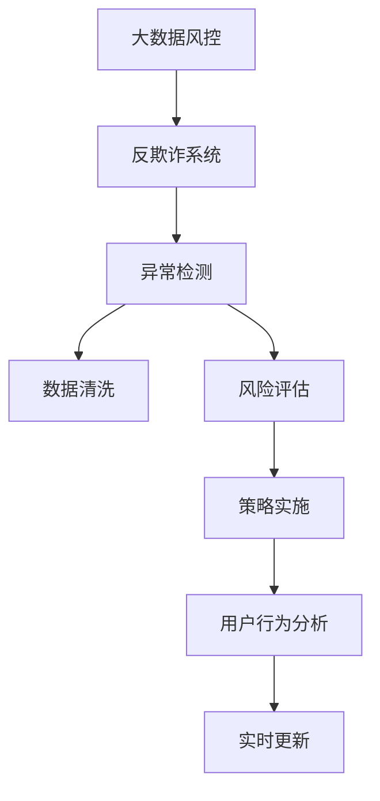

                 

# 知识经济下知识付费的大数据风控与反欺诈

## 1. 背景介绍

### 1.1 问题由来
在知识经济时代，知识付费平台如雨后春笋般涌现。消费者可以订阅各种高质量的内容，如电子书、视频课程、在线讲座等。然而，随着平台用户基数的不断扩大，欺诈和滥用问题逐渐凸显。一些用户利用虚假账号、恶意注册等方式，通过知识付费平台的漏洞或违规行为获利，不仅损害了平台和内容创作者的利益，也严重破坏了知识付费生态的公平性和健康发展。

### 1.2 问题核心关键点
知识付费平台的大数据风控与反欺诈任务，旨在通过技术手段识别并阻止各类欺诈行为，保护平台和内容创作者的利益，确保平台生态的良性运行。核心关键点包括：

- 欺诈检测：识别出虚假账号、恶意注册等欺诈行为。
- 异常识别：监控异常行为模式，如频繁购买、恶意取消等。
- 策略制定：基于风险评估结果，采取相应的防控措施。
- 模型迭代：利用实时数据不断优化风控模型。

## 2. 核心概念与联系

### 2.1 核心概念概述

为更好地理解知识付费平台的大数据风控与反欺诈方法，本节将介绍几个密切相关的核心概念：

- 大数据风控：通过收集和分析大量用户行为数据，识别风险和欺诈行为的过程。
- 反欺诈系统：利用各种技术手段识别并防范欺诈行为的系统。
- 异常检测：基于用户行为数据，识别出不符合正常行为模式的异常行为。
- 数据清洗：去除或修正数据中的噪音和错误，提高数据质量。
- 风险评估：根据用户行为特征和风险指标，评估用户的风险水平。
- 策略实施：根据风险评估结果，采取相应的控制措施，如账号冻结、交易拦截等。
- 用户行为分析：分析用户行为模式，理解用户需求和行为特征，为风控策略制定提供依据。
- 实时更新：利用实时数据持续更新风控模型，确保模型的时效性和准确性。

这些核心概念之间的逻辑关系可以通过以下Mermaid流程图来展示：



这个流程图展示了大数据风控的核心流程：

1. 大数据风控通过收集和分析用户行为数据，识别出异常和欺诈行为。
2. 反欺诈系统利用各种技术手段识别并防范欺诈行为。
3. 异常检测基于用户行为数据，识别出不符合正常行为模式的异常行为。
4. 数据清洗去除或修正数据中的噪音和错误，提高数据质量。
5. 风险评估根据用户行为特征和风险指标，评估用户的风险水平。
6. 策略实施根据风险评估结果，采取相应的控制措施。
7. 用户行为分析分析用户行为模式，理解用户需求和行为特征。
8. 实时更新利用实时数据持续更新风控模型，确保模型的时效性和准确性。

## 3. 核心算法原理 & 具体操作步骤

### 3.1 算法原理概述

知识付费平台的大数据风控与反欺诈，本质上是利用机器学习和大数据分析技术，对用户行为进行建模和预测，识别出异常和欺诈行为的过程。其核心思想是：收集用户行为数据，构建用户行为特征，利用这些特征训练预测模型，对用户行为进行实时监控和预测，及时发现并处理欺诈行为。

形式化地，假设用户行为数据集为 $D=\{(x_i,y_i)\}_{i=1}^N$，其中 $x_i$ 为第 $i$ 个用户的特征向量，$y_i$ 为标签，表示该用户是否存在欺诈行为（$y_i=1$ 表示存在，$y_i=0$ 表示不存在）。大数据风控的目标是找到最优模型 $f$，使得：

$$
f(x) = \mathop{\arg\min}_{\theta} \mathcal{L}(f,D)
$$

其中 $\mathcal{L}$ 为损失函数，用于衡量模型预测输出与真实标签之间的差异。常见的损失函数包括交叉熵损失、均方误差损失等。

### 3.2 算法步骤详解

知识付费平台的大数据风控与反欺诈，一般包括以下几个关键步骤：

**Step 1: 数据收集与预处理**
- 收集用户注册信息、交易记录、行为数据等，构建用户行为数据集 $D$。
- 进行数据清洗和预处理，去除或修正数据中的噪音和错误，提高数据质量。

**Step 2: 特征工程**
- 根据用户行为数据，设计用户行为特征。常用的特征包括用户注册时间、登录频率、交易金额、交易频率等。
- 利用特征工程技术，提取用户行为特征的高阶组合特征，如连续登录次数、单日交易次数等。

**Step 3: 模型训练与评估**
- 选择合适的机器学习模型，如逻辑回归、随机森林、神经网络等，进行模型训练。
- 利用交叉验证等方法，在训练集上评估模型的性能。
- 根据评估结果，调整模型参数，进行模型调优。

**Step 4: 实时监控与预测**
- 将训练好的模型部署到实时监控系统，对用户行为进行实时监控和预测。
- 利用实时数据，不断更新模型，提升模型的精度和泛化能力。
- 当模型预测到用户存在欺诈行为时，触发相应预警或控制措施。

**Step 5: 策略制定与实施**
- 根据模型预测结果，制定相应的风控策略，如冻结账号、限制交易、追加验证等。
- 定期评估风控策略的效果，调整策略参数，优化策略实施。

**Step 6: 用户行为分析与反馈**
- 分析用户行为数据，理解用户需求和行为特征，为风控策略制定提供依据。
- 收集用户反馈，优化风控策略，避免误判和漏判。

以上是知识付费平台大数据风控与反欺诈的一般流程。在实际应用中，还需要针对具体平台的特点，对各个环节进行优化设计，如改进特征选择方法，引入更多的正则化技术，搜索最优的超参数组合等，以进一步提升模型性能。

### 3.3 算法优缺点

知识付费平台大数据风控与反欺诈方法具有以下优点：
1. 自动化高效：通过机器学习模型，自动化处理大量用户行为数据，提高风控效率。
2. 覆盖全面：利用全量数据进行建模，覆盖所有用户行为，降低欺诈风险。
3. 灵活应对：实时更新模型，动态调整策略，适应不同时间段和场景。
4. 效果显著：在欺诈检测和异常识别方面，取得显著的性能提升。

同时，该方法也存在一定的局限性：
1. 数据依赖：风控模型依赖高质量的数据集，数据收集和清洗的成本较高。
2. 模型过拟合：若模型训练样本有限，容易发生过拟合，泛化能力不足。
3. 隐私问题：风控过程中需要收集大量用户行为数据，存在隐私泄露的风险。
4. 策略僵化：过于依赖模型结果，可能导致策略过于僵化，无法灵活应对复杂场景。
5. 误判率较高：在初期模型训练不足的情况下，误判率较高，需逐步优化。

尽管存在这些局限性，但就目前而言，大数据风控与反欺诈方法仍是知识付费平台应对欺诈问题的有效手段。未来相关研究的重点在于如何进一步降低数据收集成本，提高模型的泛化能力，同时兼顾隐私保护和策略灵活性。

### 3.4 算法应用领域

知识付费平台大数据风控与反欺诈方法，已经在用户行为分析、欺诈检测、异常识别、交易监控等多个领域得到了广泛的应用。例如：

- 用户注册验证：通过收集用户行为数据，识别虚假账号和恶意注册行为。
- 交易监控：监控用户交易行为，识别恶意交易和异常交易行为。
- 账户冻结：根据用户行为特征和风险评估结果，冻结存在高风险的账户。
- 交易限制：对存在异常行为的账户，限制其交易金额和频率，防止滥用。
- 追加验证：对于高风险交易，要求用户进行二次验证，确保交易安全。

除了上述这些经典应用外，大数据风控方法也被创新性地应用到更多场景中，如行为分析、安全风险评估、市场反欺诈等，为知识付费平台的安全运行提供了新的保障。

## 4. 数学模型和公式 & 详细讲解

### 4.1 数学模型构建

本节将使用数学语言对知识付费平台的大数据风控与反欺诈过程进行更加严格的刻画。

假设用户行为数据集为 $D=\{(x_i,y_i)\}_{i=1}^N$，其中 $x_i$ 为第 $i$ 个用户的特征向量，$y_i$ 为标签，表示该用户是否存在欺诈行为（$y_i=1$ 表示存在，$y_i=0$ 表示不存在）。

定义用户行为特征集合为 $X=\{x_1,x_2,\ldots,x_n\}$，其中 $x_i$ 为第 $i$ 个用户的行为特征向量。假设训练集 $D_{train}$ 包含 $M$ 个样本，测试集 $D_{test}$ 包含 $N-M$ 个样本。

定义风控模型为 $f(X)$，利用损失函数 $\mathcal{L}$ 衡量模型预测输出与真实标签之间的差异。假设在训练集上训练得到的模型参数为 $\theta$，则模型预测输出为 $f(X,\theta)$。

### 4.2 公式推导过程

以下我们以逻辑回归为例，推导风控模型的数学表达式及其梯度计算公式。

假设风控模型 $f(X,\theta)$ 在用户行为特征 $x_i$ 上的预测概率为 $\hat{y}_i=f(x_i,\theta)$，则逻辑回归模型的输出为：

$$
\hat{y}_i = \frac{1}{1+e^{-f(x_i,\theta)}}
$$

其中 $f(x_i,\theta) = \theta_0 + \theta_1x_{i1} + \theta_2x_{i2} + \cdots + \theta_nx_{in}$，$\theta=(\theta_0,\theta_1,\theta_2,\ldots,\theta_n)$ 为模型参数。

在已知训练集 $D_{train}$ 的情况下，逻辑回归模型的损失函数为交叉熵损失函数，定义为：

$$
\mathcal{L}(\theta) = -\frac{1}{M}\sum_{i=1}^M(y_i\log \hat{y}_i + (1-y_i)\log (1-\hat{y}_i))
$$

利用梯度下降等优化算法，求解上述最小化问题，得到最优模型参数：

$$
\theta^* = \mathop{\arg\min}_{\theta} \mathcal{L}(\theta)
$$

在得到最优模型参数 $\theta^*$ 后，即可对用户行为进行实时监控和预测。具体步骤如下：

1. 将用户行为特征 $x_i$ 输入风控模型 $f(x_i,\theta^*)$，得到预测概率 $\hat{y}_i$。
2. 根据 $\hat{y}_i$ 的阈值 $T$，判断用户是否存在欺诈行为，若 $\hat{y}_i \geq T$，则判定用户存在欺诈行为。

通过上述过程，知识付费平台的大数据风控与反欺诈系统可以实时监控用户行为，识别出欺诈和异常行为，采取相应的防控措施，保障平台安全运行。

## 5. 项目实践：代码实例和详细解释说明

### 5.1 开发环境搭建

在进行大数据风控与反欺诈实践前，我们需要准备好开发环境。以下是使用Python进行Scikit-learn开发的环境配置流程：

1. 安装Anaconda：从官网下载并安装Anaconda，用于创建独立的Python环境。

2. 创建并激活虚拟环境：
```bash
conda create -n windrisk python=3.8 
conda activate windrisk
```

3. 安装Scikit-learn：
```bash
conda install scikit-learn
```

4. 安装各类工具包：
```bash
pip install numpy pandas scikit-learn matplotlib tqdm jupyter notebook ipython
```

完成上述步骤后，即可在`windrisk`环境中开始大数据风控实践。

### 5.2 源代码详细实现

下面我以逻辑回归为例，给出使用Scikit-learn库对知识付费平台进行大数据风控的Python代码实现。

首先，定义风控模型的训练函数：

```python
from sklearn.linear_model import LogisticRegression
from sklearn.model_selection import train_test_split
from sklearn.metrics import accuracy_score

def train_model(X_train, y_train, X_test, y_test, n_features):
    # 数据划分
    X_train, X_val, y_train, y_val = train_test_split(X_train, y_train, test_size=0.2)
    
    # 初始化模型
    model = LogisticRegression(C=1.0, penalty='l2', solver='lbfgs', max_iter=10000)
    
    # 训练模型
    model.fit(X_train, y_train)
    
    # 评估模型
    y_pred = model.predict(X_val)
    val_acc = accuracy_score(y_val, y_pred)
    print(f"Validation accuracy: {val_acc}")
    
    # 测试模型
    y_pred = model.predict(X_test)
    test_acc = accuracy_score(y_test, y_pred)
    print(f"Test accuracy: {test_acc}")
    
    return model
```

然后，定义风控模型的预测函数：

```python
def predict(model, X):
    # 对新样本进行预测
    y_pred = model.predict(X)
    
    # 计算阈值
    threshold = np.mean(y_pred)
    
    # 判断用户是否存在欺诈行为
    is_fraud = y_pred >= threshold
    
    return is_fraud
```

接着，编写代码实现数据收集、预处理和特征工程：

```python
import pandas as pd
from sklearn.preprocessing import StandardScaler

# 加载数据
df = pd.read_csv('user_behavior.csv')

# 提取特征
X = df[['login_frequency', 'transaction_amount', 'transaction_frequency']].values

# 提取标签
y = df['is_fraud'].values

# 标准化特征
scaler = StandardScaler()
X_scaled = scaler.fit_transform(X)

# 调用训练函数
model = train_model(X_scaled, y, X_scaled, y, n_features=3)
```

最后，启动风控预测：

```python
# 加载新样本
new_samples = pd.read_csv('new_user_behavior.csv')

# 提取新样本特征
X_new = new_samples[['login_frequency', 'transaction_amount', 'transaction_frequency']].values

# 标准化新样本特征
X_new_scaled = scaler.transform(X_new)

# 预测新样本
is_fraud = predict(model, X_new_scaled)
print(is_fraud)
```

以上就是使用Scikit-learn对知识付费平台进行大数据风控的完整代码实现。可以看到，Scikit-learn库提供了简单易用的接口，大大简化了模型训练和预测的流程。

### 5.3 代码解读与分析

让我们再详细解读一下关键代码的实现细节：

**train_model函数**：
- 该函数实现了逻辑回归模型的训练和评估。
- 利用train_test_split函数将数据集划分为训练集和验证集，比例为8:2。
- 使用LogisticRegression类初始化模型，并利用fit函数训练模型。
- 在验证集上计算模型的准确率，输出结果。
- 在测试集上计算模型的准确率，输出结果。

**predict函数**：
- 该函数实现了风控模型的预测功能。
- 利用模型对新样本进行预测，得到预测概率。
- 计算预测概率的阈值，判断用户是否存在欺诈行为，输出结果。

**数据预处理**：
- 使用pandas库读取数据，并提取用户行为特征和标签。
- 利用StandardScaler标准化特征，防止不同特征量级差异过大。
- 调用train_model函数进行模型训练。

**风控预测**：
- 加载新样本数据，提取特征。
- 利用标准化模型对新样本进行预测。
- 调用predict函数判断新样本是否存在欺诈行为，输出结果。

可以看出，Scikit-learn库在模型训练和预测过程中提供了诸多便利功能，大大降低了开发者的工作量。通过这一框架，开发者可以更加专注于算法创新和模型优化，加速大数据风控与反欺诈系统的开发。

## 6. 实际应用场景

### 6.1 智能客服系统

知识付费平台可以利用大数据风控与反欺诈技术，构建智能客服系统，提升客户服务质量。在用户注册、交易等环节，利用风控模型实时监控用户行为，识别出潜在欺诈和异常行为，及时介入处理，避免误判和漏判。智能客服系统还可以分析用户行为模式，自动回答常见问题，减少人工客服的负担，提高服务效率。

### 6.2 交易监控系统

平台可以利用大数据风控与反欺诈技术，建立交易监控系统，实时监控用户交易行为，识别出异常交易和欺诈行为，及时采取措施，如冻结账户、追加验证等，避免经济损失。交易监控系统还可以分析交易行为模式，预测未来交易风险，提高风险预警的准确性。

### 6.3 用户行为分析系统

平台可以利用大数据风控与反欺诈技术，构建用户行为分析系统，理解用户需求和行为特征，优化风控策略，提升用户体验。系统可以分析用户行为数据，生成用户画像，预测用户行为变化趋势，为平台运营提供参考。

### 6.4 未来应用展望

随着大数据风控与反欺诈技术的发展，未来其在知识付费平台中的应用将更加广泛和深入。例如：

- 跨平台风险控制：利用大数据风控技术，跨多个平台进行风险控制，实现全局统一的风险管理。
- 用户行为预测：利用机器学习模型，预测用户行为变化趋势，为平台运营提供决策依据。
- 策略动态调整：根据实时数据，动态调整风控策略，适应不同的业务场景。
- 智能反欺诈：利用深度学习等先进技术，提高欺诈检测和识别能力。

知识付费平台大数据风控与反欺诈技术，将逐步成为平台运营的核心基础设施，为平台安全和健康发展提供有力保障。

## 7. 工具和资源推荐

### 7.1 学习资源推荐

为了帮助开发者系统掌握大数据风控与反欺诈的理论基础和实践技巧，这里推荐一些优质的学习资源：

1. 《机器学习实战》系列书籍：作者Peter Harrington深入浅出地介绍了机器学习的基本原理和应用场景，适合初学者入门。

2. 《Python数据科学手册》：作者Jake VanderPlas全面介绍了Python在数据科学中的应用，涵盖数据清洗、特征工程、模型训练等多个方面。

3. Coursera《机器学习》课程：斯坦福大学Andrew Ng教授开设的经典课程，深入讲解了机器学习的基本理论和算法，适合进阶学习。

4. Kaggle：数据科学竞赛平台，提供大量真实业务场景下的数据集和竞赛任务，锻炼实战能力。

5. GitHub：开源社区，收集和分享大数据风控与反欺诈项目的代码和资源，提供丰富的学习素材。

通过对这些资源的学习实践，相信你一定能够快速掌握大数据风控与反欺诈的精髓，并用于解决实际的NLP问题。

### 7.2 开发工具推荐

高效的开发离不开优秀的工具支持。以下是几款用于大数据风控与反欺诈开发的常用工具：

1. Scikit-learn：开源机器学习库，提供简单易用的接口，适合快速迭代研究。

2. TensorFlow：由Google主导开发的开源深度学习框架，生产部署方便，适合大规模工程应用。

3. PyTorch：基于Python的开源深度学习框架，灵活动态的计算图，适合快速迭代研究。

4. Weights & Biases：模型训练的实验跟踪工具，可以记录和可视化模型训练过程中的各项指标，方便对比和调优。

5. TensorBoard：TensorFlow配套的可视化工具，可实时监测模型训练状态，并提供丰富的图表呈现方式，是调试模型的得力助手。

6. Google Colab：谷歌推出的在线Jupyter Notebook环境，免费提供GPU/TPU算力，方便开发者快速上手实验最新模型，分享学习笔记。

合理利用这些工具，可以显著提升大数据风控与反欺诈任务的开发效率，加快创新迭代的步伐。

### 7.3 相关论文推荐

大数据风控与反欺诈技术的发展源于学界的持续研究。以下是几篇奠基性的相关论文，推荐阅读：

1. Logistic Regression: A statistical method for classifying events（逻辑回归原理）：讲解了逻辑回归的基本原理和实现方法。

2. Random Forests（随机森林）：介绍了随机森林的基本原理和应用场景，适合处理大规模数据集。

3. Anomaly Detection: A Survey（异常检测综述）：详细回顾了异常检测的多种方法，提供了丰富的案例分析。

4. Credit Scoring Using Predictive Modeling（信用评分预测模型）：介绍了信用评分模型的基本原理和实现方法，适用于金融领域的数据分析。

5. Deep Learning for Anomaly Detection（深度学习在异常检测中的应用）：利用深度神经网络模型进行异常检测，取得了优于传统方法的性能。

这些论文代表了大数据风控与反欺诈技术的发展脉络。通过学习这些前沿成果，可以帮助研究者把握学科前进方向，激发更多的创新灵感。

## 8. 总结：未来发展趋势与挑战

### 8.1 总结

本文对知识付费平台的大数据风控与反欺诈方法进行了全面系统的介绍。首先阐述了大数据风控与反欺诈任务的由来和意义，明确了风控在平台安全和健康发展中的关键作用。其次，从原理到实践，详细讲解了大数据风控与反欺诈的数学模型和关键步骤，给出了风控任务开发的完整代码实例。同时，本文还广泛探讨了大数据风控与反欺诈方法在智能客服、交易监控等多个行业领域的应用前景，展示了风控范式的强大潜力。此外，本文精选了风控技术的各类学习资源，力求为读者提供全方位的技术指引。

通过本文的系统梳理，可以看到，大数据风控与反欺诈技术正在成为知识付费平台的重要范式，极大地提升了平台的防范能力和用户体验。随着风控技术的不断进步，相信知识付费平台将更加安全、健康、高效地发展，为消费者提供更高质量的知识服务。

### 8.2 未来发展趋势

展望未来，大数据风控与反欺诈技术将呈现以下几个发展趋势：

1. 模型多样化：未来将涌现更多先进的风控模型，如深度学习模型、集成学习模型等，提升风控的准确性和泛化能力。

2. 实时性增强：随着实时数据采集和处理技术的进步，风控系统将变得更加实时、动态，能够及时发现和处理欺诈行为。

3. 跨平台协作：未来风控系统将跨越多个平台，实现全局统一的风险管理，提升平台的整体安全性和稳定性。

4. 数据融合：风控系统将融合多源数据，利用大数据、人工智能等技术，提升风控的深度和广度。

5. 用户友好：风控系统将更加注重用户体验，提供友好的界面和提示，减少误判和漏判，提升用户满意度。

6. 自适应学习：风控模型将具备自适应学习能力，根据用户行为变化动态调整策略，提升风控效果。

以上趋势凸显了大数据风控与反欺诈技术的广阔前景。这些方向的探索发展，必将进一步提升风控系统的性能和应用范围，为知识付费平台的安全运行提供更强保障。

### 8.3 面临的挑战

尽管大数据风控与反欺诈技术已经取得了显著成效，但在迈向更加智能化、普适化应用的过程中，仍面临诸多挑战：

1. 数据质量问题：风控模型依赖高质量的数据集，数据收集和清洗的成本较高，且数据质量难以保证。

2. 隐私保护问题：风控过程中需要收集大量用户行为数据，存在隐私泄露的风险，需采取隐私保护措施。

3. 模型过拟合问题：若模型训练样本有限，容易发生过拟合，泛化能力不足，需进一步提升模型的泛化能力。

4. 算法公平性问题：风控模型可能存在偏见，对不同用户群体产生不公平的歧视，需加强算法公平性研究。

5. 资源消耗问题：风控系统需要大量计算资源，随着模型复杂度的增加，资源消耗将不断增加，需优化资源使用效率。

6. 策略实施问题：风控策略的制定和实施需兼顾精确度和用户友好性，过于严格的策略可能影响用户体验。

面对这些挑战，未来的研究需要在数据质量、隐私保护、模型泛化、算法公平性等方面进行深入探索，逐步解决现有问题。

### 8.4 研究展望

面对大数据风控与反欺诈技术的诸多挑战，未来的研究需要在以下几个方面寻求新的突破：

1. 无监督学习与半监督学习：摆脱对大规模标注数据的依赖，利用无监督学习、半监督学习等技术，最大限度利用非结构化数据，实现更加灵活高效的风控。

2. 多模态数据融合：利用多源数据融合技术，提升风控模型的深度和广度，提升模型的泛化能力。

3. 自适应学习算法：开发具有自适应学习能力的算法，根据用户行为变化动态调整策略，提升风控效果。

4. 隐私保护技术：结合区块链、差分隐私等隐私保护技术，确保用户数据的隐私和安全。

5. 跨平台协同风控：建立跨平台协同风控机制，提升整体风险管理水平，降低单点风险。

6. 算法公平性研究：加强算法公平性研究，确保风控模型对不同用户群体公平对待。

这些研究方向的探索，必将引领大数据风控与反欺诈技术迈向更高的台阶，为知识付费平台的安全运行提供更加全面、可靠的保障。面向未来，大数据风控与反欺诈技术还需要与其他人工智能技术进行更深入的融合，如知识表示、因果推理、强化学习等，多路径协同发力，共同推动知识付费平台的安全、健康、高效发展。

## 9. 附录：常见问题与解答

**Q1：什么是大数据风控与反欺诈？**

A: 大数据风控与反欺诈是指通过收集和分析大量用户行为数据，识别风险和欺诈行为的过程。其主要目标是构建风控模型，实时监控用户行为，识别出异常和欺诈行为，及时采取措施，保护平台和内容创作者的利益。

**Q2：风控模型如何构建？**

A: 风控模型的构建主要包括以下几个步骤：数据收集与预处理、特征工程、模型训练与评估、实时监控与预测、策略制定与实施。常用的风控模型包括逻辑回归、随机森林、神经网络等，根据具体业务场景选择合适的模型。

**Q3：如何提高风控模型的泛化能力？**

A: 提高风控模型的泛化能力，可以从以下几个方面入手：增加训练样本数量、引入更多特征、使用正则化技术、调整模型参数、利用集成学习等。同时，定期更新模型，利用实时数据不断优化风控模型。

**Q4：如何平衡风控策略的精确度和用户友好性？**

A: 平衡风控策略的精确度和用户友好性，需要根据具体情况进行优化。一方面，可以通过调整模型参数、优化特征工程等手段，提高风控模型的精确度；另一方面，可以结合用户反馈，设计友好的风控策略，减少误判和漏判，提升用户体验。

**Q5：风控过程中需要注意哪些隐私问题？**

A: 风控过程中需要注意以下隐私问题：
1. 数据收集：收集用户行为数据时，需明确告知用户数据用途，并获得用户同意。
2. 数据存储：存储用户数据时，需采取加密、匿名化等隐私保护措施。
3. 数据使用：使用用户数据时，需确保数据不被滥用，仅用于风控相关业务。

通过上述学习实践，相信你一定能够快速掌握大数据风控与反欺诈的精髓，并用于解决实际的NLP问题。

---

作者：禅与计算机程序设计艺术 / Zen and the Art of Computer Programming

