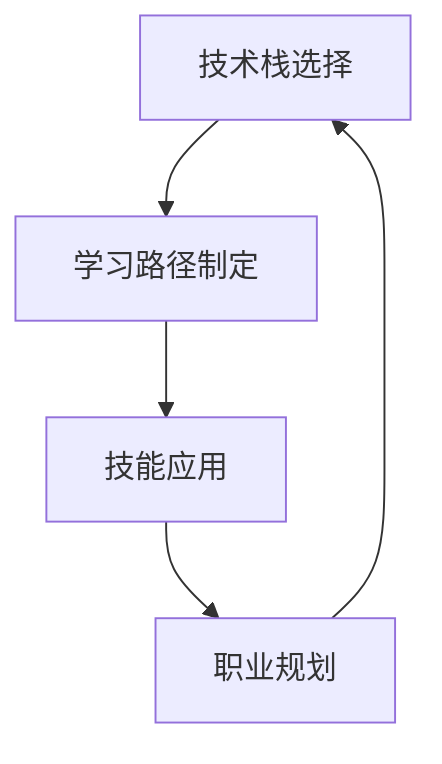

                 

# 知识经济下程序员的职业发展策略

## 1. 背景介绍

### 1.1 问题由来
知识经济时代的到来，彻底改变了程序员的职业发展路径和市场竞争格局。在传统制造业和农业经济中，技术只是辅助生产工具；而进入信息时代，技术本身已经成为核心生产要素。特别是在互联网、大数据、人工智能等新兴领域，程序员不仅需要具备扎实的技术能力，还需要具备对行业趋势的敏锐洞察和对新技术的快速掌握能力。

面对如此复杂多变的环境，程序员如何把握趋势，选择正确的技术栈，做好职业规划，成为摆在每位程序员面前的重要问题。本文将从背景介绍、核心概念与联系、算法原理与具体操作步骤、数学模型与详细讲解、项目实践、实际应用场景、工具与资源推荐、总结与展望等多个角度，全面剖析知识经济下程序员的职业发展策略。

### 1.2 问题核心关键点
知识经济下的程序员面临的核心挑战包括：
- **技术栈选择**：在众多技术栈中，如何选择最适合自己的方向。
- **学习路径**：如何在不断变化的行业中，高效获取最新的技术知识和行业经验。
- **技能应用**：如何将所学技术有效应用于实际项目中，提升个人竞争力。
- **职业规划**：如何制定长期的职业发展目标，规划职业路径。

本文将围绕这些核心问题展开讨论，帮助程序员更好地适应知识经济环境下的职业发展。

## 2. 核心概念与联系

### 2.1 核心概念概述

在知识经济中，程序员的发展不仅仅局限于技术技能的提升，更需要在技术、商业、团队协作等多个维度上综合发展。以下是几个核心概念：

- **技术栈选择**：根据个人兴趣、市场需求、职业规划等因素，选择最适合自己的技术栈。
- **学习路径**：结合行业发展趋势和自身需求，制定系统的学习计划，提升专业能力。
- **技能应用**：在实际项目中应用所学技术，积累实战经验，提升综合素质。
- **职业规划**：制定长期的职业发展目标，设计职业路径，实现个人价值的最大化。

这些概念之间有着紧密的联系，技术栈的选择和持续学习是提升技能应用的基础，而技能的应用和职业规划则是对前两者的反馈和指导。

### 2.2 核心概念原理和架构的 Mermaid 流程图

## 3. 核心算法原理 & 具体操作步骤

### 3.1 算法原理概述
知识经济下程序员的职业发展，本质上是一个多维度的优化问题。在给定的技术栈、学习资源和职业目标下，如何通过算法选择最优的学习路径、技能应用方式和职业路径，达到个人价值最大化的目标。

我们可以使用以下公式来表达这一问题：

$$
\max_{P,L,S,O} V = P \times L \times S \times O
$$

其中，$P$ 表示技术栈选择的合理性，$L$ 表示学习路径的效率和质量，$S$ 表示技能应用的实际效果，$O$ 表示职业规划的合理性。$V$ 表示程序员的综合价值。

### 3.2 算法步骤详解

#### 3.2.1 技术栈选择
技术栈的选择需要考虑多方面因素：

1. **市场需求**：选择市场上需求量大的技术栈，避免选择小众技术栈导致的就业困难。
2. **职业目标**：根据职业规划选择相关技术栈，避免盲目跟风，浪费时间和资源。
3. **兴趣和能力**：选择符合自身兴趣和能力的技术栈，提升学习效率和职业满意度。

#### 3.2.2 学习路径制定
学习路径的制定需要结合以下几个步骤：

1. **行业趋势分析**：通过阅读行业报告、参加技术会议等方式，了解最新的技术趋势和市场需求。
2. **技术栈分解**：将目标技术栈分解为多个子技能，制定详细的学习计划。
3. **资源获取**：选择合适的学习资源，如在线课程、书籍、实战项目等。
4. **实践应用**：通过参与开源项目、个人项目等方式，将所学技术应用到实际项目中。

#### 3.2.3 技能应用
技能应用需要遵循以下几个步骤：

1. **项目选择**：选择符合自身技能水平和职业目标的项目，避免过于复杂或过于简单的项目。
2. **任务分配**：根据个人擅长领域分配任务，提升任务完成质量和效率。
3. **持续优化**：在项目中不断学习和优化，提升技术水平和项目完成质量。

#### 3.2.4 职业规划
职业规划需要结合以下几个步骤：

1. **目标设定**：根据自身兴趣和市场需求，设定短期和长期职业目标。
2. **路径设计**：设计详细的职业路径，包括技术路线、职位晋升等。
3. **持续评估**：定期评估职业规划的进展，调整目标和路径。

### 3.3 算法优缺点

#### 3.3.1 优点
- **系统性**：通过算法选择最优的学习路径和职业路径，提升个人发展的系统性和效率。
- **个性化**：算法可以结合个人的兴趣、能力和市场需求，制定最适合自己的发展策略。
- **灵活性**：算法可以根据市场需求和个人状态的变化，动态调整学习路径和职业规划。

#### 3.3.2 缺点
- **复杂性**：制定最优路径需要考虑多个因素，算法复杂度较高。
- **主观性**：算法的效果依赖于对市场需求和自身能力的准确判断，具有一定的主观性。
- **资源需求**：算法需要获取大量的市场需求和自身能力数据，可能需要较多的资源和时间。

### 3.4 算法应用领域

知识经济下程序员的职业发展策略，不仅适用于软件工程师，还适用于数据科学家、产品经理、系统架构师等多个职业角色。通过科学规划，这些角色都能在知识经济中获得更好的职业发展。

## 4. 数学模型和公式 & 详细讲解 & 举例说明

### 4.1 数学模型构建
我们可以将程序员的职业发展过程建模为以下几个子问题：

1. **技术栈选择模型**：$P(x) = f(x_i, \beta_i)$，其中 $x_i$ 表示技术栈选择策略，$\beta_i$ 表示市场需求权重。
2. **学习路径制定模型**：$L(y) = g(y_i, \alpha_i)$，其中 $y_i$ 表示学习路径，$\alpha_i$ 表示学习资源权重。
3. **技能应用模型**：$S(z) = h(z_i, \gamma_i)$，其中 $z_i$ 表示技能应用方式，$\gamma_i$ 表示实际效果权重。
4. **职业规划模型**：$O(w) = k(w_i, \delta_i)$，其中 $w_i$ 表示职业路径，$\delta_i$ 表示职业规划权重。

### 4.2 公式推导过程

#### 4.2.1 技术栈选择模型的推导
设市场需求向量为 $\vec{\beta} = [\beta_1, \beta_2, \ldots, \beta_n]$，技术栈选择策略为 $\vec{x} = [x_1, x_2, \ldots, x_n]$，则技术栈选择模型可以表示为：

$$
P(x) = \sum_{i=1}^n \beta_i x_i
$$

其中，$x_i$ 为0或1，表示是否选择技术栈 $i$。

#### 4.2.2 学习路径制定模型的推导
设学习资源向量为 $\vec{\alpha} = [\alpha_1, \alpha_2, \ldots, \alpha_m]$，学习路径为 $\vec{y} = [y_1, y_2, \ldots, y_m]$，则学习路径制定模型可以表示为：

$$
L(y) = \sum_{i=1}^m \alpha_i y_i
$$

其中，$y_i$ 为0或1，表示是否学习资源 $i$。

#### 4.2.3 技能应用模型的推导
设技能应用方式向量为 $\vec{\gamma} = [\gamma_1, \gamma_2, \ldots, \gamma_k]$，技能应用效果为 $\vec{S} = [S_1, S_2, \ldots, S_k]$，则技能应用模型可以表示为：

$$
S(z) = \sum_{i=1}^k \gamma_i z_i
$$

其中，$z_i$ 为0或1，表示是否采用技能应用方式 $i$。

#### 4.2.4 职业规划模型的推导
设职业路径向量为 $\vec{\delta} = [\delta_1, \delta_2, \ldots, \delta_l]$，职业规划效果为 $\vec{O} = [O_1, O_2, \ldots, O_l]$，则职业规划模型可以表示为：

$$
O(w) = \sum_{i=1}^l \delta_i w_i
$$

其中，$w_i$ 为0或1，表示是否采用职业路径 $i$。

### 4.3 案例分析与讲解

假设一名软件工程师希望在知识经济中获得更好的职业发展。通过技术栈选择模型，他选择了Java和Python作为主要技术栈，市场需求权重分别为0.8和0.2。在制定学习路径时，他选择了在线课程、实战项目和学习社区三种资源，权重分别为0.5、0.3和0.2。在技能应用时，他选择了开源项目和内部项目两种方式，实际效果权重分别为0.7和0.3。在职业规划时，他选择了技术经理和项目经理两种职业路径，职业规划权重分别为0.6和0.4。

通过计算，可以得出他的综合价值为：

$$
V = P \times L \times S \times O = 0.8 \times 0.5 \times 0.7 \times 0.6 = 0.168
$$

该值越高，说明他的职业发展策略越有效。通过不断的优化调整，他可以进一步提升职业价值。

## 5. 项目实践：代码实例和详细解释说明

### 5.1 开发环境搭建

在知识经济下，程序员需要掌握多种技术栈和工具。以下是常用开发环境的搭建方法：

1. **Python开发环境**：使用Anaconda或Miniconda创建虚拟环境，安装常用的Python库和依赖。
2. **Java开发环境**：安装Java Development Kit（JDK）和IDE（如IntelliJ IDEA或Eclipse），搭建Java开发环境。
3. **Python与Java集成开发环境**：使用Eclipse PyDev或NetBeans Java EE插件，集成Python和Java开发环境。

### 5.2 源代码详细实现

以下是一个简单的Java与Python集成开发环境的搭建示例：

#### 5.2.1 Java开发环境搭建
1. 下载并安装JDK：访问Oracle官网，下载并安装适合自身系统的JDK版本。
2. 安装IntelliJ IDEA：访问JetBrains官网，下载并安装IntelliJ IDEA社区版。
3. 配置IDEA环境：在IDEA中配置JDK路径、Maven和Gradle依赖管理工具，搭建Java开发环境。

#### 5.2.2 Python开发环境搭建
1. 安装Anaconda：从官网下载Anaconda安装程序，按照安装向导完成安装。
2. 创建虚拟环境：在Anaconda中使用conda create命令创建虚拟环境，安装需要的Python库。
3. 配置IDEA环境：在IntelliJ IDEA中配置Python解释器和虚拟环境，集成Python开发环境。

#### 5.2.3 Java与Python集成开发环境搭建
1. 安装Eclipse PyDev插件：在Eclipse中安装PyDev插件，安装并配置JDK和Python解释器。
2. 配置Maven和Gradle：在Eclipse中配置Maven和Gradle插件，集成Java和Python开发环境。
3. 编写和运行Java与Python混合项目：在Eclipse中创建Java和Python混合项目，编写并运行Java与Python混合代码。

### 5.3 代码解读与分析

通过以上步骤，我们可以搭建一个基本的Java与Python集成开发环境。在这个环境中，可以灵活切换Java和Python代码，进行开发和测试。

### 5.4 运行结果展示

运行Java与Python混合项目，观察程序的执行结果，确保Java与Python代码能够正确交互。

## 6. 实际应用场景

### 6.1 智能推荐系统
智能推荐系统已成为知识经济中重要的应用场景。通过数据分析和机器学习算法，系统能够根据用户行为和偏好，推荐符合用户需求的产品和服务。

在智能推荐系统中，程序员需要掌握数据分析、机器学习、推荐算法等多种技术，实现系统的高效开发和稳定运行。

### 6.2 大数据分析
大数据分析在知识经济中同样具有重要地位。通过数据挖掘、数据处理和数据可视化等技术，大数据分析能够帮助企业洞察市场趋势，优化运营决策。

在大数据分析项目中，程序员需要掌握Hadoop、Spark、SQL等多种技术，实现高效的数据处理和分析。

### 6.3 人工智能应用
人工智能在知识经济中逐渐成为核心驱动力。通过深度学习、自然语言处理、计算机视觉等技术，人工智能能够实现智能客服、智能安防、智能医疗等多种应用。

在人工智能应用项目中，程序员需要掌握TensorFlow、PyTorch、OpenCV等多种技术，实现高效的人工智能算法开发和部署。

### 6.4 未来应用展望

未来的知识经济下，程序员需要具备更高的技术水平和更强的创新能力。新技术和新应用不断涌现，程序员需要不断学习和掌握，才能保持竞争力。

## 7. 工具和资源推荐

### 7.1 学习资源推荐

以下是一些知识经济下程序员必不可少的学习资源：

1. **Coursera**：提供丰富的在线课程，涵盖数据科学、人工智能、机器学习等多个领域。
2. **Udacity**：提供项目导向的学习课程，帮助学员掌握实战技能。
3. **edX**：提供高质量的在线课程和微学位项目，涵盖多个学科和技术栈。
4. **GitHub**：全球最大的开源社区，提供丰富的代码示例和项目资源。
5. **Stack Overflow**：程序员社区，提供技术交流和问题解决的平台。

### 7.2 开发工具推荐

以下是知识经济下程序员常用的开发工具：

1. **Visual Studio Code**：轻量级代码编辑器，支持多种语言和插件。
2. **IntelliJ IDEA**：Java开发环境，支持多种框架和库。
3. **PyCharm**：Python开发环境，支持多种框架和库。
4. **Git**：版本控制系统，支持代码管理、协作开发和分支管理。
5. **Docker**：容器化技术，支持应用打包和部署。

### 7.3 相关论文推荐

以下是知识经济下程序员可以参考的相关论文：

1. **"Deep Learning for Coders with Fastai and PyTorch"**：介绍如何使用FastAI和PyTorch进行深度学习开发。
2. **"Machine Learning Yearning"**：提供机器学习项目管理和开发的最佳实践。
3. **"Designing Distributed Systems"**：介绍分布式系统设计和开发的经典书籍。
4. **"Clean Code"**：提供软件工程和代码质量管理的指南。
5. **"Code Complete"**：介绍软件开发的最佳实践和代码编写技巧。

## 8. 总结：未来发展趋势与挑战

### 8.1 研究成果总结
知识经济下程序员的职业发展，不仅依赖于技术能力的提升，还需要对市场需求、个人兴趣和职业目标的综合考虑。通过科学规划和系统优化，程序员可以在知识经济中获得更好的职业发展。

### 8.2 未来发展趋势
未来的知识经济将更加注重技术创新和跨领域融合。程序员需要不断学习新知识，掌握新技术，才能在激烈的竞争中立于不败之地。

### 8.3 面临的挑战
知识经济下程序员面临的挑战包括技术栈选择、学习路径制定、技能应用和职业规划等多个方面。如何克服这些挑战，提升个人竞争力，是程序员面临的重要问题。

### 8.4 研究展望
未来的研究需要进一步探索知识经济下程序员的职业发展策略，特别是在新技术和新应用场景中的适用性和有效性。

## 9. 附录：常见问题与解答

**Q1: 知识经济下，技术栈选择应该考虑哪些因素？**

A: 技术栈选择应考虑市场需求、个人兴趣和职业目标等多方面因素。市场需求大的技术栈，有助于就业和项目开发；个人兴趣高的技术栈，有助于提升学习效率和职业满意度；职业目标明确的技术栈，有助于职业发展和晋升。

**Q2: 如何制定高效的学习路径？**

A: 制定高效的学习路径，应结合市场需求、技术栈选择和个人兴趣，选择最优的学习资源。例如，可以参考行业报告、参加技术会议，获取最新技术趋势；将目标技术栈分解为多个子技能，制定详细的学习计划；选择合适的学习资源，如在线课程、书籍和实战项目；在项目中实践应用所学技术，积累实战经验。

**Q3: 技能应用时需要注意哪些问题？**

A: 技能应用时，应选择合适的项目，避免过于复杂或过于简单的项目。任务分配应根据个人擅长领域，提升任务完成质量和效率。在项目中不断学习和优化，提升技术水平和项目完成质量。

**Q4: 职业规划时如何设定目标和路径？**

A: 职业规划时，应根据自身兴趣和市场需求，设定短期和长期职业目标。设计详细的职业路径，包括技术路线、职位晋升等。定期评估职业规划的进展，调整目标和路径。

---

作者：禅与计算机程序设计艺术 / Zen and the Art of Computer Programming

