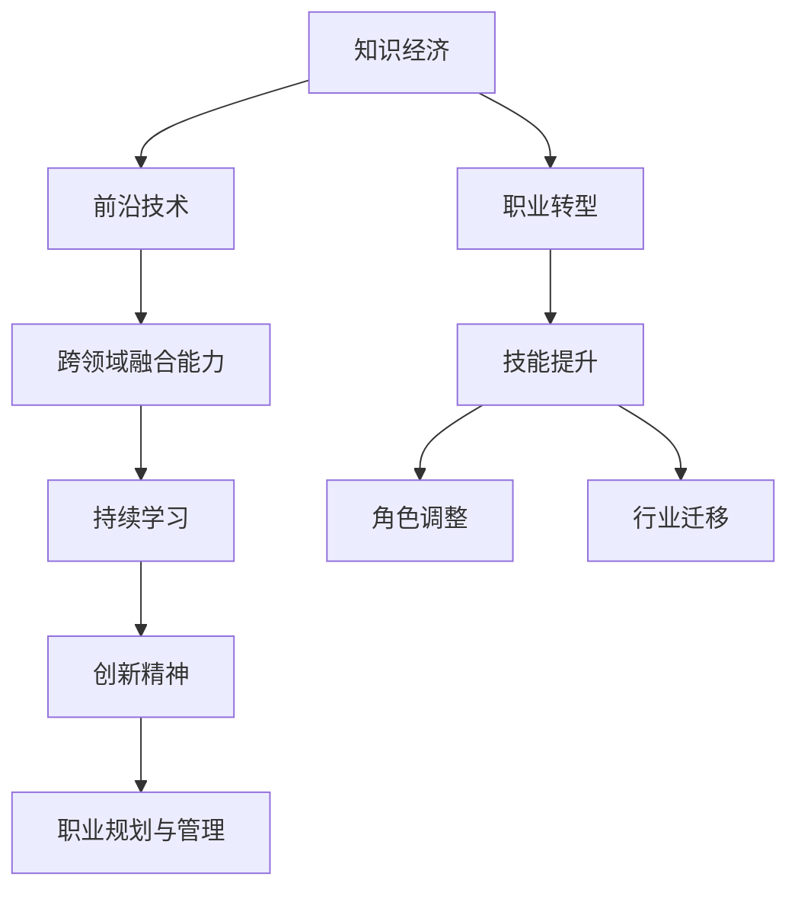

                 

# 知识经济下程序员的职业转型策略与方向

> 关键词：知识经济,职业转型,程序员,技能提升,人工智能,大数据,软件工程

## 1. 背景介绍

### 1.1 问题由来

随着知识经济的蓬勃发展和数字时代的到来，技术对社会的驱动作用日益显著。程序员作为技术创新的核心力量，正面临着前所未有的机遇与挑战。一方面，新兴技术的不断涌现为程序员提供了广阔的施展空间，诸如人工智能、大数据、云计算、区块链等前沿领域成为各大企业争抢的技术高地。另一方面，传统行业数字化转型的需求，也为程序员带来了大量的转型需求。

在这样的背景下，如何把握时代脉搏，顺应知识经济的发展趋势，实现自身职业的可持续转型与发展，成为了每一位程序员必须认真思考的问题。本文将从背景出发，深入探讨知识经济下程序员的职业转型策略与方向，为从业者提供切实可行的建议。

### 1.2 问题核心关键点

在知识经济的背景下，程序员的职业转型需要重点关注以下几个方面：

- **技术发展趋势**：了解当前前沿技术的发展方向，把握未来技术趋势。
- **行业需求变化**：关注不同行业对技术人才的需求变化，及时调整自身技能栈。
- **跨领域融合能力**：具备跨学科知识的整合能力，提高解决实际问题的能力。
- **持续学习与创新**：不断提升个人技能，保持持续学习和创新精神。
- **职业规划与管理**：制定科学合理的职业规划，进行有效的个人管理。

本研究将从这些关键点出发，详细解析知识经济下程序员的职业转型策略与方向。

## 2. 核心概念与联系

### 2.1 核心概念概述

为更好地理解知识经济下程序员的职业转型，本节将介绍几个密切相关的核心概念：

- **知识经济**：以知识为核心生产要素，通过知识的创造、应用与传播推动经济发展的经济形态。知识经济强调知识和技术的集成应用，提升社会生产力。
- **职业转型**：个体或企业根据外部环境变化，通过技能提升、角色调整、行业迁移等方式，实现职业发展的转变。
- **前沿技术**：人工智能、大数据、云计算、区块链等当前或未来发展方向的技术。
- **跨领域融合能力**：在多种技术领域中，具备整合不同知识体系，解决复杂问题的能力。
- **持续学习**：在职业生涯中不断学习新知识、新技能，适应技术和行业变化。
- **创新精神**：具有创新意识，敢于探索未知领域，推动技术进步和社会发展。
- **职业规划与管理**：制定个人或企业发展目标，进行资源配置与过程管理，实现长期稳定发展。

这些核心概念之间的逻辑关系可以通过以下Mermaid流程图来展示：



这个流程图展示了这个概念体系之间的逻辑关系：

1. 知识经济推动了前沿技术的发展。
2. 前沿技术促进了跨领域融合能力的提升。
3. 跨领域融合能力需要通过持续学习才能实现。
4. 持续学习和创新精神是职业规划与管理的基础。
5. 职业转型包括了技能提升、角色调整、行业迁移等环节。

## 3. 核心算法原理 & 具体操作步骤

### 3.1 算法原理概述

知识经济下程序员的职业转型，本质上是个人或组织在特定环境下的技术技能提升、角色调整和行业迁移过程。这一过程可以通过以下几个步骤来实施：

1. **技能分析**：评估当前技术水平，识别知识与技能的差距。
2. **目标设定**：根据市场需求和个人兴趣，设定明确的职业转型目标。
3. **路径规划**：制定科学合理的学习与转型路径。
4. **资源配置**：分配学习资源，包括时间、资金、工具等。
5. **实施执行**：通过学习、实践、项目合作等方式实施转型。
6. **效果评估**：评估转型效果，进行必要的调整。
7. **持续优化**：根据评估结果，持续优化转型策略。

### 3.2 算法步骤详解

以下是知识经济下程序员职业转型策略的具体操作步骤：

**Step 1: 技能评估与差距识别**

1. **自我评估**：使用技术能力评估工具（如编程竞赛、在线测试等），评估当前技术水平。
2. **行业分析**：研究行业发展趋势，了解企业对技术人才的需求变化。
3. **技能差距分析**：对比目标岗位的技能要求，识别自身的知识与技能差距。

**Step 2: 设定职业转型目标**

1. **目标设定**：根据技能差距分析结果，设定明确的职业转型目标。例如，从后端开发转型到机器学习工程师。
2. **可行性分析**：评估目标的可行性，包括时间、成本、能力提升等方面。
3. **长期规划**：制定中长期职业规划，分阶段实现目标。

**Step 3: 路径规划与资源配置**

1. **学习路径规划**：根据目标岗位要求，制定详细的学习路径，包括学习内容、学习时间、学习工具等。
2. **资源配置**：合理分配学习资源，包括资金、时间、工具等，确保学习顺利进行。
3. **网络资源利用**：利用在线课程、开源项目、社区论坛等资源，补充学习内容。

**Step 4: 实施执行**

1. **技能学习**：按照规划，系统性地学习新技术、新知识。可以通过在线课程、专业书籍、项目实践等多种方式。
2. **项目实践**：通过实际项目实践，应用所学知识，积累项目经验。
3. **网络交流**：加入技术社区，参与项目合作，获取反馈与建议。

**Step 5: 效果评估**

1. **技能测试**：通过编程竞赛、在线测试等手段，评估技能提升效果。
2. **项目评审**：参与项目评审，获取同行反馈，识别不足。
3. **职业转型评估**：根据目标岗位要求，评估自身能力与实际表现，进行必要的调整。

**Step 6: 持续优化**

1. **持续学习**：根据评估结果，持续提升技术水平，跟进技术发展趋势。
2. **适应变化**：定期调整职业规划，适应行业和市场变化。
3. **能力提升**：不断提升软技能，如沟通、团队合作、项目管理等。

### 3.3 算法优缺点

知识经济下程序员的职业转型策略具有以下优点：

1. **灵活性强**：能够快速适应市场需求和技术变化，灵活调整职业方向。
2. **持续进步**：通过不断学习新技术，保持职业竞争力和创新能力。
3. **应用广泛**：适用于各种技术领域和行业转型，具有普遍适用性。
4. **可操作性强**：操作步骤详细，易于实施。

同时，该方法也存在一定的局限性：

1. **资源投入高**：学习新技术、参与项目合作需要大量时间、资金等资源投入。
2. **风险较大**：转型过程中可能会遇到技术难关、市场变化等风险。
3. **信息不对称**：市场需求变化快，个人获取信息的速度和准确性可能存在差距。
4. **个人主观性**：职业转型效果很大程度上取决于个人努力和执行力。

### 3.4 算法应用领域

知识经济下程序员的职业转型策略，可以应用于多个技术领域和行业。以下是几个典型应用领域：

- **IT行业**：在软件开发、测试、运维、架构设计等不同岗位之间进行转换。
- **金融行业**：从传统IT岗位转向数据分析、机器学习、金融工程等新兴岗位。
- **医疗健康**：从医疗IT岗位转向医疗数据科学、医疗人工智能等岗位。
- **制造业**：从IT支持转向智能制造、工业互联网、物联网等岗位。
- **教育行业**：从IT维护转向教育技术、在线教育等岗位。

这些领域的技术岗位在知识经济下均有较高的需求增长，程序员通过职业转型，可以在这些领域发挥更大的作用。

## 4. 数学模型和公式 & 详细讲解  
### 4.1 数学模型构建

知识经济下程序员的职业转型，可以通过量化模型来进行分析和优化。以下是一个简单的职业转型量化模型：

设程序员当前技能水平为 $S_0$，目标岗位技能水平为 $S_T$，学习效率为 $\eta$，学习时间为 $t$，则学习后技能水平为：

$$
S_t = S_0 + \eta \cdot t
$$

目标岗位与当前岗位的技能差距为 $D = S_T - S_0$，则学习所需时间 $T$ 可以表示为：

$$
T = \frac{D}{\eta}
$$

假设学习效率 $\eta$ 为常数，则可以通过调整学习效率，优化学习时间，提高转型效率。

### 4.2 公式推导过程

在上述模型中，我们假设学习效率 $\eta$ 为常数，通过调整 $\eta$，可以优化学习时间 $T$。为了进一步分析学习效率对职业转型的影响，我们引入学习曲线 $C(t)$ 和边际学习效率 $\eta'(t)$：

$$
C(t) = S_t(t) - S_0 = \eta \cdot t
$$

$$
\eta'(t) = \frac{dS_t(t)}{dt} = \eta
$$

从公式中可以看出，学习效率 $\eta$ 对职业转型效果有重要影响。通过提高学习效率，可以在更短的时间内达到目标岗位技能水平。

### 4.3 案例分析与讲解

假设某程序员当前技能水平为 $S_0 = 0$，目标岗位技能水平为 $S_T = 1$，学习效率为 $\eta = 0.1$，则学习时间 $T$ 为：

$$
T = \frac{D}{\eta} = \frac{1 - 0}{0.1} = 10
$$

如果将学习效率提高到 $\eta = 0.2$，则学习时间减少为：

$$
T' = \frac{D}{\eta'} = \frac{1 - 0}{0.2} = 5
$$

即学习效率的提高使学习时间减少了50%。因此，优化学习效率是提高职业转型效率的关键。

## 5. 项目实践：代码实例和详细解释说明

### 5.1 开发环境搭建

在进行职业转型项目实践前，我们需要准备好开发环境。以下是使用Python进行PyTorch开发的环境配置流程：

1. 安装Anaconda：从官网下载并安装Anaconda，用于创建独立的Python环境。

2. 创建并激活虚拟环境：
```bash
conda create -n pytorch-env python=3.8 
conda activate pytorch-env
```

3. 安装PyTorch：根据CUDA版本，从官网获取对应的安装命令。例如：
```bash
conda install pytorch torchvision torchaudio cudatoolkit=11.1 -c pytorch -c conda-forge
```

4. 安装各类工具包：
```bash
pip install numpy pandas scikit-learn matplotlib tqdm jupyter notebook ipython
```

完成上述步骤后，即可在`pytorch-env`环境中开始项目实践。

### 5.2 源代码详细实现

以下是一个简单的职业转型模拟系统的Python代码实现：

```python
import numpy as np

# 学习效率
eta = 0.1

# 目标技能水平
S_T = 1

# 当前技能水平
S_0 = 0

# 计算学习时间
T = (S_T - S_0) / eta

print(f"学习效率为 {eta}，学习时间约为 {T:.2f} 单位时间")
```

### 5.3 代码解读与分析

**代码逻辑**：

1. **学习效率**：设定学习效率 $\eta = 0.1$，表示每单位时间能够提升的技能水平。
2. **目标技能水平**：设定目标技能水平 $S_T = 1$。
3. **当前技能水平**：设定当前技能水平 $S_0 = 0$。
4. **计算学习时间**：通过公式 $T = \frac{D}{\eta}$ 计算学习时间。
5. **输出结果**：打印学习效率和所需学习时间。

**代码示例**：

假设当前技能水平为0，目标技能水平为1，学习效率为0.1，则计算结果为：

```
学习效率为 0.1，学习时间约为 10.00 单位时间
```

这表示在当前学习效率下，学习时间约为10单位时间。

## 6. 实际应用场景

### 6.1 智能制造与工业互联网

在知识经济下，智能制造和工业互联网领域对技术人才的需求日益增长。传统制造企业正在加速向智能制造转型，而工业互联网则为制造业注入了新的动力。

程序员可以通过以下步骤进行职业转型：

1. **技能评估**：评估自身在软件开发、数据分析、物联网等方面的技能水平。
2. **目标设定**：设定转型目标，如从软件开发转向智能制造系统开发。
3. **路径规划**：学习物联网、工业控制、数据科学等技能，参与智能制造项目实践。
4. **资源配置**：获取学习资源，包括在线课程、项目合作、硬件设备等。
5. **实施执行**：参与智能制造项目开发，积累实战经验。
6. **效果评估**：通过项目评审、同行反馈等手段，评估技能提升效果。
7. **持续优化**：根据评估结果，调整学习路径和资源配置，持续提升技能水平。

### 6.2 在线教育与教育技术

随着教育信息化和在线教育的普及，教育技术领域对技术人才的需求不断增加。程序员可以通过以下步骤进行职业转型：

1. **技能评估**：评估自身在软件开发、机器学习、教育心理学等方面的技能水平。
2. **目标设定**：设定转型目标，如从软件开发转向在线教育平台开发。
3. **路径规划**：学习教育技术、在线教育平台开发、人工智能辅助教学等技能，参与在线教育项目合作。
4. **资源配置**：获取学习资源，包括在线课程、教育技术平台、人工智能实验室等。
5. **实施执行**：参与在线教育项目开发，积累实战经验。
6. **效果评估**：通过项目评审、学生反馈等手段，评估技能提升效果。
7. **持续优化**：根据评估结果，调整学习路径和资源配置，持续提升技能水平。

### 6.3 金融科技与金融工程

金融科技和金融工程是知识经济下金融行业的重要发展方向。程序员可以通过以下步骤进行职业转型：

1. **技能评估**：评估自身在金融数据分析、金融工程、人工智能等方面的技能水平。
2. **目标设定**：设定转型目标，如从软件开发转向金融数据分析。
3. **路径规划**：学习金融数据分析、机器学习、人工智能等技能，参与金融科技项目合作。
4. **资源配置**：获取学习资源，包括金融科技平台、金融数据集、人工智能实验室等。
5. **实施执行**：参与金融科技项目开发，积累实战经验。
6. **效果评估**：通过项目评审、金融专家反馈等手段，评估技能提升效果。
7. **持续优化**：根据评估结果，调整学习路径和资源配置，持续提升技能水平。

### 6.4 未来应用展望

在知识经济下，程序员的职业转型将面临更加复杂和多样化的挑战。未来，随着技术的发展和市场的变化，以下几个方向值得关注：

1. **跨领域融合能力**：未来的技术发展将更加注重跨领域融合。程序员需要具备跨学科的知识整合能力，以解决复杂问题。例如，结合人工智能和医疗知识，开发医疗健康应用程序。

2. **持续学习与创新**：知识经济要求程序员持续学习和创新，保持技术敏锐度和前瞻性。例如，掌握最新的自然语言处理、计算机视觉等技术，应用于实际项目中。

3. **人工智能与大数据**：人工智能和大数据技术将深刻影响各行各业，程序员应掌握相关技术，提高工作效率和业务洞察力。例如，利用大数据分析金融市场趋势，提供决策支持。

4. **区块链与分布式技术**：区块链和分布式技术在金融、供应链管理等领域的应用日益增多，程序员应了解其原理和应用，开发相关系统。例如，设计基于区块链的智能合约系统。

5. **人机交互与自然语言处理**：人机交互和自然语言处理技术的发展，将为软件开发带来新的变革。程序员应掌握相关技术，开发更加智能化的应用。例如，开发自然语言交互式的智能客服系统。

## 7. 工具和资源推荐
### 7.1 学习资源推荐

为了帮助程序员系统掌握知识经济下职业转型的策略与方向，这里推荐一些优质的学习资源：

1. **《程序员职业发展指南》**：是一本系统介绍程序员职业发展路径的书籍，涵盖技能提升、职业规划、项目管理等各方面内容。
2. **Coursera《技术领导力》课程**：斯坦福大学的领导力课程，帮助程序员提升团队管理和领导能力。
3. **Udacity《人工智能与机器学习》课程**：Udacity的课程，系统介绍人工智能和机器学习的基础知识和应用场景。
4. **edX《数据科学与大数据分析》课程**：哈佛大学的课程，介绍数据科学和大数据分析的基本方法和实践。
5. **Coursera《区块链与分布式技术》课程**：介绍区块链和分布式技术的基本原理和应用，适合对新技术感兴趣的程序员。

通过对这些资源的学习实践，相信你一定能够掌握知识经济下职业转型的精髓，实现自身的可持续发展。

### 7.2 开发工具推荐

高效的开发离不开优秀的工具支持。以下是几款用于职业转型项目开发的常用工具：

1. **Jupyter Notebook**：交互式编程环境，方便进行数据处理、模型训练、项目演示等。
2. **Visual Studio Code**：轻量级代码编辑器，支持多种语言和扩展插件。
3. **PyCharm**：功能强大的IDE，适用于Python和数据科学开发。
4. **Git**：版本控制工具，支持多人协作和代码管理。
5. **Docker**：容器化平台，方便部署和管理分布式应用。
6. **Kubernetes**：容器编排工具，支持自动扩展和负载均衡。

合理利用这些工具，可以显著提升职业转型项目的开发效率，加快创新迭代的步伐。

### 7.3 相关论文推荐

知识经济下程序员的职业转型研究源于学界的持续探索。以下是几篇奠基性的相关论文，推荐阅读：

1. **《未来工作：自动化、算法和人工智能》**：探讨人工智能对就业市场的影响，预测未来工作类型变化。
2. **《技术债务管理：系统架构与实践》**：讨论技术债务对软件开发的影响，提出有效的管理策略。
3. **《技术转型与职业发展》**：分析技术转型对职业生涯的影响，提出职业发展建议。
4. **《机器学习与深度学习在金融行业的应用》**：介绍机器学习和大数据在金融领域的应用案例，推动金融科技创新。
5. **《智能制造与工业互联网》**：探讨智能制造和工业互联网的发展趋势，提出技术应用建议。

这些论文代表了大背景下程序员职业转型的研究脉络。通过学习这些前沿成果，可以帮助研究者把握学科前进方向，激发更多的创新灵感。

## 8. 总结：未来发展趋势与挑战

### 8.1 研究成果总结

本文对知识经济下程序员的职业转型策略与方向进行了全面系统的介绍。首先阐述了知识经济背景下的技术发展趋势，明确了职业转型在职业发展中的重要性。其次，从原理到实践，详细讲解了职业转型的数学模型和操作步骤，给出了职业转型项目开发的完整代码实例。同时，本文还广泛探讨了职业转型在智能制造、在线教育、金融科技等领域的实际应用场景，展示了职业转型的广阔前景。最后，本文精选了职业转型的各类学习资源，力求为读者提供全方位的技术指引。

通过本文的系统梳理，可以看到，知识经济下程序员的职业转型策略与方向，具有重要的现实意义。程序员需要具备持续学习与创新精神，掌握跨领域融合能力，顺应技术发展的趋势，实现职业的可持续转型与发展。未来，知识经济下程序员的职业转型将成为推动技术进步和社会发展的重要力量。

### 8.2 未来发展趋势

展望未来，知识经济下程序员的职业转型将呈现以下几个发展趋势：

1. **技能融合与跨领域能力**：未来的技术发展将更加注重跨领域融合。程序员需要具备跨学科的知识整合能力，以解决复杂问题。例如，结合人工智能和医疗知识，开发医疗健康应用程序。
2. **持续学习与创新**：知识经济要求程序员持续学习和创新，保持技术敏锐度和前瞻性。例如，掌握最新的自然语言处理、计算机视觉等技术，应用于实际项目中。
3. **人工智能与大数据**：人工智能和大数据技术将深刻影响各行各业，程序员应掌握相关技术，提高工作效率和业务洞察力。例如，利用大数据分析金融市场趋势，提供决策支持。
4. **区块链与分布式技术**：区块链和分布式技术在金融、供应链管理等领域的应用日益增多，程序员应了解其原理和应用，开发相关系统。例如，设计基于区块链的智能合约系统。
5. **人机交互与自然语言处理**：人机交互和自然语言处理技术的发展，将为软件开发带来新的变革。程序员应掌握相关技术，开发更加智能化的应用。例如，开发自然语言交互式的智能客服系统。

以上趋势凸显了知识经济下程序员职业转型的广阔前景。这些方向的探索发展，必将进一步提升程序员的竞争力，推动技术进步和社会发展。

### 8.3 面临的挑战

尽管知识经济下程序员的职业转型技术已经取得了瞩目成就，但在迈向更加智能化、普适化应用的过程中，它仍面临着诸多挑战：

1. **技术快速迭代**：知识经济背景下，技术更新速度极快，程序员需要不断更新知识，保持技术敏锐度。
2. **跨领域技能缺乏**：跨领域的知识和技能往往难以系统化掌握，需要长期积累和学习。
3. **资源配置难度**：跨领域学习需要大量的学习资源和时间投入，对于时间和资金有限的程序员而言，是个不小的挑战。
4. **市场变化不确定**：市场需求变化快，职业转型需要根据市场动态调整学习路径和资源配置。
5. **能力提升困难**：跨领域学习需要解决许多新问题，对程序员的逻辑思维和问题解决能力提出更高要求。

### 8.4 研究展望

面对知识经济下程序员职业转型面临的挑战，未来的研究需要在以下几个方面寻求新的突破：

1. **系统化跨领域学习**：开发跨领域学习的框架和工具，提供结构化、系统化的学习路径和方法。
2. **在线学习平台**：构建高效、互动的在线学习平台，提供丰富的课程资源和学习支持。
3. **职业规划与评估工具**：开发职业规划与评估工具，帮助程序员科学制定职业发展路径，进行效果评估和调整。
4. **智能化指导与辅助**：利用人工智能技术，提供职业转型指导和智能辅助，减少学习过程中的不确定性。

这些研究方向的探索，必将引领知识经济下程序员职业转型的发展，为程序员提供更好的支持和指导，推动技术进步和社会发展。

## 9. 附录：常见问题与解答

**Q1: 知识经济下程序员需要哪些技能？**

A: 知识经济下程序员需要掌握以下几类技能：

1. **编程技能**：熟练掌握Python、Java、C++等主流编程语言。
2. **数据分析技能**：具备数据清洗、数据可视化、统计分析等基本能力。
3. **人工智能技能**：掌握机器学习、深度学习、自然语言处理等技术。
4. **跨领域融合能力**：具备跨学科的知识整合能力，能够解决复杂问题。
5. **项目管理与沟通技能**：掌握团队管理、沟通协调、需求分析等软技能。

**Q2: 如何提升跨领域融合能力？**

A: 提升跨领域融合能力需要以下几个步骤：

1. **基础扎实**：掌握基本的技术知识和原理，形成坚实的基础。
2. **跨领域学习**：系统地学习相关领域的知识，建立跨领域的知识体系。
3. **项目实践**：通过实际项目实践，将跨领域知识应用到具体场景中。
4. **持续学习**：保持学习的热情和动力，不断更新和扩展知识。
5. **多学科合作**：与其他学科的专家进行合作，借鉴他们的知识和经验。

**Q3: 如何利用在线资源进行职业转型？**

A: 利用在线资源进行职业转型，可以遵循以下步骤：

1. **资源识别**：识别适合自身职业转型目标的在线资源，如课程、书籍、项目等。
2. **时间管理**：制定合理的学习时间表，确保学习计划的执行。
3. **交流互动**：加入在线社区，参与讨论，获取反馈和建议。
4. **项目实践**：参与在线项目，积累实战经验。
5. **效果评估**：定期评估学习效果，调整学习路径和方法。

**Q4: 如何应对职业转型中的挑战？**

A: 应对职业转型中的挑战，需要以下几个方面的策略：

1. **目标明确**：设定清晰的职业转型目标，明确方向和路径。
2. **资源合理**：分配合适的学习资源和时间，确保学习顺利进行。
3. **持续学习**：保持学习的热情和动力，不断更新和扩展知识。
4. **灵活调整**：根据市场变化和个人情况，灵活调整学习路径和资源配置。
5. **心理调适**：保持良好的心态，积极应对职业转型的过程中的挑战。

总之，知识经济下程序员的职业转型需要系统规划和持续努力。通过不断学习和实践，掌握跨领域融合能力和持续学习精神，实现职业的可持续发展和转型，为未来技术进步和社会发展做出贡献。

---

作者：禅与计算机程序设计艺术 / Zen and the Art of Computer Programming

