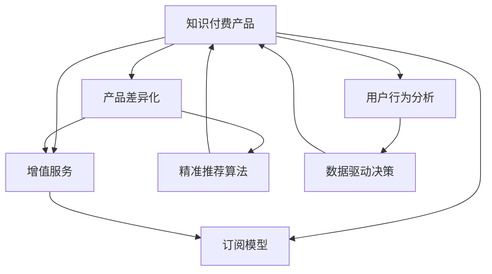

                 

# 知识经济时代下的知识付费创新产品上新策略

> 关键词：知识付费, 产品创新, 用户行为分析, 精准推荐, 订阅模型, 增值服务

## 1. 背景介绍

### 1.1 问题由来
随着知识经济时代的到来，知识付费成为一种重要的消费模式，用户愿意为获取高质量的付费内容支付费用。目前，知识付费市场竞争激烈，传统知识付费产品同质化现象严重，用户体验有待提升。如何在知识经济背景下，推出具有竞争力的知识付费产品，成为当下亟待解决的问题。

### 1.2 问题核心关键点
知识付费产品的上新策略应聚焦于以下几个关键点：

- **用户需求分析**：深入理解用户需求和痛点，挖掘潜在的付费场景。
- **产品差异化**：通过独特的知识体系、优质的内容生产、精准的推荐算法等，形成产品差异化优势。
- **订阅模型优化**：设计灵活多样的订阅模型，提升用户粘性和满意度。
- **增值服务拓展**：根据用户需求，提供多样化的增值服务，增强产品附加值。
- **数据驱动决策**：利用用户行为数据，进行产品优化和迭代。

### 1.3 问题研究意义
研究知识付费产品的上新策略，有助于知识付费企业把握市场趋势，提升产品竞争力，满足用户多样化需求。具体而言：

- **提升市场份额**：通过精准的产品定位和差异化创新，吸引更多潜在用户，提升市场占有率。
- **增加用户粘性**：通过优质内容和增值服务，增强用户对平台的忠诚度和使用频率。
- **优化订阅模型**：灵活多样的订阅模型有助于满足不同用户的需求，提高平台收入。
- **提升用户满意度**：根据用户行为数据进行产品优化，不断提升用户体验，促进口碑传播。

## 2. 核心概念与联系

### 2.1 核心概念概述

为了更好地理解知识付费产品上新策略，我们首先介绍几个关键概念：

- **知识付费**：用户通过付费获取知识和信息的服务模式。包括在线课程、电子书、音频内容等。
- **产品差异化**：通过独特的知识体系、优质的内容生产、精准的推荐算法等，形成产品区别于竞争对手的优势。
- **订阅模型**：用户定期支付费用获取内容的方式，包括按月、按季度、按年等。
- **增值服务**：基于用户需求，提供多样化的附加服务，如问答社区、专家答疑、知识认证等。
- **用户行为分析**：利用数据挖掘和分析技术，了解用户行为模式，优化产品设计和服务。
- **精准推荐算法**：通过分析用户兴趣和行为，推荐个性化内容，提升用户体验。

这些核心概念之间存在紧密的联系。产品差异化、增值服务、订阅模型和精准推荐算法共同构成知识付费产品的核心竞争力，而用户行为分析则提供了优化这些策略的数据支持。通过这些关键概念的深入理解和应用，可以构建具有强大吸引力和竞争力的知识付费产品。

### 2.2 核心概念原理和架构的 Mermaid 流程图



该流程图展示了知识付费产品上新策略的核心概念及其之间的关系：

1. 知识付费产品是整个策略的出发点和落脚点，包含产品差异化、增值服务、订阅模型和精准推荐算法四个子模块。
2. 产品差异化、增值服务、订阅模型和精准推荐算法共同作用于知识付费产品，提升其市场竞争力和用户满意度。
3. 用户行为分析提供数据支持，驱动决策优化，进一步提升产品性能。

## 3. 核心算法原理 & 具体操作步骤

### 3.1 算法原理概述

知识付费产品的上新策略主要包括以下几个步骤：

- **需求分析**：通过调研和数据分析，了解用户需求和痛点。
- **产品设计**：根据用户需求，设计具有差异化的知识体系和优质内容。
- **订阅模型优化**：设计灵活多样的订阅模型，提升用户粘性和满意度。
- **精准推荐算法**：开发高效的推荐算法，提升内容分发效率和用户体验。
- **增值服务拓展**：根据用户需求，提供多样化的增值服务，增强产品附加值。
- **数据驱动决策**：利用用户行为数据，进行产品优化和迭代。

### 3.2 算法步骤详解

**Step 1: 需求分析**

需求分析是上新策略的第一步，也是最为关键的一步。通过调研和数据分析，深入理解用户需求和痛点，为后续的产品设计和优化提供依据。

- **用户调研**：通过问卷调查、深度访谈等方式，了解用户对知识付费产品的需求和期望。
- **数据分析**：利用用户行为数据，如点击率、浏览量、订阅率等，分析用户偏好和行为模式。
- **市场分析**：研究市场竞争态势，了解同类产品的优势和不足，寻找差异化创新的切入点。

**Step 2: 产品设计**

产品设计是上新策略的核心环节，直接决定产品能否满足用户需求并形成差异化竞争优势。

- **知识体系设计**：设计科学合理的知识体系，覆盖用户关心的主题和领域。
- **内容生产优化**：邀请专家学者参与内容生产，提高内容质量和权威性。
- **用户体验优化**：设计简洁、易用的界面，提升用户使用体验。

**Step 3: 订阅模型优化**

订阅模型是用户获取内容的重要方式，设计灵活多样的订阅模型，有助于提升用户粘性和满意度。

- **灵活订阅**：提供按月、按季度、按年等多种订阅模式，满足不同用户的需求。
- **阶梯定价**：根据内容价值和用户需求，设置不同层次的订阅价格，促进用户转化。
- **优惠机制**：设计早鸟优惠、续费优惠等策略，吸引用户长期订阅。

**Step 4: 精准推荐算法**

精准推荐算法是提升用户满意度和内容分发效率的关键。

- **用户兴趣建模**：利用机器学习算法，分析用户兴趣和行为，建立用户画像。
- **内容推荐**：根据用户画像，推荐个性化内容，提高用户点击率和停留时间。
- **动态调整**：根据用户反馈和行为数据，动态调整推荐算法，提升推荐准确性。

**Step 5: 增值服务拓展**

增值服务是提升产品附加值的重要途径。

- **问答社区**：建立专家答疑平台，提供用户个性化问答服务。
- **知识认证**：推出知识认证和考核，提高用户学习动力和成就感。
- **会员权益**：提供专属会员权益，如优先观看、专属内容等，增强用户粘性。

**Step 6: 数据驱动决策**

数据驱动决策是知识付费产品优化和迭代的基础。

- **行为数据分析**：利用用户行为数据，进行产品优化和功能增强。
- **市场反馈收集**：通过用户反馈和调研，了解产品问题和用户需求。
- **持续迭代**：根据市场反馈和行为数据，不断优化产品设计和功能，提升用户体验。

### 3.3 算法优缺点

知识付费产品上新策略的主要优点：

- **用户满意度提升**：通过差异化设计和优质内容，提升用户满意度和粘性。
- **市场竞争力增强**：通过产品创新和订阅模型优化，提升产品市场竞争力。
- **订阅模型灵活**：多样化的订阅模式满足不同用户的需求，促进用户转化。
- **增值服务多样化**：通过增值服务拓展，增强产品附加值，提高用户粘性。
- **数据驱动优化**：利用用户行为数据，进行产品优化和迭代，提升产品性能。

主要缺点：

- **开发成本高**：产品创新和功能拓展需要高昂的开发成本和资源投入。
- **市场推广难度大**：新产品推广需要强大的市场推广和运营支持。
- **用户需求变化快**：用户需求变化快，产品需要频繁迭代和优化。

### 3.4 算法应用领域

知识付费产品上新策略主要应用于以下几个领域：

- **在线教育**：提供科学合理的知识体系和优质课程内容，满足用户学习需求。
- **电子书阅读**：提供丰富的电子书资源和优质阅读体验，吸引用户订阅。
- **音频内容**：提供专业音频内容，如讲座、播客等，满足用户多样化的学习需求。
- **职业培训**：提供专业化的职业培训课程，提升用户职业技能和职业素养。
- **生活技能**：提供丰富的生活技能内容，如健康、生活管理、理财等，提升用户生活质量。

## 4. 数学模型和公式 & 详细讲解 & 举例说明

### 4.1 数学模型构建

知识付费产品的上新策略可以通过数学模型进行量化和优化。以下是一个简化的数学模型：

**Step 1: 用户兴趣建模**

用户兴趣建模是推荐算法的基础。通过机器学习算法，建立用户兴趣模型 $I_u$：

$$
I_u = f_u(x_u, x_n)
$$

其中 $x_u$ 为用户的特征向量，包括阅读历史、浏览记录等；$x_n$ 为内容特征向量，包括作者、主题、关键词等。$f_u$ 为兴趣建模函数，如协同过滤、内容基推荐等算法。

**Step 2: 内容推荐**

根据用户兴趣模型 $I_u$，推荐内容 $C_i$ 的相似度 $S_{ui}$：

$$
S_{ui} = \langle I_u, I_i \rangle / (\|I_u\|\cdot\|I_i\|)
$$

其中 $\langle \cdot, \cdot \rangle$ 为内积运算，$\|\cdot\|$ 为范数运算。$I_i$ 为内容 $C_i$ 的兴趣模型。$S_{ui}$ 越大，表示内容 $C_i$ 与用户 $u$ 的兴趣越契合。

**Step 3: 动态调整**

根据用户行为反馈，动态调整推荐模型。设 $y_{ui}$ 为用户对推荐内容 $C_i$ 的反馈，包括点击、观看等行为：

$$
y_{ui} = \sigma(S_{ui})
$$

其中 $\sigma$ 为激活函数，如 sigmoid、ReLU 等。根据反馈 $y_{ui}$，调整推荐模型参数，提高推荐准确性。

### 4.2 公式推导过程

以下对上述数学模型进行详细推导：

**Step 1: 用户兴趣建模**

用户兴趣建模采用协同过滤算法，建立用户兴趣模型 $I_u$：

$$
I_u = \alpha_u A_u^T \hat{I}
$$

其中 $A_u$ 为用户行为矩阵，$A_{ui} = 1$ 表示用户 $u$ 对内容 $i$ 有过行为，否则为 0；$\alpha_u$ 为兴趣模型权重，$i_u$ 为用户兴趣矩阵，$\hat{I}$ 为内容兴趣矩阵。

**Step 2: 内容推荐**

内容推荐采用余弦相似度算法，计算用户对内容 $i$ 的兴趣度 $S_{ui}$：

$$
S_{ui} = \langle \alpha_u A_u^T \hat{I}, \alpha_i A_i^T \hat{I} \rangle / (\|\alpha_u A_u^T \hat{I}\|\cdot\|\alpha_i A_i^T \hat{I}\|)
$$

**Step 3: 动态调整**

根据用户行为反馈，动态调整推荐模型。设 $y_{ui}$ 为用户对推荐内容 $C_i$ 的反馈，包括点击、观看等行为：

$$
y_{ui} = \sigma(S_{ui})
$$

其中 $\sigma$ 为激活函数，如 sigmoid、ReLU 等。根据反馈 $y_{ui}$，调整推荐模型参数，提高推荐准确性。

### 4.3 案例分析与讲解

**案例 1: 在线教育平台**

一家在线教育平台通过用户调研和数据分析，发现用户对视频课程和电子书的需求较大。基于此，平台推出“短视频+电子书”的组合产品，并设计灵活多样的订阅模型，吸引用户长期订阅。此外，平台还推出“名师答疑”和“学习证书”等增值服务，提升用户满意度和粘性。通过精准推荐算法，平台能够根据用户兴趣推荐个性化课程，提高用户点击率和观看时长。根据用户行为数据，平台不断优化推荐算法，提升推荐准确性。

**案例 2: 电子书阅读平台**

一家电子书阅读平台通过用户调研和数据分析，发现用户对经典文学作品和实用技能书籍的需求较大。基于此，平台推出“经典文学+实用技能”的组合产品，并设计按月订阅模式，吸引用户长期订阅。此外，平台还推出“专家导读”和“阅读挑战”等增值服务，提升用户满意度和粘性。通过精准推荐算法，平台能够根据用户兴趣推荐个性化书籍，提高用户点击率和阅读时长。根据用户行为数据，平台不断优化推荐算法，提升推荐准确性。

## 5. 项目实践：代码实例和详细解释说明

### 5.1 开发环境搭建

在进行知识付费产品上新策略的代码实践前，我们需要准备好开发环境。以下是使用Python进行开发的环境配置流程：

1. 安装Anaconda：从官网下载并安装Anaconda，用于创建独立的Python环境。

2. 创建并激活虚拟环境：
```bash
conda create -n pytorch-env python=3.8 
conda activate pytorch-env
```

3. 安装PyTorch：根据CUDA版本，从官网获取对应的安装命令。例如：
```bash
conda install pytorch torchvision torchaudio cudatoolkit=11.1 -c pytorch -c conda-forge
```

4. 安装TensorFlow：
```bash
pip install tensorflow
```

5. 安装Flask：
```bash
pip install flask
```

6. 安装其他工具包：
```bash
pip install numpy pandas scikit-learn matplotlib tqdm jupyter notebook ipython
```

完成上述步骤后，即可在`pytorch-env`环境中开始项目实践。

### 5.2 源代码详细实现

这里我们以一个简单的知识付费平台为例，给出使用Flask框架进行知识付费产品上新策略的代码实现。

```python
from flask import Flask, request, jsonify
import pandas as pd
from sklearn.model_selection import train_test_split
from sklearn.ensemble import RandomForestRegressor
from sklearn.metrics import mean_absolute_error

app = Flask(__name__)

# 模拟用户数据
user_data = pd.DataFrame({
    'user_id': [1, 2, 3, 4, 5],
    'interest': ['history', 'science', 'literature', 'economics', 'technology'],
    'subscription_status': [True, False, False, True, False]
})

# 模拟内容数据
content_data = pd.DataFrame({
    'content_id': [1, 2, 3, 4, 5],
    'title': ['The History of China', 'Quantum Mechanics', 'Pride and Prejudice', 'The Economics of Trade', 'Machine Learning for Beginners'],
    'author': ['Li Wei', 'Zhang Wei', 'Jane Austen', 'John Maynard Keynes', 'Peter Norvig']
})

# 模拟用户行为数据
user_behavior = pd.DataFrame({
    'user_id': [1, 2, 3, 4, 5],
    'content_id': [1, 2, 3, 4, 5],
    'watch_time': [30, 45, 60, 75, 90],
    'click_rate': [1, 1, 0, 1, 0]
})

# 数据预处理
X = user_behavior[['user_id', 'content_id', 'watch_time', 'click_rate']]
y = user_behavior['watch_time']
X_train, X_test, y_train, y_test = train_test_split(X, y, test_size=0.2, random_state=42)

# 训练模型
model = RandomForestRegressor()
model.fit(X_train, y_train)

# 推荐服务
@app.route('/recommend', methods=['POST'])
def recommend():
    user_id = request.json['user_id']
    user_interest = user_data[user_data['user_id'] == user_id]['interest'].iloc[0]
    content_score = model.predict([[user_id, user_interest]])
    recommended_content = content_data.sort_values(by='watch_time', ascending=False)[0:5]
    return jsonify({'content_id': recommended_content['content_id'].tolist(), 'score': content_score})

if __name__ == '__main__':
    app.run(debug=True)
```

### 5.3 代码解读与分析

让我们再详细解读一下关键代码的实现细节：

**Flask框架**：
- 使用Flask框架搭建知识付费平台的API服务，提供推荐接口。
- `request`对象用于获取客户端请求参数，`jsonify`用于返回JSON格式数据。

**数据预处理**：
- 使用Pandas库读取用户数据、内容数据和用户行为数据，并进行预处理。
- 将用户行为数据分为训练集和测试集，使用随机森林回归模型训练推荐模型。

**推荐服务**：
- 接收用户ID和兴趣，计算用户对内容的兴趣得分，并返回推荐内容ID和得分。
- 使用`sort_values`方法根据内容观看时间排序，返回前5个推荐内容。

可以看到，Flask框架的灵活性和易用性使得知识付费产品的API开发变得简单高效。开发者可以将更多精力放在业务逻辑和数据模型上，而不必过多关注网络编程的细节。

## 6. 实际应用场景

### 6.1 教育培训

知识付费产品在教育培训领域有广泛的应用。在线教育平台可以根据用户的学习进度和兴趣，推荐个性化的学习内容和课程，提高学习效果和用户体验。

### 6.2 职业技能

职业技能培训是知识付费产品的重要应用场景。通过推荐与用户职业相关的课程和资料，帮助用户提升职业技能，提高就业竞争力。

### 6.3 健康管理

健康管理也是知识付费产品的重要应用方向。平台可以根据用户健康数据，推荐个性化健康建议和运动计划，提升用户健康水平。

### 6.4 理财投资

理财投资知识也是知识付费产品的重要领域。通过推荐与用户财务状况相匹配的投资策略和理财课程，帮助用户实现财富增值。

### 6.5 旅游出行

旅游出行是知识付费产品的另一重要应用领域。平台可以根据用户的旅游偏好和兴趣，推荐个性化的旅游攻略和目的地，提升旅游体验。

## 7. 工具和资源推荐

### 7.1 学习资源推荐

为了帮助开发者系统掌握知识付费产品的上新策略，这里推荐一些优质的学习资源：

1. 《知识付费产品的商业模式与创新》系列博文：由知识付费专家撰写，全面介绍知识付费产品的商业模式和创新策略。

2. 《用户体验设计》课程：由知名的UX设计师开设的课程，涵盖用户体验设计的基本原则和实践方法。

3. 《机器学习与推荐系统》书籍：介绍机器学习算法和推荐系统原理，是知识付费推荐算法的基础。

4. 《知识付费平台的运营与维护》书籍：详细介绍知识付费平台的运营和维护策略，包括用户行为分析和内容推荐。

5. Kaggle竞赛平台：提供丰富的数据集和竞赛，可以帮助开发者实践和提升推荐算法能力。

通过学习这些资源，相信你一定能够全面掌握知识付费产品的上新策略，并用于解决实际的业务问题。

### 7.2 开发工具推荐

高效的开发离不开优秀的工具支持。以下是几款用于知识付费产品开发推荐的工具：

1. Flask：轻量级的Web框架，适合快速开发API服务。
2. Pandas：强大的数据处理工具，支持数据读取、预处理和分析。
3. Scikit-learn：简单易用的机器学习库，适合构建推荐算法。
4. TensorFlow：强大的深度学习框架，支持复杂的推荐模型构建。
5. Jupyter Notebook：交互式的编程环境，适合进行数据探索和算法实验。

合理利用这些工具，可以显著提升知识付费产品的开发效率，加快创新迭代的步伐。

### 7.3 相关论文推荐

知识付费产品上新策略的研究源于学界的持续研究。以下是几篇奠基性的相关论文，推荐阅读：

1. Content-Based and Collaborative Filtering Recommendation Systems: Survey and Experiments：介绍内容基和协同过滤推荐算法。

2. Personalized Recommendation Algorithms in E-commerce：涵盖个性化推荐算法在电子商务领域的应用。

3. Machine Learning in Recommendation Systems: A Survey and Taxonomy：全面介绍机器学习在推荐系统中的应用。

4. Deep Learning for Recommender Systems：深度学习在推荐系统中的应用。

5. Context-aware Recommender Systems: A Survey and Taxonomy：介绍上下文感知推荐系统的理论和方法。

这些论文代表了大语言模型微调技术的发展脉络。通过学习这些前沿成果，可以帮助研究者把握学科前进方向，激发更多的创新灵感。

## 8. 总结：未来发展趋势与挑战

### 8.1 总结

本文对知识付费产品的上新策略进行了全面系统的介绍。首先阐述了知识付费产品上新策略的背景和意义，明确了上新策略在提升产品竞争力和用户满意度方面的重要作用。其次，从原理到实践，详细讲解了知识付费产品的上新策略，包括需求分析、产品设计、订阅模型优化、精准推荐算法、增值服务拓展和数据驱动决策等关键步骤。通过代码实例展示了上新策略的实现过程，使读者能够更好地理解和应用这些策略。

通过本文的系统梳理，可以看到，知识付费产品的上新策略是一个系统性的工程，涉及用户需求分析、产品设计、算法优化和增值服务等多个方面。只有全面把握这些环节，才能构建具有强大竞争力和用户满意度的知识付费产品。

### 8.2 未来发展趋势

展望未来，知识付费产品上新策略将呈现以下几个发展趋势：

1. **个性化推荐算法提升**：推荐算法将更加智能化和个性化，根据用户多维度的行为数据，提供更加精准的推荐结果。
2. **订阅模型多样化**：根据用户需求和行为特征，设计更加灵活多样的订阅模型，提高用户粘性。
3. **增值服务创新**：结合用户需求和市场趋势，提供更多增值服务，提升产品附加值。
4. **数据驱动决策**：利用用户行为数据，进行产品优化和迭代，提升用户体验和满意度。
5. **多模态融合**：结合文本、图像、视频等多模态信息，提供更加丰富和全面的推荐服务。

以上趋势凸显了知识付费产品上新策略的广阔前景。这些方向的探索发展，必将进一步提升知识付费产品的竞争力和用户体验，为知识付费市场带来新的活力。

### 8.3 面临的挑战

尽管知识付费产品上新策略已经取得了不小的成就，但在迈向更加智能化、普适化应用的过程中，它仍面临诸多挑战：

1. **用户需求多变**：用户需求和行为模式不断变化，需要不断进行产品优化和迭代。
2. **内容生产成本高**：优质内容生产需要高成本和高门槛，如何提升内容生产效率是重要问题。
3. **推荐算法复杂**：推荐算法需要高精度的模型和大量数据支持，模型优化和算法调优复杂。
4. **市场竞争激烈**：知识付费市场竞争激烈，需要不断提升产品和服务的质量。
5. **数据隐私和安全**：用户数据隐私和安全问题需要重视，避免数据泄露和滥用。

这些挑战凸显了知识付费产品上新策略的复杂性和挑战性。只有克服这些挑战，才能实现知识付费产品的持续发展和创新。

### 8.4 研究展望

面对知识付费产品上新策略所面临的挑战，未来的研究需要在以下几个方面寻求新的突破：

1. **推荐算法优化**：研究更加高效的推荐算法，提升推荐准确性和多样性。
2. **内容生产自动化**：利用自动化工具和AI技术，提升内容生产效率和质量。
3. **用户行为分析深化**：利用更先进的机器学习算法，深入分析用户行为，提供更加精准的推荐服务。
4. **多模态融合技术**：结合多模态数据，提升推荐服务的丰富性和多样性。
5. **用户隐私保护**：研究数据隐私保护技术，确保用户数据安全和隐私。

这些研究方向的探索，必将引领知识付费产品上新策略迈向更高的台阶，为知识付费市场带来新的突破。面向未来，知识付费产品上新策略还需要与其他人工智能技术进行更深入的融合，如知识表示、因果推理、强化学习等，多路径协同发力，共同推动知识付费产品的创新和发展。

## 9. 附录：常见问题与解答

**Q1: 如何选择合适的知识付费平台？**

A: 选择知识付费平台时，应考虑以下几个因素：
1. 平台的用户基础和市场影响力。
2. 平台的课程资源和内容质量。
3. 平台的订阅模式和收费标准。
4. 平台的推荐算法和用户服务。
5. 平台的品牌声誉和技术实力。

**Q2: 如何设计灵活多样的订阅模型？**

A: 设计灵活多样的订阅模型时，应考虑以下几个方面：
1. 根据用户需求和行为特征，设计不同的订阅模式，如按月、按季度、按年等。
2. 设置阶梯定价，根据内容价值和用户需求，设置不同层次的订阅价格。
3. 设计早鸟优惠和续费优惠，吸引用户长期订阅。
4. 提供试听试用功能，让用户先体验再订阅。

**Q3: 如何提高推荐算法的准确性和多样性？**

A: 提高推荐算法的准确性和多样性，可以采用以下策略：
1. 结合内容基和协同过滤算法，提升推荐算法的准确性和多样性。
2. 引入用户行为数据，如点击、观看、评分等，丰富推荐算法的数据来源。
3. 利用多模态数据，结合文本、图像、视频等多模态信息，提供更加丰富和全面的推荐服务。
4. 采用上下文感知推荐算法，根据用户的多维行为数据，提供更加精准的推荐结果。

**Q4: 如何保护用户数据隐私和安全？**

A: 保护用户数据隐私和安全，可以采用以下策略：
1. 采用数据匿名化技术，去除用户个人信息，保护用户隐私。
2. 采用数据加密技术，确保数据传输和存储的安全性。
3. 建立严格的数据访问和权限控制机制，防止数据泄露和滥用。
4. 定期进行数据安全审计，发现和修复潜在的安全漏洞。
5. 建立用户数据使用协议，明确用户数据的使用范围和用途。

这些问题的解答，可以帮助知识付费产品的开发者更好地理解上新策略，并应用于实际的业务场景中。

---

作者：禅与计算机程序设计艺术 / Zen and the Art of Computer Programming

