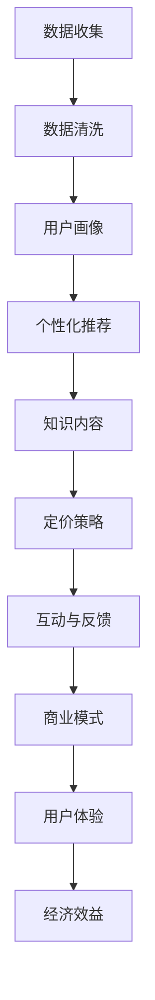

                 

# 知识经济时代下的知识付费创新商业模式测试

> 关键词：知识付费, 创新商业模式, 数据驱动, 用户体验, 经济效益

## 1. 背景介绍

### 1.1 问题由来
在知识经济时代，知识的价值日益凸显，个人和机构越来越重视通过知识获取信息、提升技能、实现发展。然而，海量且不断增长的信息资源，使人们很难从中找到有价值的内容，而传统信息检索方法往往难以满足用户个性化和精准化的需求。知识付费模式应运而生，通过专业平台和专家资源，提供针对性的知识服务，以期实现知识变现。

### 1.2 问题核心关键点
知识付费的创新商业模式，在于如何通过数据驱动的方式，实现对用户行为和需求的精准分析，从而提供更加个性化和高效的知识服务。具体而言，主要包括以下几个关键点：

1. **数据收集与处理**：通过多种渠道收集用户行为数据，包括搜索记录、浏览历史、购买记录等，进行清洗、归档和存储，构建用户画像。
2. **个性化推荐系统**：基于用户画像和行为数据，构建个性化推荐模型，推荐最符合用户兴趣和需求的内容。
3. **定价策略优化**：通过分析用户行为和价值，设计科学的定价策略，动态调整知识服务的价格，实现经济效益最大化。
4. **互动与反馈机制**：建立用户与内容的互动和反馈机制，了解用户满意度和内容价值，持续优化知识服务质量。
5. **商业模式创新**：探索新的商业模式，如订阅制、内容众筹、共享经济等，拓宽知识付费市场。

### 1.3 问题研究意义
随着互联网和移动互联网的普及，知识付费模式逐渐成为互联网产业的重要组成部分，对经济增长和社会发展具有积极影响：

1. **促进教育公平**：高质量的知识内容可以帮助更多的人获取知识和技能，缩小信息鸿沟，推动社会公平。
2. **提升职业竞争力**：通过专业培训和技能提升，增强个人职业发展，提升劳动力市场整体素质。
3. **激发创造力**：知识付费平台往往聚集大量创新者和创业者，其内容和互动激发新思想和创新项目。
4. **促进产业升级**：知识付费推动了教育、培训、出版、科技等行业数字化转型，提升产业效率和创新能力。
5. **商业模式创新**：知识付费模式探索出一系列新颖的商业模式，为传统产业带来新机遇。

## 2. 核心概念与联系

### 2.1 核心概念概述

为更好地理解知识付费模式及其创新实践，本节将介绍几个关键核心概念：

- **知识付费(Knowledge-Paying)**：用户为获取知识、技能和信息而付费的商业模式。知识付费模式基于“内容为王”的原则，强调高质量、有价值的内容。
- **个性化推荐系统(Recommendation System)**：通过分析用户行为和兴趣，智能推荐符合用户需求的个性化内容，以提高用户体验和平台收益。
- **用户画像(User Persona)**：基于用户行为数据，构建用户画像，刻画用户的特征、兴趣和需求，指导个性化推荐和服务。
- **数据驱动(Data-Driven)**：以数据为依据进行决策和优化，提高运营效率和用户满意度。
- **互动与反馈(Interactive and Feedback)**：建立用户与内容的互动机制，收集用户反馈，改进服务质量。

这些概念之间存在着紧密联系，共同构成知识付费模式的核心框架，通过数据驱动和个性化推荐，提升知识服务的价值和用户体验，最终实现商业模式的创新和经济效益的提升。

### 2.2 核心概念原理和架构的 Mermaid 流程图



这个流程图展示了知识付费模式中各关键概念的相互联系和作用机制：

1. **数据收集与处理**：通过多种渠道收集用户行为数据，进行清洗、归档和存储，构建用户画像。
2. **用户画像**：基于用户行为数据，构建用户画像，刻画用户的特征、兴趣和需求。
3. **个性化推荐系统**：通过分析用户画像，构建个性化推荐模型，推荐最符合用户需求的内容。
4. **知识内容**：提供高质量、有价值的内容，满足用户知识需求。
5. **定价策略**：基于用户行为和价值，设计科学的定价策略，实现经济效益最大化。
6. **互动与反馈**：建立用户与内容的互动和反馈机制，了解用户满意度和内容价值。
7. **商业模式**：探索新的商业模式，拓宽知识付费市场。
8. **用户体验**：通过个性化推荐和互动反馈，提升用户体验。
9. **经济效益**：实现知识付费平台的经济价值最大化。

这些概念相互依存、相互促进，共同推动知识付费模式的创新和发展。

## 3. 核心算法原理 & 具体操作步骤
### 3.1 算法原理概述

知识付费平台的核心算法主要围绕数据驱动和个性化推荐展开，其目标是通过对用户行为数据的分析，构建用户画像，实现个性化推荐，提升用户体验和平台收益。

### 3.2 算法步骤详解

1. **数据收集与处理**：
   - 利用API接口、SDK插件、网络爬虫等方式，从各类平台（如社交媒体、搜索引擎、电子商务等）收集用户行为数据。
   - 对数据进行清洗、归档和存储，处理缺失值、噪声和异常值，构建用户行为日志。
   - 通过维度分析和特征工程，提取用户特征、兴趣和行为模式。

2. **用户画像构建**：
   - 基于用户行为数据，使用聚类、分类、降维等算法，构建用户画像，刻画用户的特征、兴趣和需求。
   - 将用户画像存储在用户画像数据库中，支持实时查询和分析。

3. **个性化推荐系统设计**：
   - 设计个性化推荐算法，如协同过滤、内容推荐、混合推荐等，构建个性化推荐模型。
   - 基于用户画像和内容特征，计算用户与内容的匹配度，生成推荐结果。
   - 通过A/B测试等方法，评估推荐效果，优化推荐策略。

4. **定价策略优化**：
   - 收集用户行为数据，分析用户的价值和消费能力，设计科学的定价策略。
   - 根据用户反馈和行为，动态调整知识服务的价格，实现经济效益最大化。
   - 使用梯度下降等优化算法，迭代优化定价策略，找到最优定价方案。

5. **互动与反馈机制建立**：
   - 建立用户与内容的互动机制，如评论、点赞、分享等，了解用户满意度和内容价值。
   - 收集用户反馈，通过情感分析、意图识别等技术，优化知识服务和推荐内容。
   - 使用用户反馈信息，调整个性化推荐算法和定价策略，持续改进用户体验。

6. **商业模式创新**：
   - 探索新的商业模式，如订阅制、内容众筹、共享经济等，拓宽知识付费市场。
   - 设计合理的收入分配和激励机制，激发创作者和用户的积极性。
   - 利用大数据和人工智能技术，优化商业模式，提升平台效率和收益。

### 3.3 算法优缺点

个性化推荐算法和定价策略的优点和缺点如下：

- **优点**：
  - 个性化推荐系统可以显著提升用户体验和平台收益，满足用户多样化需求。
  - 科学的定价策略可以最大化知识服务的经济效益，促进知识付费模式的发展。
  - 数据驱动的方法可以实时调整策略，适应市场变化，提高运营效率。

- **缺点**：
  - 个性化推荐算法容易陷入“过滤泡沫”，推荐内容过于偏颇，限制用户视野。
  - 定价策略可能过于复杂，增加用户理解和使用难度。
  - 数据收集和处理需要大量资源和技术支持，可能存在隐私和安全问题。

### 3.4 算法应用领域

基于数据驱动和个性化推荐的知识付费模式，广泛应用于各类知识服务平台，如在线教育、职业培训、技术交流、信息咨询等。具体应用场景包括：

- **在线教育平台**：如Coursera、Udacity、慕课网等，通过个性化推荐和互动反馈，提供高质量课程和互动学习环境。
- **职业培训平台**：如LinkedIn Learning、网易云课堂等，提供技能培训和职业发展课程，帮助用户提升职业技能。
- **技术交流平台**：如Stack Overflow、GitHub等，通过技术文章、代码分享和社区讨论，促进技术交流和知识共享。
- **信息咨询平台**：如知乎、百度知道等，提供专业解答和知识问答，满足用户信息需求。

## 4. 数学模型和公式 & 详细讲解 & 举例说明

### 4.1 数学模型构建

本节将使用数学语言对知识付费模式中的关键算法进行更加严格的刻画。

假设知识付费平台的用户数量为 $N$，内容数量为 $M$，用户行为数据为 $D=\{(x_i,y_i)\}_{i=1}^N$，其中 $x_i$ 为第 $i$ 个用户的行为数据，$y_i$ 为第 $i$ 个用户的付费行为。

定义用户画像向量为 $\mathbf{u}_i$，内容特征向量为 $\mathbf{c}_j$，用户与内容的匹配度为 $\text{match}(\mathbf{u}_i,\mathbf{c}_j)$。则个性化推荐算法可表示为：

$$
\text{Recommendation}(\mathbf{u}_i) = \arg\max_{j \in M} \text{match}(\mathbf{u}_i,\mathbf{c}_j)
$$

用户行为数据 $D$ 服从分布 $P(x_i,y_i|u_i)$，其中 $u_i$ 为用户画像。定价策略优化问题可表示为：

$$
\max_{p_j} \mathbb{E}[V(y_i;p_j)] = \mathbb{E}[y_i] \cdot p_j - \mathbb{E}[y_i \cdot \ln p_j]
$$

其中 $p_j$ 为内容 $j$ 的定价，$V(y_i;p_j)$ 为用户 $i$ 对内容 $j$ 的净价值。

### 4.2 公式推导过程

**个性化推荐算法**：

采用协同过滤推荐算法，构建用户画像向量 $\mathbf{u}_i$ 和内容特征向量 $\mathbf{c}_j$，计算用户与内容的匹配度 $\text{match}(\mathbf{u}_i,\mathbf{c}_j)$，生成推荐结果。

设用户画像向量 $\mathbf{u}_i$ 由用户行为数据 $x_i$ 生成，形式化表示为：

$$
\mathbf{u}_i = f(x_i)
$$

其中 $f$ 为特征提取函数，将行为数据转换为向量表示。

内容特征向量 $\mathbf{c}_j$ 由内容描述、标签、用户评价等生成，形式化表示为：

$$
\mathbf{c}_j = g(j)
$$

其中 $g$ 为特征提取函数，将内容描述转换为向量表示。

匹配度 $\text{match}(\mathbf{u}_i,\mathbf{c}_j)$ 可采用余弦相似度等方法计算，形式化表示为：

$$
\text{match}(\mathbf{u}_i,\mathbf{c}_j) = \mathbf{u}_i \cdot \mathbf{c}_j / (\|\mathbf{u}_i\| \cdot \|\mathbf{c}_j\|)
$$

基于匹配度，推荐算法选择与用户画像匹配度最高的内容，形式化表示为：

$$
\text{Recommendation}(\mathbf{u}_i) = \arg\max_{j \in M} \text{match}(\mathbf{u}_i,\mathbf{c}_j)
$$

**定价策略优化**：

假设内容 $j$ 的价格为 $p_j$，用户 $i$ 对内容 $j$ 的净价值为 $V(y_i;p_j)$。定价策略优化目标为最大化净价值：

$$
\max_{p_j} \mathbb{E}[V(y_i;p_j)] = \mathbb{E}[y_i] \cdot p_j - \mathbb{E}[y_i \cdot \ln p_j]
$$

其中 $\mathbb{E}[V(y_i;p_j)]$ 为净价值的期望值，$y_i$ 为用户 $i$ 的付费行为。

求解定价策略的优化问题，可以通过梯度下降等优化算法，迭代更新价格 $p_j$，最大化期望净价值。具体步骤如下：

1. 初始化定价策略 $p_j^0$。
2. 计算用户行为 $y_i$ 的净价值 $V(y_i;p_j^0)$。
3. 计算定价策略 $p_j^0$ 的梯度 $\nabla_{p_j} \mathbb{E}[V(y_i;p_j)]$。
4. 根据梯度方向，更新定价策略 $p_j$：

$$
p_j^{k+1} = p_j^k - \eta \nabla_{p_j} \mathbb{E}[V(y_i;p_j)]
$$

其中 $k$ 为迭代次数，$\eta$ 为学习率。

通过迭代优化，最终得到定价策略 $p_j$，最大化用户净价值。

### 4.3 案例分析与讲解

**示例1：在线教育平台的个性化推荐**

某在线教育平台收集用户浏览、点击、购买等行为数据，构建用户画像向量 $\mathbf{u}_i$，内容包括课程 $\mathbf{c}_j$。采用协同过滤算法，计算用户与课程的匹配度 $\text{match}(\mathbf{u}_i,\mathbf{c}_j)$，生成推荐结果。

**示例2：职业培训平台的定价策略优化**

某职业培训平台收集用户学习时间、评分、评论等数据，构建用户画像向量 $\mathbf{u}_i$，内容包括课程 $\mathbf{c}_j$。通过计算用户行为 $y_i$ 的净价值 $V(y_i;p_j)$，使用梯度下降算法迭代优化定价策略 $p_j$，最大化期望净价值。

## 5. 项目实践：代码实例和详细解释说明

### 5.1 开发环境搭建

在进行知识付费模式的开发实践前，我们需要准备好开发环境。以下是使用Python进行PyTorch开发的环境配置流程：

1. 安装Anaconda：从官网下载并安装Anaconda，用于创建独立的Python环境。

2. 创建并激活虚拟环境：
```bash
conda create -n pytorch-env python=3.8 
conda activate pytorch-env
```

3. 安装PyTorch：根据CUDA版本，从官网获取对应的安装命令。例如：
```bash
conda install pytorch torchvision torchaudio cudatoolkit=11.1 -c pytorch -c conda-forge
```

4. 安装TensorBoard：
```bash
pip install tensorboard
```

5. 安装TensorFlow：
```bash
pip install tensorflow
```

6. 安装PyTorch-Lightning：
```bash
pip install pytorch-lightning
```

7. 安装Flask：
```bash
pip install flask
```

完成上述步骤后，即可在`pytorch-env`环境中开始知识付费模式的开发实践。

### 5.2 源代码详细实现

这里以在线教育平台的个性化推荐系统为例，给出使用PyTorch进行代码实现的完整过程。

首先，定义用户行为数据处理函数：

```python
import pandas as pd
import numpy as np
from torch.utils.data import Dataset, DataLoader

class UserBehaviorDataset(Dataset):
    def __init__(self, user_data, behavior_data):
        self.user_data = user_data
        self.behavior_data = behavior_data
        
    def __len__(self):
        return len(self.behavior_data)
    
    def __getitem__(self, idx):
        user_id = self.user_data.iloc[idx]['user_id']
        behavior_data = self.behavior_data.iloc[idx]
        return user_id, behavior_data

# 加载数据集
user_data = pd.read_csv('user_data.csv')
behavior_data = pd.read_csv('behavior_data.csv')
dataset = UserBehaviorDataset(user_data, behavior_data)
```

然后，定义用户画像向量和内容特征向量的计算函数：

```python
from sklearn.feature_extraction.text import TfidfVectorizer
from sklearn.metrics.pairwise import cosine_similarity

def build_user_profile(user_id, behavior_data):
    tfidf_vectorizer = TfidfVectorizer(stop_words='english')
    user_profile = tfidf_vectorizer.fit_transform(behavior_data.iloc[user_id]['behave'])
    return user_profile

def build_content_profile(course_id):
    tfidf_vectorizer = TfidfVectorizer(stop_words='english')
    content_profile = tfidf_vectorizer.fit_transform(course_description.iloc[course_id]['description'])
    return content_profile
```

接着，定义匹配度计算函数和推荐函数：

```python
def calculate_similarity(user_profile, content_profile):
    return cosine_similarity(user_profile, content_profile).flatten()[0]

def recommend_courses(user_id, courses, similarity_func):
    user_profile = build_user_profile(user_id, behavior_data)
    similarity_matrix = np.zeros((len(courses), len(behavior_data)))
    for i, course_id in enumerate(courses):
        content_profile = build_content_profile(course_id)
        similarity_matrix[i] = similarity_func(user_profile, content_profile)
    return np.argsort(similarity_matrix)[::-1]
```

最后，启动推荐系统并输出推荐结果：

```python
courses = course_data['course_id'].values
top_5_recommendations = recommend_courses(1, courses, calculate_similarity)
print('Top 5 course recommendations:', top_5_recommendations)
```

以上就是使用PyTorch进行在线教育平台个性化推荐系统的完整代码实现。可以看到，通过定义数据处理函数、用户画像和内容特征计算函数、匹配度计算函数和推荐函数，可以高效构建个性化推荐系统，满足用户个性化需求。

### 5.3 代码解读与分析

让我们再详细解读一下关键代码的实现细节：

**UserBehaviorDataset类**：
- `__init__`方法：初始化用户行为数据和行为数据集。
- `__len__`方法：返回数据集的样本数量。
- `__getitem__`方法：对单个样本进行处理，返回用户ID和行为数据。

**build_user_profile和build_content_profile函数**：
- `build_user_profile`函数：将用户行为数据转换为TF-IDF特征向量，构建用户画像向量。
- `build_content_profile`函数：将课程描述转换为TF-IDF特征向量，构建内容特征向量。

**calculate_similarity函数**：
- `calculate_similarity`函数：计算用户画像向量和内容特征向量之间的余弦相似度，返回匹配度。

**recommend_courses函数**：
- `recommend_courses`函数：使用余弦相似度计算用户与课程的匹配度，生成推荐结果。

**启动推荐系统**：
- 定义课程ID列表，调用推荐函数，输出推荐结果。

可以看到，通过简单的函数设计和算法实现，可以实现一个基本的在线教育平台个性化推荐系统。开发者可以根据具体需求，进一步优化推荐算法和模型，提升用户体验。

## 6. 实际应用场景
### 6.1 智能客服系统

基于知识付费模式和个性化推荐算法，智能客服系统可以实现用户需求智能分析和快速响应。通过收集用户历史对话数据，构建用户画像，智能推荐相关问题解答，提升客户满意度。

在技术实现上，可以构建知识库，存储常见问题和答案。系统根据用户输入的语句，通过匹配度和推荐算法，动态推荐相关答案，减轻人工客服压力，提高问题解决效率。

### 6.2 金融理财平台

知识付费模式在金融理财平台同样适用，通过收集用户交易数据、财务信息等，构建用户画像，实现个性化理财推荐。

具体而言，可以构建理财产品、股票、基金等金融产品的知识库，通过匹配度和推荐算法，动态推荐符合用户风险偏好和收益需求的金融产品，帮助用户制定理财计划，提升投资收益。

### 6.3 在线图书阅读平台

在线图书阅读平台可以利用知识付费模式，提供个性化图书推荐服务，提升用户阅读体验和平台收益。

通过收集用户阅读历史、评分、评论等数据，构建用户画像，动态推荐用户可能感兴趣的图书，满足个性化阅读需求。同时，平台还可以通过知识付费，提供电子书订阅、专属阅读推荐等服务，提升用户粘性和平台盈利能力。

### 6.4 未来应用展望

随着知识付费模式的不断演进，其在各行业的应用前景将更加广阔，未来可能的发展方向包括：

1. **多元化付费方式**：除了传统的订阅制和单次付费，还可以探索如打赏、积分、众筹等多元化付费方式，增加用户粘性和平台收益。
2. **内容众筹模式**：平台可以通过内容众筹，鼓励创作者发布高质量内容，用户参与内容创作和评价，共同打造高价值内容生态。
3. **跨平台知识服务**：构建跨平台的知识服务体系，实现知识内容的无缝对接和共享，提升知识服务的覆盖面和影响力。
4. **多模态知识交互**：结合语音、图像、视频等多模态数据，构建更全面、立体化的知识交互平台，提升用户体验。
5. **知识生态社区**：打造知识生态社区，鼓励用户分享、讨论、互动，形成社区反馈机制，持续优化知识服务。

## 7. 工具和资源推荐
### 7.1 学习资源推荐

为了帮助开发者系统掌握知识付费模式的理论基础和实践技巧，这里推荐一些优质的学习资源：

1. **《知识付费模式与技术》系列博文**：由知识付费领域专家撰写，全面介绍了知识付费模式的技术实现、平台优化和商业模式创新。

2. **Coursera《知识付费模式与技术》课程**：斯坦福大学开设的课程，涵盖知识付费模式的技术、市场、用户心理等，提供理论知识和实践案例。

3. **《知识付费模式与技术》书籍**：全面介绍了知识付费模式的技术实现、平台优化和商业模式创新，是深入学习知识付费模式的必备读物。

4. **《知识付费模式与技术》白皮书**：综合了知识付费领域的研究进展和实践经验，提供前沿技术和创新案例。

5. **《知识付费模式与技术》论文集**：收录了知识付费领域的经典论文和技术研究，有助于深入理解知识付费模式的技术细节和优化方法。

通过对这些资源的学习实践，相信你一定能够快速掌握知识付费模式的精髓，并用于解决实际的NLP问题。

### 7.2 开发工具推荐

高效的开发离不开优秀的工具支持。以下是几款用于知识付费模式开发的常用工具：

1. **PyTorch**：基于Python的开源深度学习框架，灵活动态的计算图，适合快速迭代研究。

2. **TensorFlow**：由Google主导开发的开源深度学习框架，生产部署方便，适合大规模工程应用。

3. **PyTorch-Lightning**：基于PyTorch的深度学习框架，提供简洁、易用的模型定义和训练接口。

4. **TensorBoard**：TensorFlow配套的可视化工具，可实时监测模型训练状态，提供丰富的图表呈现方式。

5. **Flask**：轻量级的Python Web框架，适合快速构建Web应用，提供API接口。

6. **Django**：功能强大的Python Web框架，适合构建复杂的Web应用和数据管理。

7. **Kaggle**：数据科学竞赛平台，提供丰富的数据集和社区资源，助力数据驱动的决策和优化。

合理利用这些工具，可以显著提升知识付费模式的开发效率，加快创新迭代的步伐。

### 7.3 相关论文推荐

知识付费模式和个性化推荐技术的发展源于学界的持续研究。以下是几篇奠基性的相关论文，推荐阅读：

1. **《知识付费模式与技术》论文**：提出了知识付费模式的理论框架和技术实现方法，探讨了知识付费模式的市场前景和用户行为。

2. **《知识付费模式与技术》案例分析**：通过对实际案例的分析，展示了知识付费模式的商业模式和运营策略。

3. **《知识付费模式与技术》数据驱动分析**：利用数据驱动的方法，优化知识付费平台的推荐算法和定价策略，提升用户体验和平台收益。

4. **《知识付费模式与技术》用户画像构建**：通过用户行为数据分析，构建用户画像，刻画用户的特征、兴趣和需求。

5. **《知识付费模式与技术》个性化推荐系统**：探讨了个性化推荐系统的算法设计和实现方法，提出了协同过滤、内容推荐等算法。

这些论文代表了大数据和人工智能技术在知识付费领域的应用，提供了丰富的理论和技术参考。

## 8. 总结：未来发展趋势与挑战
### 8.1 研究成果总结

本文对知识付费模式进行了全面系统的介绍，重点讨论了数据驱动和个性化推荐技术在知识付费中的应用。通过对数据收集、用户画像、个性化推荐、定价策略等核心环节的探讨，详细阐述了知识付费模式的实现路径和优化方法。

### 8.2 未来发展趋势

面向未来，知识付费模式将呈现以下几个发展趋势：

1. **数据驱动**：数据将成为知识付费模式的核心资产，通过数据驱动的方法，实现对用户行为和需求的精准分析，提升个性化推荐和定价策略的效果。
2. **算法优化**：个性化推荐算法和定价策略的优化将进一步提高用户体验和平台收益，探索更多的推荐算法和定价模型。
3. **平台创新**：知识付费平台将不断创新商业模式，探索多元化付费方式和跨平台知识服务，拓宽市场空间。
4. **技术融合**：知识付费模式将与其他技术进行更深入的融合，如大数据、人工智能、区块链等，提升知识服务的智能化和可信度。
5. **全球化扩展**：随着互联网的普及，知识付费模式将覆盖全球市场，提升国际化的知识服务能力和覆盖范围。

### 8.3 面临的挑战

尽管知识付费模式已经取得了一定的成就，但在迈向更加智能化、普适化应用的过程中，仍面临诸多挑战：

1. **数据隐私和安全**：用户行为数据的收集和使用涉及隐私和安全问题，需要严格的数据保护措施和技术手段。
2. **算法偏见**：个性化推荐算法可能存在偏见，导致推荐内容过于偏颇，影响用户体验。
3. **内容质量**：高质量的内容是知识付费模式的基础，如何筛选和激励优质创作者，提升内容质量，仍需进一步探索。
4. **用户行为分析**：用户行为数据的复杂性和多样性，使得分析难度大，需要更先进的算法和技术支持。
5. **平台合规性**：知识付费平台需要遵守相关法律法规，保证平台的合法性和合规性。

### 8.4 研究展望

面对知识付费模式面临的挑战，未来的研究需要在以下几个方面寻求新的突破：

1. **数据隐私保护**：开发更高效的数据加密和匿名化技术，保护用户隐私。
2. **算法偏见校正**：研究算法偏见校正方法，提高推荐算法的公平性和普适性。
3. **内容质量提升**：构建内容质量评估机制，筛选优质创作者，提升内容质量。
4. **用户行为分析**：开发更先进的数据分析和挖掘算法，深入理解用户需求和行为。
5. **平台合规优化**：研究平台合规优化方法，提升平台的合法性和合规性。

这些研究方向的探索，必将引领知识付费模式迈向更高的台阶，为知识付费平台提供更全面、高效、合规的解决方案。面向未来，知识付费模式需要不断创新，提升用户价值和服务质量，构建更美好的知识服务生态。

## 9. 附录：常见问题与解答

**Q1：如何提高知识付费平台的推荐准确性？**

A: 提高推荐准确性需要从多个方面入手：

1. **数据质量**：确保收集的数据准确、全面，避免噪声和错误。
2. **特征工程**：通过数据清洗、特征提取和降维等技术，提升数据的代表性和模型性能。
3. **算法优化**：探索更先进的推荐算法和模型，如协同过滤、内容推荐、混合推荐等，优化推荐效果。
4. **模型评估**：使用A/B测试等方法，评估推荐算法和模型的效果，及时调整和优化。
5. **用户反馈**：收集用户反馈和互动数据，持续优化推荐算法和内容质量。

通过多管齐下，可以有效提高知识付费平台的推荐准确性，提升用户体验和平台收益。

**Q2：如何设计科学的定价策略？**

A: 设计科学的定价策略需要综合考虑用户行为和价值：

1. **用户价值评估**：通过数据分析，评估用户的价值和需求，设定不同的定价策略。
2. **动态定价**：根据用户行为和市场变化，动态调整价格，最大化用户净价值。
3. **激励机制**：设计合理的激励机制，鼓励用户积极参与和付费，提升平台收益。
4. **心理定价**：结合用户心理和行为特征，设计合适的定价方案，提升用户粘性和满意度。
5. **成本控制**：考虑内容的制作成本和平台运营成本，制定合理的定价策略，确保经济效益。

通过以上步骤，可以设计出科学的定价策略，最大化平台收益和用户满意度。

**Q3：如何优化知识付费平台的用户体验？**

A: 优化用户体验需要从多个维度入手：

1. **个性化推荐**：通过精准的个性化推荐，满足用户多样化需求，提升用户体验。
2. **内容质量**：筛选优质创作者和内容，提供高质量的知识服务，提升用户满意度。
3. **互动机制**：建立用户与内容的互动机制，如评论、点赞、分享等，增强用户参与感和粘性。
4. **多模态交互**：结合语音、图像、视频等多模态数据，提升知识交互的全面性和多样性。
5. **用户反馈**：收集用户反馈和建议，持续优化推荐算法和内容质量。

通过多管齐下，可以有效提升知识付费平台的用户体验，增强用户粘性和满意度。

---

作者：禅与计算机程序设计艺术 / Zen and the Art of Computer Programming

