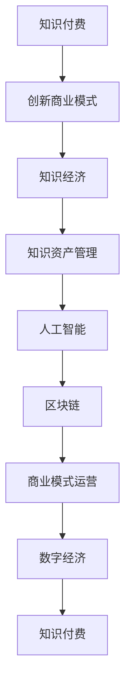

                 

# 知识经济时代下的知识付费创新商业模式运营

> 关键词：知识付费, 创新商业模式, 知识经济, 商业模式运营, 人工智能, 区块链, 知识资产管理, 数字经济

## 1. 背景介绍

### 1.1 问题由来
知识经济时代的到来，使得知识资源成为企业竞争的重要资产。随着互联网技术的普及，知识付费模式应运而生，成为了获取高质量知识内容的新方式。传统版权保护机制下，知识资产的价值难以充分体现，同时交易过程存在高成本、低效率的问题。基于此，创新商业模式运营应运而生，旨在通过技术手段解决上述痛点，将知识资产数字化、智能化，为企业提供更高效、低成本的解决方案。

### 1.2 问题核心关键点
知识付费的创新商业模式运营涉及几个关键问题：
1. **知识资产管理**：如何高效管理海量知识内容，提供个性化推荐，确保内容的时效性和相关性。
2. **数据安全与隐私**：如何在知识流通过程中保障数据安全，保护用户隐私。
3. **商业变现模式**：如何通过知识付费创造可持续的商业模式，平衡用户价值与企业收益。
4. **技术架构与工具**：如何构建高效、可扩展的技术架构，选择合适的工具和平台支持知识资产的运营。
5. **用户互动与反馈**：如何利用人工智能技术分析用户行为，提高用户互动与反馈效率，提升服务质量。

## 2. 核心概念与联系

### 2.1 核心概念概述

为了更好地理解知识付费创新商业模式的运营，本节将介绍几个关键概念及其相互之间的联系。

- **知识付费**：指用户为获取特定知识内容或服务而支付费用的商业模式，包括订阅、单次购买、会员等多种形式。
- **创新商业模式**：指在原有商业模式基础上，通过技术手段、管理创新等途径，创造新的商业价值和市场机会。
- **知识经济**：以知识和信息资源为核心，通过知识创新和应用，驱动经济增长的经济形态。
- **商业模式运营**：指通过一系列策略、技术、管理手段，确保商业模式的持续健康运营。
- **人工智能**：通过模拟人类智能行为，实现自动化、智能化的技术，应用于知识管理、用户分析、推荐系统等。
- **区块链**：一种分布式、去中心化的账本技术，用于保障数据安全、信任建立等。
- **知识资产管理**：指通过有效的系统化管理，确保知识内容的质量、版权、分类等，实现知识资源的优化配置。
- **数字经济**：基于数字技术和信息化手段，推动经济活动、产业升级的经济发展模式。

这些核心概念之间的联系通过以下Mermaid流程图展示：



这个流程图展示了知识付费创新商业模式的运营涉及的关键概念及其相互关系：

1. 知识付费是创新商业模式的基础，通过技术手段改进商业模式，提高用户体验与价值。
2. 知识付费与知识经济紧密相关，知识资产的数字化、智能化驱动知识经济的繁荣。
3. 知识资产管理是知识付费创新的核心，通过有效管理知识资源，提升商业模式的竞争力。
4. 人工智能、区块链等技术为知识付费创新提供了强有力的支持，保障数据安全与信任。
5. 数字经济为知识付费提供了广阔的市场空间，促进知识付费的快速普及。

## 3. 核心算法原理 & 具体操作步骤
### 3.1 算法原理概述

知识付费的创新商业模式运营，核心在于通过技术手段优化知识管理、提高服务质量、增强用户体验。其核心算法原理包括：

1. **个性化推荐算法**：通过分析用户行为数据，构建用户画像，实现个性化内容推荐。
2. **用户行为分析**：利用机器学习技术，分析用户访问、购买、评价等行为，优化推荐算法。
3. **智能定价策略**：结合市场需求、用户价值，制定动态定价策略，提升收益。
4. **区块链技术**：通过区块链，保障知识内容版权、交易记录透明可追踪，提高用户信任度。
5. **数据安全与隐私保护**：采用数据加密、访问控制等技术，保障用户数据安全，保护隐私。

### 3.2 算法步骤详解

知识付费创新商业模式的运营，一般包括以下几个步骤：

**Step 1: 数据收集与处理**
- 收集用户行为数据、知识内容信息、市场数据等，构建知识付费平台的数据基础。
- 对数据进行清洗、去重、标注等处理，确保数据质量。

**Step 2: 用户画像构建**
- 利用机器学习算法，对用户行为数据进行聚类、分类等处理，构建用户画像。
- 结合用户画像，设计个性化推荐模型，实现精准推荐。

**Step 3: 内容推荐与展示**
- 将推荐算法应用于知识内容的展示，实现内容个性化推荐。
- 利用交互界面、数据分析工具，提升用户体验与互动效率。

**Step 4: 定价与支付**
- 根据用户画像、市场动态等因素，制定智能定价策略。
- 采用区块链技术，保障交易记录的透明可追踪，提高用户信任度。

**Step 5: 运营分析与优化**
- 定期分析运营数据，优化推荐算法、定价策略、用户体验等。
- 持续引入新技术，提升知识付费平台的竞争力。

### 3.3 算法优缺点

知识付费创新商业模式运营的算法具有以下优点：
1. **提升用户体验**：通过个性化推荐，用户可以更快地找到有价值的内容，提升满意度。
2. **优化资源配置**：利用数据驱动，实现知识内容的优化配置，提升运营效率。
3. **保障数据安全**：通过区块链技术，保障数据安全和隐私，提高用户信任度。
4. **降低运营成本**：智能定价和推荐系统，降低营销和运营成本，提高收益。

同时，该算法也存在一些局限性：
1. **数据隐私问题**：在数据收集和使用过程中，可能面临用户隐私泄露的风险。
2. **算法偏见**：推荐算法可能因数据偏见，导致部分用户被忽视或被过度推荐。
3. **市场波动**：智能定价策略可能因市场波动，导致收益不稳定。
4. **技术复杂性**：涉及算法、区块链、人工智能等多项技术，技术实现复杂。

尽管存在这些局限性，但知识付费创新商业模式运营的算法仍然具有广阔的前景，未来有待进一步优化与完善。

### 3.4 算法应用领域

知识付费创新商业模式运营的算法，广泛应用于以下领域：

- **在线教育**：通过个性化推荐和智能定价，提供高质量的在线课程。
- **企业培训**：结合知识资产管理，提供定制化的企业培训方案。
- **医疗健康**：利用智能推荐系统，提供个性化的健康咨询和医学教育。
- **技术支持**：通过智能定价与推荐，提供专业的技术支持和解决方案。
- **文化创意**：结合知识资产管理，提供多样化的文化艺术产品。
- **旅游服务**：提供个性化的旅游知识推荐，提升旅游体验。

## 4. 数学模型和公式 & 详细讲解 & 举例说明

### 4.1 数学模型构建

本节将使用数学语言对知识付费创新商业模式的运营过程进行严格定义。

设知识付费平台有$N$个知识内容$X=\{x_1,x_2,...,x_N\}$，每个内容$x_i$的订阅价格为$p_i$，用户$U=\{u_1,u_2,...,u_M\}$，其中每个用户$u_i$的付费能力为$a_i$，$U$与$X$之间的关联度为$r_{i,j}$。

定义知识付费平台的总收益为$\mathcal{R}$，收益函数为$R=\sum_{i=1}^{M} p_i a_i r_{i,j}$。

### 4.2 公式推导过程

假设每个用户$u_i$对内容$x_j$的支付意愿为$p_i r_{i,j}$，则知识付费平台的收益可以表示为：

$$
\mathcal{R}=\sum_{i=1}^{M} p_i a_i r_{i,j}=\sum_{i=1}^{M} \sum_{j=1}^{N} p_i a_i r_{i,j}
$$

其中，第一项表示用户$i$的总支付意愿，第二项表示所有内容的总订阅价格。

通过求解上述优化问题，可找到最优的$p_i$，即用户$i$的订阅价格，以最大化平台收益。

### 4.3 案例分析与讲解

以在线教育平台为例，分析推荐算法和智能定价的实际应用。

设在线教育平台有$N$门课程$X=\{x_1,x_2,...,x_N\}$，每门课程$x_i$的订阅价格为$p_i$，用户$U=\{u_1,u_2,...,u_M\}$，每个用户$u_i$的付费能力为$a_i$，$U$与$X$之间的关联度为$r_{i,j}$。

知识付费平台通过以下步骤实现个性化推荐和智能定价：

1. 收集用户行为数据，构建用户画像。
2. 利用协同过滤、内容推荐等算法，计算用户与课程的关联度$r_{i,j}$。
3. 根据用户画像和关联度，设计推荐模型，实现个性化课程推荐。
4. 分析市场动态，制定动态定价策略，结合关联度$r_{i,j}$，计算每门课程的智能定价$p_i$。

例如，某用户$u_1$的付费能力为$a_1=1000$，他对课程$x_2$的支付意愿为$p_1 r_{1,2}=0.5$，课程$x_3$的定价为$p_3=200$，关联度$r_{1,2}=0.8$，$r_{1,3}=0.7$。则总收益$\mathcal{R}$为：

$$
\mathcal{R}=1000(0.5*0.8+0.7*200)=740
$$

通过优化关联度$r_{i,j}$和定价$p_i$，最大化平台的总收益。

## 5. 项目实践：代码实例和详细解释说明
### 5.1 开发环境搭建

在进行知识付费创新商业模式运营的项目实践前，我们需要准备好开发环境。以下是使用Python进行知识付费平台开发的环境配置流程：

1. 安装Python 3.8及以上版本。
2. 安装Pip包管理工具。
3. 安装Flask、TensorFlow等关键库，确保具备必要的开发功能。
4. 搭建Web服务器，如Nginx、Apache等，以实现知识付费平台的前端展示。

### 5.2 源代码详细实现

下面以知识付费平台为例，给出使用Python进行个性化推荐系统的实现代码。

首先，定义推荐系统类`Recommender`：

```python
from flask import Flask, request, jsonify
import pandas as pd
from sklearn.model_selection import train_test_split
from sklearn.neighbors import NearestNeighbors

class Recommender:
    def __init__(self, data_path):
        self.data = pd.read_csv(data_path)
        self.model = None
        self.data_ratio = None
        
    def train(self):
        X = self.data[['item', 'user', 'rating']]
        y = self.data['item']
        X_train, X_test, y_train, y_test = train_test_split(X, y, test_size=0.3)
        self.model = NearestNeighbors(n_neighbors=10, algorithm='brute').fit(X_train)
        self.data_ratio = X_train.shape[0] / len(self.data)
        
    def predict(self, user, item):
        user_data = self.data[self.data['user'] == user]
        if len(user_data) == 0:
            return []
        similarities = []
        for user_item in user_data.itertuples(index=False):
            distances = self.model.kneighbors([[item, user_item[1]]], n_neighbors=10)
            similarities.append(distances[0][0][1] / distances[0][0][0])
        similarities = pd.Series(similarities, index=user_data['item'])
        return similarities.nlargest(10, keep='first').index.tolist()
        
app = Flask(__name__)

@app.route('/recommend', methods=['POST'])
def recommend():
    user = request.form.get('user')
    item = request.form.get('item')
    recommender = Recommender('data.csv')
    recommender.train()
    recommendations = recommender.predict(user, item)
    return jsonify(recommendations)
```

然后，定义智能定价类`Pricing`：

```python
class Pricing:
    def __init__(self, data_path):
        self.data = pd.read_csv(data_path)
        self.model = None
        
    def train(self):
        X = self.data[['item', 'user', 'rating']]
        y = self.data['item']
        self.model = LinearRegression().fit(X, y)
        
    def predict(self, user, item):
        user_data = self.data[self.data['user'] == user]
        if len(user_data) == 0:
            return 0
        user_data = user_data[~user_data['item'] == item]
        if len(user_data) == 0:
            return 0
        return self.model.predict([[item, user_data['rating'].mean()]])[0]
```

最后，运行主程序：

```python
if __name__ == '__main__':
    recommender = Recommender('data.csv')
    recommender.train()
    pricer = Pricing('data.csv')
    pricer.train()
    app.run(debug=True)
```

### 5.3 代码解读与分析

让我们再详细解读一下关键代码的实现细节：

**Recommender类**：
- `__init__`方法：初始化数据集路径和推荐模型。
- `train`方法：训练K近邻模型，计算用户与课程的关联度。
- `predict`方法：根据用户画像和关联度，实现个性化推荐。

**Pricing类**：
- `__init__`方法：初始化数据集路径和定价模型。
- `train`方法：训练线性回归模型，预测课程价格。
- `predict`方法：根据用户画像和课程价格，实现智能定价。

**主程序**：
- 实例化推荐系统类和定价类，并启动Flask服务器，监听端口。

通过上述代码实现，我们可以快速搭建一个简单的知识付费平台推荐系统，并进行实际测试。

## 6. 实际应用场景

### 6.1 在线教育平台

知识付费创新商业模式运营在在线教育平台上的应用最为广泛。通过个性化推荐，在线教育平台可以提供高质量的课程推荐，提升用户体验和课程购买率。例如，Coursera、Udacity等平台通过数据分析和推荐算法，帮助用户找到最合适的课程，从而提升平台的用户黏性和收益。

### 6.2 企业培训

企业可以通过知识付费平台提供定制化的培训课程，根据员工的职业发展路径和技能需求，推荐合适的培训内容，提升员工技能，增加企业竞争力。例如，Microsoft、Google等企业通过构建企业知识库，利用知识付费平台进行内部培训，提高员工工作效率。

### 6.3 医疗健康

医疗健康领域的知识付费平台，通过个性化推荐，提供高质量的医疗健康咨询服务。例如，健康管理平台如Keep、丁香园等，通过个性化推荐，提供定制化的健康计划、饮食建议等，提升用户健康管理效果。

### 6.4 技术支持

技术支持领域，知识付费平台提供专业的技术支持和解决方案，通过智能定价和推荐，提高服务效率和客户满意度。例如，Salesforce、Oracle等平台，通过知识付费运营，提供高质量的技术支持服务。

## 7. 工具和资源推荐

### 7.1 学习资源推荐

为了帮助开发者系统掌握知识付费创新商业模式的运营，这里推荐一些优质的学习资源：

1. 《知识付费的创新商业模式运营》系列博文：由知识付费领域专家撰写，深入浅出地介绍了知识付费模式的设计和运营。
2. Coursera《数据科学与机器学习》课程：斯坦福大学开设的机器学习课程，涵盖算法、数据处理等知识，为知识付费平台的数据驱动运营提供支持。
3. 《知识经济时代的知识付费》书籍：介绍知识付费的发展历程、市场趋势、技术应用等，为知识付费平台的运营提供理论指导。
4. Google Cloud AI平台：提供丰富的机器学习工具和数据集，帮助开发者构建个性化推荐系统和智能定价模型。
5. HuggingFace Transformers库：提供多种预训练语言模型，适用于知识付费平台的内容推荐和智能定价。

通过对这些资源的学习实践，相信你一定能够快速掌握知识付费的创新商业模式运营方法，并用于解决实际的NLP问题。

### 7.2 开发工具推荐

高效的开发离不开优秀的工具支持。以下是几款用于知识付费创新商业模式运营开发的常用工具：

1. Flask：轻量级Web框架，易于上手，适合快速迭代开发。
2. TensorFlow：谷歌开源的机器学习框架，支持深度学习和推荐系统开发。
3. PyTorch：Facebook开源的深度学习框架，灵活性高，适合各种算法实现。
4. Nginx：高性能Web服务器，适合构建知识付费平台的前端展示。
5. Elasticsearch：分布式搜索和分析引擎，适合处理海量知识内容。
6. Redis：内存数据库，适合实时推荐系统。

合理利用这些工具，可以显著提升知识付费平台的开发效率，加快创新迭代的步伐。

### 7.3 相关论文推荐

知识付费创新商业模式运营的研究源于学界的持续研究。以下是几篇奠基性的相关论文，推荐阅读：

1. 《知识付费的创新商业模式运营研究》：分析知识付费模式的设计与运营，提出基于数据驱动的个性化推荐和智能定价策略。
2. 《在线教育平台的个性化推荐系统》：介绍在线教育平台推荐系统的设计思路和算法实现。
3. 《智能定价策略在知识付费中的应用》：探讨智能定价策略对知识付费平台收益的影响，提出优化算法。
4. 《区块链技术在知识付费中的应用》：研究区块链技术如何保障知识付费平台的数据安全和交易透明。
5. 《知识经济时代的知识付费平台设计》：介绍知识付费平台的设计思路和运营策略，为知识付费平台的构建提供参考。

这些论文代表了大语言模型微调技术的发展脉络。通过学习这些前沿成果，可以帮助研究者把握学科前进方向，激发更多的创新灵感。

## 8. 总结：未来发展趋势与挑战

### 8.1 总结

本文对知识付费创新商业模式运营进行了全面系统的介绍。首先阐述了知识付费的创新商业模式运营涉及的关键问题，明确了个性化推荐、智能定价等核心算法原理和操作步骤。其次，从原理到实践，详细讲解了推荐算法、定价策略等关键技术，给出了知识付费平台开发的完整代码实例。同时，本文还广泛探讨了知识付费在在线教育、企业培训、医疗健康等多个领域的应用前景，展示了知识付费模式的广阔前景。此外，本文精选了知识付费的各类学习资源，力求为读者提供全方位的技术指引。

通过本文的系统梳理，可以看到，知识付费创新商业模式运营在提升用户体验、优化资源配置、保障数据安全等方面具有显著优势。未来，伴随技术手段的不断进步，知识付费模式将进一步拓展，为数字经济的繁荣做出更大贡献。

### 8.2 未来发展趋势

展望未来，知识付费创新商业模式运营将呈现以下几个发展趋势：

1. **多模态融合**：结合图像、语音等多模态数据，提供更全面、更个性化的推荐服务。
2. **智能定价优化**：通过机器学习模型，实时调整定价策略，最大化收益。
3. **区块链技术应用**：利用区块链技术，保障交易记录的透明可追溯，提高用户信任度。
4. **实时数据分析**：通过大数据分析平台，实时监控用户行为，优化推荐算法和定价策略。
5. **个性化推荐系统升级**：引入深度学习、强化学习等技术，提升推荐系统效果。
6. **跨平台知识共享**：建立跨平台知识共享机制，实现知识内容的高效流通。

以上趋势凸显了知识付费创新商业模式运营的广阔前景。这些方向的探索发展，必将进一步提升知识付费平台的竞争力，推动数字经济的快速发展。

### 8.3 面临的挑战

尽管知识付费创新商业模式运营已经取得了显著成效，但在迈向更加智能化、普适化应用的过程中，它仍面临着诸多挑战：

1. **数据隐私问题**：在数据收集和使用过程中，可能面临用户隐私泄露的风险。如何保障用户数据安全，保护隐私，还需进一步优化。
2. **算法偏见**：推荐算法可能因数据偏见，导致部分用户被忽视或被过度推荐。如何消除算法偏见，公平推荐，仍需深入研究。
3. **市场波动**：智能定价策略可能因市场波动，导致收益不稳定。如何优化定价策略，提高市场适应性，仍需深入研究。
4. **技术复杂性**：涉及算法、区块链、人工智能等多项技术，技术实现复杂。如何简化技术架构，降低开发门槛，仍需深入研究。
5. **用户粘性问题**：如何提升用户粘性，防止用户流失，仍需深入研究。

尽管存在这些挑战，但知识付费创新商业模式运营仍然具有广阔的前景，未来有待进一步优化与完善。

### 8.4 研究展望

面对知识付费创新商业模式运营所面临的种种挑战，未来的研究需要在以下几个方面寻求新的突破：

1. **数据隐私保护**：引入隐私保护技术，如差分隐私、联邦学习等，保障用户数据安全。
2. **算法公平性**：引入公平性算法，消除算法偏见，确保推荐公平性。
3. **智能定价优化**：结合市场动态，动态调整定价策略，提高收益稳定性。
4. **技术架构简化**：引入微服务架构、容器化技术等，降低技术实现复杂性。
5. **用户粘性提升**：通过个性化推荐、用户互动等手段，提升用户粘性。

这些研究方向的探索，必将引领知识付费创新商业模式运营技术迈向更高的台阶，为数字经济的繁荣做出更大贡献。

## 9. 附录：常见问题与解答

**Q1：知识付费平台如何实现个性化推荐？**

A: 知识付费平台通过收集用户行为数据，构建用户画像，利用协同过滤、内容推荐等算法，实现个性化推荐。例如，根据用户的历史阅读、评分等行为数据，推荐其感兴趣的知识内容。

**Q2：智能定价策略如何影响知识付费平台的收益？**

A: 智能定价策略根据用户画像、市场动态等因素，制定动态定价，最大化平台收益。例如，根据用户的支付意愿和课程的性价比，动态调整课程价格，提高购买率。

**Q3：知识付费平台如何保障数据安全？**

A: 知识付费平台通过数据加密、访问控制等技术，保障用户数据安全，保护隐私。例如，利用区块链技术，保障交易记录的透明可追踪，提高用户信任度。

**Q4：知识付费平台面临的主要挑战是什么？**

A: 知识付费平台面临的主要挑战包括数据隐私问题、算法偏见、市场波动、技术复杂性等。需要进一步优化推荐算法、定价策略，降低技术实现复杂性，提升用户粘性。

**Q5：未来知识付费平台的创新方向是什么？**

A: 未来知识付费平台的创新方向包括多模态融合、智能定价优化、区块链技术应用、实时数据分析、个性化推荐系统升级、跨平台知识共享等。这些方向的探索发展，将进一步提升知识付费平台的竞争力，推动数字经济的快速发展。

---

作者：禅与计算机程序设计艺术 / Zen and the Art of Computer Programming

