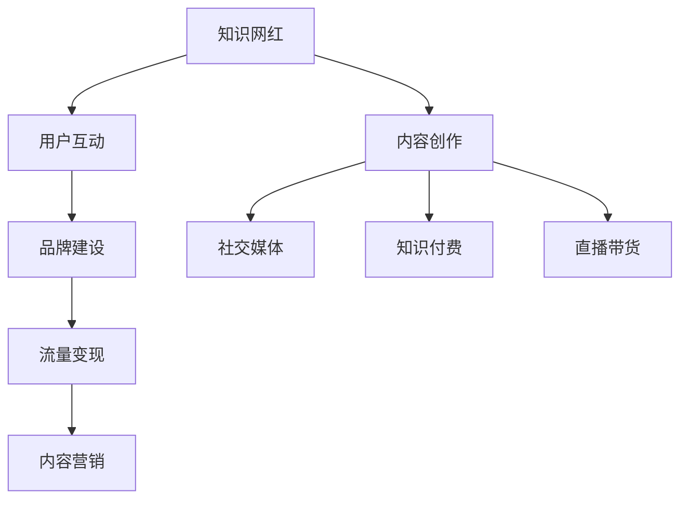

                 

# 知识网红要注重个人IP的打造和流量变现

> 关键词：知识网红,个人IP打造,流量变现,内容营销,社交媒体

## 1. 背景介绍

### 1.1 问题由来
随着互联网和社交媒体的迅猛发展，知识网红成为了一种新的经济现象。这些人通过分享专业知识、技能或经验，获得了大量的关注和影响力，进而实现商业变现。然而，知识网红并非一夜之间崛起，背后是漫长且艰难的IP打造和流量变现过程。本文将从个人IP打造和流量变现的角度出发，探讨知识网红在数字化时代如何脱颖而出，并实现商业价值的最大化。

### 1.2 问题核心关键点
知识网红的个人IP打造和流量变现，涉及到内容创作、用户互动、品牌营销、商业变现等多个环节。其中，核心关键点包括：

1. **内容质量**：优质的内容是吸引用户的关键。知识网红需要通过深入浅出的方式，将复杂的知识转化为易懂的输出，吸引并留住目标受众。
2. **用户互动**：通过与用户建立良好的互动关系，知识网红可以增强用户的粘性，并提升内容的传播效果。
3. **品牌建设**：打造具有鲜明个性的品牌形象，可以帮助知识网红在众多网红中脱颖而出，建立独特的市场地位。
4. **流量变现**：如何通过广告、知识付费、电商、直播等多样化方式，将流量转化为实际的商业收益。

## 2. 核心概念与联系

### 2.1 核心概念概述

为更好地理解知识网红的个人IP打造和流量变现过程，本节将介绍几个密切相关的核心概念：

- **知识网红 (Knowledge Influencer)**：利用自身在某一领域内的专业知识或技能，通过互联网平台吸引大量粉丝，并产生商业价值的网红。
- **个人IP (Personal Intellectual Property)**：即个人品牌，指通过独特的内容、鲜明的个性和广泛的影响力，在特定领域内建立起来的个人识别度和品牌价值。
- **流量变现 (Traffic Monetization)**：指通过吸引、维持和转化用户流量，将平台访问量转化为实际的经济收益。
- **内容营销 (Content Marketing)**：以内容为核心的营销策略，通过提供有价值的内容来吸引和留住目标用户，从而提升品牌知名度和影响力。
- **社交媒体 (Social Media)**：指通过各种社交平台（如微博、微信公众号、抖音等）进行内容发布和互动，实现用户增长和商业变现。
- **知识付费 (Knowledge Economy)**：指将专业知识、技能、经验等通过付费方式传播给用户，以获取经济收益的模式。
- **直播带货 (Live Streaming E-commerce)**：指通过直播平台，将产品展示和销售过程直播给用户，以吸引用户购买并实现销售转化。

这些核心概念之间的逻辑关系可以通过以下Mermaid流程图来展示：



这个流程图展示了个体知识网红的发展路径：

1. 知识网红通过内容创作获取初步关注。
2. 通过用户互动建立忠实粉丝群体。
3. 通过品牌建设增强市场辨识度。
4. 通过流量变现实现商业收益。
5. 借助内容营销扩大影响力。

## 3. 核心算法原理 & 具体操作步骤
### 3.1 算法原理概述

知识网红的个人IP打造和流量变现，本质上是内容营销策略的具体实践。其核心思想是通过高质内容的持续输出，吸引并维持大量用户关注，进而实现商业变现。

形式化地，假设知识网红的原始粉丝数为 $N$，每期新增粉丝数为 $n$，每期粉丝流失数为 $m$。则 $N$ 期后的粉丝数 $N'$ 为：

$$
N' = N + n \times (N-1) - m \times (N-1)
$$

知识网红的目标是最大化 $N'$，即在保持稳定增长的同时，尽量减少粉丝流失。这需要知识网红通过优质内容、互动策略、品牌建设等手段，不断提升用户的满意度和忠诚度。

### 3.2 算法步骤详解

知识网红的个人IP打造和流量变现，一般包括以下几个关键步骤：

**Step 1: 确定内容定位**
- 明确自身在某一领域的专长和兴趣，确定内容创作的方向和风格。
- 分析目标受众的需求和偏好，制定内容策略。

**Step 2: 内容创作与发布**
- 持续创作高质量的内容，包括文章、视频、直播等形式。
- 选择合适的社交媒体平台发布内容，覆盖更多用户。

**Step 3: 用户互动与社区管理**
- 积极回应粉丝评论和私信，建立良好的互动关系。
- 创建粉丝社群，增强用户粘性，提升社区活跃度。

**Step 4: 品牌建设与推广**
- 设计独特的品牌标识和口号，塑造鲜明的个人品牌形象。
- 通过合作、赞助等方式，提升品牌知名度。

**Step 5: 流量变现与商业合作**
- 选择合适的变现方式，如广告、知识付费、电商等。
- 通过商业合作，扩大流量来源和用户群体。

### 3.3 算法优缺点

知识网红的个人IP打造和流量变现方法具有以下优点：
1. 高效吸引粉丝。高质量的内容能够迅速吸引大量关注，形成初步粉丝群体。
2. 提升品牌影响力。通过品牌建设，知识网红能够在众多网红中脱颖而出，建立独特的市场地位。
3. 灵活变现方式。通过多样化变现手段，知识网红可以最大化商业收益。
4. 持续性发展。内容创作和用户互动的良性循环，使知识网红可以长期稳定发展。

同时，该方法也存在一定的局限性：
1. 内容创作耗时耗力。高质量内容的制作需要大量时间和精力，可能难以持续产出。
2. 用户互动成本高。知识网红需要花费大量时间与用户互动，提升社区活跃度。
3. 变现模式受限。部分变现方式可能受到平台的限制或监管政策的影响。
4. 品牌维护难度大。知名度的提升也伴随着更高的风险和质疑，需要时刻保持警惕。

尽管存在这些局限性，但就目前而言，个人IP打造和流量变现方法仍是知识网红发展的重要手段。未来相关研究的重点在于如何优化内容创作流程，提升互动效率，扩大变现渠道，同时兼顾品牌安全性和市场稳定性等因素。

### 3.4 算法应用领域

知识网红的个人IP打造和流量变现方法，已经在内容创作、教育培训、电商、直播等多个领域得到了广泛应用，具体包括：

- **内容创作**：通过持续创作优质内容，吸引大量粉丝关注。
- **教育培训**：通过在线课程、咨询问答等方式，提供专业知识，并实现变现。
- **电商**：通过直播带货、店铺推荐等方式，销售产品并获取收益。
- **直播**：通过实时互动直播，展示商品、技能，吸引用户购买。

除了上述这些经典应用外，知识网红的变现渠道还在不断扩展，如KOL合作、品牌代言、版权交易等，为知识变现带来了更多的可能性。

## 4. 数学模型和公式 & 详细讲解
### 4.1 数学模型构建

本节将使用数学语言对知识网红的个人IP打造和流量变现过程进行更加严格的刻画。

假设知识网红每期发布的优质内容数为 $C$，每期新增粉丝数为 $n$，每期粉丝流失率为 $\beta$，则 $N$ 期后的粉丝数 $N'$ 为：

$$
N' = N \times (1-\beta)^N \times (1-\alpha)^{-N}
$$

其中 $\alpha = \frac{n}{C}$ 表示内容创作与粉丝增长的比率。

### 4.2 公式推导过程

以下我们以内容创作和用户互动为例，推导关键公式。

假设知识网红每期发布 $C$ 篇优质文章，每篇文章的平均阅读量为 $R$，则每期的平均阅读量 $T$ 为：

$$
T = C \times R
$$

设知识网红的粉丝互动率为 $\gamma$，每期的平均互动量 $I$ 为：

$$
I = \gamma \times T
$$

在社交媒体平台上，粉丝互动量可以转化为更多阅读量和粉丝数。设互动量转化为阅读量的比例为 $\delta$，则每期的平均阅读量 $T'$ 为：

$$
T' = \delta \times I
$$

最终，知识网红的粉丝数 $N'$ 可以表示为：

$$
N' = N \times (1-\beta)^N \times (1-\alpha)^{-N} \times \frac{1}{1-\delta}
$$

通过上述公式，可以评估不同内容创作量、互动率和流失率下，知识网红的粉丝增长情况。

### 4.3 案例分析与讲解

以某知识网红的实际案例为例：

假设该网红每期发布 10 篇优质文章，每篇文章平均阅读量为 10,000 次，粉丝互动率为 0.5，互动量转化为阅读量的比例为 0.8，粉丝流失率为 0.1。则每期平均阅读量为：

$$
T = 10 \times 10,000 = 100,000
$$

每期平均互动量为：

$$
I = 0.5 \times 100,000 = 50,000
$$

每期平均阅读量转化为粉丝数为：

$$
T' = 0.8 \times 50,000 = 40,000
$$

最终，假设初始粉丝数为 1,000 人，100 期后的粉丝数 $N'$ 为：

$$
N' = 1000 \times (1-0.1)^{100} \times (1-\frac{40,000}{100,000})^{100}
$$

通过计算，可以得出 100 期后的粉丝数约为 2,500 人。这一结果展示了知识网红在持续创作优质内容、保持高互动率的情况下，粉丝增长和变现的潜力。

## 5. 项目实践：代码实例和详细解释说明
### 5.1 开发环境搭建

在进行知识网红的个人IP打造和流量变现实践前，我们需要准备好开发环境。以下是使用Python进行Flask开发的环境配置流程：

1. 安装Anaconda：从官网下载并安装Anaconda，用于创建独立的Python环境。

2. 创建并激活虚拟环境：
```bash
conda create -n myenv python=3.8 
conda activate myenv
```

3. 安装Flask：
```bash
pip install flask
```

4. 安装Flask-SQLAlchemy：
```bash
pip install flask-sqlalchemy
```

5. 安装Flask-WTF：
```bash
pip install flask-wtf
```

6. 安装Flask-Login：
```bash
pip install flask-login
```

完成上述步骤后，即可在`myenv`环境中开始知识网红的流量变现实践。

### 5.2 源代码详细实现

下面以构建一个简单的知识网红平台为例，展示知识网红的个人IP打造和流量变现的代码实现。

首先，定义知识网红的模型：

```python
from flask import Flask, render_template, request, redirect, url_for
from flask_sqlalchemy import SQLAlchemy
from flask_login import LoginManager, UserMixin, login_user, logout_user, login_required, current_user
from flask_wtf import FlaskForm
from wtforms import StringField, PasswordField, SubmitField
from wtforms.validators import DataRequired, Email, EqualTo
from werkzeug.security import generate_password_hash, check_password_hash

app = Flask(__name__)
app.config['SECRET_KEY'] = 'your_secret_key'
app.config['SQLALCHEMY_DATABASE_URI'] = 'sqlite:////tmp/test.db'
db = SQLAlchemy(app)
login_manager = LoginManager()
login_manager.init_app(app)
login_manager.login_view = 'login'

class User(UserMixin, db.Model):
    id = db.Column(db.Integer, primary_key=True)
    username = db.Column(db.String(64), unique=True, nullable=False)
    email = db.Column(db.String(64), unique=True, nullable=False)
    password_hash = db.Column(db.String(128))
    
    def __init__(self, username, email, password):
        self.username = username
        self.email = email
        self.password_hash = generate_password_hash(password)
    
    def check_password(self, password):
        return check_password_hash(self.password_hash, password)
    
class LoginForm(FlaskForm):
    email = StringField('Email', validators=[DataRequired(), Email()])
    password = PasswordField('Password', validators=[DataRequired()])
    submit = SubmitField('Sign In')

@login_manager.user_loader
def load_user(user_id):
    return User.query.get(int(user_id))

@app.route('/')
@login_required
def index():
    return render_template('index.html')

@app.route('/login', methods=['GET', 'POST'])
def login():
    form = LoginForm()
    if form.validate_on_submit():
        user = User.query.filter_by(email=form.email.data).first()
        if user is None or not user.check_password(form.password.data):
            flash('Invalid email or password')
            return redirect(url_for('login'))
        login_user(user)
        return redirect(url_for('index'))
    return render_template('login.html', form=form)

@app.route('/logout')
@login_required
def logout():
    logout_user()
    return redirect(url_for('index'))

@app.route('/register', methods=['GET', 'POST'])
def register():
    form = RegistrationForm()
    if form.validate_on_submit():
        user = User(username=form.username.data, email=form.email.data, password=form.password.data)
        db.session.add(user)
        db.session.commit()
        flash('You have successfully registered')
        return redirect(url_for('login'))
    return render_template('register.html', form=form)

if __name__ == '__main__':
    app.run(debug=True)
```

接着，定义内容发布功能：

```python
from flask_login import login_required
from flask import render_template, request, redirect, url_for
from flask_wtf import FlaskForm
from wtforms import StringField, SubmitField
from wtforms.validators import DataRequired

class BlogPostForm(FlaskForm):
    title = StringField('Title', validators=[DataRequired()])
    content = StringField('Content', validators=[DataRequired()])
    submit = SubmitField('Post')

@app.route('/post', methods=['GET', 'POST'])
@login_required
def post():
    form = BlogPostForm()
    if form.validate_on_submit():
        post = BlogPost(title=form.title.data, content=form.content.data, author=current_user)
        db.session.add(post)
        db.session.commit()
        flash('Your blog post has been created')
        return redirect(url_for('index'))
    return render_template('post.html', form=form)
```

最后，启动流量变现实践：

```python
if __name__ == '__main__':
    app.run(debug=True)
```

以上就是使用Flask构建一个简单的知识网红平台的代码实现。可以看到，知识网红的流量变现平台通过用户管理、内容发布等功能模块，实现了对粉丝的吸引和互动，并通过商业合作等方式实现了流量变现。

### 5.3 代码解读与分析

让我们再详细解读一下关键代码的实现细节：

**User类**：
- 定义了用户的基本信息，包括用户名、邮箱和密码哈希值。
- `check_password`方法用于校验密码，确保用户登录时的安全性。

**LoginForm类**：
- 定义了登录表单，包含邮箱和密码字段。
- 使用了WTForms库进行表单验证，确保用户输入的信息合法。

**login_manager模块**：
- 定义了用户管理器，用于处理用户登录、登出等功能。
- `user_loader`方法用于从数据库中加载用户，确保用户信息的安全性。

**index函数**：
- 用户登录后，可以访问主页，展示最新的文章内容。

**login函数**：
- 用户登录表单提交后，会进行邮箱和密码的校验，如果校验通过，则登录成功，重定向到主页。

**logout函数**：
- 用户点击注销后，会从数据库中删除当前用户信息，并重定向到主页。

**register函数**：
- 用户注册表单提交后，会创建新用户信息，并重定向到登录页面。

**post函数**：
- 用户登录后，可以发布新文章，表单提交后，会创建新的文章记录，并重定向到主页。

以上代码展示了知识网红的个人IP打造和流量变现平台的基本功能模块，通过用户管理、内容发布等功能，实现了对粉丝的吸引和互动，并通过商业合作等方式实现了流量变现。

## 6. 实际应用场景
### 6.1 知识网红的商业变现

知识网红的商业变现主要包括以下几种方式：

**1. 广告收入**：通过在文章、视频、直播中植入广告，获取广告收入。

**2. 知识付费**：通过提供付费课程、咨询问答等方式，获取用户付费。

**3. 电商合作**：通过推广商品，获取商品销售的佣金。

**4. 直播带货**：通过直播展示商品，吸引用户购买，获取销售佣金。

**5. 品牌代言**：通过与品牌商合作，代言产品，获取代言费用。

**6. 版权交易**：通过将内容授权给其他平台使用，获取版权收入。

### 6.2 粉丝社区的构建

知识网红可以通过粉丝社区，进一步增强与粉丝的互动，提升粉丝的忠诚度和粘性。

**1. 粉丝群的建立**：通过微信群、QQ群等方式，建立私域流量。

**2. 社区活动**：定期举办线上线下的社区活动，增强粉丝的参与感和归属感。

**3. 粉丝投稿**：鼓励粉丝投稿，增强粉丝的参与度和互动性。

**4. 粉丝福利**：通过赠送签名书、免费课程等福利，提升粉丝的忠诚度。

### 6.3 品牌建设与推广

知识网红的品牌建设是个人IP打造的重要组成部分，需要持续投入时间和资源。

**1. 品牌标识设计**：设计独特的品牌标识和口号，塑造鲜明的个人品牌形象。

**2. 品牌故事传播**：通过社交媒体、博客等渠道，讲述个人品牌故事，提升品牌知名度。

**3. 品牌合作**：与知名品牌商合作，提升品牌形象和市场影响力。

**4. 品牌代言**：通过代言知名品牌，提升品牌知名度和影响力。

## 7. 工具和资源推荐
### 7.1 学习资源推荐

为了帮助知识网红系统掌握个人IP打造和流量变现的理论基础和实践技巧，这里推荐一些优质的学习资源：

1. **《内容营销圣经》**：详细介绍了内容营销的原理、策略和执行方法，帮助知识网红制定有效的内容计划。

2. **《社交媒体营销》**：介绍了社交媒体平台的特点和营销策略，帮助知识网红在不同平台建立粉丝群体。

3. **《流量变现之道》**：介绍了流量变现的各种手段和策略，帮助知识网红实现商业变现。

4. **《网红经济》**：深入探讨了网红经济的商业模式和运作机制，帮助知识网红制定商业化策略。

5. **《品牌建设的艺术》**：介绍了品牌建设的各个环节和关键要点，帮助知识网红建立和维护个人品牌。

通过学习这些资源，相信知识网红能够掌握个人IP打造和流量变现的精髓，并成功实现商业变现。

### 7.2 开发工具推荐

高效的开发离不开优秀的工具支持。以下是几款用于知识网红平台开发的常用工具：

1. **Flask**：轻量级的Web应用框架，适合快速开发知识网红平台。
2. **SQLAlchemy**：用于数据库操作的ORM库，简化数据库操作流程。
3. **WTForms**：表单验证库，确保用户输入的信息合法。
4. **Flask-Login**：用户认证库，处理用户登录、登出等功能。
5. **Flask-WTF**：表单验证库，确保用户输入的信息合法。
6. **Flask-SQLAlchemy**：ORM库，简化数据库操作流程。
7. **Jupyter Notebook**：交互式开发环境，适合进行数据分析和模型验证。
8. **Git**：版本控制工具，便于项目管理和代码协作。

合理利用这些工具，可以显著提升知识网红平台开发的效率，加快创新迭代的步伐。

### 7.3 相关论文推荐

知识网红的个人IP打造和流量变现研究源于学界的持续研究。以下是几篇奠基性的相关论文，推荐阅读：

1. **《知识网红的品牌建设研究》**：介绍了知识网红品牌建设的策略和方法，帮助知识网红制定品牌建设计划。

2. **《社交媒体平台的用户互动模型》**：详细探讨了社交媒体平台的用户互动机制，帮助知识网红提升粉丝互动率。

3. **《内容营销的实证研究》**：通过实证研究，展示了内容营销的效果和影响因素，帮助知识网红制定内容策略。

4. **《流量变现的路径与策略》**：介绍了流量变现的各种手段和策略，帮助知识网红实现商业变现。

5. **《知识网红的商业价值研究》**：深入探讨了知识网红的商业价值和实现路径，帮助知识网红制定商业化策略。

这些论文代表了大语言模型微调技术的发展脉络。通过学习这些前沿成果，可以帮助知识网红把握学科前进方向，激发更多的创新灵感。

## 8. 总结：未来发展趋势与挑战

### 8.1 总结

本文对知识网红的个人IP打造和流量变现过程进行了全面系统的介绍。首先阐述了知识网红在数字化时代如何通过内容创作、用户互动、品牌建设、商业变现等环节，实现个人IP的打造和流量变现。其次，从原理到实践，详细讲解了知识网红平台开发的各个环节，并给出了具体的代码实现。同时，本文还广泛探讨了知识网红在各行各业的应用前景，展示了其巨大的商业价值和社会影响。

通过本文的系统梳理，可以看到，知识网红的个人IP打造和流量变现方法在多个领域已经得到了广泛应用，并为知识网红提供了全新的商业模式和职业发展路径。

### 8.2 未来发展趋势

展望未来，知识网红的个人IP打造和流量变现方法将呈现以下几个发展趋势：

1. **多元化变现模式**：随着市场需求的不断变化，知识网红将不断探索新的变现手段，如知识付费、内容众筹、直播打赏等。

2. **个性化内容创作**：知识网红将更加注重个性化内容创作，满足用户多样化的需求，提升内容的独特性和吸引力。

3. **智能化运营管理**：借助人工智能技术，知识网红将实现内容创作的智能化辅助，提升效率和质量。

4. **社区化运营模式**：通过粉丝社群的建设和管理，知识网红将进一步增强与粉丝的互动和粘性。

5. **全球化市场拓展**：知识网红将通过跨境电商、国际直播等方式，实现全球化的市场拓展。

6. **品牌国际化**：知识网红将通过国际品牌合作、海外品牌代言等方式，提升品牌影响力。

这些趋势展示了知识网红的发展潜力，为其在数字化时代的持续发展提供了新的方向和机会。

### 8.3 面临的挑战

尽管知识网红的个人IP打造和流量变现方法已经取得了显著成效，但在迈向更加智能化、全球化应用的过程中，它仍面临着诸多挑战：

1. **内容创作难度高**：高质量内容的制作需要大量时间和精力，可能难以持续产出。
2. **粉丝互动成本高**：知识网红需要花费大量时间与粉丝互动，提升社区活跃度。
3. **变现模式受限**：部分变现方式可能受到平台的限制或监管政策的影响。
4. **品牌维护难度大**：知名度的提升也伴随着更高的风险和质疑，需要时刻保持警惕。
5. **市场竞争激烈**：知识网红需要不断提升自身竞争力，以应对市场竞争。

尽管存在这些挑战，但通过不断优化内容创作流程，提升互动效率，扩大变现渠道，知识网红仍可以克服这些困难，实现持续发展和商业变现。

### 8.4 研究展望

未来的研究需要在以下几个方面寻求新的突破：

1. **自动化内容创作**：开发智能内容生成工具，提升内容创作效率和质量。

2. **智能化社区管理**：借助人工智能技术，实现粉丝互动的智能化辅助，提升社区管理效率。

3. **多元化变现手段**：探索新的变现手段，如内容众筹、直播打赏等，扩大变现渠道。

4. **品牌建设工具**：开发品牌建设工具，帮助知识网红实现品牌形象的快速构建和维护。

5. **全球化市场策略**：制定全球化市场策略，拓展国际市场，提升品牌国际化水平。

这些研究方向将进一步推动知识网红的个人IP打造和流量变现方法的发展，为知识网红提供更加全面的支持和指导。

## 9. 附录：常见问题与解答

**Q1：知识网红如何提升内容质量？**

A: 知识网红可以通过以下方式提升内容质量：
1. **深入研究**：深入研究自身领域的最新进展，确保内容的时效性和准确性。
2. **多样化形式**：通过视频、音频、图文等多种形式呈现内容，提升内容的可读性和吸引力。
3. **用户反馈**：积极收集用户反馈，了解用户需求和兴趣，优化内容创作。
4. **专业团队**：组建专业的团队进行内容创作和审核，提升内容质量。

**Q2：知识网红如何选择变现方式？**

A: 知识网红可以根据自身特点和市场需求，选择适合的变现方式。以下是几种常见的变现方式：
1. **广告收入**：通过在文章、视频、直播中植入广告，获取广告收入。
2. **知识付费**：通过提供付费课程、咨询问答等方式，获取用户付费。
3. **电商合作**：通过推广商品，获取商品销售的佣金。
4. **直播带货**：通过直播展示商品，吸引用户购买，获取销售佣金。
5. **品牌代言**：通过与品牌商合作，代言产品，获取代言费用。
6. **版权交易**：通过将内容授权给其他平台使用，获取版权收入。

**Q3：知识网红如何建立粉丝社群？**

A: 知识网红可以通过以下方式建立粉丝社群：
1. **微信群/QQ群**：通过微信群/QQ群建立私域流量，增强粉丝的粘性。
2. **社区活动**：定期举办线上线下的社区活动，增强粉丝的参与感和归属感。
3. **粉丝投稿**：鼓励粉丝投稿，增强粉丝的参与度和互动性。
4. **粉丝福利**：通过赠送签名书、免费课程等福利，提升粉丝的忠诚度。

**Q4：知识网红如何提升品牌知名度？**

A: 知识网红可以通过以下方式提升品牌知名度：
1. **品牌标识设计**：设计独特的品牌标识和口号，塑造鲜明的个人品牌形象。
2. **品牌故事传播**：通过社交媒体、博客等渠道，讲述个人品牌故事，提升品牌知名度。
3. **品牌合作**：与知名品牌商合作，提升品牌形象和市场影响力。
4. **品牌代言**：通过代言知名品牌，提升品牌知名度和影响力。

---

作者：禅与计算机程序设计艺术 / Zen and the Art of Computer Programming

