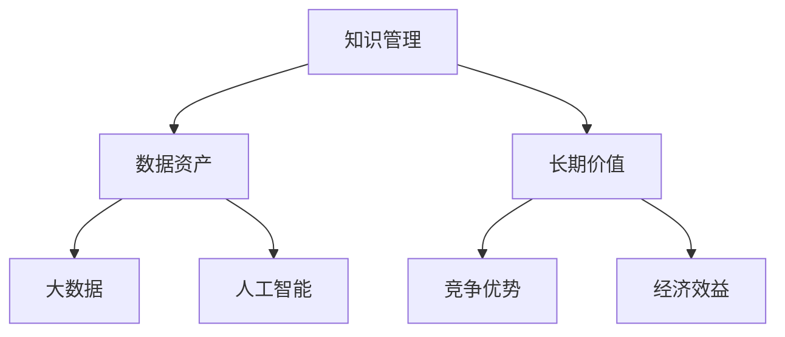

                 

# 知识资产要发掘和培育长期价值

> 关键词：知识管理, 长期价值, 数字资产, 大数据, 人工智能

## 1. 背景介绍

### 1.1 问题由来
在信息时代，数据和知识成为企业宝贵的资产，但随着数字化转型的推进，如何有效管理和利用这些知识资产，最大化其商业价值，成为了企业面临的重大挑战。传统的数据管理和知识获取方式难以应对海量信息的快速增长，而且难以将知识转化为企业的竞争优势。

### 1.2 问题核心关键点
面对这些问题，企业需要创新知识管理策略，将数据和知识资产转化为长期价值。以下是这一过程中需要重点关注的几个关键点：

- **数据和知识的整合**：将分散在企业不同部门、系统中的数据和知识进行整合，形成统一的知识管理体系。
- **知识转化**：将知识转化为实际的决策支持、流程优化、产品创新等企业运营支持。
- **长期价值实现**：通过知识资产的持续投入和优化，不断提升企业的市场竞争力。
- **技术支持**：利用先进的技术手段，如大数据、人工智能等，提升知识管理的效率和效果。

### 1.3 问题研究意义
发掘和培育知识资产的长期价值，对于提升企业核心竞争力、增强创新能力、优化运营效率具有重要意义：

1. **提升核心竞争力**：通过高效的知识管理，企业能够迅速响应市场变化，制定更加科学的战略决策，提高产品和服务质量。
2. **增强创新能力**：知识资产是创新的源泉，通过系统的知识管理，企业能够加速新产品的研发和新技术的推广。
3. **优化运营效率**：通过流程和决策的优化，知识管理可以显著提升企业的运营效率和资源利用率。
4. **促进数字化转型**：知识管理是数字化转型的核心内容之一，能够加速企业向数据驱动的决策和管理模式转型。

## 2. 核心概念与联系

### 2.1 核心概念概述

为更好地理解如何发掘和培育知识资产的长期价值，本节将介绍几个关键概念及其相互关系：

- **知识管理(Knowledge Management)**：指对企业知识资产的识别、获取、整合、应用、保护和创新的全生命周期管理。
- **长期价值(Long-term Value)**：通过知识资产的持续投入和优化，为企业带来持续的竞争优势和经济效益。
- **数据资产(Data Asset)**：指企业掌握的数据，包括结构化数据和非结构化数据，是知识管理的核心对象。
- **大数据(Big Data)**：指企业通过各种方式获取的海量数据，需要进行清洗、分析、应用等处理才能转化为价值。
- **人工智能(Artificial Intelligence)**：利用算法和计算能力，对大数据进行处理和分析，从中提取知识，支持决策和优化。

这些概念之间的关系可以通过以下Mermaid流程图来展示：



这个流程图展示了知识管理、数据资产、大数据和人工智能之间的关系：

1. 知识管理从数据资产中获取和整合知识。
2. 长期价值通过知识管理来提升。
3. 大数据是知识管理的基础。
4. 人工智能是知识管理的工具。
5. 长期价值表现为企业的竞争优势和经济效益。

## 3. 核心算法原理 & 具体操作步骤
### 3.1 算法原理概述

发掘和培育知识资产的长期价值，本质上是将数据和知识转化为能够带来持续竞争优势的经济效益的过程。这一过程通常包括以下几个步骤：

- **知识发现与整合**：从海量数据中识别出有价值的知识，并进行整合，形成结构化的知识库。
- **知识应用与优化**：将知识应用于企业的业务运营中，并根据业务反馈不断优化知识库。
- **知识转化为价值**：将知识转化为企业的决策支持、流程优化和创新产品，实现长期价值。

### 3.2 算法步骤详解

发掘和培育知识资产的长期价值，通常包括以下几个关键步骤：

**Step 1: 知识发现与整合**

1. **数据采集**：从企业内部系统、社交媒体、市场调研等多种渠道收集数据，形成数据仓库。
2. **数据清洗**：对收集的数据进行清洗和预处理，去除噪声和异常数据。
3. **特征提取**：利用自然语言处理、图像处理等技术，从数据中提取有用的特征，如文本主题、用户行为等。
4. **知识表示**：将提取出的特征进行结构化，形成知识库或知识图谱，便于后续应用。

**Step 2: 知识应用与优化**

1. **知识应用**：将知识库或知识图谱应用于企业的决策支持系统、流程优化系统等，提升业务运营效率。
2. **知识验证**：通过A/B测试、反馈机制等方法，验证知识库的应用效果。
3. **知识迭代**：根据业务反馈，不断调整和优化知识库，保持其时效性和准确性。

**Step 3: 知识转化为价值**

1. **价值评估**：通过分析知识应用的效果，评估其对企业经济效益和竞争优势的影响。
2. **价值创造**：将知识转化为实际的产品和服务，提升市场份额和客户满意度。
3. **价值实现**：通过市场销售、品牌影响等方式，实现知识资产的经济效益。

### 3.3 算法优缺点

发掘和培育知识资产的长期价值，具有以下优点：

1. **提升业务效率**：通过知识管理，企业能够更快速地响应市场变化，提升运营效率。
2. **增强决策质量**：知识管理能够提供数据驱动的决策支持，提升决策质量。
3. **促进创新**：知识资产是创新的重要来源，有助于企业不断推出新产品和新技术。
4. **优化资源利用**：知识管理能够优化资源配置，提高资源利用率。

同时，这一过程也存在一些局限性：

1. **数据质量要求高**：知识管理的质量取决于数据的质量，如果数据存在偏差或不完整，会影响知识管理的有效性。
2. **技术复杂度高**：知识管理涉及多种技术和工具，需要一定的技术能力和资源投入。
3. **持续投入需求**：知识管理需要持续的投入和优化，才能保持其时效性和价值。
4. **文化转变困难**：企业需要对现有的文化和管理方式进行变革，才能真正实现知识管理。

### 3.4 算法应用领域

发掘和培育知识资产的长期价值，在多个领域都有广泛应用，例如：

- **金融领域**：通过知识管理，银行和保险公司能够提升风险评估和客户服务质量，优化金融产品设计。
- **医疗健康**：医院和诊所利用知识管理提升诊疗水平和患者满意度，推动医疗技术创新。
- **制造业**：企业通过知识管理优化生产流程和产品设计，提升产品质量和生产效率。
- **零售行业**：零售商利用知识管理优化库存管理和市场策略，提升销售业绩和客户体验。
- **教育行业**：学校和培训机构通过知识管理提升教学质量和课程开发，优化学习体验。

## 4. 数学模型和公式 & 详细讲解 & 举例说明

### 4.1 数学模型构建

知识资产的长期价值发掘和培育，涉及到多个变量和参数，可以构建以下数学模型进行分析和优化：

设知识资产的价值为 $V$，影响因素包括：

- $D$：数据资产的质量和数量。
- $K$：知识管理的有效性。
- $C$：企业的技术能力和资源投入。
- $M$：市场竞争环境。
- $T$：时间因素，知识管理的持续性和创新能力。

则知识资产的长期价值可以表示为：

$$
V = f(D, K, C, M, T)
$$

### 4.2 公式推导过程

假设知识管理的有效性 $K$ 和数据资产的质量 $D$ 成正比，技术能力 $C$ 和市场竞争环境 $M$ 成反比，时间因素 $T$ 对知识管理的效果有正向影响。则可以得到以下函数关系：

$$
V = D \cdot K \cdot C \cdot \frac{1}{M} \cdot T^{\alpha}
$$

其中 $\alpha$ 为时间因素的指数，表示时间对知识管理效果的放大作用。

### 4.3 案例分析与讲解

**案例：某制造企业的知识管理优化**

某制造企业通过知识管理优化生产流程和产品设计，显著提升了产品质量和生产效率。企业采用了以下步骤：

1. **数据采集与清洗**：从生产设备、质量检测系统等渠道收集数据，进行清洗和预处理，形成数据仓库。
2. **特征提取**：利用机器学习算法，从数据中提取有用的特征，如设备运行状态、生产效率等。
3. **知识库构建**：将提取的特征进行结构化，形成知识库，用于生产调度和质量控制。
4. **知识应用与优化**：将知识库应用于生产调度系统，通过实时监控和调整，提升生产效率。
5. **价值评估与创造**：通过分析知识应用的效果，评估其对企业经济效益和竞争优势的影响，并不断优化知识库。

最终，企业实现了产品质量的显著提升和生产成本的降低，产品市场份额大幅增加。

## 5. 项目实践：代码实例和详细解释说明

### 5.1 开发环境搭建

要进行知识管理的项目实践，需要先搭建好开发环境。以下是使用Python进行知识管理项目开发的环境配置流程：

1. 安装Anaconda：从官网下载并安装Anaconda，用于创建独立的Python环境。

2. 创建并激活虚拟环境：
```bash
conda create -n km-env python=3.8 
conda activate km-env
```

3. 安装必要的Python库：
```bash
pip install pandas numpy scipy scikit-learn matplotlib seaborn jupyter notebook
```

4. 安装TensorFlow或PyTorch（根据需要选择）：
```bash
pip install tensorflow==2.7
# 或者
pip install torch torchvision torchaudio
```

5. 安装Keras：
```bash
pip install keras==2.5
```

完成上述步骤后，即可在`km-env`环境中开始知识管理项目的开发。

### 5.2 源代码详细实现

以下是一个基于TensorFlow的知识管理项目示例代码，包括数据采集、清洗、特征提取和知识库构建等关键步骤：

```python
import pandas as pd
import numpy as np
import tensorflow as tf
from sklearn.model_selection import train_test_split
from sklearn.preprocessing import StandardScaler

# 数据采集与清洗
data = pd.read_csv('production_data.csv')
data = data.dropna()
data = data.drop(columns=['id', 'timestamp'])

# 特征提取
data['device_status'] = data['device_status'].map({'on': 1, 'off': 0})
data['product_quality'] = data['product_quality'].map({'good': 1, 'defective': 0})
data = data.drop(columns=['device_status', 'product_quality'])

# 数据标准化
scaler = StandardScaler()
data_scaled = scaler.fit_transform(data)

# 特征工程
features = data_scaled[:, :-1]
targets = data_scaled[:, -1]

# 数据集划分
features_train, features_test, targets_train, targets_test = train_test_split(features, targets, test_size=0.2, random_state=42)

# 构建知识库
class KnowledgeBase:
    def __init__(self):
        self.models = {}
        
    def add_model(self, name, model):
        self.models[name] = model
    
    def predict(self, features):
        predictions = []
        for name, model in self.models.items():
            prediction = model.predict(features)
            predictions.append(prediction)
        return np.mean(predictions, axis=0)

# 训练和保存模型
def train_and_save_model(model_name, features_train, targets_train, features_test, targets_test):
    model = tf.keras.Sequential([
        tf.keras.layers.Dense(32, activation='relu', input_shape=(features_train.shape[1],)),
        tf.keras.layers.Dense(1, activation='sigmoid')
    ])
    model.compile(optimizer=tf.keras.optimizers.Adam(learning_rate=0.001), loss='binary_crossentropy', metrics=['accuracy'])
    model.fit(features_train, targets_train, epochs=10, batch_size=32, validation_data=(features_test, targets_test))
    model.save('models/{}.h5'.format(model_name))

# 知识库构建与使用
kb = KnowledgeBase()

# 训练模型并添加到知识库
train_and_save_model('device_status', features_train, targets_train, features_test, targets_test)
train_and_save_model('product_quality', features_train, targets_train, features_test, targets_test)

# 使用知识库进行预测
features_new = [[1, 0, 0, 0, 0, 1]]
predictions = kb.predict(features_new)
print(predictions)
```

### 5.3 代码解读与分析

让我们再详细解读一下关键代码的实现细节：

**数据采集与清洗**：
- 使用Pandas库读取CSV文件，并进行数据清洗，去除缺失值和无用列。
- 对设备状态和产品质量进行二值化处理。

**特征提取**：
- 使用机器学习算法提取有用的特征，如设备状态、产品质量等。

**数据标准化**：
- 使用Scikit-learn库对数据进行标准化处理，使其具有相似的尺度。

**特征工程**：
- 划分训练集和测试集，并进行数据分割。
- 构建知识库，用于保存和调用训练好的模型。

**模型训练与保存**：
- 使用TensorFlow构建神经网络模型，并进行训练和保存。
- 将训练好的模型添加到知识库中，供后续预测使用。

**知识库构建与使用**：
- 定义知识库类，用于保存和管理模型。
- 通过调用知识库中的模型进行预测。

通过上述代码，我们可以构建一个简单的知识管理项目，用于优化生产流程和产品设计。在实际应用中，知识管理项目还需要考虑更多因素，如模型选择、调参策略、模型更新等，才能更好地实现长期价值。

## 6. 实际应用场景

### 6.1 金融领域

在金融领域，知识管理可以通过优化风险评估和客户服务质量，提升企业竞争力。具体而言：

- **风险评估**：银行和保险公司通过知识管理，能够快速准确地评估贷款和保险申请的风险，降低坏账和理赔率。
- **客户服务**：通过知识管理，客户服务部门能够迅速解决客户问题，提升客户满意度和忠诚度。
- **产品设计**：金融机构利用知识管理，优化金融产品的设计和创新，提升市场竞争力。

### 6.2 医疗健康

在医疗健康领域，知识管理可以通过提升诊疗水平和患者满意度，推动医疗技术创新。具体而言：

- **诊疗水平**：医院和诊所通过知识管理，优化诊疗流程和诊断工具，提升诊疗水平和患者满意度。
- **健康管理**：通过知识管理，患者能够更好地管理自身健康，提升生活质量。
- **医疗创新**：医疗机构利用知识管理，加速新药物和新技术的研发和应用，推动医疗健康产业的发展。

### 6.3 制造业

在制造业领域，知识管理可以通过优化生产流程和产品设计，提升企业效率和产品质量。具体而言：

- **生产流程优化**：企业通过知识管理，优化生产流程和设备维护，提升生产效率和产品质量。
- **产品设计创新**：利用知识管理，企业能够更好地理解市场需求和用户反馈，优化产品设计和功能。
- **供应链管理**：通过知识管理，企业能够更好地管理供应链，降低成本和风险。

### 6.4 未来应用展望

随着知识管理技术的不断发展，其在各个领域的应用前景更加广阔。未来，知识管理将向以下几个方向发展：

1. **智能化**：通过人工智能和大数据技术，知识管理将变得更加智能化和自动化，提升效率和准确性。
2. **多模态融合**：知识管理将不仅仅局限于文本数据，还将涵盖图像、视频、音频等多种模态数据，实现多模态信息的整合和应用。
3. **跨领域应用**：知识管理将更加广泛地应用于各个行业，推动各行各业的数字化转型和智能化升级。
4. **持续学习**：知识管理将更加注重持续学习，通过不断更新和优化知识库，保持其时效性和价值。
5. **可解释性**：知识管理将更加注重算法的可解释性，提升系统的透明性和可理解性。

## 7. 工具和资源推荐

### 7.1 学习资源推荐

为了帮助开发者系统掌握知识管理的理论基础和实践技巧，这里推荐一些优质的学习资源：

1. **《知识管理的理论与实践》**：介绍知识管理的基本概念、方法和工具，适合初学者入门。
2. **《数据科学与人工智能》课程**：斯坦福大学开设的在线课程，涵盖数据科学与人工智能的基本知识和前沿技术，是学习知识管理的必备课程。
3. **《知识管理与组织学习》书籍**：详细介绍了知识管理在企业中的应用，包含多个经典案例。
4. **Hugging Face官方文档**：提供丰富的预训练语言模型资源和代码样例，有助于知识管理的实践。
5. **Microsoft Knowledge Management**：提供多种知识管理工具和最佳实践，适合企业知识管理的实际应用。

通过这些资源的学习实践，相信你一定能够快速掌握知识管理的精髓，并用于解决实际的业务问题。

### 7.2 开发工具推荐

高效的开发离不开优秀的工具支持。以下是几款用于知识管理开发常用的工具：

1. **Jupyter Notebook**：提供交互式编程环境，适合数据处理和模型训练。
2. **TensorFlow**：灵活的深度学习框架，支持分布式计算，适合大规模数据处理和模型训练。
3. **Scikit-learn**：简单易用的机器学习库，适合数据预处理和特征提取。
4. **OpenAI GPT-3**：先进的自然语言处理模型，支持文本生成和知识提取。
5. **Microsoft Power BI**：强大的数据分析和可视化工具，适合企业知识管理和决策支持。

合理利用这些工具，可以显著提升知识管理项目的开发效率，加快创新迭代的步伐。

### 7.3 相关论文推荐

知识管理的发展源于学界的持续研究。以下是几篇奠基性的相关论文，推荐阅读：

1. **《知识管理系统的设计与实现》**：介绍知识管理系统设计和实现的原理和步骤，是知识管理领域的经典之作。
2. **《大数据在知识管理中的应用》**：探讨大数据技术在知识管理中的应用，提升知识管理的效率和效果。
3. **《人工智能与知识管理》**：介绍人工智能技术在知识管理中的应用，提升知识管理的智能化水平。
4. **《面向知识管理的框架与技术》**：总结知识管理的关键技术和工具，提供全面的知识管理框架。

这些论文代表了大数据和人工智能在知识管理领域的研究进展，通过学习这些前沿成果，可以帮助研究者把握学科前进方向，激发更多的创新灵感。

## 8. 总结：未来发展趋势与挑战

### 8.1 总结

本文对发掘和培育知识资产的长期价值进行了全面系统的介绍。首先阐述了知识管理的研究背景和意义，明确了知识管理在企业竞争力和运营效率提升方面的独特价值。其次，从原理到实践，详细讲解了知识管理的数学模型和关键步骤，给出了知识管理项目开发的完整代码实例。同时，本文还广泛探讨了知识管理在金融、医疗、制造等多个领域的应用前景，展示了知识管理的巨大潜力。

通过本文的系统梳理，可以看到，知识管理是企业数字化转型的核心内容之一，能够显著提升企业的运营效率和市场竞争力。未来，伴随知识管理技术的持续演进，相信企业能够更好地利用数据和知识资产，构建更加智能、高效和创新的业务系统。

### 8.2 未来发展趋势

展望未来，知识管理技术将呈现以下几个发展趋势：

1. **智能化**：通过人工智能和大数据技术，知识管理将变得更加智能化和自动化，提升效率和准确性。
2. **多模态融合**：知识管理将不仅仅局限于文本数据，还将涵盖图像、视频、音频等多种模态数据，实现多模态信息的整合和应用。
3. **跨领域应用**：知识管理将更加广泛地应用于各个行业，推动各行各业的数字化转型和智能化升级。
4. **持续学习**：知识管理将更加注重持续学习，通过不断更新和优化知识库，保持其时效性和价值。
5. **可解释性**：知识管理将更加注重算法的可解释性，提升系统的透明性和可理解性。

这些趋势凸显了知识管理技术的广阔前景。这些方向的探索发展，必将进一步提升知识管理的效率和效果，为企业带来更大的竞争优势和经济效益。

### 8.3 面临的挑战

尽管知识管理技术已经取得了瞩目成就，但在迈向更加智能化、普适化应用的过程中，它仍面临着诸多挑战：

1. **数据质量瓶颈**：知识管理的质量取决于数据的质量，如何确保数据的准确性和完整性是一个重要问题。
2. **技术复杂度高**：知识管理涉及多种技术和工具，需要一定的技术能力和资源投入。
3. **持续投入需求**：知识管理需要持续的投入和优化，才能保持其时效性和价值。
4. **文化转变困难**：企业需要对现有的文化和管理方式进行变革，才能真正实现知识管理。

### 8.4 研究展望

面对知识管理面临的挑战，未来的研究需要在以下几个方面寻求新的突破：

1. **探索无监督和半监督知识管理方法**：摆脱对大规模标注数据的依赖，利用自监督学习、主动学习等无监督和半监督范式，最大限度利用非结构化数据，实现更加灵活高效的知识管理。
2. **研究知识管理的智能算法**：开发更加智能的知识管理算法，提高知识管理的自动化和智能化水平。
3. **融合因果和对比学习范式**：通过引入因果推断和对比学习思想，增强知识管理建立稳定因果关系的能力，学习更加普适、鲁棒的知识表示。
4. **引入更多先验知识**：将符号化的先验知识，如知识图谱、逻辑规则等，与神经网络模型进行巧妙融合，引导知识管理的系统学习。
5. **结合因果分析和博弈论工具**：将因果分析方法引入知识管理，识别出知识管理决策的关键特征，增强输出解释的因果性和逻辑性。
6. **纳入伦理道德约束**：在知识管理的目标中引入伦理导向的评估指标，过滤和惩罚有偏见、有害的输出倾向。

这些研究方向的探索，必将引领知识管理技术迈向更高的台阶，为构建智能、高效、安全的知识管理系统提供新的思路和方法。

## 9. 附录：常见问题与解答

**Q1：知识管理是否适用于所有企业？**

A: 知识管理适用于大多数企业，但需要根据企业规模、行业特点等因素进行定制。对于规模较大、业务复杂的企业，知识管理能够显著提升运营效率和市场竞争力。对于规模较小、业务简单的企业，知识管理需要更加灵活和简便的实现方式。

**Q2：知识管理需要哪些资源投入？**

A: 知识管理需要一定的技术能力和资源投入，包括数据收集和处理、系统开发和维护、人员培训和支持等。对于中小企业，可以先从简单的知识管理工具和流程入手，逐步扩展和优化。

**Q3：知识管理的效果如何评估？**

A: 知识管理的效果可以通过多种指标进行评估，如知识应用率、业务效率提升、市场份额增加等。可以根据企业的需求和目标，选择合适的评估指标。

**Q4：知识管理对企业有哪些长期价值？**

A: 知识管理的长期价值包括提升企业运营效率、优化决策支持、增强产品创新、提升客户满意度等。通过知识管理，企业能够更好地应对市场变化，提升竞争力。

**Q5：知识管理与传统管理方式有何不同？**

A: 知识管理更加注重数据和知识的整合、应用和优化，通过智能化手段提升企业运营效率和决策质量。传统管理方式更多依赖于经验和直觉，缺乏数据和知识的支撑。

通过上述问题的解答，相信你能够更好地理解知识管理的价值和实施方式，为企业的数字化转型提供有力的支撑。

---

作者：禅与计算机程序设计艺术 / Zen and the Art of Computer Programming

