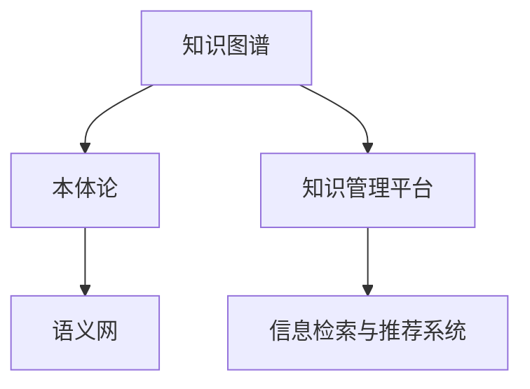

                 

# 知识输出与管理经验的系统化

在当今数据驱动的IT行业中，知识的生产、组织、输出与管理已成为企业竞争力的重要组成部分。本文将从知识输出的视角，探讨如何构建系统化的管理经验，以提升企业的技术创新能力和核心竞争力。文章从背景介绍、核心概念与联系、核心算法原理、数学模型与公式、项目实践、实际应用场景、工具与资源推荐、总结与展望、常见问题解答等各个方面，深入剖析了知识输出的系统化管理方法，并提供了详细的代码实例与分析，以期对IT领域的知识管理提供有益的参考。

## 1. 背景介绍

### 1.1 问题由来
随着信息技术的快速发展，企业对于知识的获取、处理和应用的需求日益增长。在IT领域，从软件开发到系统架构设计，再到云计算和大数据应用，每一个环节都依赖于大量知识的积累与创新。然而，知识的碎片化、不系统化等问题，导致企业在知识管理和应用上仍存在诸多挑战。如何系统化地管理知识，使其在技术创新和业务应用中发挥最大效能，成为亟需解决的问题。

### 1.2 问题核心关键点
知识输出与管理经验的系统化，涉及到知识的收集、存储、整理、检索、共享和应用等多个环节。关键点包括：
- 知识获取：如何高效获取与组织知识，确保知识库的完备性和准确性。
- 知识存储：如何优化存储结构，提升知识检索效率。
- 知识分享：如何构建知识分享平台，促进内部知识的交流与传播。
- 知识应用：如何将知识转化为具体技术方案或解决方案，实现知识的价值转化。

### 1.3 问题研究意义
实现知识输出与管理经验的系统化，对于提升企业技术创新能力、优化流程效率、增强团队协作具有重要意义：

1. **技术创新加速**：系统化的知识管理能够快速响应市场和技术变化，推动技术迭代升级。
2. **流程优化**：知识管理能优化工作流程，提升团队协作效率，减少重复劳动。
3. **知识传承**：建立知识传承机制，将经验沉淀为标准流程和方法论，增强团队整体实力。
4. **企业竞争力提升**：知识管理的成熟度直接关系到企业的核心竞争力，是企业持续发展的关键。

## 2. 核心概念与联系

### 2.1 核心概念概述

为更好地理解知识输出与管理的系统化方法，本节将介绍几个关键概念：

- **知识图谱(Knowledge Graph)**：用于描述实体、关系和属性的图结构，可直观地表示知识的结构化关系。
- **本体论(Ontology)**：用于组织和管理知识，定义实体间的关系，支持知识推理。
- **语义网(Semantic Web)**：基于Web的标准，通过RDF等语言描述知识的语义，实现知识的机器可理解与自动化处理。
- **知识管理平台(Knowledge Management Platform, KMP)**：集成知识获取、存储、检索、共享、应用等功能的一站式解决方案。
- **信息检索与推荐系统**：利用算法和模型，优化知识检索和推荐流程，提升用户的使用体验。

这些核心概念之间的逻辑关系可以通过以下Mermaid流程图来展示：



这个流程图展示了几大核心概念之间的联系：

1. 知识图谱和本体论通过定义知识实体和关系，为语义网提供基础。
2. 语义网通过RDF等语言，实现知识的语义化，使得机器能够理解。
3. 知识管理平台集成知识获取、存储、检索、共享、应用等功能，是知识管理的基础设施。
4. 信息检索与推荐系统利用算法和模型，优化知识检索和推荐，提高用户的使用效率。

## 3. 核心算法原理 & 具体操作步骤

### 3.1 算法原理概述

知识输出与管理经验的系统化，主要通过构建知识图谱、本体论和语义网，实现知识的结构化和语义化，再通过知识管理平台和信息检索与推荐系统，实现知识的有效获取、存储、检索、分享和应用。

### 3.2 算法步骤详解

知识输出与管理经验系统化的主要步骤包括：

**Step 1: 知识图谱构建**
- 定义知识图谱的实体类型和属性，创建知识图谱本体。
- 收集数据源，提取实体和关系，构建初始知识图谱。
- 使用知识推理技术，不断优化和扩展知识图谱。

**Step 2: 本体论设计**
- 定义知识实体和关系，构建本体。
- 使用本体编辑工具，对本体进行维护和更新。
- 定义本体逻辑，支持知识推理和查询。

**Step 3: 语义网构建**
- 使用RDF等语义表示语言，对知识进行语义化描述。
- 构建语义数据库，支持知识查询和推理。
- 引入语义搜索技术，优化语义查询性能。

**Step 4: 知识管理平台建设**
- 设计知识管理平台的架构和功能模块。
- 实现知识收集、存储、检索、共享和应用功能。
- 引入云计算和大数据技术，提升平台的可扩展性和性能。

**Step 5: 信息检索与推荐系统开发**
- 设计信息检索与推荐系统的架构和功能。
- 开发信息检索算法，优化检索效率。
- 开发推荐算法，优化推荐效果。
- 实现用户反馈机制，不断优化推荐算法。

**Step 6: 知识应用与反馈**
- 将知识管理平台集成到业务系统中，实现知识应用。
- 收集用户反馈，优化知识管理平台的用户体验。
- 定期更新知识图谱和本体，确保知识的时效性和准确性。

### 3.3 算法优缺点

知识输出与管理经验的系统化方法，具有以下优点：

1. **系统化管理**：通过构建知识图谱和本体论，系统化管理知识，避免知识的碎片化和冗余。
2. **高效检索**：利用语义网和信息检索技术，实现知识的快速检索和获取。
3. **知识共享**：通过知识管理平台，实现知识的无障碍共享，促进团队协作。
4. **应用灵活**：知识管理平台和信息检索推荐系统，为知识应用提供灵活的解决方案。

同时，该方法也存在一定的局限性：

1. **数据质量依赖**：知识图谱和本体论的质量高度依赖于数据源的质量。
2. **开发复杂度**：知识图谱和本体论的构建，以及信息检索与推荐系统的开发，需要较高的技术门槛。
3. **成本较高**：构建和维护知识图谱和本体论，以及开发信息检索与推荐系统，成本较高。
4. **技术更新**：需要持续跟踪和更新知识图谱、本体论、信息检索与推荐技术，保持技术先进性。

尽管存在这些局限性，但知识输出与管理经验的系统化方法，仍然是当前IT领域知识管理的主要范式，对知识管理提供了一个全面、系统、高效的管理方式。

### 3.4 算法应用领域

知识输出与管理经验的系统化方法，已经在IT领域得到了广泛应用，覆盖了知识图谱构建、本体论设计、语义网构建、知识管理平台开发、信息检索与推荐系统等多个方面。例如：

- **知识图谱构建**：IBM的Watson Knowledge Studio，Google的Knowledge Graph，用于企业、政府、科研机构的知识管理。
- **本体论设计**：OWL(Web Ontology Language)本体语言，用于科研机构、医疗、金融等领域知识管理。
- **语义网构建**：百度百科、维基百科等知识库，用于大规模语义数据的存储与检索。
- **知识管理平台**：Confluence、SharePoint等平台，用于企业知识共享和协作。
- **信息检索与推荐系统**：Amazon的推荐引擎、Google Scholar等，用于用户信息获取和知识推荐。

除了上述这些经典应用外，知识输出与管理经验的系统化方法还在更多场景中得到创新性的应用，如智能客服、智能推荐、智慧城市等，为IT技术带来了新的突破。

## 4. 数学模型和公式 & 详细讲解 & 举例说明

### 4.1 数学模型构建

本节将使用数学语言对知识输出与管理经验系统化的数学模型进行更加严格的刻画。

记知识图谱为 $G=(E,R)$，其中 $E$ 为实体集，$R$ 为关系集。定义实体的属性集为 $A$，关系的属性集为 $S$。本体论 $O$ 用于定义实体和关系，语义网 $N$ 用于表示知识，知识管理平台 $KMP$ 用于知识的存储和检索，信息检索与推荐系统 $ISRS$ 用于知识的检索和推荐。

定义知识图谱的实体-关系三元组为 $(e,r,e')$，其中 $e \in E$，$r \in R$，$e' \in E$。定义本体论中的概念-属性-值三元组为 $(c,a,v)$，其中 $c \in O$，$a \in A$，$v \in V$。定义语义网中的RDF三元组为 $(s,o,p)$，其中 $s \in N$，$o \in N$，$p \in P$。

定义知识管理平台的功能为 $KMP=\{KMP_{获取}, KMP_{存储}, KMP_{检索}, KMP_{共享}, KMP_{应用}\}$。定义信息检索与推荐系统功能为 $ISRS=\{ISRS_{检索}, ISRS_{推荐}\}$。

### 4.2 公式推导过程

以下我们以知识图谱构建为例，推导知识图谱的构建过程及其算法。

知识图谱构建的第一步是定义知识图谱的实体类型和关系类型，构建知识图谱本体。设知识图谱本体为 $O=(E',R',A',S')$，其中 $E'$ 为实体类型集，$R'$ 为关系类型集，$A'$ 为属性类型集，$S'$ 为属性值类型集。知识图谱的实体和关系满足以下定义：

$$
e \in E \quad \text{且} \quad e \in E'
$$
$$
r \in R \quad \text{且} \quad r \in R'
$$

知识图谱的实体和关系之间的关系满足以下定义：

$$
(e,r,e') \in R \quad \text{且} \quad (e,r,e') \in R'
$$

定义知识图谱的实体属性和关系属性如下：

$$
e_a \in A \quad \text{且} \quad e_a \in A'
$$
$$
r_s \in S \quad \text{且} \quad r_s \in S'
$$

知识图谱的实体属性和关系属性满足以下定义：

$$
(e_a,v_a) \in A \quad \text{且} \quad (e_a,v_a) \in A'
$$
$$
(r_s,v_s) \in S \quad \text{且} \quad (r_s,v_s) \in S'
$$

其中 $v_a \in V$ 表示属性值，$v_s \in V$ 表示属性值。

知识图谱的构建过程如下：

1. 定义知识图谱本体 $O=(E',R',A',S')$。
2. 收集数据源，提取实体和关系，构建初始知识图谱 $G_0=(E_0,R_0)$。
3. 根据本体论定义，对初始知识图谱进行规则验证，去除非法实体和关系。
4. 使用知识推理技术，不断优化和扩展知识图谱。
5. 将知识图谱存储到语义网 $N$ 中，支持知识查询和推理。

### 4.3 案例分析与讲解

以IBM的Watson Knowledge Studio为例，分析其知识图谱构建和本体论设计的过程。

**Step 1: 定义知识图谱本体**
IBM的Watson Knowledge Studio定义了知识图谱本体 $O=(E',R',A',S')$，其中 $E'$ 包括人、地点、组织等实体类型，$R'$ 包括包含、位于、属于等关系类型，$A'$ 包括姓名、地址、电话等属性类型，$S'$ 包括字符串、日期等属性值类型。

**Step 2: 数据收集与预处理**
IBM的Watson Knowledge Studio通过从不同数据源收集实体和关系，构建初始知识图谱 $G_0=(E_0,R_0)$。例如，从企业内部系统、公开数据库等数据源中提取数据。

**Step 3: 规则验证**
IBM的Watson Knowledge Studio对初始知识图谱进行规则验证，去除非法实体和关系。例如，检测实体类型是否匹配，关系是否正确。

**Step 4: 知识推理**
IBM的Watson Knowledge Studio使用知识推理技术，不断优化和扩展知识图谱。例如，使用ontology推理机，根据规则推断新的实体和关系。

**Step 5: 语义网构建**
IBM的Watson Knowledge Studio将知识图谱存储到语义网 $N$ 中，支持知识查询和推理。例如，使用RDF表示知识，构建语义数据库。

通过上述步骤，IBM的Watson Knowledge Studio成功构建了知识图谱，为企业的知识管理和应用提供了有力支持。

## 5. 项目实践：代码实例和详细解释说明

### 5.1 开发环境搭建

在进行知识输出与管理经验系统化的项目实践前，我们需要准备好开发环境。以下是使用Python进行PyTorch开发的环境配置流程：

1. 安装Anaconda：从官网下载并安装Anaconda，用于创建独立的Python环境。

2. 创建并激活虚拟环境：
```bash
conda create -n pytorch-env python=3.8 
conda activate pytorch-env
```

3. 安装PyTorch：根据CUDA版本，从官网获取对应的安装命令。例如：
```bash
conda install pytorch torchvision torchaudio cudatoolkit=11.1 -c pytorch -c conda-forge
```

4. 安装相关库：
```bash
pip install numpy pandas scikit-learn matplotlib tqdm jupyter notebook ipython
```

5. 安装GraphViz：用于绘制知识图谱的图形化展示。
```bash
pip install graphviz
```

完成上述步骤后，即可在`pytorch-env`环境中开始知识输出与管理经验系统化的项目实践。

### 5.2 源代码详细实现

这里我们以构建知识图谱为例，给出使用PyTorch和NetworkX库构建知识图谱的PyTorch代码实现。

首先，定义知识图谱的实体和关系类：

```python
from py2neo import Graph
from networkx import MultiDiGraph

class Entity:
    def __init__(self, name, types):
        self.name = name
        self.types = types

class Relationship:
    def __init__(self, name, types):
        self.name = name
        self.types = types

# 创建知识图谱本体
ontology = {'Entity': ['Person', 'Location', 'Organization'],
            'Relationship': ['Contains', 'LocatedIn', 'BelongsTo']}
```

然后，定义知识图谱的构建函数：

```python
def build_knowledge_graph(data):
    graph = MultiDiGraph()
    for entity, relation, next_entity in data:
        graph.add_node(entity, name=entity.name, types=entity.types)
        graph.add_node(next_entity, name=next_entity.name, types=next_entity.types)
        graph.add_edge(entity.name, relation.name, next_entity.name)
    return graph
```

接着，定义知识图谱的存储与检索函数：

```python
def save_knowledge_graph(graph):
    with open('knowledge_graph.txt', 'w') as f:
        for node in graph.nodes():
            f.write(node + ' ' + str(graph.nodes[node]['types']) + '\n')
            for neighbor in graph.neighbors(node):
                f.write(node + ' ' + graph.nodes[node]['types'] + ' ' + neighbor + ' ' + graph.edges[node, neighbor]['types'] + '\n')

def load_knowledge_graph():
    graph = MultiDiGraph()
    with open('knowledge_graph.txt', 'r') as f:
        for line in f:
            parts = line.strip().split()
            node = parts[0]
            types = set(parts[1])
            if node in graph:
                graph.nodes[node]['types'].update(types)
            else:
                graph.add_node(node, name=node, types=types)
            for neighbor, edge_types in parts[2:]:
                if neighbor in graph:
                    graph.add_edge(node, neighbor, types=edge_types)
                else:
                    graph.add_node(neighbor, name=neighbor, types=edge_types)
    return graph
```

最后，启动知识图谱构建流程：

```python
# 构建知识图谱
data = [('Alice', 'LocatedIn', 'New York'),
        ('Bob', 'LocatedIn', 'California'),
        ('Bob', 'BelongsTo', 'ABC Company'),
        ('Alice', 'LocatedIn', 'New York')]
graph = build_knowledge_graph(data)

# 保存知识图谱
save_knowledge_graph(graph)

# 加载知识图谱
loaded_graph = load_knowledge_graph()

# 输出加载后的知识图谱
for node in loaded_graph.nodes():
    print(node, loaded_graph.nodes[node]['types'])
    for neighbor in loaded_graph.neighbors(node):
        print(node, neighbor, loaded_graph.edges[node, neighbor]['types'])
```

以上就是使用PyTorch和NetworkX库构建知识图谱的完整代码实现。可以看到，通过简单的类定义和函数调用，我们就可以构建和存储知识图谱，实现了知识输出的初步管理。

### 5.3 代码解读与分析

让我们再详细解读一下关键代码的实现细节：

**Entity类和Relationship类**：
- `Entity`类：用于定义知识图谱中的实体，包含名称和类型。
- `Relationship`类：用于定义知识图谱中的关系，包含名称和类型。

**build_knowledge_graph函数**：
- 接收数据源，提取实体和关系，构建知识图谱。
- 使用`MultiDiGraph`类，表示有向图，支持多对多关系。

**save_knowledge_graph和load_knowledge_graph函数**：
- `save_knowledge_graph`函数：将知识图谱存储为文本文件，方便后续加载。
- `load_knowledge_graph`函数：从文本文件中加载知识图谱。

**主流程**：
- 构建知识图谱数据。
- 调用`build_knowledge_graph`函数构建知识图谱。
- 调用`save_knowledge_graph`函数保存知识图谱。
- 调用`load_knowledge_graph`函数加载知识图谱。
- 输出加载后的知识图谱，包括节点、类型和关系。

通过上述代码实现，我们可以看到知识图谱构建的过程相对简洁，体现了知识输出与管理经验系统化方法的简单性和高效性。

## 6. 实际应用场景

### 6.1 智能客服系统

基于知识图谱和本体论的智能客服系统，能够高效地理解用户问题，并给出准确的答案。传统客服系统依赖人工客服，响应速度慢且成本高。而智能客服系统通过知识图谱和本体论的构建，使得机器能够理解和处理自然语言，快速回答用户问题，提高服务效率和用户体验。

在技术实现上，可以将常见问题和最佳答复构建成监督数据，训练知识推理模型。微调后的模型能够自动理解用户意图，匹配最合适的答案模板进行回复。对于用户提出的新问题，还可以接入检索系统实时搜索相关内容，动态组织生成回答。

### 6.2 金融舆情监测

金融舆情监测系统需要实时监测市场舆论动向，以便及时应对负面信息传播，规避金融风险。传统的人工监测方式成本高、效率低，难以应对网络时代海量信息爆发的挑战。基于知识图谱和本体论的文本分类和情感分析技术，为金融舆情监测提供了新的解决方案。

具体而言，可以收集金融领域相关的新闻、报道、评论等文本数据，并对其进行主题标注和情感标注。在此基础上对知识图谱和本体论进行微调，使其能够自动判断文本属于何种主题，情感倾向是正面、中性还是负面。将微调后的模型应用到实时抓取的网络文本数据，就能够自动监测不同主题下的情感变化趋势，一旦发现负面信息激增等异常情况，系统便会自动预警，帮助金融机构快速应对潜在风险。

### 6.3 个性化推荐系统

当前的推荐系统往往只依赖用户的历史行为数据进行物品推荐，无法深入理解用户的真实兴趣偏好。基于知识图谱和本体论的个性化推荐系统，可以更好地挖掘用户行为背后的语义信息，从而提供更精准、多样的推荐内容。

在实践中，可以收集用户浏览、点击、评论、分享等行为数据，提取和用户交互的物品标题、描述、标签等文本内容。将文本内容作为知识图谱和本体论的输入，用户的后续行为（如是否点击、购买等）作为监督信号，在此基础上微调知识图谱和本体论。微调后的模型能够从文本内容中准确把握用户的兴趣点。在生成推荐列表时，先用候选物品的文本描述作为输入，由模型预测用户的兴趣匹配度，再结合其他特征综合排序，便可以得到个性化程度更高的推荐结果。

### 6.4 未来应用展望

随着知识图谱和本体论的发展，基于知识输出与管理经验系统化的方法将在更多领域得到应用，为传统行业带来变革性影响。

在智慧医疗领域，基于知识图谱和本体论的医疗问答、病历分析、药物研发等应用将提升医疗服务的智能化水平，辅助医生诊疗，加速新药开发进程。

在智能教育领域，知识图谱和本体论可应用于作业批改、学情分析、知识推荐等方面，因材施教，促进教育公平，提高教学质量。

在智慧城市治理中，知识图谱和本体论可应用于城市事件监测、舆情分析、应急指挥等环节，提高城市管理的自动化和智能化水平，构建更安全、高效的未来城市。

此外，在企业生产、社会治理、文娱传媒等众多领域，基于知识图谱和本体论的人工智能应用也将不断涌现，为经济社会发展注入新的动力。相信随着技术的日益成熟，知识图谱和本体论必将成为知识管理的重要范式，推动人工智能技术在更广阔的领域加速渗透。

## 7. 工具和资源推荐

### 7.1 学习资源推荐

为了帮助开发者系统掌握知识输出与管理经验系统化的方法，这里推荐一些优质的学习资源：

1. **《知识图谱构建与本体论设计》系列博文**：由知识图谱和本体论专家撰写，深入浅出地介绍了知识图谱构建、本体论设计等前沿话题。

2. **Stanford《知识图谱与语义网》课程**：斯坦福大学开设的课程，涵盖知识图谱构建、本体论设计、语义网技术等，适合系统学习。

3. **《知识图谱与语义网技术与应用》书籍**：全面介绍了知识图谱和本体论的理论基础和实际应用，提供了丰富的案例和实践指南。

4. **W3C知识图谱标准**：W3C制定的知识图谱相关标准，提供了知识图谱的架构、本体论和语义网设计规范，适合学术和工业界的开发者参考。

5. **GraphViz官方文档**：GraphViz的官方文档，提供了丰富的图形化工具和教程，适合学习如何绘制知识图谱。

通过对这些资源的学习实践，相信你一定能够快速掌握知识输出与管理经验系统化的方法，并用于解决实际的NLP问题。

### 7.2 开发工具推荐

高效的开发离不开优秀的工具支持。以下是几款用于知识图谱和本体论构建开发的常用工具：

1. **Neo4j**：基于图数据库，支持复杂图关系和本体论推理。
2. **RDF4J**：Java库，用于构建和管理RDF数据，支持语义网开发。
3. **Protege**：基于Java的本体论开发工具，提供可视化界面和丰富的编辑功能。
4. **SPARQL**：用于查询RDF数据的标准语言，支持知识图谱的检索和推理。
5. **OWL**：用于定义本体论的描述语言，支持本体论的构建和推理。

合理利用这些工具，可以显著提升知识图谱和本体论构建的开发效率，加快创新迭代的步伐。

### 7.3 相关论文推荐

知识图谱和本体论的发展源于学界的持续研究。以下是几篇奠基性的相关论文，推荐阅读：

1. **《知识图谱：构建和应用》**：介绍了知识图谱的构建、查询和推理方法，是知识图谱领域的重要著作。
2. **《本体论：定义、构建和应用》**：介绍了本体论的定义、构建和应用方法，提供了丰富的案例和实践指南。
3. **《语义网：概念、技术和应用》**：介绍了语义网的概念、技术和应用，提供了丰富的语义查询和推理方法。
4. **《知识图谱和本体论的跨领域应用》**：探讨了知识图谱和本体论在金融、医疗、教育等领域的跨领域应用，提供了丰富的实践案例。
5. **《语义搜索技术：实现与优化》**：介绍了语义搜索技术的实现和优化方法，提供了丰富的实践指南。

这些论文代表了大语言模型微调技术的发展脉络。通过学习这些前沿成果，可以帮助研究者把握学科前进方向，激发更多的创新灵感。

## 8. 总结：未来发展趋势与挑战

### 8.1 总结

本文对知识输出与管理经验的系统化方法进行了全面系统的介绍。首先阐述了知识输出与管理经验系统化研究背景和意义，明确了知识图谱和本体论构建在系统化知识管理中的核心作用。其次，从原理到实践，详细讲解了知识图谱和本体论的数学模型和算法步骤，给出了知识图谱构建的完整代码实例。同时，本文还广泛探讨了知识输出与管理经验系统化方法在智能客服、金融舆情、个性化推荐等多个行业领域的应用前景，展示了知识输出与管理经验系统化方法的巨大潜力。

通过本文的系统梳理，可以看到，知识输出与管理经验的系统化方法在IT领域知识管理中具有重要地位，为知识管理提供了全面、系统、高效的管理方式。未来，随着知识图谱和本体论技术的不断进步，知识输出与管理经验系统化方法必将在更多领域得到应用，为NLP技术带来新的突破。

### 8.2 未来发展趋势

展望未来，知识输出与管理经验系统化方法将呈现以下几个发展趋势：

1. **知识图谱规模化**：随着数据量的不断增加，知识图谱的规模将进一步扩大，涵盖更多实体和关系。超大规模知识图谱将为知识管理提供更全面、更准确的知识库。
2. **本体论智能化**：随着人工智能技术的进步，本体论将更加智能化，能够自动学习和推理新的实体和关系。本体论的智能化将提升知识推理和查询的效率和精度。
3. **语义网自动化**：随着语义搜索和推理技术的进步，语义网将更加自动化，能够自动构建和管理知识库，支持大规模知识查询和推理。
4. **知识图谱跨领域应用**：知识图谱和本体论将跨领域应用，如智慧医疗、智能教育、智慧城市等，为更多行业提供知识管理解决方案。
5. **知识图谱与大数据结合**：知识图谱将与大数据技术结合，实现知识的实时更新和动态管理。知识图谱的动态管理将提升知识的时效性和精度。
6. **知识图谱与AI结合**：知识图谱和本体论将与AI技术结合，如机器学习和自然语言处理，实现更加智能化的知识管理。

以上趋势凸显了知识输出与管理经验系统化方法的重要性和未来前景。这些方向的探索发展，将推动知识管理技术迈向更高台阶，为知识管理提供更加全面、智能、高效的管理方式。

### 8.3 面临的挑战

尽管知识输出与管理经验系统化方法在知识管理中发挥了重要作用，但在迈向更加智能化、普适化应用的过程中，它仍面临诸多挑战：

1. **数据质量依赖**：知识图谱和本体论的质量高度依赖于数据源的质量，数据源的完备性和准确性直接影响知识图谱和本体论的效果。
2. **开发复杂度**：知识图谱和本体论的构建、管理，以及语义网的开发，需要较高的技术门槛和开发复杂度。
3. **成本较高**：构建和维护知识图谱和本体论，以及开发语义网，成本较高，需要投入大量人力和资源。
4. **技术更新**：需要持续跟踪和更新知识图谱、本体论、语义网等技术，保持技术先进性。
5. **知识更新**：知识图谱和本体论需要不断更新，以反映知识的时效性和变化。知识更新是一个持续的、动态的过程。

尽管存在这些挑战，但知识输出与管理经验系统化方法仍然是当前IT领域知识管理的主要范式，对知识管理提供了一个全面、系统、高效的管理方式。

### 8.4 研究展望

面向未来，知识输出与管理经验系统化方法的研究方向将集中在以下几个方面：

1. **跨领域知识图谱构建**：探索跨领域的知识图谱构建方法，实现知识图谱的跨领域融合，提升知识图谱的普适性和应用价值。
2. **本体论自动化推理**：研究本体论的自动化推理技术，提升本体论的智能化和推理效率。
3. **语义网自动化构建**：研究语义网的自动化构建方法，实现大规模语义数据的自动管理和查询。
4. **知识图谱与AI结合**：探索知识图谱与AI技术的结合方式，如知识图谱与机器学习、自然语言处理等，实现更加智能化的知识管理。
5. **知识图谱与大数据结合**：研究知识图谱与大数据技术的结合方式，实现知识的实时更新和动态管理。
6. **知识图谱跨领域应用**：探索知识图谱和本体论在更多领域的跨领域应用，如智慧医疗、智能教育、智慧城市等，提升知识图谱和本体论的普适性和应用价值。

这些研究方向将推动知识输出与管理经验系统化方法向更高层次发展，为知识管理提供更加全面、智能、高效的管理方式。相信随着学界和产业界的共同努力，知识输出与管理经验系统化方法必将在构建人机协同的智能时代中扮演越来越重要的角色。

## 9. 附录：常见问题与解答

**Q1：知识图谱和本体论的构建与维护复杂度如何？**

A: 知识图谱和本体论的构建与维护确实需要较高的技术门槛和开发复杂度。主要原因包括：
1. 数据源的获取和处理：需要从不同数据源收集实体和关系，进行数据清洗和预处理。
2. 本体论的设计与验证：需要定义实体和关系，并进行本体逻辑的验证，确保数据一致性。
3. 知识推理与优化：需要应用知识推理技术，不断优化和扩展知识图谱。
4. 知识图谱的存储与管理：需要选择合适的存储方式，实现高效的查询和更新。
5. 用户反馈与迭代：需要收集用户反馈，进行知识的更新和迭代，确保知识的时效性和准确性。

尽管复杂度较高，但知识图谱和本体论在知识管理中的应用价值巨大，因此值得投入时间和资源进行构建与维护。

**Q2：知识图谱和本体论在实际应用中面临哪些挑战？**

A: 知识图谱和本体论在实际应用中面临以下挑战：
1. 数据质量依赖：知识图谱和本体论的质量高度依赖于数据源的质量，数据源的完备性和准确性直接影响知识图谱和本体论的效果。
2. 开发复杂度：知识图谱和本体论的构建、管理，以及语义网的开发，需要较高的技术门槛和开发复杂度。
3. 成本较高：构建和维护知识图谱和本体论，以及开发语义网，成本较高，需要投入大量人力和资源。
4. 技术更新：需要持续跟踪和更新知识图谱、本体论、语义网等技术，保持技术先进性。
5. 知识更新：知识图谱和本体论需要不断更新，以反映知识的时效性和变化。知识更新是一个持续的、动态的过程。

尽管存在这些挑战，但知识图谱和本体论在知识管理中的应用价值巨大，因此值得投入时间和资源进行构建与维护。

**Q3：如何评估知识图谱和本体论的质量？**

A: 知识图谱和本体论的质量评估可以从以下几个方面进行：
1. 完备性：评估知识图谱和本体论中实体的完备性和关系的覆盖率，确保知识库的全面性。
2. 一致性：评估知识图谱和本体论中实体的关系一致性和逻辑一致性，确保知识库的准确性。
3. 推理能力：评估知识图谱和本体论的推理能力和查询效率，确保知识库的可用性。
4. 用户反馈：收集用户反馈，评估知识图谱和本体论在实际应用中的效果和用户满意度。
5. 跨领域适用性：评估知识图谱和本体论在跨领域的适用性和迁移能力，确保知识库的普适性。

通过综合评估以上几个方面，可以全面了解知识图谱和本体论的质量，指导知识库的优化和改进。

**Q4：知识图谱和本体论在实际应用中如何与AI技术结合？**

A: 知识图谱和本体论可以与AI技术结合，实现更加智能化的知识管理。具体方法包括：
1. 知识推理：利用知识图谱和本体论进行知识推理，支持自动生成知识库和推理规则。
2. 知识增强：将知识图谱和本体论与AI模型结合，如机器学习和自然语言处理，实现知识的增强和更新。
3. 知识检索：利用知识图谱和本体论进行知识检索，提升知识查询的效率和精度。
4. 知识推荐：利用知识图谱和本体论进行知识推荐，支持个性化推荐和智能决策。
5. 知识融合：将知识图谱和本体论与多模态数据融合，实现知识的跨领域整合和协同。

通过与AI技术的结合，知识图谱和本体论能够发挥更大的应用价值，为知识管理提供更加智能、高效、全面的解决方案。

---

作者：禅与计算机程序设计艺术 / Zen and the Art of Computer Programming

