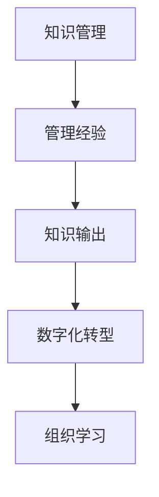

                 

# 知识输出促进管理经验传承

> 关键词：知识管理,管理经验,知识输出,数字化转型,组织学习

## 1. 背景介绍

在知识经济时代，管理经验成为了企业核心竞争力的重要组成部分。然而，由于传统的知识传递方式存在诸多局限，许多优秀管理经验未能及时有效地被组织内员工所掌握，进而影响了企业整体的运营效率和创新能力。本文旨在探讨如何通过知识输出，促进管理经验的传承，推动企业的数字化转型。

### 1.1 问题由来
随着信息技术的迅猛发展，企业面临的环境变得更加复杂多变。市场竞争的激烈、客户需求的多样化、技术的快速迭代等，都对企业管理提出了更高的要求。在这一背景下，企业的管理经验显得尤为重要。然而，由于管理经验的传递方式单一，许多宝贵的管理智慧未能及时转化为员工的实际能力，导致企业在面对新挑战时缺乏应对之道。

### 1.2 问题核心关键点
为了解决上述问题，我们需要探索一种能够高效、系统地传递管理经验的方法。这一方法需要具备以下特点：
1. 高效性：能够快速将管理经验传递给全体员工。
2. 系统性：能够系统地整理和传播管理经验，避免遗漏。
3. 互动性：能够通过互动和反馈，加深员工对管理经验的理解和掌握。
4. 可操作性：所传递的管理经验应具有实际可操作性，能够在日常工作中应用。
5. 持续性：能够持续更新和迭代，不断提升管理经验的价值。

## 2. 核心概念与联系

### 2.1 核心概念概述

在探讨知识输出促进管理经验传承的方法前，我们首先需要理解几个关键概念：

- 知识管理(Knowledge Management, KM)：通过有效的知识和信息管理，提升企业运营效率和创新能力的过程。
- 管理经验(Management Experience)：企业在长期运营中积累的宝贵经验、教训、最佳实践等。
- 知识输出(Knowledge Output)：将企业内部的知识和经验转化为可被广泛传播和应用的格式，以便于知识的传递和应用。
- 数字化转型(Digital Transformation)：利用数字化技术和工具，改变企业的运营和管理方式，提升企业竞争力的过程。
- 组织学习(Organizational Learning)：通过不断学习和改进，提升组织的学习能力和适应能力。

这些概念之间的关系可以通过以下Mermaid流程图来展示：



这个流程图展示了从知识管理到组织学习的知识传递路径：知识管理通过整理和筛选管理经验，将其转化为易于传播的形式；数字化转型通过引入数字化技术和工具，加速知识输出和应用；组织学习则通过持续的知识传递和反馈，不断提升组织的学习能力和适应能力。

## 3. 核心算法原理 & 具体操作步骤
### 3.1 算法原理概述

知识输出促进管理经验传承的方法，本质上是一个从知识管理到组织学习的系统化过程。其核心思想是通过有效的知识输出机制，将企业内部的管理经验传递给全体员工，进而提升企业的运营效率和创新能力。

在具体实现上，我们可以将这一过程分为以下五个步骤：

1. 知识管理：收集和整理企业内部的管理经验。
2. 知识输出：将管理经验转化为易于传播和应用的形式。
3. 数字化传递：利用数字化技术和工具，加速知识输出和应用。
4. 互动反馈：通过互动和反馈，加深员工对管理经验的理解和掌握。
5. 持续改进：根据反馈信息，持续更新和改进管理经验。

### 3.2 算法步骤详解

#### 第一步：知识管理

知识管理是知识输出的前提和基础。具体步骤包括：

1. **知识收集**：通过各种渠道收集企业内部的管理经验，包括但不限于员工培训材料、项目报告、业务流程文档、成功案例等。

2. **知识整理**：对收集到的知识进行分类和整理，形成知识库，便于后续的检索和应用。

3. **知识筛选**：对知识库中的知识进行筛选，去除无效或过时的信息，保留具有实际应用价值的知识。

#### 第二步：知识输出

知识输出是将管理经验转化为易于传播和应用的形式。具体步骤包括：

1. **知识凝练**：将复杂的管理经验提炼为简洁、易懂的知识点，便于传播和应用。

2. **知识格式化**：将知识点转化为适合不同传播渠道的格式，如文章、视频、PPT等。

3. **知识模块化**：将知识点划分为不同的模块，便于根据不同需求进行组合和应用。

#### 第三步：数字化传递

数字化传递利用数字化技术和工具，加速知识输出和应用。具体步骤包括：

1. **平台搭建**：搭建知识管理平台，提供知识存储、检索、分享的功能。

2. **技术支持**：利用AI技术，如自然语言处理、机器学习等，提高知识输出的效率和质量。

3. **工具整合**：整合各类数字化工具，如CRM、ERP等，提供一站式知识输出和应用解决方案。

#### 第四步：互动反馈

互动反馈是通过互动和反馈，加深员工对管理经验的理解和掌握。具体步骤包括：

1. **互动机制**：在知识管理平台上，设计互动机制，鼓励员工分享自己的经验和学习心得。

2. **反馈机制**：建立反馈机制，收集员工对管理经验的评价和建议，及时调整和改进知识输出。

3. **持续改进**：根据反馈信息，持续更新和改进管理经验，提升知识输出的质量和效果。

#### 第五步：持续改进

持续改进是通过不断的反馈和调整，确保管理经验的持续更新和迭代。具体步骤包括：

1. **定期评估**：定期评估知识输出的效果，识别存在的问题和改进空间。

2. **更新知识库**：根据评估结果，更新和优化知识库，确保管理经验的及时性和准确性。

3. **优化流程**：优化知识管理的流程，提升知识输出的效率和质量。

### 3.3 算法优缺点

知识输出促进管理经验传承的方法，具有以下优点：

1. **高效性**：通过数字化传递，能够快速将管理经验传递给全体员工。

2. **系统性**：通过知识管理，能够系统地整理和传播管理经验，避免遗漏。

3. **互动性**：通过互动和反馈，能够加深员工对管理经验的理解和掌握。

4. **可操作性**：所传递的管理经验具有实际可操作性，能够在日常工作中应用。

5. **持续性**：能够持续更新和迭代，不断提升管理经验的价值。

同时，该方法也存在以下局限性：

1. **成本较高**：搭建和维护知识管理平台需要一定的成本投入。

2. **技术门槛**：需要掌握一定的数字化技术，如自然语言处理、机器学习等。

3. **文化障碍**：员工的接受度和参与度可能受到企业文化的影响。

4. **信息过载**：大量的知识输出可能导致信息过载，员工难以消化和吸收。

5. **数据隐私**：知识输出可能涉及敏感信息，需要注意数据隐私和安全。

## 4. 数学模型和公式 & 详细讲解 & 举例说明

### 4.1 数学模型构建

在知识输出的过程中，我们可以将管理经验表示为一个函数 $E(x)$，其中 $x$ 表示知识管理过程中收集到的原始经验数据，$E(x)$ 表示处理后的管理经验。知识输出的过程可以表示为 $E_{\text{out}}(x) = F(E(x))$，其中 $F$ 表示知识输出的函数。

### 4.2 公式推导过程

在知识输出的过程中，我们可以将管理经验进行分类和筛选，表示为 $E(x) = \sum_{i=1}^{n} w_i e_i(x)$，其中 $e_i(x)$ 表示第 $i$ 种类型的管理经验，$w_i$ 表示该类型经验的权重。

知识输出的函数 $F$ 可以表示为 $F(E(x)) = \sum_{i=1}^{n} \alpha_i E_i(E(x))$，其中 $E_i(E(x))$ 表示第 $i$ 种管理经验的格式化输出，$\alpha_i$ 表示该类型经验在输出中的占比。

### 4.3 案例分析与讲解

以某公司的知识输出项目为例，该项目通过以下步骤实现了知识管理的数字化传递：

1. **知识收集**：公司通过问卷调查、访谈等方式，收集了大量的管理经验，形成了一个包含数百个知识点的知识库。

2. **知识整理**：公司对知识库进行了分类和整理，形成了运营管理、项目管理、人力资源管理等多个知识模块。

3. **知识筛选**：公司对每个知识点进行了筛选和评估，去除了过时或无效的信息，保留了具有实际应用价值的知识点。

4. **知识输出**：公司将这些知识点转化为文章、视频、PPT等形式，并在知识管理平台上发布。

5. **数字化传递**：公司搭建了一个知识管理平台，支持员工通过该平台查看和管理知识。

6. **互动反馈**：公司在知识管理平台上设计了互动机制，鼓励员工分享自己的经验和学习心得。同时，公司建立了反馈机制，收集员工对知识输出的评价和建议，及时调整和改进。

7. **持续改进**：公司定期评估知识输出的效果，根据评估结果更新和优化知识库，提升知识输出的质量和效果。

## 5. 项目实践：代码实例和详细解释说明

### 5.1 开发环境搭建

在知识输出项目的开发过程中，我们需要搭建一个知识管理平台，支持知识的存储、检索、分享和互动。以下是搭建知识管理平台的步骤：

1. **选择技术栈**：根据公司的技术能力和需求，选择合适的技术栈，如Java、Python等。

2. **搭建服务器**：搭建一个高性能的服务器，用于存储和管理知识。

3. **配置数据库**：配置一个高可用性的数据库，用于存储知识和管理用户信息。

4. **部署应用**：部署知识管理平台的应用，支持知识的存储、检索、分享和互动等功能。

5. **集成API**：将知识管理平台与其他系统集成，如CRM、ERP等，提供一站式知识输出和应用解决方案。

### 5.2 源代码详细实现

以下是知识管理平台的主要功能模块及其代码实现：

1. **知识管理模块**：用于知识收集、整理、筛选和管理。具体代码如下：

```python
class KnowledgeManagement:
    def __init__(self, db):
        self.db = db
        
    def collect_knowledge(self):
        # 收集管理经验
        pass
    
    def organize_knowledge(self):
        # 整理和管理知识
        pass
    
    def screen_knowledge(self):
        # 筛选和评估知识
        pass
```

2. **知识输出模块**：用于将管理经验转化为易于传播和应用的形式。具体代码如下：

```python
class KnowledgeOutput:
    def __init__(self, knowledge):
        self.knowledge = knowledge
        
    def format_knowledge(self):
        # 格式化输出管理经验
        pass
    
    def moduleize_knowledge(self):
        # 模块化管理经验
        pass
```

3. **数字化传递模块**：用于利用数字化技术和工具，加速知识输出和应用。具体代码如下：

```python
class DigitalDissemination:
    def __init__(self, knowledge, platform):
        self.knowledge = knowledge
        self.platform = platform
        
    def publish_knowledge(self):
        # 发布和管理知识
        pass
    
    def integrate_systems(self):
        # 集成其他系统
        pass
```

4. **互动反馈模块**：用于通过互动和反馈，加深员工对管理经验的理解和掌握。具体代码如下：

```python
class InteractionFeedback:
    def __init__(self, platform):
        self.platform = platform
        
    def encourage_sharing(self):
        # 鼓励员工分享经验
        pass
    
    def collect_feedback(self):
        # 收集员工反馈
        pass
    
    def improve_knowledge(self):
        # 改进管理经验
        pass
```

### 5.3 代码解读与分析

以下是知识管理平台主要功能模块的代码解读：

**KnowledgeManagement类**：
- `__init__`方法：初始化数据库连接。
- `collect_knowledge`方法：收集管理经验。
- `organize_knowledge`方法：整理和管理知识。
- `screen_knowledge`方法：筛选和评估知识。

**KnowledgeOutput类**：
- `__init__`方法：初始化知识库。
- `format_knowledge`方法：格式化输出管理经验。
- `moduleize_knowledge`方法：模块化管理经验。

**DigitalDissemination类**：
- `__init__`方法：初始化知识库和平台。
- `publish_knowledge`方法：发布和管理知识。
- `integrate_systems`方法：集成其他系统。

**InteractionFeedback类**：
- `__init__`方法：初始化平台。
- `encourage_sharing`方法：鼓励员工分享经验。
- `collect_feedback`方法：收集员工反馈。
- `improve_knowledge`方法：改进管理经验。

### 5.4 运行结果展示

在知识管理平台上线后，员工可以通过平台查看和管理知识，参与互动和反馈。以下是一个典型的运行结果展示：

- **知识库展示**：员工可以查看公司的知识库，找到自己需要的管理经验。

```
{
    "运营管理": [
        {
            "title": "如何优化运营流程",
            "content": "详细介绍了运营流程优化的步骤和方法。"
        },
        {
            "title": "如何提高运营效率",
            "content": "分享了提高运营效率的最佳实践。"
        }
    ],
    ...
}
```

- **互动反馈**：员工可以分享自己的经验和学习心得，与其他员工交流。

```
{
    "运营管理": [
        {
            "comment": "非常好的运营流程优化方法，谢谢分享！",
            "author": "张三"
        },
        {
            "comment": "如何提高运营效率的方法能否再详细讲讲？",
            "author": "李四"
        }
    ]
}
```

## 6. 实际应用场景

### 6.1 智能客服系统

智能客服系统可以通过知识输出，将企业的客服经验转化为易于传播的形式，提升客服人员的知识水平和响应速度。具体应用场景如下：

1. **知识库搭建**：公司搭建一个知识库，收集和整理客服相关的管理经验。

2. **知识格式化**：将客服经验转化为文章、视频等易于传播的形式。

3. **知识分享**：客服人员可以在知识库中查找和分享客服经验。

4. **互动反馈**：客服人员可以在知识库中进行互动和反馈，提升自身的知识水平。

### 6.2 金融舆情监测

金融舆情监测系统可以通过知识输出，将金融相关的管理经验转化为易于传播的形式，提升金融分析师的知识水平和分析能力。具体应用场景如下：

1. **知识库搭建**：公司搭建一个知识库，收集和整理金融相关的管理经验。

2. **知识格式化**：将金融经验转化为文章、视频等易于传播的形式。

3. **知识分享**：金融分析师可以在知识库中查找和分享金融经验。

4. **互动反馈**：金融分析师可以在知识库中进行互动和反馈，提升自身的分析能力。

### 6.3 个性化推荐系统

个性化推荐系统可以通过知识输出，将企业的推荐经验转化为易于传播的形式，提升推荐引擎的推荐效果。具体应用场景如下：

1. **知识库搭建**：公司搭建一个知识库，收集和整理推荐相关的管理经验。

2. **知识格式化**：将推荐经验转化为文章、视频等易于传播的形式。

3. **知识分享**：推荐工程师可以在知识库中查找和分享推荐经验。

4. **互动反馈**：推荐工程师可以在知识库中进行互动和反馈，提升推荐效果。

### 6.4 未来应用展望

随着知识输出技术的不断进步，其应用场景将不断扩展，推动更多领域的企业数字化转型。以下是一些未来应用展望：

1. **智慧医疗**：医院可以通过知识输出，将临床经验和医疗知识转化为易于传播的形式，提升医生的知识水平和诊疗能力。

2. **智能教育**：学校可以通过知识输出，将教育经验和教学方法转化为易于传播的形式，提升教师的教学能力和学生的学习效果。

3. **智慧城市**：城市管理部门可以通过知识输出，将城市管理经验和治理方法转化为易于传播的形式，提升城市管理的智能化水平。

4. **工业制造**：企业可以通过知识输出，将制造经验和质量控制方法转化为易于传播的形式，提升生产效率和产品质量。

## 7. 工具和资源推荐

### 7.1 学习资源推荐

为了帮助开发者系统掌握知识输出促进管理经验传承的理论基础和实践技巧，这里推荐一些优质的学习资源：

1. **《知识管理：实现企业竞争优势的科学》**：一本书籍，系统介绍了知识管理的原理、方法和实践案例。

2. **《组织学习：理论与实践》**：一本关于组织学习的经典著作，介绍了组织学习的原理、方法和实践案例。

3. **Coursera《知识管理》课程**：斯坦福大学开设的在线课程，深入浅出地介绍了知识管理的理论基础和实践方法。

4. **edX《组织学习》课程**：麻省理工学院开设的在线课程，介绍了组织学习的理论基础和实践方法。

5. **Kaggle知识管理竞赛**：一个Kaggle比赛项目，通过实际数据和任务，帮助你学习和应用知识管理的知识。

通过对这些资源的学习实践，相信你一定能够快速掌握知识输出促进管理经验传承的精髓，并用于解决实际的管理问题。

### 7.2 开发工具推荐

高效的开发离不开优秀的工具支持。以下是几款用于知识输出促进管理经验传承开发的常用工具：

1. **JIRA**：一款项目管理工具，可以用于记录和跟踪知识输出和管理的过程。

2. **Confluence**：一款知识管理工具，可以用于创建和管理知识库，支持文章、文档、代码等多种格式。

3. **Slack**：一款团队沟通工具，可以用于知识输出的互动和反馈。

4. **Zoom**：一款视频会议工具，可以用于知识输出的培训和互动。

5. **Tableau**：一款数据可视化工具，可以用于知识输出的数据分析和展示。

合理利用这些工具，可以显著提升知识输出促进管理经验传承任务的开发效率，加快创新迭代的步伐。

### 7.3 相关论文推荐

知识输出促进管理经验传承的研究源于学界的持续研究。以下是几篇奠基性的相关论文，推荐阅读：

1. **《知识管理与组织学习：概念与实践》**：这篇文章系统介绍了知识管理和组织学习的概念、方法和实践案例。

2. **《组织学习的机制与方法》**：这篇文章介绍了组织学习的机制和多种学习方法。

3. **《知识管理系统的设计与实现》**：这篇文章介绍了知识管理系统的设计和实现方法。

4. **《基于知识管理的组织学习》**：这篇文章介绍了基于知识管理的组织学习方法和实践案例。

5. **《智慧型组织学习》**：这篇文章介绍了智慧型组织学习的概念和方法。

这些论文代表了大语言模型微调技术的发展脉络。通过学习这些前沿成果，可以帮助研究者把握学科前进方向，激发更多的创新灵感。

## 8. 总结：未来发展趋势与挑战

### 8.1 研究成果总结

本文对知识输出促进管理经验传承的方法进行了全面系统的介绍。首先阐述了知识输出促进管理经验传承的研究背景和意义，明确了知识输出在提升企业运营效率和创新能力方面的独特价值。其次，从原理到实践，详细讲解了知识输出的数学原理和操作步骤，给出了知识输出任务开发的完整代码实例。同时，本文还广泛探讨了知识输出方法在智能客服、金融舆情、个性化推荐等多个行业领域的应用前景，展示了知识输出范式的巨大潜力。

通过本文的系统梳理，可以看到，知识输出促进管理经验传承的方法正在成为企业知识管理的重要范式，极大地提升了企业的运营效率和创新能力。未来，伴随知识输出技术的不断演进，相信企业知识管理的数字化转型将更加深入，推动企业向更高层次的智能化迈进。

### 8.2 未来发展趋势

展望未来，知识输出促进管理经验传承的技术将呈现以下几个发展趋势：

1. **智能化**：利用AI技术，如自然语言处理、机器学习等，提高知识输出的效率和质量。

2. **多模态**：将知识输出的形式扩展到图像、视频、音频等多模态数据，提高知识输出的丰富性和应用场景的广泛性。

3. **社交化**：利用社交网络，提高知识输出的互动性和传播效果，提升员工的知识水平和参与度。

4. **个性化**：根据员工的需求和兴趣，提供个性化的知识输出，提高知识输出的针对性和效果。

5. **跨界融合**：将知识输出与其他领域的技术结合，如物联网、区块链等，提升知识输出的应用范围和价值。

以上趋势凸显了知识输出促进管理经验传承技术的广阔前景。这些方向的探索发展，必将进一步提升企业的运营效率和创新能力，推动企业向更加智能化、数字化的方向发展。

### 8.3 面临的挑战

尽管知识输出促进管理经验传承技术已经取得了一定的进展，但在迈向更加智能化、普适化应用的过程中，它仍面临诸多挑战：

1. **技术门槛**：知识输出技术的实现需要掌握一定的AI技术，如自然语言处理、机器学习等，对于技术能力较弱的企业而言，技术门槛较高。

2. **数据隐私**：知识输出可能涉及敏感信息，需要注意数据隐私和安全。

3. **文化障碍**：企业的文化和组织结构可能影响员工对知识输出的接受度和参与度。

4. **信息过载**：大量的知识输出可能导致信息过载，员工难以消化和吸收。

5. **效果评估**：如何评估知识输出的效果，识别存在的问题和改进空间，是一个复杂而重要的问题。

6. **持续更新**：知识库需要不断更新和迭代，保持知识的及时性和准确性。

正视知识输出面临的这些挑战，积极应对并寻求突破，将是对知识输出技术的不断优化和完善。

### 8.4 研究展望

面对知识输出技术面临的诸多挑战，未来的研究需要在以下几个方面寻求新的突破：

1. **智能化**：进一步利用AI技术，提高知识输出的效率和质量，减少人工干预。

2. **多模态**：将知识输出的形式扩展到多模态数据，提高知识输出的丰富性和应用场景的广泛性。

3. **社交化**：利用社交网络，提高知识输出的互动性和传播效果，提升员工的知识水平和参与度。

4. **个性化**：根据员工的需求和兴趣，提供个性化的知识输出，提高知识输出的针对性和效果。

5. **跨界融合**：将知识输出与其他领域的技术结合，如物联网、区块链等，提升知识输出的应用范围和价值。

6. **数据隐私**：研究如何保护数据隐私和安全，确保知识输出过程中的信息安全。

7. **效果评估**：研究如何评估知识输出的效果，识别存在的问题和改进空间。

8. **持续更新**：研究如何保持知识库的及时性和准确性，确保知识输出的时效性和有效性。

这些研究方向的探索，必将引领知识输出技术的不断优化和完善，推动企业知识管理的数字化转型，提升企业的运营效率和创新能力。

## 9. 附录：常见问题与解答

**Q1：如何构建一个高效的组织知识库？**

A: 构建高效的组织知识库需要从多个方面入手：

1. **明确知识需求**：根据企业的需求和目标，明确需要收集和整理哪些知识。

2. **分类和整理**：将知识进行分类和整理，形成清晰的结构，便于查询和检索。

3. **多渠道收集**：通过多种渠道收集知识，如员工培训材料、项目报告、成功案例等。

4. **定期更新**：定期更新知识库，保持知识的及时性和准确性。

5. **提供搜索功能**：提供高效的搜索功能，方便员工快速找到所需知识。

**Q2：如何提高知识输出的互动性和参与度？**

A: 提高知识输出的互动性和参与度，可以从以下几个方面入手：

1. **设计互动机制**：在知识管理平台上设计互动机制，鼓励员工分享自己的经验和学习心得。

2. **提供反馈渠道**：提供反馈渠道，收集员工对知识输出的评价和建议，及时调整和改进。

3. **激励机制**：通过激励机制，如表彰、奖励等方式，提高员工对知识输出的参与度。

4. **互动工具**：利用互动工具，如在线论坛、即时通讯等，促进员工之间的交流和互动。

5. **定期培训**：定期开展知识输出的培训和讲座，提升员工的知识水平和参与度。

**Q3：如何评估知识输出的效果？**

A: 评估知识输出的效果，可以从以下几个方面入手：

1. **知识库使用情况**：统计知识库的使用情况，评估知识库的访问量和检索效果。

2. **员工反馈**：收集员工对知识输出的反馈，评估知识输出的效果和价值。

3. **员工绩效**：评估知识输出对员工绩效的影响，如技能提升、任务完成率等。

4. **业务指标**：评估知识输出对业务指标的影响，如运营效率、创新能力等。

5. **知识更新情况**：统计知识库的更新情况，评估知识输出的持续性和及时性。

通过对这些问题的回答，相信你一定能够更好地理解知识输出促进管理经验传承的方法，并用于解决实际的管理问题。

---

作者：禅与计算机程序设计艺术 / Zen and the Art of Computer Programming

