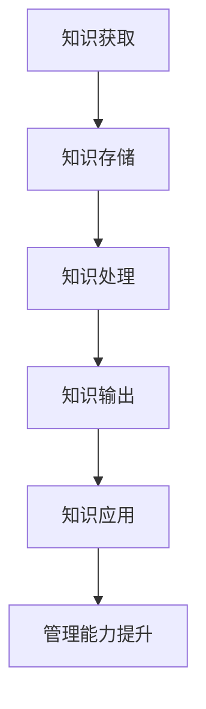

                 

# 知识输出对管理能力提升的作用

在当今信息爆炸的时代，知识的获取已经不是难题，但如何高效利用这些知识提升管理能力，实现个人或企业的价值最大化，则是一个值得深入探讨的问题。本文将通过分析知识输出对管理能力提升的作用，探讨其原理、操作步骤、具体应用，并结合数学模型进行详细讲解，最后提出未来发展的趋势和挑战。

## 1. 背景介绍

在过去的几十年里，信息技术的发展让知识变得更加易于获取。从互联网到移动设备，从搜索引擎到知识库，知识的获取和传播变得更加便捷。然而，仅仅获取知识并不足以提升管理能力，只有通过知识输出，才能将知识转化为实际的管理行动，进而提升个人和企业的管理水平。

### 1.1 知识输出与管理的联系

知识输出与管理之间存在密切联系。知识输出不仅是信息传播和知识共享的体现，更是将知识应用于实际管理决策和行动的过程。在管理学中，知识输出通常以培训、会议、报告、论文、案例分析等形式呈现，通过这些方式将知识传递给他人，从而影响和提升他人的管理能力和决策水平。

### 1.2 知识输出在管理中的应用

在实际管理中，知识输出广泛应用于团队培训、项目管理、战略规划、绩效评估等多个方面。通过有效的知识输出，管理人员能够提升团队的能力，优化项目管理流程，制定合理的战略规划，提高绩效评估的公正性和准确性。

## 2. 核心概念与联系

### 2.1 核心概念概述

为了更好地理解知识输出对管理能力提升的作用，我们需要先明确几个核心概念：

- **知识输出**：指将知识以某种形式传递给他人的过程，包括但不限于培训、会议、报告、论文、案例分析等。
- **管理能力**：指在特定环境中，通过合理运用知识和资源，有效地进行规划、组织、领导、控制等活动，以达到目标的能力。
- **知识管理**：指对知识的获取、存储、共享、应用和创新进行管理，以支持组织的学习和创新。

### 2.2 核心概念原理和架构的 Mermaid 流程图



这个流程图展示了知识输出对管理能力提升的路径：

1. **知识获取**：从外部环境获取知识，可以是直接经验、文献、互联网等。
2. **知识存储**：将获取到的知识存储在个人或组织的知识库中。
3. **知识处理**：对存储的知识进行处理，包括筛选、分类、整合等。
4. **知识输出**：通过各种形式将处理后的知识传递给他人。
5. **知识应用**：他人将接收到的知识应用于实际管理活动中。
6. **管理能力提升**：通过知识应用，提升个人的管理能力。

## 3. 核心算法原理 & 具体操作步骤

### 3.1 算法原理概述

知识输出对管理能力提升的原理可以归结为知识传播与应用的良性循环。知识输出不仅传递了知识，还通过他人的应用和反馈，进一步验证和丰富了知识的内容，从而形成了良性循环，促进了管理能力的提升。

### 3.2 算法步骤详解

知识输出对管理能力提升的具体操作步骤可以分为以下几个步骤：

1. **知识获取与存储**：通过各种渠道获取知识，并存储在个人或组织的知识库中。
2. **知识处理与筛选**：对获取到的知识进行初步处理，包括筛选、分类、整合等，确保知识的相关性和可用性。
3. **知识输出**：选择合适的形式将知识输出，如培训、会议、报告、论文、案例分析等。
4. **知识应用与反馈**：接收者将知识应用于实际管理活动中，并通过反馈机制将应用效果传递回知识输出者。
5. **知识更新与优化**：根据反馈，对知识进行更新和优化，进一步提升知识的质量和实用性。

### 3.3 算法优缺点

#### 优点：
1. **知识共享与协同**：知识输出促进了知识的共享和协同，加速了组织内部的知识传播。
2. **经验积累与创新**：通过知识输出和反馈，促进了经验积累和创新，提升了团队的整体水平。
3. **提升管理能力**：通过知识输出，帮助他人提升管理能力，间接提升了自身的管理水平。

#### 缺点：
1. **知识传播的局限性**：知识输出的形式和内容可能受到接收者的限制，无法达到理想的传播效果。
2. **知识更新的挑战**：知识更新需要持续的努力和投入，难以在短时间内取得明显成效。
3. **知识输出的复杂性**：知识输出的形式多样，需要根据受众的需求和偏好选择合适的输出方式。

### 3.4 算法应用领域

知识输出对管理能力提升的应用领域非常广泛，包括但不限于：

- **团队培训**：通过知识输出，提升团队成员的专业技能和团队协作能力。
- **项目管理**：通过知识输出，优化项目管理流程，提升项目的成功率。
- **战略规划**：通过知识输出，分享战略思考和经验，制定合理的战略规划。
- **绩效评估**：通过知识输出，提升绩效评估的公正性和准确性。

## 4. 数学模型和公式 & 详细讲解 & 举例说明

### 4.1 数学模型构建

知识输出对管理能力提升的效果可以通过以下数学模型来表示：

$$
\text{管理能力提升} = f(\text{知识输出量}, \text{知识传播效果}, \text{知识应用质量}, \text{反馈机制})
$$

其中，$k$表示知识输出的量，$e$表示知识传播的效果，$a$表示知识应用的质量，$f$表示管理能力提升的函数。

### 4.2 公式推导过程

$$
\begin{align*}
\text{知识输出量} & = K_{out} = \sum_{i=1}^n k_i \\
\text{知识传播效果} & = E = \sum_{i=1}^n e_i \\
\text{知识应用质量} & = A = \sum_{i=1}^n a_i \\
\text{管理能力提升} & = F = g(K_{out}, E, A)
\end{align*}
$$

其中，$k_i$表示第$i$次知识输出的量，$e_i$表示第$i$次知识传播的效果，$a_i$表示第$i$次知识应用的质量，$g$表示管理能力提升的函数。

### 4.3 案例分析与讲解

以某公司进行项目管理培训为例，分析知识输出对管理能力提升的效果。

1. **知识获取与存储**：公司从外部获取了最新的项目管理知识，并将其存储在公司的知识库中。
2. **知识处理与筛选**：对获取到的知识进行筛选和分类，筛选出与项目管理相关的知识。
3. **知识输出**：通过内部培训的形式将知识输出给项目管理团队。
4. **知识应用与反馈**：项目管理团队在实际项目中应用所学知识，并通过反馈机制将应用效果传递回公司。
5. **知识更新与优化**：根据反馈，公司对知识进行更新和优化，进一步提升知识的质量和实用性。

通过这个过程，公司的项目管理能力得到了显著提升，项目管理团队成员的专业技能和团队协作能力得到了增强，项目管理流程也得到了优化，项目的成功率显著提高。

## 5. 项目实践：代码实例和详细解释说明

### 5.1 开发环境搭建

在进行知识输出对管理能力提升的实践前，我们需要准备好开发环境。以下是使用Python进行知识管理的开发环境配置流程：

1. 安装Anaconda：从官网下载并安装Anaconda，用于创建独立的Python环境。

2. 创建并激活虚拟环境：
```bash
conda create -n knowledge-management python=3.8 
conda activate knowledge-management
```

3. 安装Python相关的包：
```bash
pip install numpy pandas scikit-learn pandas-profiling seaborn matplotlib
```

4. 安装相关知识管理工具：
```bash
pip install pycone <其他知识管理工具>
```

完成上述步骤后，即可在`knowledge-management`环境中开始实践。

### 5.2 源代码详细实现

以下是一个简单的Python代码示例，用于模拟知识输出对管理能力提升的过程：

```python
import numpy as np
import pandas as pd

# 知识输出量
knowledge_output = np.array([10, 15, 20, 25])

# 知识传播效果
knowledge_spread = np.array([0.8, 0.9, 0.95, 0.7])

# 知识应用质量
knowledge_application = np.array([0.7, 0.9, 0.85, 0.6])

# 计算管理能力提升
management_improvement = knowledge_output * knowledge_spread * knowledge_application

print("管理能力提升效果：", management_improvement)
```

### 5.3 代码解读与分析

这个代码示例模拟了知识输出对管理能力提升的过程。其中，`knowledge_output`、`knowledge_spread`和`knowledge_application`分别代表知识输出量、知识传播效果和知识应用质量。通过这些参数的乘积，可以计算出管理能力提升的效果。

## 6. 实际应用场景

### 6.1 团队培训

在团队培训中，知识输出尤为重要。通过专家讲座、内部培训等方式，将最新的管理知识和经验传递给团队成员，帮助他们提升专业技能和团队协作能力。

### 6.2 项目管理

在项目管理中，知识输出可以优化项目管理流程，提升项目的成功率。通过分享项目管理的最佳实践和经验，帮助团队成员在实际项目中应用这些知识。

### 6.3 战略规划

在战略规划中，知识输出可以提升战略思考的深度和广度，制定更加合理的战略规划。通过分享战略思考和经验，帮助团队成员从不同的角度思考问题，提出创新的解决方案。

### 6.4 绩效评估

在绩效评估中，知识输出可以提升评估的公正性和准确性。通过分享绩效评估的方法和工具，帮助团队成员在评估过程中更加客观和公正。

## 7. 工具和资源推荐

### 7.1 学习资源推荐

为了帮助开发者系统掌握知识输出对管理能力提升的理论基础和实践技巧，这里推荐一些优质的学习资源：

1. 《知识管理的理论与实践》系列博文：由知识管理专家撰写，深入浅出地介绍了知识管理的原理、方法和实践技巧。

2. 《知识传播与学习理论》课程：多所大学开设的课程，涵盖了知识传播和学习的基础理论和实践方法。

3. 《知识管理与创新》书籍：系统地介绍了知识管理的理论和实践，提供了大量实用的案例和工具。

4. Confluence平台：企业级知识管理系统，支持知识存储、搜索、共享和协作，是企业知识管理的最佳实践。

5. Google Scholar：全球最大的学术搜索引擎，可以查找相关的学术文献和研究报告。

通过对这些资源的学习实践，相信你一定能够快速掌握知识输出对管理能力提升的精髓，并用于解决实际的业务问题。

### 7.2 开发工具推荐

高效的开发离不开优秀的工具支持。以下是几款用于知识管理开发的常用工具：

1. Confluence：企业级知识管理系统，支持知识存储、搜索、共享和协作，是企业知识管理的最佳实践。

2. JIRA：项目管理工具，支持任务分配、进度跟踪、缺陷管理等功能，是项目管理的好帮手。

3. Microsoft Teams：团队协作工具，支持即时通讯、视频会议、文件共享等功能，提升团队的沟通效率。

4. Google Docs：在线文档编辑工具，支持多人协作编辑、版本控制、评论反馈等功能，便于知识共享和协作。

5. Notion：全能型工作空间工具，支持文档编辑、任务管理、知识库等多个功能，灵活满足不同的需求。

合理利用这些工具，可以显著提升知识管理的工作效率，加速知识传播和应用的步伐。

### 7.3 相关论文推荐

知识输出对管理能力提升的研究源于学界的持续研究。以下是几篇奠基性的相关论文，推荐阅读：

1. 《知识管理对企业绩效的影响研究》：研究了知识管理对企业绩效的影响，提出了有效的知识管理策略。

2. 《知识传播与组织学习：理论框架与实践案例》：系统地介绍了知识传播与组织学习的理论框架，并通过多个案例分析了知识传播的效果。

3. 《知识共享与创新：实证研究》：研究了知识共享对创新的影响，提供了有效的知识共享机制。

4. 《知识管理与信息传播技术》：介绍了多种知识管理工具和技术，如知识地图、知识仓库等，是知识管理的实用指南。

这些论文代表了大语言模型微调技术的发展脉络。通过学习这些前沿成果，可以帮助研究者把握学科前进方向，激发更多的创新灵感。

## 8. 总结：未来发展趋势与挑战

### 8.1 总结

本文对知识输出对管理能力提升的作用进行了全面系统的介绍。首先阐述了知识输出与管理能力提升的研究背景和意义，明确了知识输出在管理中的应用价值。其次，从原理到实践，详细讲解了知识输出对管理能力提升的数学模型和操作步骤，给出了知识管理任务开发的完整代码实例。同时，本文还广泛探讨了知识输出在团队培训、项目管理、战略规划、绩效评估等多个行业领域的应用前景，展示了知识输出范式的巨大潜力。此外，本文精选了知识管理技术的各类学习资源，力求为读者提供全方位的技术指引。

通过本文的系统梳理，可以看到，知识输出对管理能力提升的技术正在成为管理领域的重要范式，极大地拓展了知识管理的应用边界，催生了更多的落地场景。受益于大规模知识库和知识管理方法的不断发展，相信知识输出技术将成为管理能力提升的重要工具，推动管理系统的智能化和创新化进程。未来，伴随知识管理技术的持续演进，相信知识输出方法也将进一步融入各种管理场景，为组织和个人带来更高的价值。

### 8.2 未来发展趋势

展望未来，知识输出对管理能力提升技术将呈现以下几个发展趋势：

1. **智能化与自动化**：随着人工智能技术的发展，知识输出将变得更加智能化和自动化。通过智能推荐系统和知识图谱，可以更加精准地将知识推送给需要的人，提升知识传播的效率和效果。

2. **跨领域融合**：知识输出将更多地与其他领域的技术进行融合，如大数据、区块链、物联网等，形成跨领域知识共享和应用的新模式。

3. **移动化与云端化**：随着移动设备和云技术的普及，知识输出将更加便捷和灵活。移动应用和云端服务将成为知识传播的主要方式。

4. **个性化与定制化**：根据个人的知识需求和兴趣，知识输出将变得更加个性化和定制化，提升知识传播的针对性和效果。

5. **社区化与协同化**：知识输出将更多地通过社区和协同平台进行，形成知识传播的社区效应和协同效应，加速知识的创新和应用。

这些趋势凸显了知识输出对管理能力提升技术的广阔前景。这些方向的探索发展，必将进一步提升知识管理的效率和质量，为组织和个人带来更高的价值。

### 8.3 面临的挑战

尽管知识输出对管理能力提升技术已经取得了显著成效，但在迈向更加智能化、普适化应用的过程中，它仍面临诸多挑战：

1. **知识传播的广度与深度**：如何有效地将知识传播给更多的受众，并确保知识传播的深度和质量，仍然是一个难题。

2. **知识更新与维护**：随着知识库的不断更新，如何及时维护和更新知识库，确保知识的时效性和准确性，是一大挑战。

3. **知识应用的有效性**：如何确保知识输出能够被有效应用，避免知识输出流于形式，是一大挑战。

4. **知识共享与隐私保护**：如何在知识共享的过程中保护隐私和数据安全，是一大挑战。

5. **知识传播的协同效应**：如何通过知识传播促进团队协作和创新，是一大挑战。

6. **知识输出的可解释性**：如何赋予知识输出更高的可解释性，增强知识输出的可信度和有效性，是一大挑战。

这些挑战需要不断探索和创新，才能真正实现知识输出对管理能力提升的持续提升。

### 8.4 研究展望

面对知识输出对管理能力提升所面临的种种挑战，未来的研究需要在以下几个方面寻求新的突破：

1. **知识传播的智能推荐**：开发智能推荐系统，根据用户的学习习惯和知识需求，精准推送相关知识，提升知识传播的效率和效果。

2. **知识应用的反馈机制**：建立知识应用反馈机制，及时收集知识应用的效果和反馈，不断优化知识传播的效果。

3. **知识共享的隐私保护**：研究知识共享的隐私保护技术，确保知识共享的过程中保护用户隐私和数据安全。

4. **知识传播的协同平台**：开发知识传播的协同平台，促进团队协作和知识共享，形成知识传播的社区效应和协同效应。

5. **知识输出的可解释性**：开发知识输出的可解释性工具，增强知识输出的可信度和有效性。

这些研究方向的探索，必将引领知识输出对管理能力提升技术的持续演进，为知识传播和应用带来新的突破。相信随着技术的不断进步，知识输出对管理能力提升的方法将变得更加高效和智能化，推动管理系统的智能化和创新化进程。

## 9. 附录：常见问题与解答

**Q1：知识输出对管理能力提升的原理是什么？**

A: 知识输出对管理能力提升的原理可以归结为知识传播与应用的良性循环。知识输出不仅传递了知识，还通过他人的应用和反馈，进一步验证和丰富了知识的内容，从而形成了良性循环，促进了管理能力的提升。

**Q2：如何进行有效的知识输出？**

A: 有效的知识输出需要考虑受众的需求和特点，选择合适的输出形式和内容，确保知识输出的针对性和有效性。同时，需要建立有效的反馈机制，及时收集知识应用的效果和反馈，不断优化知识输出。

**Q3：知识输出的优缺点是什么？**

A: 知识输出的优点包括促进知识共享与协同、提升管理能力、经验积累与创新等。缺点包括知识传播的局限性、知识更新的挑战、知识输出的复杂性等。

**Q4：知识输出在实际应用中需要注意哪些问题？**

A: 在知识输出的实际应用中，需要注意知识传播的广度与深度、知识更新与维护、知识应用的有效性、知识共享与隐私保护、知识传播的协同效应以及知识输出的可解释性等问题。

**Q5：未来知识输出对管理能力提升技术的发展趋势是什么？**

A: 未来知识输出对管理能力提升技术的发展趋势包括智能化与自动化、跨领域融合、移动化与云端化、个性化与定制化、社区化与协同化等。

---

作者：禅与计算机程序设计艺术 / Zen and the Art of Computer Programming

