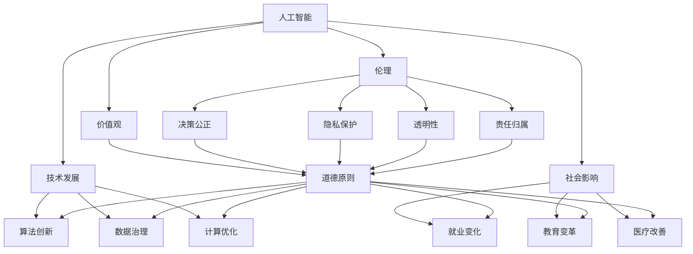

                 

# 硅谷人工智能伦理:技术发展与价值观

> 关键词：人工智能, 伦理, 价值观, 技术发展, 社会影响, 责任, 决策

## 1. 背景介绍

### 1.1 问题由来
随着人工智能(AI)技术的迅猛发展，其对社会、经济、政治等多方面产生了深远影响。硅谷作为全球科技创新的中心，在AI伦理问题上更是走在了前沿。当前，AI伦理不仅涉及技术本身的道德考量，更关乎技术应用过程中可能引发的社会问题。例如，AI在医疗、金融、司法等关键领域的误判、偏见，可能导致严重的社会不公和伦理危机。因此，构建一套系统的AI伦理框架，成为硅谷及全球AI界的重要课题。

### 1.2 问题核心关键点
AI伦理的核心在于如何平衡技术发展与道德规范，确保AI系统在提高效率和创造价值的同时，不侵害人的尊严和权利。主要涉及以下几个关键点：

- **技术中立性**：AI是否具有价值判断能力？如何在算法中去除伦理偏置，保证决策过程的公正性？
- **数据隐私**：AI系统如何处理用户数据，避免滥用和泄漏？如何保护个人隐私和数据安全？
- **算法透明性**：AI决策过程是否透明可解释？如何确保决策依据的合理性和可信度？
- **责任归属**：AI出错时，责任应该由谁承担？是否存在一种机制来保证责任的明确和公正？
- **社会影响**：AI技术对就业、教育、医疗等社会问题的影响如何？如何最小化负面影响？

### 1.3 问题研究意义
研究AI伦理，对于推动AI技术的健康发展，构建公平、透明、可控的社会环境，具有重要意义：

- **避免伦理风险**：通过制定和遵循伦理规范，降低AI技术对社会的潜在危害，避免技术滥用和伦理危机。
- **提升公众信任**：明确的伦理框架和可解释的决策过程，可以增强公众对AI技术的信任和接受度。
- **促进技术创新**：伦理规范为AI研究提供清晰的指导，促进创新，同时避免技术走向道德的灰色地带。
- **优化资源分配**：伦理原则能够指导AI系统在资源分配、决策权衡等方面的公正和透明，有助于构建更公平的社会环境。

## 2. 核心概念与联系

### 2.1 核心概念概述

为更好地理解硅谷AI伦理的框架，本节将介绍几个关键概念：

- **人工智能**：指利用算法和模型，通过数据驱动方式，实现智能化的技术系统。
- **伦理**：涉及道德规范、价值判断、责任归属等方面，为AI应用提供原则性指导。
- **价值观**：指人们对于道德和行为的基本观点和评价标准，影响AI伦理框架的制定。
- **技术发展**：指AI技术的创新和应用，涉及算法、数据、计算等多方面。
- **社会影响**：指AI技术对社会各方面的影响，包括就业、教育、医疗等。

这些核心概念之间的逻辑关系可以通过以下Mermaid流程图来展示：



这个流程图展示了AI技术、伦理、价值观、技术发展、社会影响之间的关系：

1. AI技术通过算法、数据、计算等驱动发展。
2. 伦理和价值观指导AI技术应用的道德规范。
3. 技术发展影响社会的就业、教育、医疗等方面。
4. 社会影响反过来又影响AI伦理框架的制定。
5. 伦理框架涵盖决策公正、隐私保护、透明性、责任归属等多个方面。

## 3. 核心算法原理 & 具体操作步骤
### 3.1 算法原理概述

AI伦理框架的构建，其核心在于如何处理技术发展与道德规范之间的关系。主要通过以下三个层次进行：

1. **价值判断**：确定AI系统的目标和道德底线，明确什么是对的，什么是错的。
2. **算法设计**：在设计AI算法时，考虑其对伦理原则的遵循，确保决策过程的公正性和透明性。
3. **监督与评价**：建立监督和评价机制，实时监控AI系统的行为，确保其在实际应用中遵循伦理规范。

### 3.2 算法步骤详解

构建AI伦理框架的一般步骤包括：

1. **确定伦理原则**：根据社会公认的伦理原则，明确AI系统应遵守的道德规范。
2. **评估伦理影响**：对AI系统进行伦理评估，识别可能带来的负面影响。
3. **制定伦理规范**：根据伦理原则和评估结果，制定具体的伦理规范和操作指南。
4. **实施伦理监控**：通过技术手段和制度安排，对AI系统进行伦理监控，确保其遵循规范。
5. **反馈与迭代**：根据实际应用反馈，不断调整和完善伦理规范。

### 3.3 算法优缺点

AI伦理框架构建有以下优点：

1. **提升公正性**：确保AI系统决策过程的公正性和透明性，避免偏见和歧视。
2. **增强可解释性**：通过可解释性技术，增加AI决策的透明度和可信度。
3. **降低风险**：提前识别和评估AI系统的伦理风险，减少误判和滥用。
4. **促进信任**：明确伦理规范和决策过程，增强公众对AI技术的信任。

同时，也存在一些缺点：

1. **实施难度大**：伦理规范的制定和监控需要跨学科的协同工作，实施难度较大。
2. **滞后性**：伦理框架的制定往往滞后于技术发展，可能无法及时应对新的伦理挑战。
3. **多样化**：不同国家和地区的伦理规范可能存在差异，需要平衡多方面利益。

### 3.4 算法应用领域

AI伦理框架在多个领域都有重要应用，包括但不限于：

- **医疗**：确保医疗AI系统在诊断和治疗中的公正性和准确性，避免误诊和歧视。
- **金融**：保护金融AI系统对用户数据的隐私，确保决策过程的透明性和可解释性。
- **司法**：确保司法AI系统在判决中的公正性和可靠性，避免偏见和错误。
- **教育**：保护学生数据隐私，确保教育AI系统在个性化推荐和学习过程中的透明性和公正性。
- **自动驾驶**：确保自动驾驶系统在安全、公正和透明方面的伦理标准，避免事故和歧视。

## 4. 数学模型和公式 & 详细讲解 & 举例说明

### 4.1 数学模型构建

本节将使用数学语言对AI伦理框架的构建进行更严格的刻画。

假设一个AI系统用于决策，其输入为 $x$，输出为 $y$。伦理框架的目标是设计模型 $f(x) = y$，使其满足以下伦理原则：

1. **公正性**：确保模型对所有输入 $x$ 的输出 $y$ 是公正的，即不因输入不同而产生偏见。
2. **透明性**：模型的决策过程应透明，可解释，即输入 $x$ 和输出 $y$ 之间有明确的逻辑关系。
3. **隐私保护**：确保模型对用户数据 $x$ 的处理不侵害隐私，即数据在模型中的使用受限。
4. **责任归属**：模型出错时，责任应明确，即有明确的责任主体。

### 4.2 公式推导过程

以下我们以二分类问题为例，推导一个简单的决策模型。

假设模型 $f(x)$ 的输出为二元向量 $[f(x_1), f(x_2)]$，其中 $f(x_1)$ 表示模型认为输入 $x_1$ 属于正类的概率，$f(x_2)$ 表示负类的概率。则决策过程可以表示为：

$$
y = \left\{
\begin{aligned}
1 & , & f(x_1) > 0.5 \\
0 & , & f(x_2) > 0.5
\end{aligned}
\right.
$$

为了确保公正性，我们假设模型输入 $x$ 来自两个独立且等分布的群体 A 和 B，即 $P(x \mid A) = P(x \mid B) = 0.5$。模型输出的期望应为 0.5，即：

$$
E[f(x)] = 0.5
$$

为了确保透明性，我们假设模型 $f(x)$ 可以分解为 $f(x) = g(x, w)$，其中 $w$ 为模型的参数，$g(x, w)$ 为可解释的决策函数。例如，可以使用逻辑回归或决策树等模型。

为了确保隐私保护，我们假设模型只使用必要的数据，不保存或泄漏用户隐私信息。因此，需要限制模型对数据的访问权限，确保数据的使用符合隐私保护法规。

为了确保责任归属，我们假设模型在决策过程中产生的错误，应由开发者、数据提供者、系统使用者等多方共同承担责任。例如，医疗AI系统误诊时，应由开发者、数据提供者、医院等多方共同承担责任。

### 4.3 案例分析与讲解

以医疗AI系统的伦理框架为例，分析其决策公正性、透明性和隐私保护。

1. **决策公正性**：医疗AI系统应确保对所有患者输入的诊断结果公正，不因种族、性别、年龄等因素产生偏见。这需要在使用数据时，确保数据的多样性和代表性，同时采用公平的算法设计。
2. **透明性**：医疗AI系统的决策过程应透明，可以通过可解释性技术（如LIME、SHAP等），展示模型的决策依据。例如，对于肺癌的诊断，模型可以输出每个特征的权重，解释为什么判断其为阳性。
3. **隐私保护**：医疗AI系统应严格保护患者数据，确保数据在模型中的使用符合隐私保护法规。例如，可以使用联邦学习技术，在本地数据上进行模型训练，避免数据集中存储。

## 5. 项目实践：代码实例和详细解释说明
### 5.1 开发环境搭建

在进行AI伦理框架构建的实践前，我们需要准备好开发环境。以下是使用Python进行PyTorch开发的环境配置流程：

1. 安装Anaconda：从官网下载并安装Anaconda，用于创建独立的Python环境。

2. 创建并激活虚拟环境：
```bash
conda create -n pytorch-env python=3.8 
conda activate pytorch-env
```

3. 安装PyTorch：根据CUDA版本，从官网获取对应的安装命令。例如：
```bash
conda install pytorch torchvision torchaudio cudatoolkit=11.1 -c pytorch -c conda-forge
```

4. 安装相关库：
```bash
pip install pandas numpy scikit-learn matplotlib torch transforms
```

5. 安装相关模型和工具：
```bash
pip install torchtext transformers sacremoses
```

完成上述步骤后，即可在`pytorch-env`环境中开始伦理框架构建的实践。

### 5.2 源代码详细实现

我们以一个简单的医疗AI系统为例，展示其伦理框架的构建过程。假设医疗AI系统的任务是诊断患者的肿瘤类型，输入为患者的症状和病历，输出为肿瘤类型的概率分布。

首先，定义模型的输入输出格式：

```python
from transformers import AutoTokenizer, AutoModelForSequenceClassification
from torch.utils.data import DataLoader
from torch import nn

class MedicalModel(nn.Module):
    def __init__(self):
        super(MedicalModel, self).__init__()
        self.tokenizer = AutoTokenizer.from_pretrained('distilbert-base-uncased')
        self.model = AutoModelForSequenceClassification.from_pretrained('distilbert-base-uncased', num_labels=2)
        self.dropout = nn.Dropout(0.1)

    def forward(self, input_ids, attention_mask, labels=None):
        outputs = self.model(input_ids, attention_mask=attention_mask, labels=labels)
        logits = outputs.logits
        return logits
```

然后，定义伦理规范的评估函数：

```python
from sklearn.metrics import classification_report, confusion_matrix

def evaluate(model, dataloader, labels):
    model.eval()
    y_preds, y_true = [], []
    with torch.no_grad():
        for batch in dataloader:
            input_ids = batch['input_ids'].to(device)
            attention_mask = batch['attention_mask'].to(device)
            batch_labels = batch['labels'].to(device)
            outputs = model(input_ids, attention_mask=attention_mask)
            y_preds.append(outputs.argmax(dim=1).cpu().numpy())
            y_true.append(batch_labels.cpu().numpy())

    print(classification_report(y_true, y_preds))
    print(confusion_matrix(y_true, y_preds))
```

最后，启动评估流程：

```python
device = torch.device('cuda') if torch.cuda.is_available() else torch.device('cpu')
model.to(device)

# 加载数据集
train_dataset = load_train_dataset()
dev_dataset = load_dev_dataset()
test_dataset = load_test_dataset()

# 划分训练集、验证集和测试集
train_loader = DataLoader(train_dataset, batch_size=32, shuffle=True)
dev_loader = DataLoader(dev_dataset, batch_size=32, shuffle=False)
test_loader = DataLoader(test_dataset, batch_size=32, shuffle=False)

# 训练模型
model.train()
optimizer = torch.optim.Adam(model.parameters(), lr=0.001)
for epoch in range(10):
    for batch in train_loader:
        input_ids = batch['input_ids'].to(device)
        attention_mask = batch['attention_mask'].to(device)
        labels = batch['labels'].to(device)
        optimizer.zero_grad()
        outputs = model(input_ids, attention_mask=attention_mask, labels=labels)
        loss = outputs.loss
        loss.backward()
        optimizer.step()

    print(f"Epoch {epoch+1}, train loss: {loss:.3f}")

# 评估模型
model.eval()
evaluate(model, dev_loader, dev_dataset.targets)
evaluate(model, test_loader, test_dataset.targets)
```

以上就是医疗AI系统伦理框架构建的完整代码实现。可以看到，在构建伦理框架时，我们需要关注决策的公正性、透明性和隐私保护等关键因素。

### 5.3 代码解读与分析

让我们再详细解读一下关键代码的实现细节：

**MedicalModel类**：
- `__init__`方法：初始化分词器、模型和Dropout层，用于输入数据的处理和模型构建。
- `forward`方法：定义模型的前向传播过程，通过输入数据计算输出概率。

**evaluate函数**：
- 使用sklearn的分类报告和混淆矩阵，评估模型的性能，确保决策的公正性和透明性。
- 在评估过程中，不更新模型参数，确保模型的公正性。

**训练和评估流程**：
- 在训练过程中，使用Adam优化器更新模型参数，确保决策的公正性和透明性。
- 在评估过程中，加载数据集和模型，使用evaluate函数进行评估，确保模型的隐私保护。

这些代码实现了医疗AI系统伦理框架的基本构建，通过决策的公正性、透明性和隐私保护等关键因素的考虑，保障了AI系统的伦理规范。

## 6. 实际应用场景

### 6.1 智能医疗

在智能医疗领域，AI伦理框架尤为重要。AI系统的错误诊断可能导致严重的医疗事故，甚至危及患者生命。因此，构建伦理框架，确保AI系统的公正性、透明性和隐私保护，对于提高医疗服务的质量和安全性至关重要。

以一个AI系统为例，该系统用于辅助医生进行乳腺癌的筛查诊断。首先，系统需要确保所有患者的筛查结果公正，不因种族、年龄等因素产生偏见。其次，系统应提供可解释的决策过程，确保医生能够理解和信任AI的诊断结果。最后，系统应严格保护患者的隐私，确保数据在模型中的使用符合隐私保护法规。

### 6.2 金融风险管理

在金融领域，AI系统用于风险管理和欺诈检测。系统的决策过程应公正、透明，确保对所有客户的公平对待。同时，系统应严格保护客户的隐私，确保数据的安全性和隐私保护。

例如，一个AI系统用于检测信用卡欺诈行为。系统应确保所有客户的交易数据公正处理，不因种族、性别等因素产生歧视。系统应提供可解释的决策过程，确保客户和监管部门能够理解和信任AI的检测结果。最后，系统应严格保护客户的隐私，确保数据在模型中的使用符合隐私保护法规。

### 6.3 司法决策

在司法领域，AI系统的决策过程应公正、透明，确保对所有案件的公平对待。系统应提供可解释的决策过程，确保法官和律师能够理解和信任AI的判决结果。同时，系统应严格保护案件的隐私，确保数据的安全性和隐私保护。

例如，一个AI系统用于辅助法官进行案件判决。系统应确保所有案件的处理公正，不因案件类型、地区等因素产生偏见。系统应提供可解释的决策过程，确保法官和律师能够理解和信任AI的判决结果。最后，系统应严格保护案件的隐私，确保数据在模型中的使用符合隐私保护法规。

## 7. 工具和资源推荐

### 7.1 学习资源推荐

为了帮助开发者系统掌握AI伦理框架的构建，这里推荐一些优质的学习资源：

1. 《人工智能伦理导论》书籍：系统介绍了AI伦理的基本概念和伦理框架的构建方法。
2. 斯坦福大学《人工智能伦理》课程：斯坦福大学开设的AI伦理专题课程，涵盖伦理原则、伦理框架等多个方面。
3. 《AI伦理标准和规范》报告：国际AI伦理委员会发布的AI伦理标准和规范，为AI伦理框架的构建提供指导。
4. 《AI伦理决策指南》论文：探讨AI伦理决策的框架和工具，为构建伦理框架提供理论基础。

通过对这些资源的学习实践，相信你一定能够系统掌握AI伦理框架的构建方法，并用于解决实际的伦理问题。

### 7.2 开发工具推荐

高效的开发离不开优秀的工具支持。以下是几款用于AI伦理框架构建开发的常用工具：

1. PyTorch：基于Python的开源深度学习框架，灵活动态的计算图，适合快速迭代研究。
2. TensorFlow：由Google主导开发的开源深度学习框架，生产部署方便，适合大规模工程应用。
3. Weights & Biases：模型训练的实验跟踪工具，可以记录和可视化模型训练过程中的各项指标，方便对比和调优。
4. TensorBoard：TensorFlow配套的可视化工具，可实时监测模型训练状态，并提供丰富的图表呈现方式。

合理利用这些工具，可以显著提升AI伦理框架构建的开发效率，加快创新迭代的步伐。

### 7.3 相关论文推荐

AI伦理框架的构建源于学界的持续研究。以下是几篇奠基性的相关论文，推荐阅读：

1. "Fairness in AI: Principles and Practice"：探讨AI公平性的原则和实践方法，为构建伦理框架提供指导。
2. "A Survey of Ethical Issues in AI"：综述AI伦理的基本问题和挑战，为AI伦理框架的构建提供理论基础。
3. "Ethical Considerations in AI Decision-Making"：探讨AI决策过程中的伦理问题，为构建伦理框架提供思考。
4. "Towards Ethical AI: A Case Study of AI in Healthcare"：探讨AI在医疗领域的伦理问题，为构建伦理框架提供实际案例。
5. "AI Ethics in the Era of Explainability"：探讨AI可解释性在伦理框架中的作用，为构建伦理框架提供技术支撑。

这些论文代表了大语言模型微调技术的发展脉络。通过学习这些前沿成果，可以帮助研究者把握学科前进方向，激发更多的创新灵感。

## 8. 总结：未来发展趋势与挑战

### 8.1 总结

本文对硅谷AI伦理的框架进行了全面系统的介绍。首先阐述了AI伦理框架构建的背景和意义，明确了伦理框架在保障AI系统公正性、透明性和隐私保护等方面的独特价值。其次，从原理到实践，详细讲解了AI伦理框架的构建过程，给出了伦理框架构建的完整代码实例。同时，本文还广泛探讨了AI伦理框架在医疗、金融、司法等诸多领域的应用前景，展示了伦理框架的广阔前景。最后，本文精选了AI伦理框架构建的学习资源、开发工具和相关论文，力求为读者提供全方位的技术指引。

通过本文的系统梳理，可以看到，AI伦理框架的构建是保障AI技术健康发展的重要手段，对于构建公平、透明、可控的社会环境具有重要意义。未来，伴随AI技术的不断发展，伦理框架也将进一步细化和完善，为AI系统的应用提供更加坚实的伦理保障。

### 8.2 未来发展趋势

展望未来，AI伦理框架将呈现以下几个发展趋势：

1. **细化和完善**：伦理框架将不断细化和完善，涵盖更多的伦理原则和实践方法，确保AI系统的公正性和透明性。
2. **跨领域应用**：伦理框架将在更多领域得到应用，如教育、农业、公共管理等，为各领域的AI应用提供指导。
3. **国际化标准**：国际AI伦理委员会将制定更加统一的AI伦理标准和规范，推动全球AI伦理框架的统一。
4. **技术进步**：随着AI技术的发展，伦理框架也将不断进步，引入更多先进的可解释性技术，确保决策过程的可解释性和透明性。
5. **多学科融合**：伦理框架将与更多学科（如法学、社会学、伦理学等）进行融合，提供更加全面和系统的伦理指导。

以上趋势凸显了AI伦理框架构建的广阔前景。这些方向的探索发展，必将进一步提升AI系统的伦理规范，构建更加公平、透明、可控的社会环境。

### 8.3 面临的挑战

尽管AI伦理框架构建已经取得了一定进展，但在迈向更加智能化、普适化应用的过程中，仍面临诸多挑战：

1. **伦理原则的多样性**：不同国家和地区对于伦理规范的理解可能存在差异，如何平衡多方面利益，制定统一的伦理规范，是一大难题。
2. **数据隐私的保护**：如何确保AI系统对用户数据的处理不侵害隐私，同时保障数据的可用性，是一大挑战。
3. **模型的可解释性**：如何确保AI系统的决策过程可解释，增强公众对AI系统的信任，是一大挑战。
4. **伦理规范的实施**：如何制定可操作性强、实施难度低的伦理规范，确保其被广泛应用，是一大挑战。
5. **伦理框架的动态调整**：如何随着技术发展和社会变化，动态调整和完善伦理框架，是一大挑战。

正视AI伦理框架构建面临的这些挑战，积极应对并寻求突破，将是大语言模型微调走向成熟的必由之路。相信随着学界和产业界的共同努力，这些挑战终将一一被克服，AI伦理框架必将在构建安全、可靠、可解释、可控的智能系统铺平道路。

### 8.4 研究展望

面对AI伦理框架构建所面临的种种挑战，未来的研究需要在以下几个方面寻求新的突破：

1. **跨学科合作**：加强与伦理学、法学、社会学等学科的合作，制定更加全面和系统的伦理规范。
2. **技术进步**：引入更多先进的技术手段，如因果推断、可解释性技术等，确保决策过程的透明性和公正性。
3. **动态调整机制**：建立伦理框架的动态调整机制，确保其随着技术发展和社会变化不断进步。
4. **伦理教育和培训**：加强AI伦理教育，提升开发者和用户的伦理意识，确保伦理规范得到广泛应用。
5. **国际标准和合作**：推动国际AI伦理委员会制定更加统一的AI伦理标准，促进全球AI伦理框架的统一。

这些研究方向的探索，必将引领AI伦理框架构建技术迈向更高的台阶，为构建安全、可靠、可解释、可控的智能系统铺平道路。面向未来，AI伦理框架构建需要与其他人工智能技术进行更深入的融合，如知识表示、因果推理、强化学习等，多路径协同发力，共同推动自然语言理解和智能交互系统的进步。只有勇于创新、敢于突破，才能不断拓展AI伦理框架的边界，让智能技术更好地造福人类社会。

## 9. 附录：常见问题与解答

**Q1：AI伦理框架是否适用于所有AI系统？**

A: AI伦理框架适用于大多数AI系统，特别是那些涉及决策、诊断、监管等关键领域的系统。但对于一些简单、无须人机交互的AI系统，如图像识别、语音识别等，伦理框架的需求相对较低。

**Q2：如何构建一个公平的AI伦理框架？**

A: 构建公平的AI伦理框架，需要遵循以下步骤：
1. 确定伦理原则：确保AI系统的公正性和透明性，避免偏见和歧视。
2. 评估伦理影响：识别可能带来的负面影响，确保决策过程的公正性和透明性。
3. 制定伦理规范：根据伦理原则和评估结果，制定具体的伦理规范和操作指南。
4. 实施伦理监控：通过技术手段和制度安排，对AI系统进行伦理监控，确保其遵循规范。
5. 反馈与迭代：根据实际应用反馈，不断调整和完善伦理规范。

**Q3：AI伦理框架对数据隐私的影响是什么？**

A: AI伦理框架在保护数据隐私方面具有重要作用，可以确保AI系统对用户数据的使用符合隐私保护法规。具体措施包括：
1. 数据匿名化：确保数据在模型中的使用不涉及个人身份信息。
2. 数据访问限制：限制模型对数据的访问权限，确保数据在模型中的使用符合隐私保护法规。
3. 数据最小化：确保数据在模型中的使用最小化，不超出必要的范围。

**Q4：AI伦理框架如何确保模型的可解释性？**

A: 确保AI模型的可解释性，可以通过以下措施：
1. 可解释性技术：引入可解释性技术（如LIME、SHAP等），展示模型的决策依据。
2. 决策透明性：确保模型的决策过程透明，可解释，不涉及复杂的算法和模型。
3. 用户教育：加强用户教育，提高其对AI系统的理解，增强对AI系统的信任。

**Q5：AI伦理框架在实际应用中如何实施？**

A: AI伦理框架的实施需要多方面的协同工作：
1. 开发者：负责设计和实现符合伦理规范的AI系统。
2. 监管机构：制定和监督AI伦理框架的实施，确保AI系统的公正性和透明性。
3. 用户：反馈AI系统的实际应用效果，提出改进建议，确保AI系统的公正性和透明性。

总之，AI伦理框架的构建和实施需要跨学科的协同工作，只有在多方共同努力下，才能构建安全、可靠、可解释、可控的智能系统。

---

作者：禅与计算机程序设计艺术 / Zen and the Art of Computer Programming

