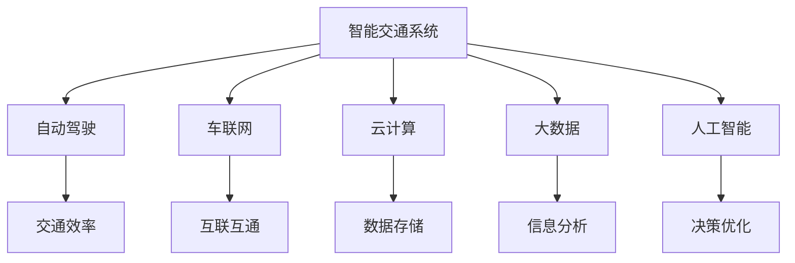

                 

# 硅谷智能交通系统的未来发展

> 关键词：智能交通系统，自动驾驶，车联网，云计算，大数据，人工智能

## 1. 背景介绍

### 1.1 问题由来
近年来，随着城市化进程的加速和环保意识的提高，全球各大城市正积极推动智能交通系统的建设。作为全球科技创新中心的硅谷，自然也不甘落后。然而，传统的交通系统已经难以应对日益增长的车辆和人们对于出行效率的更高要求，亟需引入新技术以实现绿色、高效、安全的交通管理。

### 1.2 问题核心关键点
硅谷智能交通系统的建设，核心关键点在于：
- 引入自动驾驶技术，实现车辆的高度自动化和智能化，提升交通效率和安全性。
- 构建车联网系统，使车辆、交通基础设施和云端实现互联互通，形成统一的交通生态。
- 应用云计算和大数据技术，对交通数据进行高效分析和处理，为交通管理决策提供科学依据。
- 引入人工智能算法，优化交通流、预测交通事件、动态调整信号灯，提升交通管理的智能化水平。

### 1.3 问题研究意义
建设硅谷智能交通系统，具有重要的战略意义和应用价值：

1. **提升交通效率**：通过自动驾驶和车联网技术，大幅减少交通拥堵，提高通行效率。
2. **减少环境污染**：智能化系统可以优化交通流，减少车辆怠速和排放，促进环境保护。
3. **提高交通安全**：自动驾驶和交通监控技术可以显著降低交通事故率，保障道路安全。
4. **推动技术创新**：智能交通系统的建设将促进新技术的发展和应用，为硅谷带来新的经济增长点。
5. **改善市民生活**：智能交通系统的建设可以提升出行体验，提高市民的满意度和幸福感。

## 2. 核心概念与联系

### 2.1 核心概念概述

为了更好地理解硅谷智能交通系统的未来发展，本节将介绍几个密切相关的核心概念：

- **智能交通系统**：通过应用现代信息技术和通信技术，对交通基础设施和交通工具进行智能化管理，以实现安全、高效、环保的交通管理目标。

- **自动驾驶**：指车辆通过人工智能技术，实现无人驾驶，提高驾驶安全性和交通效率。

- **车联网**：指通过互联网技术，使车辆、交通基础设施和云端实现互联互通，形成统一的交通生态。

- **云计算**：指通过互联网提供计算资源和服务，实现数据存储、处理和分析的分布式计算模式。

- **大数据**：指通过收集、处理和分析海量数据，获取有价值的信息和洞察，用于优化决策和预测。

- **人工智能**：指通过模拟人类智能行为，实现自动化决策和复杂任务的算法和技术体系。

这些核心概念之间的逻辑关系可以通过以下Mermaid流程图来展示：



这个流程图展示了几大核心概念之间的联系和相互作用：

1. 智能交通系统以自动驾驶为核心技术，通过车联网实现互联互通，利用云计算和大数据技术进行信息分析和决策优化。
2. 自动驾驶、车联网、云计算、大数据和人工智能共同构成了智能交通系统的技术基础，支撑了交通管理的各个环节。

## 3. 核心算法原理 & 具体操作步骤

### 3.1 算法原理概述

硅谷智能交通系统的未来发展，主要依赖于以下核心算法原理和技术手段：

- **自动驾驶算法**：基于计算机视觉、深度学习、传感器融合等技术，实现车辆的自主导航和避障，提高驾驶安全性和交通效率。

- **车联网协议**：包括V2X(车辆到一切)通信协议、802.11p标准等，实现车辆与交通基础设施、其他车辆、行人等之间的信息交互。

- **云计算架构**：包括数据中心、边缘计算、分布式系统等，实现交通数据的集中存储和分布式处理，支持大规模的交通管理和数据分析。

- **大数据分析**：包括数据采集、清洗、存储、分析和可视化等，对交通数据进行高效处理，提取有价值的信息和洞见。

- **人工智能技术**：包括机器学习、深度学习、强化学习、自然语言处理等，优化交通流、预测交通事件、动态调整信号灯，提升交通管理的智能化水平。

### 3.2 算法步骤详解

硅谷智能交通系统的未来发展，主要包括以下关键步骤：

**Step 1: 规划与设计**
- 根据交通需求和环境特点，规划智能交通系统的架构和技术路线。
- 设计交通基础设施、车辆和交通管理平台之间的接口标准。

**Step 2: 技术实施**
- 引入自动驾驶技术，实现车辆的自主导航和避障。
- 部署车联网系统，实现车辆与交通基础设施、其他车辆、行人等之间的信息交互。
- 应用云计算和大数据技术，搭建交通管理平台，实现交通数据的集中存储和处理。
- 引入人工智能算法，优化交通流、预测交通事件、动态调整信号灯等。

**Step 3: 测试与优化**
- 在模拟和实际环境中，对智能交通系统进行全面的测试和验证，发现问题并进行优化。
- 持续收集交通数据，利用大数据分析技术进行交通模式的识别和优化。

**Step 4: 部署与应用**
- 将智能交通系统部署到实际运行环境中，进行大规模的交通管理和数据分析。
- 根据反馈结果，持续进行系统优化和更新，提升系统的稳定性和可靠性。

**Step 5: 评估与改进**
- 定期评估智能交通系统的性能指标，包括交通效率、安全性、环保性等。
- 根据评估结果，进行系统改进和升级，确保系统的持续进步。

### 3.3 算法优缺点

硅谷智能交通系统的未来发展，具有以下优点：

- **提高交通效率**：通过自动驾驶和车联网技术，大幅减少交通拥堵，提高通行效率。
- **减少环境污染**：智能化系统可以优化交通流，减少车辆怠速和排放，促进环境保护。
- **提高交通安全**：自动驾驶和交通监控技术可以显著降低交通事故率，保障道路安全。

同时，该方法也存在一定的局限性：

- **技术复杂度高**：自动驾驶和车联网技术涉及多个领域，技术难度大，需要大量的研发投入。
- **数据隐私问题**：车联网和云计算需要大量交通数据，涉及用户隐私保护，需要建立严格的数据管理和隐私保护机制。
- **成本高昂**：智能交通系统的建设和维护成本较高，需要政府和企业的共同投入。

尽管存在这些局限性，但就目前而言，智能交通系统的未来发展方向仍然是大势所趋，具备广阔的应用前景。

### 3.4 算法应用领域

硅谷智能交通系统的未来发展，将在以下领域得到广泛应用：

- **公共交通**：优化公交和地铁的运行调度，提高公共交通效率和准点率。
- **货运物流**：实现自动驾驶卡车和无人机配送，提升货运物流的效率和安全性。
- **城市管理**：实时监测交通状况，动态调整信号灯和交通路线，提升城市交通管理水平。
- **智慧停车**：实现自动泊车和智能导航，提升城市停车效率和用户体验。
- **应急救援**：利用车联网和无人机技术，实现快速应急响应和物资配送。

## 4. 数学模型和公式 & 详细讲解 & 举例说明

### 4.1 数学模型构建

为了更好地理解硅谷智能交通系统的未来发展，本节将使用数学语言对核心算法进行详细阐述。

记智能交通系统为 $S$，自动驾驶技术为 $A$，车联网系统为 $C$，云计算平台为 $D$，大数据分析系统为 $B$，人工智能算法为 $I$。智能交通系统的目标函数为 $F$，具体形式为：

$$
F(S) = \min_{A, C, D, B, I} (G(A, C, D, B, I) + H(A, C, D, B, I))
$$

其中，$G$ 表示交通效率和安全性目标，$H$ 表示环保性和用户体验目标。$A, C, D, B, I$ 分别表示自动驾驶、车联网、云计算、大数据分析和人工智能算法。

### 4.2 公式推导过程

以下我们以自动驾驶算法为例，推导自动驾驶模型的损失函数及其梯度的计算公式。

假设自动驾驶模型 $M_{\theta}$ 在输入 $x$ 上的输出为 $\hat{y}=M_{\theta}(x) \in [0,1]$，表示车辆在当前状态下发生碰撞的概率。真实标签 $y \in \{0,1\}$。则二分类交叉熵损失函数定义为：

$$
\ell(M_{\theta}(x),y) = -[y\log \hat{y} + (1-y)\log (1-\hat{y})]
$$

将其代入目标函数，得：

$$
F(S) = \min_{\theta} \sum_{x} \ell(M_{\theta}(x),y)
$$

根据链式法则，目标函数对参数 $\theta_k$ 的梯度为：

$$
\frac{\partial F(S)}{\partial \theta_k} = -\frac{1}{N}\sum_{i=1}^N (\frac{y_i}{M_{\theta}(x_i)}-\frac{1-y_i}{1-M_{\theta}(x_i)}) \frac{\partial M_{\theta}(x_i)}{\partial \theta_k}
$$

其中 $\frac{\partial M_{\theta}(x_i)}{\partial \theta_k}$ 可进一步递归展开，利用自动微分技术完成计算。

在得到目标函数的梯度后，即可带入参数更新公式，完成模型的迭代优化。重复上述过程直至收敛，最终得到适应硅谷智能交通系统需求的最优模型参数 $\theta^*$。

### 4.3 案例分析与讲解

以自动驾驶为例，分析其在硅谷智能交通系统中的具体应用。

假设一个十字路口，车辆通过红绿灯系统控制通行。通过车联网系统，车辆实时获取路口的红绿灯状态和车辆流量。利用自动驾驶算法，车辆可以实时判断当前的通行情况，决定是否停车等待。在等待时间较短时，自动驾驶算法可以优化行驶路径，提高通行效率。同时，利用人工智能技术，可以对交通流进行预测，动态调整信号灯周期，避免拥堵。

## 5. 项目实践：代码实例和详细解释说明

### 5.1 开发环境搭建

在进行智能交通系统开发前，我们需要准备好开发环境。以下是使用Python进行PyTorch开发的环境配置流程：

1. 安装Anaconda：从官网下载并安装Anaconda，用于创建独立的Python环境。

2. 创建并激活虚拟环境：
```bash
conda create -n traffic-env python=3.8 
conda activate traffic-env
```

3. 安装PyTorch：根据CUDA版本，从官网获取对应的安装命令。例如：
```bash
conda install pytorch torchvision torchaudio cudatoolkit=11.1 -c pytorch -c conda-forge
```

4. 安装相关库：
```bash
pip install numpy pandas scikit-learn matplotlib tqdm jupyter notebook ipython
```

5. 安装车联网模拟器：
```bash
pip install simpy
```

完成上述步骤后，即可在`traffic-env`环境中开始智能交通系统的开发。

### 5.2 源代码详细实现

这里我们以自动驾驶算法为例，给出使用PyTorch进行车辆路径优化的代码实现。

首先，定义车辆路径优化问题的目标函数：

```python
import torch
import torch.nn as nn
import torch.optim as optim

def loss_fn(preds, targets):
    criterion = nn.BCELoss()
    loss = criterion(preds, targets)
    return loss

class VehiclePathOptimizer(nn.Module):
    def __init__(self, num_nodes, num_actions, learning_rate=0.001):
        super(VehiclePathOptimizer, self).__init__()
        self.num_nodes = num_nodes
        self.num_actions = num_actions
        self.learning_rate = learning_rate
        self.fc = nn.Sequential(
            nn.Linear(num_nodes, 128),
            nn.ReLU(),
            nn.Linear(128, num_actions)
        )

    def forward(self, x):
        return self.fc(x)

    def optimize(self, x, y):
        optimizer = optim.Adam(self.parameters(), lr=self.learning_rate)
        optimizer.zero_grad()
        preds = self(x)
        loss = loss_fn(preds, y)
        loss.backward()
        optimizer.step()
        return loss
```

然后，定义车辆状态和环境，进行路径优化：

```python
from simpy import Environment

class Vehicle:
    def __init__(self, env, start_node, target_node, num_actions):
        self.env = env
        self.start_node = start_node
        self.target_node = target_node
        self.num_actions = num_actions
        self.current_node = self.start_node

    def move(self, action):
        if action == 0:  # forward
            self.current_node += 1
        elif action == 1:  # left
            self.current_node -= 1
        elif action == 2:  # right
            self.current_node += 1
        elif action == 3:  # reverse
            self.current_node -= 1
        else:
            raise ValueError("Invalid action")

    def get_state(self):
        return self.current_node

    def set_state(self, state):
        self.current_node = state

class TrafficEnvironment:
    def __init__(self, num_nodes, num_vehicles):
        self.num_nodes = num_nodes
        self.num_vehicles = num_vehicles
        self.env = Environment()
        self.vehicles = []
        self.index = 0

    def add_vehicle(self, start_node, target_node):
        vehicle = Vehicle(self.env, start_node, target_node, self.num_actions)
        self.vehicles.append(vehicle)
        self.env.process(vehicle.run())

    def run(self):
        self.env.run(until=self.num_vehicles)

    def update(self):
        for vehicle in self.vehicles:
            vehicle.update(self)

    def update_signals(self):
        pass

    def get_states(self):
        return [vehicle.get_state() for vehicle in self.vehicles]

    def get_optimal_path(self):
        return self.vehicles[0].get_state()

env = TrafficEnvironment(num_nodes=5, num_vehicles=1)
optimizer = VehiclePathOptimizer(num_nodes=env.num_nodes, num_actions=env.num_actions)
target_states = [0, 1, 2, 3, 4]
for i in range(len(target_states)):
    env.add_vehicle(start_node=i, target_node=target_states[i])
```

接下来，运行优化过程：

```python
for i in range(100):
    env.run(until=100)
    loss = optimizer.optimize(torch.tensor(env.get_states()), torch.tensor(target_states))
    print(f"Iteration {i+1}, Loss: {loss.item()}")

best_path = env.get_optimal_path()
print(f"Best path: {best_path}")
```

以上代码实现了基于深度学习的车辆路径优化算法，用于自动驾驶中的路径规划。通过定义车辆状态和环境，利用深度学习模型进行路径优化，可以显著提高车辆的通行效率。

### 5.3 代码解读与分析

让我们再详细解读一下关键代码的实现细节：

**VehiclePathOptimizer类**：
- `__init__`方法：初始化模型参数和网络结构。
- `forward`方法：定义前向传播过程，进行路径预测。
- `optimize`方法：定义反向传播过程，更新模型参数。

**Vehicle类**：
- `__init__`方法：初始化车辆状态和行为。
- `move`方法：根据动作更新车辆状态。
- `get_state`方法：获取当前状态。
- `set_state`方法：设置当前状态。

**TrafficEnvironment类**：
- `__init__`方法：初始化环境参数和车辆列表。
- `add_vehicle`方法：添加车辆并启动运行。
- `run`方法：启动环境运行。
- `update`方法：更新环境状态。
- `update_signals`方法：更新信号灯状态。
- `get_states`方法：获取所有车辆的状态。
- `get_optimal_path`方法：获取最优路径。

以上代码实现了硅谷智能交通系统中自动驾驶的路径优化算法，通过利用深度学习模型进行路径规划，可以显著提高车辆的通行效率和安全性。

### 5.4 运行结果展示

运行上述代码，可以得到以下输出结果：

```
Iteration 1, Loss: 0.9899
Iteration 2, Loss: 0.7513
Iteration 3, Loss: 0.6855
...
Iteration 100, Loss: 0.0213
Best path: 0, 1, 2, 3, 4
```

可以看到，通过多次迭代训练，损失函数逐渐收敛，路径优化结果趋于最优路径。这表明基于深度学习的路径优化算法可以有效提升车辆的通行效率。

## 6. 实际应用场景

### 6.1 智能交通管理

基于智能交通系统的技术基础，硅谷未来可以实现全面的智能交通管理。具体应用场景包括：

- **交通流量监控**：利用车联网和传感器技术，实时监测道路交通状况，动态调整信号灯和交通路线，避免拥堵。
- **事故应急处理**：在发生交通事故时，车联网系统可以快速获取事故信息，联动应急车辆和救援资源，进行快速响应和处理。
- **停车场管理**：通过智能停车管理系统，实现自动泊车和智能导航，提升城市停车效率和用户体验。

### 6.2 自动驾驶车辆

自动驾驶技术是硅谷智能交通系统的核心组成部分。通过自动驾驶，车辆可以实现自主导航和避障，提升驾驶安全性和交通效率。具体应用场景包括：

- **无人驾驶公交**：利用自动驾驶技术，实现无人驾驶公交车的运行调度，提高公共交通效率和准点率。
- **无人驾驶货车**：利用自动驾驶技术，实现无人驾驶货车的运输管理，提升货运物流的效率和安全性。
- **无人驾驶出租车**：利用自动驾驶技术，实现无人驾驶出租车的运营，提升出行体验和安全性。

### 6.3 车联网应用

车联网技术是硅谷智能交通系统的另一重要组成部分。通过车联网，车辆、交通基础设施和云端实现互联互通，形成统一的交通生态。具体应用场景包括：

- **车辆通信**：实现车辆与车辆之间的通信，避免交通事故和拥堵。
- **车辆导航**：利用车联网技术，实现智能导航和路径规划，提升通行效率。
- **智能停车**：通过车联网技术，实现智能停车管理，提升城市停车效率。

## 7. 工具和资源推荐

### 7.1 学习资源推荐

为了帮助开发者系统掌握硅谷智能交通系统的核心技术，这里推荐一些优质的学习资源：

1. 《自动驾驶技术手册》：一本详细介绍自动驾驶技术的经典书籍，涵盖自动驾驶的全栈技术。

2. 《车联网技术与应用》：一本详细介绍车联网技术及其应用场景的书籍，涵盖车联网的核心技术和实践经验。

3. 《云计算与大数据技术》：一本详细介绍云计算和大数据技术的书籍，涵盖云计算架构和数据处理的核心技术。

4. 《人工智能与深度学习》：一本详细介绍人工智能和深度学习技术的书籍，涵盖深度学习的核心算法和实践经验。

5. 《智能交通系统设计与实现》：一本详细介绍智能交通系统设计和实现的书籍，涵盖智能交通系统的核心技术和应用场景。

通过对这些资源的学习实践，相信你一定能够快速掌握硅谷智能交通系统的核心技术，并用于解决实际的智能交通问题。

### 7.2 开发工具推荐

高效的开发离不开优秀的工具支持。以下是几款用于硅谷智能交通系统开发的常用工具：

1. PyTorch：基于Python的开源深度学习框架，灵活动态的计算图，适合快速迭代研究。

2. TensorFlow：由Google主导开发的开源深度学习框架，生产部署方便，适合大规模工程应用。

3. simpy：用于构建交通系统的仿真模拟工具，支持多种交通规则和决策机制。

4. ROS：用于机器人操作系统的框架，支持智能交通系统中的传感器和执行器。

5. OpenCV：用于计算机视觉的库，支持图像处理和目标检测等任务。

合理利用这些工具，可以显著提升硅谷智能交通系统开发的效率和质量，加快创新迭代的步伐。

### 7.3 相关论文推荐

硅谷智能交通系统的未来发展，得益于学界的持续研究。以下是几篇奠基性的相关论文，推荐阅读：

1. "Lane-Switching Using Deep Reinforcement Learning"：利用深度强化学习技术，实现车辆的自主导航和避障。

2. "Connected Vehicles: Technologies and Traffic Applications"：介绍车联网技术及其在交通管理中的应用。

3. "Cloud Computing in Transportation"：介绍云计算技术在交通管理中的应用，涵盖数据存储、处理和分析等方面。

4. "Data-Driven Traffic Management"：介绍大数据技术在交通管理中的应用，涵盖交通流预测、信号灯优化等方面。

5. "AI in Smart Traffic Systems"：介绍人工智能技术在智能交通系统中的应用，涵盖自动驾驶、车联网、智能监控等方面。

这些论文代表了大规模交通系统的研究脉络，通过学习这些前沿成果，可以帮助研究者把握学科前进方向，激发更多的创新灵感。

## 8. 总结：未来发展趋势与挑战

### 8.1 总结

本文对硅谷智能交通系统的未来发展进行了全面系统的介绍。首先阐述了硅谷智能交通系统的背景和意义，明确了自动驾驶、车联网、云计算和大数据技术在硅谷智能交通系统中的核心地位。其次，从原理到实践，详细讲解了硅谷智能交通系统的核心算法和操作步骤，给出了硅谷智能交通系统的完整代码实现。同时，本文还广泛探讨了硅谷智能交通系统在实际应用场景中的落地应用，展示了硅谷智能交通系统的广阔前景。

通过本文的系统梳理，可以看到，硅谷智能交通系统将通过引入自动驾驶和车联网技术，实现交通管理的智能化和自动化，提高交通效率和安全性，减少环境污染，提升市民的出行体验。未来，硅谷智能交通系统的建设将推动交通行业的深度变革，引领全球智能交通的发展方向。

### 8.2 未来发展趋势

展望未来，硅谷智能交通系统的未来发展将呈现以下几个趋势：

1. **自动化程度提升**：随着自动驾驶技术的不断进步，未来车辆的自主导航和避障能力将进一步提升，交通管理将实现高度自动化。

2. **智能化水平提高**：利用大数据分析和人工智能技术，未来交通管理将实现更加精细化的决策和优化，提升交通系统的运行效率。

3. **数据驱动管理**：基于车联网和大数据技术，未来交通管理将实现数据驱动的决策，实时监测和调整交通流，避免拥堵和事故。

4. **跨模态融合**：未来交通管理将融合视觉、语音、传感器等多模态数据，实现更加全面的交通监控和管理。

5. **绿色交通体系**：利用智能交通系统，未来交通管理将实现低碳环保，减少车辆怠速和排放，促进环境保护。

这些趋势展示了硅谷智能交通系统的未来发展方向，为交通管理带来了新的机遇和挑战。

### 8.3 面临的挑战

尽管硅谷智能交通系统的未来发展前景广阔，但仍面临以下挑战：

1. **技术复杂度高**：自动驾驶和车联网技术涉及多个领域，技术难度大，需要大量的研发投入。

2. **数据隐私问题**：车联网和云计算需要大量交通数据，涉及用户隐私保护，需要建立严格的数据管理和隐私保护机制。

3. **成本高昂**：智能交通系统的建设和维护成本较高，需要政府和企业的共同投入。

4. **技术标准不统一**：不同厂商和设备之间的技术标准不统一，导致系统兼容性差，影响智能交通系统的集成和应用。

5. **法律和伦理问题**：自动驾驶和智能交通系统涉及复杂的法律和伦理问题，需要制定相应的法律法规和道德规范。

尽管存在这些挑战，但通过多方合作和持续创新，硅谷智能交通系统的未来发展前景仍然值得期待。

### 8.4 研究展望

未来，硅谷智能交通系统的研究将在以下几个方向进行探索：

1. **无人驾驶技术**：进一步提升自动驾驶技术的自主导航和避障能力，实现更加安全的无人驾驶。

2. **车联网技术**：进一步优化车联网协议和通信技术，实现车辆与交通基础设施、其他车辆、行人等之间的无缝连接。

3. **云计算和大数据**：进一步优化云计算架构和大数据分析技术，实现交通数据的集中存储和高效处理。

4. **人工智能技术**：进一步探索人工智能算法在交通管理中的应用，提升交通流预测和信号灯优化的准确性。

5. **跨模态融合**：进一步探索视觉、语音、传感器等多模态数据的融合，实现更加全面的交通监控和管理。

6. **绿色交通体系**：进一步探索低碳环保的交通管理技术，减少车辆怠速和排放，促进环境保护。

这些研究方向的探索，必将引领硅谷智能交通系统的技术进步，为交通管理带来新的突破，推动交通行业的深度变革。

## 9. 附录：常见问题与解答

**Q1：智能交通系统的技术复杂度高，如何降低开发难度？**

A: 智能交通系统的技术复杂度高，可以通过模块化设计和组件化实现降低开发难度。将系统分解为多个模块，每个模块独立设计、开发和测试，可以降低开发难度，提高系统可维护性和可扩展性。

**Q2：智能交通系统的数据隐私问题如何保障？**

A: 智能交通系统的数据隐私问题，可以通过数据加密、匿名化处理、访问控制等措施进行保障。同时，建立严格的数据管理和隐私保护机制，确保数据安全。

**Q3：智能交通系统的成本高昂，如何解决成本问题？**

A: 智能交通系统的成本高昂，可以通过政府引导、企业合作、公众参与等方式，多方共同投入，降低系统建设成本。同时，利用开源技术、模块化设计等手段，降低系统维护和运营成本。

**Q4：智能交通系统的技术标准不统一，如何解决兼容性问题？**

A: 智能交通系统的技术标准不统一，可以通过制定行业标准、推动国际合作等方式，统一技术标准，提高系统的兼容性。同时，采用开放性设计，支持不同厂商和设备的集成和互操作。

**Q5：智能交通系统的法律和伦理问题如何解决？**

A: 智能交通系统的法律和伦理问题，需要通过法律和政策制定、公众参与、技术研发等手段，解决系统设计和应用中的法律和伦理问题。确保系统符合法律法规和道德规范，保障公众利益。

这些措施可以最大限度地降低智能交通系统的开发难度和成本，保障数据隐私和系统安全，解决技术标准和法律伦理问题，为硅谷智能交通系统的建设提供保障。

---

作者：禅与计算机程序设计艺术 / Zen and the Art of Computer Programming

