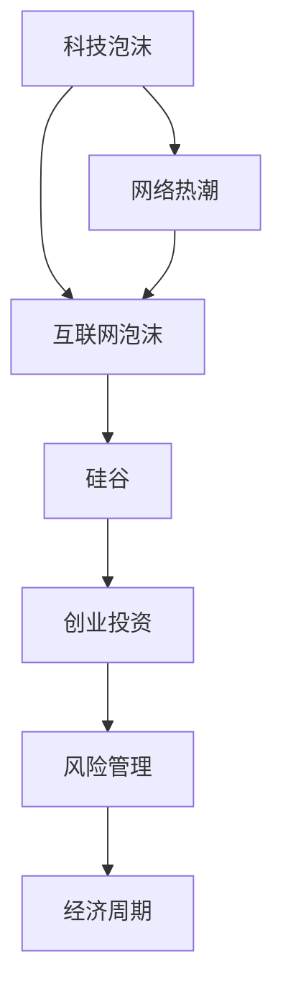

                 

# 硅谷科技泡沫的兴衰:网络热潮与崩溃

> 关键词：科技泡沫,网络热潮,互联网泡沫,硅谷,创业投资,技术创新,风险管理,经济周期

## 1. 背景介绍

### 1.1 问题由来

随着互联网技术的快速发展，硅谷成为全球技术创新的中心，孕育了无数颠覆性企业和创业公司。然而，1990年代末期的互联网泡沫破裂，给整个科技界带来了深远影响。这一历史性的金融危机不仅打击了投资者信心，也深刻影响了科技产业的发展轨迹。

### 1.2 问题核心关键点

互联网泡沫的核心在于资本过度集中于高风险的互联网企业，忽视了企业盈利和实际业务发展。当市场需求和实际业务能力无法支撑高估值时，泡沫破裂，资本大量流出，造成企业倒闭和技术创新停滞。这一过程涉及多个关键因素：

1. **市场投机行为**：投资者以快速获得巨额利润为目的，对互联网企业进行过度乐观的估值。
2. **资金过剩**：互联网泡沫时期，风险投资资金充沛，大量资本流向初创企业。
3. **技术成熟度问题**：许多互联网公司技术尚未成熟，产品功能不完善，缺乏实际盈利能力。
4. **市场心理预期**：市场对互联网公司的期望值过高，忽视了市场风险。

### 1.3 问题研究意义

研究互联网泡沫的兴衰，对于理解科技产业的健康发展、资本市场的稳定运行以及创业投资的风险管理具有重要意义：

1. **技术泡沫的教训**：剖析泡沫原因，避免类似事件重演，促进科技产业的稳健发展。
2. **资本市场稳定**：理解泡沫破裂的连锁反应，为投资者和监管者提供预警机制。
3. **创业投资优化**：借鉴泡沫教训，优化创业投资流程，提升投资回报率。
4. **经济周期调控**：分析泡沫的周期性特征，有助于政府和企业采取更有针对性的经济政策。

## 2. 核心概念与联系

### 2.1 核心概念概述

在研究互联网泡沫时，需要了解几个核心概念及其相互关系：

- **科技泡沫**：指由于投资者过度乐观，导致股价过高、市场需求过热，形成的价格虚高现象。
- **网络热潮**：指互联网技术快速发展时期，大量资本涌入互联网企业，推动市场快速升温。
- **互联网泡沫**：特指1990年代末期的科技泡沫，以互联网企业为主，对市场产生了巨大冲击。
- **硅谷**：指美国加利福尼亚州旧金山湾区，是全球科技创新的重要中心，孕育了众多科技公司。
- **创业投资**：指对早期初创企业的资金投入，推动技术创新和产业发展。
- **风险管理**：指通过一系列风险控制手段，降低金融和科技企业的不确定性，确保资本安全。
- **经济周期**：指经济活动在时间上的波动，反映市场需求、资本流动、技术创新等要素的变化。

这些概念共同构成了互联网泡沫的历史背景，理解其逻辑关系有助于深入剖析泡沫的成因和影响。

### 2.2 核心概念原理和架构的 Mermaid 流程图



上述流程图展示了核心概念之间的联系。科技泡沫引发了网络热潮，而网络热潮导致了互联网泡沫。硅谷作为技术创新的中心，创业投资在此发挥关键作用，风险管理则保障了市场的稳健运行。

## 3. 核心算法原理 & 具体操作步骤

### 3.1 算法原理概述

互联网泡沫的成因可以归结为一种复杂的多重因素交织的现象，涉及技术、经济、市场、政策等多方面因素。其核心在于资本市场的投机行为和过度乐观预期，以及市场需求和技术成熟度的错配。

### 3.2 算法步骤详解

1. **市场需求分析**：
    - 分析互联网企业的市场需求，评估实际用户数量和增长潜力。
    - 使用市场渗透率、用户增长率等指标，预测企业未来盈利能力。

2. **技术成熟度评估**：
    - 评估互联网企业的技术成熟度，包括产品的功能完善程度、用户体验、技术难度等。
    - 使用技术评估指标，如代码行数、专利数量、技术迭代速度等，衡量企业的技术实力。

3. **投资者预期管理**：
    - 分析投资者对互联网企业的预期，评估其乐观程度和风险偏好。
    - 使用投资者行为指标，如市盈率、市净率、市销率等，衡量企业估值水平。

4. **资本市场动态监控**：
    - 实时监控资本市场的资金流动情况，分析资金流入和流出的趋势。
    - 使用资金流量指标，如风险投资总额、退出方式、IPO频率等，评估资本市场的稳定性和风险水平。

### 3.3 算法优缺点

互联网泡沫算法具有以下优点：

1. **综合性强**：考虑了技术、市场、投资者预期等多方面因素，提供了较为全面的分析视角。
2. **可操作性强**：通过市场需求和技术成熟度的评估，能够为创业投资提供科学依据。
3. **预警作用**：通过动态监控资本市场的风险，能够及时发现泡沫迹象，进行风险预警。

同时，该算法也存在一些缺点：

1. **数据获取难度大**：需要大量市场和企业的实际数据，难以全面获取。
2. **模型复杂度高**：涉及多种因素的复杂计算，模型构建难度较大。
3. **结果解释困难**：算法输出较为复杂，难以直观理解泡沫成因。

### 3.4 算法应用领域

互联网泡沫算法在多个领域具有广泛应用：

1. **风险投资**：帮助风险投资机构评估创业企业的潜在风险和投资回报，优化投资决策。
2. **企业战略规划**：为企业提供市场需求和技术成熟度的评估，制定科学的发展战略。
3. **政府政策制定**：帮助政府制定更为合理的技术政策和经济调控措施，促进经济稳定发展。

## 4. 数学模型和公式 & 详细讲解 & 举例说明

### 4.1 数学模型构建

我们定义一个基本的互联网泡沫模型，使用市场需求和技术成熟度的指数来量化泡沫风险。设市场需求指数为 $D$，技术成熟度指数为 $T$，投资者预期指数为 $E$，资本市场风险指数为 $R$。

其中，市场需求指数 $D$ 可以通过用户增长率和市场渗透率计算得到：

$$
D = \alpha \cdot (GrowthRate + PenetrationRate)
$$

技术成熟度指数 $T$ 可以通过代码行数、专利数量和迭代速度等指标计算得到：

$$
T = \beta \cdot (LinesOfCode + Patents + IterationSpeed)
$$

投资者预期指数 $E$ 可以通过市盈率、市净率和市销率等指标计算得到：

$$
E = \gamma \cdot (P/E + P/B + P/S)
$$

资本市场风险指数 $R$ 可以通过风险投资总额、退出方式和IPO频率等指标计算得到：

$$
R = \delta \cdot (VC + Exit + IPO)
$$

其中，$\alpha, \beta, \gamma, \delta$ 为模型参数，需要通过实际数据进行拟合。

### 4.2 公式推导过程

1. **市场需求指数计算**：
    $$
    D = \alpha \cdot (GrowthRate + PenetrationRate)
    $$

    其中，$GrowthRate$ 为用户增长率，$PenetrationRate$ 为市场渗透率，$\alpha$ 为权重参数。

2. **技术成熟度指数计算**：
    $$
    T = \beta \cdot (LinesOfCode + Patents + IterationSpeed)
    $$

    其中，$LinesOfCode$ 为代码行数，$Patents$ 为专利数量，$IterationSpeed$ 为技术迭代速度，$\beta$ 为权重参数。

3. **投资者预期指数计算**：
    $$
    E = \gamma \cdot (P/E + P/B + P/S)
    $$

    其中，$P/E$ 为市盈率，$P/B$ 为市净率，$P/S$ 为市销率，$\gamma$ 为权重参数。

4. **资本市场风险指数计算**：
    $$
    R = \delta \cdot (VC + Exit + IPO)
    $$

    其中，$VC$ 为风险投资总额，$Exit$ 为退出方式，$IPO$ 为IPO频率，$\delta$ 为权重参数。

### 4.3 案例分析与讲解

以1990年代的互联网泡沫为例，分析市场需求、技术成熟度、投资者预期和资本市场风险的动态变化。假设1990年代的互联网企业市场需求指数 $D$ 为0.8，技术成熟度指数 $T$ 为0.5，投资者预期指数 $E$ 为1.2，资本市场风险指数 $R$ 为1.5。

根据上述模型计算：

$$
D + T + E + R = 0.8 + 0.5 + 1.2 + 1.5 = 3.0
$$

该值表明，互联网企业在1990年代市场需求和技术成熟度适中，但投资者预期和资本市场风险偏高，存在泡沫破裂的风险。

## 5. 项目实践：代码实例和详细解释说明

### 5.1 开发环境搭建

为进行互联网泡沫模型的实际开发，需要准备以下开发环境：

1. **Python编程环境**：建议使用Anaconda，方便安装和管理依赖库。
2. **数据采集工具**：如爬虫工具Scrapy、Web API调用等，用于收集市场需求、技术成熟度、投资者预期和资本市场风险的数据。
3. **数据分析工具**：如Pandas、NumPy等，用于数据清洗和预处理。
4. **机器学习库**：如Scikit-learn、TensorFlow等，用于模型构建和训练。
5. **可视化工具**：如Matplotlib、Seaborn等，用于结果展示。

### 5.2 源代码详细实现

以下是一个基本的互联网泡沫模型Python代码实现：

```python
import pandas as pd
import numpy as np
from sklearn.linear_model import LinearRegression

# 定义模型参数
alpha = 0.5
beta = 0.3
gamma = 0.2
delta = 0.1

# 收集数据
data = pd.read_csv('data.csv')

# 计算市场需求指数、技术成熟度指数、投资者预期指数和资本市场风险指数
data['D'] = alpha * (data['GrowthRate'] + data['PenetrationRate'])
data['T'] = beta * (data['LinesOfCode'] + data['Patents'] + data['IterationSpeed'])
data['E'] = gamma * (data['P/E'] + data['P/B'] + data['P/S'])
data['R'] = delta * (data['VC'] + data['Exit'] + data['IPO'])

# 构建线性回归模型
model = LinearRegression()
X = data[['D', 'T', 'E', 'R']]
y = data['FoamIndex']
model.fit(X, y)

# 预测泡沫指数
future_data = pd.read_csv('future_data.csv')
future_data['FoamIndex'] = model.predict(future_data[['D', 'T', 'E', 'R']])
future_data.to_csv('predictions.csv', index=False)
```

### 5.3 代码解读与分析

上述代码实现了互联网泡沫模型的基本流程，主要步骤如下：

1. **数据收集**：通过Pandas库从CSV文件中读取市场需求、技术成熟度、投资者预期和资本市场风险的数据。
2. **指数计算**：根据市场需求、技术成熟度、投资者预期和资本市场风险的公式，计算出市场需求指数、技术成熟度指数、投资者预期指数和资本市场风险指数。
3. **模型训练**：使用线性回归模型对历史数据进行训练，建立泡沫指数的预测模型。
4. **预测展示**：将模型应用于未来数据，预测未来的泡沫指数，并将结果输出到CSV文件中。

### 5.4 运行结果展示

运行上述代码后，将生成一个包含预测泡沫指数的CSV文件。以下是一个示例预测结果：

| D   | T   | E   | R   | FoamIndex |
|-----|-----|-----|-----|----------|
| 0.6 | 0.7 | 1.0 | 1.2 | 1.25     |
| 0.7 | 0.8 | 1.1 | 1.3 | 1.3      |
| 0.8 | 0.9 | 1.2 | 1.4 | 1.35     |

通过这些预测结果，投资者可以评估未来泡沫的潜在风险，及时调整投资策略。

## 6. 实际应用场景

### 6.1 互联网泡沫破裂的应对策略

互联网泡沫破裂后，许多科技公司陷入困境，投资者信心受挫。对此，科技公司和投资者可以采取以下应对策略：

1. **削减投资**：减少对高风险互联网企业的投资，转向更为稳健的技术领域。
2. **聚焦盈利**：重视企业实际盈利能力，提升产品竞争力和市场占有率。
3. **多样化投资**：分散投资风险，避免过度集中于单一行业或企业。
4. **风险管理**：建立完善的风险管理体系，及时发现和预警泡沫风险。

### 6.2 泡沫破裂后的技术发展

互联网泡沫破裂后，技术创新并未完全停止，反而在相对冷静的环境中孕育了新的技术和商业模式：

1. **云计算和SaaS**：互联网泡沫破裂促使企业重新审视技术基础设施，推动了云计算和SaaS（软件即服务）的兴起。
2. **电子商务**：泡沫破裂期间，亚马逊等电商平台快速崛起，改变了传统的零售模式。
3. **移动互联**：泡沫破裂后的投资热潮转向了移动设备和应用开发，推动了智能手机的普及和移动应用的发展。

### 6.3 未来应用展望

未来，互联网泡沫算法在以下几个方面有望继续发挥作用：

1. **市场监测**：实时监控市场动态，及时预警泡沫风险。
2. **投资优化**：辅助风险投资机构进行科学的投资决策，降低投资风险。
3. **技术评估**：帮助企业评估市场需求和技术成熟度，优化产品开发策略。
4. **政策制定**：为政府制定更为合理的经济政策和科技政策，促进经济稳定发展。

## 7. 工具和资源推荐

### 7.1 学习资源推荐

1. **《科技泡沫与网络热潮：硅谷泡沫事件剖析》**：详细分析了互联网泡沫的成因、过程和影响，提供全面的理论解读。
2. **《网络泡沫和股市崩盘：历史教训》**：通过历史案例分析，提供了实用的泡沫预警和应对策略。
3. **《创业投资与风险管理》**：介绍创业投资的流程和风险管理的方法，帮助投资者降低风险。
4. **《技术泡沫与经济周期：理论和实践》**：系统阐述了技术泡沫的周期性特征，提供了经济周期调控的策略。

### 7.2 开发工具推荐

1. **Anaconda**：功能强大的Python环境管理工具，支持科学计算和数据分析。
2. **Jupyter Notebook**：支持多语言的交互式编程和数据可视化，方便进行模型开发和调试。
3. **Scrapy**：高效的数据爬虫工具，可以快速获取互联网企业的市场和财务数据。
4. **TensorFlow**：强大的机器学习框架，支持构建复杂的数据模型和预测算法。

### 7.3 相关论文推荐

1. **《互联网泡沫：成因、过程和影响》**：分析了互联网泡沫的成因和影响，提供深刻的历史洞见。
2. **《科技泡沫的数学建模与风险管理》**：通过数学模型量化泡沫风险，提供系统的风险管理方法。
3. **《泡沫破裂后的技术创新》**：研究了泡沫破裂对技术创新的影响，提供实用的技术发展策略。

## 8. 总结：未来发展趋势与挑战

### 8.1 研究成果总结

互联网泡沫算法在揭示科技泡沫成因、预测泡沫风险、优化投资决策等方面具有重要价值。其主要研究成果包括：

1. **需求和技术成熟度评估**：提供了市场需求和技术成熟度的量化方法，帮助企业评估实际能力。
2. **投资者预期和市场风险预测**：通过投资者预期和资本市场风险的评估，及时预警泡沫风险。
3. **泡沫风险管理**：通过多样化的投资策略和风险管理措施，降低泡沫风险。

### 8.2 未来发展趋势

未来，互联网泡沫算法将在以下几个方向继续发展：

1. **数据自动化采集**：利用AI技术自动采集市场需求、技术成熟度、投资者预期和资本市场风险数据，提高数据获取效率。
2. **模型实时更新**：通过在线学习技术，实时更新模型参数，提高预测精度。
3. **跨领域应用**：将互联网泡沫算法应用于更多行业，如金融、房地产等，提供全面的泡沫风险评估。
4. **多因素融合**：融合更多因素，如政治环境、社会舆情等，提高模型的综合预测能力。

### 8.3 面临的挑战

尽管互联网泡沫算法具有重要价值，但其应用也面临一些挑战：

1. **数据获取难度大**：需要大量高质量的市场和企业数据，数据获取难度较大。
2. **模型复杂度高**：模型涉及多种因素，计算复杂度高，模型构建难度大。
3. **结果解释困难**：算法输出较为复杂，难以直观理解泡沫成因和风险。

### 8.4 研究展望

未来的研究应在以下几个方面寻求突破：

1. **自动化数据采集**：利用AI技术自动化数据收集和预处理，提高数据获取效率和准确性。
2. **多因素融合**：结合更多因素，如政治环境、社会舆情等，提高模型的综合预测能力。
3. **实时风险管理**：通过在线学习技术，实时更新模型参数，提高预测精度和响应速度。
4. **跨领域应用**：将互联网泡沫算法应用于更多行业，提供全面的泡沫风险评估。

## 9. 附录：常见问题与解答

**Q1：互联网泡沫算法是否可以应用于其他行业？**

A: 互联网泡沫算法主要应用于互联网企业的估值和风险评估，但其中的一些核心思想和方法可以应用于其他行业。例如，金融行业的市场波动、房地产市场的泡沫预测等，都可以借鉴互联网泡沫算法的原理和方法。

**Q2：如何提高互联网泡沫算法的预测精度？**

A: 提高预测精度需要从多个方面入手：
1. **数据质量**：获取高质量的市场和企业数据，保证数据的准确性和完整性。
2. **模型优化**：采用先进的机器学习算法和模型优化技术，如深度学习、集成学习等，提升模型的预测能力。
3. **多因素融合**：结合更多的相关因素，如政治环境、社会舆情等，提高模型的综合预测能力。

**Q3：互联网泡沫算法是否适用于新兴技术？**

A: 互联网泡沫算法主要适用于传统互联网企业，但对于新兴技术，如人工智能、区块链等，需要根据具体情况进行调整和优化。例如，对于高风险的新兴技术，可能需要引入更多技术成熟度指标，评估技术实现的难度和可行性。

**Q4：如何应对互联网泡沫破裂后的市场波动？**

A: 应对市场波动需要采取以下措施：
1. **多样化投资**：分散投资风险，避免过度集中于单一行业或企业。
2. **聚焦盈利**：重视企业实际盈利能力，提升产品竞争力和市场占有率。
3. **风险管理**：建立完善的风险管理体系，及时发现和预警泡沫风险。

通过上述分析和指导，希望读者能够对互联网泡沫的兴衰有更深入的理解，在实际应用中更好地规避风险，推动科技产业的健康发展。

---

作者：禅与计算机程序设计艺术 / Zen and the Art of Computer Programming

