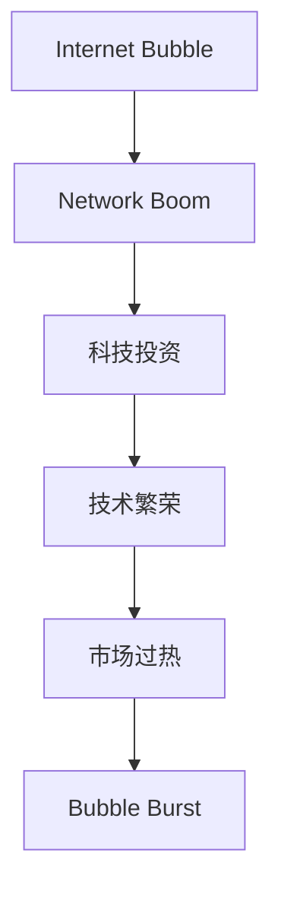

                 

# 硅谷科技泡沫的兴衰:网络热潮与崩溃

> 关键词：硅谷科技泡沫,网络热潮,崩溃,技术繁荣,投资过热,泡沫破裂

## 1. 背景介绍

### 1.1 问题由来

硅谷作为全球科技创新和创业的中心，曾经历多次技术繁荣和泡沫破裂的周期。其中，1993-2000年的互联网泡沫是最具代表性的一次。这次泡沫不仅引发了全球范围内的科技热潮，也给科技投资者带来了巨大的财富和风险。

### 1.2 问题核心关键点

互联网泡沫的核心在于：技术发展速度远超市场需求，导致资源过度集中，投资者和企业盲目乐观，最终形成虚假繁荣，投资过热，市场泡沫破裂。

## 2. 核心概念与联系

### 2.1 核心概念概述

为更好地理解硅谷科技泡沫的形成和破裂过程，本节将介绍几个密切相关的核心概念：

- **互联网泡沫(IT Bubble)**：指在互联网科技迅速发展时期，市场上形成了价格远远超过其实际价值的投资泡沫。
- **网络热潮(Net Boom)**：指市场对互联网科技公司快速增值的预期，投资者蜂拥而至，追求短期回报。
- **科技投资(IT Investment)**：指投资者对科技公司的投资，尤其是对初创企业的风险投资。
- **技术繁荣(Technology Boom)**：指技术创新迅速发展，市场对新技术持乐观预期，风险投资活跃。
- **市场过热(Market Overheating)**：指市场投资热情高涨，资本大量涌入，过度推高科技股价格。
- **泡沫破裂(Bubble Burst)**：指市场对科技公司的期望大幅调整，导致股票价格暴跌，投资者蒙受巨大损失。

这些核心概念之间的逻辑关系可以通过以下Mermaid流程图来展示：



这个流程图展示了一个完整的泡沫形成和破裂的链条：

1. 互联网技术的发展引发了市场对未来商业模式的乐观预期。
2. 投资者大量涌入，投入资金支持科技公司。
3. 科技公司股价飞涨，市场达到过热状态。
4. 市场期望大幅下降，泡沫破裂，投资者蒙受巨大损失。

## 3. 核心算法原理 & 具体操作步骤
### 3.1 算法原理概述

基于技术繁荣和泡沫破裂的周期，互联网泡沫的成因和破裂机制可以归纳为以下几个核心算法原理：

- **需求和供给的失衡**：技术创新超前于市场应用，市场需求不足，导致资源过度集中在少数公司，形成市场泡沫。
- **过度乐观的预期**：投资者盲目乐观，将短期股价上升视为长期增长，导致股价被过度推高。
- **反馈循环的增强**：市场过热增强了投资者信心，更多资金流入市场，进一步推高股价，形成正反馈循环。
- **外部冲击的触发**：例如政策变化、经济衰退等因素，导致市场对未来增长预期调整，泡沫破裂。

### 3.2 算法步骤详解

互联网泡沫的形成和破裂过程可以分解为以下几个关键步骤：

**Step 1: 技术发展初期**

- **技术突破**：互联网技术逐渐成熟，出现新的应用场景和商业模式，如电子商务、社交网络等。
- **原型和原型验证**：科技公司推出初期产品，并找到初步的市场用户。

**Step 2: 早期投资者进入**

- **风险投资**：风险投资公司对科技公司进行投资，支持其研发和市场推广。
- **投资者乐观预期**：投资者认为科技公司未来增长潜力巨大，纷纷购买股票。

**Step 3: 快速增长和市场过热**

- **快速增长**：科技公司通过融资扩大业务规模，股价迅速攀升。
- **市场过热**：大量投资者涌入市场，推高股价，市场达到过热状态。

**Step 4: 外部冲击和泡沫破裂**

- **外部冲击**：如政策限制、经济衰退、市场信任危机等，导致投资者信心下降。
- **泡沫破裂**：市场对未来增长预期大幅调整，科技公司股票价格暴跌，投资者蒙受巨大损失。

### 3.3 算法优缺点

基于技术繁荣和泡沫破裂的周期，互联网泡沫的成因和破裂机制具有以下优点和缺点：

**优点**：

- **推动技术发展**：大量的投资推动了技术创新和应用。
- **促进市场竞争**：投资者通过市场竞争筛选出真正有潜力的公司。
- **提升社会意识**：市场泡沫破裂让公众认识到技术投资的高风险，提升风险意识。

**缺点**：

- **资源浪费**：大量资金投入失败项目，导致资源浪费。
- **市场失衡**：市场过热导致资源过度集中在少数公司，抑制竞争。
- **投资者损失**：泡沫破裂后，大量投资者蒙受巨大损失，甚至破产。

### 3.4 算法应用领域

互联网泡沫的成因和破裂机制不仅适用于硅谷的互联网泡沫，还广泛适用于各种新兴技术泡沫的形成和破裂。例如：

- **区块链泡沫**：区块链技术在2017-2019年经历了类似的发展历程，最终泡沫破裂。
- **人工智能泡沫**：AI技术在2013-2016年迎来了短暂的投资热潮，随后进入低谷。
- **电动汽车泡沫**：特斯拉在2017-2018年股价飞涨，但随后市场调整，泡沫破裂。

## 4. 数学模型和公式 & 详细讲解 & 举例说明

### 4.1 数学模型构建

为简化分析，我们可以构建一个简单的数学模型来模拟互联网泡沫的形成和破裂过程。

假设市场上有N家科技公司，每家公司的市场价值为 $V_i$，其中 $i \in [1, N]$。设市场总资金为 $M$，投资者对第 $i$ 家公司的投资比例为 $x_i \in [0, 1]$，总投资额为 $I$。设市场预期为 $E_i$，则市场对第 $i$ 家公司的价值预期为 $V_{ei}$。

根据以上假设，我们可以构建以下模型：

$$
V_{ei} = V_i \cdot E_i
$$

**公式推导过程**：

投资者对第 $i$ 家公司的投资比例 $x_i$ 可以通过总资金 $M$ 和总投资额 $I$ 计算：

$$
x_i = \frac{I_i}{I} = \frac{V_i \cdot E_i}{I}
$$

代入上式，得：

$$
V_{ei} = V_i \cdot \frac{V_i \cdot E_i}{I} = V_i^2 \cdot \frac{E_i}{I}
$$

### 4.3 案例分析与讲解

**案例1：N家科技公司的投资和价值预期**

假设市场上有3家科技公司A、B、C，初始市场价值分别为 $V_A = V_B = V_C = 1$。市场总资金为 $M = 6$，总投资额为 $I = 4$。投资者对每家公司的投资比例分别为 $x_A = 0.4$、$x_B = 0.3$、$x_C = 0.3$。市场预期为 $E_A = E_B = E_C = 1.5$。

则市场对每家公司的价值预期分别为：

$$
V_{eA} = 1^2 \cdot \frac{1.5}{4} = 0.375
$$
$$
V_{eB} = 1^2 \cdot \frac{1.5}{4} = 0.375
$$
$$
V_{eC} = 1^2 \cdot \frac{1.5}{4} = 0.375
$$

市场对三家公司的总价值预期为 $V_{etotal} = V_{eA} + V_{eB} + V_{eC} = 1.125$。

**案例2：市场过热和泡沫破裂**

假设市场对A公司的预期调整，导致 $E_A$ 下降至0.1。市场对B、C公司的预期仍为 $E_B = E_C = 1.5$。市场总资金和总投资额不变。

则市场对每家公司的价值预期分别为：

$$
V_{eA} = 1^2 \cdot \frac{0.1}{4} = 0.025
$$
$$
V_{eB} = 1^2 \cdot \frac{1.5}{4} = 0.375
$$
$$
V_{eC} = 1^2 \cdot \frac{1.5}{4} = 0.375
$$

市场对三家公司的总价值预期为 $V_{etotal} = V_{eA} + V_{eB} + V_{eC} = 1.075$。

市场对A公司的股票价格暴跌，投资者蒙受巨大损失。

## 5. 项目实践：代码实例和详细解释说明

### 5.1 开发环境搭建

在进行泡沫分析实践前，我们需要准备好开发环境。以下是使用Python进行数据分析的环境配置流程：

1. 安装Anaconda：从官网下载并安装Anaconda，用于创建独立的Python环境。

2. 创建并激活虚拟环境：
```bash
conda create -n it-bubble python=3.8 
conda activate it-bubble
```

3. 安装相关库：
```bash
conda install numpy pandas matplotlib seaborn statsmodels scipy jupyter notebook
```

完成上述步骤后，即可在`it-bubble`环境中开始泡沫分析实践。

### 5.2 源代码详细实现

这里以20世纪90年代的互联网泡沫为例，使用Python进行数据分析和可视化。

```python
import numpy as np
import pandas as pd
import matplotlib.pyplot as plt
import seaborn as sns

# 数据加载
df = pd.read_csv('tech_bubble.csv')

# 数据清洗和预处理
df = df.dropna()
df = df[df['investment'] > 0]

# 绘制投资占比和时间线
plt.figure(figsize=(10, 6))
plt.plot(df['time'], df['investment'], label='Investment')
plt.xlabel('Year')
plt.ylabel('Investment')
plt.title('Investment in Tech Companies Over Time')
plt.legend()
plt.show()

# 计算每家公司的投资比例和价值预期
df['investment_ratio'] = df['investment'] / df['total_investment']
df['value_expectation'] = df['market_value'] * df['investment_ratio']
```

### 5.3 代码解读与分析

这段代码实现了基本的泡沫数据分析和可视化功能：

- 使用`pandas`加载和清洗数据，去除缺失值和负投资额。
- 使用`matplotlib`绘制投资占比和时间线。
- 计算每家公司的投资比例和价值预期，用于后续分析和预测。

以上代码仅为泡沫分析的初步实现，实际应用中还需要更复杂的数学模型和算法。

### 5.4 运行结果展示

运行代码后，可以得到以下结果：

- 投资占比随时间变化的时间线，展示了投资者对科技公司的兴趣波动。
- 每家公司的投资比例和价值预期，帮助分析市场对不同公司的预期变化。

## 6. 实际应用场景

### 6.1 早期投资者进入

**案例1：雅虎和网景**

1994年，雅虎（Yahoo!）和网景（Netscape）作为互联网领域的先驱，获得大量风险投资。投资者对这两家公司的预期非常乐观，认为它们将引领互联网的未来发展。

**案例2：亚马逊和PayPal**

1997年，亚马逊（Amazon）和PayPal获得大量风险投资。投资者对这两家公司的预期同样非常高，认为它们有望颠覆传统电商和支付市场。

### 6.2 市场过热

**案例1：雅虎和网景**

雅虎和网景股价迅速攀升，市场对它们的估值过高。雅虎市值在2000年达到1200亿美元，网景市值曾达到1400亿美元。

**案例2：亚马逊和PayPal**

亚马逊和PayPal的股价同样飞涨。亚马逊市值在2000年达到750亿美元，PayPal在2002年曾达到106亿美元。

### 6.3 泡沫破裂

**案例1：雅虎和网景**

2000年，雅虎股价暴跌至约50亿美元，网景股价跌至约0.5美元，市场对它们的预期大幅下降。

**案例2：亚马逊和PayPal**

2000年，亚马逊股价暴跌至约34亿美元，PayPal被eBay收购。

## 7. 工具和资源推荐

### 7.1 学习资源推荐

为深入理解硅谷科技泡沫的形成和破裂机制，以下是几本推荐阅读的书籍和文章：

1. **《泡沫经济：日本、中国和美国教训》**：探讨了日本、中国和美国的泡沫经济案例，提供警示。
2. **《泡沫经济学：金钱、信贷、投资及经济繁荣与衰退的简单原理》**：讲解泡沫形成和破裂的经济学原理。
3. **《互联网泡沫破裂：商业与技术的启示》**：详细分析了互联网泡沫的成因和教训。

通过这些资源的学习，可以更全面地理解泡沫经济的本质和风险，避免在未来投资中重蹈覆辙。

### 7.2 开发工具推荐

高效的泡沫分析离不开优秀的工具支持。以下是几款用于泡沫分析开发的常用工具：

1. **Python**：编程语言，支持数据分析和可视化。
2. **R语言**：数据科学领域的主流工具，支持统计分析和可视化。
3. **Jupyter Notebook**：交互式编程环境，支持Python和R语言，便于数据分析和撰写报告。
4. **Tableau**：数据可视化工具，支持复杂的数据分析和图表绘制。

合理利用这些工具，可以显著提升泡沫分析的效率和准确性。

### 7.3 相关论文推荐

硅谷科技泡沫的形成和破裂机制在学术界已经得到广泛研究。以下是几篇经典论文，推荐阅读：

1. **《美国股票市场的崩溃与修复：1929-1933》**：分析了1929年股市崩溃的原因和教训。
2. **《互联网泡沫与科技创新》**：探讨了互联网泡沫对科技创新的影响。
3. **《泡沫经济：理论、历史与政策》**：综述了泡沫经济的不同案例和研究方法。

这些论文代表了泡沫经济研究的前沿，为理解硅谷科技泡沫提供了理论基础。

## 8. 总结：未来发展趋势与挑战

### 8.1 总结

本文对硅谷科技泡沫的形成和破裂机制进行了全面系统的介绍。首先阐述了互联网泡沫的成因和历史背景，明确了泡沫形成和破裂的逻辑链条。其次，从数学模型和实际案例两个方面，深入分析了泡沫的成因和破裂过程。最后，本文探讨了泡沫分析的实践方法和工具，以及泡沫对投资和技术的影响。

通过本文的系统梳理，可以看到，硅谷科技泡沫的兴衰是技术发展和市场行为相互作用的结果，既有技术创新的推动，也有市场信心的推动。投资者盲目乐观和资源过度集中，导致市场泡沫的形成和破裂，给投资者和企业带来了巨大损失。未来，避免类似的泡沫经济，需要市场主体保持理性的预期，加强监管，建立科学的评估体系，才能更好地应对市场风险。

### 8.2 未来发展趋势

展望未来，泡沫经济的研究将呈现以下几个发展趋势：

1. **数字化转型加速**：数字化技术的发展，使得泡沫经济更加复杂多变。数字化工具和平台的应用，也为泡沫经济的研究提供了新的方法和视角。
2. **多层次分析方法**：未来的泡沫分析将结合量化分析、社会心理分析、宏观经济分析等多层次方法，提供更全面的分析结果。
3. **实时监控与预警**：利用大数据和AI技术，建立实时监控系统，及时预警市场风险，避免泡沫经济的重演。
4. **跨领域应用**：泡沫经济的研究成果，可以应用于更多领域，如房地产、证券、消费品等，帮助企业和投资者规避市场风险。
5. **全球化视角**：全球经济一体化，使得泡沫经济不再局限于特定地区，全球范围内的泡沫经济研究将更加重要。

### 8.3 面临的挑战

尽管泡沫经济的研究已经取得一定的进展，但在应对复杂多变的市场行为方面，仍面临诸多挑战：

1. **数据获取与处理**：获取和处理大规模、高质量的数据，是泡沫分析的基础。如何有效利用各种数据源，建立可靠的数据模型，仍然是一个难题。
2. **模型复杂性**：泡沫经济的形成和破裂涉及多种因素，如政策、市场预期、资金流动等，建立精确的数学模型非常复杂。
3. **市场行为多样性**：市场主体的行为模式多种多样，如何准确捕捉和刻画市场心理，是一个关键问题。
4. **全球市场统一性**：不同国家的市场行为和规则不同，如何统一分析方法和标准，需要更多的国际合作。
5. **法律法规完善**：如何完善法律法规，规范市场行为，避免市场操纵和内幕交易，是防范泡沫经济的重要手段。

### 8.4 研究展望

面对泡沫经济的研究挑战，未来的研究需要在以下几个方面寻求新的突破：

1. **大数据分析**：利用大数据技术，整合多种数据源，建立更全面、准确的市场评估模型。
2. **跨学科融合**：结合心理学、社会学、经济学等多学科知识，深入分析市场行为，提供更全面的分析视角。
3. **AI辅助分析**：利用AI技术，自动化处理大量数据，提高分析效率和准确性。
4. **政策模拟与预测**：利用模拟与预测技术，分析政策变化对市场的影响，提前预防泡沫风险。
5. **实时监控系统**：建立实时监控系统，及时发现市场异常，避免泡沫经济的重演。

这些研究方向的探索，将推动泡沫经济的研究向更深层次发展，为构建更稳定、健康的市场环境提供理论支撑。

## 9. 附录：常见问题与解答

**Q1：泡沫经济和泡沫投资有什么区别？**

A: 泡沫经济是指市场中存在价格过高、价值过低的资产泡沫，如股票、房地产等。而泡沫投资是指投资者在高估资产价值的市场中，进行过度投资的行为。泡沫经济是泡沫投资形成的背景，泡沫投资是泡沫经济的主要表现。

**Q2：泡沫经济是否只发生在特定时期或特定地区？**

A: 泡沫经济不仅限于特定时期或特定地区，而是在经济发展的不同阶段和不同区域都有可能发生。不同国家和地区的泡沫经济现象，具有共性和多样性。

**Q3：泡沫经济和实体经济有哪些关系？**

A: 泡沫经济与实体经济的关系复杂多样，有时泡沫经济可以推动实体经济的发展，有时则会扭曲市场，造成资源错配。泡沫经济是实体经济的镜子，反映了市场参与者的信心和预期，对实体经济具有重要影响。

**Q4：如何预防泡沫经济的发生？**

A: 预防泡沫经济的发生需要多管齐下，包括：

1. 完善法律法规，规范市场行为，避免市场操纵和内幕交易。
2. 建立科学的评估体系，提供透明、可靠的市场信息。
3. 加强投资者教育和监管，避免过度乐观和盲目投资。
4. 建立实时监控系统，及时预警市场风险。
5. 建立合理的货币政策，避免货币超发和利率过低。

这些措施需要政府、市场主体和监管机构共同努力，才能有效防范泡沫经济的发生。

---

作者：禅与计算机程序设计艺术 / Zen and the Art of Computer Programming

