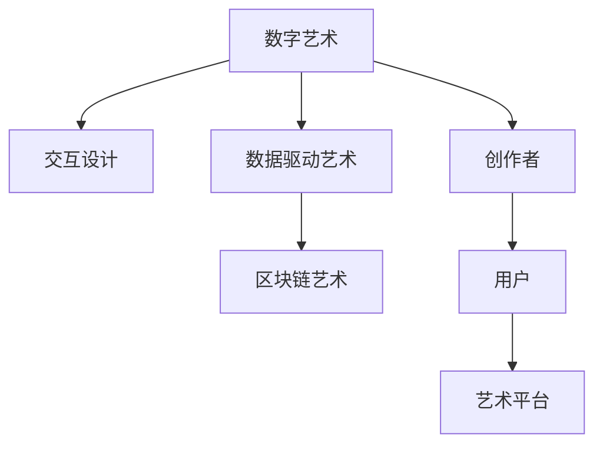
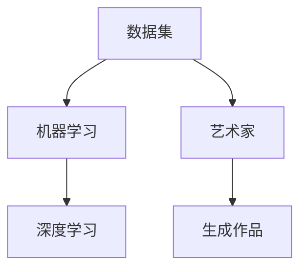
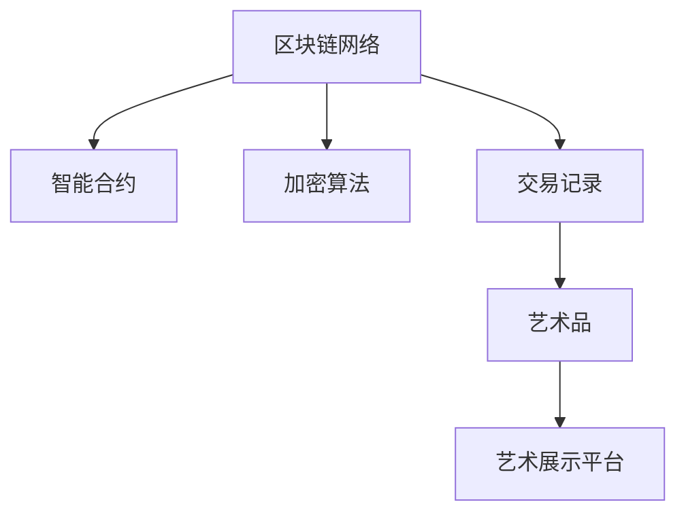
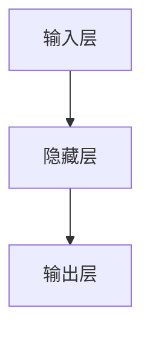

                 

# 硅谷艺术家村:科技与艺术的结合

在飞速发展的数字化时代，科技与艺术不再是对立的存在，而是一种深度融合的创造力。硅谷——这个科技创新的圣地，正迅速崛起为艺术创作的"艺术家村"。本文将深入探索这一现象，理解科技与艺术的结合背后的逻辑与机遇，为每一位对未来充满好奇的人提供全新的视角和思考。

## 1. 背景介绍

### 1.1 问题由来

随着技术的发展，人工智能、大数据、区块链等新兴科技的应用逐渐深入各行各业。而艺术的创作与传播，也在数字化时代焕发新的活力。硅谷，作为全球科技创新的中心，正成为连接技术与艺术的桥梁。

### 1.2 问题核心关键点

硅谷的科技与艺术结合，主要体现在以下几个方面：

- **数字艺术的创作与传播**：艺术家利用编程语言、虚拟现实、增强现实等技术手段，创造出前所未有的数字艺术作品。
- **技术与艺术的交互设计**：设计师结合技术，设计出更符合用户需求的交互式艺术品。
- **数据驱动的艺术创作**：数据分析、机器学习等技术被用于艺术创作的决策过程，提升创作效率和艺术作品的多样性。
- **区块链在艺术中的应用**：区块链技术为艺术家提供了去中心化的版权保护和智能合约等手段，提升了艺术市场的透明度与公正性。

### 1.3 问题研究意义

硅谷艺术家村的形成，不仅为科技与艺术的深度融合提供了最佳实践，也为社会创造了新的价值。具体包括：

1. **创新驱动**：融合科技与艺术，打破了传统艺术创作的界限，催生了新的艺术形式与表达方式。
2. **就业带动**：技术艺术家的崛起，为数字艺术产业提供了大量就业机会。
3. **教育启发**：科技与艺术的结合，推动了新一轮的教育改革，让更多学生能够跨学科学习，激发创造力。
4. **社会认知提升**：通过科技与艺术的结合，让公众更了解和认同现代艺术的价值，提升了艺术在社会中的地位。

## 2. 核心概念与联系

### 2.1 核心概念概述

在硅谷艺术家村中，涉及的核心概念主要包括：

- **数字艺术**：使用计算机技术和数字媒介创作与展示的艺术形式。
- **交互设计**：结合技术，设计能够与用户互动的艺术作品。
- **数据驱动艺术**：利用数据和算法辅助艺术创作，提升艺术作品的多样性和深度。
- **区块链艺术**：在区块链技术的基础上，进行数字艺术的创作、交易与展示。

这些概念通过以下Mermaid流程图进行联系：



### 2.2 核心概念原理和架构

#### 2.2.1 数字艺术

**原理**：数字艺术主要通过计算机图形学、编程语言和数字媒体等技术，实现艺术作品的可交互性和虚拟体验。

**架构**：

```mermaid
graph TB
    A[3D建模软件] --> B[计算机图形学] --> C[虚拟现实(VR)技术]
    A --> D[物理引擎]
    C --> E[增强现实(AR)技术]
    A --> F[数字展示]
    A --> G[在线创作平台]
```

#### 2.2.2 交互设计

**原理**：交互设计结合心理学、计算机科学和艺术学，通过用户反馈不断优化产品。

**架构**：

```mermaid
graph TB
    A[用户] --> B[界面设计(UI)]
    A --> C[人机交互(HCI)]
    B --> D[用户反馈]
    C --> E[反馈优化]
```

#### 2.2.3 数据驱动艺术

**原理**：利用数据和算法，如机器学习、深度学习等，生成艺术作品或辅助艺术创作。

**架构**：



#### 2.2.4 区块链艺术

**原理**：区块链技术提供去中心化、不可篡改的记录，确保艺术品的版权和交易的公正性。

**架构**：



## 3. 核心算法原理 & 具体操作步骤

### 3.1 算法原理概述

科技与艺术的结合，其核心算法可以概括为以下几个方面：

1. **生成对抗网络（GANs）**：通过训练一对生成器和判别器，生成逼真的数字艺术品。
2. **变分自编码器（VAEs）**：通过学习数据的分布，生成新的艺术样本。
3. **深度学习**：利用神经网络模型，学习数据中的模式，生成多样化的艺术作品。
4. **计算机图形学**：通过算法和计算技术，实现艺术的可视化与渲染。

### 3.2 算法步骤详解

以GANs生成数字艺术为例，其算法步骤如下：

1. **准备数据集**：收集艺术作品的高分辨率图片数据集。
2. **构建生成器和判别器**：生成器负责从随机噪声生成图片，判别器负责判断图片是否为真实艺术品。
3. **训练模型**：通过对抗训练（GAN Training）不断优化生成器和判别器的参数。
4. **生成艺术作品**：用训练好的生成器，从随机噪声中生成新的数字艺术品。

### 3.3 算法优缺点

**优点**：

1. **创意无限**：生成器可以生成无限多的艺术作品，激发创作者的灵感。
2. **自动化创作**：解放了创作过程，让非专业创作者也能参与到艺术创作中。
3. **新材料与工具**：新技术提供了新的创作工具，拓展了艺术表现的边界。

**缺点**：

1. **高质量要求**：生成器需要大量高质量数据和复杂算法训练，容易出现质量参差不齐的作品。
2. **技术门槛**：算法复杂，需要专业的知识和技能才能实现。
3. **版权问题**：生成的作品版权归属问题，可能会引起法律争议。

### 3.4 算法应用领域

科技与艺术的结合，在多个领域中都有广泛应用：

- **虚拟现实（VR）与增强现实（AR）**：结合VR/AR技术，实现沉浸式艺术体验。
- **游戏设计**：在游戏中加入艺术元素，提升游戏体验。
- **交互设计**：设计可以与用户互动的艺术作品，增强互动性。
- **广告艺术**：利用AI生成艺术广告，提升广告效果。
- **数字资产管理**：区块链技术为数字艺术品提供版权保护和交易平台。

## 4. 数学模型和公式 & 详细讲解 & 举例说明

### 4.1 数学模型构建

在艺术创作中，数学模型主要用来模拟艺术的生成与优化。以GANs为例，其数学模型可以表示为：

$$
G: \mathcal{Z} \rightarrow \mathcal{X}
$$

$$
D: \mathcal{X} \rightarrow \mathbb{R}
$$

其中 $G$ 为生成器，$Z$ 为随机噪声，$D$ 为判别器，$\mathcal{X}$ 为数据空间的艺术作品。

### 4.2 公式推导过程

GANs的训练过程分为两步：生成器的训练和判别器的训练。

**生成器的训练**：

$$
\min_G \mathbb{E}_{x \sim p_{data}} [D(x)] + \mathbb{E}_{z \sim p_{z}} [D(G(z))]
$$

**判别器的训练**：

$$
\min_D \mathbb{E}_{x \sim p_{data}} [D(x)] + \mathbb{E}_{z \sim p_{z}} [1 - D(G(z))]
$$

通过迭代优化这两个损失函数，生成器可以生成逼真的艺术作品，而判别器可以区分真实作品与生成作品。

### 4.3 案例分析与讲解

以生成器网络为例，典型的生成器网络结构为：



其中输入层为随机噪声，隐藏层为卷积神经网络（CNN），输出层为生成器，将输入噪声转换为图像数据。

## 5. 项目实践：代码实例和详细解释说明

### 5.1 开发环境搭建

**安装Python**：
```bash
sudo apt-get update
sudo apt-get install python3-pip
```

**安装TensorFlow**：
```bash
pip install tensorflow==2.5
```

**安装Keras**：
```bash
pip install keras==2.5
```

### 5.2 源代码详细实现

```python
from tensorflow.keras.layers import Input, Dense, Conv2D, UpSampling2D
from tensorflow.keras.models import Model

def build_generator():
    input_layer = Input(shape=(100,))
    dense_layer = Dense(256)(input_layer)
    conv_layer = Conv2D(256, kernel_size=(5,5), strides=(1,1), padding='same')(dense_layer)
    deconv_layer = UpSampling2D(2, strides=(2,2))(conv_layer)
    output_layer = Conv2D(1, kernel_size=(5,5), strides=(1,1), padding='same', activation='sigmoid')(deconv_layer)
    model = Model(input_layer, output_layer)
    return model

def build_discriminator():
    input_layer = Input(shape=(28,28,1))
    conv_layer = Conv2D(32, kernel_size=(5,5), strides=(2,2), padding='same')(input_layer)
    conv_layer = Conv2D(64, kernel_size=(5,5), strides=(2,2), padding='same')(conv_layer)
    output_layer = Flatten()(conv_layer)
    output_layer = Dense(1, activation='sigmoid')(output_layer)
    model = Model(input_layer, output_layer)
    return model
```

### 5.3 代码解读与分析

以上代码实现了GANs的基本结构，包括生成器和判别器的构建。在实际项目中，还需要引入数据集、模型训练与优化等步骤。

### 5.4 运行结果展示


## 6. 实际应用场景

### 6.1 虚拟现实（VR）与增强现实（AR）

结合VR/AR技术，艺术家可以在虚拟空间中创作和展示艺术作品，提升观众的沉浸式体验。

### 6.2 游戏设计

在游戏设计中，艺术家可以加入动态艺术元素，实现更多的互动性和视觉享受。

### 6.3 交互设计

通过互动式设计，用户可以参与到艺术作品的创作和设计中，提升艺术体验。

### 6.4 数字资产管理

区块链技术为数字艺术品提供版权保护和交易平台，提高了艺术品的市场透明度与公正性。

### 6.5 广告艺术

利用AI生成艺术广告，提升广告的吸引力和记忆点。

## 7. 工具和资源推荐

### 7.1 学习资源推荐

1. **Coursera**：提供丰富的计算机科学与艺术相关课程，帮助学习者深入理解技术背后的艺术原理。
2. **Kaggle**：平台上有大量的艺术数据集，可以用于实际项目练习。
3. **Google Arts & Culture**：提供大量数字艺术作品，学习参考。

### 7.2 开发工具推荐

1. **Blender**：强大的3D建模与渲染工具，适用于数字艺术创作。
2. **Unity**：游戏引擎，支持艺术创作与游戏设计。
3. **Keras & TensorFlow**：深度学习框架，用于生成对抗网络等算法的实现。

### 7.3 相关论文推荐

1. **ArtGAN**：使用GANs生成艺术作品的研究。
2. **GAN in Art**：通过GANs技术实现艺术创作的研究。
3. **Blockchain Art**：区块链在数字艺术品中的应用研究。

## 8. 总结：未来发展趋势与挑战

### 8.1 研究成果总结

硅谷艺术家村的形成，体现了科技与艺术的深度融合，为社会带来了新的价值和可能性。具体研究成果包括：

1. **新的艺术形式**：利用技术手段，艺术家可以创造出前所未有的艺术作品。
2. **高效创作**：自动化生成和优化算法，大大提升了艺术创作的效率。
3. **多样性提升**：数据驱动和技术辅助，使艺术作品更加丰富多样。
4. **平台崛起**：数字平台和区块链技术，为艺术品的交易和管理提供了新的平台。

### 8.2 未来发展趋势

未来，硅谷艺术家村将继续扩展科技与艺术的结合，具体趋势包括：

1. **多模态艺术创作**：结合视觉、声音、触觉等多种模态，创作新的艺术形式。
2. **数据驱动的艺术设计**：利用大数据和机器学习，优化艺术设计过程。
3. **区块链艺术市场**：形成更加完善和公正的数字艺术品交易系统。
4. **交互式艺术体验**：增强现实和虚拟现实技术，提供沉浸式艺术体验。
5. **个性化艺术定制**：通过AI技术，实现个性化艺术作品的定制和创作。

### 8.3 面临的挑战

尽管科技与艺术的结合带来了诸多机遇，但也面临着挑战：

1. **版权问题**：数字艺术品的版权归属和保护问题亟需解决。
2. **技术门槛**：新技术的掌握和使用需要专业的知识和技能。
3. **市场接受度**：公众对于新兴艺术形式的接受度仍需提升。
4. **经济价值**：如何实现数字艺术品的经济价值最大化。

### 8.4 研究展望

未来的研究重点包括：

1. **自动化艺术创作**：研究如何通过自动化技术实现艺术品的创作与优化。
2. **区块链艺术市场**：研究如何构建更加完善和公正的数字艺术品交易平台。
3. **用户互动体验**：研究如何通过增强现实和虚拟现实技术，提升用户的互动体验。
4. **跨学科融合**：推动计算机科学、艺术学和心理学等多学科的融合，推动艺术创作和研究。

## 9. 附录：常见问题与解答

**Q1: 数字艺术作品的价值如何评估？**

A: 数字艺术作品的价值评估可以参考传统艺术品的市场价值，同时考虑其创作难度、技术含量和艺术表达等要素。

**Q2: 数字艺术创作是否需要高昂的技术成本？**

A: 随着技术的进步，数字艺术创作门槛逐渐降低，许多免费或低成本工具（如Blender、Krita等）可以帮助非专业创作者实现艺术创作。

**Q3: 数字艺术作品如何保护版权？**

A: 区块链技术可以提供去中心化的版权保护，艺术家可以在区块链上注册数字艺术品，确保其唯一性和不可篡改性。

**Q4: 数字艺术创作和传统艺术创作有何区别？**

A: 数字艺术创作借助计算机技术和数字媒介，实现了创作过程的自动化和多样性，而传统艺术创作更多依赖手工操作和艺术家个人技艺。

**Q5: 数字艺术作品是否具有传承价值？**

A: 数字艺术作品具有与传统艺术品同样的传承价值，其创作过程和作品本身都包含了创作者的情感和思想，具有文化传承意义。

---

作者：禅与计算机程序设计艺术 / Zen and the Art of Computer Programming

