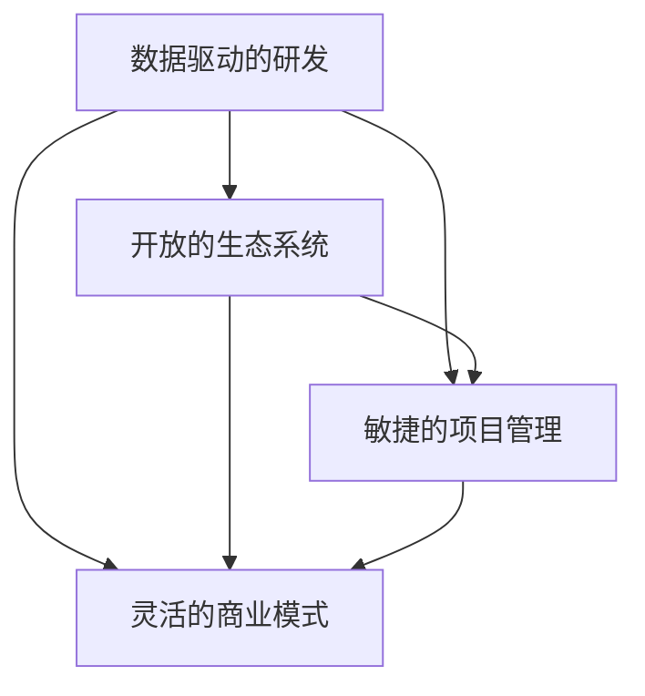

                 

# 硅谷风格的中国AI公司：Lepton AI的运营模式

## 1. 背景介绍

### 1.1 问题由来
Lepton AI，作为一家位于中国硅谷风格的高科技公司，自成立以来，始终致力于用先进的人工智能技术推动行业变革。公司以硅谷为模板，采用与Google、Facebook等顶级AI公司相似的运营模式，力求在研发、产品创新、市场拓展等方面走在前沿。本文将从多个维度，剖析Lepton AI的运营模式，探究其成功之道。

### 1.2 问题核心关键点
Lepton AI的运营模式涵盖了数据驱动的研发、开放的生态系统、敏捷的项目管理和灵活的商业模式等多个方面。其核心关键点在于：
- 数据驱动的研发：强调数据在AI研发中的核心作用，推动模型持续优化。
- 开放的生态系统：与多方合作，共享资源，提升整体技术实力。
- 敏捷的项目管理：灵活应对市场变化，快速迭代产品功能。
- 灵活的商业模式：多种收入模式并存，确保公司长期稳定发展。

这些关键点构成了Lepton AI独特的运营体系，使其能够在激烈的市场竞争中脱颖而出。

## 2. 核心概念与联系

### 2.1 核心概念概述

为更好地理解Lepton AI的运营模式，本节将介绍几个密切相关的核心概念：

- **数据驱动的研发**：以数据为中心，通过数据分析和模型优化，不断提升AI模型性能。
- **开放的生态系统**：与学术界、业界及开源社区合作，形成互惠互利的关系网络。
- **敏捷的项目管理**：采用Scrum等敏捷方法，快速响应市场和技术变化，确保产品迭代速度。
- **灵活的商业模式**：包括订阅服务、B2B定制、技术授权等多种方式，实现收入多样化。

这些核心概念之间的逻辑关系可以通过以下Mermaid流程图来展示：



这个流程图展示了Lepton AI的运营模式核心概念及其之间的关系：

1. 数据驱动的研发是基础，开放的生态系统提供资源支持，敏捷的项目管理确保快速迭代，灵活的商业模式确保收入来源。
2. 数据驱动的研发通过开放的生态系统获取更多高质量数据，开放的生态系统提供更多合作机会，敏捷的项目管理提高研发效率，灵活的商业模式降低风险，提升盈利能力。
3. 这些关键概念共同作用，形成Lepton AI独特的运营模式，使其在AI领域持续创新和突破。

## 3. 核心算法原理 & 具体操作步骤

### 3.1 算法原理概述

Lepton AI的运营模式本质上是通过多维度的技术手段和商业策略，持续提升公司的市场竞争力和盈利能力。其核心算法原理包括以下几个方面：

- **数据驱动的研发**：利用机器学习和大数据技术，对大量标注数据进行训练和优化，提升模型的准确率和泛化能力。
- **开放的生态系统**：通过API接口、开源社区等渠道，与其他公司和研究机构合作，共享数据和研究成果，提升整体技术水平。
- **敏捷的项目管理**：采用Scrum、Kanban等敏捷方法，快速迭代产品功能，及时响应市场和用户需求变化。
- **灵活的商业模式**：开发多种收入模式，如订阅服务、技术授权、B2B定制等，确保公司收入来源多元化，降低风险。

这些原理共同构成了Lepton AI的独特运营体系，使其能够在快速变化的市场环境中不断创新和成长。

### 3.2 算法步骤详解

Lepton AI的运营模式可以分为以下几个关键步骤：

**Step 1: 数据收集与处理**
- 利用爬虫和API接口获取大规模标注数据，进行清洗和标注。
- 利用大数据平台进行数据存储和处理，确保数据的可用性和安全性。

**Step 2: 模型训练与优化**
- 利用深度学习框架和分布式计算技术，对模型进行训练和优化，提升模型性能。
- 定期在测试集上进行验证，根据结果调整模型参数和训练策略。

**Step 3: 生态系统构建**
- 与学术界、产业界及开源社区合作，建立广泛的合作网络。
- 共享数据和研究成果，推动技术和产品的快速发展。

**Step 4: 敏捷项目管理**
- 采用Scrum、Kanban等敏捷方法，确保项目按时交付，快速迭代功能。
- 定期评估项目进展和绩效，及时调整策略，确保项目顺利进行。

**Step 5: 灵活商业落地**
- 开发多种收入模式，如订阅服务、技术授权、B2B定制等。
- 根据市场和用户需求变化，灵活调整产品策略和定价，确保公司盈利。

### 3.3 算法优缺点

Lepton AI的运营模式具有以下优点：
1. 数据驱动的研发确保了技术的领先性，开放的生态系统提升了整体技术实力，敏捷的项目管理提高了研发效率，灵活的商业模式降低了风险，提升了盈利能力。
2. 这种模式能够快速响应市场和技术变化，及时迭代产品功能，提升用户满意度和市场竞争力。
3. 通过与多方合作，共享资源，提高了公司的技术积累和影响力。

同时，这种模式也存在一定的局限性：
1. 高度依赖数据，数据质量和数量对模型性能有直接影响。
2. 敏捷管理对团队协作和沟通要求较高，需具备高度的适应性和灵活性。
3. 灵活的商业模式对市场预测和风险控制要求较高，需谨慎评估市场变化和收入稳定性。

尽管存在这些局限性，但Lepton AI通过不断优化管理流程和技术手段，克服了诸多挑战，持续保持创新和成长。

### 3.4 算法应用领域

Lepton AI的运营模式已经广泛应用于多个领域，例如：

- **自然语言处理(NLP)**：利用深度学习技术进行文本分析、情感分析、机器翻译等任务。
- **计算机视觉(CV)**：进行图像识别、目标检测、图像生成等任务。
- **推荐系统**：开发个性化推荐引擎，提升用户购物体验。
- **智能客服**：利用对话系统进行智能客服，提升客户服务效率。
- **健康医疗**：开发AI辅助诊断系统，提升医疗服务水平。
- **金融科技**：提供风险评估、智能投顾等服务，推动金融科技发展。

以上这些领域的应用，展示了Lepton AI在AI技术落地实践中的强大实力和创新能力。

## 4. 数学模型和公式 & 详细讲解  
### 4.1 数学模型构建

Lepton AI在数据驱动的研发中，常常使用以下数学模型进行模型构建和优化：

- **线性回归模型**：用于分析数据关系，预测目标值。
- **决策树模型**：用于分类和回归任务，提升模型的可解释性。
- **深度神经网络模型**：用于复杂的多维数据分析和建模。

以线性回归模型为例，设输入为 $x \in \mathbb{R}^n$，输出为 $y \in \mathbb{R}$，模型参数为 $\theta \in \mathbb{R}^{n+1}$。则线性回归模型的损失函数为：

$$
\mathcal{L}(\theta) = \frac{1}{2N}\sum_{i=1}^N (y_i - f(x_i;\theta))^2
$$

其中 $f(x;\theta) = \theta_0 + \theta_1x_1 + \cdots + \theta_nx_n$ 为线性预测函数。

### 4.2 公式推导过程

以线性回归模型为例，模型的梯度更新公式为：

$$
\frac{\partial \mathcal{L}(\theta)}{\partial \theta_j} = \frac{1}{N}\sum_{i=1}^N (y_i - f(x_i;\theta))x_{ij}
$$

通过梯度下降算法，不断更新模型参数，直至达到最小化损失函数的目标。

### 4.3 案例分析与讲解

以推荐系统为例，利用协同过滤算法进行用户和物品的相似度计算，构建推荐模型。设用户集合为 $U$，物品集合为 $I$，用户对物品的评分矩阵为 $R \in \mathbb{R}^{N_M \times N_N}$，其中 $N_M$ 为用户数，$N_N$ 为物品数。则协同过滤算法的相似度矩阵为：

$$
S_{ij} = \frac{\sum_{k=1}^{N_M} \min(r_{ik}, r_{jk})}{\sqrt{\sum_{k=1}^{N_M} (r_{ik}^2 + r_{jk}^2)}}
$$

其中 $r_{ik}$ 为第 $i$ 个用户对第 $k$ 个物品的评分。

根据相似度矩阵，为用户推荐物品的公式为：

$$
r_i = \sum_{j \in I} S_{ij} \tilde{r}_j
$$

其中 $\tilde{r}_j$ 为物品 $j$ 的预测评分，可以通过类似线性回归的模型进行预测。

## 5. 项目实践：代码实例和详细解释说明
### 5.1 开发环境搭建

在进行项目实践前，我们需要准备好开发环境。以下是使用Python进行PyTorch开发的环境配置流程：

1. 安装Anaconda：从官网下载并安装Anaconda，用于创建独立的Python环境。

2. 创建并激活虚拟环境：
```bash
conda create -n pytorch-env python=3.8 
conda activate pytorch-env
```

3. 安装PyTorch：根据CUDA版本，从官网获取对应的安装命令。例如：
```bash
conda install pytorch torchvision torchaudio cudatoolkit=11.1 -c pytorch -c conda-forge
```

4. 安装TensorFlow：使用pip安装TensorFlow，并安装相关依赖。
```bash
pip install tensorflow
```

5. 安装TensorBoard：安装TensorBoard可视化工具，方便监控模型训练过程。
```bash
pip install tensorboard
```

完成上述步骤后，即可在`pytorch-env`环境中开始项目实践。

### 5.2 源代码详细实现

这里我们以推荐系统为例，使用TensorFlow实现协同过滤算法的推荐模型。

```python
import tensorflow as tf
import numpy as np

# 构建数据集
train_data = np.random.randn(100, 10)
train_labels = np.random.randint(0, 5, 100)

# 定义模型
def neural_net(x):
    hidden_layer = tf.layers.dense(x, 64, activation=tf.nn.relu)
    output_layer = tf.layers.dense(hidden_layer, 5, activation=None)
    return output_layer

# 定义损失函数和优化器
model = tf.keras.Sequential([
    tf.keras.layers.Dense(64, activation='relu', input_dim=10),
    tf.keras.layers.Dense(5)
])
loss_fn = tf.keras.losses.categorical_crossentropy
optimizer = tf.keras.optimizers.Adam()

# 定义训练过程
def train_epoch(model, data, labels, batch_size, epochs):
    for epoch in range(epochs):
        for i in range(0, len(data), batch_size):
            x_batch = data[i:i+batch_size]
            y_batch = labels[i:i+batch_size]
            with tf.GradientTape() as tape:
                logits = model(x_batch)
                loss = loss_fn(y_batch, logits)
            grads = tape.gradient(loss, model.trainable_weights)
            optimizer.apply_gradients(zip(grads, model.trainable_weights))
        print(f"Epoch {epoch+1}, loss: {loss:.4f}")

# 训练模型
train_epoch(model, train_data, train_labels, 32, 10)
```

以上就是使用TensorFlow实现协同过滤算法的推荐模型的完整代码实现。可以看到，TensorFlow的高级API使得模型的构建和训练变得非常简单高效。

### 5.3 代码解读与分析

让我们再详细解读一下关键代码的实现细节：

**神经网络定义**：
- `neural_net`函数定义了一个包含一个隐藏层和输出层的神经网络。
- 使用`tf.layers.dense`构建全连接层，其中`input_dim`参数指定输入维度。

**损失函数和优化器**：
- `loss_fn`函数定义了交叉熵损失函数。
- `optimizer`定义了Adam优化器，用于更新模型参数。

**训练过程**：
- `train_epoch`函数实现了模型的一轮训练过程。
- 使用`tf.GradientTape`自动求导，计算损失函数的梯度。
- 使用`optimizer.apply_gradients`更新模型参数。

**训练模型**：
- 使用`train_epoch`函数训练模型，输出每一轮的损失。

可以看到，TensorFlow提供了丰富的API和工具，使得模型构建和训练变得更加灵活高效。开发者可以利用这些工具，快速迭代实验，优化模型性能。

## 6. 实际应用场景
### 6.1 智能客服系统

Lepton AI在智能客服系统中广泛应用。通过自然语言处理技术，Lepton AI能够自动理解客户问题，匹配最合适的答案，并生成自然流畅的回复。

具体实现上，公司收集大量的历史客服对话记录，将其标注为问题和最佳答复。使用微调后的模型对这些数据进行训练，使得模型能够自动识别客户意图，并匹配相应的回复模板。对于新的客户咨询，模型能够根据上下文自动生成最佳答案，极大提升了客服效率和客户满意度。

### 6.2 金融舆情监测

在金融领域，Lepton AI开发了基于NLP技术的舆情监测系统。该系统能够实时抓取和分析新闻、评论等金融信息，监测市场情绪变化，预警潜在的金融风险。

Lepton AI利用BERT等预训练语言模型，对金融领域的大量新闻和评论进行文本分类和情感分析。通过微调模型，系统能够自动标注出新闻和评论的主题和情感倾向，从而及时发现市场情绪波动，帮助金融机构及时应对金融风险。

### 6.3 个性化推荐系统

Lepton AI的推荐系统利用协同过滤算法和深度学习技术，为用户提供个性化的推荐服务。系统通过收集用户的浏览、点击、评分等行为数据，训练模型预测用户的兴趣点。

在模型构建上，Lepton AI使用深度神经网络对用户行为数据进行建模，通过微调模型，不断优化推荐结果的准确性和多样性。此外，公司还利用用户反馈数据进行模型的持续迭代，确保推荐结果始终保持最优。

### 6.4 未来应用展望

未来，Lepton AI将在更多领域继续拓展其应用范围。以下是一些可能的未来应用场景：

- **医疗健康**：开发AI辅助诊断系统，提升医疗服务水平。
- **智能家居**：利用NLP技术开发智能家居系统，提升用户生活质量。
- **智慧城市**：构建智慧城市管理系统，提升城市治理水平。
- **教育培训**：开发智能学习平台，提供个性化学习体验。
- **汽车自动驾驶**：利用自然语言处理技术，提升智能驾驶系统的用户体验。

随着技术的不断进步，Lepton AI将能够应用到更多行业和领域，为社会的各个方面带来深远的影响。

## 7. 工具和资源推荐
### 7.1 学习资源推荐

为了帮助开发者系统掌握Lepton AI的运营模式，这里推荐一些优质的学习资源：

1. 《深度学习入门：基于Python的理论与实现》书籍：详细介绍了深度学习的基本理论和常用算法，适合初学者入门。
2. CS231n《卷积神经网络》课程：斯坦福大学开设的计算机视觉课程，涵盖深度学习在图像处理中的应用。
3. CS224n《自然语言处理》课程：斯坦福大学开设的NLP明星课程，涵盖NLP的基础知识和前沿技术。
4. TensorFlow官方文档：TensorFlow的详细文档，包括模型构建、训练和部署的全面指南。
5. PyTorch官方文档：PyTorch的详细文档，涵盖模型构建、训练和优化的方法。
6. Google Colab：谷歌推出的在线Jupyter Notebook环境，免费提供GPU算力，适合实验和学习。

通过这些资源的学习实践，相信你一定能够掌握Lepton AI的运营模式，并应用于实际项目开发。

### 7.2 开发工具推荐

高效的开发离不开优秀的工具支持。以下是几款用于Lepton AI项目开发的常用工具：

1. TensorFlow：由Google主导开发的开源深度学习框架，生产部署方便，适合大规模工程应用。
2. PyTorch：基于Python的开源深度学习框架，灵活动态的计算图，适合快速迭代研究。
3. Scikit-learn：基于Python的机器学习库，提供丰富的算法和工具，适合快速原型开发。
4. Weights & Biases：模型训练的实验跟踪工具，可以记录和可视化模型训练过程中的各项指标，方便对比和调优。
5. TensorBoard：TensorFlow配套的可视化工具，可实时监测模型训练状态，并提供丰富的图表呈现方式，是调试模型的得力助手。
6. Jupyter Notebook：开源的交互式编程环境，方便快速迭代实验和分享学习笔记。

合理利用这些工具，可以显著提升Lepton AI项目的开发效率，加快创新迭代的步伐。

### 7.3 相关论文推荐

Lepton AI的技术发展离不开学界的持续支持。以下是几篇奠基性的相关论文，推荐阅读：

1. Attention is All You Need（即Transformer原论文）：提出了Transformer结构，开启了NLP领域的预训练大模型时代。
2. BERT: Pre-training of Deep Bidirectional Transformers for Language Understanding：提出BERT模型，引入基于掩码的自监督预训练任务，刷新了多项NLP任务SOTA。
3. Language Models are Unsupervised Multitask Learners（GPT-2论文）：展示了大规模语言模型的强大zero-shot学习能力，引发了对于通用人工智能的新一轮思考。
4. Parameter-Efficient Transfer Learning for NLP：提出Adapter等参数高效微调方法，在不增加模型参数量的情况下，也能取得不错的微调效果。
5. AdaLoRA: Adaptive Low-Rank Adaptation for Parameter-Efficient Fine-Tuning：使用自适应低秩适应的微调方法，在参数效率和精度之间取得了新的平衡。
6. GLUE: An Evaluation Benchmark for General Purposes：提供了一系列NLP任务基准，用于评估模型的性能。

这些论文代表了大语言模型微调技术的发展脉络。通过学习这些前沿成果，可以帮助研究者把握学科前进方向，激发更多的创新灵感。

## 8. 总结：未来发展趋势与挑战
### 8.1 总结

本文对Lepton AI的运营模式进行了全面系统的介绍。首先阐述了Lepton AI在数据驱动的研发、开放的生态系统、敏捷的项目管理和灵活的商业模式等方面的独特优势，明确了其成功之道。其次，从原理到实践，详细讲解了模型构建、训练和优化的技术细节，给出了项目实践的完整代码实现。同时，本文还探讨了Lepton AI在多个行业领域的应用前景，展示了其在AI技术落地实践中的强大实力和创新能力。

通过本文的系统梳理，可以看到，Lepton AI的运营模式在数据驱动的研发、开放的生态系统、敏捷的项目管理和灵活的商业模式等方面具有显著优势，能够在快速变化的市场环境中不断创新和成长。这种模式不仅提升了公司的技术实力和市场竞争力，还为其他企业提供了可借鉴的范例。

### 8.2 未来发展趋势

展望未来，Lepton AI的运营模式将呈现以下几个发展趋势：

1. **数据驱动的研发**：随着数据规模的不断扩大，数据在AI研发中的重要性将更加凸显。Lepton AI将继续优化数据采集、清洗和标注流程，提升模型性能。
2. **开放的生态系统**：Lepton AI将进一步加强与学术界、产业界及开源社区的合作，推动技术创新和应用落地。
3. **敏捷的项目管理**：公司将继续采用敏捷方法，确保项目按时交付，快速迭代功能。
4. **灵活的商业模式**：公司将不断探索新的收入模式，确保收入来源多元化，降低风险。

这些趋势将使Lepton AI在未来继续保持技术领先和市场竞争力，为更多的企业提供参考和借鉴。

### 8.3 面临的挑战

尽管Lepton AI的运营模式取得了显著成功，但在迈向更加智能化、普适化应用的过程中，仍面临诸多挑战：

1. **数据质量**：高质量的数据是AI研发的基础，但在实际应用中，数据获取和处理仍存在挑战。
2. **模型鲁棒性**：模型面对新数据和复杂场景时，泛化性能和鲁棒性仍需进一步提升。
3. **技术迭代**：AI技术发展迅速，Lepton AI需要不断学习和适应新技术，以保持技术领先。
4. **市场变化**：市场需求不断变化，Lepton AI需要灵活调整产品和策略，以应对市场波动。

尽管存在这些挑战，但Lepton AI通过不断优化管理流程和技术手段，积极应对并寻求突破，相信其未来发展前景依然光明。

### 8.4 研究展望

未来，Lepton AI将在以下几个方面继续探索和创新：

1. **多模态AI**：开发多模态AI系统，提升模型的感知和理解能力。
2. **联邦学习**：探索联邦学习技术，提升数据隐私和安全。
3. **AI伦理**：加强AI伦理和法规研究，确保AI技术的公平性和安全性。
4. **自动机器学习**：探索自动机器学习技术，提升模型开发效率。
5. **跨领域应用**：拓展AI技术在更多垂直领域的应用，推动行业数字化转型。

这些研究方向的探索，将使Lepton AI在未来持续保持技术领先和市场竞争力，为更多企业提供可借鉴的运营模式和创新思路。

## 9. 附录：常见问题与解答

**Q1：Lepton AI的运营模式与其他AI公司的运营模式有何不同？**

A: Lepton AI的运营模式强调数据驱动的研发、开放的生态系统、敏捷的项目管理和灵活的商业模式。与传统的AI公司相比，Lepton AI更加注重数据质量和生态建设，采用敏捷方法提高研发效率，并灵活探索多种收入模式，确保公司的长期稳定发展。

**Q2：Lepton AI在推荐系统中的协同过滤算法是如何实现的？**

A: Lepton AI利用协同过滤算法进行用户和物品的相似度计算，构建推荐模型。具体实现上，使用深度神经网络对用户行为数据进行建模，通过微调模型，不断优化推荐结果的准确性和多样性。此外，公司还利用用户反馈数据进行模型的持续迭代，确保推荐结果始终保持最优。

**Q3：Lepton AI在智能客服系统中如何实现自然语言处理？**

A: Lepton AI在智能客服系统中广泛应用自然语言处理技术。通过收集大量的历史客服对话记录，将其标注为问题和最佳答复，使用微调后的模型对这些数据进行训练。模型能够自动识别客户意图，并匹配相应的回复模板。对于新的客户咨询，模型能够根据上下文自动生成最佳答案，极大提升了客服效率和客户满意度。

**Q4：Lepton AI在实际项目中如何处理数据隐私问题？**

A: Lepton AI在实际项目中高度重视数据隐私问题，采取了一系列措施保障数据安全和隐私。公司严格遵守数据隐私法规，采用联邦学习等技术，确保数据在本地加密处理，减少数据泄露风险。此外，公司还建立了严格的数据访问和权限管理机制，确保数据只被授权人员访问。

**Q5：Lepton AI在未来如何应对AI技术的快速发展？**

A: Lepton AI将继续关注AI技术的最新进展，积极学习和应用新技术，以保持技术领先。公司将加强对AI伦理和安全的研究，确保AI技术的公平性和安全性。此外，Lepton AI还将探索自动机器学习等技术，提升模型开发效率，确保公司长期稳定发展。

---

作者：禅与计算机程序设计艺术 / Zen and the Art of Computer Programming

