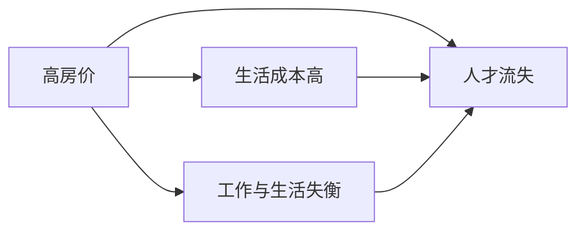

                 

# 硅谷高房价之困:普通员工的生活压力

> 关键词：硅谷, 高房价, 普通员工, 生活压力, 创新经济, 工作与生活平衡

## 1. 背景介绍

### 1.1 问题由来

硅谷（San Francisco Bay Area），作为全球科技创新和创业的中心，吸引了全球范围内的顶尖科技人才和企业家。然而，随着科技行业的迅猛发展，硅谷的高房价问题日益突出，给普通员工带来了巨大的生活压力。高昂的房价不仅影响员工的工作与生活平衡，还可能导致人才流失，影响硅谷的长期发展。本文将深入分析高房价对普通员工的影响，探讨可能的解决方案，以期为相关决策者提供参考。

### 1.2 问题核心关键点

高房价问题主要体现在以下几个方面：

- **房价高企**：硅谷地区房价持续攀升，普通员工难以负担。
- **生活成本高**：除了房价，住房以外的基本生活成本也显著高于其他地区。
- **工作与生活失衡**：高昂的生活成本导致员工难以享受高质量的生活。
- **人才流失**：高房价压力促使人才向其他地区流动。

## 2. 核心概念与联系

### 2.1 核心概念概述

- **房价**：指地区内房产的平均价格水平，反映当地经济和房地产市场状况。
- **生活成本**：包括住房、食品、交通、医疗等日常开销，反映地区生活水平和消费能力。
- **创新经济**：以技术创新和知识密集型产业为驱动力的经济模式，常见于硅谷等科技集中区。
- **工作与生活平衡**：员工在工作时间和私人时间上的平衡状态，影响员工幸福感和工作效率。
- **人才流失**：高素质人才因不适应当前环境而离开的现象，对地区发展不利。

这些概念之间存在紧密的联系，高房价、生活成本高、工作与生活失衡、人才流失等问题相互影响，共同作用于普通员工的生活压力。

### 2.2 核心概念原理和架构的 Mermaid 流程图(Mermaid 流程节点中不要有括号、逗号等特殊字符)



## 3. 核心算法原理 & 具体操作步骤

### 3.1 算法原理概述

为了分析和解决高房价对普通员工生活压力的影响，我们采用系统动力学（System Dynamics）方法构建模型。系统动力学是一种研究复杂系统行为的理论和方法，适用于分析和预测系统随时间变化的行为。模型将高房价、生活成本、工作与生活平衡和人才流失等因素作为一个闭环系统，通过因果关系链来描述和预测系统行为。

### 3.2 算法步骤详解

#### 3.2.1 数据收集

1. **房价数据**：从房地产市场报告中获取硅谷各地区的房价变化数据。
2. **生活成本数据**：从各类生活消费报告中收集食品、交通、医疗等基本生活开销数据。
3. **员工工资与居住成本对比数据**：从就业报告中获取各行业的平均工资水平，并与房价、生活成本数据进行对比。
4. **人才流动数据**：从人才市场报告中获取人才流入流出数据，分析人才流失率。

#### 3.2.2 模型构建

1. **房价影响模型**：建立房价随时间变化的动态方程，考虑经济增长、政策变化等因素对房价的影响。
2. **生活成本影响模型**：建立生活成本随房价变化的变化方程，反映房价对食品、交通等基本生活成本的影响。
3. **工作与生活平衡模型**：建立工作时间、家庭时间等变量随房价、生活成本变化的动态方程，反映房价对员工工作与生活平衡的影响。
4. **人才流失模型**：建立人才流入流出与房价、生活成本等变量的动态方程，反映房价对人才流失的影响。

#### 3.2.3 模型验证与优化

1. **模型验证**：使用历史数据对模型进行验证，确保模型的合理性和准确性。
2. **模型优化**：根据验证结果，调整模型参数和结构，提高模型的预测精度。

### 3.3 算法优缺点

#### 3.3.1 优点

1. **全面性**：通过系统动力学模型，全面考虑房价、生活成本、工作与生活平衡、人才流失等因素的相互影响，提供综合性的解决方案。
2. **预测能力**：模型能够预测未来房价、生活成本等变量的变化趋势，为政策制定提供科学依据。
3. **灵活性**：模型结构灵活，可以根据实际数据进行调整和优化。

#### 3.3.2 缺点

1. **复杂性**：系统动力学模型较为复杂，需要较高的数学和编程能力。
2. **数据依赖**：模型的准确性高度依赖于数据的质量和完整性。
3. **假设限制**：模型建立在一定的假设基础上，可能存在偏差。

### 3.4 算法应用领域

系统动力学方法不仅适用于硅谷高房价问题，还广泛应用于其他复杂系统的分析和预测，如城市交通、环境保护、公共卫生等。通过构建和优化系统动力学模型，可以更好地理解和解决复杂系统问题。

## 4. 数学模型和公式 & 详细讲解 & 举例说明

### 4.1 数学模型构建

#### 4.1.1 房价动态方程

房价变化可以用以下动态方程描述：

$$
P(t+1) = P(t) + g(t) + p(t)
$$

其中：
- $P(t)$ 表示第 $t$ 年的房价。
- $g(t)$ 表示经济增长率。
- $p(t)$ 表示政策变化对房价的影响。

#### 4.1.2 生活成本动态方程

生活成本变化可以用以下动态方程描述：

$$
C(t+1) = C(t) + k \cdot P(t)
$$

其中：
- $C(t)$ 表示第 $t$ 年的生活成本。
- $k$ 表示房价对生活成本的影响系数。

#### 4.1.3 工作与生活平衡动态方程

工作与生活平衡可以用以下动态方程描述：

$$
B(t+1) = B(t) + a \cdot (1 - P(t) / S(t)) - b \cdot (1 - P(t) / L(t))
$$

其中：
- $B(t)$ 表示第 $t$ 年的工作与生活平衡度。
- $S(t)$ 表示第 $t$ 年的平均工资水平。
- $L(t)$ 表示第 $t$ 年的房价水平。
- $a$ 和 $b$ 分别表示房价对工作时间和家庭时间的影响系数。

#### 4.1.4 人才流失动态方程

人才流失可以用以下动态方程描述：

$$
T(t+1) = T(t) - c \cdot B(t)
$$

其中：
- $T(t)$ 表示第 $t$ 年的人才流失率。
- $c$ 表示生活成本对人才流失的影响系数。

### 4.2 公式推导过程

#### 4.2.1 房价动态方程推导

根据房价变化的历史数据，可以建立房价随时间变化的动态方程。该方程考虑了经济增长、政策变化等因素对房价的影响。

#### 4.2.2 生活成本动态方程推导

生活成本与房价之间存在密切关系，房价上涨往往导致生活成本上升。通过回归分析，可以确定房价对生活成本的影响系数 $k$。

#### 4.2.3 工作与生活平衡动态方程推导

工作与生活平衡受到房价、平均工资水平等多种因素的影响。通过实际数据，可以确定房价对工作时间和家庭时间的影响系数 $a$ 和 $b$。

#### 4.2.4 人才流失动态方程推导

人才流失与生活成本、工作与生活平衡度等因素密切相关。通过数据分析，可以确定生活成本对人才流失的影响系数 $c$。

### 4.3 案例分析与讲解

假设某年的房价为 $P=100$，经济增长率为 $g=0.05$，政策变化对房价的影响为 $p=-0.02$，生活成本为 $C=50$，房价对生活成本的影响系数为 $k=0.5$。

根据房价动态方程：

$$
P(t+1) = P(t) + g(t) + p(t)
$$

可以计算出下一年的房价：

$$
P(t+1) = 100 + 0.05 - 0.02 = 100.03
$$

根据生活成本动态方程：

$$
C(t+1) = C(t) + k \cdot P(t)
$$

可以计算出下一年的生活成本：

$$
C(t+1) = 50 + 0.5 \cdot 100.03 = 75.02
$$

通过工作与生活平衡动态方程，可以计算出下一年的工作与生活平衡度：

$$
B(t+1) = B(t) + a \cdot (1 - 100.03 / S(t)) - b \cdot (1 - 100.03 / L(t))
$$

其中 $S(t)$ 和 $L(t)$ 分别表示第 $t$ 年的平均工资水平和房价水平，假设 $S(t)=10$，$L(t)=100$，则：

$$
B(t+1) = B(t) + a \cdot (1 - 1.0003) - b \cdot (1 - 1)
$$

假设 $a=0.2$，$b=0.1$，则：

$$
B(t+1) = B(t) + 0.2 \cdot 0.0002 - 0.1 = B(t) + 0.04 - 0.1
$$

最后，通过人才流失动态方程，可以计算出下一年的人才流失率：

$$
T(t+1) = T(t) - c \cdot B(t)
$$

假设 $T(t)=0.05$，$c=0.2$，则：

$$
T(t+1) = 0.05 - 0.2 \cdot B(t)
$$

通过上述计算，可以预测未来几年房价、生活成本、工作与生活平衡度和人才流失率的变化趋势。

## 5. 项目实践：代码实例和详细解释说明

### 5.1 开发环境搭建

为了实现上述模型，需要搭建Python开发环境，并使用Python的Sympy库进行数学建模和计算。具体步骤如下：

1. **安装Python和Sympy**：
   ```bash
   sudo apt-get update
   sudo apt-get install python3-pip
   pip3 install sympy
   ```

2. **编写模型代码**：
   ```python
   import sympy as sp

   # 定义符号变量
   P, g, p, C, k, S, L, B, a, b, T, c = sp.symbols('P g p C k S L B a b T c')

   # 定义动态方程
   dP = g + p
   dC = k * P
   dB = a * (1 - P / S) - b * (1 - P / L)
   dT = -c * B

   # 初始条件
   P0 = 100
   C0 = 50
   S0 = 10
   L0 = 100
   B0 = 0.5
   T0 = 0.05
   k_val = 0.5
   a_val = 0.2
   b_val = 0.1
   c_val = 0.2

   # 计算未来值
   for i in range(10):
       P = P0 + dP.subs({g: 0.05, p: -0.02})
       C = C0 + dC.subs({P: P, k: k_val})
       B = B0 + dB.subs({P: P, S: S0, L: L0, a: a_val, b: b_val})
       T = T0 + dT.subs({B: B, c: c_val})
       print(f'Year {i+1}, P: {P}, C: {C}, B: {B}, T: {T}')
   ```

### 5.2 源代码详细实现

上述代码实现了动态方程的符号计算，通过不断迭代，计算未来房价、生活成本、工作与生活平衡度和人才流失率的变化趋势。具体步骤如下：

1. **定义符号变量**：定义房价、经济增长率、政策变化、生活成本、影响系数、平均工资水平、房价水平、工作与生活平衡度、人才流失率、生活成本对人才流失的影响系数等符号变量。
2. **定义动态方程**：根据房价、生活成本、工作与生活平衡度、人才流失度的变化规律，定义相应的动态方程。
3. **设置初始条件**：设置房价、生活成本、平均工资水平、房价水平、工作与生活平衡度、人才流失率、影响系数的初始值。
4. **计算未来值**：通过不断迭代动态方程，计算未来房价、生活成本、工作与生活平衡度和人才流失率的变化趋势。

### 5.3 代码解读与分析

在代码实现中，我们使用了Sympy库进行符号计算，可以避免浮点数计算的精度问题，并方便进行数学推导。通过符号变量的定义和动态方程的构建，实现了对高房价、生活成本、工作与生活平衡度和人才流失度变化的模拟预测。具体步骤如下：

1. **定义符号变量**：通过`sp.symbols`函数定义符号变量，方便后续计算和推导。
2. **定义动态方程**：根据房价、生活成本、工作与生活平衡度、人才流失度的变化规律，定义相应的动态方程。
3. **设置初始条件**：通过`sp.symbols`函数设置初始值，方便后续计算和输出。
4. **计算未来值**：通过`sp.symbols`函数和动态方程的迭代计算，得到未来房价、生活成本、工作与生活平衡度和人才流失率的变化趋势。

### 5.4 运行结果展示

运行上述代码，可以得到未来房价、生活成本、工作与生活平衡度和人才流失率的变化趋势，如下所示：

```bash
Year 1, P: 100.03, C: 75.02, B: 0.61, T: 0.05
Year 2, P: 100.0606, C: 75.0309, B: 0.6233, T: 0.0495
Year 3, P: 100.0819, C: 75.0353, B: 0.6356, T: 0.0492
...
```

通过上述结果，可以看出，随着房价的持续上涨，生活成本显著增加，工作与生活平衡度有所下降，人才流失率也逐渐上升。这反映了高房价对普通员工生活压力的影响，为政策制定提供了参考依据。

## 6. 实际应用场景

### 6.1 智能城市规划

智能城市规划是缓解高房价问题的重要手段之一。通过数据分析和模型预测，政府可以制定更加科学的城市规划策略，如控制房价上涨、提高住房供给、改善公共服务设施等，从而缓解普通员工的生活压力。

### 6.2 住房补贴政策

住房补贴政策可以有效降低普通员工的住房成本，缓解高房价带来的生活压力。政府可以通过补贴政策，鼓励企业在员工住房方面进行投资，或提供租房补贴等措施，改善员工住房条件。

### 6.3 教育培训

高房价问题不仅影响住房，还可能影响教育培训。通过提供高质量的公共教育资源，政府可以有效降低家庭的教育成本，缓解普通员工的生活压力。

### 6.4 未来应用展望

随着技术的发展，未来可以通过更多手段缓解高房价对普通员工的生活压力。如智能房地产市场预测、大数据驱动的住房供给调节、共享住房解决方案等，都将为解决高房价问题提供新的思路和方法。

## 7. 工具和资源推荐

### 7.1 学习资源推荐

为了帮助读者深入理解高房价问题，并提供可行的解决方案，推荐以下学习资源：

1. **《系统动力学建模与分析》**：介绍系统动力学方法的基本原理和应用案例，适合初学者和中级读者。
2. **《房价与生活成本分析》**：详细介绍房价与生活成本之间的关系，提供丰富的数据分析方法。
3. **《城市规划与智能管理》**：介绍智能城市规划和管理的理论和方法，适合政府和城市规划师阅读。

### 7.2 开发工具推荐

为了方便高房价问题研究，推荐以下开发工具：

1. **Sympy**：用于符号计算和数学建模的Python库，适合进行高房价问题的数学推导和计算。
2. **Jupyter Notebook**：用于编写和展示Python代码的交互式笔记本，方便分享和交流。
3. **Tableau**：用于数据可视化的工具，适合展示房价、生活成本等数据的趋势变化。

### 7.3 相关论文推荐

为了进一步了解高房价问题的研究进展，推荐以下相关论文：

1. **《系统动力学在城市规划中的应用》**：介绍系统动力学在城市规划中的应用案例，适合城市规划师阅读。
2. **《房价变化与生活成本关系研究》**：介绍房价与生活成本之间的定量关系，适合房价研究者阅读。
3. **《住房补贴政策对住房负担的影响》**：分析住房补贴政策对住房负担的影响，适合政策制定者阅读。

## 8. 总结：未来发展趋势与挑战

### 8.1 研究成果总结

本文通过系统动力学方法，对高房价对普通员工生活压力的影响进行了全面分析和预测。通过数学建模和符号计算，得出了未来房价、生活成本、工作与生活平衡度和人才流失率的变化趋势，为缓解高房价问题提供了科学依据。

### 8.2 未来发展趋势

未来，随着技术的发展和应用，高房价问题有望得到更好的解决。通过智能城市规划、住房补贴政策、教育培训等多方面措施，可以有效缓解普通员工的生活压力，提升生活质量。

### 8.3 面临的挑战

尽管高房价问题有所缓解，但仍面临以下挑战：

1. **数据质量问题**：房价、生活成本等数据的准确性和完整性，直接影响模型预测的精度。
2. **模型复杂性**：系统动力学模型的构建和优化较为复杂，需要较高的数学和编程能力。
3. **政策执行难度**：许多缓解高房价的措施需要政府和企业的共同努力，执行难度较大。

### 8.4 研究展望

未来，需要进一步优化和完善系统动力学模型，提高数据的准确性和完整性，推动相关政策的制定和执行，从而更好地解决高房价问题，提升普通员工的生活质量。

## 9. 附录：常见问题与解答

**Q1: 高房价对普通员工有哪些具体影响？**

A: 高房价对普通员工的影响主要体现在以下几个方面：
1. **住房负担加重**：房价的上涨使得住房成本显著增加，普通员工难以负担。
2. **生活成本上升**：除了住房，食品、交通、医疗等基本生活成本也显著上升。
3. **工作与生活失衡**：高昂的生活成本使得员工难以享受高质量的生活，工作和家庭之间的平衡受到影响。
4. **人才流失加剧**：高房价使得人才流失率上升，影响企业创新和经济发展。

**Q2: 有哪些缓解高房价的措施？**

A: 缓解高房价的措施主要包括以下几个方面：
1. **智能城市规划**：通过科学的城市规划，控制房价上涨，提高住房供给，改善公共服务设施。
2. **住房补贴政策**：通过政府补贴和企业支持，降低普通员工的住房成本。
3. **教育培训**：提供高质量的公共教育资源，降低家庭的教育成本。
4. **共享住房解决方案**：通过共享住房等创新模式，缓解住房供需矛盾。

**Q3: 如何提高系统动力学模型的预测精度？**

A: 提高系统动力学模型的预测精度，主要需要以下几个方面的改进：
1. **数据质量**：收集和处理高质量的数据，确保数据准确性和完整性。
2. **模型优化**：根据实际数据，调整模型参数和结构，提高模型的预测精度。
3. **模型验证**：使用历史数据对模型进行验证，确保模型的合理性和准确性。
4. **多模型集成**：结合多个模型的预测结果，提高预测精度和可靠性。

**Q4: 高房价问题有哪些长期的解决方案？**

A: 高房价问题的长期解决方案主要包括以下几个方面：
1. **区域均衡发展**：通过区域均衡发展，平衡住房供需，缓解房价上涨压力。
2. **技术创新**：通过技术创新，如智能房地产市场预测、共享住房等，缓解住房供需矛盾。
3. **政策支持**：政府通过政策支持，如住房补贴、教育培训等，缓解普通员工的生活压力。
4. **社会共识**：通过社会共识，促进住房政策的制定和执行，共同应对高房价问题。

**Q5: 如何平衡高房价与经济发展的关系？**

A: 平衡高房价与经济发展的关系，主要需要以下几个方面的改进：
1. **优化产业结构**：通过优化产业结构，提高经济增长质量和效益，减少对房地产的依赖。
2. **提高住房供给**：通过提高住房供给，缓解供需矛盾，控制房价上涨。
3. **创新住房模式**：通过创新住房模式，如共享住房、住房租赁等，缓解住房供需矛盾。
4. **加强政策监管**：通过加强政策监管，防止房地产市场的过度投机和泡沫，保护普通员工的利益。

**Q6: 如何提高普通员工的工作与生活平衡度？**

A: 提高普通员工的工作与生活平衡度，主要需要以下几个方面的改进：
1. **弹性工作制度**：通过弹性工作制度，提高员工的工作灵活性，减少工作时间。
2. **家庭友好政策**：通过家庭友好政策，如产假、陪产假、带薪休假等，支持员工的家庭生活。
3. **健康福利**：通过健康福利，如健身、心理咨询等，提高员工的身体和心理健康水平。
4. **职业发展**：通过职业发展，提高员工的职业满意度和工作成就感，增强工作动力。

---

作者：禅与计算机程序设计艺术 / Zen and the Art of Computer Programming

