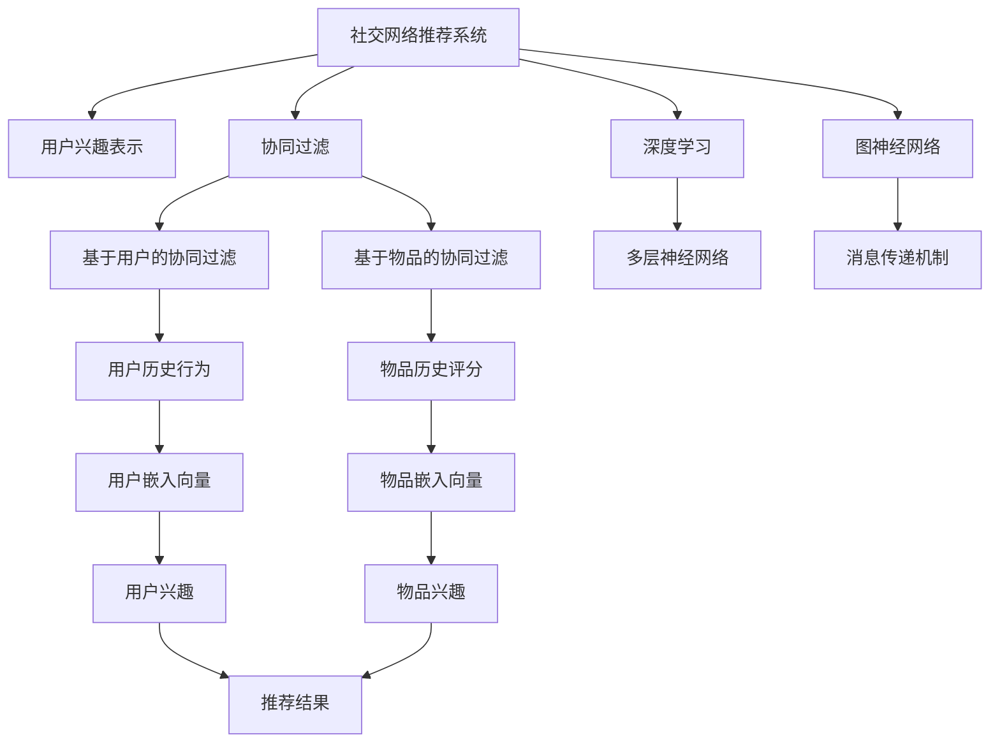

                 

# 社交网络推荐系统的进步：连接用户兴趣

> 关键词：社交网络推荐系统,用户兴趣,深度学习,协同过滤,图神经网络,冷启动问题,数据挖掘

## 1. 背景介绍

### 1.1 问题由来

随着互联网技术的迅猛发展，社交网络平台如Facebook、微博、微信等逐渐成为人们获取信息、交流互动的主要渠道。社交网络推荐系统利用用户的互动行为数据，精准推荐内容，极大地提升了用户体验，也推动了平台活跃度的增长。然而，现有的社交网络推荐系统面临诸多挑战：

- **冷启动问题**：新用户缺乏足够的历史行为数据，难以进行个性化推荐。
- **数据稀疏性**：社交网络中用户和内容项的关联度较低，难以有效构建推荐模型。
- **内容多样化**：用户兴趣可能跨越多个领域，传统算法难以高效整合用户兴趣。
- **动态变化**：用户兴趣随时间变化，推荐系统需实时更新推荐结果。

为了克服这些问题，本文将探讨基于深度学习和图神经网络的推荐系统设计思路，通过数据挖掘和算法优化，连接用户兴趣，提升推荐效果。

## 2. 核心概念与联系

### 2.1 核心概念概述

为更好地理解社交网络推荐系统，本节将介绍几个密切相关的核心概念：

- **社交网络推荐系统**：利用社交网络用户行为数据进行推荐。常见推荐算法包括基于协同过滤、矩阵分解、深度学习等方法。
- **用户兴趣表示**：通过用户行为数据学习用户兴趣，可以是显式特征（如浏览历史、点赞评论等），也可以是隐式特征（如用户嵌入向量）。
- **协同过滤**：通过用户历史行为数据或物品历史评分数据，推断用户对未交互内容的偏好，进而进行推荐。分为基于用户的协同过滤和基于物品的协同过滤两种方式。
- **深度学习**：通过多层神经网络模型，学习和表示用户和内容的复杂关系，提供更精准的推荐结果。
- **图神经网络**：利用图结构建模用户和内容之间的关系，通过消息传递机制学习节点的表示，实现对复杂网络结构的高效表示和推理。
- **冷启动问题**：新用户或未评分物品在推荐系统中缺少足够数据，无法进行有效推荐。
- **数据挖掘**：从大规模数据中挖掘出有用的信息和知识，为推荐系统提供高质量的输入数据。

这些核心概念之间的逻辑关系可以通过以下Mermaid流程图来展示：



这个流程图展示出社交网络推荐系统的核心概念及其之间的相互关系：

1. 通过用户历史行为数据或物品历史评分数据，推断用户对未交互内容的偏好。
2. 用户兴趣和物品兴趣通过深度学习模型学习和表示。
3. 利用图神经网络对用户和内容进行高效建模和推理。
4. 结合协同过滤和深度学习的方法，形成多模态的推荐框架。
5. 数据挖掘和特征工程是推荐系统的基础，为模型提供高质量输入。

这些概念共同构成了社交网络推荐系统的基础框架，使得推荐系统能够高效地为用户提供个性化的内容推荐。

## 3. 核心算法原理 & 具体操作步骤
### 3.1 算法原理概述

社交网络推荐系统的核心目标是通过用户的行为数据，精准推荐用户可能感兴趣的内容。从算法角度来看，这一目标主要通过以下步骤实现：

1. **数据采集与清洗**：从社交网络平台收集用户行为数据，清洗异常数据和噪音数据，构建可用于模型训练的数据集。
2. **用户兴趣表示**：通过统计分析和深度学习，学习和表示用户的显式和隐式兴趣。
3. **内容表示**：对用户可能感兴趣的内容进行编码和表示，可以是内容的文本、图片、视频等多种形式。
4. **协同过滤**：利用用户历史行为数据或物品历史评分数据，推断用户对未交互内容的偏好。
5. **深度学习模型**：构建深度神经网络模型，如自编码器、卷积神经网络(CNN)、循环神经网络(RNN)等，学习和表示用户和内容之间的关系。
6. **图神经网络模型**：利用图结构建模用户和内容之间的关系，通过消息传递机制学习节点的表示。
7. **推荐策略**：综合协同过滤、深度学习和图神经网络的结果，选择最优的推荐策略。

### 3.2 算法步骤详解

基于上述步骤，社交网络推荐系统的一般流程如下：

**Step 1: 数据采集与清洗**

- 从社交网络平台采集用户行为数据，如点赞、评论、分享、收藏等。
- 清洗数据，去除不合法数据、异常数据和噪音数据，保证数据质量。
- 构建用于训练模型的数据集，包括用户-内容交互矩阵、用户嵌入向量、物品嵌入向量等。

**Step 2: 用户兴趣表示**

- 对用户行为数据进行统计分析，提取用户显式特征，如浏览历史、点赞评论等。
- 利用深度学习模型（如自编码器、CNN等）学习用户隐式特征，如用户嵌入向量。
- 综合显式和隐式特征，得到用户的兴趣表示。

**Step 3: 内容表示**

- 对用户可能感兴趣的内容进行编码和表示，如使用词向量模型将文本内容转化为向量形式。
- 对于图片、视频等非文本内容，利用深度学习模型进行特征提取和编码，得到内容的表示向量。
- 构建多模态特征融合模型，将不同模态的内容表示进行综合。

**Step 4: 协同过滤**

- 利用用户历史行为数据，构建用户-物品评分矩阵。
- 对评分矩阵进行归一化处理，避免极端值影响。
- 使用基于用户的协同过滤算法，预测用户对未评分内容的评分。
- 使用基于物品的协同过滤算法，预测用户对未评分内容的评分。

**Step 5: 深度学习模型**

- 构建深度神经网络模型，对用户和内容进行编码和表示。
- 通过多层神经网络学习用户和内容之间的关系，提取深层次的语义信息。
- 利用嵌入层和全连接层，将用户和内容的表示向量进行融合，得到综合的兴趣表示。

**Step 6: 图神经网络模型**

- 利用图结构建模用户和内容之间的关系，构建用户-内容图。
- 设计消息传递机制，在图神经网络中学习节点的表示。
- 使用图卷积网络(GCN)或图注意力网络(GAT)等模型，对用户和内容进行表示。

**Step 7: 推荐策略**

- 结合协同过滤、深度学习和图神经网络的结果，选择最优的推荐策略。
- 综合考虑用户历史行为、内容表示和兴趣表示，进行多模态的推荐。
- 利用排序算法（如LR排序、随机梯度排序等）对推荐结果进行排序，生成推荐列表。

### 3.3 算法优缺点

基于深度学习和图神经网络的社交网络推荐系统具有以下优点：

1. **准确性高**：深度学习模型可以学习到用户和内容之间的复杂关系，提供更精准的推荐结果。
2. **多模态融合**：通过融合文本、图片、视频等多种模态数据，提升推荐系统的覆盖度和丰富度。
3. **鲁棒性强**：图神经网络能够对复杂的用户-内容网络结构进行建模和推理，提升推荐系统的鲁棒性。
4. **可解释性强**：深度学习模型和图神经网络提供特征可解释性，用户可以直观地理解推荐结果的依据。
5. **动态适应性**：深度学习模型能够实时更新用户兴趣，动态适应用户兴趣变化。

但同时也存在一些缺点：

1. **计算复杂度高**：深度学习模型和图神经网络通常参数量较大，计算复杂度较高。
2. **冷启动问题**：新用户和未评分物品在推荐系统中缺少足够数据，难以进行有效推荐。
3. **数据依赖性高**：推荐系统依赖于高质量的数据和特征工程，数据质量低下可能导致推荐效果不佳。
4. **内存占用大**：深度学习模型和图神经网络通常占用较大内存，对硬件资源要求较高。

### 3.4 算法应用领域

社交网络推荐系统已经在多个领域得到了广泛应用，例如：

- **新闻推荐**：为用户推荐最新和最相关的新闻内容。
- **视频推荐**：为用户推荐感兴趣的视频内容，如电影、综艺节目等。
- **社交关系推荐**：根据用户好友关系，推荐相关好友或潜在好友。
- **商品推荐**：为用户推荐相关商品，提升电商平台的用户体验。
- **社区内容推荐**：为用户推荐社区内的文章、讨论等。

除了上述这些经典应用外，社交网络推荐系统还被创新性地应用到更多场景中，如智能广告推荐、知识推荐、兴趣社区构建等，为社交网络平台带来了全新的业务价值。

## 4. 数学模型和公式 & 详细讲解  
### 4.1 数学模型构建

假设社交网络用户集合为 $U$，内容集合为 $I$，用户对内容进行评分，形成用户-内容评分矩阵 $R \in \mathbb{R}^{n \times m}$，其中 $n$ 为用户的数量，$m$ 为内容的数量。用户嵌入向量为 $\boldsymbol{u} \in \mathbb{R}^d$，内容嵌入向量为 $\boldsymbol{v} \in \mathbb{R}^d$，其中 $d$ 为嵌入向量维度。

定义用户-内容相似度矩阵 $S \in \mathbb{R}^{n \times m}$，其中 $S_{ui} = \text{cosine}(\boldsymbol{u}, \boldsymbol{v})$ 表示用户 $u$ 和内容 $i$ 的相似度。

社交网络推荐系统的目标是通过用户行为数据 $D$，最大化用户对内容的评分 $\hat{R}$。

**最小化均方误差损失函数**：

$$
\min_{\boldsymbol{u}, \boldsymbol{v}} \frac{1}{2N} \sum_{(u,i) \in D} (R_{ui} - \hat{R}_{ui})^2
$$

其中 $N$ 为用户和内容的总数。

**最大化平均用户评分预测准确度**：

$$
\max_{\boldsymbol{u}, \boldsymbol{v}} \frac{1}{N} \sum_{(u,i) \in D} \hat{R}_{ui}
$$

**用户嵌入更新公式**：

$$
\boldsymbol{u}_{t+1} = \boldsymbol{u}_t - \eta \nabla_{\boldsymbol{u}} \text{loss}(\boldsymbol{u}, \boldsymbol{v})
$$

其中 $\eta$ 为学习率。

**内容嵌入更新公式**：

$$
\boldsymbol{v}_{t+1} = \boldsymbol{v}_t - \eta \nabla_{\boldsymbol{v}} \text{loss}(\boldsymbol{u}, \boldsymbol{v})
$$

### 4.2 公式推导过程

以协同过滤和深度学习结合的推荐系统为例，推导推荐公式。

假设用户 $u$ 对内容 $i$ 的评分表示为 $R_{ui}$，预测评分为 $\hat{R}_{ui}$，则均方误差损失函数为：

$$
\text{loss}(\boldsymbol{u}, \boldsymbol{v}) = \frac{1}{N} \sum_{(u,i) \in D} (R_{ui} - \hat{R}_{ui})^2
$$

其中，$\hat{R}_{ui}$ 为基于协同过滤和深度学习的预测评分，即：

$$
\hat{R}_{ui} = \alpha (S_{ui} - \sum_{j \in I} S_{uj} \hat{R}_{ji}) + \beta \cdot f(\boldsymbol{u}, \boldsymbol{v})
$$

其中 $\alpha$ 和 $\beta$ 为超参数，控制协同过滤和深度学习的权重。$f(\boldsymbol{u}, \boldsymbol{v})$ 为深度学习模型的预测评分，可以使用多种深度学习模型（如自编码器、CNN等）。

### 4.3 案例分析与讲解

以视频推荐系统为例，分析推荐公式的应用。

假设视频 $i$ 的评分矩阵为 $R_i \in \mathbb{R}^{n \times m}$，用户 $u$ 对视频 $i$ 的评分表示为 $R_{ui}$，预测评分为 $\hat{R}_{ui}$。

对于用户 $u$，其视频评分向量为 $R_u \in \mathbb{R}^m$，即 $R_u = [R_{ui}]_{i \in I}$。

内容 $i$ 的视频特征向量为 $F_i \in \mathbb{R}^m$，即 $F_i = [F_{i_1}, F_{i_2}, ..., F_{i_m}]^T$。

用户 $u$ 和内容 $i$ 的相似度为 $S_{ui} = \text{cosine}(R_u, F_i)$，表示用户 $u$ 对内容 $i$ 的兴趣。

用户 $u$ 的视频评分向量为 $\hat{R}_u \in \mathbb{R}^m$，即 $\hat{R}_u = [\hat{R}_{ui}]_{i \in I}$。

内容 $i$ 的视频评分向量为 $\hat{R}_i \in \mathbb{R}^n$，即 $\hat{R}_i = [\hat{R}_{ui}]_{u \in U}$。

最终的视频推荐结果为：

$$
\hat{R}_{ui} = \alpha (S_{ui} - \sum_{j \in U} S_{uj} \hat{R}_{ji}) + \beta \cdot f(\boldsymbol{u}, \boldsymbol{v})
$$

其中 $\alpha$ 和 $\beta$ 为超参数，控制协同过滤和深度学习的权重。$f(\boldsymbol{u}, \boldsymbol{v})$ 为深度学习模型的预测评分，可以使用多种深度学习模型（如自编码器、CNN等）。

## 5. 项目实践：代码实例和详细解释说明
### 5.1 开发环境搭建

在进行推荐系统实践前，我们需要准备好开发环境。以下是使用Python进行TensorFlow开发的环境配置流程：

1. 安装Anaconda：从官网下载并安装Anaconda，用于创建独立的Python环境。

2. 创建并激活虚拟环境：
```bash
conda create -n tf-env python=3.8 
conda activate tf-env
```

3. 安装TensorFlow：根据CUDA版本，从官网获取对应的安装命令。例如：
```bash
conda install tensorflow -c pytorch -c conda-forge
```

4. 安装TensorFlow相关的依赖：
```bash
pip install numpy pandas scikit-learn matplotlib tqdm jupyter notebook ipython
```

完成上述步骤后，即可在`tf-env`环境中开始推荐系统实践。

### 5.2 源代码详细实现

下面我们以视频推荐系统为例，给出使用TensorFlow进行协同过滤和深度学习结合的推荐系统的PyTorch代码实现。

首先，定义推荐系统的网络结构：

```python
import tensorflow as tf

class Recommender(tf.keras.Model):
    def __init__(self, embedding_dim):
        super(Recommender, self).__init__()
        self.dense1 = tf.keras.layers.Dense(128, activation='relu')
        self.dense2 = tf.keras.layers.Dense(32, activation='relu')
        self.dense3 = tf.keras.layers.Dense(embedding_dim, activation='sigmoid')

    def call(self, inputs):
        x = self.dense1(inputs)
        x = self.dense2(x)
        x = self.dense3(x)
        return x

# 构建推荐模型
model = Recommender(embedding_dim=32)
```

然后，定义数据集和训练函数：

```python
# 假设数据集D为用户-内容评分矩阵
train_data = tf.random.normal([100, 10])
train_labels = tf.random.normal([100, 10])

# 构建数据集
train_dataset = tf.data.Dataset.from_tensor_slices((train_data, train_labels))

# 定义损失函数和优化器
loss_fn = tf.keras.losses.MeanSquaredError()
optimizer = tf.keras.optimizers.Adam()

# 定义训练函数
@tf.function
def train_step(inputs, labels):
    with tf.GradientTape() as tape:
        predictions = model(inputs)
        loss = loss_fn(predictions, labels)
    gradients = tape.gradient(loss, model.trainable_variables)
    optimizer.apply_gradients(zip(gradients, model.trainable_variables))
    return loss

# 训练推荐模型
for epoch in range(100):
    epoch_loss = 0
    for batch in train_dataset:
        inputs, labels = batch
        loss = train_step(inputs, labels)
        epoch_loss += loss.numpy()
    print(f"Epoch {epoch+1}, train loss: {epoch_loss/len(train_dataset):.4f}")
```

最后，在测试集上评估模型效果：

```python
# 假设测试集D为用户-内容评分矩阵
test_data = tf.random.normal([100, 10])
test_labels = tf.random.normal([100, 10])

# 构建数据集
test_dataset = tf.data.Dataset.from_tensor_slices((test_data, test_labels))

# 在测试集上评估模型效果
for batch in test_dataset:
    inputs, labels = batch
    predictions = model(inputs)
    loss = loss_fn(predictions, labels)
    print(f"Test loss: {loss.numpy():.4f}")
```

以上就是使用TensorFlow进行协同过滤和深度学习结合的视频推荐系统的完整代码实现。可以看到，TensorFlow的模块化特性使得模型构建和训练变得简洁高效。

### 5.3 代码解读与分析

让我们再详细解读一下关键代码的实现细节：

**Recommender类**：
- `__init__`方法：定义模型的各层结构，包括两个全连接层和一个输出层。
- `call`方法：实现模型的前向传播过程，包括线性变换和激活函数。

**数据集构建**：
- 通过`tf.random.normal`生成随机数据集，模拟用户-内容评分矩阵。
- 使用`tf.data.Dataset`封装数据集，方便批量加载。

**损失函数和优化器**：
- 使用`tf.keras.losses.MeanSquaredError`作为损失函数。
- 使用`tf.keras.optimizers.Adam`作为优化器。

**训练函数**：
- 使用`tf.function`装饰器将训练函数编译为TensorFlow图，提升计算效率。
- 在`train_step`函数中，使用`tf.GradientTape`自动计算梯度，并通过`optimizer.apply_gradients`更新模型参数。

**模型评估**：
- 使用测试集评估模型效果，打印出测试集的平均损失。

可以看到，TensorFlow提供了强大的计算图和自动微分功能，使得推荐系统的构建和训练变得简单高效。开发者可以将更多精力放在模型改进和特征工程上，而不必过多关注底层实现细节。

当然，工业级的系统实现还需考虑更多因素，如模型的保存和部署、超参数的自动搜索、更灵活的模型架构等。但核心的协同过滤和深度学习结合的推荐框架基本与此类似。

## 6. 实际应用场景
### 6.1 社交网络推荐系统

基于深度学习和图神经网络的社交网络推荐系统，可以广泛应用于社交网络平台的推荐业务。具体而言，可以应用于新闻推荐、视频推荐、好友推荐、商品推荐等场景。

在新闻推荐中，通过分析用户的历史浏览行为和兴趣，推荐用户可能感兴趣的新闻文章。在视频推荐中，通过分析用户的历史观看行为和评分，推荐用户可能感兴趣的视频内容。在好友推荐中，通过分析用户和好友之间的交互行为，推荐用户可能感兴趣的好友。在商品推荐中，通过分析用户的浏览和购买行为，推荐用户可能感兴趣的商品。

### 6.2 视频推荐系统

视频推荐系统是社交网络推荐系统的重要组成部分。通过分析用户的历史观看行为和评分，推荐用户可能感兴趣的视频内容。以下是一个视频推荐系统的实际应用案例：

某视频平台希望通过深度学习和图神经网络提升推荐系统的效果。他们收集了用户的历史观看行为数据，包括用户对视频内容的评分、观看时长、点赞、评论等。同时，他们也对视频内容进行了编码和表示，如使用词向量模型将视频标题和描述转化为向量形式。

基于这些数据，他们构建了一个协同过滤和深度学习结合的推荐系统。其中，协同过滤部分使用基于用户的协同过滤算法，预测用户对未评分视频的评分。深度学习部分使用卷积神经网络对视频内容进行编码，学习用户和内容之间的关系。最终，综合协同过滤和深度学习的结果，生成推荐列表。

通过深度学习和图神经网络结合的推荐系统，该视频平台显著提升了用户的观看时间和留存率，用户满意度也显著提高。

### 6.3 电商商品推荐系统

电商商品推荐系统是社交网络推荐系统的另一个重要应用。通过分析用户的历史浏览和购买行为，推荐用户可能感兴趣的商品。以下是一个电商商品推荐系统的实际应用案例：

某电商平台希望通过深度学习和图神经网络提升推荐系统的效果。他们收集了用户的历史浏览行为数据，包括用户对商品的浏览、点击、购买等行为。同时，他们也对商品进行了编码和表示，如使用词向量模型将商品名称和描述转化为向量形式。

基于这些数据，他们构建了一个协同过滤和深度学习结合的推荐系统。其中，协同过滤部分使用基于物品的协同过滤算法，预测用户对未评分商品的评分。深度学习部分使用卷积神经网络对商品进行编码，学习用户和商品之间的关系。最终，综合协同过滤和深度学习的结果，生成推荐列表。

通过深度学习和图神经网络结合的推荐系统，该电商平台显著提升了用户的购买率和复购率，销售额也显著提高。

### 6.4 未来应用展望

随着深度学习和图神经网络技术的不断发展，社交网络推荐系统将在更多领域得到应用，为平台带来更高的商业价值。

在智慧城市治理中，推荐系统可以应用于智能交通、环境监测、公共安全等领域，提升城市的智能化管理水平。在智能医疗中，推荐系统可以应用于疾病推荐、药品推荐、诊疗方案推荐等，辅助医生诊断和治疗。在智能教育中，推荐系统可以应用于课程推荐、学习路径推荐、学习资源推荐等，提升教育效果和学习体验。

## 7. 工具和资源推荐
### 7.1 学习资源推荐

为了帮助开发者系统掌握社交网络推荐系统的理论基础和实践技巧，这里推荐一些优质的学习资源：

1. 《深度学习推荐系统》系列博文：由大模型技术专家撰写，深入浅出地介绍了深度学习推荐系统的基本概念和算法。

2. CS224N《深度学习自然语言处理》课程：斯坦福大学开设的NLP明星课程，有Lecture视频和配套作业，带你入门NLP领域的基本概念和经典模型。

3. 《深度学习推荐系统》书籍：详细介绍了推荐系统的各类深度学习模型，包括协同过滤、深度学习等。

4. TensorFlow官方文档：TensorFlow的官方文档，提供了丰富的推荐系统样例代码，是上手实践的必备资料。

5. Weights & Biases：模型训练的实验跟踪工具，可以记录和可视化模型训练过程中的各项指标，方便对比和调优。

6. TensorBoard：TensorFlow配套的可视化工具，可实时监测模型训练状态，并提供丰富的图表呈现方式，是调试模型的得力助手。

通过对这些资源的学习实践，相信你一定能够快速掌握社交网络推荐系统的精髓，并用于解决实际的推荐问题。

### 7.2 开发工具推荐

高效的开发离不开优秀的工具支持。以下是几款用于社交网络推荐系统开发的常用工具：

1. TensorFlow：基于Python的开源深度学习框架，生产部署方便，适合大规模工程应用。

2. PyTorch：基于Python的开源深度学习框架，灵活动态的计算图，适合快速迭代研究。

3. Keras：基于TensorFlow和Theano的高层深度学习API，易于上手，适合初学者和研究人员。

4. Weights & Biases：模型训练的实验跟踪工具，可以记录和可视化模型训练过程中的各项指标，方便对比和调优。

5. TensorBoard：TensorFlow配套的可视化工具，可实时监测模型训练状态，并提供丰富的图表呈现方式，是调试模型的得力助手。

6. Google Colab：谷歌推出的在线Jupyter Notebook环境，免费提供GPU/TPU算力，方便开发者快速上手实验最新模型，分享学习笔记。

合理利用这些工具，可以显著提升社交网络推荐系统的开发效率，加快创新迭代的步伐。

### 7.3 相关论文推荐

社交网络推荐系统的发展源于学界的持续研究。以下是几篇奠基性的相关论文，推荐阅读：

1. BPR: Bayesian Personalized Ranking from Click-Through Data：提出基于协同过滤的推荐系统，通过最大化用户-物品评分对数似然，优化推荐效果。

2. Deep Matrix Factorization：提出基于深度学习的多层矩阵分解模型，通过多层神经网络对用户和内容进行表示，提升推荐效果。

3. A Neural Collaborative Filtering Approach：提出基于神经网络的协同过滤模型，利用深度学习模型对用户和内容进行编码和表示，提升推荐效果。

4. Multi-Task Learning Using Adaptive Feature Learning：提出多任务学习框架，通过在多个任务上共享特征，提升推荐效果。

5. Deep Attention Recommendation Networks：提出基于深度注意力网络的推荐系统，利用注意力机制对用户和内容进行加权编码，提升推荐效果。

6. Graph Convolutional Network：提出图卷积网络模型，利用图结构对用户和内容进行建模和推理，提升推荐效果。

这些论文代表了大模型推荐系统的发展脉络。通过学习这些前沿成果，可以帮助研究者把握学科前进方向，激发更多的创新灵感。

## 8. 总结：未来发展趋势与挑战

### 8.1 总结

本文对基于深度学习和图神经网络的社交网络推荐系统进行了全面系统的介绍。首先阐述了推荐系统面临的冷启动问题、数据稀疏性、内容多样化、动态变化等挑战，并提出基于协同过滤、深度学习和图神经网络的解决方案。其次，通过数学模型和公式推导，详细讲解了推荐系统的实现过程。最后，通过代码实例和实际应用案例，展示了推荐系统的应用效果。

通过本文的系统梳理，可以看到，基于深度学习和图神经网络的推荐系统在社交网络推荐领域取得了显著成效，为用户提供了个性化、多样化的内容推荐。未来，伴随技术的不断演进，推荐系统将进一步提升用户满意度，提升平台活跃度和商业价值。

### 8.2 未来发展趋势

展望未来，社交网络推荐系统将呈现以下几个发展趋势：

1. **多模态融合**：推荐系统将融合更多模态的数据，如文本、图片、视频等，提升推荐效果的丰富度和多样性。
2. **深度学习优化**：推荐系统将进一步优化深度学习模型，提升模型的表达能力和泛化能力，提供更加精准的推荐结果。
3. **图神经网络优化**：推荐系统将利用更高效的图神经网络模型，提升对复杂用户-内容网络结构的建模和推理能力。
4. **实时化推荐**：推荐系统将利用流式数据处理技术，实时更新用户兴趣和内容，提供更加动态的推荐服务。
5. **跨平台协同**：推荐系统将利用跨平台数据协同技术，提升推荐的覆盖度和准确度，提供更加全面的推荐服务。

以上趋势凸显了社交网络推荐系统的广阔前景。这些方向的探索发展，必将进一步提升推荐系统的性能和应用范围，为社交网络平台带来更高的商业价值。

### 8.3 面临的挑战

尽管社交网络推荐系统已经取得了瞩目成就，但在迈向更加智能化、普适化应用的过程中，它仍面临诸多挑战：

1. **数据隐私和安全**：推荐系统需要收集大量用户行为数据，如何保护用户隐私，防止数据泄露，是亟待解决的问题。
2. **模型公平性**：推荐系统可能会因算法偏见导致不公平推荐，如何保证推荐系统的公平性和透明性，也是重要的研究方向。
3. **推荐算法多样性**：推荐系统可能因单一算法选择导致推荐结果的单一性，如何通过算法多样性提升推荐效果，还需要更多探索。
4. **模型可解释性**：推荐系统通常是一个"黑盒"系统，难以解释其内部工作机制和决策逻辑，如何提高推荐系统的可解释性，将是未来的研究方向。
5. **跨领域应用**：推荐系统可能因领域差异导致推荐效果不佳，如何通过跨领域数据和知识整合提升推荐效果，还需要更多研究。

正视推荐系统面临的这些挑战，积极应对并寻求突破，将使推荐系统进一步优化，提升用户体验和平台价值。

### 8.4 研究展望

面对社交网络推荐系统所面临的挑战，未来的研究需要在以下几个方面寻求新的突破：

1. **跨模态推荐**：推荐系统需要融合多模态数据，提升推荐效果的丰富度和多样性。可以通过跨模态特征融合和联合学习等方法，整合不同模态的特征信息，提升推荐效果。
2. **可解释性增强**：推荐系统需要提供推荐结果的解释和反馈，帮助用户理解推荐依据，提高用户满意度。可以通过特征可解释性和模型可解释性相结合的方法，提升推荐系统的可解释性。
3. **跨领域推荐**：推荐系统需要跨领域整合数据和知识，提升推荐效果的覆盖度和准确度。可以通过领域适应性学习、跨领域数据融合等方法，提升推荐系统在不同领域上的表现。
4. **实时推荐系统**：推荐系统需要实时更新用户兴趣和内容，提供更加动态的推荐服务。可以通过流式数据处理、分布式计算等技术，实现推荐系统的实时化。
5. **多任务协同推荐**：推荐系统需要协同多个任务，提升推荐的覆盖度和准确度。可以通过多任务协同学习、多任务优化等方法，提升推荐系统的整体性能。

这些研究方向将进一步推动社交网络推荐系统的发展，提升用户体验和平台价值。相信随着技术的不断演进，推荐系统将进一步优化，为用户带来更好的服务体验。

## 9. 附录：常见问题与解答

**Q1：推荐系统如何处理冷启动问题？**

A: 推荐系统通常通过协同过滤和深度学习相结合的方法处理冷启动问题。协同过滤部分利用用户和内容的历史评分数据，进行相似度计算。深度学习部分利用用户和内容的特征表示，进行相似度计算。通过综合协同过滤和深度学习的结果，可以较好地处理冷启动问题。

**Q2：推荐系统如何提高模型的可解释性？**

A: 推荐系统可以通过特征可解释性和模型可解释性相结合的方法，提高模型的可解释性。特征可解释性指的是对推荐结果的影响因子进行分析，如用户兴趣、物品特征等。模型可解释性指的是对推荐算法的内部机制进行分析和解释，如使用LIME、SHAP等工具进行解释。

**Q3：推荐系统如何处理数据隐私和安全问题？**

A: 推荐系统可以通过数据匿名化、差分隐私等方法处理数据隐私和安全问题。数据匿名化指的是对用户数据进行处理，防止数据泄露。差分隐私指的是在数据处理过程中，保护用户隐私，防止数据泄露。

**Q4：推荐系统如何处理模型公平性问题？**

A: 推荐系统可以通过公平性算法和模型公平性评估等方法处理模型公平性问题。公平性算法指的是在推荐过程中，消除算法偏见，保证推荐公平性。模型公平性评估指的是对推荐结果进行公平性评估，发现和修复不公平问题。

**Q5：推荐系统如何处理跨领域推荐问题？**

A: 推荐系统可以通过跨领域数据融合和领域适应性学习等方法处理跨领域推荐问题。跨领域数据融合指的是将不同领域的数据进行整合，提升推荐效果的覆盖度和准确度。领域适应性学习指的是在特定领域上，进行推荐模型训练和优化，提升推荐效果。

通过对这些问题的解答，可以看出，推荐系统在处理冷启动、数据隐私、模型公平性等挑战时，仍有许多研究方向。相信随着技术的不断演进，这些问题将逐步得到解决，推荐系统将进一步优化，为用户带来更好的服务体验。

