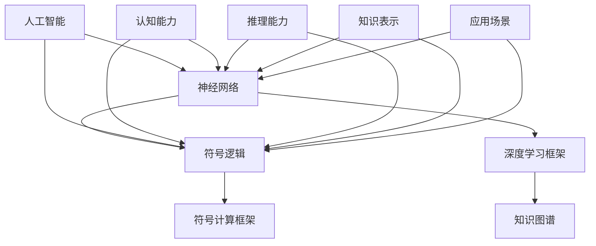

                 

## 1. 背景介绍

### 1.1 问题由来
近年来，随着深度学习技术的发展，人工智能(AI)在图像识别、语音识别、自然语言处理(NLP)等领域取得了显著进展。然而，深度学习模型在理解和应用符号、规则和逻辑方面仍存在明显局限。神经符号人工智能（Neuro-Symbolic AI），作为结合神经网络和符号推理的先进方法，正逐渐成为解决复杂智能问题的新范式。

神经符号人工智能整合了神经网络和符号逻辑的优势，旨在构建既能够处理复杂结构数据又具备高层次认知能力的智能系统。这种技术不仅能处理复杂推理任务，还能对知识和逻辑进行符号表达，从而形成更加灵活、可解释、可扩展的智能模型。

### 1.2 问题核心关键点
神经符号人工智能的核心在于如何将符号逻辑和神经网络有效融合。具体来说：

- **符号推理**：涉及逻辑变量、规则、约束等，能够处理有逻辑结构的推理和规划问题。
- **神经网络**：能够自动学习数据表示，对大规模数据进行有效处理，并具备自适应能力。
- **协同工作**：神经网络和符号逻辑的协同工作，使得系统既能高效处理感知数据，又能灵活应对复杂的推理和决策任务。

### 1.3 问题研究意义
研究神经符号人工智能，对于提升AI系统的认知能力和应用范围，推动人工智能技术的普及和产业化，具有重要意义：

- **增强智能决策**：符号逻辑能够提升系统的推理和决策能力，帮助模型理解和处理复杂任务。
- **提升应用效果**：通过结合符号推理，AI系统能够在特定领域实现更高的应用效果和泛化能力。
- **促进产业升级**：神经符号AI技术能够被广泛应用到医疗、金融、制造等行业，推动相关产业的智能化转型。
- **构建可信系统**：符号推理能够提供更高层次的可解释性和可控性，构建更加可信、透明的人工智能系统。

## 2. 核心概念与联系

### 2.1 核心概念概述
神经符号人工智能结合了神经网络和符号逻辑，旨在构建能够进行复杂符号推理和决策的智能系统。以下为主要核心概念：

- **神经网络**：包括卷积神经网络(CNN)、循环神经网络(RNN)、变压器(Transformer)等，用于自动学习数据表示。
- **符号逻辑**：涉及逻辑变量、命题、规则、推理器等，用于进行精确的符号推理和决策。
- **知识图谱**：结构化的知识表示，结合符号逻辑，提升模型的认知能力。
- **深度学习框架**：如TensorFlow、PyTorch等，提供高效的神经网络计算图支持。
- **符号计算框架**：如Prolog、CLIPS等，提供灵活的符号推理能力。

这些概念通过以下Mermaid流程图展示了它们之间的联系：



### 2.2 核心概念原理和架构的 Mermaid 流程图

以下是一个示例流程图的代码，展示了神经符号AI系统的核心架构和工作原理：


这个流程图说明了数据通过神经网络处理后，与符号逻辑和知识图谱进行融合，最终产生输出。同时，符号逻辑处理和规则应用可以进一步优化模型，使其更适应特定的应用场景。

## 3. 核心算法原理 & 具体操作步骤
### 3.1 算法原理概述

神经符号人工智能的核心算法原理是结合神经网络和符号逻辑，构建能够进行复杂推理和决策的智能系统。其核心思想是将符号逻辑的精确性和神经网络的自适应性结合起来，形成一种新的智能处理范式。

具体来说，神经符号AI系统通常包含以下几个关键组件：

- **符号推理器**：用于处理逻辑变量和规则，进行精确推理。
- **神经网络**：用于处理感知数据，学习数据表示。
- **知识库**：用于存储和检索知识，提升系统的认知能力。
- **融合模块**：用于将符号推理和神经网络的结果进行综合，形成统一的认知模型。

这种系统能够在处理复杂逻辑任务时，利用符号推理的精确性和神经网络的灵活性，实现高效的推理和决策。

### 3.2 算法步骤详解

构建神经符号AI系统通常遵循以下步骤：

**Step 1: 数据收集与预处理**

1. **数据收集**：从不同数据源收集所需数据，包括结构化数据、非结构化数据、规则等。
2. **数据预处理**：清洗和标准化数据，确保数据的完整性和一致性。

**Step 2: 符号逻辑定义**

1. **定义符号**：定义逻辑变量和规则，确保逻辑一致性和完备性。
2. **构建推理器**：使用Prolog、CLIPS等符号逻辑框架构建推理器，处理逻辑变量和规则。

**Step 3: 神经网络训练**

1. **选择网络结构**：根据任务需求选择合适的神经网络结构，如CNN、RNN、Transformer等。
2. **数据输入**：将预处理后的数据输入神经网络进行训练。
3. **参数优化**：使用梯度下降等优化算法更新模型参数，提升模型精度。

**Step 4: 知识图谱构建**

1. **数据融合**：将神经网络学习到的特征与符号逻辑中的知识进行融合，形成知识图谱。
2. **知识表示**：使用RDF、OWL等语言表示知识图谱中的关系和实体。

**Step 5: 系统集成**

1. **模块集成**：将符号推理器、神经网络、知识图谱进行集成，形成一个完整的智能系统。
2. **测试与优化**：使用测试数据评估系统性能，根据结果进行优化调整。

### 3.3 算法优缺点

神经符号人工智能具有以下优点：

1. **高效推理**：结合神经网络的灵活性和符号逻辑的精确性，能够高效处理复杂推理任务。
2. **可解释性**：符号逻辑提供清晰的推理路径，使得系统的决策过程具备高度可解释性。
3. **适应性强**：神经网络具备自适应能力，能够处理大规模数据和复杂结构。
4. **应用广泛**：在医疗、金融、教育、制造等多个领域，神经符号AI技术都有广泛应用前景。

同时，该方法也存在一些缺点：

1. **模型复杂**：神经符号AI系统的构建需要综合考虑符号逻辑和神经网络，导致模型结构复杂。
2. **计算量大**：在处理大量数据和复杂推理任务时，计算成本较高。
3. **开发难度高**：需要结合符号逻辑和神经网络的知识，对开发人员要求较高。

### 3.4 算法应用领域

神经符号人工智能在多个领域都有广泛应用，具体包括：

- **医疗诊断**：结合符号逻辑和神经网络，辅助医生进行疾病诊断和治疗决策。
- **金融分析**：使用知识图谱和符号推理，提升金融风险评估和投资策略制定能力。
- **教育评估**：通过符号推理和知识表示，评估学生的学习能力和知识掌握情况。
- **制造规划**：结合符号逻辑和神经网络，优化制造流程和资源分配。
- **城市管理**：使用符号推理和知识图谱，优化城市交通和环境治理。

## 4. 数学模型和公式 & 详细讲解 & 举例说明

### 4.1 数学模型构建

神经符号人工智能系统的数学模型通常由以下几个部分构成：

- **符号逻辑**：涉及命题逻辑、谓词逻辑、模型推理等，用于描述符号推理过程。
- **神经网络**：使用深度学习框架，构建多层神经网络，用于处理感知数据。
- **知识图谱**：使用知识表示语言，如RDF、OWL等，描述知识库中的实体和关系。

以下是一个简化的符号逻辑模型的例子，使用Prolog语言描述：

```prolog
% 定义逻辑变量
variable(x, y).
% 定义规则
1 :-
    x + y = 3.
2 :-
    x - y = 1.
% 求解x和y的值
solve:-
    x = 2, y = 1.
```

### 4.2 公式推导过程

在神经符号AI系统中，通常使用符号逻辑和神经网络相结合的方式进行推理。以下是一个简单的符号逻辑推理的例子：

假设有一个逻辑推理问题：

```
前提：x + y = 3.
前提：x - y = 1.
推理：求x和y的值。
```

使用符号逻辑进行推理的步骤如下：

1. **定义变量和规则**：
```prolog
variable(x, y).
1 :-
    x + y = 3.
2 :-
    x - y = 1.
```

2. **求解变量**：
```prolog
solve:-
    x = 2, y = 1.
```

3. **验证推理结果**：
```prolog
solve.
```

得到结果：
```
x = 2,
y = 1.
```

### 4.3 案例分析与讲解

以医疗诊断为例，介绍如何使用神经符号AI技术。

**Step 1: 数据收集**

收集医院中的患者数据，包括病历、检查报告、诊断结果等。

**Step 2: 符号逻辑定义**

定义逻辑变量和规则，用于描述疾病诊断过程。例如，可以定义以下规则：

```prolog
% 定义逻辑变量
variable(patient, diagnosis, treatment).
% 定义规则
1 :-
    patient has symptom = 'fever', diagnosis = 'flu'.
2 :-
    patient has symptom = 'cough', diagnosis = 'pneumonia'.
3 :-
    diagnosis = 'flu', treatment = 'antiviral'.
4 :-
    diagnosis = 'pneumonia', treatment = 'antibiotic'.
```

**Step 3: 神经网络训练**

使用神经网络处理患者数据，学习疾病特征。例如，可以使用卷积神经网络对X光片进行分类：

```python
import tensorflow as tf
from tensorflow.keras import layers

# 定义神经网络模型
model = tf.keras.Sequential([
    layers.Conv2D(32, (3, 3), activation='relu', input_shape=(256, 256, 3)),
    layers.MaxPooling2D((2, 2)),
    layers.Flatten(),
    layers.Dense(128, activation='relu'),
    layers.Dense(1, activation='sigmoid')
])

# 训练神经网络
model.compile(optimizer='adam', loss='binary_crossentropy', metrics=['accuracy'])
model.fit(train_data, train_labels, epochs=10)
```

**Step 4: 知识图谱构建**

将神经网络学习到的疾病特征与符号逻辑中的知识进行融合，形成知识图谱。例如，可以使用RDF语言表示：

```rdf
<http://example.org/disease> <http://www.w3.org/1999/02/22-rdf-syntax-ns#type> <http://example.org/Disease>.
<http://example.org/disease> <http://www.w3.org/2000/01/rdf-schema#label> "流感".
<http://example.org/disease> <http://www.w3.org/2000/01/rdf-schema#description> "由发热、咳嗽等症状引起，需用抗病毒药物治疗".
```

**Step 5: 系统集成**

将符号推理器、神经网络和知识图谱进行集成，形成一个完整的智能系统。例如，可以使用CLIPS框架进行集成：

```python
from clasp import CLASP

# 加载知识库
knowledge_base = CLASP.load_kb('example.kb')

# 加载神经网络模型
model = tf.keras.models.load_model('disease_model.h5')

# 定义推理器
inference = CLASP.InferenceEngine(knowledge_base)

# 执行推理
result = inference.execute([{'patient_id': 12345, 'symptoms': ['fever', 'cough']}])
```

通过以上步骤，神经符号AI系统可以高效处理复杂医疗诊断问题，提升医生的诊断准确率和决策能力。

## 5. 项目实践：代码实例和详细解释说明

### 5.1 开发环境搭建

构建神经符号AI系统需要多种工具和框架的支持。以下是Python开发环境的搭建步骤：

1. **安装Python和相关库**：
```bash
conda create -n neuro-symbolic python=3.8
conda activate neuro-symbolic
pip install tensorflow prolog clasp
```

2. **下载并配置知识库**：
```bash
git clone https://github.com/clasp-project/clasp-data.git
cd clasp-data
```

3. **下载并配置神经网络模型**：
```bash
git clone https://github.com/tensorflow/models.git
cd models/research/dl
```

### 5.2 源代码详细实现

以下是一个简单的神经符号AI系统实现，用于医疗诊断：

**Step 1: 数据预处理**

```python
import pandas as pd
from tensorflow.keras.preprocessing import image

# 加载数据
data = pd.read_csv('patient_data.csv')
images = []
labels = []

for index, row in data.iterrows():
    image_path = row['image_path']
    image = image.load_img(image_path, target_size=(256, 256))
    image = image_to_array(image)
    image = np.array(image)
    image = image / 255.0  # 归一化
    images.append(image)
    labels.append(row['disease'])

# 转换为numpy数组
images = np.array(images)
labels = np.array(labels)
```

**Step 2: 神经网络训练**

```python
import tensorflow as tf
from tensorflow.keras import layers

# 定义神经网络模型
model = tf.keras.Sequential([
    layers.Conv2D(32, (3, 3), activation='relu', input_shape=(256, 256, 3)),
    layers.MaxPooling2D((2, 2)),
    layers.Flatten(),
    layers.Dense(128, activation='relu'),
    layers.Dense(1, activation='sigmoid')
])

# 训练神经网络
model.compile(optimizer='adam', loss='binary_crossentropy', metrics=['accuracy'])
model.fit(images, labels, epochs=10)
```

**Step 3: 符号逻辑定义**

```prolog
% 定义逻辑变量
variable(patient, diagnosis, treatment).
% 定义规则
1 :-
    patient has symptom = 'fever', diagnosis = 'flu'.
2 :-
    patient has symptom = 'cough', diagnosis = 'pneumonia'.
3 :-
    diagnosis = 'flu', treatment = 'antiviral'.
4 :-
    diagnosis = 'pneumonia', treatment = 'antibiotic'.
```

**Step 4: 知识图谱构建**

```rdf
<http://example.org/disease> <http://www.w3.org/1999/02/22-rdf-syntax-ns#type> <http://example.org/Disease>.
<http://example.org/disease> <http://www.w3.org/2000/01/rdf-schema#label> "流感".
<http://example.org/disease> <http://www.w3.org/2000/01/rdf-schema#description> "由发热、咳嗽等症状引起，需用抗病毒药物治疗".
```

**Step 5: 系统集成**

```python
from clasp import CLASP

# 加载知识库
knowledge_base = CLASP.load_kb('example.kb')

# 加载神经网络模型
model = tf.keras.models.load_model('disease_model.h5')

# 定义推理器
inference = CLASP.InferenceEngine(knowledge_base)

# 执行推理
result = inference.execute([{'patient_id': 12345, 'symptoms': ['fever', 'cough']}])
```

### 5.3 代码解读与分析

上述代码实现了神经符号AI系统的主要功能：

1. **数据预处理**：加载患者数据，并将图像数据转换为numpy数组，进行归一化处理。
2. **神经网络训练**：定义神经网络模型，并使用患者数据进行训练。
3. **符号逻辑定义**：使用Prolog语言定义逻辑变量和规则，描述医疗诊断过程。
4. **知识图谱构建**：使用RDF语言表示知识图谱中的实体和关系。
5. **系统集成**：使用CLIPS框架将符号推理器、神经网络和知识图谱进行集成，形成完整的智能系统。

## 6. 实际应用场景

### 6.1 智能诊断系统

神经符号AI技术可以用于构建智能诊断系统，帮助医生快速、准确地进行疾病诊断。系统可以通过神经网络处理患者数据，学习疾病特征，再结合符号逻辑和知识图谱进行推理，提升诊断的准确性和效率。

### 6.2 金融风险评估

在金融领域，神经符号AI系统可以用于风险评估和投资策略制定。系统可以通过神经网络处理历史数据，学习市场趋势和规律，再结合符号逻辑和知识图谱进行推理，评估投资风险和制定投资策略。

### 6.3 教育个性化推荐

在教育领域，神经符号AI系统可以用于个性化推荐。系统可以通过神经网络处理学生的学习数据，学习学生的知识水平和兴趣爱好，再结合符号逻辑和知识图谱进行推理，推荐适合的学习资源和课程。

### 6.4 未来应用展望

未来，神经符号AI技术将在更多领域得到应用，如制造、城市管理、自然灾害预测等。通过结合符号逻辑和神经网络，系统可以更好地理解和处理复杂逻辑任务，提升决策的准确性和效率。

## 7. 工具和资源推荐

### 7.1 学习资源推荐

- **《Neuro-Symbolic Learning: A Unified Approach》**：深入讲解神经符号AI技术的理论基础和应用实践，推荐阅读。
- **Coursera课程《Introduction to Artificial Intelligence》**：介绍人工智能的基本概念和技术，适合入门学习。
- **ACL论文《A Survey on Neural-Symbolic Learning and Reasoning》**：全面总结神经符号AI的研究进展和应用场景。

### 7.2 开发工具推荐

- **TensorFlow**：强大的深度学习框架，支持神经网络的构建和训练。
- **Prolog**：经典的符号逻辑框架，适合定义逻辑变量和规则。
- **CLIPS**：灵活的推理引擎，适合构建符号推理器。

### 7.3 相关论文推荐

- **《Knowledge Representation and Reasoning with Neural-Symbolic Systems》**：综述了神经符号AI技术在知识表示和推理中的应用。
- **《Neural-Symbolic Reasoning with Conditional Random Fields》**：介绍基于神经网络的符号推理方法。
- **《Surgery Prediction with Deep Neural Networks and Symbolic Reasoning》**：应用神经符号AI技术进行医疗手术预测。

## 8. 总结：未来发展趋势与挑战

### 8.1 总结

神经符号人工智能是一种结合神经网络和符号逻辑的新型智能技术。本文详细介绍了神经符号AI的原理、操作步骤和应用场景，提供了系统化的技术指引。神经符号AI技术在医疗、金融、教育等多个领域都有广泛应用，具有强大的推理和决策能力。

### 8.2 未来发展趋势

未来，神经符号AI技术将在以下几个方面得到发展：

1. **多模态融合**：结合视觉、听觉、文本等多模态数据，提升系统的感知和理解能力。
2. **知识图谱演进**：通过动态更新知识图谱，提升系统的认知能力和推理能力。
3. **自动化推理**：开发自动化推理引擎，提升系统的推理速度和效率。
4. **人机协同**：结合人工干预和自动化推理，构建更加灵活、可靠的人工智能系统。

### 8.3 面临的挑战

尽管神经符号AI技术有着广阔的应用前景，但在发展过程中仍面临以下挑战：

1. **模型复杂性**：神经符号AI系统的构建需要综合考虑符号逻辑和神经网络，导致模型结构复杂。
2. **数据稀缺性**：符号逻辑推理需要大量的逻辑变量和规则，而神经网络训练需要大量的感知数据，两者都需要大量的数据支持。
3. **计算效率**：在处理复杂逻辑任务时，计算成本较高，需要高效的计算方法和优化策略。
4. **可解释性**：神经符号AI系统的决策过程需要具备高度可解释性，才能满足实际应用需求。

### 8.4 研究展望

未来，神经符号AI技术需要在以下几个方面进行深入研究：

1. **符号逻辑优化**：开发高效、灵活的符号逻辑推理引擎，提升系统的推理速度和效率。
2. **知识图谱演化**：研究知识图谱的动态更新机制，提升系统的认知能力和知识表示能力。
3. **多模态融合**：研究多模态数据的融合和表示方法，提升系统的感知和理解能力。
4. **自动化推理**：开发自动化推理引擎，实现高效、可靠的推理过程。

通过持续创新和优化，神经符号AI技术必将在更多领域得到应用，成为智能系统的核心技术之一。

## 9. 附录：常见问题与解答

**Q1: 神经符号AI与深度学习AI有何区别？**

A: 神经符号AI结合了符号逻辑和神经网络，能够处理更加复杂的逻辑推理和决策问题。而深度学习AI主要依赖于神经网络，擅长处理大规模数据和感知数据，但难以处理逻辑推理问题。

**Q2: 神经符号AI的系统集成有哪些步骤？**

A: 神经符号AI的系统集成通常包括以下步骤：
1. 定义符号逻辑变量和规则。
2. 构建符号逻辑推理器。
3. 训练神经网络模型。
4. 构建知识图谱。
5. 将符号逻辑推理器和神经网络进行集成。
6. 使用测试数据评估系统性能，根据结果进行优化调整。

**Q3: 神经符号AI的计算成本如何？**

A: 神经符号AI的计算成本较高，特别是在处理复杂逻辑任务时。需要考虑符号逻辑推理的计算复杂性和神经网络训练的计算成本。可以使用分布式计算和优化算法来降低计算成本。

**Q4: 神经符号AI的应用场景有哪些？**

A: 神经符号AI可以在医疗、金融、教育、制造等多个领域得到应用，如智能诊断、风险评估、个性化推荐、城市管理等。

通过本文的系统介绍和详细讲解，相信读者能够全面了解神经符号人工智能的原理和应用实践，掌握相关技术和工具，进一步推动神经符号AI技术的研发和应用。

