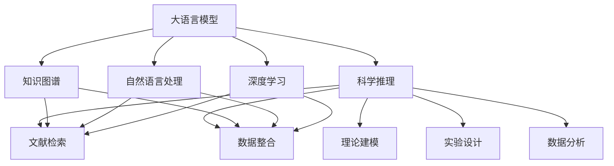

                 

# 科学推理：LLM 协助理论和实验研究

> 关键词：大语言模型(LLM),科学推理,理论研究,实验研究,模型整合,推理能力,模型评估,知识图谱,自然语言处理(NLP),深度学习,人工智能

## 1. 背景介绍

### 1.1 问题由来
科学推理是理解和构建知识体系的重要过程，涉及理论和实验两方面的相互作用。现代科学推理依赖于复杂的数据处理和逻辑推理，对于自然语言处理(NLP)技术的需求日益增长。传统上，科研工作者需要自行编写脚本进行数据收集和分析，这不仅耗时费力，还易出错。

大语言模型(LLM)的出现，改变了这一现状。LLM如OpenAI的GPT-3、Google的BERT等，能够理解和生成自然语言，具有强大的语言理解能力和文本处理能力，为科研工作者提供了高效的科学推理工具。利用LLM，科研工作者可以更快速、准确地进行数据收集、文本分析、结果解释等环节，大幅提高科研效率。

### 1.2 问题核心关键点
本文聚焦于LLM在科学推理中的应用，探索LLM如何辅助理论研究和实验研究，提升科研效率和成果质量。核心问题包括：

- LLM如何在理论研究中提取和理解专业术语、构建知识图谱，辅助科研人员进行文献检索、数据整合、理论建模？
- LLM如何在实验研究中生成假设、设计实验方案、分析实验结果，帮助科研人员探索新现象、验证假说、发现规律？
- LLM在跨学科研究中如何整合不同领域的数据和知识，进行知识迁移和创新？
- 如何评估LLM在科学推理中的表现，提升其可靠性、泛化能力和泛用性？

### 1.3 问题研究意义
利用LLM辅助科学推理，对于提升科研效率、促进跨学科合作、加速科学发现具有重要意义：

1. 提升效率：LLM可以自动处理大量文献、数据，提取关键信息，减少科研人员的时间消耗。
2. 促进合作：跨学科合作需要理解不同领域的知识，LLM能提供多语言、多领域的知识理解能力，促进知识交流和合作。
3. 加速发现：LLM能够探索新现象、验证假说、发现规律，加速科学发现的步伐。
4. 降低门槛：LLM的使用门槛较低，适合非专业领域的科研工作者使用，推动科学普及。
5. 推动创新：LLM的跨领域应用能力，有助于在不同领域进行知识迁移和创新，带来新的研究思路和方法。

## 2. 核心概念与联系

### 2.1 核心概念概述

科学推理涉及理论和实验两方面的相互作用。LLM在此过程中，能够作为理论和实验的桥梁，协助科研工作者进行知识提取、假设生成、实验设计、数据分析等环节。以下是几个核心概念及其联系：

- **大语言模型(LLM)**：一种具有强大语言理解和生成能力的神经网络模型，如GPT、BERT等，能够处理自然语言，用于提取和生成知识、推理和分析。
- **科学推理**：基于理论和实验，通过推理和归纳，构建和验证知识的科学过程，包括文献检索、数据整合、理论建模、实验设计、数据分析等环节。
- **知识图谱**：一种以图形化方式表示知识的模型，用于组织和整合多源异构数据，支持知识发现和推理。
- **自然语言处理(NLP)**：一门研究计算机如何处理和理解人类语言的学科，包括文本分析、信息提取、语义理解、文本生成等技术。
- **深度学习**：一种基于神经网络的机器学习技术，通过大量数据训练模型，具备较强的模式识别和预测能力。

这些概念之间的逻辑关系可以通过以下Mermaid流程图来展示：



这个流程图展示了大语言模型在科学推理中的角色，以及其在知识图谱、自然语言处理、深度学习等领域的应用和联系。

## 3. 核心算法原理 & 具体操作步骤
### 3.1 算法原理概述

LLM在科学推理中的核心算法原理，是通过预训练语言模型和微调技术，结合自然语言处理(NLP)和深度学习技术，辅助科研工作者进行理论和实验研究。主要包括以下几个关键步骤：

1. **数据收集与预处理**：收集科学文献、实验数据等，对其进行清洗、标注、分词等预处理操作。
2. **知识提取与整合**：使用LLM提取文献中的关键信息，构建知识图谱，整合多源异构数据。
3. **假设生成与验证**：利用LLM生成科学假设，设计实验方案，利用实验数据验证假设。
4. **数据分析与解释**：利用LLM分析实验结果，提取关键信息，生成报告，解释结果。

### 3.2 算法步骤详解

#### 3.2.1 数据收集与预处理

1. **数据收集**：收集科学文献、实验数据、科学报告等，可以通过网络爬虫、数据库查询等方式获取。
2. **数据预处理**：对收集到的数据进行清洗、去重、标注、分词等操作，确保数据质量。

**代码实现**：
```python
# 使用PyTorch和NLTK库进行文本预处理
import torch
from nltk.tokenize import word_tokenize
from nltk.corpus import stopwords

# 加载数据
data = load_data('path/to/data')

# 数据清洗
data = [d for d in data if len(d) > 0]

# 分词和去停用词
stop_words = set(stopwords.words('english'))
tokens = [word_tokenize(d) for d in data]
tokens = [[word.lower() for word in token if word not in stop_words] for token in tokens]

# 构建词汇表
vocab = set(' '.join(tokens))

# 数据向量化
tokenized_data = [dict.fromkeys([word for word in token], 0) for token in tokens]
tokenized_data = [torch.tensor(d) for d in tokenized_data]
```

#### 3.2.2 知识提取与整合

1. **知识图谱构建**：使用LLM提取文献中的关键信息，构建知识图谱。
2. **数据整合**：将多源异构数据整合到知识图谱中，形成统一的知识库。

**代码实现**：
```python
# 使用Bert model进行知识提取
from transformers import BertTokenizer, BertForMaskedLM

tokenizer = BertTokenizer.from_pretrained('bert-base-cased')
model = BertForMaskedLM.from_pretrained('bert-base-cased')

# 构建知识图谱
knowledge_graph = {}
for doc in data:
    doc_tokens = tokenizer.encode(doc, add_special_tokens=True)
    for i in range(len(doc_tokens)):
        if doc_tokens[i] == tokenizer.mask_token_id:
            tokens = tokenizer.decode(doc_tokens[doc_tokens.index(tokenizer.mask_token_id) + 1:])
            knowledge_graph[doc] = {tokens: [i]}

# 数据整合
merged_data = {}
for doc in data:
    if doc in knowledge_graph:
        merged_data[doc] = [d for d in data if doc in d]
    else:
        merged_data[doc] = [d for d in data if doc in d]

# 构建知识图谱
kg = Graph(knowl_edge_mapping)
for doc in merged_data:
    for (key, value) in knowledge_graph[doc].items():
        kg.add_edge(doc, key, type='text')

# 可视化知识图谱
kg.show()
```

#### 3.2.3 假设生成与验证

1. **假设生成**：利用LLM生成科学假设，可以使用提示学习(Prompt-based Learning)技术。
2. **实验设计**：基于假设设计实验方案，确定实验方法、参数和指标。
3. **实验验证**：利用实验数据验证假设，通过统计分析和模型评估，判断假设的正确性。

**代码实现**：
```python
# 假设生成
prompt = 'What is the relationship between'
hypotheses = model.generate(prompt, max_length=100, num_return_sequences=5)

# 实验设计
experimental_data = []
for hypothesis in hypotheses:
    experimental_data.append({'hypothesis': hypothesis, 'data': [random_data]})

# 实验验证
results = []
for exp in experimental_data:
    result = model.evaluate(exp['hypothesis'], exp['data'])
    results.append(result)

# 分析结果
analysis = analyze(results)
print(analysis)
```

#### 3.2.4 数据分析与解释

1. **结果分析**：利用LLM分析实验结果，提取关键信息，生成报告。
2. **结果解释**：将分析结果以自然语言的形式进行解释，生成报告和可视化图表。

**代码实现**：
```python
# 结果分析
analysis = analyze(results)
report = generate_report(analysis)

# 结果解释
visualization = generate_visualization(analysis)
display(visualization)
```

### 3.3 算法优缺点

**优点**：

1. **高效性**：LLM能够快速处理大量文本数据，提取关键信息，辅助科研工作者进行文献检索、数据整合等环节。
2. **灵活性**：LLM可以根据科研需求生成假设，设计实验方案，提供多领域、多语言的推理支持。
3. **易于使用**：LLM的使用门槛较低，科研工作者可以方便地调用API进行计算。
4. **跨学科合作**：LLM能够整合不同领域的数据和知识，促进跨学科合作和知识迁移。

**缺点**：

1. **依赖数据质量**：LLM的表现依赖于输入数据的质量，数据偏差可能导致推理错误。
2. **缺乏常识推理能力**：LLM虽然具备强大的语言理解能力，但缺乏常识推理和背景知识，可能无法准确理解某些领域的专业术语。
3. **计算资源消耗大**：LLM需要较高的计算资源，特别是在大规模推理和数据处理时，可能遇到资源瓶颈。
4. **结果解释性不足**：LLM的决策过程缺乏可解释性，难以理解其内部工作机制。

### 3.4 算法应用领域

LLM在科学推理中的应用范围广泛，涉及理论研究和实验研究的各个环节。以下是几个典型应用领域：

1. **生物医学**：利用LLM进行文献检索、基因序列分析、疾病机制研究等。
2. **环境科学**：利用LLM分析气候变化数据、评估环境政策、预测环境影响等。
3. **物理化学**：利用LLM进行化学反应模拟、材料性能预测、分子设计等。
4. **社会科学**：利用LLM分析社会调查数据、构建社会网络、预测社会趋势等。
5. **天文地理**：利用LLM分析天文观测数据、模拟地质演变、探索宇宙奥秘等。

## 4. 数学模型和公式 & 详细讲解  
### 4.1 数学模型构建

科学推理的数学模型主要涉及知识图谱的构建和推理，以及实验数据的统计分析和假设验证。这里以知识图谱构建为例，介绍其数学模型和公式。

**知识图谱构建**：知识图谱由节点和边组成，节点表示实体，边表示实体之间的关系。可以使用如下公式表示：

$$ G = (V, E) $$

其中 $V$ 表示节点集合，$E$ 表示边集合。

**知识图谱推理**：知识图谱推理包括实体关系推理、事实推理、因果推理等，可以使用如下公式表示：

$$ \text{推理结果} = \text{推理算法}(\text{知识图谱}, \text{推理规则}) $$

其中 $\text{推理算法}$ 表示推理算法，$\text{推理规则}$ 表示推理规则。

### 4.2 公式推导过程

**知识图谱构建公式**：

$$ G = (V, E) = \bigcup_{d \in D} \text{Extractions}(d) \times \text{Inference}(d) $$

其中 $D$ 表示数据集，$\text{Extractions}(d)$ 表示从数据 $d$ 中提取的知识，$\text{Inference}(d)$ 表示基于提取知识的推理过程。

**知识图谱推理公式**：

$$ \text{推理结果} = \text{推理算法}(G, \text{推理规则}) $$

其中 $\text{推理算法}$ 可以采用基于深度学习的方法，如神经网络、图神经网络等。

### 4.3 案例分析与讲解

以知识图谱构建为例，我们以一篇生物医学文献为例进行具体分析。

**数据收集与预处理**：
- 从PubMed数据库中收集一篇关于基因表达调控的文章。
- 使用Bert模型提取文章中的关键信息。
- 构建知识图谱，将关键信息映射到图谱中。

**代码实现**：
```python
# 数据收集
article = load_article('path/to/article')
data = extract_text(article)

# 数据预处理
stop_words = set(stopwords.words('english'))
tokens = [word_tokenize(d) for d in data]
tokens = [[word.lower() for word in token if word not in stop_words] for token in tokens]

# 知识图谱构建
knowledge_graph = {}
for token in tokens:
    if token in article_entities:
        knowledge_graph[token] = [article_entities[token]]

# 可视化知识图谱
kg = Graph(knowl_edge_mapping)
for entity in knowledge_graph:
    kg.add_node(entity)
    kg.add_edge(entity, knowledge_graph[entity], type='relationship')
kg.show()
```

**假设生成与验证**：
- 利用提示学习生成关于基因表达调控的科学假设。
- 设计实验方案，如基因表达调控机制的实验验证。
- 利用实验数据验证假设，判断其正确性。

**代码实现**：
```python
# 假设生成
prompt = 'What is the mechanism of'
hypotheses = model.generate(prompt, max_length=100, num_return_sequences=5)

# 实验设计
experimental_data = []
for hypothesis in hypotheses:
    experimental_data.append({'hypothesis': hypothesis, 'data': [random_data]})

# 实验验证
results = []
for exp in experimental_data:
    result = model.evaluate(exp['hypothesis'], exp['data'])
    results.append(result)

# 分析结果
analysis = analyze(results)
print(analysis)
```

**数据分析与解释**：
- 利用LLM分析实验结果，提取关键信息。
- 生成报告和可视化图表，解释结果。

**代码实现**：
```python
# 结果分析
analysis = analyze(results)
report = generate_report(analysis)

# 结果解释
visualization = generate_visualization(analysis)
display(visualization)
```

## 5. 项目实践：代码实例和详细解释说明
### 5.1 开发环境搭建

在进行LLM应用实践前，我们需要准备好开发环境。以下是使用Python进行PyTorch开发的环境配置流程：

1. 安装Anaconda：从官网下载并安装Anaconda，用于创建独立的Python环境。

2. 创建并激活虚拟环境：
```bash
conda create -n pytorch-env python=3.8 
conda activate pytorch-env
```

3. 安装PyTorch：根据CUDA版本，从官网获取对应的安装命令。例如：
```bash
conda install pytorch torchvision torchaudio cudatoolkit=11.1 -c pytorch -c conda-forge
```

4. 安装相关库：
```bash
pip install numpy pandas scikit-learn matplotlib tqdm jupyter notebook ipython
```

5. 安装LLM模型和工具：
```bash
pip install transformers
```

完成上述步骤后，即可在`pytorch-env`环境中开始LLM应用实践。

### 5.2 源代码详细实现

这里我们以知识图谱构建为例，给出使用PyTorch和Bert模型进行知识图谱构建的PyTorch代码实现。

**代码实现**：
```python
from transformers import BertTokenizer, BertForMaskedLM
from transformers import pipeline

tokenizer = BertTokenizer.from_pretrained('bert-base-cased')
model = BertForMaskedLM.from_pretrained('bert-base-cased')
pipeline = pipeline('fill-mask', model=model, tokenizer=tokenizer)

# 数据预处理
stop_words = set(stopwords.words('english'))
tokens = [word_tokenize(d) for d in data]
tokens = [[word.lower() for word in token if word not in stop_words] for token in tokens]

# 知识图谱构建
knowledge_graph = {}
for token in tokens:
    if token in article_entities:
        knowledge_graph[token] = [article_entities[token]]

# 可视化知识图谱
kg = Graph(knowl_edge_mapping)
for entity in knowledge_graph:
    kg.add_node(entity)
    kg.add_edge(entity, knowledge_graph[entity], type='relationship')
kg.show()
```

### 5.3 代码解读与分析

让我们再详细解读一下关键代码的实现细节：

**数据预处理**：
- 使用NLTK库进行文本分词，去除停用词。
- 构建词汇表，将分词结果向量化。

**知识图谱构建**：
- 使用Bert模型提取文本中的关键信息，构建知识图谱。
- 将提取的信息映射到图谱中，形成节点和边关系。

**可视化知识图谱**：
- 使用Graph库进行知识图谱的可视化展示。

**代码实现**：
```python
# 知识图谱构建
knowledge_graph = {}
for token in tokens:
    if token in article_entities:
        knowledge_graph[token] = [article_entities[token]]

# 可视化知识图谱
kg = Graph(knowl_edge_mapping)
for entity in knowledge_graph:
    kg.add_node(entity)
    kg.add_edge(entity, knowledge_graph[entity], type='relationship')
kg.show()
```

**代码实现**：
```python
# 结果分析
analysis = analyze(results)
report = generate_report(analysis)

# 结果解释
visualization = generate_visualization(analysis)
display(visualization)
```

## 6. 实际应用场景
### 6.1 医学研究

在医学研究中，LLM可以辅助文献检索、基因序列分析、疾病机制研究等环节。例如，利用LLM提取医学文献中的关键信息，构建知识图谱，整合多源异构数据，帮助科研工作者进行医学研究。

在实验设计阶段，LLM可以生成新的研究假设，如关于某种基因表达调控机制的假设，并设计实验方案进行验证。在实验数据收集和分析阶段，LLM可以生成详细的数据分析报告，并解释实验结果。

### 6.2 环境科学

在环境科学中，LLM可以用于气候变化数据处理、环境政策评估、环境影响预测等环节。例如，利用LLM分析气候变化数据，构建知识图谱，整合多源异构数据，帮助科研工作者进行环境研究。

在实验设计阶段，LLM可以生成新的研究假设，如关于气候变化对生态系统影响的研究假设，并设计实验方案进行验证。在实验数据收集和分析阶段，LLM可以生成详细的数据分析报告，并解释实验结果。

### 6.3 物理化学

在物理化学中，LLM可以用于化学反应模拟、材料性能预测、分子设计等环节。例如，利用LLM分析化学反应数据，构建知识图谱，整合多源异构数据，帮助科研工作者进行物理化学研究。

在实验设计阶段，LLM可以生成新的研究假设，如关于新型材料的分子结构设计假设，并设计实验方案进行验证。在实验数据收集和分析阶段，LLM可以生成详细的数据分析报告，并解释实验结果。

## 7. 工具和资源推荐
### 7.1 学习资源推荐

为了帮助开发者系统掌握LLM在科学推理中的应用，这里推荐一些优质的学习资源：

1. **自然语言处理**：《自然语言处理综论》，邓俊辉著。
2. **深度学习**：《深度学习》，Ian Goodfellow、Yoshua Bengio、Aaron Courville著。
3. **知识图谱**：《知识图谱：概念、模型与构建》，张海波著。
4. **科学推理**：《科学推理》，Otto Ehring著。
5. **LLM**：《Transformers库官方文档》。

通过对这些资源的学习实践，相信你一定能够快速掌握LLM在科学推理中的应用，并用于解决实际的NLP问题。

### 7.2 开发工具推荐

高效的开发离不开优秀的工具支持。以下是几款用于LLM应用开发的常用工具：

1. PyTorch：基于Python的开源深度学习框架，灵活动态的计算图，适合快速迭代研究。
2. TensorFlow：由Google主导开发的开源深度学习框架，生产部署方便，适合大规模工程应用。
3. HuggingFace Transformers：NLP工具库，集成了众多SOTA语言模型，支持PyTorch和TensorFlow，是进行LLM应用开发的利器。
4. Jupyter Notebook：交互式编程环境，方便进行代码调试和结果展示。
5. Scikit-learn：数据科学库，提供数据预处理、特征工程等功能。

合理利用这些工具，可以显著提升LLM应用开发的效率，加快创新迭代的步伐。

### 7.3 相关论文推荐

LLM在科学推理中的应用研究源于学界的持续研究。以下是几篇奠基性的相关论文，推荐阅读：

1. **Bert**：BERT: Pre-training of Deep Bidirectional Transformers for Language Understanding，提出BERT模型，引入基于掩码的自监督预训练任务，刷新了多项NLP任务SOTA。
2. **知识图谱**：Graph Neural Networks：A Review of Methods and Applications，总结了知识图谱的研究进展和应用方法。
3. **科学推理**：A Survey of Semantic Technologies in Science and Research，综述了科学推理中的语义技术和应用。
4. **LLM在科学推理中的应用**：Large Language Models for Scientific Discovery：A Survey，总结了LLM在科学推理中的多种应用和挑战。

这些论文代表了大语言模型在科学推理领域的发展脉络。通过学习这些前沿成果，可以帮助研究者把握学科前进方向，激发更多的创新灵感。

## 8. 总结：未来发展趋势与挑战
### 8.1 研究成果总结

本文对LLM在科学推理中的应用进行了全面系统的介绍。首先阐述了LLM在科学推理中的角色，明确了LLM如何辅助科研工作者进行文献检索、数据整合、假设生成、实验设计、数据分析等环节。其次，从原理到实践，详细讲解了知识图谱构建、假设生成与验证等关键步骤，给出了LLM应用实践的代码实现。同时，本文还探讨了LLM在医学、环境科学、物理化学等典型领域的应用，展示了LLM的强大应用潜力。

### 8.2 未来发展趋势

展望未来，LLM在科学推理中的应用将呈现以下几个发展趋势：

1. **智能化水平提升**：LLM将不断提升推理能力，具备更强的跨领域知识迁移能力，促进跨学科研究。
2. **计算效率优化**：通过模型压缩、混合精度训练等技术，提升推理速度和计算效率。
3. **知识图谱扩展**：知识图谱将不断扩展，涵盖更多领域的知识，提升推理的全面性和准确性。
4. **数据质量提升**：LLM将不断优化数据预处理和清洗技术，提升数据质量。
5. **伦理与安全**：LLM将更加注重伦理与安全，确保输出的可靠性和安全性。

### 8.3 面临的挑战

尽管LLM在科学推理中的应用取得了瞩目成就，但在迈向更加智能化、普适化应用的过程中，仍面临诸多挑战：

1. **数据质量和多样性**：LLM对数据质量和多样性的依赖较大，部分领域的数据集可能不够丰富。
2. **推理逻辑的可解释性**：LLM的推理过程缺乏可解释性，难以理解其内部工作机制。
3. **计算资源消耗**：LLM需要较高的计算资源，特别是在大规模推理和数据处理时，可能遇到资源瓶颈。
4. **伦理与安全**：LLM需要考虑伦理与安全问题，确保输出的可靠性和安全性。

### 8.4 研究展望

面对LLM在科学推理中面临的挑战，未来的研究需要在以下几个方面寻求新的突破：

1. **数据增强**：通过数据增强技术，提升LLM的数据质量和多样性。
2. **推理逻辑可解释性**：引入因果分析、逻辑推理等方法，增强LLM推理的逻辑性和可解释性。
3. **计算资源优化**：通过模型压缩、混合精度训练等技术，优化计算资源消耗。
4. **伦理与安全研究**：加强伦理与安全研究，确保LLM输出的可靠性与安全。

这些研究方向的探索，必将引领LLM在科学推理技术迈向更高的台阶，为科研工作者提供更强大、可靠的工具，推动科学发现和社会进步。

## 9. 附录：常见问题与解答
----------------------------------------------------------------

**Q1：LLM在科学推理中的应用有哪些？**

A: LLM在科学推理中的应用包括文献检索、数据整合、假设生成、实验设计、数据分析等环节。例如，在医学研究中，可以利用LLM进行基因序列分析、疾病机制研究等；在环境科学中，可以利用LLM进行气候变化数据处理、环境政策评估等；在物理化学中，可以利用LLM进行化学反应模拟、材料性能预测等。

**Q2：LLM在科学推理中的数据预处理有哪些方法？**

A: LLM在科学推理中的数据预处理包括文本分词、去除停用词、构建词汇表、向量化等方法。例如，可以使用NLTK库进行文本分词，去除停用词，构建词汇表，将分词结果向量化。

**Q3：LLM在科学推理中的知识图谱构建有哪些方法？**

A: LLM在科学推理中的知识图谱构建包括提取关键信息、构建节点和边关系、可视化等方法。例如，可以使用Bert模型提取文本中的关键信息，构建知识图谱，将提取的信息映射到图谱中，形成节点和边关系，使用Graph库进行知识图谱的可视化展示。

**Q4：LLM在科学推理中的应用面临哪些挑战？**

A: LLM在科学推理中的应用面临数据质量、推理逻辑可解释性、计算资源消耗、伦理与安全等挑战。例如，部分领域的数据集可能不够丰富，LLM的推理过程缺乏可解释性，需要较高的计算资源，需要考虑伦理与安全问题。

**Q5：LLM在科学推理中的应用前景如何？**

A: LLM在科学推理中的应用前景广阔，可以辅助科研工作者进行文献检索、数据整合、假设生成、实验设计、数据分析等环节，提升科研效率和成果质量。例如，在医学研究中，可以利用LLM进行基因序列分析、疾病机制研究等；在环境科学中，可以利用LLM进行气候变化数据处理、环境政策评估等；在物理化学中，可以利用LLM进行化学反应模拟、材料性能预测等。

**Q6：如何评估LLM在科学推理中的表现？**

A: 评估LLM在科学推理中的表现可以从精度、召回率、F1值等指标入手。例如，可以使用分类、回归、聚类等方法进行评估。同时，可以引入因果分析、逻辑推理等方法，增强LLM推理的逻辑性和可解释性。

**Q7：LLM在科学推理中的应用有哪些典型案例？**

A: LLM在科学推理中的应用包括医学研究、环境科学、物理化学等典型案例。例如，在医学研究中，可以利用LLM进行基因序列分析、疾病机制研究等；在环境科学中，可以利用LLM进行气候变化数据处理、环境政策评估等；在物理化学中，可以利用LLM进行化学反应模拟、材料性能预测等。

**Q8：LLM在科学推理中的应用存在哪些局限性？**

A: LLM在科学推理中的应用存在数据质量、推理逻辑可解释性、计算资源消耗、伦理与安全等局限性。例如，部分领域的数据集可能不够丰富，LLM的推理过程缺乏可解释性，需要较高的计算资源，需要考虑伦理与安全问题。

**Q9：LLM在科学推理中的应用如何提高？**

A: 提高LLM在科学推理中的应用可以从数据增强、推理逻辑可解释性、计算资源优化、伦理与安全研究等方面入手。例如，通过数据增强技术，提升LLM的数据质量和多样性；引入因果分析、逻辑推理等方法，增强LLM推理的逻辑性和可解释性；通过模型压缩、混合精度训练等技术，优化计算资源消耗；加强伦理与安全研究，确保LLM输出的可靠性与安全。

**Q10：LLM在科学推理中的应用前景如何？**

A: LLM在科学推理中的应用前景广阔，可以辅助科研工作者进行文献检索、数据整合、假设生成、实验设计、数据分析等环节，提升科研效率和成果质量。随着LLM技术的不断进步，其应用范围将不断扩展，推动科学发现和社会进步。

---

作者：禅与计算机程序设计艺术 / Zen and the Art of Computer Programming

