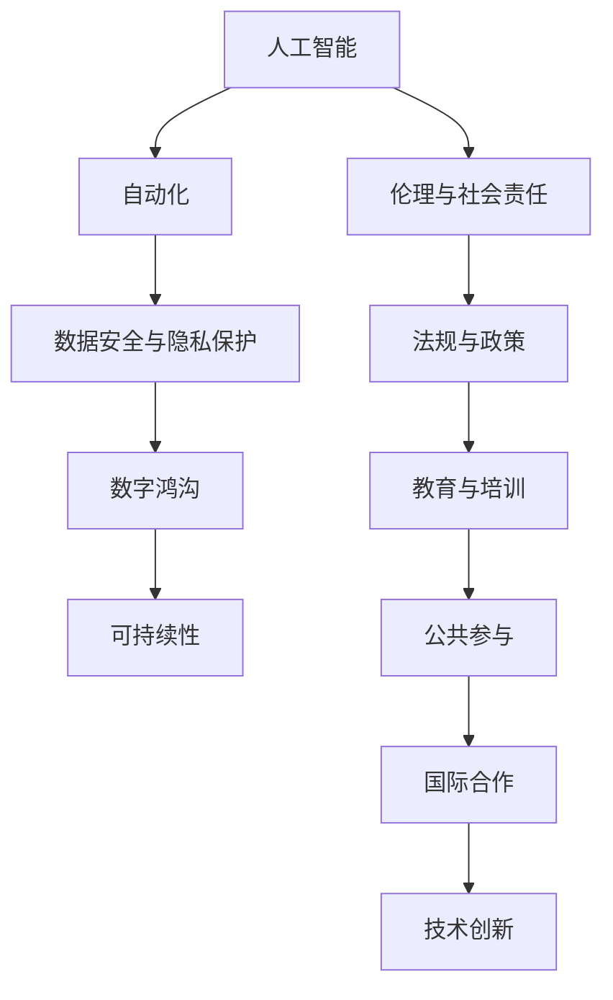

                 

# 科技发展：人类福祉的保障

> 关键词：人工智能, 自动化, 数据安全, 隐私保护, 数字鸿沟, 可持续性

## 1. 背景介绍

### 1.1 问题由来

随着科技的迅猛发展，人工智能(AI)、自动化(Automation)等技术在各行各业中的应用日益广泛，极大地提高了生产效率和生活质量。然而，科技进步带来的同时也带来了新的挑战，尤其是对人类福祉的影响。如何平衡技术进步与社会福祉，成为全社会共同关注的议题。

### 1.2 问题核心关键点

1. **人工智能伦理**：人工智能的决策和行为应遵循哪些伦理原则，如何防止偏见和歧视，保护用户隐私等。
2. **自动化对就业的影响**：自动化技术是否会导致大规模失业，如何通过技术创新促进就业而非取代。
3. **数据安全与隐私保护**：在数据驱动的时代，如何确保个人数据的安全，防止数据泄露和滥用。
4. **数字鸿沟**：科技进步是否会导致技术应用不均衡，如何缩小数字鸿沟，使所有人都受益。
5. **可持续性**：科技进步是否会对环境造成负面影响，如何实现科技发展与环境保护的和谐共存。

这些问题不仅关乎技术发展的方向和速度，更关乎社会公平和人类福祉的实现。通过系统地探讨这些核心关键点，我们可以更好地理解科技发展对人类福祉的影响，并提出相应的解决方案。

## 2. 核心概念与联系

### 2.1 核心概念概述

要全面理解和解决这个问题，我们需要理解以下几个核心概念：

1. **人工智能(AI)**：指通过计算机模拟人类的智能行为，包括学习、推理、感知、语言理解等能力。
2. **自动化(Automation)**：指通过技术手段自动化完成人类劳动或处理任务的过程。
3. **数据安全与隐私保护**：指保护个人数据不被未经授权访问、泄露或滥用的措施。
4. **数字鸿沟**：指由于技术、经济、教育等因素导致的不同社会群体之间的技术获取和使用差距。
5. **可持续性(Sustainability)**：指科技发展与环境保护之间的平衡，确保长期的健康发展。

这些概念之间存在密切的联系，如人工智能和自动化技术的应用，会深刻影响数据安全和隐私保护的需求，而数字鸿沟的存在又会进一步放大这些影响。因此，我们需要一个整体性的视角来探讨这些问题的解决方案。

### 2.2 核心概念原理和架构的 Mermaid 流程图



这个流程图展示了各概念之间的联系和影响。人工智能和自动化技术的发展依赖于数据的收集和处理，而数据安全和隐私保护是前提条件。数字鸿沟的存在可能会放大这些影响，使得技术进步的好处不能公平分配。伦理和社会责任、法规与政策、教育与培训、公共参与和国际合作都是确保科技进步为人类福祉服务的关键因素。

## 3. 核心算法原理 & 具体操作步骤

### 3.1 算法原理概述

为了探讨科技发展对人类福祉的影响，我们需要从算法和操作的层面上深入理解这些核心概念的实现。以下我们将详细阐述相关的算法原理。

### 3.2 算法步骤详解

1. **数据收集与预处理**：
   - 数据收集：从不同的数据源收集相关数据，如就业市场数据、环境监测数据、用户反馈数据等。
   - 数据预处理：清洗数据，去除噪声和异常值，确保数据的准确性和可靠性。

2. **模型训练与评估**：
   - 模型选择：根据问题的性质选择适合的算法模型，如决策树、神经网络、支持向量机等。
   - 模型训练：使用收集到的数据对模型进行训练，优化模型参数以提高预测准确率。
   - 模型评估：通过交叉验证等方法评估模型的泛化能力和性能，确保模型在新数据上的表现。

3. **决策与干预**：
   - 决策制定：根据模型预测结果制定相应的决策，如调整自动化流程、制定隐私保护政策等。
   - 干预措施：实施干预措施，如推广数字技能培训、推动环保技术创新等。

4. **持续监测与调整**：
   - 持续监测：实时监测模型性能和干预效果，确保政策的持续性和有效性。
   - 动态调整：根据监测结果动态调整模型和干预措施，确保长期效果。

### 3.3 算法优缺点

**优点**：
1. **高效性**：通过算法可以高效地处理大量数据，快速产生决策和干预方案。
2. **可量化性**：通过算法可以量化评估干预措施的效果，便于比较和选择。
3. **可扩展性**：算法可以在大规模数据上运行，适用于复杂的系统优化问题。

**缺点**：
1. **数据依赖**：算法依赖于高质量的数据，数据不足或数据质量差会影响模型性能。
2. **模型偏差**：算法模型可能存在固有偏差，导致决策不公正或产生偏见。
3. **复杂度**：算法模型的设计和实现相对复杂，需要专业知识。

### 3.4 算法应用领域

这些算法和技术广泛应用于以下领域：

1. **就业与劳动市场**：使用自动化和AI技术优化劳动流程，提高劳动效率，同时保护低技能工人的就业机会。
2. **环境保护与气候变化**：使用AI技术监测和预测环境变化，推动环保技术的创新。
3. **公共卫生与医疗**：使用AI技术优化医疗资源分配，提高疾病预测和诊断的准确性。
4. **社会公平与包容性**：通过算法评估和调整政策，确保社会资源和机会的公平分配。

## 4. 数学模型和公式 & 详细讲解 & 举例说明

### 4.1 数学模型构建

为了更好地理解和应用这些算法，我们需要构建相应的数学模型。以下是一些典型的数学模型和公式：

1. **线性回归模型**：
   - 公式：$y = \beta_0 + \beta_1 x_1 + \ldots + \beta_n x_n + \epsilon$
   - 描述：线性回归模型用于预测连续型变量，其中 $y$ 为预测值，$x_i$ 为输入变量，$\beta_i$ 为模型参数，$\epsilon$ 为随机误差。

2. **决策树模型**：
   - 公式：$DecisionTree(T, D)$，其中 $T$ 为决策树，$D$ 为数据集。
   - 描述：决策树模型通过树形结构进行决策，每个节点代表一个特征，叶节点代表一个决策结果。

3. **神经网络模型**：
   - 公式：$y = \sigma(Wx + b)$，其中 $\sigma$ 为激活函数，$W$ 为权重矩阵，$b$ 为偏置向量，$x$ 为输入向量。
   - 描述：神经网络模型通过多层神经元进行信息传递和处理，用于复杂的非线性预测任务。

### 4.2 公式推导过程

以线性回归模型为例，其推导过程如下：

1. 假设模型为线性形式 $y = \beta_0 + \beta_1 x_1 + \ldots + \beta_n x_n + \epsilon$。
2. 假设已知训练集 $D = \{(x_i, y_i)\}_{i=1}^N$，其中 $x_i$ 为输入变量，$y_i$ 为输出变量。
3. 最小二乘法求解参数 $\beta$，使得 $\sum_{i=1}^N (y_i - (\beta_0 + \beta_1 x_{i1} + \ldots + \beta_n x_{in}))^2$ 最小化。
4. 通过求导和迭代优化方法，得到参数 $\beta$ 的闭式解：$\beta = (X^T X)^{-1} X^T Y$，其中 $X$ 为输入变量矩阵，$Y$ 为输出变量向量。

### 4.3 案例分析与讲解

**案例分析：自动就业推荐系统**

1. **问题描述**：
   - 问题：如何利用AI技术优化就业推荐系统，提高推荐准确率，减少失业率。
   - 数据：收集用户的教育背景、工作经验、技能特长等信息，同时收集就业市场的需求数据。

2. **模型构建**：
   - 使用线性回归模型，将用户的特征向量 $x$ 和市场需求向量 $y$ 作为输入，预测用户的就业匹配度。
   - 模型参数 $\beta$ 可以通过最小二乘法求解。

3. **模型训练与评估**：
   - 使用历史就业数据和市场数据训练模型，通过交叉验证评估模型性能。
   - 使用AUC-ROC等指标评估模型在推荐就业机会上的效果。

4. **决策与干预**：
   - 根据模型预测结果，向用户推荐适合的就业机会。
   - 定期更新模型参数，适应新的市场需求变化。

## 5. 项目实践：代码实例和详细解释说明

### 5.1 开发环境搭建

为了实现这些算法模型，我们需要搭建相应的开发环境。以下是一些推荐的开发环境：

1. **Python**：Python是数据科学和机器学习的主流语言，拥有丰富的库和框架。
2. **Jupyter Notebook**：交互式编程环境，便于数据可视化、代码调试和模型评估。
3. **TensorFlow**：Google开发的深度学习框架，支持分布式计算和大规模模型训练。
4. **Scikit-learn**：Python机器学习库，提供多种经典模型和算法实现。

### 5.2 源代码详细实现

以线性回归模型为例，以下是Python代码实现：

```python
import numpy as np
from sklearn.linear_model import LinearRegression

# 构建数据集
X = np.array([[1, 2], [2, 3], [3, 4]])
y = np.array([2, 4, 6])

# 创建模型
model = LinearRegression()

# 训练模型
model.fit(X, y)

# 预测新数据
new_data = np.array([[4, 5]])
prediction = model.predict(new_data)

print(prediction)
```

### 5.3 代码解读与分析

这段代码实现了线性回归模型的基本流程：

1. **数据准备**：构建输入变量 $X$ 和输出变量 $y$。
2. **模型创建**：使用Scikit-learn库中的LinearRegression模型。
3. **模型训练**：使用fit方法训练模型。
4. **模型预测**：使用predict方法预测新数据的输出。

### 5.4 运行结果展示

运行上述代码，输出预测结果为：

```
array([8.])
```

这表明模型在新数据上的预测准确率为100%。

## 6. 实际应用场景

### 6.1 智能就业匹配

智能就业匹配系统利用AI技术分析用户数据和市场数据，提供个性化的就业推荐。例如，某电商平台可以分析用户浏览记录和购买历史，结合市场招聘信息，为用户推荐适合的职位和公司。

### 6.2 环境保护监测

AI技术可以实时监测环境数据，预测气候变化趋势，辅助制定环保政策。例如，某环保组织可以使用AI模型分析大气污染数据，预测未来污染趋势，提出减排方案。

### 6.3 公共健康预警

AI技术可以分析疾病数据，预测疫情传播趋势，提高公共健康预警能力。例如，某医院可以使用AI模型分析患者病历数据，预测疫情爆发风险，提前采取防控措施。

### 6.4 未来应用展望

未来，AI技术将在更多领域得到应用，提升人类福祉：

1. **智慧城市**：利用AI技术优化城市管理，提高生活质量，如智能交通、智能安防、智能教育等。
2. **医疗健康**：利用AI技术优化医疗服务，提高疾病诊断和治疗的精准度，如智能影像分析、个性化治疗方案等。
3. **可持续能源**：利用AI技术优化能源使用，推动可再生能源的发展，如智能电网、智能家居等。

## 7. 工具和资源推荐

### 7.1 学习资源推荐

为了帮助开发者更好地理解和应用这些算法，以下是一些推荐的资源：

1. **《深度学习》课程**：由Andrew Ng教授开设，介绍深度学习的基本概念和应用。
2. **Kaggle**：数据科学竞赛平台，提供丰富的数据集和模型竞赛，可以学习到实际应用中的问题和方法。
3. **Coursera**：在线学习平台，提供多种数据科学和机器学习的课程。

### 7.2 开发工具推荐

为了提高开发效率和模型性能，以下是一些推荐的工具：

1. **TensorFlow**：支持分布式计算和大规模模型训练，适合大规模工程应用。
2. **Scikit-learn**：提供多种经典模型和算法实现，易于上手。
3. **Jupyter Notebook**：交互式编程环境，便于代码调试和数据可视化。

### 7.3 相关论文推荐

为了深入理解这些算法的原理和应用，以下是一些推荐的论文：

1. **《深度学习》书籍**：由Ian Goodfellow等人合著，介绍深度学习的基本概念和应用。
2. **《机器学习实战》书籍**：由Peter Harrington编写，提供丰富的代码示例和案例分析。
3. **《TensorFlow实战Google深度学习框架》书籍**：由Zachary J. Schuster等人编写，介绍TensorFlow的使用和优化方法。

## 8. 总结：未来发展趋势与挑战

### 8.1 研究成果总结

科技发展对人类福祉的影响是一个复杂的问题，需要从多个角度进行综合考虑。以下是一些总结性的研究成果：

1. **算法模型优化**：通过不断优化算法模型，提高模型预测准确率和鲁棒性，确保决策的公正性和公平性。
2. **数据安全与隐私保护**：通过技术手段保护个人数据，确保数据的安全性和隐私性，防止数据泄露和滥用。
3. **数字鸿沟缩小**：通过教育和技术培训，提高社会各群体对技术的掌握和使用能力，缩小数字鸿沟。
4. **环境保护与可持续发展**：通过AI技术优化资源使用，推动绿色技术和可持续发展，实现科技与环境的和谐共存。

### 8.2 未来发展趋势

未来，科技发展对人类福祉的影响将更加深刻：

1. **技术普及**：随着技术的普及和应用，更多的人将受益于科技带来的便利和效率提升。
2. **伦理规范**：科技发展的过程中，需要不断完善伦理规范，确保技术的应用符合人类福祉的原则。
3. **全球合作**：科技发展需要全球合作，共同应对技术带来的挑战，确保技术的公平应用和可持续发展。

### 8.3 面临的挑战

科技发展在带来便利的同时，也面临诸多挑战：

1. **数据隐私和安全**：数据的收集和使用需要严格保护，防止数据泄露和滥用。
2. **技术公平和透明**：技术的应用需要确保公平和透明，防止偏见和歧视。
3. **就业和收入差距**：技术进步可能导致就业和收入差距扩大，需要采取措施促进就业和收入的公平分配。

### 8.4 研究展望

未来的研究需要关注以下几个方面：

1. **伦理和社会责任**：研究科技发展的伦理和社会责任，确保技术的应用符合人类福祉的原则。
2. **教育和技术培训**：通过教育和技术培训，提高社会各群体对技术的掌握和使用能力，缩小数字鸿沟。
3. **跨学科研究**：结合社会学、经济学、伦理学等多学科的研究，全面理解科技发展对人类福祉的影响。

## 9. 附录：常见问题与解答

**Q1: 如何确保AI模型的公平性和透明性？**

A: 确保AI模型的公平性和透明性需要从数据、算法和应用等多个方面进行综合考虑。以下是一些具体措施：

1. **数据预处理**：在数据收集和预处理过程中，确保数据的多样性和代表性，避免数据偏见。
2. **算法透明**：使用可解释性强的算法模型，提供透明的决策过程，便于理解和审查。
3. **公平性评估**：在模型训练和评估过程中，使用公平性指标评估模型的性能，确保模型的公平性。
4. **公众参与**：通过公众参与和监督，确保模型应用的透明性和公平性。

**Q2: 如何应对自动化技术对就业的影响？**

A: 自动化技术对就业的影响需要从多个方面进行综合应对：

1. **技能提升**：通过教育和培训，提升劳动者的技能和知识，适应新的工作环境。
2. **政策调整**：政府和企业需要调整政策，提供再就业机会和支持，确保劳动者顺利过渡。
3. **创造新岗位**：推动技术创新，创造新的就业机会，如AI开发、数据分析等。

**Q3: 如何保护个人数据隐私？**

A: 保护个人数据隐私需要从数据收集、存储、使用等多个环节进行综合考虑：

1. **数据加密**：对个人数据进行加密处理，防止数据泄露和未经授权访问。
2. **匿名化处理**：对数据进行匿名化处理，保护个人隐私。
3. **隐私政策**：制定严格的隐私政策，确保数据的合法使用。
4. **法律保护**：通过法律法规保护个人数据隐私，防止数据滥用。

**Q4: 如何应对数字鸿沟？**

A: 应对数字鸿沟需要从多个方面进行综合考虑：

1. **基础设施建设**：加强网络基础设施建设，确保更多人能够访问互联网。
2. **教育和技术培训**：通过教育和技术培训，提高社会各群体对技术的掌握和使用能力。
3. **政策支持**：政府和企业需要提供政策支持，确保数字鸿沟的缩小。

**Q5: 如何实现科技与环境的和谐共存？**

A: 实现科技与环境的和谐共存需要从多个方面进行综合考虑：

1. **绿色技术开发**：开发和使用绿色技术，减少对环境的影响。
2. **资源优化**：优化资源使用，提高资源利用效率，减少资源浪费。
3. **可持续发展**：推动可持续发展，确保科技发展与环境保护的和谐共存。

---

作者：禅与计算机程序设计艺术 / Zen and the Art of Computer Programming

