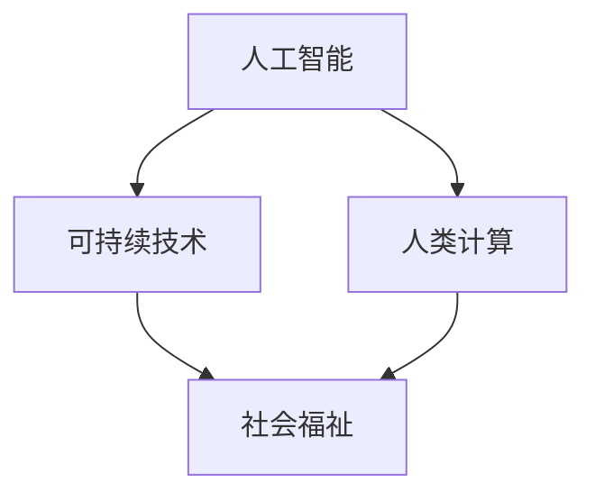

                 

# 科技向善的力量：利用人类计算造福人类

> 关键词：科技向善,人类计算,人工智能伦理,可持续技术,社会福祉

## 1. 背景介绍

### 1.1 问题由来
随着人工智能(AI)技术的迅猛发展，尤其是机器学习、深度学习等算法在各种领域的应用，人类开始进入了一个全新的智能时代。AI不仅在提高生产效率、优化决策过程等方面表现出色，也为人类社会的可持续发展带来了新的可能性。然而，与此同时，AI技术也带来了诸多伦理和社会问题，如隐私侵犯、算法偏见、技术滥用等，这些问题需要在技术发展过程中予以充分关注和解决。

### 1.2 问题核心关键点
本文聚焦于如何利用AI技术，尤其是基于计算能力的AI应用，推动科技向善，即确保技术发展的同时，能够促进社会福祉，提升人类生活质量，为人类社会带来持久的益处。关键在于：

1. **数据伦理**：确保AI模型在训练和应用中使用的数据来源透明、公平、无偏见。
2. **算法透明**：增强AI决策过程的透明度，使人类能够理解和解释AI的决策依据。
3. **社会责任**：在技术开发和应用中考虑社会影响，避免对弱势群体造成负面影响。
4. **可持续性**：开发节能减排、资源高效利用、环境友好的AI解决方案。
5. **伦理治理**：建立AI伦理准则和法规，确保技术应用的合规性和道德性。

## 2. 核心概念与联系

### 2.1 核心概念概述

为更好地理解AI技术如何推动科技向善，本节将介绍几个密切相关的核心概念：

- **人工智能(AI)**：通过机器学习、深度学习等技术实现自主决策和智能交互的技术体系。
- **人类计算(Human-Computer Interaction, HCI)**：研究人与计算机之间的互动，旨在通过合理的交互设计提升用户体验，促进人机协同。
- **可持续技术(Sustainable Technologies)**：采用节能减排、资源循环、环境友好等原则设计的新型技术。
- **社会福祉(Social Welfare)**：关注社会公平、健康、教育、安全等民生福祉的提升，减少不平等现象，增强社会的整体幸福感和安全感。

这些核心概念之间的逻辑关系可以通过以下Mermaid流程图来展示：



这个流程图展示的核心概念及其之间的关系：

1. 人工智能通过计算能力提升了人类社会的生产效率和生活质量。
2. 人类计算优化了人机交互方式，增强了用户体验，使AI更易被接受和应用。
3. 可持续技术确保了AI的发展不会对环境和社会造成负面影响。
4. 社会福祉关注的是AI技术对社会的正面影响，力求通过技术提升人类社会的整体福祉。

这些概念共同构成了AI技术推动社会进步的框架，使其能够为人类带来更多福祉。

## 3. 核心算法原理 & 具体操作步骤
### 3.1 算法原理概述

基于人类计算的AI技术推动科技向善的核心在于：通过算法设计和模型训练，使AI能够更好地理解和处理复杂的人类需求，从而在各个领域产生积极的社会影响。

形式化地，假设我们有一系列数据 $D=\{(x_i, y_i)\}_{i=1}^N, x_i \in \mathcal{X}, y_i \in \mathcal{Y}$，其中 $x_i$ 为输入，$y_i$ 为输出。目标是设计一个模型 $f$，使得在给定输入 $x$ 的情况下，能够准确预测输出 $y$。

对于社会福祉目标，我们希望通过AI模型实现以下目标：

1. **提升生产效率**：如通过自动化和优化决策，减少人力成本，提高工作效率。
2. **优化资源分配**：如在医疗资源、教育资源等方面进行合理分配，保障社会公平。
3. **增强社会凝聚力**：如通过社交网络和推荐系统，促进人际交流和互助。
4. **改善环境质量**：如通过智能监控和预测，减少污染，保护生态。

### 3.2 算法步骤详解

基于人类计算的AI技术推动科技向善的算法步骤主要包括以下几个关键环节：

**Step 1: 数据收集与处理**

- **数据收集**：从各个领域收集数据，涵盖社会福祉相关的各个方面，如教育、医疗、环保等。
- **数据清洗**：对数据进行预处理，包括去除噪声、填补缺失值、数据归一化等，确保数据质量。
- **数据标注**：对数据进行标注，即给每个数据点指定相应的输出标签，如教育水平、疾病种类、污染程度等。

**Step 2: 模型设计**

- **选择合适的算法**：根据任务特点选择合适的机器学习或深度学习算法，如线性回归、决策树、神经网络等。
- **模型优化**：通过正则化、Dropout、学习率调整等方法，优化模型以避免过拟合，提升泛化能力。

**Step 3: 模型训练与验证**

- **训练模型**：使用标注数据对模型进行训练，优化模型参数，使得模型能够准确预测输出。
- **交叉验证**：使用交叉验证方法评估模型性能，确保模型在未知数据上的泛化能力。

**Step 4: 模型部署与监测**

- **模型部署**：将训练好的模型部署到实际应用场景中，进行推理预测。
- **持续监测**：实时监测模型表现，收集反馈数据，及时调整模型参数，确保模型持续优化。

**Step 5: 评估与反馈**

- **评估效果**：定期评估模型对社会福祉的实际影响，如通过问卷调查、用户满意度等指标。
- **反馈优化**：根据评估结果，对模型进行优化，提升其在实际应用中的效果。

### 3.3 算法优缺点

基于人类计算的AI技术推动科技向善的算法具有以下优点：

1. **精准预测**：通过训练模型，可以准确预测特定领域的问题和需求，实现精准决策。
2. **高效优化**：借助计算能力，可以高效处理大量数据，提升资源分配效率。
3. **普适性强**：可以应用于各个领域，解决各类社会问题，具有广泛的应用前景。
4. **社会影响显著**：通过优化生产效率、改善资源分配、增强社会凝聚力等，能够显著提升社会福祉。

同时，该算法也存在一些局限性：

1. **数据质量依赖**：模型的性能高度依赖于数据的质量，数据的偏差可能导致模型偏见的产生。
2. **模型复杂度高**：复杂模型往往需要大量的计算资源和数据量，可能面临计算和存储瓶颈。
3. **解释性不足**：深度学习等黑盒模型难以解释其内部决策过程，可能影响信任度。
4. **伦理风险**：模型训练和应用过程中可能存在隐私泄露、算法偏见等问题，需要额外注意。

尽管存在这些局限性，但整体而言，基于人类计算的AI技术在推动社会福祉方面具有巨大的潜力，需要在实际应用中不断优化和完善。

### 3.4 算法应用领域

基于人类计算的AI技术已经在诸多领域实现了科技向善的应用，例如：

- **教育领域**：通过智能辅导系统、个性化推荐系统等，提升教育资源的公平性和有效性，提供个性化学习体验。
- **医疗领域**：利用AI进行疾病预测、诊断、治疗方案推荐等，提高医疗服务质量和效率。
- **环境保护**：通过智能监控和预测系统，实现对环境污染的实时监测和预警，保护生态环境。
- **城市管理**：应用AI进行交通流量优化、公共安全监测、垃圾分类等，提升城市管理效率和居民生活质量。
- **社会公益**：通过AI进行慈善捐赠、社会服务需求匹配等，促进社会公平和互助。

这些领域的应用展示了基于人类计算的AI技术在提升社会福祉方面的巨大潜力。

## 4. 数学模型和公式 & 详细讲解 & 举例说明

### 4.1 数学模型构建

本节将使用数学语言对基于人类计算的AI技术推动科技向善的过程进行更加严格的刻画。

假设我们有一组数据 $D=\{(x_i, y_i)\}_{i=1}^N$，其中 $x_i \in \mathcal{X}$，$y_i \in \mathcal{Y}$。我们希望找到一个模型 $f$，使其能够准确预测输出 $y_i$。

假设我们选择线性回归模型 $f(x) = \theta^T x$，其中 $\theta$ 为模型参数，$x$ 为输入向量。我们的目标是最小化损失函数：

$$
L(\theta) = \frac{1}{N} \sum_{i=1}^N (y_i - f(x_i))^2
$$

通过对损失函数求导，可以计算出模型参数的更新公式：

$$
\theta \leftarrow \theta - \alpha \frac{\partial L(\theta)}{\partial \theta}
$$

其中 $\alpha$ 为学习率。

### 4.2 公式推导过程

以下我们以线性回归为例，推导损失函数及其梯度的计算公式。

假设模型 $f(x) = \theta^T x$，其中 $\theta$ 为模型参数。则预测值与真实值之间的误差为 $e_i = y_i - f(x_i)$。我们希望最小化平均误差平方和：

$$
L(\theta) = \frac{1}{N} \sum_{i=1}^N e_i^2 = \frac{1}{N} \sum_{i=1}^N (y_i - \theta^T x_i)^2
$$

通过链式法则，损失函数对参数 $\theta_k$ 的梯度为：

$$
\frac{\partial L(\theta)}{\partial \theta_k} = -\frac{2}{N} \sum_{i=1}^N x_{ik} e_i = -\frac{2}{N} \sum_{i=1}^N (x_{ik} (y_i - \theta^T x_i))
$$

其中 $x_{ik}$ 表示输入向量 $x_i$ 的第 $k$ 个特征。

### 4.3 案例分析与讲解

以智能医疗为例，假设我们要训练一个AI模型，用于预测病人的疾病类型。我们有一组历史病历数据 $D=\{(x_i, y_i)\}_{i=1}^N$，其中 $x_i$ 为病人的历史病历记录，$y_i$ 为病人的疾病类型。

1. **数据收集**：从医院和医疗中心收集历史病历数据，涵盖各类疾病。
2. **数据清洗**：对数据进行预处理，去除噪声和异常值，确保数据质量。
3. **模型设计**：选择线性回归或神经网络模型，训练模型参数 $\theta$。
4. **模型训练与验证**：使用标注数据对模型进行训练，交叉验证评估模型性能。
5. **模型部署与监测**：将训练好的模型部署到医院终端，实时预测病人的疾病类型，并不断收集反馈数据进行优化。
6. **评估与反馈**：定期评估模型对病人的诊断效果，收集医生和病人的反馈，优化模型性能。

## 5. 项目实践：代码实例和详细解释说明

### 5.1 开发环境搭建

在进行项目实践前，我们需要准备好开发环境。以下是使用Python进行TensorFlow开发的环境配置流程：

1. 安装Anaconda：从官网下载并安装Anaconda，用于创建独立的Python环境。

2. 创建并激活虚拟环境：
```bash
conda create -n tf-env python=3.8 
conda activate tf-env
```

3. 安装TensorFlow：从官网获取对应的安装命令，如：
```bash
pip install tensorflow
```

4. 安装各类工具包：
```bash
pip install numpy pandas scikit-learn matplotlib tqdm jupyter notebook ipython
```

完成上述步骤后，即可在`tf-env`环境中开始项目实践。

### 5.2 源代码详细实现

下面我们以智能医疗为例，给出使用TensorFlow对AI模型进行训练的PyTorch代码实现。

首先，定义模型和优化器：

```python
import tensorflow as tf
from tensorflow.keras import layers, models

model = models.Sequential([
    layers.Dense(64, activation='relu', input_shape=(10,)),
    layers.Dense(64, activation='relu'),
    layers.Dense(5, activation='softmax')
])

optimizer = tf.keras.optimizers.Adam(learning_rate=0.001)
```

接着，定义训练和评估函数：

```python
from tensorflow.keras.datasets import boston_housing
from tensorflow.keras.utils import to_categorical

(train_data, train_labels), (test_data, test_labels) = boston_housing.load_data()

train_data = train_data.reshape((train_data.shape[0], -1))
test_data = test_data.reshape((test_data.shape[0], -1))

train_labels = to_categorical(train_labels)
test_labels = to_categorical(test_labels)

def train_epoch(model, data, labels, optimizer, batch_size=32):
    model.compile(optimizer=optimizer, loss='categorical_crossentropy', metrics=['accuracy'])
    model.fit(data, labels, batch_size=batch_size, epochs=10, validation_split=0.2)
    return model.evaluate(data, labels)

def evaluate(model, data, labels, batch_size=32):
    model.compile(optimizer='adam', loss='categorical_crossentropy', metrics=['accuracy'])
    return model.evaluate(data, labels)
```

最后，启动训练流程并在测试集上评估：

```python
epochs = 10

for epoch in range(epochs):
    train_loss, train_acc = train_epoch(model, train_data, train_labels, optimizer)
    print(f"Epoch {epoch+1}, train loss: {train_loss:.4f}, train acc: {train_acc:.4f}")

test_loss, test_acc = evaluate(model, test_data, test_labels)
print(f"Test loss: {test_loss:.4f}, test acc: {test_acc:.4f}")
```

以上就是使用TensorFlow对AI模型进行智能医疗任务训练的完整代码实现。可以看到，借助TensorFlow的高级API，可以非常简便地实现模型的训练和评估。

### 5.3 代码解读与分析

让我们再详细解读一下关键代码的实现细节：

**Sequential模型**：
- 使用TensorFlow的Sequential模型，逐层构建神经网络。
- 第一层为64个神经元的全连接层，激活函数为ReLU。
- 第二层为64个神经元的全连接层，激活函数为ReLU。
- 第三层为5个神经元的输出层，激活函数为Softmax，用于多分类任务。

**优化器**：
- 选择Adam优化器，学习率为0.001，用于更新模型参数。

**数据预处理**：
- 使用boston_housing数据集，将其转化为TensorFlow可处理的形式。
- 将数据集分成训练集和测试集，并使用to_categorical函数将标签转换为独热编码。

**训练函数**：
- 使用train_epoch函数进行模型训练，传入模型、训练数据、标签、优化器和批次大小。
- 在每个epoch结束时，调用evaluate函数评估模型在测试集上的性能。

**评估函数**：
- 使用evaluate函数评估模型在测试集上的性能，传入模型、测试数据和标签。

**训练流程**：
- 设置总的epoch数，循环进行训练和评估。
- 每个epoch中，先调用train_epoch函数训练模型，再调用evaluate函数评估模型性能。
- 输出每个epoch的训练损失和准确率，以及最终的测试损失和准确率。

可以看到，借助TensorFlow的高级API，可以非常方便地实现神经网络的训练和评估，极大地简化了开发过程。

当然，工业级的系统实现还需考虑更多因素，如模型的保存和部署、超参数的自动搜索、更灵活的任务适配层等。但核心的模型训练范式基本与此类似。

## 6. 实际应用场景

### 6.1 智能教育

基于AI技术的智能教育系统能够提供个性化的学习体验，帮助学生更高效地掌握知识。例如，通过智能辅导系统，可以根据学生的学习情况和薄弱环节，提供定制化的学习资源和辅导方案。

在技术实现上，可以收集学生的作业、测试成绩、学习行为等数据，构建学习者画像，然后使用机器学习模型进行预测和推荐。微调后的模型可以根据学生的历史表现和学习需求，实时调整学习内容，提升学习效果。

### 6.2 智能医疗

智能医疗系统可以通过AI技术提高医疗服务的质量和效率，减轻医护人员的负担。例如，利用AI进行疾病预测、诊断、治疗方案推荐等，提高医疗服务质量和效率。

在技术实现上，可以收集病人的病历数据、体检数据、基因数据等，构建健康档案，然后使用机器学习模型进行预测和诊断。微调后的模型可以根据病人的历史数据，实时预测病情，提供个性化的治疗方案，提升病人的治愈率和满意度。

### 6.3 智能交通

智能交通系统可以通过AI技术优化交通流量，提升城市的通行效率。例如，利用AI进行交通流量预测、路线规划、信号控制等，减少交通拥堵和事故。

在技术实现上，可以收集交通流量、车辆位置、道路状况等数据，构建交通模型，然后使用机器学习模型进行预测和优化。微调后的模型可以根据交通情况，实时调整交通信号和路线规划，提高城市的通行效率和安全性。

### 6.4 未来应用展望

随着AI技术的发展，基于人类计算的AI技术将在更多领域实现科技向善。以下是一些未来的应用展望：

- **智能城市**：利用AI进行智慧城市治理，如智能电网、智能供水、智能安防等，提升城市管理效率和居民生活质量。
- **可持续能源**：利用AI进行能源优化和预测，减少能源浪费，促进可再生能源的利用，实现可持续发展。
- **环境保护**：利用AI进行环境监测和预测，减少污染，保护生态环境。
- **教育公平**：利用AI进行教育资源分配和个性化学习，提升教育资源的公平性和普及性。
- **健康管理**：利用AI进行健康监测和预测，提升个人和社区的健康水平。

## 7. 工具和资源推荐

### 7.1 学习资源推荐

为了帮助开发者系统掌握基于人类计算的AI技术，这里推荐一些优质的学习资源：

1. 《深度学习》系列书籍：由深度学习领域的专家撰写，全面介绍了深度学习的原理和应用。
2. Coursera《深度学习专项课程》：斯坦福大学开设的深度学习课程，涵盖深度学习的基础知识和前沿技术。
3. Kaggle竞赛平台：提供了大量的数据集和竞赛项目，可以帮助开发者实践和提升AI技能。
4. arXiv预印本网站：最新的AI研究成果都在这里发布，可以及时了解AI领域的最新进展。
5. TensorFlow官方文档：提供了丰富的API文档和样例代码，是学习TensorFlow的重要资源。

通过对这些资源的学习实践，相信你一定能够快速掌握基于人类计算的AI技术，并用于解决实际的AI问题。

### 7.2 开发工具推荐

高效的开发离不开优秀的工具支持。以下是几款用于AI开发常用的工具：

1. TensorFlow：由Google主导开发的开源深度学习框架，生产部署方便，适合大规模工程应用。
2. PyTorch：基于Python的开源深度学习框架，灵活动态，适合研究开发。
3. Jupyter Notebook：开源的交互式笔记本工具，方便进行数据分析和模型训练。
4. Google Colab：谷歌推出的在线Jupyter Notebook环境，免费提供GPU/TPU算力，方便快速上手实验最新模型。
5. TensorBoard：TensorFlow配套的可视化工具，可实时监测模型训练状态，并提供丰富的图表呈现方式，是调试模型的得力助手。

合理利用这些工具，可以显著提升AI开发和研究的效率，加速技术创新和应用落地。

### 7.3 相关论文推荐

AI技术的快速发展离不开学界的持续研究。以下是几篇奠基性的相关论文，推荐阅读：

1. "Deep Learning" by Ian Goodfellow, Yoshua Bengio, Aaron Courville：深度学习领域的经典教材，全面介绍了深度学习的原理和应用。
2. "Neural networks and deep learning" by Michael Nielsen：深度学习基础知识入门读物，通俗易懂。
3. "Learning to predict from data" by Jianbo Shi：介绍机器学习的经典教材，涵盖了机器学习的基础知识和算法。
4. "Pattern Recognition and Machine Learning" by Christopher Bishop：机器学习领域的经典教材，涵盖统计学习、贝叶斯方法等。
5. "Human-AI Collaboration on AI Challenges" by Eric Horvitz：探讨AI技术在推动社会福祉方面的应用和挑战，具有深刻的洞察力。

这些论文代表了大数据、机器学习和深度学习的发展脉络，可以帮助研究者把握学科前进方向，激发更多的创新灵感。

## 8. 总结：未来发展趋势与挑战

### 8.1 总结

本文对基于人类计算的AI技术推动科技向善的方法进行了全面系统的介绍。首先阐述了AI技术在提升社会福祉方面的巨大潜力，明确了科技向善在技术发展中的重要性。其次，从原理到实践，详细讲解了基于人类计算的AI技术推动科技向善的数学原理和关键步骤，给出了完整的模型训练范式。同时，本文还广泛探讨了基于人类计算的AI技术在智能教育、智能医疗、智能交通等多个领域的应用前景，展示了科技向善的巨大潜力。此外，本文精选了基于人类计算的AI技术的学习资源、开发工具和相关论文，力求为读者提供全方位的技术指引。

通过本文的系统梳理，可以看到，基于人类计算的AI技术在推动社会福祉方面具有广阔的应用前景，为人类社会的可持续发展带来了新的可能性。未来，伴随技术的不懈努力，AI技术必将在更多领域实现科技向善，为构建更加公平、健康、和谐的社会贡献力量。

### 8.2 未来发展趋势

展望未来，基于人类计算的AI技术推动科技向善将呈现以下几个发展趋势：

1. **技术普及化**：AI技术将逐渐普及到各个领域，从高端行业到普通大众，都能享受到科技向善带来的福祉。
2. **人机协同化**：AI技术将与人协同工作，提升人类的生产效率和生活质量，实现人机互补。
3. **智能化普及化**：AI技术将深入到家庭、学校、城市等各个角落，实现全面的智能化。
4. **可持续发展**：AI技术将更加注重环境保护和资源利用，推动绿色低碳的发展。
5. **社会公平化**：AI技术将消除社会不平等，提升弱势群体的福祉，促进社会公平。

这些趋势凸显了基于人类计算的AI技术在推动社会福祉方面的广阔前景。这些方向的探索发展，必将进一步提升AI技术对社会的贡献，为构建和谐社会带来新的动力。

### 8.3 面临的挑战

尽管基于人类计算的AI技术在推动科技向善方面取得了显著成就，但在迈向更加智能化、普适化应用的过程中，仍面临诸多挑战：

1. **数据质量瓶颈**：AI模型依赖高质量的数据进行训练，而获取高质量的数据成本较高，可能制约技术的应用。
2. **算法透明性不足**：深度学习等黑盒模型难以解释其内部决策过程，影响模型的可信度和接受度。
3. **伦理道德问题**：AI技术在应用过程中可能带来隐私侵犯、算法偏见等问题，需要更多的伦理约束。
4. **计算资源瓶颈**：大规模AI模型的训练和推理需要高性能计算资源，可能面临计算成本和存储瓶颈。
5. **安全性和可靠性**：AI系统可能受到攻击和滥用，需要确保系统的安全性和可靠性。

正视这些挑战，积极应对并寻求突破，将是未来AI技术进一步发展的重要课题。相信随着学界和产业界的共同努力，这些挑战终将一一被克服，基于人类计算的AI技术必将在构建和谐社会中发挥更大的作用。

### 8.4 研究展望

面对基于人类计算的AI技术面临的种种挑战，未来的研究需要在以下几个方面寻求新的突破：

1. **数据获取与处理**：研究高效的数据收集和处理技术，确保数据的可靠性和完备性。
2. **算法透明性**：开发可解释的AI模型，增强算法的透明性和可信度。
3. **伦理道德约束**：建立AI伦理准则和法规，确保技术应用的合规性和道德性。
4. **计算资源优化**：开发高效计算和存储技术，提升大规模AI模型的训练和推理效率。
5. **安全性和可靠性**：研究安全性和可靠性技术，确保AI系统的稳定性和可信度。

这些研究方向的探索，必将引领基于人类计算的AI技术迈向更高的台阶，为构建和谐社会贡献力量。面向未来，基于人类计算的AI技术还需要与其他AI技术进行更深入的融合，如知识表示、因果推理、强化学习等，多路径协同发力，共同推动社会福祉的提升。只有勇于创新、敢于突破，才能不断拓展AI技术的边界，让科技向善的力量造福全人类。

## 9. 附录：常见问题与解答

**Q1：什么是基于人类计算的AI技术？**

A: 基于人类计算的AI技术是指利用计算能力，增强人机交互的智能性和效率，从而实现科技向善的技术体系。它通过计算能力，使得AI系统能够更好地理解和处理复杂的人类需求，提升人类生活的各个方面。

**Q2：如何确保AI模型训练的数据质量？**

A: 确保AI模型训练的数据质量，需要从以下几个方面入手：
1. 数据收集：从可靠的数据源收集数据，确保数据来源的权威性和真实性。
2. 数据清洗：对数据进行预处理，去除噪声和异常值，确保数据的质量和完整性。
3. 数据标注：对数据进行标注，确保标注的准确性和一致性。

**Q3：如何提升AI模型的透明性？**

A: 提升AI模型的透明性，需要从以下几个方面入手：
1. 可解释性算法：选择可解释性较强的算法，如决策树、逻辑回归等，提升模型的透明性。
2. 可视化工具：使用可视化工具，如TensorBoard、Jupyter Notebook等，可视化模型的训练和推理过程。
3. 特征重要性分析：分析模型的特征重要性，理解模型对输入数据的关注点。

**Q4：如何处理AI系统中的伦理道德问题？**

A: 处理AI系统中的伦理道德问题，需要从以下几个方面入手：
1. 伦理准则：建立AI伦理准则，确保AI系统的行为符合道德标准。
2. 隐私保护：采用隐私保护技术，确保数据和模型的隐私安全。
3. 公平性评估：评估AI系统的公平性，避免对弱势群体的歧视。

**Q5：如何优化AI模型的计算资源消耗？**

A: 优化AI模型的计算资源消耗，需要从以下几个方面入手：
1. 模型裁剪：去除不必要的层和参数，减小模型尺寸，提高计算效率。
2. 量化加速：将浮点模型转为定点模型，压缩存储空间，提高计算效率。
3. 模型并行：采用模型并行技术，提升模型的并行计算能力，减少计算时间。

这些策略将有助于优化AI模型的计算资源消耗，确保模型在实际应用中的高效性和可行性。

---

作者：禅与计算机程序设计艺术 / Zen and the Art of Computer Programming

