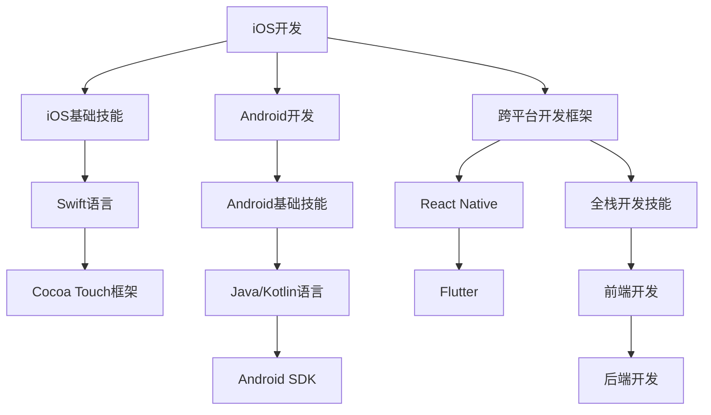

                 

# 移动端全栈开发：iOS与Android双平台精通

> 关键词：移动端开发, iOS, Android, 全栈开发, Swift, Kotlin, React Native, Flutter

## 1. 背景介绍

### 1.1 问题由来

近年来，随着移动互联网的迅猛发展，移动端应用开发成为了软件开发的重要方向之一。传统前后端分离的模式已经无法满足快速迭代、灵活多样的需求，全栈开发逐渐成为移动端开发的主流趋势。全栈开发通过掌握多种前端和后端技术，使开发者能够更加高效、灵活地进行移动端应用开发，提升开发效率，缩短开发周期。

然而，由于iOS和Android两大移动平台的技术栈和开发模式存在较大差异，掌握双平台开发技能成为了移动端开发者的核心竞争力之一。如何在短时间内掌握iOS与Android两大平台的核心开发技能，并灵活应用，成为许多开发者的难题。

### 1.2 问题核心关键点

iOS与Android双平台开发的核心关键点在于掌握两种平台的基本开发技能，并在实际项目中灵活应用。具体包括以下几个方面：

- **iOS开发基础**：掌握Swift语言和Cocoa Touch框架，能够开发iOS原生应用。
- **Android开发基础**：掌握Java或Kotlin语言和Android SDK，能够开发Android原生应用。
- **跨平台开发框架**：掌握React Native或Flutter等跨平台开发框架，能够开发跨平台移动应用。
- **全栈开发技能**：掌握前端开发和后端开发的基础技能，能够在实际项目中灵活切换角色。

## 2. 核心概念与联系

### 2.1 核心概念概述

为了更好地理解iOS与Android双平台全栈开发，本节将介绍几个密切相关的核心概念：

- **iOS开发**：基于Swift语言和Cocoa Touch框架的移动应用开发，重点关注用户界面、动画、网络请求等核心功能。
- **Android开发**：基于Java或Kotlin语言和Android SDK的移动应用开发，重点关注用户界面、权限管理、通知、后台服务等核心功能。
- **跨平台开发框架**：如React Native、Flutter等，通过统一的界面框架和开发语言，实现在iOS和Android平台上的跨平台开发。
- **全栈开发**：指掌握前端和后端开发技能，能够灵活地在前后端切换，开发具有良好性能和用户体验的移动应用。

这些核心概念之间的逻辑关系可以通过以下Mermaid流程图来展示：



这个流程图展示了我iOS与Android双平台开发的核心概念及其之间的关系：

1. iOS开发和Android开发分别通过不同的语言和框架进行应用开发。
2. 跨平台开发框架通过统一的开发语言和界面框架，实现跨平台移动应用开发。
3. 全栈开发技能涵盖前端和后端开发，使开发者能够灵活切换角色，开发更全面、高质量的移动应用。

## 3. 核心算法原理 & 具体操作步骤
### 3.1 算法原理概述

iOS与Android双平台开发的核心算法原理基于面向对象编程和事件驱动编程。开发者通过掌握iOS和Android的基本编程模型和设计模式，能够设计出高效、可维护的移动应用。

以iOS开发为例，Swift语言和Cocoa Touch框架的开发模式主要是MVC（Model-View-Controller）模式。MVC模式将应用分为三个部分：

- **Model（模型）**：负责处理数据和业务逻辑，通常使用OC（Objective-C）语言实现。
- **View（视图）**：负责展示用户界面，通常使用Swift语言实现。
- **Controller（控制器）**：负责协调模型和视图，处理用户交互事件，通常使用Swift语言实现。

这种模式使得开发者能够清晰地分离不同层面的逻辑，提高代码的可维护性和可扩展性。

### 3.2 算法步骤详解

iOS与Android双平台开发的步骤主要包括：

1. **环境搭建**：安装并配置开发所需的工具和环境，如Xcode、Android Studio等。
2. **基础技能学习**：掌握iOS和Android的基本开发语言和框架，如Swift、Java/Kotlin、Cocoa Touch、Android SDK等。
3. **跨平台开发框架学习**：学习React Native或Flutter等跨平台开发框架，掌握统一的开发语言和界面框架。
4. **全栈开发技能学习**：掌握前端和后端开发的基础技能，如HTML、CSS、JavaScript、Python、Node.js等，能够在实际项目中灵活切换角色。
5. **项目实践**：通过实际项目练习，巩固所学知识，提升开发能力。
6. **持续学习**：跟踪最新的技术动态和开发实践，不断提升自己的技能水平。

### 3.3 算法优缺点

iOS与Android双平台开发的优点包括：

- **跨平台能力**：通过掌握跨平台开发框架，能够实现一次编写、多平台运行，提升开发效率。
- **通用性强**：掌握全栈开发技能，能够在不同平台和角色之间切换，提升开发灵活性。
- **学习成本低**：通过学习iOS和Android的基础开发技能，能够快速上手，进行实际项目开发。

缺点包括：

- **技术栈差异**：iOS和Android两大平台的技术栈和开发模式存在较大差异，需要分别学习。
- **学习曲线陡峭**：跨平台开发框架需要一定的学习成本，掌握全栈开发技能也需要较长时间。
- **性能和用户体验差异**：跨平台应用虽然能够运行在多个平台上，但性能和用户体验可能不如原生应用。

### 3.4 算法应用领域

iOS与Android双平台开发广泛应用于各个行业，如电商、金融、教育、医疗等。通过掌握iOS与Android双平台开发技能，开发者能够高效开发高质量的移动应用，提升用户体验，满足用户需求。

例如，电商应用通过跨平台开发框架，能够在iOS和Android平台上快速发布新版本，提升用户粘性，增加销售额。金融应用通过全栈开发技能，能够快速响应用户需求，提升服务质量和用户满意度。教育应用通过跨平台开发框架，能够跨平台发布，支持不同设备和操作系统的用户，提升教育普及率。医疗应用通过全栈开发技能，能够开发实时交互、数据同步的移动应用，提升医疗服务水平。

## 4. 数学模型和公式 & 详细讲解 & 举例说明

### 4.1 数学模型构建

iOS与Android双平台开发的核心数学模型主要包括用户界面设计、网络请求处理、数据处理和业务逻辑实现等。

以网络请求处理为例，假设iOS应用需要从服务器获取用户数据。首先需要定义API接口，如GET请求获取用户信息，POST请求更新用户信息等。然后，在应用中实现网络请求处理逻辑，通常使用Alamofire或URLSession等网络库进行实现。

### 4.2 公式推导过程

以Alamofire网络库为例，推导网络请求处理的基本步骤：

1. 定义API接口：
```swift
func getUserInfo() -> Observable<User> {
    return Observable.create { observer in
        Alamofire.request("https://api.example.com/userinfo").responseJSON { response in
            switch response.result {
            case .success(let value):
                observer.onNext(value as! User)
            case .failure(let error):
                observer.onError(error)
            }
        }
        return Disposables.create()
    }
}
```

2. 实现网络请求处理逻辑：
```swift
getUserInfo().subscribe(onNext: { user in
    print("获取到用户信息：\(user)")
})
```

### 4.3 案例分析与讲解

以React Native应用为例，展示如何使用跨平台开发框架实现网络请求处理。

React Native提供了Fetch API，可以方便地进行网络请求处理。

```javascript
fetch('https://api.example.com/userinfo')
  .then(response => response.json())
  .then(data => console.log(data))
  .catch(error => console.error(error));
```

## 5. 项目实践：代码实例和详细解释说明
### 5.1 开发环境搭建

在进行iOS与Android双平台开发前，需要先搭建开发环境。以下是iOS和Android开发环境的搭建步骤：

**iOS开发环境搭建**：

1. 安装Xcode：从App Store下载并安装Xcode。
2. 配置模拟器：打开Xcode，通过File->New->Simulator创建新的模拟器。
3. 安装Swift语言环境：通过终端运行命令`swift --version`安装Swift。

**Android开发环境搭建**：

1. 安装Android Studio：从官网下载并安装Android Studio。
2. 配置AVD（Android虚拟设备）：打开Android Studio，通过File->AVD Manager创建新的AVD。
3. 安装Java环境：通过终端运行命令`java -version`安装Java。
4. 配置Android SDK：在Android Studio中安装并配置Android SDK。

### 5.2 源代码详细实现

下面分别展示iOS和Android的示例代码。

**iOS示例代码**：

```swift
import UIKit

class ViewController: UIViewController {
    override func viewDidLoad() {
        super.viewDidLoad()
        
        // 创建按钮并设置点击事件
        let button = UIButton(type: .system)
        button.setTitle("点击按钮", for: .normal)
        button.addTarget(self, action: #selector(buttonClicked), for: .touchUpInside)
        button.frame = CGRect(x: 50, y: 50, width: 200, height: 50)
        view.addSubview(button)
    }
    
    @objc func buttonClicked() {
        print("按钮被点击了")
    }
}
```

**Android示例代码**：

```java
import android.os.Bundle;
import androidx.appcompat.app.AppCompatActivity;
import android.view.View;
import android.widget.Button;

public class MainActivity extends AppCompatActivity {
    @Override
    protected void onCreate(Bundle savedInstanceState) {
        super.onCreate(savedInstanceState);
        setContentView(R.layout.activity_main);

        // 创建按钮并设置点击事件
        Button button = findViewById(R.id.button);
        button.setOnClickListener(new View.OnClickListener() {
            @Override
            public void onClick(View v) {
                Toast.makeText(MainActivity.this, "按钮被点击了", Toast.LENGTH_SHORT).show();
            }
        });
    }
}
```

### 5.3 代码解读与分析

让我们再详细解读一下关键代码的实现细节：

**iOS示例代码**：

1. `ViewController`类继承自`UIViewController`，是iOS应用的基本控制器类。
2. `viewDidLoad`方法用于在控制器被加载时执行一些初始化操作。
3. `buttonClicked`方法是按钮点击事件的回调方法，用于处理按钮点击事件。

**Android示例代码**：

1. `MainActivity`类继承自`AppCompatActivity`，是Android应用的基本活动类。
2. `setContentView`方法用于设置应用布局。
3. `findViewById`方法用于获取视图控件。
4. `onClick`方法是视图控件的点击事件回调方法，用于处理视图控件的点击事件。

## 6. 实际应用场景
### 6.1 电商应用

iOS与Android双平台开发在电商应用中得到了广泛应用。电商应用需要支持移动端的购物、支付、物流跟踪等功能，同时需要快速响应市场变化，提升用户体验。

以电商平台商品详情页为例，使用React Native开发跨平台移动应用，能够在iOS和Android平台上快速发布新版本，提升用户粘性，增加销售额。通过使用跨平台开发框架，开发者能够在不同平台上快速开发和测试，提升开发效率。

### 6.2 金融应用

金融应用需要实时处理用户交易、转账等业务，同时需要保证数据的安全性和稳定性。iOS与Android双平台开发能够支持金融应用的多设备、多平台发布，提升用户满意度。

以在线理财应用为例，使用Flutter开发跨平台移动应用，能够在iOS和Android平台上快速发布新版本，提升用户粘性，增加销售额。通过使用跨平台开发框架，开发者能够在不同平台上快速开发和测试，提升开发效率。

### 6.3 教育应用

教育应用需要支持不同设备和操作系统的用户，同时需要提供丰富的教育资源和学习工具。iOS与Android双平台开发能够支持教育应用的多设备、多平台发布，提升教育普及率。

以在线教育应用为例，使用React Native开发跨平台移动应用，能够在iOS和Android平台上快速发布新版本，支持不同设备和操作系统的用户，提升教育普及率。通过使用跨平台开发框架，开发者能够在不同平台上快速开发和测试，提升开发效率。

### 6.4 未来应用展望

随着iOS与Android双平台开发的不断发展，未来的应用前景广阔。以下列举几个未来应用展望：

1. **增强现实应用**：iOS与Android双平台开发能够支持增强现实应用的开发，提升用户互动体验。
2. **人工智能应用**：iOS与Android双平台开发能够支持人工智能应用的开发，如人脸识别、语音识别等，提升用户体验。
3. **物联网应用**：iOS与Android双平台开发能够支持物联网应用的开发，如智能家居、可穿戴设备等，提升生活便利性。
4. **智能制造应用**：iOS与Android双平台开发能够支持智能制造应用的开发，如工业物联网、智能设备等，提升生产效率和产品质量。

## 7. 工具和资源推荐
### 7.1 学习资源推荐

为了帮助开发者系统掌握iOS与Android双平台开发的技能，这里推荐一些优质的学习资源：

1. **Udacity iOS开发课程**：Udacity提供的iOS开发课程，涵盖Swift语言、Cocoa Touch框架等核心内容。
2. **Android开发者官网**：Android开发者官网提供了全面的Android开发教程，涵盖Java/Kotlin语言、Android SDK等核心内容。
3. **React Native官方文档**：React Native官方文档提供了全面的跨平台开发指南，涵盖跨平台开发框架的使用和开发技巧。
4. **Flutter官网**：Flutter官网提供了全面的Flutter开发教程，涵盖Flutter框架的使用和开发技巧。
5. **CSDN博客**：CSDN博客提供了大量的iOS与Android开发经验分享，涵盖各种开发技术和实战技巧。

通过对这些资源的学习实践，相信你一定能够快速掌握iOS与Android双平台开发的精髓，并用于解决实际的开发问题。

### 7.2 开发工具推荐

高效的开发离不开优秀的工具支持。以下是几款用于iOS与Android双平台开发开发的常用工具：

1. **Xcode**：苹果提供的iOS开发工具，支持Swift语言和Cocoa Touch框架，提供全面的开发工具和调试功能。
2. **Android Studio**：谷歌提供的Android开发工具，支持Java/Kotlin语言和Android SDK，提供全面的开发工具和调试功能。
3. **Visual Studio Code**：微软提供的轻量级开发工具，支持多种编程语言和框架，提供丰富的插件和扩展。
4. **Git**：版本控制系统，支持协作开发和代码管理，提供分支、合并、提交等功能。
5. **Docker**：容器化技术，提供轻量级、可移植的开发环境，方便跨平台部署和测试。

合理利用这些工具，可以显著提升iOS与Android双平台开发的开发效率，加快创新迭代的步伐。

### 7.3 相关论文推荐

iOS与Android双平台开发的研究和发展得益于学界的持续研究。以下是几篇奠基性的相关论文，推荐阅读：

1. **iOS Development with Swift**：苹果官方文档，详细介绍了Swift语言和Cocoa Touch框架的开发技巧。
2. **Android Programming**：谷歌官方文档，详细介绍了Java/Kotlin语言和Android SDK的开发技巧。
3. **Cross-Platform Mobile Development with React Native**：React Native官方文档，详细介绍了跨平台开发框架的使用和开发技巧。
4. **Cross-Platform Mobile Development with Flutter**：Flutter官方文档，详细介绍了Flutter框架的使用和开发技巧。
5. **Mobile Development with Swift and Objective-C**：Udacity课程，详细介绍了iOS开发的基础知识和开发技巧。
6. **Mobile Development with Java/Kotlin and Android**：Udacity课程，详细介绍了Android开发的基础知识和开发技巧。

通过对这些资源的学习实践，相信你一定能够快速掌握iOS与Android双平台开发的精髓，并用于解决实际的开发问题。

## 8. 总结：未来发展趋势与挑战
### 8.1 总结

本文对iOS与Android双平台开发进行了全面系统的介绍。首先阐述了iOS与Android双平台开发的研究背景和意义，明确了双平台开发在提升开发效率、满足用户需求方面的独特价值。其次，从原理到实践，详细讲解了iOS与Android双平台开发的核心算法和具体操作步骤，给出了双平台开发任务开发的完整代码实例。同时，本文还广泛探讨了双平台开发在电商、金融、教育、医疗等多个行业领域的应用前景，展示了双平台开发的广阔应用前景。此外，本文精选了双平台开发的技术资源，力求为读者提供全方位的技术指引。

通过本文的系统梳理，可以看到，iOS与Android双平台开发正在成为移动端开发的重要范式，极大地提升了开发效率和灵活性，支持了多设备、多平台发布。iOS与Android双平台开发需要开发者掌握多种前端和后端技术，能够在不同平台和角色之间切换，开发更全面、高质量的移动应用。未来，伴随iOS与Android双平台开发的不断发展，相信iOS与Android双平台开发必将在构建人机协同的智能时代中扮演越来越重要的角色。

### 8.2 未来发展趋势

展望未来，iOS与Android双平台开发将呈现以下几个发展趋势：

1. **跨平台框架的演进**：未来跨平台开发框架将进一步优化和完善，提高跨平台应用的性能和用户体验，支持更多的功能和开发模式。
2. **全栈开发能力的提升**：全栈开发技能将成为移动开发者的核心竞争力，开发人员需要掌握更多前端和后端技术，能够在不同平台和角色之间切换，提升开发灵活性和效率。
3. **人工智能与移动开发的融合**：iOS与Android双平台开发将更多地融入人工智能技术，如人脸识别、语音识别、自然语言处理等，提升用户体验和功能。
4. **物联网与移动开发的融合**：iOS与Android双平台开发将更多地融入物联网技术，如智能家居、可穿戴设备等，提升生活便利性和应用场景。
5. **增强现实与移动开发的融合**：iOS与Android双平台开发将更多地融入增强现实技术，提升用户互动体验和应用场景。

以上趋势凸显了iOS与Android双平台开发的广阔前景。这些方向的探索发展，必将进一步提升iOS与Android双平台开发的性能和用户体验，为构建人机协同的智能时代提供新的技术路径。

### 8.3 面临的挑战

尽管iOS与Android双平台开发已经取得了瞩目成就，但在迈向更加智能化、普适化应用的过程中，它仍面临着诸多挑战：

1. **技术栈差异**：iOS和Android两大平台的技术栈和开发模式存在较大差异，需要分别学习。
2. **学习成本高**：跨平台开发框架需要一定的学习成本，全栈开发技能也需要较长时间。
3. **性能和用户体验差异**：跨平台应用虽然能够运行在多个平台上，但性能和用户体验可能不如原生应用。
4. **资源优化挑战**：跨平台应用需要处理不同平台的数据和资源，需要优化资源使用和内存管理。
5. **用户体验不一致**：不同平台的UI/UX设计存在差异，需要根据平台特性进行适配。

这些挑战需要开发者在实践中不断探索和优化，才能充分利用iOS与Android双平台开发的优势，实现高效、高质量的移动应用开发。

### 8.4 研究展望

面向未来，iOS与Android双平台开发需要在以下几个方面进行更多的探索和研究：

1. **跨平台框架优化**：未来的跨平台开发框架需要进一步优化和完善，提高跨平台应用的性能和用户体验。
2. **全栈开发技能提升**：开发人员需要掌握更多前端和后端技术，能够在不同平台和角色之间切换，提升开发灵活性和效率。
3. **人工智能与移动开发融合**：iOS与Android双平台开发将更多地融入人工智能技术，提升用户体验和功能。
4. **物联网与移动开发融合**：iOS与Android双平台开发将更多地融入物联网技术，提升生活便利性和应用场景。
5. **增强现实与移动开发融合**：iOS与Android双平台开发将更多地融入增强现实技术，提升用户互动体验和应用场景。

这些研究方向的探索，必将引领iOS与Android双平台开发技术迈向更高的台阶，为构建人机协同的智能时代提供新的技术路径。

## 9. 附录：常见问题与解答

**Q1：iOS开发和Android开发的区别是什么？**

A: iOS开发和Android开发在编程语言、开发工具、框架等方面存在较大差异。iOS开发主要使用Swift语言和Cocoa Touch框架，Android开发主要使用Java/Kotlin语言和Android SDK。此外，iOS开发还需要掌握App Store的提交和审核流程，而Android开发则需要掌握Google Play的提交和审核流程。

**Q2：如何选择合适的跨平台开发框架？**

A: 选择合适的跨平台开发框架需要考虑多个因素，如性能、用户体验、开发效率、技术栈等。React Native和Flutter是目前主流的跨平台开发框架，React Native适用于iOS和Android平台，Flutter适用于iOS、Android和Web平台。开发者需要根据项目需求和技术栈选择合适的框架。

**Q3：如何提升跨平台应用的性能和用户体验？**

A: 提升跨平台应用的性能和用户体验需要从多个方面进行优化。如使用原生组件替代跨平台组件、优化代码逻辑、使用跨平台调试工具、进行性能测试等。开发者需要根据实际项目需求进行优化，提高应用的性能和用户体验。

**Q4：如何在跨平台应用中处理不同平台的数据和资源？**

A: 在跨平台应用中处理不同平台的数据和资源需要考虑多个方面。如使用跨平台数据模型、使用原生代码处理本地数据、使用跨平台资源管理工具等。开发者需要根据实际项目需求进行优化，提高应用的性能和用户体验。

**Q5：如何设计跨平台应用的UI/UX？**

A: 设计跨平台应用的UI/UX需要考虑不同平台的设计规范和用户习惯。如使用设计语言、使用跨平台UI组件、进行用户测试等。开发者需要根据实际项目需求进行设计，提升应用的UI/UX体验。

---

作者：禅与计算机程序设计艺术 / Zen and the Art of Computer Programming

