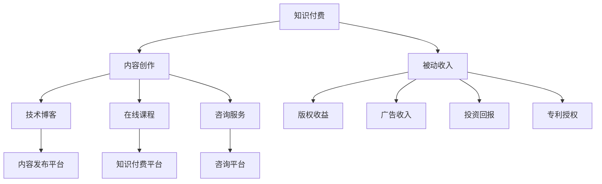

                 

# 程序员利用知识付费实现被动收入的秘诀

> 关键词：知识付费, 程序员, 被动收入, 技术博客, 变现策略, 内容创作

## 1. 背景介绍

在互联网时代，程序员作为技术行业的中坚力量，不仅在职业道路上获得了良好的发展，也在个人副业和被动收入方面找到了新的方向。知识付费，即通过专业知识和经验提供有偿服务，已成为程序员实现被动收入的重要途径之一。然而，如何高效运营这一领域，成为许多程序员面临的挑战。本文将系统地介绍程序员如何通过知识付费实现被动收入，包括核心概念、算法原理、具体操作步骤、实际应用场景及未来展望。

## 2. 核心概念与联系

### 2.1 核心概念概述

为理解程序员利用知识付费实现被动收入的策略，本文将介绍几个关键概念：

- **知识付费**：指将专业知识、技能或经验以付费形式提供给需要者，如在线课程、技术文章、咨询服务等。
- **被动收入**：指通过前期投入，后期无需主动干预即可产生收入的方式，如版权收益、投资回报、专利授权等。
- **内容创作**：指创作并发布有价值的内容，吸引目标用户，进而提供有偿服务。
- **变现策略**：指将知识资源转化为实际收入的具体操作和方案。
- **技术博客**：指通过撰写与技术相关的内容，提供专业见解和解决方案，吸引读者和广告收入。

这些核心概念之间的逻辑关系可以通过以下Mermaid流程图来展示：



这个流程图展示了知识付费与被动收入之间的联系：

1. **知识付费**通过**内容创作**获取收入，包括**技术博客**、**在线课程**、**咨询服务**等多种形式。
2. **被动收入**包括**版权收益**、**广告收入**、**投资回报**、**专利授权**等形式，可以通过知识付费平台、内容发布平台、咨询平台等多种渠道实现。
3. **技术博客**是内容创作的一个重要形式，能够帮助程序员建立个人品牌，吸引读者，进而通过广告、会员订阅等方式实现变现。
4. **在线课程**和**咨询服务**则是针对不同需求的高级知识付费形式，通常要求程序员具备更深入的专业知识和经验。

## 3. 核心算法原理 & 具体操作步骤

### 3.1 算法原理概述

程序员利用知识付费实现被动收入的核心算法原理基于价值传递和市场供需。知识付费的运作机制主要包括以下几个步骤：

1. **内容创作**：程序员通过自己的专业知识和技术经验，创作出有价值的内容，包括代码示例、技术讲解、解决方案等。
2. **平台推荐**：内容创作完成后，通过各类平台（如博客、视频平台、知识付费平台等）进行发布和推荐。
3. **用户付费**：目标用户看到内容后，根据其需求和使用价值，决定是否支付费用以获取深度服务或直接购买内容。
4. **收益分配**：平台根据用户付费情况，向内容创作者进行收益分配，创作者因此获得被动收入。

### 3.2 算法步骤详解

基于上述原理，程序员利用知识付费实现被动收入的操作步骤可以概括为以下几个步骤：

**Step 1: 选择合适的知识付费平台**
- 评估各类平台的优势和适用性，如知识深度、用户群体、收益分配机制等。
- 确定目标用户群体，如开发者、运维人员、数据科学家等。

**Step 2: 准备高质量内容**
- 深入分析目标用户的需求和痛点，确定内容主题和形式，如代码示例、技术教程、解决方案等。
- 确保内容的原创性和深度，避免抄袭和低质量内容。

**Step 3: 优化内容传播策略**
- 利用SEO（搜索引擎优化）和SEM（搜索引擎营销）技巧，提升内容在搜索引擎和社交媒体中的曝光率。
- 与KOL（关键意见领袖）合作，扩大内容的传播范围和影响力。

**Step 4: 吸引并维护用户**
- 通过免费试用、社区互动、持续更新等手段，吸引用户付费订阅或购买内容。
- 定期收集用户反馈，优化和改进内容，提升用户满意度和忠诚度。

**Step 5: 实现收益分配**
- 定期检查平台的收益分配机制，确保收益能够及时、准确地到账。
- 合理规划和管理资金，进行再投资或消费，实现资金的最大化利用。

### 3.3 算法优缺点

利用知识付费实现被动收入的算法具有以下优点：

1. **高效灵活**：内容创作和发布可以在业余时间进行，灵活性高，不影响主业。
2. **成本低廉**：相对于直接投资，知识付费的初始投入较低，风险较小。
3. **收入稳定**：一旦吸引到一批忠实用户，被动收入可以持续稳定增长。

同时，该算法也存在一些局限性：

1. **内容创作难度高**：高质量内容的创作需要专业知识和技术积累，要求较高。
2. **市场竞争激烈**：知识付费领域竞争激烈，如何突围和差异化是一个挑战。
3. **收益不确定性**：用户付费行为受多种因素影响，收益具有一定的不确定性。
4. **平台依赖性强**：依赖特定平台的推荐和分发，平台变化可能影响收益。

### 3.4 算法应用领域

知识付费技术在多个领域得到了广泛应用，程序员可以利用这一策略实现以下领域的被动收入：

1. **技术博客**：创建并维护技术博客，发布有价值的技术文章，吸引广告和会员订阅。
2. **在线课程**：制作专业课程，通过知识付费平台销售给目标用户，如Udemy、Coursera等。
3. **咨询服务**：提供个性化的技术咨询和问题解答，通过咨询平台或社交媒体收费。
4. **技术培训**：举办线下或线上技术培训课程，吸引学员付费参加。
5. **技术书籍**：编写和出版技术书籍，通过出版社或在线书店销售。

这些应用领域为程序员提供了多样化的被动收入来源，帮助他们在技术领域之外实现财务自由。

## 4. 数学模型和公式 & 详细讲解  
### 4.1 数学模型构建

利用知识付费实现被动收入的数学模型主要涉及收益预测和成本计算。设内容创作收益为 $R$，内容制作成本为 $C$，平台收益分配率为 $k$，则收益模型可以表示为：

$$ R = k \cdot (C + U) $$

其中 $U$ 表示用户支付的费用，$k$ 表示平台分配给创作者的收益比例。

### 4.2 公式推导过程

将上述模型进行推导，得到：

$$ k \cdot U = k \cdot C + R $$

$$ U = \frac{R}{k} + C $$

在实际应用中，需要考虑用户支付意愿、内容质量和平台流量等因素。例如，通过A/B测试等方式，优化内容形式和定价策略，以最大化收益。

### 4.3 案例分析与讲解

以一个程序员开设的技术博客为例，其每篇文章收益为 $R$，每月发布 $n$ 篇，总成本为 $C$。平台收益分配率为 $k=0.7$。设每篇文章阅读量为 $P$，用户购买订阅的概率为 $p$，则总收益 $R_{total}$ 可以表示为：

$$ R_{total} = k \cdot C + k \cdot p \cdot P \cdot R $$

其中 $p$ 表示订阅用户购买文章的概率，$P$ 表示每篇文章的平均阅读量。

通过优化订阅价格和文章质量，可以最大化总收益。例如，可以通过小额免费试读吸引用户订阅，再通过优质内容和服务提高续订率。

## 5. 项目实践：代码实例和详细解释说明

### 5.1 开发环境搭建

进行知识付费实践前，需要准备以下开发环境：

1. **选择合适的知识付费平台**：如Medium、知乎、B站等，根据自身优势选择合适的平台。
2. **编写博客内容**：使用Markdown等文本格式，编写技术文章或教程。
3. **学习SEO和SEM技巧**：使用工具如Google Analytics、SEMrush等优化博客的搜索引擎排名。

### 5.2 源代码详细实现

以下是一个简单的技术博客创建流程的伪代码实现：

```python
class TechnicalBlog:
    def __init__(self, platform, cost):
        self.platform = platform
        self.cost = cost
        self.revenue = 0

    def write_articles(self, articles):
        for article in articles:
            self.publish(article)
            self.calculate_revenue()

    def publish(self, article):
        # 发布文章到平台
        self.platform.publish(article)
        # 触发SEO和SEM优化
        self.platform.optimize_for_search()

    def calculate_revenue(self):
        # 计算收益
        revenue = self.platform.get_revenue()
        self.revenue += revenue

    def optimize_for_search(self):
        # 优化搜索引擎排名
        self.platform.search_optimization()

# 示例
blog = TechnicalBlog('Medium', 1000)
blog.write_articles(['Python高级编程技巧', '机器学习实战案例'])
print(blog.revenue)  # 输出总收益
```

### 5.3 代码解读与分析

** TechnicalBlog类**：
- `__init__`方法：初始化平台、成本和收益。
- `write_articles`方法：循环创建和发布文章，计算收益。
- `publish`方法：将文章发布到指定平台，并触发SEO和SEM优化。
- `calculate_revenue`方法：计算收益并更新总收益。
- `optimize_for_search`方法：优化搜索引擎排名。

**代码实现**：
- 创建一个技术博客对象 `blog`，初始化平台为Medium，成本为1000元。
- 循环创建并发布两篇文章，计算收益。
- 输出总收益。

### 5.4 运行结果展示

在实际运行中，需要根据不同平台的具体API和优化策略进行调整。例如，在Medium平台上，可以通过使用Markdown语法、添加关键词标签等方式提升文章的搜索引擎排名。

## 6. 实际应用场景

### 6.1 技术博客

技术博客是程序员利用知识付费实现被动收入的重要形式。通过发布高质量的技术文章，吸引读者订阅和广告收入。例如，一个优秀的技术博客可以通过订阅收费、广告分成等方式实现每月数千元的被动收入。

### 6.2 在线课程

在线课程是程序员提供深度服务的高级形式。通过在知识付费平台上发布专业课程，吸引学员付费购买。例如，一个程序员开设的深度学习课程，每月可实现数万元的被动收入。

### 6.3 咨询服务

咨询服务提供个性化的技术支持和问题解答。通过社交媒体或专门的咨询平台，程序员可以为有需求的用户提供定制化的服务。例如，一个有丰富经验的DevOps工程师，可以提供24小时的在线支持，每小时收费数百元。

### 6.4 未来应用展望

随着知识付费市场的不断成熟，程序员利用知识付费实现被动收入的方式将更加多样化。未来，可能会涌现更多形式的变现策略，如知识图谱、数据分析服务等。同时，利用AI技术进行内容推荐和收益预测，也将提升知识付费的精准性和效益。

## 7. 工具和资源推荐
### 7.1 学习资源推荐

为了帮助程序员系统掌握知识付费技术，以下是一些优质的学习资源：

1. **《知识付费变现手册》**：详细介绍了知识付费领域的各项运营策略和实践经验。
2. **Coursera《内容创作与营销》课程**：系统讲解内容创作和SEO优化的方法。
3. **Medium官方指南**：Medium平台提供的详细开发指南和最佳实践。
4. **HubSpot博客**：提供各类营销和SEO优化技巧，帮助提升博客影响力。
5. **知乎知识付费专栏**：展示知乎上成功知识付费创作者的经验和案例。

通过学习这些资源，相信程序员可以更好地理解知识付费的运营机制，提升内容创作和平台运营的能力。

### 7.2 开发工具推荐

高效的开发离不开优秀的工具支持。以下是几款用于知识付费开发的常用工具：

1. **Jekyll**：开源静态网站生成器，适用于技术博客创建和托管。
2. **Medium**：知识付费平台，提供丰富的读者群体和收益分配机制。
3. **GitHub Pages**：GitHub提供的静态网站托管服务，易于搭建技术博客。
4. **Adobe Analytics**：广告收入分析工具，提供详细的收益报告。
5. **Google Analytics**：SEO优化工具，帮助追踪和分析用户行为。

合理利用这些工具，可以显著提升知识付费开发的效率，实现更高效的内容发布和收益最大化。

### 7.3 相关论文推荐

知识付费技术的发展源于学界的持续研究。以下是几篇奠基性的相关论文，推荐阅读：

1. **《知识付费变现之道》**：深入分析知识付费的市场现状和运营策略。
2. **《内容创作的心理学》**：研究内容创作的心理因素和用户行为，帮助提升内容吸引力。
3. **《知识付费平台的商业模式》**：探讨知识付费平台的不同商业模式及其优缺点。
4. **《用户付费意愿的影响因素》**：分析影响用户付费意愿的多种因素，提供策略建议。
5. **《知识付费与教育科技融合》**：探讨知识付费与教育科技的结合，提升教育质量和学习效率。

这些论文代表了大知识付费技术的发展脉络。通过学习这些前沿成果，可以帮助程序员掌握知识付费的最新动态，激发更多的创新灵感。

## 8. 总结：未来发展趋势与挑战

### 8.1 总结

本文对程序员利用知识付费实现被动收入的策略进行了全面系统的介绍。首先阐述了知识付费、被动收入、内容创作、变现策略、技术博客等核心概念，明确了知识付费在程序员副业和被动收入中的重要价值。其次，从原理到实践，详细讲解了知识付费的数学模型和具体操作步骤，给出了知识付费项目开发的完整代码实例。同时，本文还探讨了知识付费在技术博客、在线课程、咨询服务等多个行业领域的应用前景，展示了知识付费范式的巨大潜力。最后，本文精选了知识付费的相关学习资源和工具推荐，力求为程序员提供全方位的技术指引。

通过本文的系统梳理，可以看到，知识付费为程序员提供了多样化的被动收入来源，不仅能够提升技术影响力，还能在业余时间实现财务自由。知识付费的市场前景广阔，程序员需要不断学习和实践，才能在这一领域取得成功。

### 8.2 未来发展趋势

展望未来，知识付费技术将呈现以下几个发展趋势：

1. **内容多样化**：除了传统技术文章和课程，未来的知识付费内容将更加多样化，如视频、音频、直播等形式，吸引更多用户。
2. **个性化推荐**：利用AI技术进行内容推荐，提升用户对内容的满意度和黏性。
3. **跨平台运营**：知识付费内容将跨平台传播，利用各平台的优势，最大化收益。
4. **全球化扩展**：通过多语言内容和服务，拓展国际市场，提升全球影响力。
5. **知识整合**：将多种知识形式和数据源整合，提供更加全面和深入的服务。

这些趋势凸显了知识付费技术的广阔前景。通过内容的不断创新和技术的持续演进，知识付费必将为程序员带来更多的机遇和挑战。

### 8.3 面临的挑战

尽管知识付费技术已经取得了显著进展，但在迈向更加智能化、普适化应用的过程中，仍面临诸多挑战：

1. **内容创作难度高**：高质量内容创作需要专业知识和技术积累，要求较高。
2. **用户需求多样**：不同用户对知识付费内容的需求各异，需要提供差异化的服务和内容。
3. **市场竞争激烈**：知识付费领域竞争激烈，如何突围和差异化是一个挑战。
4. **收益不确定性**：用户付费行为受多种因素影响，收益具有一定的不确定性。
5. **平台依赖性强**：依赖特定平台的推荐和分发，平台变化可能影响收益。

### 8.4 研究展望

面对知识付费所面临的挑战，未来的研究需要在以下几个方面寻求新的突破：

1. **内容创作自动化**：开发AI辅助的内容创作工具，提升内容创作的效率和质量。
2. **用户需求分析**：利用数据分析和机器学习技术，深入了解用户需求，提供定制化服务。
3. **多平台协作**：构建跨平台的内容和服务生态，最大化各平台的价值。
4. **收益预测模型**：建立基于AI的收益预测模型，提升收益的准确性和稳定性。
5. **平台灵活性**：设计灵活的内容分发和收益分配机制，适应不同平台的需求。

这些研究方向的探索，必将引领知识付费技术迈向更高的台阶，为程序员实现被动收入提供更多的新路径和新方法。

## 9. 附录：常见问题与解答

**Q1：知识付费适合所有程序员吗？**

A: 知识付费适合具有一定技术水平和专业知识的程序员。对于初学者或基础薄弱者，建议先积累经验，再进行知识付费。

**Q2：如何找到合适的知识付费平台？**

A: 选择合适的知识付费平台需要考虑平台的用户群体、内容质量、收益分配机制等因素。可以先免费注册试运营一段时间，评估平台的实际效果。

**Q3：如何提升内容吸引力？**

A: 提升内容吸引力需要深入分析目标用户的需求和痛点，创作有价值的内容。可以通过SEO优化、数据分析等方式，提升内容的曝光率和阅读量。

**Q4：如何管理用户反馈？**

A: 建立用户反馈机制，定期收集用户意见和建议，及时优化和改进内容。可以通过问卷调查、评论互动等方式，增强用户黏性和满意度。

**Q5：如何应对市场变化？**

A: 保持对市场动态的关注，及时调整内容和运营策略。可以通过市场调研、竞品分析等方式，识别市场趋势和机会，灵活应对。

本文通过系统介绍程序员如何利用知识付费实现被动收入，展示了知识付费技术的广阔前景和实际应用价值。希望程序员能够通过本文的学习和实践，在这一领域取得更多的成就和收益。

