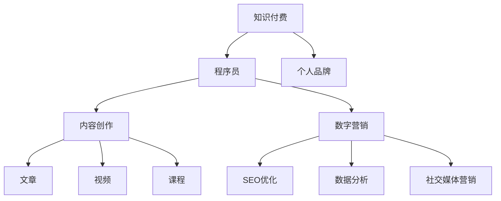

                 

# 程序员利用知识付费打造个人品牌

> 关键词：知识付费, 程序员, 个人品牌, 数字营销, 内容创作

## 1. 背景介绍

### 1.1 问题由来

随着互联网技术的飞速发展，知识付费市场正在迎来前所未有的机遇。越来越多的专业人士开始通过内容创作和知识分享，在平台上开设课程、发布文章，从而获得一定的经济收益，成功打造个人品牌。这一现象在科技领域尤为明显，程序员作为技术知识的重要输出者，自然不会错过这一机会。

### 1.2 问题核心关键点

程序员利用知识付费打造个人品牌，本质上是将专业知识转化为知识商品的过程，将技术能力和经验总结成系统性内容，并通过市场渠道进行销售。这一过程不仅能够带来经济收益，还能够提升个人知名度，增强行业影响力，实现自我价值最大化。

## 2. 核心概念与联系

### 2.1 核心概念概述

为更好地理解程序员如何利用知识付费打造个人品牌，本节将介绍几个关键概念：

- **知识付费**：指消费者为获取特定的知识或技能而支付费用的服务模式。知识付费的核心在于专业知识的传递和应用。
- **程序员**：指具有计算机编程和软件开发能力的专业人士，是知识创造和传播的重要群体。
- **个人品牌**：指个人在社会、行业中的知名度和影响力，通常通过特定领域内的技术积累和经验总结实现。
- **数字营销**：指通过互联网平台，利用数据分析、SEO优化、内容创作等手段，推广个人品牌和知识产品。
- **内容创作**：指将专业知识、经验、见解等系统性整理成文章、视频、课程等形式，提供给消费者。

这些核心概念之间的逻辑关系可以通过以下Mermaid流程图来展示：



这个流程图展示了知识付费、程序员、个人品牌、内容创作和数字营销之间的逻辑关系：

1. 知识付费是个人品牌建立和推广的货币基础。
2. 程序员是知识付费的主要内容创作者。
3. 内容创作是程序员向消费者传递知识的主要方式。
4. 数字营销则辅助内容推广，提升品牌知名度和市场影响力。

## 3. 核心算法原理 & 具体操作步骤
### 3.1 算法原理概述

程序员利用知识付费打造个人品牌的过程，可以视为一个循环优化的过程。该过程包括知识创作、内容分发、品牌推广等环节，每个环节都需要不断优化和迭代，以达到最佳效果。

具体而言，核心算法原理包括以下几个步骤：

1. **知识收集与整理**：程序员需从日常工作中收集和整理专业知识和经验，形成系统性内容。
2. **内容创作与优化**：将整理好的知识内容转化为易于传播和消费的形式，如文章、视频、课程等。
3. **数字营销与推广**：利用SEO、数据分析等手段，将内容推广到目标受众，提升品牌知名度和市场影响力。
4. **反馈与优化**：收集受众的反馈信息，不断优化内容创作和数字营销策略，提升内容质量和传播效果。

### 3.2 算法步骤详解

以下是程序员利用知识付费打造个人品牌的具体操作步骤：

**Step 1: 知识收集与整理**
- 收集日常工作中遇到的常见问题和挑战。
- 整理专业知识和经验，形成问题-解答或案例分析等形式的文档。

**Step 2: 内容创作与优化**
- 选择合适的知识传递方式，如文章、视频、课程等。
- 对创作好的内容进行优化，包括标题优化、内容结构调整、多媒体插入等。

**Step 3: 数字营销与推广**
- 利用SEO技术优化内容，提升在搜索引擎中的排名。
- 使用数据分析工具分析受众行为，定位目标受众。
- 在社交媒体、专业社区等平台进行内容推广。

**Step 4: 反馈与优化**
- 收集受众的反馈信息，包括评价、留言等。
- 分析反馈，找出优化点，不断改进内容创作和数字营销策略。

### 3.3 算法优缺点

利用知识付费打造个人品牌的方法具有以下优点：
1. **高效变现**：将专业知识和经验转化为系统性内容，通过市场渠道快速变现。
2. **提升影响力**：通过内容创作和数字营销，提升个人在行业内的知名度和影响力。
3. **持续收益**：优质的内容具有长尾效应，能够持续产生收益。

同时，该方法也存在以下局限性：
1. **市场竞争激烈**：互联网平台内容繁多，如何在众多竞争者中脱颖而出，需要高水平的内容创作和营销策略。
2. **内容质量要求高**：为了获得受众认可，内容需要高质量、系统性、实用性强。
3. **市场反应不确定**：内容创作和营销策略的效果受市场反馈影响，可能存在较大不确定性。

### 3.4 算法应用领域

基于知识付费的程序员个人品牌打造，在多个领域都有着广泛的应用：

- **技术博客**：通过撰写技术博客，分享编程技巧、项目案例、问题解决方案等，建立行业影响力。
- **技术演讲**：在技术会议上发布主题演讲，展示专业能力和知识储备。
- **在线课程**：开设在线编程课程，教授编程语言、框架、工具等，吸引学员。
- **咨询和顾问服务**：利用个人品牌影响力，提供技术咨询、项目评审、行业分析等服务。

## 4. 数学模型和公式 & 详细讲解 & 举例说明
### 4.1 数学模型构建

本文主要讨论的是非线性优化问题，可以使用梯度下降法来优化目标函数。设目标函数为 $f(x)$，其中 $x$ 为模型参数，优化目标为最小化目标函数。梯度下降法的基本步骤如下：

1. 初始化模型参数 $x_0$。
2. 计算目标函数 $f(x)$ 的梯度 $\nabla f(x)$。
3. 更新模型参数 $x_{t+1} = x_t - \eta \nabla f(x_t)$，其中 $\eta$ 为学习率。
4. 重复步骤2-3，直至收敛。

### 4.2 公式推导过程

以线性回归为例，目标函数为 $f(x) = (y - wx - b)^2$，其中 $y$ 为真实值，$w$ 和 $b$ 为模型参数。梯度下降法更新模型参数的公式为：

$$
w_{t+1} = w_t - \eta \frac{2(y - wx_t - b)}{2} = w_t - \eta(y - wx_t - b)
$$

$$
b_{t+1} = b_t - \eta(y - wx_t - b)
$$

通过不断迭代更新参数，梯度下降法能够逐步优化模型，使预测值与真实值之间的误差最小化。

### 4.3 案例分析与讲解

假设某程序员正在撰写一篇关于Python编程技巧的博客，可以通过以下步骤来应用梯度下降法优化内容：

1. 初始化内容草稿。
2. 计算读者评价（如点击率、评论数量等）作为目标函数的梯度。
3. 根据梯度更新内容，如增加特定技巧的讲解，调整文章结构，提高文章质量。
4. 收集新的读者反馈，再次应用梯度下降法优化内容。

## 5. 项目实践：代码实例和详细解释说明
### 5.1 开发环境搭建

在进行知识付费项目实践前，我们需要准备好开发环境。以下是使用Python进行Flask框架开发的知识付费平台环境配置流程：

1. 安装Python：从官网下载并安装Python，建议使用3.8以上版本。
2. 安装Flask：通过pip安装Flask，创建虚拟环境，如：
```bash
pip install flask
```
3. 创建虚拟环境：
```bash
python -m venv knowledge-payment-env
source knowledge-payment-env/bin/activate
```
4. 安装Flask扩展：安装Flask扩展，如Flask-WTF、Flask-Uploads等。

完成上述步骤后，即可在`knowledge-payment-env`环境中开始知识付费平台的开发。

### 5.2 源代码详细实现

以下是使用Flask框架开发的知识付费平台的Python代码实现：

```python
from flask import Flask, render_template, request, redirect, url_for
from flask_wtf import FlaskForm
from wtforms import StringField, TextAreaField, SubmitField
from wtforms.validators import DataRequired
from flask_uploads import UploadSet, configure_uploads, IMAGES

app = Flask(__name__)
app.config['UPLOADED_PHOTOS_DEST'] = 'uploads'
photos = UploadSet('photos', IMAGES)
configure_uploads(app)
form = FlaskForm(
    StringField('Title', validators=[DataRequired()]),
    TextAreaField('Content', validators=[DataRequired()]),
    SubmitField('Submit')
)

@app.route('/', methods=['GET', 'POST'])
def index():
    if request.method == 'POST':
        form.validate_on_submit()
        title = form.title.data
        content = form.content.data
        with open('articles.txt', 'a') as f:
            f.write(f"{title}\n{content}\n")
        return redirect(url_for('index'))
    return render_template('index.html', form=form)

@app.route('/show', methods=['GET'])
def show():
    with open('articles.txt', 'r') as f:
        articles = f.readlines()
    return render_template('show.html', articles=articles)

if __name__ == '__main__':
    app.run(debug=True)
```

该平台包括文章提交、文章展示、文件上传等功能。

### 5.3 代码解读与分析

让我们再详细解读一下关键代码的实现细节：

**Flask框架**：
- 使用Flask框架搭建Web应用，提供路由和模板渲染功能。
- 使用WTForms库进行表单验证，确保用户输入数据格式正确。
- 使用Flask-Uploads扩展，支持文件上传和存储。

**index路由**：
- 处理文章提交请求，将文章标题和内容写入本地文件。
- 表单包含标题、内容和提交按钮，用户提交后重定向到首页。

**show路由**：
- 从本地文件中读取文章内容，展示在网页上。

**run方法**：
- 启动Flask应用，设置debug为True，便于调试。

可以看到，Flask框架提供了便捷的Web开发接口，使程序员能够快速搭建知识付费平台。开发者可以根据实际需求，进一步定制开发功能，如用户管理、付费机制、数据分析等。

## 6. 实际应用场景
### 6.1 技术博客

技术博客是程序员最常见的知识付费形式，通过撰写技术文章，分享编程技巧、项目案例、问题解决方案等，建立行业影响力。常见的博客平台有Medium、知乎等。

### 6.2 在线课程

在线课程是指通过视频、文本、代码等多种形式，系统化地教授编程语言、框架、工具等知识，吸引学员。常见的平台有Coursera、Udacity等。

### 6.3 技术演讲

技术演讲是指在技术会议上发布主题演讲，展示专业能力和知识储备。常见的会议有QCon、Google I/O等。

### 6.4 技术咨询服务

技术咨询服务是指利用个人品牌影响力，提供技术咨询、项目评审、行业分析等服务。常见的服务模式有一对一咨询、项目合作等。

## 7. 工具和资源推荐
### 7.1 学习资源推荐

为了帮助程序员系统掌握知识付费的理论基础和实践技巧，这里推荐一些优质的学习资源：

1. **《程序员知识付费指南》系列博文**：由知名IT博客作者撰写，深入浅出地介绍了知识付费的各个环节和策略。
2. **Coursera《数字营销》课程**：谷歌和Google Analytics联合开设的数字营销课程，提供系统的数字营销知识。
3. **《知识付费创业》书籍**：讲述知识付费创业的实战经验和教训，适合初创者和创业者。
4. **知识付费平台官方文档**：如Medium、知乎、Coursera等平台的官方文档，提供详细的平台使用指南和API接口。
5. **知识付费社区**：如知乎专栏、Medium等平台的知识付费社区，可以获取最新的行业资讯和优质内容。

通过对这些资源的学习实践，相信你一定能够快速掌握知识付费的精髓，并用于解决实际的NLP问题。

### 7.2 开发工具推荐

高效的开发离不开优秀的工具支持。以下是几款用于知识付费开发的常用工具：

1. **Flask框架**：轻量级的Web框架，易于上手，适合快速迭代开发。
2. **Jupyter Notebook**：交互式编程环境，便于快速原型设计和代码测试。
3. **Git**：版本控制工具，方便团队协作和代码管理。
4. **Docker**：容器化平台，简化开发、测试、部署过程。
5. **AWS云平台**：提供高效稳定的云计算服务，支持大规模部署和运维。

合理利用这些工具，可以显著提升知识付费平台的开发效率，加快创新迭代的步伐。

### 7.3 相关论文推荐

知识付费技术的快速发展，得益于学术界的持续研究。以下是几篇奠基性的相关论文，推荐阅读：

1. **《知识付费平台的市场分析》**：研究知识付费平台的市场规模、用户行为、商业模式等。
2. **《知识付费内容分析》**：分析知识付费内容的质量、受欢迎程度、传播渠道等。
3. **《知识付费平台的用户画像》**：研究知识付费平台用户的基本特征和行为模式。
4. **《知识付费与在线教育的融合》**：探讨知识付费与在线教育的关系和融合模式。
5. **《知识付费平台的运营策略》**：研究知识付费平台的运营策略，包括内容创作、用户管理、数据分析等。

这些论文代表的知识付费技术的发展脉络。通过学习这些前沿成果，可以帮助研究者把握学科前进方向，激发更多的创新灵感。

## 8. 总结：未来发展趋势与挑战
### 8.1 总结

本文对程序员利用知识付费打造个人品牌的方法进行了全面系统的介绍。首先阐述了知识付费和程序员个人品牌的关系，明确了利用知识付费打造个人品牌的优势和过程。其次，从原理到实践，详细讲解了知识付费和程序员个人品牌的数学模型和操作步骤，给出了知识付费平台开发的完整代码实例。同时，本文还广泛探讨了知识付费和程序员个人品牌在技术博客、在线课程、技术演讲、咨询服务等多个场景中的应用前景，展示了知识付费的广阔前景。此外，本文精选了知识付费和程序员个人品牌的学习资源、开发工具和相关论文，力求为读者提供全方位的技术指引。

通过本文的系统梳理，可以看到，利用知识付费打造个人品牌是程序员实现自我价值最大化、提升行业影响力的重要途径。程序员可以通过技术博客、在线课程、技术演讲等方式，不断输出高质量内容，建立个人品牌，获得经济收益和社会认可。未来，伴随知识付费技术的持续演进，相信知识付费将成为程序员实现自我价值的重要手段，为人工智能技术的普及和应用提供新的机遇。

### 8.2 未来发展趋势

展望未来，知识付费和程序员个人品牌将呈现以下几个发展趋势：

1. **内容多样化**：知识付费平台将提供更多形式的内容，如视频、音频、图文混合等，满足不同受众的需求。
2. **用户个性化**：通过推荐算法和数据分析，为用户提供个性化的内容和推荐，提升用户满意度。
3. **付费模式多元化**：除了传统的订阅制，还将出现更多元化的付费模式，如按需付费、按点击付费等。
4. **平台生态化**：知识付费平台将逐步演变为集内容创作、知识交流、社交互动于一体的生态系统。
5. **国际化**：知识付费平台将逐渐拓展到国际市场，提供多语言内容和服务。

以上趋势凸显了知识付费和程序员个人品牌的广阔前景。这些方向的探索发展，必将进一步提升知识付费平台的价值和影响力，为程序员提供更广阔的发展空间。

### 8.3 面临的挑战

尽管知识付费和程序员个人品牌已经取得了一定的成功，但在迈向更加智能化、普适化应用的过程中，仍面临诸多挑战：

1. **内容质量保障**：知识付费平台的成功，关键在于内容的质量和深度。如何确保内容的高质量、系统性、实用性强，仍是一个重要课题。
2. **用户留存率提升**：知识付费平台的用户留存率较低，如何提高用户粘性，增加用户活跃度，是亟待解决的问题。
3. **市场竞争加剧**：知识付费市场竞争激烈，如何通过差异化竞争，找到自身的市场定位，是关键挑战。
4. **商业模式探索**：知识付费平台的商业模式尚未成熟，如何平衡内容质量、付费模式、用户体验，是复杂难题。
5. **技术支持不足**：知识付费平台的技术支撑较为薄弱，如何提升技术水平，保障平台稳定性和安全性，是技术挑战。

这些挑战需要知识付费平台的开发者、运营者、内容创作者等共同面对和解决。只有在内容、技术、市场、用户等多个维度协同发力，才能实现知识付费和程序员个人品牌的可持续发展。

### 8.4 研究展望

面向未来，知识付费和程序员个人品牌的研究需要在以下几个方面寻求新的突破：

1. **内容推荐算法优化**：通过改进推荐算法，提升用户个性化体验，增加用户留存率。
2. **社区生态构建**：建立知识付费平台的社区生态，促进知识交流和用户互动。
3. **国际化布局**：拓展知识付费平台的国际化布局，提供多语言内容和服务。
4. **技术栈优化**：优化知识付费平台的技术栈，提升平台稳定性和扩展性。
5. **商业模式创新**：探索多样化的商业模式，平衡内容质量、付费模式、用户体验。

这些研究方向将引领知识付费和程序员个人品牌技术迈向更高的台阶，为知识付费平台的持续发展和创新提供新的动力。相信随着学界和产业界的共同努力，知识付费和程序员个人品牌必将在未来得到更广泛的应用和发展，为人类认知智能的进化带来新的影响。

## 9. 附录：常见问题与解答

**Q1：如何选择合适的知识付费平台？**

A: 选择合适的知识付费平台，需要考虑以下几个因素：
1. **平台知名度和用户基础**：选择知名度高、用户基础强的平台，能够获得更多曝光机会。
2. **平台功能**：平台是否支持文章、视频、课程等多种形式的内容发布。
3. **平台收益分成**：平台是否提供合理的收益分成，是否有补贴、广告分成等激励机制。
4. **平台技术支持**：平台是否提供完善的技术支持，如内容管理系统、数据分析工具等。

**Q2：如何提高知识付费内容的质量和吸引力？**

A: 提高知识付费内容的质量和吸引力，可以从以下几个方面入手：
1. **深入调研受众需求**：了解目标受众的需求和痛点，提供有价值的内容。
2. **注重内容更新和迭代**：持续更新和迭代内容，保持内容的时效性和实用性。
3. **引入互动元素**：通过问答、评论、互动课程等方式，增加用户参与度。
4. **提供定制化服务**：根据用户需求，提供个性化的内容和服务，提升用户满意度。

**Q3：如何提升知识付费平台的用户留存率？**

A: 提升知识付费平台的用户留存率，可以从以下几个方面入手：
1. **提升内容质量**：确保内容的高质量、系统性、实用性强，吸引用户持续关注。
2. **增加互动元素**：通过问答、评论、互动课程等方式，增加用户参与度。
3. **提供增值服务**：提供会员服务、社群互动等增值服务，提升用户粘性。
4. **优化用户体验**：提升平台的用户体验，简化操作流程，增加用户满意度。

**Q4：如何应对知识付费市场的竞争？**

A: 应对知识付费市场的竞争，可以从以下几个方面入手：
1. **差异化定位**：找到自身的市场定位，与竞争对手区分开来。
2. **提升内容质量**：确保内容的高质量、系统性、实用性强，吸引用户持续关注。
3. **多平台布局**：拓展到多平台布局，增加曝光机会。
4. **优化用户体验**：提升平台的用户体验，简化操作流程，增加用户满意度。

**Q5：如何平衡知识付费平台的商业模式？**

A: 平衡知识付费平台的商业模式，可以从以下几个方面入手：
1. **多样化收入来源**：引入多样化的收入来源，如订阅制、按需付费、广告分成等。
2. **提升内容质量**：确保内容的高质量、系统性、实用性强，吸引用户持续关注。
3. **优化用户体验**：提升平台的用户体验，简化操作流程，增加用户满意度。
4. **引入合作伙伴**：与教育机构、企业等合作伙伴，共同开发内容和服务。

这些回答可以帮助你更好地理解知识付费和程序员个人品牌的构建过程，为实际应用提供参考。

---

作者：禅与计算机程序设计艺术 / Zen and the Art of Computer Programming

