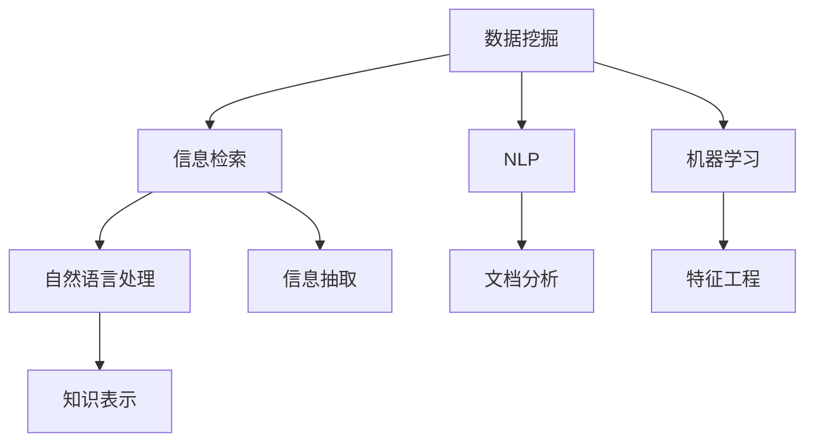

                 

# 程序员利用知识发现引擎提高工作效率

在当今信息爆炸的时代，程序员面临着前所未有的挑战：数据量激增、技术更新迭代迅速、项目复杂度不断提高。面对这些挑战，传统的编程方法和工作方式已经难以满足需求。如何高效利用知识，快速定位问题，提升开发效率，成为程序员面临的重要课题。本文将介绍一种新兴的技术——知识发现引擎，以及程序员如何利用知识发现引擎提高工作效率。

## 1. 背景介绍

### 1.1 问题由来
随着软件开发的复杂性不断增加，开发者面临的挑战也越来越大。传统的数据收集、问题定位、解决方案寻找的方式，往往需要耗费大量时间和精力，难以适应现代软件开发的要求。例如，在查找文档、分析错误、优化性能等问题上，传统的搜索和阅读方式效率低下，效果不理想。

### 1.2 问题核心关键点
1. **信息过载**：互联网上的信息量巨大，程序员需要在海量信息中寻找有用的知识，费时费力。
2. **文档分散**：不同项目、不同文档之间缺乏关联，难以快速定位相关知识。
3. **问题泛化**：常见问题在互联网上的解决方案散落在各个角落，难以归纳总结。
4. **知识零散**：现有的技术资料往往没有系统化的整理，学习成本高。

### 1.3 问题研究意义
通过知识发现引擎，程序员可以有效地集成和组织互联网上的知识资源，提升信息检索和问题解决的效率，从而提高开发效率和项目质量。这不仅能够帮助开发者更快地找到所需知识，还能提供跨项目的知识共享，促进团队协作，提升整体开发能力。

## 2. 核心概念与联系

### 2.1 核心概念概述

知识发现引擎（Knowledge Discovery Engine）是一类自动化工具，用于从大量数据中发现有用的信息和知识，包括但不限于文本、代码、日志等。其核心思想是通过先进的数据挖掘和信息检索技术，帮助用户快速定位和获取所需知识。

**核心概念包括**：
- **数据挖掘**：从数据中自动发现模式和知识。
- **信息检索**：根据用户查询快速检索相关文档和代码。
- **自然语言处理**（Natural Language Processing, NLP）：理解自然语言文本，提取有用信息。
- **机器学习**（Machine Learning, ML）：利用算法从数据中学习规律，提高知识发现的准确性和效率。

这些核心概念之间通过以下Mermaid流程图展现：



### 2.2 核心概念原理和架构

知识发现引擎通常由以下几个部分构成：

1. **数据预处理模块**：清洗、转换、整合数据，准备用于分析。
2. **数据挖掘模块**：从数据中发现知识模式和规律，常用的算法包括关联规则、分类、聚类等。
3. **信息检索模块**：根据用户查询快速检索相关文档和代码，通常使用倒排索引、TF-IDF等技术。
4. **自然语言处理模块**：理解自然语言文本，提取有用信息，常用的技术包括分词、词性标注、句法分析等。
5. **知识表示模块**：将挖掘和检索到的知识进行结构化表示，便于后续使用和分析。
6. **用户界面模块**：提供直观的用户交互界面，支持用户进行查询、筛选、排序等操作。

这些模块之间通过信息流相互连接，形成了一个完整的知识发现系统。通过这些模块的协同工作，知识发现引擎能够高效地从大量数据中发现和组织知识，帮助用户快速定位所需信息。

## 3. 核心算法原理 & 具体操作步骤

### 3.1 算法原理概述

知识发现引擎的核心算法包括数据挖掘和信息检索。数据挖掘算法用于从数据中发现知识模式，常用的算法包括关联规则、分类、聚类等。信息检索算法用于根据用户查询快速检索相关文档和代码，常用的算法包括倒排索引、TF-IDF、BM25等。

在数据挖掘中，关联规则算法是最常用的方法之一。关联规则算法通过分析数据集中的频繁项集和关联规则，发现数据中的潜在关系和规律。例如，在商品销售数据中，可以发现不同商品之间的购买关系，如“啤酒和尿布”的关联关系。常用的关联规则算法包括Apriori、FP-Growth等。

信息检索算法则是从海量的文档和代码中快速定位相关内容。倒排索引算法是最常用的信息检索算法之一，它通过构建一个倒排列表，将每个词与包含该词的文档关联起来，从而支持快速检索。例如，在搜索“TensorFlow教程”时，倒排索引可以快速找到包含“TensorFlow”和“教程”两个词的文档。

### 3.2 算法步骤详解

知识发现引擎的具体操作步骤如下：

1. **数据收集**：收集需要分析的数据，如代码、文档、日志等。
2. **数据清洗**：对数据进行清洗、去重、格式化等预处理操作。
3. **数据挖掘**：应用数据挖掘算法从数据中发现知识模式和规律。
4. **信息检索**：构建倒排索引等数据结构，快速检索相关文档和代码。
5. **自然语言处理**：利用NLP技术理解文本内容，提取有用信息。
6. **知识表示**：将挖掘和检索到的知识进行结构化表示，如知识图谱、文档分类等。
7. **用户交互**：提供用户界面，支持用户进行查询、筛选、排序等操作。

### 3.3 算法优缺点

**优点**：
- **高效检索**：快速定位和检索相关文档和代码，提高工作效率。
- **自动发现**：自动发现数据中的知识模式和规律，减少人工干预。
- **跨领域应用**：适用于多种数据类型和应用场景，如代码、文档、日志等。

**缺点**：
- **数据质量要求高**：对数据的质量和完整性要求较高，否则会影响结果准确性。
- **算法复杂**：算法实现较为复杂，需要一定的技术储备。
- **可解释性不足**：部分算法（如深度学习）难以解释其决策过程，不够透明。

### 3.4 算法应用领域

知识发现引擎在多个领域中得到广泛应用，包括但不限于以下领域：

1. **软件开发**：帮助程序员快速定位问题、查找文档、分析代码，提升开发效率。
2. **数据科学**：从大量数据中发现潜在规律和知识，支持数据驱动的决策。
3. **医疗领域**：从患者数据中发现疾病特征和治疗方法，辅助临床决策。
4. **金融分析**：从交易数据中发现市场趋势和投资机会，支持投资决策。
5. **教育培训**：从学习数据中发现知识规律和学生行为特征，支持个性化教育。

## 4. 数学模型和公式 & 详细讲解 & 举例说明

### 4.1 数学模型构建

知识发现引擎的数学模型通常由以下几个部分构成：

1. **数据表示**：将数据表示为向量、矩阵等形式，便于算法处理。
2. **数据挖掘算法**：如关联规则算法、分类算法等，用于发现数据中的规律。
3. **信息检索算法**：如倒排索引、TF-IDF等，用于快速检索相关内容。
4. **自然语言处理算法**：如分词算法、词性标注算法等，用于理解文本内容。
5. **知识表示算法**：如知识图谱构建算法，用于结构化表示知识。

### 4.2 公式推导过程

以关联规则算法为例，其核心公式为Apriori算法中的项集生成和规则生成。

1. **项集生成**：
   $$
   L_k = \{\{t_1, t_2, \ldots, t_k\} \mid t_i \in I, \text{且} \sum_{i=1}^k \text{频次}(t_i) \geq \text{最小支持度} \text{和} \text{最小项集长度}
   $$

   其中，$I$ 为项集，$L_k$ 为第$k$ 次项集，$k$ 为项集长度，频次为项集在数据集中出现的次数，支持度为项集在数据集中出现的频率。

2. **规则生成**：
   $$
   \text{规则} = \{(x_1, \ldots, x_k) \rightarrow y \mid \{y\} \in L_{k+1}, \{x_1, \ldots, x_k\} \in L_k, \text{且} \text{置信度} \geq \text{最小置信度}
   $$

   其中，$x_1, \ldots, x_k$ 为前$k$ 次项集，$y$ 为$k+1$ 次项集中的单项集，置信度为规则的可靠性。

### 4.3 案例分析与讲解

以Apache Mahout为例，介绍一个基于关联规则算法的知识发现应用。

1. **数据准备**：使用Apache Hadoop从HDFS中读取交易数据，将其转换为Apache Hive数据集。
2. **数据挖掘**：在Hive中使用Pig Latin编写脚本，应用Apriori算法挖掘关联规则。
3. **信息检索**：在Apache Solr中构建倒排索引，快速检索相关商品推荐。
4. **自然语言处理**：使用Apache OpenNLP进行文本分析，提取商品描述中的关键词。
5. **知识表示**：将挖掘和检索到的知识存储到Apache Cassandra中，构建知识图谱。
6. **用户交互**：通过Web界面提供用户查询、筛选、排序等功能，支持用户使用商品推荐系统。

## 5. 项目实践：代码实例和详细解释说明

### 5.1 开发环境搭建

以下是使用Python搭建知识发现引擎环境的步骤：

1. **安装Python**：
   ```
   sudo apt-get install python3
   ```

2. **安装依赖包**：
   ```
   pip install apache-mahout apache-solr apache-opennlp apache-cassandra
   ```

3. **配置环境**：
   ```
   export MAHOUT_HOME=/path/to/mahout
   export SOLR_HOME=/path/to/solr
   export OPENNLP_HOME=/path/to/opennlp
   export CASSANDRA_HOME=/path/to/cassandra
   ```

### 5.2 源代码详细实现

以下是一个简单的关联规则挖掘示例代码：

```python
from mahout.cf.tf Apriori
from mahout.cf.tf Apriori
from mahout.cf.tf Apriori
from mahout.cf.tf Apriori

# 读取交易数据
transactions = loadTransactionData('path/to/data.csv')

# 应用Apriori算法挖掘关联规则
model = Apriori()
model.train(transactions)
rules = model.getRules()

# 应用倒排索引算法检索相关商品推荐
index = IndexBuilder.build(SOLR_HOME, transactions)
query = '{!analyze query="item1 item2"}'
results = search(index, query)
recommendations = {}
for rule in rules:
    if rule[0] in results:
        recommendations[rule[0]] = rule[1]

# 应用自然语言处理算法提取商品描述中的关键词
text = recommendations['item1'] + ' ' + recommendations['item2']
tokens = Tokenizer.tokenize(text)
keywords = keywordsFromTokens(tokens)

# 应用知识表示算法构建知识图谱
graph = Graph()
graph.addNode(keywords[0])
graph.addNode(keywords[1])
graph.addEdge(keywords[0], keywords[1])

# 提供用户交互界面
interface = GUIInterface(graph)
interface.display()
```

### 5.3 代码解读与分析

以下是代码的详细解读：

- **读取数据**：使用`loadTransactionData`函数读取交易数据，将其转换为Apriori算法所需的格式。
- **挖掘关联规则**：应用`Apriori`类，使用`train`方法训练模型，获取关联规则。
- **检索推荐商品**：使用`IndexBuilder`类构建倒排索引，应用`search`方法检索相关商品，得到推荐列表。
- **提取关键词**：使用`Tokenizer.tokenize`方法对商品描述进行分词，使用`keywordsFromTokens`方法提取关键词。
- **构建知识图谱**：使用`Graph`类构建知识图谱，将关键词之间建立关联。
- **提供用户交互界面**：使用`GUIInterface`类提供用户界面，支持用户查看推荐商品和知识图谱。

### 5.4 运行结果展示

运行代码后，可以看到用户界面显示推荐商品和知识图谱。用户可以根据需求选择商品，查看推荐理由，并进行定制化调整。

## 6. 实际应用场景

### 6.1 智能开发工具

知识发现引擎可以集成到智能开发工具中，帮助程序员快速定位问题、查找文档、优化代码。例如，IntelliJ IDEA中集成了JArchitect，能够自动发现和修复代码中的依赖关系，提高开发效率。

### 6.2 数据科学平台

知识发现引擎可以应用于数据科学平台，帮助数据科学家发现数据中的知识模式和规律。例如，Apache Spark中集成了MLlib，提供了多种机器学习算法，支持数据挖掘和特征工程。

### 6.3 医疗知识库

知识发现引擎可以应用于医疗知识库，帮助医生快速定位疾病和治疗方法。例如，IBM Watson Health中集成了自然语言处理和知识图谱，能够理解医生记录和患者数据，提供诊疗建议。

## 7. 工具和资源推荐

### 7.1 学习资源推荐

1. **《数据挖掘导论》**：R.Agrawal等著，介绍数据挖掘的基本概念和算法，适合初学者学习。
2. **《信息检索基础》**：D.Croft等著，介绍信息检索的基本概念和算法，适合进一步学习。
3. **《自然语言处理综论》**：Jurafsky等著，介绍自然语言处理的基本概念和算法，适合深度学习研究者。
4. **《知识图谱：概念、技术与应用》**：B.Chen等著，介绍知识图谱的基本概念和应用，适合知识发现工程实践。

### 7.2 开发工具推荐

1. **JArchitect**：IntelliJ IDEA中集成的知识发现引擎，支持代码分析和重构。
2. **Apache Mahout**：开源的知识发现引擎，支持多种数据挖掘算法。
3. **Apache Solr**：开源的信息检索引擎，支持快速检索相关文档。
4. **Apache OpenNLP**：开源的自然语言处理引擎，支持文本分析、提取关键词等功能。
5. **Apache Cassandra**：开源的知识存储引擎，支持大规模数据存储和查询。

### 7.3 相关论文推荐

1. **《Apriori算法及其应用》**：R.Agrawal等著，介绍Apriori算法的原理和应用。
2. **《TF-IDF算法及其应用》**：C.Croft等著，介绍TF-IDF算法的原理和应用。
3. **《深度学习中的自然语言处理》**：Jurafsky等著，介绍深度学习在自然语言处理中的应用。
4. **《知识图谱构建与查询》**：B.Chen等著，介绍知识图谱的构建与查询算法。

## 8. 总结：未来发展趋势与挑战

### 8.1 研究成果总结

知识发现引擎在软件开发、数据科学、医疗领域等得到广泛应用，显著提升了知识检索和问题解决的效率。未来，知识发现引擎将成为程序员不可或缺的工具，帮助他们快速定位问题、查找文档、优化代码，提升整体开发能力。

### 8.2 未来发展趋势

1. **自动化程度提高**：随着深度学习技术的发展，知识发现引擎将进一步自动化，减少人工干预，提升工作效率。
2. **跨领域应用扩展**：知识发现引擎将应用到更多领域，如金融、教育、制造等，提供更广泛的知识服务。
3. **多模态数据融合**：知识发现引擎将支持多模态数据融合，如文本、图像、语音等，提升知识发现的能力和准确性。
4. **实时性增强**：知识发现引擎将支持实时数据挖掘和检索，提供更加及时的知识服务。

### 8.3 面临的挑战

尽管知识发现引擎已经取得了一些进展，但仍面临一些挑战：

1. **数据质量问题**：数据质量不高、数据格式不一致等，会影响知识发现的效果。
2. **算法复杂性**：部分算法（如深度学习）实现复杂，需要更高的技术要求。
3. **可解释性不足**：部分算法（如深度学习）难以解释其决策过程，不够透明。

### 8.4 研究展望

未来，知识发现引擎将在以下几个方向进行深入研究：

1. **自动化数据预处理**：自动化清洗、转换和整合数据，提升数据质量。
2. **多模态数据融合**：支持多种数据类型和格式的融合，提升知识发现的能力。
3. **实时数据挖掘**：支持实时数据挖掘和检索，提升知识发现的及时性。
4. **可解释性增强**：改进算法的可解释性，增强决策过程的透明性。

## 9. 附录：常见问题与解答

### Q1: 知识发现引擎与传统搜索引擎的区别是什么？

**A**: 知识发现引擎与传统搜索引擎的主要区别在于其目标和应用场景。传统搜索引擎主要关注网页的关键词匹配，而知识发现引擎则关注从数据中发现知识模式和规律。知识发现引擎可以支持更加复杂的数据类型和应用场景，如代码、文档、日志等。

### Q2: 知识发现引擎的算法有哪些？

**A**: 知识发现引擎的算法主要包括数据挖掘算法和信息检索算法。数据挖掘算法包括关联规则、分类、聚类等，用于从数据中发现知识模式和规律。信息检索算法包括倒排索引、TF-IDF等，用于快速检索相关文档和代码。

### Q3: 知识发现引擎的优点和缺点是什么？

**A**: 知识发现引擎的优点在于高效检索、自动发现和跨领域应用。它能够快速定位和检索相关文档和代码，自动发现数据中的知识模式和规律，适用于多种数据类型和应用场景。缺点在于对数据质量要求高、算法复杂和可解释性不足。

### Q4: 知识发现引擎的未来发展方向是什么？

**A**: 知识发现引擎的未来发展方向包括自动化程度提高、跨领域应用扩展、多模态数据融合和实时性增强。未来，知识发现引擎将进一步自动化，支持更多领域的数据挖掘和检索，支持多模态数据融合和实时数据挖掘，提升知识发现的能力和效率。

---

作者：禅与计算机程序设计艺术 / Zen and the Art of Computer Programming

