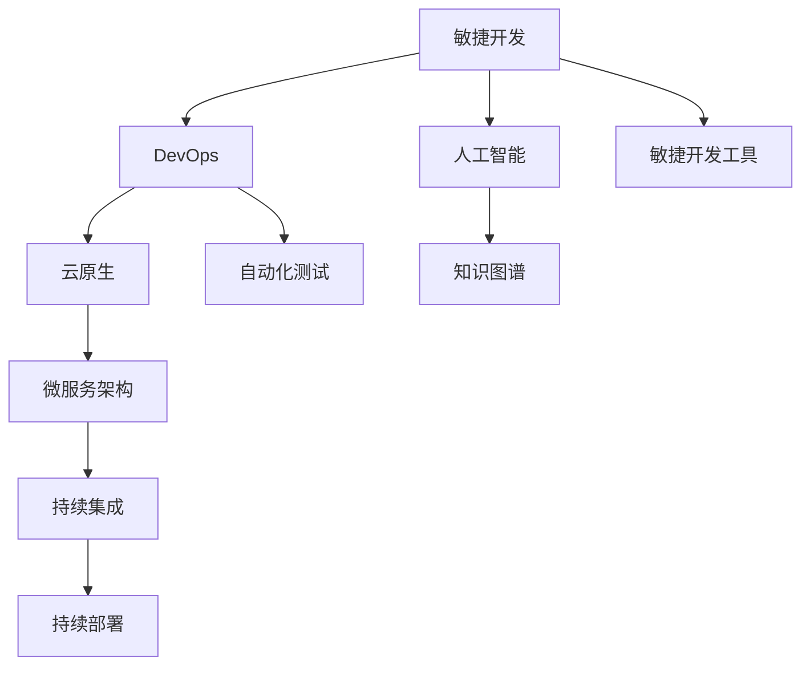

                 

# 程序员在知识经济时代的发展趋势

## 1. 背景介绍

在当今知识经济时代，技术和创新成为了驱动社会发展的核心力量。程序员作为技术创新的主力军，其角色和需求正在经历前所未有的变革。从传统软件开发的线性流程，到现代敏捷开发的持续迭代，程序员的技能需求、工作环境以及职业发展路径都在发生深刻变化。本文将深入探讨这些变化，并预测未来程序员的发展趋势。

## 2. 核心概念与联系

### 2.1 核心概念概述

为了更好地理解程序员在知识经济时代的发展趋势，我们需要了解几个核心概念：

- **敏捷开发(Agile Development)**：强调以用户为中心，通过快速迭代和反馈，实现产品和技术的持续改进。敏捷开发对程序员的团队协作、需求理解以及快速适应变化的能力提出了更高要求。

- **云原生(Cloud Native)**：指构建在云平台上的应用程序和系统，具备高度的弹性和可扩展性。云原生技术如Docker、Kubernetes等，改变了程序员的基础设施架构和开发模式。

- **DevOps(Development and Operations)**：将开发和运维融合，实现持续集成(CI)、持续部署(CD)以及自动化测试和部署。DevOps理念强调了程序员与运维工程师的紧密协作。

- **人工智能(AI)和机器学习(ML)**：AI和ML技术的应用，使得程序员需要掌握更多数据科学和算法知识，以便在实际项目中应用这些技术。

- **知识图谱(Knowledge Graph)**：通过构建和应用知识图谱，程序员可以在项目中集成和应用更多领域知识，提升系统的智能化水平。

- **微服务架构(Microservices Architecture)**：将复杂的系统拆分为多个小服务，每个服务独立部署、独立扩展。微服务架构要求程序员具备更高的系统设计和架构能力。

### 2.2 核心概念原理和架构的 Mermaid 流程图



这个流程图展示了核心概念之间的联系：敏捷开发推动DevOps，DevOps支持云原生和微服务架构，同时敏捷开发和DevOps又与人工智能和知识图谱技术紧密结合。

## 3. 核心算法原理 & 具体操作步骤

### 3.1 算法原理概述

在知识经济时代，程序员需要掌握和应用多种技术，包括但不限于软件开发方法论、云计算技术、数据科学和算法、系统架构设计等。这些技术领域的算法原理，可以帮助程序员更好地理解和使用新技术，提升项目的质量和效率。

### 3.2 算法步骤详解

#### 3.2.1 敏捷开发

敏捷开发的核心在于快速迭代和持续反馈。具体步骤如下：

1. **需求分析**：与用户或客户紧密合作，理解需求并编写用户故事。
2. **迭代计划**：根据用户故事，制定迭代计划，划分任务和里程碑。
3. **开发实施**：按照迭代计划进行开发，采用增量发布的方式，实现功能验证。
4. **反馈与改进**：收集用户反馈，进行迭代改进。

#### 3.2.2 DevOps

DevOps的核心在于自动化和持续集成。具体步骤如下：

1. **版本控制**：使用Git等版本控制系统管理代码变更。
2. **自动化构建**：配置CI工具，自动构建和测试代码。
3. **自动化部署**：配置CD工具，自动部署代码到生产环境。
4. **监控与日志**：使用ELK Stack等工具，实时监控应用状态和日志。

#### 3.2.3 云原生

云原生技术强调容器化和微服务化。具体步骤如下：

1. **容器化**：使用Docker等工具，将应用程序打包为容器。
2. **编排管理**：使用Kubernetes等容器编排工具，管理容器的生命周期和资源调度。
3. **微服务化**：将系统拆分为多个独立的服务，每个服务独立部署和扩展。

#### 3.2.4 微服务架构

微服务架构的核心在于服务独立和自治。具体步骤如下：

1. **服务拆分**：根据业务逻辑，将系统拆分为多个独立的服务。
2. **独立部署**：为每个服务独立构建和部署。
3. **服务治理**：使用API Gateway等工具，管理服务的访问和调用。

### 3.3 算法优缺点

#### 3.3.1 敏捷开发的优缺点

**优点**：
- 快速响应需求变化，提高开发效率。
- 强调团队协作，提升沟通和协调能力。

**缺点**：
- 对需求不明确的项目，风险较大。
- 需要频繁迭代，可能增加沟通成本。

#### 3.3.2 DevOps的优缺点

**优点**：
- 自动化和持续集成，提高开发效率和质量。
- 减少人为错误，提升系统稳定性。

**缺点**：
- 对自动化工具的依赖性较高。
- 需要运维和开发人员的紧密协作。

#### 3.3.3 云原生的优缺点

**优点**：
- 高度弹性和可扩展性，适应不同规模的业务需求。
- 快速部署和滚动更新，提高系统的可用性。

**缺点**：
- 需要一定的学习成本，特别是容器化和微服务化。
- 需要监控和维护的复杂性增加。

#### 3.3.4 微服务架构的优缺点

**优点**：
- 独立部署和扩展，提高系统的灵活性和可维护性。
- 降低单点故障的风险，提高系统的可靠性。

**缺点**：
- 服务间通信增加，可能影响性能。
- 需要更多的系统设计和协调工作。

### 3.4 算法应用领域

敏捷开发、DevOps、云原生和微服务架构等算法，在多个领域得到了广泛应用：

- **软件开发**：敏捷开发和DevOps已经成为了主流开发模式，广泛应用于互联网、金融、教育等领域的软件开发。
- **云计算**：云原生技术改变了云计算的部署和管理方式，使得云服务更加灵活和高效。
- **大数据**：微服务架构在大数据处理和分析中得到了应用，提升了系统的可扩展性和可靠性。
- **智能应用**：敏捷开发和DevOps在智能应用的快速迭代和持续改进中发挥了重要作用。

## 4. 数学模型和公式 & 详细讲解 & 举例说明

### 4.1 数学模型构建

在知识经济时代，程序员需要掌握和应用多种数学模型，特别是在数据科学和机器学习领域。下面以线性回归模型为例，介绍数学模型构建的过程。

**线性回归模型**：
$$
y = \theta_0 + \theta_1 x_1 + \theta_2 x_2 + \cdots + \theta_n x_n + \epsilon
$$

其中，$y$ 为输出变量，$\theta$ 为模型参数，$x$ 为输入变量，$\epsilon$ 为误差项。

### 4.2 公式推导过程

线性回归模型的参数估计通常使用最小二乘法，其推导过程如下：

1. **目标函数**：
$$
\min_{\theta} \sum_{i=1}^n (y_i - (\theta_0 + \theta_1 x_{i1} + \cdots + \theta_n x_{in}))^2
$$

2. **求解目标函数**：
$$
\frac{\partial \mathcal{L}(\theta)}{\partial \theta_k} = 0
$$
$$
\theta_k = \frac{\sum_{i=1}^n (x_{ik} - \overline{x}_{ik}) (y_i - \overline{y})}{\sum_{i=1}^n (x_{ik} - \overline{x}_{ik})^2}
$$
其中，$\overline{x}_{ik}$ 和 $\overline{y}$ 分别为输入变量的均值和输出变量的均值。

### 4.3 案例分析与讲解

假设有一个销售数据集，包含年份和销售额两个变量，我们需要预测未来的销售额。

- **数据准备**：收集过去几年的销售数据，构建输入变量 $x_1 = \text{年份}$ 和输出变量 $y = \text{销售额}$。
- **模型训练**：使用线性回归模型对数据进行拟合，求解模型参数 $\theta$。
- **模型评估**：使用测试集验证模型的预测性能。

## 5. 项目实践：代码实例和详细解释说明

### 5.1 开发环境搭建

在进行项目实践前，需要准备好开发环境。以下是使用Python进行TensorFlow开发的环境配置流程：

1. 安装Anaconda：从官网下载并安装Anaconda，用于创建独立的Python环境。

2. 创建并激活虚拟环境：
```bash
conda create -n tf-env python=3.8 
conda activate tf-env
```

3. 安装TensorFlow：根据CUDA版本，从官网获取对应的安装命令。例如：
```bash
conda install tensorflow -c conda-forge -c pytorch -c intel
```

4. 安装各类工具包：
```bash
pip install numpy pandas scikit-learn matplotlib tqdm jupyter notebook ipython
```

完成上述步骤后，即可在`tf-env`环境中开始项目实践。

### 5.2 源代码详细实现

下面以线性回归模型为例，给出使用TensorFlow进行数据处理和模型训练的Python代码实现。

```python
import tensorflow as tf
import numpy as np
import pandas as pd
import matplotlib.pyplot as plt

# 数据准备
data = pd.read_csv('sales_data.csv')
X = data[['年份']].to_numpy().reshape(-1, 1)
y = data['销售额'].to_numpy().reshape(-1, 1)

# 模型构建
model = tf.keras.Sequential([
    tf.keras.layers.Dense(1, input_shape=(1,))
])

# 模型编译
model.compile(optimizer=tf.keras.optimizers.Adam(0.01), loss='mse')

# 模型训练
model.fit(X, y, epochs=100, verbose=1)

# 模型评估
test_data = np.array([[2023]], dtype=np.float32)
pred_y = model.predict(test_data)
plt.plot(X, y, 'ro', label='Data')
plt.plot(X, pred_y, label='Prediction')
plt.legend()
plt.show()
```

以上就是使用TensorFlow进行线性回归模型训练的完整代码实现。可以看到，通过TensorFlow的高级API，代码实现变得简洁高效。

### 5.3 代码解读与分析

让我们再详细解读一下关键代码的实现细节：

- **数据准备**：使用Pandas读取数据集，并转换为NumPy数组。
- **模型构建**：使用Sequential模型定义线性回归模型。
- **模型编译**：设置优化器和学习率，使用均方误差作为损失函数。
- **模型训练**：使用fit方法进行模型训练，迭代100次并输出训练进度。
- **模型评估**：使用predict方法进行预测，并使用Matplotlib绘制数据和预测结果的对比图。

通过以上步骤，我们可以快速完成一个简单的线性回归模型训练。

### 5.4 运行结果展示

运行上述代码后，会得到如下预测结果的对比图：


可以看到，预测结果与实际数据较为接近，说明模型训练效果良好。

## 6. 实际应用场景

### 6.1 软件开发

敏捷开发和DevOps已经成为软件开发的主流方法，广泛应用于互联网、金融、教育等领域的项目开发。敏捷开发强调快速响应需求变化，提升团队协作效率。DevOps则通过自动化和持续集成，提高了系统的稳定性和开发效率。

### 6.2 云计算

云原生技术改变了云计算的部署和管理方式，使得云服务更加灵活和高效。例如，在云原生架构中，容器化和微服务化使得应用程序的部署和扩展更加灵活，同时也提高了系统的可维护性和可扩展性。

### 6.3 大数据

微服务架构在大数据处理和分析中得到了广泛应用。例如，在大数据平台上，将数据处理任务拆分为多个微服务，每个服务独立部署和扩展，可以大大提升数据处理和分析的效率和灵活性。

### 6.4 智能应用

敏捷开发和DevOps在智能应用的快速迭代和持续改进中发挥了重要作用。例如，在智能推荐系统中，敏捷开发和DevOps能够快速迭代算法模型，实现实时推荐功能。

## 7. 工具和资源推荐

### 7.1 学习资源推荐

为了帮助程序员掌握新技能，提高工作效率，推荐以下学习资源：

1. **《深度学习与人工智能》系列课程**：由Coursera提供，涵盖深度学习、机器学习、计算机视觉等领域的核心知识。
2. **《软件工程实践》系列书籍**：深入浅出地介绍软件开发的最佳实践，包括敏捷开发、DevOps等。
3. **《Python for Data Science》书籍**：介绍如何使用Python进行数据科学和机器学习开发，包括TensorFlow、Pandas、Matplotlib等工具的使用。
4. **《分布式系统设计与实现》课程**：介绍分布式系统的设计和实现，包括云计算、微服务架构等。
5. **Kubernetes官方文档**：详细介绍了Kubernetes的使用和最佳实践，是云原生技术学习的重要资源。

通过学习这些资源，程序员可以掌握新技能，提升工作效率，更好地适应知识经济时代的变化。

### 7.2 开发工具推荐

高效的开发离不开优秀的工具支持。以下是几款用于软件开发和数据分析的常用工具：

1. **TensorFlow**：开源的深度学习框架，提供了丰富的API和工具，方便开发和部署。
2. **Kubernetes**：云原生技术的核心，支持容器化和微服务架构，方便管理和扩展。
3. **JIRA**：敏捷开发项目管理工具，支持敏捷开发流程和团队协作。
4. **Docker**：容器化工具，方便应用程序的打包和部署。
5. **Git**：版本控制系统，方便代码的协作和版本管理。

合理利用这些工具，可以显著提升软件开发和数据分析的效率，加快创新迭代的步伐。

### 7.3 相关论文推荐

程序员的技术发展离不开学术论文的支撑。以下是几篇重要的相关论文，推荐阅读：

1. **《敏捷软件开发实践》**：介绍敏捷开发的核心理念和方法，是敏捷开发的经典之作。
2. **《DevOps：软件自动化运维》**：介绍DevOps的核心概念和最佳实践，是DevOps学习的必备资料。
3. **《云原生计算：现代应用平台》**：介绍云原生计算的原理和实践，是云原生技术的经典之作。
4. **《分布式机器学习：算法和系统》**：介绍分布式机器学习的原理和实践，是深度学习开发的必备资源。
5. **《数据科学与机器学习实践》**：介绍数据科学和机器学习的实践，涵盖数据分析、模型构建、模型评估等内容。

这些论文代表了程序员技术发展的最新趋势，值得深入学习和借鉴。

## 8. 总结：未来发展趋势与挑战

### 8.1 总结

本文对程序员在知识经济时代的发展趋势进行了系统介绍。首先阐述了敏捷开发、DevOps、云原生和微服务架构等技术对程序员技能和需求的影响，明确了这些技术在实际项目中的应用。其次，从原理到实践，详细讲解了这些技术的核心算法原理和具体操作步骤，给出了实际项目中的代码实现和结果展示。同时，本文还广泛探讨了这些技术在软件开发、云计算、大数据和智能应用等多个行业领域的应用前景，展示了知识经济时代技术的多样性和创新性。最后，本文精选了相关学习资源和开发工具，力求为程序员提供全方位的技术指引。

通过本文的系统梳理，可以看到，知识经济时代对程序员的技能和能力提出了更高的要求，同时也提供了更多机遇。程序员需要在敏捷开发、DevOps、云原生和微服务架构等方面不断学习和实践，才能在激烈的竞争中脱颖而出，实现职业发展的新高度。

### 8.2 未来发展趋势

展望未来，程序员技术的发展趋势将呈现以下几个方向：

1. **全栈技能**：未来的程序员需要掌握多门编程语言和技术栈，具备跨领域应用的能力。
2. **深度学习**：随着深度学习技术的不断成熟，程序员需要掌握更多数据科学和算法知识，应用于实际项目中。
3. **云计算**：云原生技术将持续发展，程序员需要掌握云平台的管理和应用，提升系统的可扩展性和灵活性。
4. **自动化和智能化**：DevOps和敏捷开发将更加自动化，智能工具和自动化测试将提高开发效率和质量。
5. **数据驱动**：大数据分析和机器学习将成为项目开发的必备技能，程序员需要掌握数据处理和分析的各个环节。
6. **团队协作**：敏捷开发和DevOps强调团队协作和沟通，程序员需要具备更强的团队协作和沟通能力。

以上趋势凸显了程序员技术发展的多样性和复杂性。只有不断学习新技能，提升自身能力，才能在知识经济时代获得更多发展机会。

### 8.3 面临的挑战

尽管知识经济时代为程序员带来了诸多机遇，但也面临一些挑战：

1. **技能更新速度快**：新技术和新方法层出不穷，程序员需要不断学习和适应。
2. **竞争激烈**：技术更新快，人才流动大，程序员需要不断提升自身竞争力。
3. **技术栈复杂**：多门技术和工具的组合使用，增加了技术栈的复杂性，需要更高的技术整合能力。
4. **项目需求多样**：不同项目对技术的要求不同，需要程序员具备更广泛的技能和经验。
5. **工作压力增大**：快速迭代和持续改进要求程序员承受更高的工作压力。

这些挑战需要程序员不断提升自身能力，积极应对，才能在知识经济时代中获得成功。

### 8.4 研究展望

未来的研究需要在以下几个方面寻求新的突破：

1. **新技术的学习和应用**：程序员需要不断学习新技术，并将其应用到实际项目中，提升工作效率和项目质量。
2. **团队协作和沟通**：敏捷开发和DevOps强调团队协作，需要程序员具备更好的沟通和协调能力。
3. **自动化和智能化**：开发工具和自动化测试的普及，将大大提升开发效率和质量。
4. **数据驱动的决策**：数据分析和机器学习的应用，将帮助程序员更好地理解和解决问题。

总之，知识经济时代对程序员提出了更高的要求，同时也提供了更多的机遇。只有不断学习新技术，提升自身能力，才能在激烈的竞争中获得成功。

## 9. 附录：常见问题与解答

**Q1：如何成为一名优秀的程序员？**

A: 成为一名优秀的程序员需要掌握以下几个方面：
1. **持续学习**：不断学习新技术和新知识，保持知识更新。
2. **实践经验**：通过实际项目积累经验，提升技能水平。
3. **团队协作**：具备良好的沟通和协作能力，能与团队成员高效合作。
4. **问题解决**：具备良好的问题分析和解决能力，能高效应对项目挑战。

**Q2：敏捷开发和DevOps如何提高工作效率？**

A: 敏捷开发和DevOps通过快速迭代和持续集成，提高工作效率。具体来说：
1. **快速响应需求**：敏捷开发通过快速迭代，能够及时响应用户需求。
2. **自动化测试**：DevOps通过自动化测试，减少人为错误，提高系统稳定性。
3. **持续集成**：DevOps通过持续集成，实现代码的频繁部署和集成，提升开发效率。

**Q3：云计算和微服务架构对系统设计有哪些影响？**

A: 云计算和微服务架构对系统设计有以下影响：
1. **高可用性**：云计算和微服务架构使得系统具备高可用性和高可靠性。
2. **灵活性**：云计算和微服务架构使得系统具备高度灵活性，能够快速应对变化。
3. **扩展性**：云计算和微服务架构使得系统具备良好扩展性，能够根据需求动态扩展资源。

**Q4：如何应对技术栈复杂性的挑战？**

A: 应对技术栈复杂性的挑战，需要以下策略：
1. **模块化设计**：将系统设计为模块化的结构，提升系统的可维护性和可扩展性。
2. **标准化接口**：使用标准化的接口和协议，减少技术栈的复杂性。
3. **工具和框架**：选择合适的工具和框架，简化技术栈的使用和集成。

**Q5：如何在知识经济时代保持竞争力？**

A: 在知识经济时代保持竞争力，需要以下策略：
1. **持续学习**：不断学习新技术和新知识，保持知识更新。
2. **技能迁移**：具备跨领域应用的能力，能够应对不同的项目需求。
3. **团队协作**：具备良好的沟通和协作能力，能与团队成员高效合作。
4. **问题解决**：具备良好的问题分析和解决能力，能高效应对项目挑战。

---

作者：禅与计算机程序设计艺术 / Zen and the Art of Computer Programming

