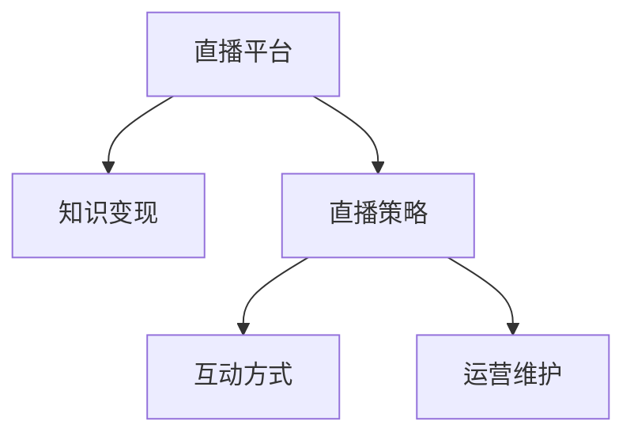

                 

# 程序员如何利用直播平台进行知识变现

## 1. 背景介绍

### 1.1 问题由来
在互联网高度发展的今天，程序员作为IT行业的重要力量，其知识和技能的需求日益增长。同时，直播平台的兴起，为程序员提供了一个全新的知识变现渠道。通过直播，程序员可以将自己的技术经验、项目经验、行业见解等内容分享出去，与广大观众互动交流，从而实现知识变现。

然而，许多程序员对如何利用直播平台进行知识变现还处于迷茫状态，不知道如何高效地搭建直播平台，制定直播策略，以及进行后续的运营维护。本文将从核心概念、核心算法、具体操作步骤等方面深入探讨程序员如何利用直播平台进行知识变现。

## 2. 核心概念与联系

### 2.1 核心概念概述

为更好地理解如何利用直播平台进行知识变现，本节将介绍几个关键概念：

- 直播平台（Live Streaming Platform）：如Bilibili、Youtube、Twitch等，提供实时视频传输和互动功能。
- 知识变现（Knowledge Monetization）：将自身的知识、技能、经验转化为经济效益的过程。
- 直播策略（Live Strategy）：包括确定直播内容、时间、互动方式等，是知识变现的关键因素。
- 互动方式（Interactive Methods）：如观众提问、实时讨论、赠品抽奖等，增强观众参与感。
- 运营维护（Operational and Maintenance）：包括直播平台的账号管理、内容更新、观众关系维护等，是知识变现的持续保障。

这些概念之间通过直播平台这一桥梁相连，共同构成了一个完整的知识变现系统。

### 2.2 核心概念原理和架构的 Mermaid 流程图



## 3. 核心算法原理 & 具体操作步骤

### 3.1 算法原理概述

利用直播平台进行知识变现的算法原理，本质上是一种实时内容分发和互动的策略优化过程。核心目标是通过选择合适的直播内容、时间、互动方式和运营策略，最大化观众的参与度和直播的商业价值。

### 3.2 算法步骤详解

**Step 1: 选择直播内容**

- 确定直播主题：根据自身技术背景和市场趋势，选择热门或兴趣点。如深度学习、机器学习、前端开发、算法等。
- 规划直播流程：如技术讲解、项目演示、答疑互动、实战演练等。
- 准备直播素材：如PPT、代码、实验环境、实验数据等。

**Step 2: 确定直播时间**

- 分析观众活跃时间：利用直播平台提供的数据分析功能，确定目标观众的活跃时间段。
- 安排直播时段：选择时段覆盖受众面最广的时间，如工作日晚上或周末下午。
- 设置直播频率：根据内容生产和维护能力，合理规划直播频率，保持观众稳定参与。

**Step 3: 设计互动方式**

- 观众提问：实时解答观众问题，增加互动性。
- 实时讨论：利用聊天室功能，鼓励观众讨论，形成社区氛围。
- 赠品抽奖：通过赠品和抽奖，激发观众参与和互动。

**Step 4: 执行直播**

- 测试设备和技术：保证直播设备稳定，网络连接顺畅。
- 调试直播内容：检查代码、数据、环境等，确保内容完整无误。
- 开始直播：启动直播软件，调整摄像头、麦克风等设备，进行试播和互动。

**Step 5: 运营和维护**

- 账号管理：定期更新账号信息，保持良好互动，提高账号权重。
- 内容更新：持续更新直播内容，保持观众兴趣，定期引入新技术和新知识。
- 观众关系维护：建立观众微信群或QQ群，及时回应观众问题，形成良好的社区关系。

### 3.3 算法优缺点

利用直播平台进行知识变现的主要优点包括：

- 实时互动：通过实时直播，可以与观众进行高效互动，增加互动性和参与度。
- 多元化收入：通过直播、打赏、课程销售、广告等多种方式实现知识变现。
- 快速积累经验：直播平台提供了大量的数据分析功能，程序员可以迅速积累观众反馈和互动数据。

但直播平台变现也存在一些缺点：

- 需要高流量：直播平台的流量引入需要时间，前期积累观众较难。
- 需要持续内容更新：直播内容需要不断更新，才能保持观众兴趣。
- 技术门槛较高：需要掌握视频编码、直播平台API等技术，对程序员有一定挑战。

### 3.4 算法应用领域

直播平台变现主要应用于以下几个领域：

- 技术培训：程序员通过直播平台分享自己的技术经验，如编码技巧、项目实战、问题解决等。
- 项目展示：程序员可以将自己的项目进行直播演示，展示项目成果，吸引投资者。
- 知识普及：程序员可以讲解深度学习、机器学习、人工智能等知识，普及科学知识。
- 技术咨询：程序员可以通过直播平台提供技术咨询，帮助观众解决技术难题。

## 4. 数学模型和公式 & 详细讲解 & 举例说明

### 4.1 数学模型构建

假设直播平台有 $N$ 个观众，直播时长为 $T$ 分钟。设直播内容价值为 $V$，观众互动价值为 $I$，观众付费价值为 $P$。利用数学模型构建观众价值评估模型，目标是最大化 $V+I+P$。

定义观众价值函数为 $F(N, T, V, I, P)$，则有：

$$
F(N, T, V, I, P) = V \cdot N \cdot T + I \cdot N \cdot T + P \cdot N \cdot T
$$

### 4.2 公式推导过程

观众互动价值和付费价值可以通过直播平台提供的数据进行统计，如实时互动次数、付费用户数、交易金额等。互动价值和付费价值与观众价值之间存在一定的正相关关系，因此可以建立以下公式：

$$
I = \alpha \cdot V \quad \text{(互动价值与内容价值成正比)}
$$

$$
P = \beta \cdot V \quad \text{(付费价值与内容价值成正比)}
$$

其中 $\alpha$ 和 $\beta$ 为比例系数，取决于直播内容的质量和观众的付费意愿。

通过以上推导，观众价值函数可以表示为：

$$
F(N, T, V, I, P) = V \cdot N \cdot T + \alpha \cdot V \cdot N \cdot T + \beta \cdot V \cdot N \cdot T
$$

### 4.3 案例分析与讲解

某程序员选择使用Bilibili平台进行直播，预计每次直播30分钟，直播内容价值 $V=500$ 元，观众互动价值与内容价值成正比，即 $\alpha=0.5$。设每次直播平均吸引 $N=100$ 名观众，观众的付费意愿为 $\beta=0.2$。

每次直播观众价值为：

$$
F(N, T, V, I, P) = 500 \cdot 100 \cdot 30 + 0.5 \cdot 500 \cdot 100 \cdot 30 + 0.2 \cdot 500 \cdot 100 \cdot 30
$$

计算可得每次直播观众价值为 $45000$ 元。

## 5. 项目实践：代码实例和详细解释说明

### 5.1 开发环境搭建

在搭建直播平台开发环境前，需要准备以下工具和资源：

- 直播平台账号：选择合适的直播平台并申请账号。
- 直播设备：准备高性能计算机、麦克风、摄像头等直播设备。
- 编程环境：安装Python、TensorFlow、OpenCV等工具。
- 直播软件：选择合适的直播软件，如OBS Studio、FFMPEG等。

### 5.2 源代码详细实现

以下是使用Python和TensorFlow进行直播平台开发的示例代码：

```python
import tensorflow as tf
import cv2

# 初始化TensorFlow环境
tf.compat.v1.enable_eager_execution()

# 加载模型
model = tf.keras.models.load_model('model.h5')

# 加载摄像头设备
cap = cv2.VideoCapture(0)

# 开启直播
while True:
    # 读取摄像头图像
    ret, frame = cap.read()
    if not ret:
        break
    
    # 预处理图像
    processed_frame = preprocess(frame)
    
    # 运行模型并获取输出
    output = model.predict(processed_frame)
    
    # 将输出转换为文字显示
    display_text = show_text(output)
    
    # 显示直播画面
    cv2.imshow('Live Streaming', processed_frame)
    
    # 判断是否退出
    if cv2.waitKey(1) & 0xFF == ord('q'):
        break

# 关闭摄像头和显示窗口
cap.release()
cv2.destroyAllWindows()
```

### 5.3 代码解读与分析

在上述代码中，我们使用了TensorFlow进行模型部署和数据处理。首先，通过`tf.keras.models.load_model`加载预先训练好的模型。然后，通过`cv2.VideoCapture`读取摄像头数据，并进行预处理。接着，将预处理后的数据输入模型进行预测，并将输出转换为文字显示。最后，使用`cv2.imshow`展示直播画面，并使用`cv2.waitKey`检测是否退出直播。

### 5.4 运行结果展示

在运行上述代码后，将可以看到实时直播的画面，同时底部显示模型预测的文字结果。直播画面和文字结果的同步展示，可以增加观众的互动性和参与感，提升直播效果。

## 6. 实际应用场景

### 6.1 技术培训

在技术培训方面，程序员可以针对某一项新技术或算法进行直播讲解。例如，讲解Python编程、机器学习模型、深度学习框架等。在直播中，可以结合实际项目演示代码运行，回答观众问题，分享项目经验。通过这种方式，程序员可以迅速积累观众和粉丝，扩大影响力，进行后续的变现。

### 6.2 项目展示

项目展示直播可以帮助程序员吸引潜在投资者和合作伙伴。在直播中，可以详细讲解项目背景、实现技术、关键点、创新点等，并展示项目成果。通过互动问答，可以进一步了解观众的反馈和需求，进行后续优化和改进。此外，项目展示直播还可以作为职业履历的一部分，提升程序员的行业声誉。

### 6.3 知识普及

在知识普及方面，程序员可以利用直播平台传播科学知识和前沿技术，普及人工智能、大数据、区块链等热门技术。例如，讲解深度学习的基本概念、算法原理、应用场景等。在直播中，可以结合实例进行演示和分析，增加观众的理解和兴趣。通过这种方式，程序员可以传播科学知识，推广新技术，扩大受众面。

### 6.4 技术咨询

技术咨询直播可以为程序员提供一个展示专业技能和解决实际问题的平台。例如，讲解如何解决代码bug、优化算法性能、设计系统架构等。在直播中，可以与观众互动，解答问题，提供个性化解决方案。通过这种方式，程序员可以建立技术咨询品牌，吸引更多粉丝和客户。

## 7. 工具和资源推荐

### 7.1 学习资源推荐

为了帮助程序员掌握直播平台变现的技能，这里推荐一些优质的学习资源：

- Coursera《网络编程与大数据》课程：由计算机科学专家主讲，系统讲解网络编程和数据分析的基础知识。
- Udacity《深度学习基础》课程：介绍深度学习的基本概念、算法、模型等，适合入门学习和进阶提升。
- YouTube《技术博客》频道：由多位知名程序员和专家主讲，分享技术经验、项目实战、行业见解等，提供丰富的学习资源。
- GitHub《开源项目》：提供大量开源项目代码和文档，参考开源项目进行学习和实践，提升技术能力。

### 7.2 开发工具推荐

选择合适的开发工具，可以大大提升直播平台变现的效率。以下是几款推荐的开发工具：

- OBS Studio：开源直播软件，功能强大，支持多平台直播。
- FFMPEG：开源多媒体框架，支持视频编码、直播传输等。
- Visual Studio Code：开源IDE，支持Python、TensorFlow等工具，方便进行直播软件开发。
- StreamLabs：直播平台官方插件，支持互动方式定制、观众管理等功能。

### 7.3 相关论文推荐

直播平台变现的相关论文，可以帮助程序员更深入地理解技术原理和实现方法：

- "Real-time Video Streaming: A Survey"：全面介绍实时视频流技术，包括网络传输、流媒体协议等。
- "Interactive Learning via Live Streaming"：利用直播平台进行互动学习的研究，提出实时反馈和个性化推荐等算法。
- "Monetization of Online Content"：讨论在线内容变现的多种方式，包括广告、付费订阅、知识付费等。
- "Building a Live Streaming App"：介绍直播平台应用开发的技术要点，包括视频编码、流媒体传输等。

## 8. 总结：未来发展趋势与挑战

### 8.1 总结

本文详细探讨了程序员如何利用直播平台进行知识变现的方法。通过系统介绍直播平台的知识变现原理、关键概念、操作步骤等，帮助程序员更好地利用直播平台，实现知识变现。通过具体的案例分析和代码实现，展示了直播平台变现的实际效果和应用场景，为程序员提供了实用的指导。

通过本文的系统梳理，可以看到，直播平台为程序员提供了一个全新的知识变现渠道，显著提升了程序员的知识传播效率和收益。未来，随着直播平台技术的不断进步和内容多样化的发展，直播平台变现将更加广泛地应用到程序员的职业发展和创业中。

### 8.2 未来发展趋势

展望未来，直播平台变现将呈现以下几个发展趋势：

1. 内容多样化：直播内容将更加多样化，涵盖技术培训、项目展示、知识普及、技术咨询等多个方面。
2. 互动方式多样化：通过VR、AR等新技术，增强观众的互动体验。
3. 直播平台集成：直播平台将与更多社交平台、学习平台、视频平台集成，提供一站式服务。
4. 多渠道变现：利用直播、打赏、课程销售、广告等多种渠道实现变现，提升经济效益。
5. 数据驱动变现：利用数据分析和用户画像，精准推荐内容，增加观众粘性和参与度。

这些趋势展示了直播平台变现的广阔前景，未来直播平台变现将更加智能、高效、多样。

### 8.3 面临的挑战

尽管直播平台变现带来了诸多便利和收益，但在实际应用过程中，也面临一些挑战：

1. 观众维护难度：观众的维护和粘性提升需要更多的时间和精力。
2. 内容质量要求高：高质量的内容才能吸引更多观众，提升变现效率。
3. 竞争激烈：直播平台和主播数量众多，竞争激烈，需要持续创新和优化。
4. 技术门槛高：直播平台变现需要掌握视频编码、流媒体传输等技术，对程序员有一定的要求。
5. 数据隐私问题：直播平台涉及大量的用户数据，数据隐私和安全问题需要重视。

### 8.4 研究展望

未来的直播平台变现研究需要在以下几个方面寻求新的突破：

1. 自动化内容生成：通过AI技术，自动生成直播内容，提升内容生产效率。
2. 个性化推荐系统：利用机器学习算法，根据观众行为和兴趣，精准推荐直播内容。
3. 社交互动技术：利用社交网络分析技术，增强观众之间的互动和社区感。
4. 视频编辑技术：利用深度学习技术，自动化视频编辑和特效处理，提升观众体验。
5. 隐私保护技术：利用加密和匿名化技术，保护用户隐私和数据安全。

这些研究方向的探索，将进一步提升直播平台变现的技术水平和应用效果，推动直播平台变现向更高层次发展。

## 9. 附录：常见问题与解答

**Q1: 直播平台如何实现实时互动？**

A: 直播平台利用WebSocket技术实现实时互动。观众通过WebSocket协议发送消息，直播平台接收到消息后，即时转发给主播和其他观众。主播可以通过聊天室功能，与观众进行实时交流。

**Q2: 如何选择直播平台？**

A: 选择直播平台需要考虑以下几个因素：
1. 平台用户基数：用户基数越大，曝光率越高。
2. 平台技术能力：技术能力越强，平台稳定性越高。
3. 平台收费标准：收费标准越合理，性价比越高。
4. 平台社区氛围：社区氛围越活跃，观众互动性越强。

**Q3: 如何提高直播观众的粘性？**

A: 提高直播观众的粘性需要多方面的努力：
1. 提供高质量内容：内容质量越高，观众粘性越高。
2. 增加互动环节：通过提问、讨论、抽奖等方式增加观众互动性。
3. 建立社区关系：建立观众微信群或QQ群，进行互动交流。
4. 定期更新内容：定期更新直播内容，保持观众兴趣。

**Q4: 如何选择合适的直播设备？**

A: 选择合适的直播设备需要考虑以下几个因素：
1. 设备性能：高性能计算机和摄像头能够提供更好的直播效果。
2. 设备稳定性：设备稳定性越高，直播效果越好。
3. 设备兼容性：设备需要兼容直播平台和浏览器，确保顺利直播。
4. 设备价格：设备价格需要符合预算，但性能不能过低。

**Q5: 如何进行直播内容分发？**

A: 直播内容分发需要利用直播平台的API接口进行数据传输。具体步骤如下：
1. 注册直播平台账号，获取API密钥。
2. 在直播平台页面设置直播房间，获取房间ID。
3. 通过API接口将直播内容发送到指定房间。
4. 实时接收观众反馈，调整直播内容。

通过本文的系统梳理，程序员可以更好地利用直播平台进行知识变现，最大化自身的技术价值和收益。未来，随着技术的不断进步和应用的广泛拓展，直播平台变现将带来更多新的可能和机会，推动程序员职业发展的进一步深化。总之，直播平台变现需要技术、策略和运营等多方面的共同努力，才能取得理想的效果。

