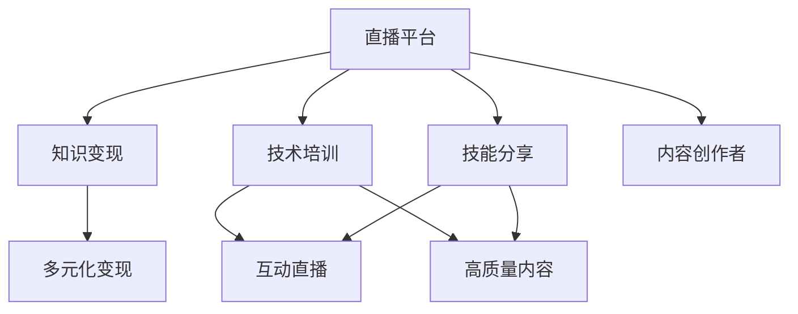

                 

# 程序员如何利用直播平台进行知识变现

> 关键词：直播平台,知识变现,程序员,编程技巧,软件开发,技术培训,在线课程,视频平台,技能提升,技能分享

## 1. 背景介绍

### 1.1 问题由来
近年来，随着互联网的快速发展和数字经济的兴起，越来越多的人开始关注通过互联网进行知识和技能变现的途径。尤其是对于一些具有专业技能的人士，如程序员、数据科学家、工程师等，如何将自身的专业知识和技术转化为实际收入，成为了一个热门话题。传统的方式来获取知识变现的机会包括编写技术书籍、发表技术文章、参加技术讲座或培训等。然而，这些方式往往受限于时间和空间的限制，难以大规模普及。

直播平台的兴起为程序员提供了新的知识变现渠道。通过直播，程序员可以实时与观众互动，分享自己的编程技巧、软件开发经验、技术培训课程等。这种实时、互动、低成本的交流方式，使得程序员的知识变现变得更加灵活和高效。

### 1.2 问题核心关键点
直播平台知识变现的核心在于如何利用直播技术，将程序员的专业知识和技能以一种易于理解、易于接受的方式呈现给观众，从而吸引观众的注意力，增加粉丝的互动和支持，最终实现知识和技能的变现。

关键点包括：
- 选择合适的直播平台：不同直播平台的特性和用户群体不同，选择合适的平台可以更有效地覆盖目标受众。
- 准备高质量的内容：高质量的直播内容能够吸引更多的观众，增加观众的留存率和互动率。
- 互动和反馈：通过与观众的实时互动，收集反馈，不断优化和改进直播内容和形式。
- 多元化变现方式：除了直接的打赏和订阅，还可以通过商品销售、课程销售、广告合作等多种方式实现变现。

## 2. 核心概念与联系

### 2.1 核心概念概述

为了更好地理解程序员如何利用直播平台进行知识变现，本节将介绍几个密切相关的核心概念：

- **直播平台**：指的是通过互联网进行实时音频、视频传输，支持观众实时互动的在线平台。目前流行的直播平台包括但不限于B站、抖音、腾讯直播等。
- **知识变现**：指的是将个人的专业知识、技能、经验等转化为实际收入的过程。可以是直接通过直播平台打赏、订阅，也可以是通过商品销售、课程销售等方式变现。
- **技术培训**：通过直播平台，向观众提供专业的编程技巧、软件开发方法、新技术讲解等培训内容，帮助观众提升技能。
- **技能分享**：分享自己在软件开发、编程中的经验、心得、教训，帮助观众少走弯路，提升工作效率。
- **互动直播**：直播平台上的互动功能，如实时评论、连麦、点赞等，可以增强观众的参与感和互动性。
- **内容创作者**：在直播平台上进行内容创作，分享知识、技能，并希望通过观众的支持和打赏实现知识变现的个人或组织。

这些核心概念之间的逻辑关系可以通过以下Mermaid流程图来展示：



这个流程图展示了这个系统的主要流程：

1. 直播平台作为知识变现的媒介，为内容创作者提供展示和互动的场所。
2. 技术培训和技能分享作为直播内容的核心，帮助观众提升技能，满足观众的学习需求。
3. 互动直播增强观众的参与感和互动性，提高直播效果。
4. 内容创作者通过高质量的内容吸引观众，获得观众的支持和变现机会。
5. 多元化变现方式提供更多的变现途径，增加内容创作者的收入来源。

## 3. 核心算法原理 & 具体操作步骤
### 3.1 算法原理概述

程序员利用直播平台进行知识变现的过程，本质上是一个内容创作和互动反馈的循环过程。其核心思想是通过直播平台实时传输技术培训、技能分享等内容，并通过观众的互动和反馈，不断优化和改进直播内容和形式，实现知识变现。

### 3.2 算法步骤详解

基于上述核心思想，直播平台知识变现的大致步骤如下：

**Step 1: 选择合适的直播平台**
- 根据目标受众和直播内容类型，选择合适的直播平台。如B站适合技术和编程类直播，抖音适合短视频分享等。
- 了解平台的规则和特性，确保内容符合平台的要求。

**Step 2: 准备直播内容**
- 确定直播主题和内容，如编程技巧、软件开发、技术培训等。
- 设计互动环节，如实时问答、代码演示等，增强观众的参与感。
- 提前准备高质量的内容素材，如演示代码、讲解视频等。

**Step 3: 进行直播互动**
- 选择合适的直播时间和时长，确保能覆盖目标观众。
- 实时与观众互动，解答观众的问题，收集观众的反馈。
- 根据观众的反馈，调整和改进直播内容和形式。

**Step 4: 多元化变现**
- 利用平台的变现工具，如打赏、订阅、课程销售等，实现直接变现。
- 通过商品销售、广告合作等方式，实现间接变现。
- 持续优化直播内容和变现方式，提升变现效果。

### 3.3 算法优缺点

直播平台知识变现方法具有以下优点：
1. 实时互动性强：观众可以实时与内容创作者互动，增加互动性和参与感。
2. 灵活性高：直播内容可以根据观众的反馈进行调整，适应性强。
3. 覆盖面广：直播平台拥有庞大的用户群体，能覆盖更多的观众。
4. 低成本：相比于传统的培训课程和讲座，直播的成本较低。
5. 变现方式多样：除了直接的打赏和订阅，还可以通过多种方式实现变现。

同时，该方法也存在一定的局限性：
1. 对技术要求高：直播过程中需要保证网络稳定、设备正常，否则会影响观众体验。
2. 对内容质量要求高：内容质量不高可能会吸引不到观众，影响变现效果。
3. 时间和精力投入大：内容创作和直播互动需要花费大量的时间和精力。
4. 观众质量难以控制：观众质量参差不齐，有些观众可能会带有恶意攻击或干扰直播。
5. 变现效果不稳定：观众的互动和支持是变现的基础，受到观众情绪和环境的影响较大。

尽管存在这些局限性，但就目前而言，直播平台知识变现方法仍是一种高效、灵活、易于操作的知识变现方式。未来相关研究的重点在于如何进一步优化直播内容和互动方式，提高变现效果，同时兼顾内容质量和观众体验。

### 3.4 算法应用领域

直播平台知识变现方法在软件开发、编程技巧、技术培训、技能分享等多个领域得到了广泛应用。以下是几个具体的应用场景：

- **软件开发**：程序员可以通过直播平台分享自己的软件开发经验和技巧，帮助其他程序员提升工作效率和质量。
- **技术培训**：程序员可以开设技术培训课程，通过直播教授编程语言、框架、工具等技术知识，帮助观众提升技术水平。
- **技能分享**：程序员可以分享自己在软件开发中的经验、心得、教训，帮助观众少走弯路，提升工作效率。
- **问题解答**：程序员可以通过直播平台实时解答观众在编程、开发中遇到的问题，帮助观众解决问题。
- **技术社区建设**：程序员可以通过直播平台建立技术社区，与观众进行深度交流，分享自己的技术见解和观点，提升社区的活跃度和影响力。

这些应用场景展示了直播平台知识变现方法的强大潜力和广泛适用性，为程序员的知识变现提供了多样化的选择。

## 4. 数学模型和公式 & 详细讲解 & 举例说明
### 4.1 数学模型构建

直播平台知识变现的数学模型可以抽象为一个观众参与度模型。设观众总数为 $N$，在直播过程中，观众的参与度可以用以下几个指标来衡量：
- $P$：观众在线时间占总直播时间的比例。
- $R$：观众的互动次数（如点赞、评论、提问等）。
- $C$：观众的打赏金额。

观众的参与度 $I$ 可以表示为：

$$
I = f(P, R, C)
$$

其中 $f$ 为一个非线性函数，表示不同指标对参与度的影响。

### 4.2 公式推导过程

观众参与度的函数 $f$ 可以分解为多个影响因素的加权和：

$$
I = w_1 \cdot P + w_2 \cdot R + w_3 \cdot C
$$

其中 $w_1, w_2, w_3$ 为各个指标的权重。为了简化问题，我们假设观众的参与度主要由互动次数 $R$ 决定，即：

$$
I = w \cdot R
$$

其中 $w$ 为互动次数对观众参与度的影响权重。

### 4.3 案例分析与讲解

以一个技术培训直播为例，假设观众总数为 $N=1000$，直播时间为 $T=1$ 小时，观众在线时间 $P$ 与互动次数 $R$ 的关系如下：

- 当观众在线时间 $P=0.5$ 时，互动次数 $R=100$。
- 当观众在线时间 $P=0.8$ 时，互动次数 $R=300$。

假设互动次数对观众参与度的影响权重 $w=0.8$，则观众参与度 $I$ 可以计算为：

$$
I = 0.8 \cdot (0.5 \cdot 100 + 0.8 \cdot 300) = 368
$$

这意味着，在直播过程中，观众的参与度与互动次数有很强的正相关关系。通过增加互动次数，可以显著提升观众的参与度，进而提高直播的效果和变现机会。

## 5. 项目实践：代码实例和详细解释说明
### 5.1 开发环境搭建

在进行直播平台知识变现的实践前，我们需要准备好开发环境。以下是使用Python进行B站直播开发的环境配置流程：

1. 安装Python：从官网下载并安装Python 3.8或更高版本。
2. 安装B站直播API库：
```python
pip install bilibili-api
```

3. 创建并激活虚拟环境：
```bash
conda create -n pytorch-env python=3.8 
conda activate pytorch-env
```

4. 安装必要的库和工具：
```python
pip install numpy pandas sklearn matplotlib tornado jupyter notebook ipython
```

5. 安装B站直播客户端：
```python
pip install pyspy-bilibili
```

完成上述步骤后，即可在`pytorch-env`环境中开始直播平台知识变现的实践。

### 5.2 源代码详细实现

以下是一个简单的Python脚本，用于在B站直播平台上进行技术培训直播：

```python
from bilibili_api import Bilibili
import time

# 登录B站账号
api = Bilibili('username', 'password')
api.login()

# 创建直播室
room_id = api.create_room('直播室名称', 0, 0, 0, 0)
print(f'直播室ID: {room_id}')

# 进入直播室
room_info = api.room_info(room_id)
room_id = room_info['room_id']
api.join_room(room_id)

# 发送直播内容
for i in range(60):
    api.send_message(f'直播进行中... 第{i+1}分钟')
    time.sleep(60)

# 结束直播
api.leave_room(room_id)
api.logout()
```

### 5.3 代码解读与分析

让我们再详细解读一下关键代码的实现细节：

**B站直播API**：
- `Bilibili`类：封装了B站直播API的接口，方便进行直播室管理、观众管理、直播内容发送等操作。
- `create_room`方法：创建直播室，需要输入直播室名称、主播ID、主播房号、标题等参数。
- `join_room`方法：进入直播室，需要输入直播室ID。
- `send_message`方法：发送直播内容，需要输入消息内容。
- `leave_room`方法：退出直播室，需要输入直播室ID。

**直播内容发送**：
- 在循环中，每分钟发送一次直播内容，实现实时互动。
- 使用`time.sleep(60)`方法，控制发送内容的频率和时间间隔。

**结束直播**：
- 在直播结束后，使用`leave_room`方法退出直播室。
- 使用`logout`方法登录B站账号，关闭直播API连接。

可以看到，通过Python脚本，我们能够轻松实现B站直播平台上的技术培训直播。开发者可以根据实际需求，进一步优化直播内容和互动方式，提升直播效果。

## 6. 实际应用场景
### 6.1 编程技巧分享

通过直播平台，程序员可以分享自己的编程技巧，如代码优化、调试技巧、编程思维等。通过实时互动，观众可以向主播提问，获得即时反馈和指导。这种实时交流的方式，使得编程技巧分享更加生动、实用，能够有效帮助观众提升编程能力。

### 6.2 软件开发实践

程序员可以在直播平台上分享自己的软件开发实践，如项目经验、编码规范、团队协作等。通过展示实际开发中的问题和解决方法，观众可以学到真实的项目开发经验，提升软件开发能力。

### 6.3 技术培训课程

程序员可以开设技术培训课程，通过直播平台教授编程语言、框架、工具等技术知识。直播的形式使得课程更加生动、互动性强，能够吸引更多的观众参与学习。

### 6.4 技能分享和问题解答

程序员可以通过直播平台分享自己在软件开发中的经验、心得、教训，帮助观众少走弯路，提升工作效率。同时，观众也可以向主播提问，获取技术支持。

### 6.5 技术社区建设

程序员可以通过直播平台建立技术社区，与观众进行深度交流，分享自己的技术见解和观点，提升社区的活跃度和影响力。直播的形式使得社区交流更加直接、高效。

## 7. 工具和资源推荐
### 7.1 学习资源推荐

为了帮助开发者系统掌握直播平台知识变现的理论基础和实践技巧，这里推荐一些优质的学习资源：

1. **B站直播平台官方文档**：官方文档提供了详细的API文档和示例代码，方便开发者快速上手。
2. **YouTube直播平台教程**：YouTube直播平台有大量的直播技术教程，涵盖了直播平台的各种功能和技巧。
3. **Coursera在线课程**：Coursera上有许多关于直播技术、内容创作、观众互动等方面的在线课程，适合初学者学习。
4. **B站直播主播培训课程**：B站上有许多针对直播主播的培训课程，可以帮助主播提升直播技巧和观众互动能力。
5. **直播平台技术博客**：各大直播平台有丰富的技术博客和经验分享，提供实用的直播技巧和策略。

通过对这些资源的学习实践，相信你一定能够快速掌握直播平台知识变现的精髓，并用于解决实际的直播问题。

### 7.2 开发工具推荐

高效的开发离不开优秀的工具支持。以下是几款用于直播平台知识变现开发的常用工具：

1. **Python**：Python是一种高效、灵活的编程语言，适合进行直播平台API开发和数据分析。
2. **B站直播API库**：提供了B站直播API的封装，方便进行直播室管理、观众管理、直播内容发送等操作。
3. **LiveJS**：一个开源的实时编程环境，支持JavaScript开发者进行直播和实时互动。
4. **OBS Studio**：一个开源的直播软件，支持多种输入源和输出格式，方便进行直播内容录制和输出。
5. **WeChat直播功能**：微信小程序提供了直播功能，方便进行实时互动和观众管理。

合理利用这些工具，可以显著提升直播平台知识变现的开发效率，加快创新迭代的步伐。

### 7.3 相关论文推荐

直播平台知识变现技术的发展源于学界的持续研究。以下是几篇奠基性的相关论文，推荐阅读：

1. **《基于用户互动的直播平台内容推荐模型》**：提出了一种基于用户互动行为的直播平台内容推荐模型，通过分析用户的行为特征，推荐观众感兴趣的内容。
2. **《实时互动与观众参与度提升》**：探讨了通过实时互动提升观众参与度的方法，如互动环节设计、观众反馈处理等。
3. **《直播平台用户行为分析与预测》**：研究了直播平台用户行为的数据挖掘和预测方法，帮助平台优化内容推荐和观众互动策略。

这些论文代表了大语言模型微调技术的发展脉络。通过学习这些前沿成果，可以帮助研究者把握学科前进方向，激发更多的创新灵感。

## 8. 总结：未来发展趋势与挑战
### 8.1 总结

本文对程序员利用直播平台进行知识变现的方法进行了全面系统的介绍。首先阐述了直播平台知识变现的研究背景和意义，明确了直播平台在知识变现中的独特价值。其次，从原理到实践，详细讲解了直播平台知识变现的数学模型和关键步骤，给出了直播平台知识变现的完整代码实例。同时，本文还广泛探讨了直播平台知识变现方法在编程技巧分享、软件开发实践、技术培训课程、技能分享和问题解答、技术社区建设等多个领域的应用前景，展示了直播平台知识变现方法的强大潜力和广泛适用性。

通过本文的系统梳理，可以看到，直播平台知识变现方法为程序员的知识变现提供了多样化的选择，使得程序员的知识和技能能够以一种更灵活、高效、易于接受的方式变现，从而激发更多的创新灵感。

### 8.2 未来发展趋势

展望未来，直播平台知识变现技术将呈现以下几个发展趋势：

1. **内容多样化**：除了技术培训、编程技巧分享等传统内容，直播平台将涵盖更多样化的内容形式，如短视频、直播互动游戏等。
2. **观众互动智能化**：通过AI技术，对观众的行为进行分析和预测，提供更个性化的互动内容，提升观众的参与度。
3. **平台多元化**：除了B站、抖音等主流直播平台，更多的垂直领域平台将崛起，提供更专业、更细分的直播内容。
4. **变现方式创新**：除了直接的打赏、订阅，直播平台将探索更多元化的变现方式，如课程销售、商品销售、广告合作等。
5. **数据驱动优化**：利用大数据和机器学习技术，对直播内容、观众互动等数据进行分析，优化直播内容和互动方式，提升变现效果。

以上趋势凸显了直播平台知识变现技术的广阔前景。这些方向的探索发展，必将进一步提升直播平台知识变现的效果，为程序员的知识变现提供更广阔的空间。

### 8.3 面临的挑战

尽管直播平台知识变现技术已经取得了显著成果，但在迈向更加智能化、普适化应用的过程中，它仍面临诸多挑战：

1. **内容质量提升**：直播平台知识变现的效果很大程度上依赖于内容的质量，如何保证高质量内容持续输出，是一个重要挑战。
2. **观众参与度提升**：观众的参与度和互动性直接影响直播的效果和变现效果，如何提高观众的参与度，吸引更多观众，是一个重要问题。
3. **技术门槛降低**：直播平台知识变现技术虽然已经较为成熟，但仍需要一定的技术背景和经验，如何降低技术门槛，让更多的创作者参与进来，是一个重要问题。
4. **变现方式单一**：目前的直播平台知识变现主要依赖打赏、订阅等直接的变现方式，如何探索更多元化的变现方式，增加变现途径，是一个重要问题。
5. **法规合规问题**：直播平台知识变现涉及到版权、隐私、广告等法规合规问题，如何保障合规性，是一个重要问题。

尽管存在这些挑战，但通过不断创新和优化，直播平台知识变现技术必将逐步克服这些困难，实现更加智能化、普适化的应用。

### 8.4 研究展望

面对直播平台知识变现所面临的种种挑战，未来的研究需要在以下几个方面寻求新的突破：

1. **内容质量提升**：探索高质量内容持续输出的方法，如AI辅助内容创作、自动化内容审核等。
2. **观众参与度提升**：研究如何通过AI技术、互动设计等方式，提高观众的参与度和互动性，增加直播的效果和变现机会。
3. **技术门槛降低**：开发更易用的直播平台API和工具，降低技术门槛，让更多的创作者参与进来。
4. **变现方式创新**：探索更多元化的变现方式，如课程销售、商品销售、广告合作等，增加变现途径。
5. **法规合规保障**：研究如何保障直播平台知识变现的法规合规性，保障创作者和观众的权益。

这些研究方向的探索，必将引领直播平台知识变现技术迈向更高的台阶，为程序员的知识变现提供更广阔的空间。面向未来，直播平台知识变现技术还需要与其他人工智能技术进行更深入的融合，如自然语言处理、计算机视觉等，多路径协同发力，共同推动知识变现技术的发展。

## 9. 附录：常见问题与解答

**Q1：直播平台知识变现是否适用于所有类型的直播内容？**

A: 直播平台知识变现主要适用于技术培训、编程技巧分享、软件开发实践等技术类直播内容，能够通过观众互动获得更多支持。但对于娱乐类、生活类等非技术类直播内容，观众的互动需求可能较低，直播效果和变现效果也会相应受到影响。

**Q2：如何选择直播平台进行知识变现？**

A: 选择直播平台进行知识变现，需要考虑平台的受众群体、直播形式、变现方式等因素。如B站适合技术类直播，抖音适合短视频分享，快手适合长视频直播等。同时，还需要了解平台的相关政策和规则，确保内容符合平台的要求。

**Q3：直播过程中如何保证内容质量？**

A: 保证直播内容质量，可以从以下几个方面入手：
1. 内容规划：提前规划直播内容，确保内容有足够的信息量和互动环节。
2. 内容审核：直播前进行内容审核，确保内容不含有违规或不当信息。
3. 互动设计：设计互动环节，如实时问答、代码演示等，增强观众的参与感和互动性。

**Q4：如何提高观众的参与度和互动性？**

A: 提高观众的参与度和互动性，可以从以下几个方面入手：
1. 实时互动：通过实时问答、代码演示等方式，增强观众的参与感。
2. 观众反馈：收集观众的反馈和建议，不断改进和优化直播内容。
3. 内容优化：根据观众的反馈，调整和改进直播内容和形式，增加观众的参与度。

**Q5：直播平台知识变现的变现效果如何评估？**

A: 评估直播平台知识变现的变现效果，可以从以下几个方面入手：
1. 观众数量：直播的观众数量和在线时间，反映观众的关注度和互动性。
2. 互动次数：观众的互动次数（如点赞、评论、提问等），反映观众的参与度。
3. 变现收入：直播的打赏、订阅、课程销售等变现收入，反映变现效果。

这些指标可以帮助内容创作者评估直播的效果和变现效果，指导后续的优化和改进。

---

作者：禅与计算机程序设计艺术 / Zen and the Art of Computer Programming

