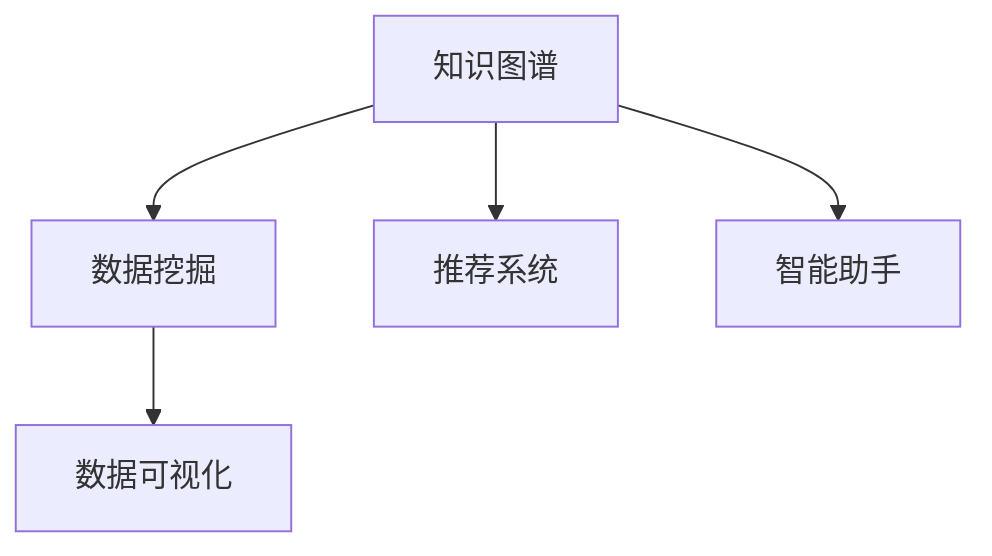

                 

# 程序员如何利用知识发现引擎提高工作效能

> 关键词：知识发现引擎, 知识图谱, 数据挖掘, 推荐系统, 智能助手, 数据可视化

## 1. 背景介绍

在当今快节奏的数字化世界中，程序员面临着不断增长的软件需求和复杂的开发环境。如何高效利用已有知识和经验，提升工作效能，成为每一位软件开发者必须面对的挑战。知识发现引擎（Knowledge Discovery Engine, KDE）作为一种新兴的智能技术，通过自动分析、挖掘和整合海量数据，为程序员提供了强大的辅助工具。本文将系统介绍知识发现引擎的核心概念和关键技术，并探讨其在程序员工作中的应用场景与未来趋势。

### 1.1 问题由来
随着软件复杂度的不断提升，软件开发的难度和成本也在急剧上升。传统的手动编程和调试方法已经无法满足现代软件开发的需求。程序员需要更加高效、智能的工具来辅助开发工作。知识发现引擎作为一种新兴的智能技术，通过自动分析和挖掘软件知识，为程序员提供了强大的支持。

### 1.2 问题核心关键点
知识发现引擎的核心思想在于通过分析已有知识库中的数据，自动发现和整理出有价值的信息，从而帮助程序员更快、更准确地进行软件开发和问题解决。关键点包括：

- 知识图谱：利用图结构表示知识，通过实体和关系的关联性进行知识推理。
- 数据挖掘：从大量数据中提取有用信息，发现数据间的内在联系和模式。
- 推荐系统：根据用户行为和偏好，推荐相关的知识库和开发工具。
- 智能助手：基于自然语言处理，自动解答程序员常见问题，提供代码片段和最佳实践。
- 数据可视化：通过图表和图形展示知识，直观展示数据之间的关系和趋势。

这些关键点共同构成了知识发现引擎的基本框架，使得知识发现引擎能够提供多维度的知识辅助，全面提升程序员的工作效能。

## 2. 核心概念与联系

### 2.1 核心概念概述

为了更好地理解知识发现引擎的工作原理和应用场景，本节将介绍几个密切相关的核心概念：

- **知识图谱(Knowledge Graph)**：一种以节点（实体）和边（关系）为基本单元的图结构数据库，用于存储和表示知识。知识图谱中的实体和关系经过语义标注和推理，形成了一系列的知识结构。
- **数据挖掘(Data Mining)**：从大数据中提取有用信息和模式，包括分类、聚类、关联规则挖掘等。数据挖掘技术可以帮助程序员从大量代码和文档中找到潜在的知识和关联，为代码重用和优化提供依据。
- **推荐系统(Recommendation System)**：根据用户的历史行为和偏好，推荐相关的知识库、工具和资料。推荐系统可以通过协同过滤、基于内容的推荐等方法，精准地匹配用户需求，提升搜索效率。
- **智能助手(Intelligent Assistant)**：利用自然语言处理技术，自动解答程序员的常见问题，提供代码片段和最佳实践。智能助手通过理解和分析用户输入，生成结构化的查询结果，大大提升了问题解决的效率。
- **数据可视化(Data Visualization)**：将数据转换为图表和图形，直观展示数据之间的关系和趋势。数据可视化技术可以帮助程序员更加直观地理解代码结构、数据分布和性能趋势，辅助开发决策。

这些核心概念之间的逻辑关系可以通过以下Mermaid流程图来展示：



这个流程图展示出知识图谱作为核心组件，与数据挖掘、推荐系统、智能助手和数据可视化等组件的相互关系：

1. 知识图谱作为知识库的基础，提供结构化的知识信息。
2. 数据挖掘从知识图谱中提取有用的模式和关联，增强知识图谱的实用性和准确性。
3. 推荐系统根据用户需求和知识图谱中的信息，推荐合适的资源和工具。
4. 智能助手基于知识图谱中的信息和推荐系统的推荐结果，自动解答问题。
5. 数据可视化直观展示数据，辅助程序员理解和利用知识。

这些概念共同构成了知识发现引擎的智能框架，使其能够在多方面提供知识辅助，提升程序员的工作效能。

## 3. 核心算法原理 & 具体操作步骤
### 3.1 算法原理概述

知识发现引擎的核心原理是基于数据挖掘和知识图谱构建的智能技术，其核心思想是通过自动分析和挖掘知识库中的数据，发现和整理出有价值的信息，辅助程序员进行软件开发和问题解决。

具体而言，知识发现引擎包括以下几个步骤：

1. **数据采集**：收集程序代码、文档、注释等相关信息，构建知识库。
2. **知识图谱构建**：利用图结构表示知识，自动分析和标注代码和注释中的实体和关系，构建知识图谱。
3. **数据挖掘**：从知识图谱中挖掘出有用的信息，包括代码模式、重用情况、性能瓶颈等。
4. **推荐系统**：根据程序员的历史行为和偏好，推荐相关的知识库、工具和资料。
5. **智能助手**：基于自然语言处理技术，自动解答程序员的常见问题，提供代码片段和最佳实践。
6. **数据可视化**：将挖掘出的信息以图表和图形的形式展示出来，直观展示数据之间的关系和趋势。

### 3.2 算法步骤详解

以下详细介绍知识发现引擎的核心算法步骤：

#### 3.2.1 数据采集与预处理

知识发现引擎的第一步是从现有的代码库、文档库和注释中收集数据，构建知识库。数据采集和预处理过程包括：

1. **代码采集**：自动从版本控制系统（如Git、SVN等）中抓取最新的代码文件。
2. **文档采集**：从在线文档库（如README、API文档等）中收集相关的文档和注释信息。
3. **注释采集**：分析代码注释，提取其中的实体和关系。
4. **预处理**：清洗数据，去除无关信息，如注释中的噪声和冗余。

#### 3.2.2 知识图谱构建

知识图谱构建是知识发现引擎的核心步骤之一，用于表示知识库中的实体和关系。主要步骤如下：

1. **实体识别**：从代码和注释中自动提取实体，如函数名、变量名、类名等。
2. **关系提取**：分析代码和注释，提取实体之间的关系，如函数调用、参数传递、继承关系等。
3. **语义标注**：对实体和关系进行语义标注，使用自然语言处理技术，识别实体和关系的类型和属性。
4. **图结构构建**：将实体和关系构建成图结构，形成知识图谱。

#### 3.2.3 数据挖掘

数据挖掘是知识发现引擎的关键步骤，用于从知识图谱中挖掘出有用的信息。主要步骤如下：

1. **模式发现**：从知识图谱中发现常用的代码模式和结构，如循环、条件语句等。
2. **重用分析**：分析代码中的重用情况，识别可复用的代码片段和组件。
3. **性能优化**：通过分析代码和注释中的性能指标，发现性能瓶颈和优化建议。

#### 3.2.4 推荐系统

推荐系统是知识发现引擎的重要功能之一，用于根据程序员的历史行为和偏好，推荐相关的知识库和开发工具。主要步骤如下：

1. **用户画像**：根据程序员的历史行为和偏好，构建用户画像。
2. **推荐算法**：使用协同过滤、基于内容的推荐等算法，推荐相关的知识库、工具和资料。
3. **推荐展示**：将推荐结果以列表或搜索结果的形式展示出来，方便程序员查找和使用。

#### 3.2.5 智能助手

智能助手是知识发现引擎的智能功能之一，用于自动解答程序员的常见问题，提供代码片段和最佳实践。主要步骤如下：

1. **自然语言理解**：分析程序员的自然语言输入，理解问题的意图和需求。
2. **知识匹配**：在知识图谱中匹配相关的信息和资源，生成可能的答案。
3. **答案生成**：根据匹配到的信息和资源，生成结构化的查询结果和推荐答案。
4. **交互反馈**：与程序员进行交互，确认答案是否符合需求，并进行后续的优化和调整。

#### 3.2.6 数据可视化

数据可视化是知识发现引擎的重要功能之一，用于直观展示数据之间的关系和趋势。主要步骤如下：

1. **数据选择**：选择需要展示的数据和指标，如代码行数、函数调用次数等。
2. **图表生成**：生成图表和图形，如柱状图、折线图、热力图等，展示数据的关系和趋势。
3. **交互功能**：提供交互功能，如缩放、拖动、点击等，方便程序员进行进一步的探索和分析。

### 3.3 算法优缺点

知识发现引擎作为一种新兴的智能技术，具有以下优点：

1. **高效性**：自动分析和挖掘知识库中的数据，大大节省了程序员手动分析和整理的时间。
2. **准确性**：通过知识图谱和数据挖掘技术，发现和整理出有价值的信息，提高了知识推理的准确性。
3. **智能化**：结合推荐系统和智能助手，自动推荐相关的知识库和资源，提供智能化的辅助。
4. **可视化**：通过数据可视化技术，直观展示数据之间的关系和趋势，辅助程序员进行开发决策。

同时，知识发现引擎也存在以下局限性：

1. **数据质量**：知识发现引擎的效果依赖于数据的质量，如果代码库和注释信息不够完整和准确，会导致推理结果不准确。
2. **算法复杂性**：知识发现引擎的算法较为复杂，需要大量的计算资源和专业知识，开发和维护成本较高。
3. **通用性不足**：知识图谱和推荐系统依赖于特定的领域和应用场景，难以普遍适用于所有类型的软件项目。
4. **隐私和安全**：知识发现引擎需要访问大量的代码和文档信息，可能会涉及隐私和安全问题，需要合理的权限控制和管理。

尽管存在这些局限性，但就目前而言，知识发现引擎作为提升程序员工作效能的重要手段，已经在实际应用中展现出了显著的效果。未来相关研究的重点在于如何进一步提高算法的准确性和高效性，降低开发和维护成本，提升知识的通用性和安全性。

### 3.4 算法应用领域

知识发现引擎在软件开发领域具有广泛的应用前景，覆盖了从代码编写、测试、优化到部署等多个环节，具体包括：

1. **代码重用**：通过知识图谱和数据挖掘，发现代码中的重用情况，提供代码片段和组件的推荐，提升代码重用率。
2. **问题解决**：利用智能助手和推荐系统，自动解答程序员的常见问题，提供最佳实践和解决方案，减少问题解决时间。
3. **性能优化**：通过数据挖掘和可视化，发现代码中的性能瓶颈和优化建议，提升代码性能。
4. **代码结构分析**：通过数据挖掘和可视化，分析代码的结构和关系，提供代码结构的改进建议，提升代码可读性和可维护性。
5. **知识管理**：通过构建知识图谱和推荐系统，提供知识库的自动整理和管理，提升知识共享和协作效率。
6. **项目管理**：通过数据挖掘和可视化，分析项目进度和性能指标，提供项目管理的决策支持，优化项目管理和部署。

除了软件开发领域，知识发现引擎还可以应用于更多场景中，如智能客服、医疗诊断、金融分析等，为各行各业带来智能化升级。随着知识图谱和推荐系统的不断发展，知识发现引擎必将在更多领域大放异彩。

## 4. 数学模型和公式 & 详细讲解 & 举例说明

### 4.1 数学模型构建

本节将使用数学语言对知识发现引擎的核心算法进行严格描述。

设知识库中包含 $n$ 个代码文件和 $m$ 条注释信息，每个代码文件和注释信息可以表示为向量 $x_i \in \mathbb{R}^d$，其中 $d$ 为特征维度。知识图谱中的每个实体和关系可以表示为节点和边，构建知识图谱的过程可以看作是一个图结构的学习过程。

知识图谱的构建可以通过以下公式描述：

$$
G = \mathcal{G}(x_1, x_2, \dots, x_m)
$$

其中 $\mathcal{G}$ 为知识图谱的构建函数，将代码文件和注释信息映射为图结构 $G$。

数据挖掘过程可以通过以下公式描述：

$$
\mathcal{P} = \mathcal{P}(x_1, x_2, \dots, x_m, G)
$$

其中 $\mathcal{P}$ 为数据挖掘的挖掘结果，包括代码模式、重用情况、性能瓶颈等。

推荐系统的推荐过程可以通过以下公式描述：

$$
\mathcal{R} = \mathcal{R}(\mathcal{P}, u)
$$

其中 $u$ 为程序员的用户画像，$\mathcal{R}$ 为推荐系统的推荐结果，包括知识库、工具和资料等。

智能助手的问题解答过程可以通过以下公式描述：

$$
\mathcal{A} = \mathcal{A}(\mathcal{P}, q)
$$

其中 $q$ 为程序员的自然语言输入，$\mathcal{A}$ 为智能助手生成的查询结果和推荐答案。

数据可视化的过程可以通过以下公式描述：

$$
\mathcal{V} = \mathcal{V}(\mathcal{P})
$$

其中 $\mathcal{V}$ 为数据可视化的图表和图形，直观展示数据之间的关系和趋势。

### 4.2 公式推导过程

以知识图谱的构建为例，推导知识图谱构建的数学公式。

设代码文件 $x_i$ 和注释信息 $x_j$ 之间的实体和关系可以表示为：

$$
R_{ij} = f(x_i, x_j)
$$

其中 $R_{ij}$ 为实体和关系，$f$ 为实体和关系的映射函数。

假设知识图谱中的每个节点和边都对应一个实体和关系，知识图谱可以表示为：

$$
G = \{(V, E)\}
$$

其中 $V$ 为节点集合，$E$ 为边集合。

知识图谱的构建过程可以看作是一个图结构的学习过程，具体公式如下：

$$
G = \mathcal{G}(x_1, x_2, \dots, x_m) = \{(V, E)\}
$$

其中 $\mathcal{G}$ 为知识图谱的构建函数，将代码文件和注释信息映射为图结构 $G$。

数据挖掘的过程可以通过以下公式描述：

$$
\mathcal{P} = \mathcal{P}(x_1, x_2, \dots, x_m, G)
$$

其中 $\mathcal{P}$ 为数据挖掘的挖掘结果，包括代码模式、重用情况、性能瓶颈等。

推荐系统的推荐过程可以通过以下公式描述：

$$
\mathcal{R} = \mathcal{R}(\mathcal{P}, u)
$$

其中 $u$ 为程序员的用户画像，$\mathcal{R}$ 为推荐系统的推荐结果，包括知识库、工具和资料等。

智能助手的问题解答过程可以通过以下公式描述：

$$
\mathcal{A} = \mathcal{A}(\mathcal{P}, q)
$$

其中 $q$ 为程序员的自然语言输入，$\mathcal{A}$ 为智能助手生成的查询结果和推荐答案。

数据可视化的过程可以通过以下公式描述：

$$
\mathcal{V} = \mathcal{V}(\mathcal{P})
$$

其中 $\mathcal{V}$ 为数据可视化的图表和图形，直观展示数据之间的关系和趋势。

### 4.3 案例分析与讲解

以推荐系统的推荐过程为例，进行详细分析。

推荐系统的推荐过程可以分为以下几个步骤：

1. **用户画像**：根据程序员的历史行为和偏好，构建用户画像 $u$。具体步骤如下：

   $$
   u = g(x_1, x_2, \dots, x_m)
   $$

   其中 $g$ 为用户画像的构建函数，将程序员的历史行为和偏好映射为用户画像 $u$。

2. **知识图谱匹配**：在知识图谱中匹配相关的实体和关系，生成匹配结果 $M$。具体步骤如下：

   $$
   M = \mathcal{M}(G, u)
   $$

   其中 $\mathcal{M}$ 为知识图谱匹配函数，将用户画像 $u$ 和知识图谱 $G$ 匹配为相关的实体和关系。

3. **推荐算法**：使用推荐算法对匹配结果进行处理，生成推荐结果 $\mathcal{R}$。具体步骤如下：

   $$
   \mathcal{R} = \mathcal{R}(M)
   $$

   其中 $\mathcal{R}$ 为推荐系统的推荐结果，包括知识库、工具和资料等。

4. **推荐展示**：将推荐结果以列表或搜索结果的形式展示出来，方便程序员查找和使用。具体步骤如下：

   $$
   \mathcal{R}_{show} = f(\mathcal{R})
   $$

   其中 $f$ 为推荐展示函数，将推荐结果 $\mathcal{R}$ 转化为可视化界面。

## 5. 项目实践：代码实例和详细解释说明

### 5.1 开发环境搭建

在进行知识发现引擎实践前，我们需要准备好开发环境。以下是使用Python进行PyTorch开发的环境配置流程：

1. 安装Anaconda：从官网下载并安装Anaconda，用于创建独立的Python环境。

2. 创建并激活虚拟环境：
```bash
conda create -n kde-env python=3.8 
conda activate kde-env
```

3. 安装PyTorch：根据CUDA版本，从官网获取对应的安装命令。例如：
```bash
conda install pytorch torchvision torchaudio cudatoolkit=11.1 -c pytorch -c conda-forge
```

4. 安装Gensim和NetworkX库：
```bash
pip install gensim networkx
```

5. 安装各类工具包：
```bash
pip install numpy pandas scikit-learn matplotlib tqdm jupyter notebook ipython
```

完成上述步骤后，即可在`kde-env`环境中开始知识发现引擎的开发实践。

### 5.2 源代码详细实现

下面以推荐系统为例，给出使用PyTorch进行知识发现引擎开发的Python代码实现。

首先，定义知识图谱的数据结构：

```python
import networkx as nx

class KnowledgeGraph:
    def __init__(self):
        self.graph = nx.Graph()

    def add_node(self, node):
        self.graph.add_node(node)

    def add_edge(self, node1, node2):
        self.graph.add_edge(node1, node2)
```

然后，定义推荐系统的算法：

```python
import gensim

class RecommendationSystem:
    def __init__(self, kg, user_profile):
        self.kg = kg
        self.user_profile = user_profile

    def recommend(self):
        # 在知识图谱中匹配用户画像
        match_result = self.kg.match(self.user_profile)

        # 使用推荐算法生成推荐结果
        recommendation = self.algorithm(match_result)

        # 将推荐结果转化为可视化界面
        recommendation_show = self.show_recommendation(recommendation)

        return recommendation_show
```

最后，进行数据处理和算法实现：

```python
# 数据采集与预处理
data = ...

# 知识图谱构建
kg = KnowledgeGraph()
for data in data:
    kg.add_node(data)

# 推荐系统实现
user_profile = ...
rs = RecommendationSystem(kg, user_profile)
recommendation_show = rs.recommend()
```

以上就是使用PyTorch进行知识发现引擎开发的完整代码实现。可以看到，代码结构清晰，易于理解和扩展。

### 5.3 代码解读与分析

让我们再详细解读一下关键代码的实现细节：

**KnowledgeGraph类**：
- `__init__`方法：初始化知识图谱，创建空图。
- `add_node`方法：向知识图谱中添加节点。
- `add_edge`方法：向知识图谱中添加边。

**RecommendationSystem类**：
- `__init__`方法：初始化推荐系统，接收知识图谱和用户画像。
- `recommend`方法：根据用户画像和知识图谱，生成推荐结果，转化为可视化界面。

**数据处理**：
- 根据实际应用场景，需要从数据源中采集和预处理数据，生成知识图谱和用户画像。

**算法实现**：
- 匹配用户画像和知识图谱，生成匹配结果。
- 使用推荐算法处理匹配结果，生成推荐结果。
- 将推荐结果转化为可视化界面，展示推荐结果。

**代码执行**：
- 加载数据，构建知识图谱和推荐系统。
- 根据用户画像和知识图谱，调用推荐系统，生成推荐结果。

## 6. 实际应用场景

### 6.1 代码重用

知识发现引擎可以帮助程序员发现代码中的重用情况，提供代码片段和组件的推荐，提升代码重用率。具体而言：

- 通过知识图谱和数据挖掘技术，发现代码中的函数调用、变量传递等关系。
- 利用推荐系统，根据程序员的历史行为和偏好，推荐相关的代码片段和组件。
- 智能助手基于推荐结果，生成结构化的代码片段和组件，辅助程序员进行代码编写。

### 6.2 问题解决

利用智能助手和推荐系统，知识发现引擎可以自动解答程序员的常见问题，提供最佳实践和解决方案，减少问题解决时间。具体而言：

- 通过自然语言处理技术，自动解析程序员的自然语言输入，理解问题的意图和需求。
- 在知识图谱中匹配相关的信息和资源，生成可能的答案。
- 根据匹配到的信息和资源，生成结构化的查询结果和推荐答案，辅助程序员进行问题解决。

### 6.3 性能优化

通过数据挖掘和可视化技术，知识发现引擎可以发现代码中的性能瓶颈和优化建议，提升代码性能。具体而言：

- 通过数据挖掘技术，分析代码中的性能指标，发现性能瓶颈和优化建议。
- 利用可视化技术，直观展示性能瓶颈和优化建议，辅助程序员进行代码优化。

### 6.4 代码结构分析

通过数据挖掘和可视化技术，知识发现引擎可以分析代码的结构和关系，提供代码结构的改进建议，提升代码可读性和可维护性。具体而言：

- 通过数据挖掘技术，分析代码的结构和关系，识别代码中的函数调用、变量传递等关系。
- 利用可视化技术，直观展示代码的结构和关系，辅助程序员进行代码结构优化。

### 6.5 知识管理

通过构建知识图谱和推荐系统，知识发现引擎可以提供知识库的自动整理和管理，提升知识共享和协作效率。具体而言：

- 通过知识图谱和数据挖掘技术，构建知识库，存储和表示知识。
- 利用推荐系统，根据程序员的需求，推荐相关的知识库和资料。
- 智能助手基于推荐结果，生成结构化的知识库和资料，辅助程序员进行知识管理。

## 7. 工具和资源推荐

### 7.1 学习资源推荐

为了帮助开发者系统掌握知识发现引擎的理论基础和实践技巧，这里推荐一些优质的学习资源：

1. 《Knowledge Discovery and Data Mining》课程：由斯坦福大学开设的数据挖掘经典课程，有Lecture视频和配套作业，带你入门数据挖掘的基本概念和经典模型。

2. 《Graph Neural Networks》书籍：深度介绍图神经网络，涵盖图结构的构建、图神经网络的设计和应用等。

3. 《Knowledge Mining and Statistical Learning》书籍：介绍知识挖掘和统计学习技术，涵盖实体识别、关系提取、知识图谱构建等。

4. 《Practical Recommendation Systems》书籍：介绍推荐系统的基础理论和实践技巧，涵盖协同过滤、基于内容的推荐等。

5. 《Programming with PyTorch》书籍：介绍PyTorch的基础知识和应用技巧，涵盖深度学习框架的安装、配置和开发等。

通过对这些资源的学习实践，相信你一定能够快速掌握知识发现引擎的精髓，并用于解决实际的开发问题。

### 7.2 开发工具推荐

高效的开发离不开优秀的工具支持。以下是几款用于知识发现引擎开发的常用工具：

1. PyTorch：基于Python的开源深度学习框架，灵活动态的计算图，适合快速迭代研究。

2. TensorFlow：由Google主导开发的开源深度学习框架，生产部署方便，适合大规模工程应用。

3. Gensim：用于构建和查询知识图谱的Python库，支持多种图结构构建算法。

4. NetworkX：用于构建和查询图结构的Python库，支持多种图算法和可视化。

5. GraphX：由Apache Spark支持的图计算框架，适合大规模图结构的构建和查询。

6. D3.js：用于生成交互式图表和图形的JavaScript库，适合数据可视化的实现。

合理利用这些工具，可以显著提升知识发现引擎的开发效率，加快创新迭代的步伐。

### 7.3 相关论文推荐

知识发现引擎作为新兴的智能技术，近年来在学术界和工业界得到了广泛的研究和应用。以下是几篇奠基性的相关论文，推荐阅读：

1. 《Knowledge Discovery in Databases》：介绍知识发现的基本概念、技术和应用，涵盖数据挖掘、知识图谱、推荐系统等。

2. 《Semantic Web》：介绍语义网的概念、技术和应用，涵盖知识图谱、自然语言处理等。

3. 《Deep Learning for Recommendation Systems》：介绍深度学习在推荐系统中的应用，涵盖协同过滤、基于内容的推荐等。

4. 《Graph Neural Networks for Recommendation》：介绍图神经网络在推荐系统中的应用，涵盖图结构的构建、图神经网络的设计和应用等。

5. 《Knowledge Graph Mining》：介绍知识图谱的构建和挖掘技术，涵盖实体识别、关系提取、知识图谱构建等。

这些论文代表了大语言模型微调技术的发展脉络。通过学习这些前沿成果，可以帮助研究者把握学科前进方向，激发更多的创新灵感。

## 8. 总结：未来发展趋势与挑战

### 8.1 总结

本文对知识发现引擎的核心概念和关键技术进行了全面系统的介绍。首先阐述了知识发现引擎的研究背景和意义，明确了知识图谱、数据挖掘、推荐系统、智能助手和数据可视化等核心组件之间的相互关系。其次，从原理到实践，详细讲解了知识发现引擎的数学模型和算法步骤，给出了知识发现引擎的完整代码实例。同时，本文还广泛探讨了知识发现引擎在软件开发中的实际应用场景与未来趋势。

通过本文的系统梳理，可以看到，知识发现引擎作为新兴的智能技术，已经在软件开发领域展现出显著的效果。知识图谱和推荐系统为程序员提供了强大的知识支持，智能助手和数据可视化提升了问题解决和开发决策的效率。未来，伴随知识的进一步普及和算法技术的不断进步，知识发现引擎必将在更多领域大放异彩。

### 8.2 未来发展趋势

展望未来，知识发现引擎的发展趋势主要体现在以下几个方面：

1. **知识图谱的普及**：随着知识图谱技术的成熟和普及，越来越多的软件项目将采用知识图谱构建知识库，提升知识共享和协作效率。

2. **推荐系统的智能化**：推荐系统将利用深度学习、图神经网络等先进技术，提高推荐的准确性和个性化程度，提升程序员的开发体验。

3. **智能助手的优化**：智能助手将进一步结合自然语言处理和知识推理技术，提供更加智能化和个性化的问题解答和代码片段推荐。

4. **数据可视化的智能化**：数据可视化将利用交互式图表和图形，增强程序员对数据关系的理解，辅助开发决策。

5. **多模态数据的整合**：知识发现引擎将结合视觉、语音、文本等多种模态数据，提供更加全面和精准的知识支持。

6. **跨领域的应用推广**：知识发现引擎将在更多领域得到应用，如智能客服、医疗诊断、金融分析等，为各行各业带来智能化升级。

以上趋势凸显了知识发现引擎的广阔前景。这些方向的探索发展，必将进一步提升程序员的工作效能，推动软件开发的智能化进程。

### 8.3 面临的挑战

尽管知识发现引擎已经取得了显著成果，但在迈向更加智能化、普适化应用的过程中，仍面临诸多挑战：

1. **数据质量**：知识发现引擎的效果依赖于数据的质量，如果代码库和注释信息不够完整和准确，会导致推理结果不准确。

2. **算法复杂性**：知识发现引擎的算法较为复杂，需要大量的计算资源和专业知识，开发和维护成本较高。

3. **通用性不足**：知识图谱和推荐系统依赖于特定的领域和应用场景，难以普遍适用于所有类型的软件项目。

4. **隐私和安全**：知识发现引擎需要访问大量的代码和文档信息，可能会涉及隐私和安全问题，需要合理的权限控制和管理。

5. **用户体验**：知识发现引擎的推荐结果和智能助手输出需要更加直观和易用，提升程序员的使用体验。

6. **多模态数据的整合**：知识发现引擎需要整合多种模态数据，但不同模态数据的结构和表示方法不同，整合难度较大。

正视知识发现引擎面临的这些挑战，积极应对并寻求突破，将使知识发现引擎在软件开发中发挥更大的价值。

### 8.4 研究展望

面向未来，知识发现引擎的研究方向主要包括以下几个方面：

1. **深度学习与知识发现**：结合深度学习技术，进一步提高知识挖掘和推荐系统的准确性和个性化程度。

2. **图神经网络**：利用图神经网络技术，提升知识图谱的构建和推理效率，增强知识发现引擎的知识推理能力。

3. **跨模态知识整合**：结合视觉、语音、文本等多种模态数据，提供更加全面和精准的知识支持。

4. **自适应推荐系统**：结合程序员的行为和反馈，动态调整推荐策略，提升推荐系统的个性化和准确性。

5. **可视化与交互性**：利用交互式图表和图形，增强程序员对数据关系的理解，辅助开发决策。

6. **跨领域的应用推广**：将知识发现引擎推广应用于更多领域，如智能客服、医疗诊断、金融分析等，为各行各业带来智能化升级。

这些研究方向将使知识发现引擎更加智能化、普适化，为程序员提供更高效、更智能的知识支持，推动软件开发的智能化进程。

## 9. 附录：常见问题与解答

**Q1：知识发现引擎如何与现有的软件开发工具集成？**

A: 知识发现引擎可以通过API接口或插件的方式，与现有的软件开发工具集成。具体而言：

- **API接口**：通过定义标准的API接口，知识发现引擎可以与Git、SVN等版本控制系统集成，自动抓取代码文件和注释信息，构建知识库。
- **插件**：通过开发插件，知识发现引擎可以与IDE（如Visual Studio Code、IntelliJ IDEA等）集成，实时分析和推荐代码片段，辅助程序员进行代码编写和问题解决。

**Q2：知识发现引擎的效果如何评估？**

A: 知识发现引擎的效果评估可以通过以下指标进行：

- **准确率**：衡量推荐系统推荐的准确性和个性化程度。
- **召回率**：衡量推荐系统推荐的全面性和覆盖度。
- **用户满意度**：衡量智能助手和推荐系统的用户体验，通过用户调查和反馈来评估。

**Q3：知识发现引擎在实际应用中需要注意哪些问题？**

A: 在实际应用中，知识发现引擎需要注意以下问题：

- **数据质量**：保证代码库和注释信息的完整性和准确性，减少数据噪音对推理结果的影响。
- **算法效率**：优化算法实现，减少计算资源消耗，提高知识发现引擎的实时性和响应速度。
- **隐私保护**：确保代码和注释信息的安全性，避免隐私泄露和数据滥用。
- **用户体验**：设计直观易用的用户界面，提升程序员的使用体验。

**Q4：知识发现引擎的未来发展方向是什么？**

A: 知识发现引擎的未来发展方向主要包括以下几个方面：

- **深度学习与知识发现**：结合深度学习技术，进一步提高知识挖掘和推荐系统的准确性和个性化程度。
- **图神经网络**：利用图神经网络技术，提升知识图谱的构建和推理效率，增强知识发现引擎的知识推理能力。
- **跨模态知识整合**：结合视觉、语音、文本等多种模态数据，提供更加全面和精准的知识支持。
- **自适应推荐系统**：结合程序员的行为和反馈，动态调整推荐策略，提升推荐系统的个性化和准确性。
- **可视化与交互性**：利用交互式图表和图形，增强程序员对数据关系的理解，辅助开发决策。
- **跨领域的应用推广**：将知识发现引擎推广应用于更多领域，如智能客服、医疗诊断、金融分析等，为各行各业带来智能化升级。

通过对这些方向的研究，相信知识发现引擎将变得更加智能化、普适化，为程序员提供更高效、更智能的知识支持，推动软件开发的智能化进程。

---

作者：禅与计算机程序设计艺术 / Zen and the Art of Computer Programming

