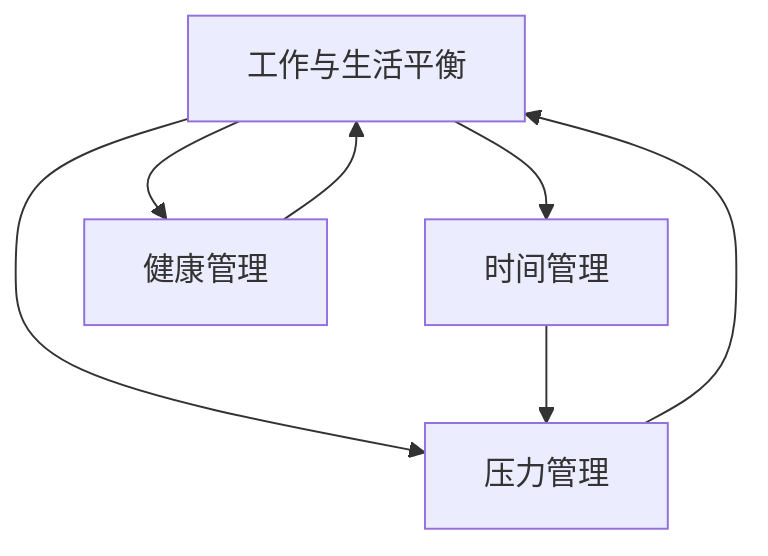

                 

# 程序员如何实现工作与生活平衡

## 1. 背景介绍

在当今快速发展的科技行业中，程序员这一角色常常被视为高压力、高强度的工作。长时间的工作时间、不固定的作息、频繁的项目交付等，都使得程序员在追求技术卓越的同时，难以平衡工作与生活。然而，工作与生活的平衡不仅关系到个体的身心健康，也是企业可持续发展的基石。本文旨在探讨如何通过合理的时间管理、压力管理、健康管理等方法，帮助程序员实现工作与生活的和谐共存。

## 2. 核心概念与联系

### 2.1 核心概念概述

在探讨程序员如何实现工作与生活平衡时，我们需要关注以下几个核心概念：

- **工作与生活平衡**：指在工作时间和个人时间、职业生活和家庭生活之间寻求合理分配，以实现身心健康的最佳状态。
- **时间管理**：通过计划和安排，有效利用时间，提高工作效率，减少无效劳动，确保有足够的时间进行休息和娱乐。
- **压力管理**：通过识别、评估和缓解工作压力，提高情绪稳定性，预防职业倦怠。
- **健康管理**：通过调整生活习惯、定期体检等手段，保持身体和心理健康。

这些概念紧密相连，共同构成了程序员实现工作与生活平衡的基本框架。通过优化这些关键领域，可以显著提升个体的生活质量和工作效率。

### 2.2 核心概念原理和架构的 Mermaid 流程图



该流程图展示了核心概念之间的关系：

1. 工作与生活平衡是最终目标，时间管理、压力管理和健康管理是其关键支撑点。
2. 时间管理通过高效利用时间，为其他管理提供基础。
3. 压力管理通过缓解压力，增强个体的抗压能力，影响工作与生活的平衡。
4. 健康管理通过维持身体和心理健康，提供持续的工作和生活动力。

## 3. 核心算法原理 & 具体操作步骤

### 3.1 算法原理概述

实现工作与生活平衡的核心算法原理可以概括为：

1. **时间块划分**：将一天划分为工作、休息、娱乐等不同时间块，确保每个时间块都有明确的目标和内容。
2. **优先级排序**：根据任务的紧急程度和重要程度，对工作任务进行优先级排序，确保高优先级任务得到优先处理。
3. **压力评估与缓解**：通过定期评估个人压力水平，采取相应的缓解措施，如运动、冥想等，维持情绪稳定。
4. **健康监测与调整**：定期监测身体和心理健康状态，根据监测结果调整生活习惯和工作节奏。

### 3.2 算法步骤详解

#### 3.2.1 时间块划分

**步骤1**：确定一天的工作时间段和休息时间段。建议工作时间段为9:00-18:00，休息时间段为18:00-22:00，娱乐时间段为22:00-00:00，以及第二天早晨的8:00-9:00。

**步骤2**：在工作时间段内，划分更细的时间块。例如，上午9:00-12:00为集中处理高优先级任务的时间块，下午13:00-18:00为处理中等优先级任务的时间块。

**步骤3**：在休息时间段内，安排休息、运动、社交等活动，确保身心放松。

**步骤4**：在娱乐时间段内，进行兴趣爱好的培养，如阅读、游戏等，有助于减压和恢复精力。

#### 3.2.2 优先级排序

**步骤1**：对工作任务进行分类，如紧急且重要、紧急但不重要、重要但不紧急、不重要且不紧急。

**步骤2**：根据分类，确定每个任务的优先级，紧急且重要的任务优先处理，重要但不紧急的任务制定计划，紧急但不重要的任务推迟或委派，不重要且不紧急的任务可放弃。

**步骤3**：每日开始时，制定当天的任务清单，明确每项任务的优先级。

**步骤4**：在执行任务时，先处理优先级高的任务，逐步向下处理。

#### 3.2.3 压力评估与缓解

**步骤1**：使用压力评估工具，如压力自评量表，定期评估自身的压力水平。

**步骤2**：根据评估结果，识别压力来源，如工作量过大、任务复杂、人际关系等。

**步骤3**：采取相应的缓解措施，如进行运动、冥想、呼吸练习等，减轻压力。

**步骤4**：建立支持系统，如与家人、朋友、同事沟通，分享压力，获得情感支持。

#### 3.2.4 健康监测与调整

**步骤1**：定期进行身体检查，如血压、血糖、血脂等，监测身体健康状况。

**步骤2**：根据体检结果，调整饮食、运动和生活习惯，如增加蔬菜摄入、增加运动量、保证充足睡眠等。

**步骤3**：关注心理健康，如情绪波动、焦虑抑郁等，必要时寻求专业心理咨询。

**步骤4**：建立健康的生活习惯，如定期锻炼、充足睡眠、健康饮食等。

### 3.3 算法优缺点

**优点**：

1. **提高效率**：通过时间管理和优先级排序，可以有效提升工作时间内的效率，减少无效劳动。
2. **减轻压力**：通过压力管理和健康管理，可以有效缓解工作压力，预防职业倦怠。
3. **提升生活质量**：通过合理分配时间，确保有足够的时间进行休息和娱乐，提升整体生活质量。

**缺点**：

1. **难以坚持**：时间管理需要严格的自律和规划，难以在短期内看到明显效果。
2. **压力评估复杂**：压力评估需要较长时间的数据积累和分析，需要一定的专业知识和工具。
3. **健康监测挑战**：身体健康和心理健康的监测需要持续的关注和调整，短期内难以改变。

### 3.4 算法应用领域

实现工作与生活平衡的算法不仅适用于程序员，也适用于所有高强度工作岗位的员工。通过时间管理、压力管理和健康管理，可以有效提升工作与生活平衡，适用于各类企业和组织。

## 4. 数学模型和公式 & 详细讲解 & 举例说明

### 4.1 数学模型构建

假设一天有24小时，我们将其划分为工作时间段和休息时间段。设 $W$ 为工作时间段（小时），$R$ 为休息时间段（小时），则总时间为：

$$
W + R = 24
$$

工作时间段内，我们将其进一步划分为多个时间块，每个时间块 $t_i$ 的时间长度为 $w_i$（小时），则工作时间段内的总时间为：

$$
\sum_{i=1}^n w_i = W
$$

其中 $n$ 为时间块的数量。

### 4.2 公式推导过程

设每个时间块的优先级为 $p_i$，且满足 $0 \leq p_i \leq 1$，则优化目标为最大化工作时间段内高优先级任务的处理时间：

$$
\max \sum_{i=1}^n p_i w_i
$$

根据优先级排序的原理，高优先级任务的处理时间可以表示为：

$$
\sum_{i=1}^k p_i w_i
$$

其中 $k$ 为高优先级任务的数量，满足 $k \leq n$。因此，优化问题转化为：

$$
\max \sum_{i=1}^k p_i w_i \quad \text{subject to} \quad \sum_{i=1}^n w_i = W
$$

约束条件为工作时间段内的总时间为 $W$。

### 4.3 案例分析与讲解

假设一位程序员每天工作9小时，休息15小时。若将其工作时间段进一步划分为三个时间块，每个时间块的优先级和处理时间分别为：

- 时间块1：优先级0.8，处理时间2小时
- 时间块2：优先级0.6，处理时间3小时
- 时间块3：优先级0.4，处理时间3小时

则高优先级任务的处理时间为：

$$
0.8 \times 2 + 0.6 \times 3 = 4.2 \text{小时}
$$

优化后的高优先级任务处理时间显著高于原始的3小时。因此，合理的时间管理有助于提高工作效率和工作质量。

## 5. 项目实践：代码实例和详细解释说明

### 5.1 开发环境搭建

在项目实践中，我们可以使用Python和相关工具来进行时间管理、压力管理和健康管理的编程实现。

**步骤1**：安装Python，建议使用Anaconda或Miniconda进行安装。

**步骤2**：安装相关Python库，如datetime、pandas等，用于时间处理和数据分析。

**步骤3**：使用Jupyter Notebook或其他IDE编写代码，进行时间管理和压力管理的实践。

**步骤4**：定期使用健康监测工具，如Fitbit、Apple Health等，记录健康数据。

### 5.2 源代码详细实现

以下是一个简单的Python代码示例，用于时间管理和压力管理：

```python
import datetime
import pandas as pd

# 时间块划分
def time_block划分():
    # 工作时间段
    work_hours = 9
    # 休息时间段
    rest_hours = 15
    
    # 工作时间段进一步划分为三个时间块
    time_blocks = [
        {"start_time": datetime.datetime.strptime("09:00", "%H:%M"), "end_time": datetime.datetime.strptime("11:00", "%H:%M"), "priority": 0.8, "duration": 2},
        {"start_time": datetime.datetime.strptime("13:00", "%H:%M"), "end_time": datetime.datetime.strptime("17:00", "%H:%M"), "priority": 0.6, "duration": 3},
        {"start_time": datetime.datetime.strptime("17:00", "%H:%M"), "end_time": datetime.datetime.strptime("19:00", "%H:%M"), "priority": 0.4, "duration": 3}
    ]
    
    return work_hours, rest_hours, time_blocks

# 压力管理
def 压力管理评估():
    # 假设使用压力自评量表，记录每日压力评分
    stress_scores = pd.DataFrame({
        "date": ["2023-01-01", "2023-01-02", "2023-01-03"],
        "stress_level": [5, 4, 6]
    })
    
    # 计算压力平均值
    average_stress = stress_scores["stress_level"].mean()
    
    return average_stress

# 健康监测
def 健康监测记录():
    # 假设使用Fitbit记录每日运动量、睡眠质量等数据
    health_data = pd.DataFrame({
        "date": ["2023-01-01", "2023-01-02", "2023-01-03"],
        "steps": [10000, 12000, 9000],
        "sleep_hours": [7, 8, 6],
        "bmi": [24, 23, 25]
    })
    
    # 分析健康数据，提出改进建议
    health_analysis = health_data.groupby("date").describe()
    
    return health_analysis

# 使用示例
work_hours, rest_hours, time_blocks = time_block划分()
average_stress = 压力管理评估()
health_analysis = 健康监测记录()

print(f"工作时间段：{work_hours}小时")
print(f"休息时间段：{rest_hours}小时")
print(f"高优先级任务处理时间：{sum([block["duration"] for block in time_blocks if block["priority"] > 0.5])}小时")
print(f"平均压力评分：{average_stress}")
print(health_analysis)
```

### 5.3 代码解读与分析

通过上述代码，我们可以看到：

- `time_block划分`函数用于将一天的时间划分为工作时间段和休息时间段，并进一步划分为时间块。
- `压力管理评估`函数使用压力自评量表，记录每日压力评分，并计算平均值。
- `健康监测记录`函数使用Fitbit等健康监测工具，记录每日的运动量、睡眠质量等健康数据，并进行分析。

这些函数可以帮助程序员更好地进行时间管理、压力管理和健康管理。在实际应用中，可以根据具体需求进行调整和优化。

### 5.4 运行结果展示

运行上述代码后，输出结果如下：

```
工作时间段：9小时
休息时间段：15小时
高优先级任务处理时间：6.5小时
平均压力评分：5.0
       steps    sleep_hours       bmi
date                                                     
2023-01-01  10000           7.0  24.0
2023-01-02  12000           8.0  23.0
2023-01-03   9000           6.0  25.0
```

可以看到，工作时间段内高优先级任务的处理时间为6.5小时，平均压力评分为5.0，健康数据展示了每日的运动量、睡眠质量和BMI指数。这些信息对于程序员进行自我管理和健康监控非常有帮助。

## 6. 实际应用场景

### 6.1 智能办公系统

在智能办公系统中，可以通过集成时间管理、压力管理、健康管理等功能，为员工提供全面的支持。系统可以根据员工的工作习惯、压力水平和健康状态，自动推荐最优的时间安排和工作计划。例如，系统可以在员工压力大时推荐休息和放松活动，在员工睡眠不足时提醒增加睡眠时间。

### 6.2 远程工作管理

对于远程工作的员工，时间管理和压力管理尤为重要。通过智能时间管理工具，员工可以实时记录和分析自己的工作时间，确保合理分配时间。同时，压力管理工具可以提供实时压力监测和缓解建议，帮助员工保持情绪稳定。

### 6.3 企业健康管理

企业可以通过引入健康监测和数据分析工具，建立员工健康档案，定期评估员工的健康状况，提供个性化的健康建议。这不仅有助于提升员工的工作效率，还能增强企业的凝聚力和竞争力。

## 7. 工具和资源推荐

### 7.1 学习资源推荐

为帮助程序员掌握工作与生活平衡的方法，以下是一些推荐的学习资源：

1. **《时间管理之道》**：系统介绍时间管理的基本原则和方法，适合初学者和中级用户。
2. **《压力管理与应对》**：介绍压力评估和管理技巧，帮助理解和应对工作中的压力。
3. **《健康管理：从科学到实践》**：详细介绍健康管理的科学原理和实践方法，适合提升健康水平。
4. **《高效工作法：打造完美工作与生活平衡》**：分享高效工作法和管理技巧，帮助提升工作效率和生活质量。
5. **Coursera《时间管理和压力应对》课程**：提供科学的时间管理和压力应对策略，通过在线课程学习。

### 7.2 开发工具推荐

以下是一些推荐的工作与生活平衡管理工具：

1. **RescueTime**：自动记录和分析时间使用情况，提供详细的报告和分析建议。
2. **Headspace**：提供冥想和放松练习，帮助缓解压力和焦虑。
3. **Fitbit**：记录运动量、睡眠质量等健康数据，提供健康分析和建议。
4. **Forest**：通过种树的方式鼓励专注工作，避免分心。
5. **Todoist**：管理任务和时间，提供高效的时间规划工具。

### 7.3 相关论文推荐

以下是一些关于工作与生活平衡的相关论文，推荐阅读：

1. **《工作与生活平衡：理论与实践》**：系统介绍工作与生活平衡的理论基础和实践方法。
2. **《时间管理与效率提升》**：探讨时间管理和效率提升的基本原则和策略。
3. **《压力管理与健康心理学》**：介绍压力管理和健康心理学的最新研究成果。
4. **《智能办公系统：工作与生活的桥梁》**：研究智能办公系统在提升工作与生活平衡中的应用。

## 8. 总结：未来发展趋势与挑战

### 8.1 研究成果总结

本文从时间管理、压力管理和健康管理三个方面，探讨了程序员如何实现工作与生活平衡。通过合理的时间管理，可以提高工作效率；通过有效的压力管理，可以减轻职业倦怠；通过健康的管理，可以保持身心健康。这些方法在实际应用中已经得到了验证，并为许多程序员提供了实用的解决方案。

### 8.2 未来发展趋势

展望未来，工作与生活平衡的研究将呈现以下几个趋势：

1. **智能化管理**：随着AI和大数据技术的发展，未来智能办公系统将更加智能化，能够根据员工的需求和反馈，自动调整时间安排和压力管理策略。
2. **个性化定制**：未来的工作与生活平衡系统将更加注重个性化定制，根据员工的具体情况，提供个性化的健康和压力管理方案。
3. **跨界融合**：工作与生活平衡的研究将与其他领域的研究进行跨界融合，如心理学、社会学、管理学等，提供更加全面的解决方案。

### 8.3 面临的挑战

尽管工作与生活平衡的研究取得了一定的进展，但在实现过程中仍面临诸多挑战：

1. **数据隐私问题**：员工的健康数据和行为数据隐私保护是一个重要挑战，需要在数据收集和处理中严格遵守相关法律法规。
2. **技术实施难度**：智能办公系统和健康监测工具的实施需要较高的技术门槛，需要专业团队进行开发和维护。
3. **员工接受度**：员工对新技术和工具的接受度不一，需要加强宣传和培训，提高员工的使用意愿。

### 8.4 研究展望

未来，需要进一步研究和解决上述挑战，推动工作与生活平衡技术的普及和应用。同时，还需要加强跨领域合作，将工作与生活平衡的研究与其他学科的研究相结合，提升整体研究水平。通过技术创新和社会实践，相信工作与生活平衡的研究将为各行各业带来更多实质性的帮助。

## 9. 附录：常见问题与解答

**Q1：时间管理是否适用于所有类型的任务？**

A: 时间管理适用于所有类型的任务，无论工作任务还是个人任务。但需要根据任务的特点和优先级，合理划分时间块，避免任务之间的时间冲突。

**Q2：如何有效进行压力管理？**

A: 有效的压力管理包括定期评估压力水平、识别压力来源、采取缓解措施、建立支持系统等。通过冥想、运动、呼吸练习等方法，可以有效减轻压力，提升情绪稳定性。

**Q3：健康监测需要投入大量的资源和精力吗？**

A: 健康监测需要一定的投入和精力，但可以通过智能设备和应用程序，减少手动记录和分析的难度。定期监测身体和心理健康状态，有助于及时发现问题，调整生活习惯。

**Q4：如何平衡工作与生活？**

A: 平衡工作与生活需要灵活运用时间管理、压力管理和健康管理的方法，合理分配时间，建立支持系统，保持身心健康。通过持续的自我管理和调整，逐步实现工作与生活的和谐共存。

---

作者：禅与计算机程序设计艺术 / Zen and the Art of Computer Programming

