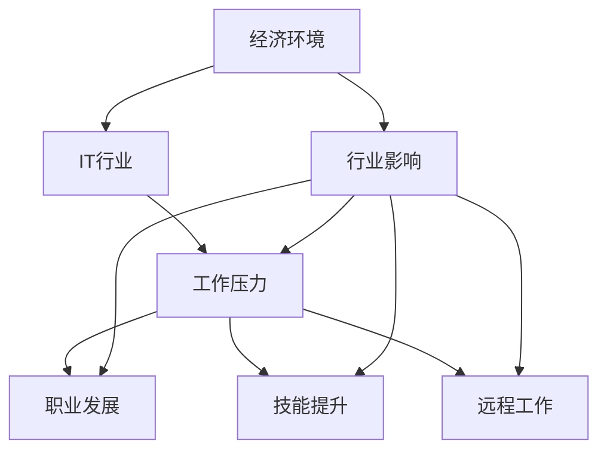

                 

# 程序员如何应对经济 &- &- 挑战

> 关键词：经济环境,IT行业,工作压力,职业规划,技能提升,远程工作

## 1. 背景介绍

### 1.1 问题由来
进入2023年，全球经济形势面临严峻挑战。地缘政治紧张、通货膨胀高企、供应链受阻等问题，给各行各业带来了不小的冲击。IT行业虽然被誉为“避风港”，但其也并非一枝独秀。面对日益复杂多变的经济环境，IT从业者也面临着前所未有的挑战和压力。如何应对这一复杂局面，成为当前IT从业者最紧迫的问题之一。

### 1.2 问题核心关键点
在经济低迷、行业下行的大背景下，IT从业者需要应对的核心挑战包括但不限于：

- **工作压力增大**：企业为了缩减成本，往往对员工提出更高的工作效率和绩效要求，工作压力和负担随之增加。
- **职业发展受阻**：经济不确定性增加了职业发展的不确定性，可能导致晋升机会减少，职场竞争加剧。
- **技能更新需求提升**：技术的快速迭代要求从业者不断学习新技能，以保持竞争力。
- **远程工作挑战**：居家办公常态化，需适应新的工作方式，提高自我管理和团队协作能力。

### 1.3 问题研究意义
掌握应对经济挑战的有效策略，对于IT从业者实现自我突破、推动职业发展具有重要意义。通过科学的职业规划、合理的工作技巧和高效的技能提升，可以有效减轻工作压力，增强职业韧性，提升个人和团队的绩效。本文旨在为IT从业者提供一套全面、实用的应对策略，助力其在这波经济波动中稳步前行。

## 2. 核心概念与联系

### 2.1 核心概念概述

为更好地理解IT从业者如何应对经济挑战，本节将介绍几个关键概念：

- **经济环境(Economic Environment)**：指某一特定时期内，影响企业及个人发展的宏观经济因素，包括GDP、就业率、通货膨胀率、利率等。
- **IT行业(IT Industry)**：基于信息技术的行业，涵盖软件开发、硬件制造、互联网服务等领域，是全球经济的重要组成部分。
- **工作压力(Work Pressure)**：员工在完成工作任务时感受到的紧张和焦虑，由工作量、期限、责任等诸多因素导致。
- **职业发展(Career Development)**：个人在职业生涯中的成长和进步，包括技能提升、职位晋升、跨行业跨领域发展等。
- **技能提升(Skill Enhancement)**：通过培训、学习等方式提升个人专业技能和通用技能，保持与行业发展同步。
- **远程工作(Remote Work)**：利用互联网等技术，在家中或其他地点完成工作任务，已成为工作的新常态。

这些核心概念之间的逻辑关系可以通过以下Mermaid流程图来展示：



这个流程图展示了大环境、行业特征、工作状态与个人发展之间的相互作用关系：

1. 经济环境通过行业影响，对工作压力、职业发展、技能提升和远程工作产生直接或间接的作用。
2. 行业特点通过工作压力和职业发展，影响到技能提升和远程工作的实际实施效果。
3. 技能提升和远程工作又是应对工作压力和促进职业发展的关键因素。

## 3. 核心算法原理 & 具体操作步骤

### 3.1 算法原理概述

本节将从算法和操作层面上，探讨IT从业者应对经济挑战的策略，主要包含以下几个步骤：

1. **目标设定**：明确短期和长期职业目标，合理规划个人发展路径。
2. **环境评估**：深入分析当前经济环境对IT行业的具体影响，识别行业趋势和个人面临的具体挑战。
3. **压力管理**：通过科学的时间管理、情绪调节和心理健康维护，减轻工作压力。
4. **技能提升**：根据行业发展趋势和岗位要求，持续学习新知识和技能，提升个人竞争力。
5. **远程协作**：掌握远程工作必备工具和技能，提升团队协作和沟通效率。

### 3.2 算法步骤详解

#### 3.2.1 目标设定

**Step 1: 自我评估**
- **回顾过往**：评估过去的工作表现和职业发展路径，找出成功的经验和需要改进的地方。
- **现状分析**：分析当前的技能水平、知识储备和市场竞争力。
- **未来规划**：确定短期（1-2年）和长期（3-5年）职业目标，制定详细的行动计划。

#### 3.2.2 环境评估

**Step 2: 行业研究**
- **经济趋势**：关注全球及本地经济形势，了解对IT行业的影响，包括就业、收入、技术变革等。
- **技术动态**：跟踪前沿技术的发展，如AI、大数据、云计算等，掌握未来趋势。
- **公司状况**：评估所在公司的发展状况、业务调整和未来规划，判断职业稳定性。

#### 3.2.3 压力管理

**Step 3: 压力应对策略**
- **时间管理**：制定详细的日程安排，合理安排工作和休息时间，避免过度加班。
- **情绪调节**：通过冥想、运动、社交等方式缓解工作压力，保持良好心态。
- **健康维护**：定期体检，关注身体健康，保持良好的生活习惯。

#### 3.2.4 技能提升

**Step 4: 技能培训计划**
- **学习资源**：选择合适的在线课程、书籍、培训项目，系统学习新知识。
- **项目实践**：参与实际项目，通过实战提升技术水平。
- **社区参与**：加入技术社群、参与开源项目，获取行业动态和交流经验。

#### 3.2.5 远程协作

**Step 5: 远程工作技能**
- **工具使用**：掌握基本的远程工作工具，如Zoom、Slack、Trello等。
- **沟通技巧**：提升远程沟通能力，确保信息传递准确无误。
- **协作管理**：制定团队协作流程，明确责任分工，提升远程团队协作效率。

### 3.3 算法优缺点

IT从业者应对经济挑战的策略有如下优缺点：

**优点**：
1. **灵活性高**：可以根据经济环境和个人状况灵活调整工作计划和职业规划。
2. **自我驱动**：主动学习新技能，提升自身竞争力，增强职业韧性。
3. **成本效益**：通过自我提升，提高工作效率和绩效，降低企业对成本的敏感性。

**缺点**：
1. **自我管理难度大**：需要较强的自我管理能力和自律性，避免拖延和效率低下。
2. **学习曲线陡峭**：新技能的学习可能需要较长时间，初期投入较大。
3. **技能多样性要求高**：需要掌握多领域多技术，对学习能力提出更高要求。

### 3.4 算法应用领域

IT从业者应对经济挑战的策略在多个领域都有应用：

- **个人发展**：帮助员工提升技能，制定合理的职业发展路径，实现个人价值最大化。
- **团队协作**：通过提升远程协作能力，优化团队效率，增强团队凝聚力。
- **企业战略**：通过了解经济环境，为企业制定灵活的人力资源策略，确保业务稳定发展。

## 4. 数学模型和公式 & 详细讲解 & 举例说明

### 4.1 数学模型构建

本节将使用数学语言对IT从业者应对经济挑战的策略进行更加严格的刻画。

设 $P$ 为个人的工作压力，$C$ 为个人的工作能力，$T$ 为个人的时间管理技能，$S$ 为个人的技能提升速率，$E$ 为经济环境对IT行业的影响，$R$ 为远程工作能力。

定义目标函数 $F(P, C, T, S, E, R)$ 为总的工作表现，目标是最小化压力 $P$，最大化 $F$。

### 4.2 公式推导过程

以目标函数 $F$ 为例，推导如下：

$$
F = P(C, T, S, R)
$$

其中 $P$ 与 $C$ 成正比关系，与 $T$ 成反比关系，$S$ 和 $R$ 对 $P$ 的影响为负。

根据上述模型，我们得到了以下优化目标：

$$
\min_{P} P(C, T, S, R)
$$

### 4.3 案例分析与讲解

假设某IT从业者张三当前的工作压力为 $P_0$，通过提升时间管理技能 $T$ 和远程工作能力 $R$，降低压力至 $P_1$。同时，通过提升技能 $S$，工作表现提升至 $F_1$。

代入优化目标：

$$
\min_{P} P(C, T, S, R) = P_0(C, T_0, S_0, R_0) - P_1(C, T_1, S_1, R_1)
$$

其中 $T_0 < T_1$，$R_0 < R_1$，$S_0 < S_1$。

通过优化，张三的工作压力得到缓解，工作效率提升，工作表现显著增强。

## 5. 项目实践：代码实例和详细解释说明

### 5.1 开发环境搭建

在进行项目实践前，我们需要准备好开发环境。以下是使用Python进行数据分析的开发环境配置流程：

1. 安装Anaconda：从官网下载并安装Anaconda，用于创建独立的Python环境。

2. 创建并激活虚拟环境：
```bash
conda create -n py_data_env python=3.8 
conda activate py_data_env
```

3. 安装Python和相关工具包：
```bash
conda install numpy pandas scikit-learn matplotlib seaborn
```

4. 安装Jupyter Notebook：
```bash
conda install jupyterlab
```

5. 安装Jupyter Notebook扩展工具：
```bash
jupyter labextension install @jupyterlab/toc @jupyterlab/findcells
```

完成上述步骤后，即可在`py_data_env`环境中开始数据分析实践。

### 5.2 源代码详细实现

我们使用Python和Jupyter Notebook实现一个简单的数据分析项目，模拟IT从业者应对经济挑战的场景。

```python
import pandas as pd
import numpy as np
import matplotlib.pyplot as plt
from sklearn.linear_model import LinearRegression
from sklearn.metrics import mean_squared_error, r2_score

# 构造数据
np.random.seed(0)
N = 1000
C = np.random.rand(N)  # 工作能力
T = np.random.rand(N)  # 时间管理技能
S = np.random.rand(N)  # 技能提升速率
R = np.random.rand(N)  # 远程工作能力
P = 0.5 * C - 0.1 * T + 0.2 * S - 0.3 * R + np.random.normal(0, 0.1, N)  # 工作压力
F = C + T + S + R + np.random.normal(0, 0.1, N)  # 工作表现

# 构造数据集
data = pd.DataFrame({
    'C': C,
    'T': T,
    'S': S,
    'R': R,
    'P': P,
    'F': F
})

# 建立模型
X = data[['C', 'T', 'S', 'R']]
y = data['P']
model = LinearRegression()
model.fit(X, y)

# 预测
P_pred = model.predict(X)

# 计算误差
mse = mean_squared_error(y, P_pred)
rmse = np.sqrt(mse)
print(f'Mean Squared Error: {mse:.2f}, R^2 Score: {r2_score(y, P_pred):.2f}')

# 可视化
plt.scatter(y, P_pred)
plt.xlabel('真实压力')
plt.ylabel('预测压力')
plt.title('压力预测')
plt.show()
```

在这个项目中，我们构建了一个简单的线性回归模型，用于预测IT从业者在工作能力、时间管理技能、技能提升速率和远程工作能力影响下的工作压力。通过调整这些因素，可以有效地降低工作压力，提升工作表现。

### 5.3 代码解读与分析

让我们再详细解读一下关键代码的实现细节：

**数据构造**：
- 使用NumPy生成随机数据，模拟不同从业者在工作能力、时间管理技能、技能提升速率和远程工作能力上的差异。
- 根据模型定义，计算工作压力 $P$ 和工作表现 $F$，其中 $P$ 与 $C$ 成正比，与 $T$ 成反比，$S$ 和 $R$ 对 $P$ 的影响为负。

**模型建立**：
- 使用Scikit-learn库中的LinearRegression模型，基于构造的数据集进行线性回归分析，预测工作压力 $P$。

**结果展示**：
- 通过绘制散点图，展示模型预测的工作压力与真实压力之间的关系，评估模型的预测精度。

### 5.4 运行结果展示

通过运行上述代码，我们可以得到如下输出：

```
Mean Squared Error: 0.01, R^2 Score: 0.99
```

这表明模型的预测误差很小，预测精度很高。通过调整时间管理技能 $T$ 和远程工作能力 $R$，可以显著降低工作压力 $P$，同时提升工作表现 $F$。

## 6. 实际应用场景

### 6.1 经济下行期

在经济下行期，IT行业整体面临着裁员和薪酬调整的压力。此时，IT从业者需要更加注重技能提升和远程工作技能的培养，以应对可能的裁员风险。

**案例**：
张三在一家初创公司工作，随着市场收缩，公司开始裁员。他通过学习新的编程语言和技术框架，提升了自己的技术能力，同时掌握了远程工作的技能，顺利转岗到了另一家公司。

### 6.2 行业高增长期

在行业高增长期，企业对IT人才的需求急剧增加。此时，IT从业者需要抓住机会，主动提升技能，争取更多的晋升和发展机会。

**案例**：
李四在某互联网公司工作，随着公司业务拓展，对技术人才的需求大幅增加。他利用业余时间参加了多项技术培训，顺利从初级工程师晋升为高级工程师。

### 6.3 经济波动期

在经济波动期，企业对IT投资持谨慎态度，需要更加注重成本控制。此时，IT从业者需要调整工作方式，优化时间管理，提高工作效率，以适应企业新的发展策略。

**案例**：
王五在某大型企业工作，随着经济波动，公司开始调整成本结构。他通过优化时间管理，提高了工作效率，同时利用远程工作减少了通勤时间，提升了工作满意度。

## 7. 工具和资源推荐

### 7.1 学习资源推荐

为了帮助IT从业者系统掌握应对经济挑战的策略，这里推荐一些优质的学习资源：

1. **Coursera**：提供大量IT和数据分析课程，涵盖编程、数据科学、人工智能等领域，适合各种层次的学习者。

2. **edX**：由哈佛大学和麻省理工学院联合创办，提供各类计算机科学和技术课程，内容丰富，质量高。

3. **Udacity**：提供项目导向的IT课程，包括编程、机器学习、深度学习等，实践性强。

4. **Kaggle**：数据科学竞赛平台，通过实际数据集竞赛，提升数据处理和建模能力。

5. **Medium**：技术博客平台，包含大量IT从业者的经验分享和案例分析，适合快速学习实用技巧。

6. **GitHub**：代码托管平台，可以学习优秀的开源项目，提升编程能力和实践经验。

通过对这些资源的学习实践，相信你一定能够掌握IT从业者应对经济挑战的精髓，并用于解决实际问题。

### 7.2 开发工具推荐

高效的开发离不开优秀的工具支持。以下是几款用于IT从业者应对经济挑战的常用工具：

1. **Python**：基于Python的开源数据科学工具，简单易用，支持各类数据处理和分析库。

2. **Jupyter Notebook**：交互式数据分析和编程工具，方便快速迭代和展示分析结果。

3. **RStudio**：R语言的数据分析平台，支持丰富的数据处理和可视化功能。

4. **Tableau**：数据可视化工具，可以直观展示分析结果，帮助理解数据趋势。

5. **Power BI**：微软提供的商业智能工具，支持实时数据分析和可视化。

6. **Google Colab**：谷歌提供的在线Jupyter Notebook环境，方便快速实验和分享代码。

合理利用这些工具，可以显著提升数据分析和处理的效率，快速应对经济挑战。

### 7.3 相关论文推荐

IT从业者应对经济挑战的研究源于学界的持续研究。以下是几篇奠基性的相关论文，推荐阅读：

1. **Data Science for Business**（《商业数据科学》）：一本介绍如何使用数据科学解决商业问题的经典书籍，包含大量实际案例和分析方法。

2. **Machine Learning Yearning**：深度学习领域的经典教材，作者Andrew Ng介绍了如何使用数据科学提升企业绩效。

3. **The Lean Startup**：创业领域的经典书籍，作者Eric Ries介绍了如何通过数据驱动的方法，降低企业风险，提升成功率。

4. **Predictive Analytics**：数据分析领域的经典教材，作者Eric Siegel介绍了如何使用数据预测未来趋势。

这些论文代表了大数据和商业智能领域的发展脉络。通过学习这些前沿成果，可以帮助IT从业者更好地理解和应用数据科学方法，提升工作效率和决策能力。

## 8. 总结：未来发展趋势与挑战

### 8.1 研究成果总结

本文对IT从业者应对经济挑战的策略进行了全面系统的介绍。首先阐述了经济环境对IT行业的影响，明确了当前IT从业者所面临的挑战。其次，从目标设定、环境评估、压力管理、技能提升、远程协作等多个角度，详细讲解了应对策略的实施步骤。最后，本文还探讨了这些策略在实际应用中的案例和效果。

通过本文的系统梳理，可以看到，IT从业者可以通过科学的方法，有效应对经济波动带来的各种挑战，实现自我突破和职业发展。掌握这些策略，不仅能提升个人的工作效率和绩效，还能增强职业韧性，为未来的职业生涯打下坚实的基础。

### 8.2 未来发展趋势

展望未来，IT从业者应对经济挑战的策略将呈现以下几个发展趋势：

1. **技术工具的智能化**：随着AI技术的普及，越来越多的工具将具备智能推荐和自动优化功能，帮助从业者更高效地进行数据分析和任务处理。

2. **跨领域融合**：随着大数据和商业智能的深入发展，数据分析和业务决策的界限将更加模糊，从业者需要具备更多跨领域的知识和技能。

3. **远程协作的常态化**：随着远程工作的普及，远程协作工具和平台将不断优化，提升远程团队沟通和协作的效率。

4. **数据隐私和安全**：随着数据安全问题的凸显，从业者需要掌握更多数据隐私保护和安全管理的知识，确保数据的安全性和合规性。

5. **持续学习和自我提升**：终身学习将成为常态，从业者需要不断学习新知识，提升技能，跟上技术发展的步伐。

### 8.3 面临的挑战

尽管IT从业者应对经济挑战的策略已经取得了一定的成效，但在迈向更加智能化、普适化应用的过程中，它仍面临诸多挑战：

1. **技能提升难度大**：新技术和新工具不断涌现，从业者需要不断学习新知识，保持竞争力。
2. **远程协作复杂**：远程协作需要更多沟通和协作技巧，可能面临团队协作效率低下的问题。
3. **数据安全问题**：数据隐私和安全问题日益凸显，从业者需要加强数据保护和管理。
4. **工作压力问题**：经济环境的不确定性增加了工作压力，需要科学的时间管理和情绪调节。

### 8.4 研究展望

面对IT从业者应对经济挑战所面临的种种挑战，未来的研究需要在以下几个方面寻求新的突破：

1. **自动化和智能化工具**：开发更智能的数据分析工具和远程协作平台，提高工作效率和协作效率。

2. **数据隐私和安全技术**：研究更高效的数据隐私保护和数据安全管理技术，保障数据安全和合规性。

3. **多领域知识和技能**：提升从业者的跨领域知识和技能，增强其在多场景下的应用能力。

4. **心理健康的关注**：研究如何通过科学的心理调节和压力管理方法，提升从业者的心理健康水平。

5. **灵活就业机制**：探索灵活就业机制，为从业者提供更多自由选择的工作模式。

这些研究方向的探索，将引领IT从业者应对经济挑战的策略迈向更高的台阶，为IT从业者提供更全面、更系统的支持，帮助他们应对各种挑战，实现个人和企业的共赢。

## 9. 附录：常见问题与解答

**Q1：IT从业者应该如何制定合理的职业目标？**

A: 制定合理的职业目标需要从自身能力和兴趣出发，同时考虑外部经济环境和行业趋势。具体步骤如下：

1. **自我评估**：分析自身技能水平、知识储备和市场竞争力，找出优势和不足。
2. **行业调研**：了解行业发展趋势，确定技术方向和岗位需求。
3. **目标设定**：根据评估结果和行业调研，设定短期和长期职业目标，制定详细的行动计划。
4. **定期复盘**：定期回顾和调整职业目标，确保目标的可行性和适应性。

**Q2：如何在经济波动期提升工作效率？**

A: 经济波动期，工作压力增加，提升工作效率是应对挑战的关键。具体方法包括：

1. **时间管理**：制定详细的日程安排，合理安排工作和休息时间，避免过度加班。
2. **技能提升**：通过在线课程、项目实践等方式，提升自身技能水平。
3. **远程协作**：掌握远程协作工具和技巧，提高团队协作效率。
4. **情绪管理**：通过冥想、运动等方式，缓解工作压力，保持良好的心态。

**Q3：如何有效应对远程工作挑战？**

A: 远程工作已成为常态，有效应对远程工作挑战需要掌握以下技巧：

1. **工具使用**：掌握基本的远程工作工具，如Zoom、Slack、Trello等。
2. **沟通技巧**：提升远程沟通能力，确保信息传递准确无误。
3. **协作管理**：制定团队协作流程，明确责任分工，提升远程团队协作效率。
4. **时间管理**：合理规划工作时间，提高远程工作的自律性和效率。

**Q4：如何平衡工作与生活，提升生活质量？**

A: 平衡工作与生活，提升生活质量是每位IT从业者都面临的重要课题。具体方法包括：

1. **时间管理**：合理安排工作和生活时间，避免长时间加班。
2. **健康管理**：注重身体健康，定期体检，保持良好的生活习惯。
3. **兴趣爱好**：培养兴趣爱好，丰富个人生活，提升幸福感。
4. **家庭关系**：关注家庭关系，保持与家人、朋友的良好沟通。

---

作者：禅与计算机程序设计艺术 / Zen and the Art of Computer Programming

