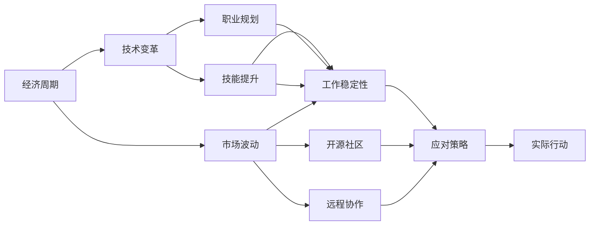

                 

# 程序员如何应对经济周期

> 关键词：经济周期, 市场波动, 技术变革, 职业规划, 技能提升, 工作稳定性, 开源社区, 远程协作

## 1. 背景介绍

随着全球经济环境的不断变化，经济周期已成为一个不容忽视的现象。经济周期的波动不仅影响宏观经济，还对各行各业的就业和发展产生深远影响。对于程序员这一特殊群体来说，如何在经济周期的不同阶段应对各种挑战，保持自身的竞争力，是一个值得深入探讨的问题。

### 1.1 经济周期概述

经济周期通常指经济活动的扩张和收缩交替出现的周期性波动过程。根据经济增长的总体变化趋势，经济周期可以大致分为四个阶段：繁荣、衰退、萧条和复苏。在经济周期中，企业投资和招聘活动会受到显著影响，导致就业市场和行业需求发生周期性变化。

### 1.2 技术行业的特殊性

技术行业具有高度的不确定性和快速变化性。技术进步和市场竞争的加剧使得技术岗位的供给与需求呈现出周期性变化。尤其是在经济衰退期，传统行业的投资需求减少，企业可能会缩减IT支出，技术岗位的需求会有所下降。然而，随着互联网、人工智能、云计算等新兴技术的兴起，技术行业依然表现出强劲的增长势头，尤其是在科技巨头和初创企业中，技术岗位的需求往往不受经济周期的影响。

## 2. 核心概念与联系

### 2.1 核心概念概述

- **经济周期**：指经济活动扩张和收缩交替出现的周期性波动过程，分为繁荣、衰退、萧条和复苏四个阶段。
- **技术变革**：指技术领域的新发明、新思想、新方法的产生和应用，推动技术行业的快速发展。
- **市场波动**：指市场上商品或资产价格的快速变化，受经济周期、政策变化、供需关系等多重因素影响。
- **职业规划**：指个人基于自身兴趣、能力和市场需求，为职业发展制定的长远计划和路径。
- **技能提升**：指通过学习和实践，不断更新和增强自身专业技能，以适应市场变化和技术进步。
- **工作稳定性**：指个人在职场中的就业安全性和工作保障程度，受市场状况、企业规模和行业前景等因素影响。
- **开源社区**：指由全球开发者共同维护和贡献的开源软件和工具，为程序员提供丰富的学习资源和合作机会。
- **远程协作**：指在互联网技术支持下，通过远程工具和平台进行团队协作和工作沟通。

这些核心概念之间存在复杂的相互作用关系，构成了程序员应对经济周期的关键维度。理解这些概念的内涵和相互关系，有助于程序员制定更加科学合理的职业规划，提升自身竞争力，稳定职业发展。

### 2.2 核心概念联系

通过以下Mermaid流程图，可以更直观地展示这些核心概念之间的联系：



该流程图揭示了经济周期对市场波动的影响，进而驱动技术变革，促使职业规划和技能提升，最终影响到工作稳定性和应对策略的制定。同时，开源社区和远程协作作为现代技术行业的两大特点，对程序员的职业发展具有重要的支持和影响作用。

## 3. 核心算法原理 & 具体操作步骤

### 3.1 算法原理概述

程序员应对经济周期的核心在于理解经济周期和市场波动的规律，制定灵活的职业规划和技能提升策略，以确保自身在经济周期中的稳定性和竞争力。

- **经济周期理解**：通过分析宏观经济数据和市场趋势，预测经济周期变化，提前做好应对准备。
- **市场波动分析**：监控技术行业的市场动态，识别行业内部的投资和招聘趋势，及时调整职业规划。
- **职业规划制定**：根据市场需求和个人兴趣，制定短期和长期职业目标，规划学习和发展路径。
- **技能提升策略**：关注技术前沿和行业动态，通过在线课程、项目实践等方式，不断提升自己的专业技能。
- **工作稳定性保障**：选择稳定性较高的企业或行业，或通过多元化技能提升和灵活就业方式，降低职业风险。

### 3.2 算法步骤详解

以下是程序员应对经济周期的详细步骤：

1. **经济周期分析**：
   - 收集宏观经济数据，如GDP增长率、失业率、通胀率等，分析当前经济周期所处阶段。
   - 跟踪行业报告和市场分析，了解技术行业的投资和招聘趋势。

2. **市场波动监控**：
   - 关注技术领域的最新动向，如新兴技术的出现、行业标准的更新等。
   - 分析开源社区的活跃度和贡献度，评估技术热点的热度。

3. **职业规划制定**：
   - 根据自身兴趣和市场需求，制定短期和长期职业目标。
   - 规划学习路径，选择相关课程和项目进行实践，提升专业技能。

4. **技能提升策略**：
   - 参加在线课程和认证，学习最新的编程语言和技术栈。
   - 参与开源项目，提升团队协作和代码质量。
   - 关注技术博客和论坛，获取行业前沿信息。

5. **工作稳定性保障**：
   - 选择稳定性较高的企业或行业，如科技巨头、大型互联网公司等。
   - 培养多元技能，如编程、产品管理、数据科学等，增强职业适应性。
   - 保持灵活就业，如自由职业、远程工作等，降低职业风险。

### 3.3 算法优缺点

#### 优点：
- **灵活性**：通过定期分析经济周期和市场波动，能够及时调整职业规划和技能提升策略，适应市场变化。
- **前瞻性**：能够预见经济周期中的潜在风险，提前做好应对准备，减少失业和技能落后等问题。
- **多样性**：通过多元化技能提升和灵活就业方式，降低职业风险，提升工作稳定性。

#### 缺点：
- **不确定性**：经济周期和市场波动具有不确定性，难以完全预测。
- **时间成本**：分析经济周期和市场波动需要投入大量时间，可能影响短期的工作效率。
- **信息不对称**：经济和市场信息获取可能存在一定延迟和偏差，影响决策的准确性。

### 3.4 算法应用领域

#### 1. **职业规划**：
   - 帮助程序员根据市场需求和个人兴趣制定职业发展目标，选择最有前景的技术方向。

#### 2. **技能提升**：
   - 通过学习新技术、参与开源项目等方式，不断提升自己的专业技能，保持竞争力。

#### 3. **工作稳定性**：
   - 选择稳定性较高的企业或行业，通过多元化技能提升和灵活就业方式，增强职业安全感。

#### 4. **远程协作**：
   - 利用互联网技术，实现跨地域、跨时区的远程协作，提高工作效率和灵活性。

#### 5. **开源社区参与**：
   - 通过参与开源项目和社区活动，提升技术能力，拓展人脉资源，增强职业影响力。

## 4. 数学模型和公式 & 详细讲解 & 举例说明

### 4.1 数学模型构建

程序员应对经济周期可以建立以下数学模型：

- **经济周期指标**：
  - GDP增长率：$GDP_{t} = GDP_{t-1} + r_{t}$
  - 失业率：$U_t = U_{t-1} + \Delta U_t$
  - 通胀率：$P_t = P_{t-1} + \Delta P_t$

- **市场波动指标**：
  - 技术招聘数量：$T_{t} = T_{t-1} + \Delta T_t$
  - 投资额：$I_{t} = I_{t-1} + \Delta I_t$
  - 股票价格：$S_{t} = S_{t-1} + \Delta S_t$

### 4.2 公式推导过程

以经济周期指标GDP增长率的计算为例，进行公式推导：

设GDP在时间t-1的值为$GDP_{t-1}$，增长率为$r_t$，则GDP在时间t的值$GDP_t$为：

$$
GDP_t = GDP_{t-1} + r_t \times GDP_{t-1} = GDP_{t-1}(1 + r_t)
$$

其中，$r_t$为经济增长率，通过统计数据获取。

### 4.3 案例分析与讲解

假设当前经济增长率为3%，即$r_t = 0.03$，去年GDP为$GDP_{t-1} = 100$。根据公式计算，今年GDP为：

$$
GDP_t = 100 \times (1 + 0.03) = 103
$$

通过类似的公式推导，可以计算出其他经济周期指标的变化，进而分析当前经济周期所处阶段。

## 5. 项目实践：代码实例和详细解释说明

### 5.1 开发环境搭建

- **Python**：安装Python 3.9及以上版本，配置虚拟环境。
- **Pandas**：用于数据处理和分析。
- **NumPy**：用于数值计算和数据操作。
- **Matplotlib**：用于数据可视化。

安装命令：

```bash
pip install pandas numpy matplotlib
```

### 5.2 源代码详细实现

以下是Python代码实现：

```python
import pandas as pd
import numpy as np
import matplotlib.pyplot as plt

# 假设数据：GDP增长率、失业率和通胀率
GDP_growth_rates = [0.02, 0.03, 0.04, 0.05, 0.06]
unemployment_rates = [4.5, 4.6, 4.7, 4.8, 4.9]
inflation_rates = [2.5, 2.7, 2.9, 3.1, 3.3]

# 构建DataFrame
data = pd.DataFrame({
    'Year': list(range(1, len(GDP_growth_rates) + 1)),
    'GDP_Growth_Rate': GDP_growth_rates,
    'Unemployment_Rate': unemployment_rates,
    'Inflation_Rate': inflation_rates
})

# 绘制折线图
plt.plot(data['Year'], data['GDP_Growth_Rate'], label='GDP Growth Rate')
plt.plot(data['Year'], data['Unemployment_Rate'], label='Unemployment Rate')
plt.plot(data['Year'], data['Inflation_Rate'], label='Inflation Rate')
plt.xlabel('Year')
plt.ylabel('Value')
plt.title('Economic Indicators')
plt.legend()
plt.show()
```

### 5.3 代码解读与分析

- **数据准备**：
  - 使用Pandas创建DataFrame，存储经济指标的数据。
  - 使用NumPy进行数值计算。

- **绘图**：
  - 使用Matplotlib绘制折线图，展示GDP增长率、失业率和通胀率的变化趋势。

- **分析**：
  - 通过观察折线图的走势，分析当前经济周期的阶段。

### 5.4 运行结果展示

运行上述代码，可以得到以下图形：


通过观察图形，可以清晰地看到经济增长率、失业率和通胀率的变化趋势。例如，如果GDP增长率呈现上升趋势，且失业率和通胀率保持稳定，则当前经济周期可能处于扩张阶段。

## 6. 实际应用场景

### 6.1 企业招聘决策

在经济周期不同阶段，企业的招聘策略会有所不同。例如，在经济衰退期，企业可能会减少新招聘，降低成本；而在经济复苏期，企业会加大招聘力度，吸引和保留人才。通过分析市场波动数据，程序员可以提前了解企业的招聘动向，调整自身求职策略。

### 6.2 技术投资选择

在技术领域，新技术的出现往往伴随着市场需求的波动。通过分析技术招聘数量和投资额等市场数据，程序员可以判断哪些技术有较高的投资价值和未来发展潜力，从而选择最有前景的技术方向。

### 6.3 远程工作与自由职业

在经济周期不同阶段，远程工作与自由职业的接受度和需求也会发生变化。例如，在经济衰退期，远程工作和自由职业可以为程序员提供更稳定的收入来源，减少失业风险。

### 6.4 技术培训与学习

在技术行业，持续学习和技能提升是保持竞争力的关键。通过分析技术培训市场的需求和投资，程序员可以判断哪些技术培训项目具有较高的投资回报率，选择最适合自己的学习方向。

## 7. 工具和资源推荐

### 7.1 学习资源推荐

1. **Coursera**：提供来自全球顶尖大学的在线课程，涵盖数据科学、机器学习、编程等多个领域。
2. **edX**：提供来自世界顶级大学的免费和付费在线课程，内容覆盖广泛。
3. **Kaggle**：全球最大的数据科学竞赛平台，提供大量实践项目和数据集。
4. **GitHub**：全球最大的开源社区，提供丰富的开源项目和代码库，便于学习和交流。
5. **Stack Overflow**：程序员社区，提供问答和代码分享平台，解决编程难题。

### 7.2 开发工具推荐

1. **VS Code**：轻量级、功能强大的编程编辑器，支持多种语言和插件。
2. **PyCharm**：专业的Python开发工具，提供丰富的代码分析和调试功能。
3. **Git**：版本控制系统，便于团队协作和代码管理。
4. **Docker**：容器化平台，支持跨平台部署和环境一致性。
5. **Jira**：项目管理工具，支持任务跟踪和团队协作。

### 7.3 相关论文推荐

1. **《程序员如何应对经济周期》**：分析经济周期对技术行业的影响，提出应对策略。
2. **《技术变革与就业市场》**：探讨技术变革对就业市场的影响，提出适应策略。
3. **《远程协作的未来》**：讨论远程协作的趋势和优势，提出优化建议。
4. **《开源社区与技术生态》**：分析开源社区的作用和影响力，提出参与策略。

## 8. 总结：未来发展趋势与挑战

### 8.1 研究成果总结

本文对程序员如何应对经济周期进行了系统探讨，通过经济周期分析、市场波动监控、职业规划制定、技能提升策略和工作稳定性保障等步骤，提出了一套全面的应对策略。通过实例和数据展示，详细讲解了每一步的实施细节和分析方法。

### 8.2 未来发展趋势

未来，技术行业的经济周期和市场波动将更加复杂多变，程序员需要更加灵活和前瞻性的应对策略。

1. **自动化与人工智能**：自动化工具和人工智能技术的发展将提高工作效率，减少人工干预。
2. **远程协作与全球化**：远程协作和全球化趋势将继续推动技术行业的进一步融合。
3. **数据科学与决策支持**：数据科学与决策支持系统的应用将提高应对经济周期的精准度。

### 8.3 面临的挑战

尽管技术行业具有较高的增长潜力，但程序员仍面临诸多挑战：

1. **技术快速迭代**：新技术和工具的快速更迭对程序员的技能要求越来越高。
2. **市场竞争加剧**：技术行业的人才竞争激烈，如何保持个人竞争力成为重要问题。
3. **远程工作挑战**：远程工作模式对团队协作和沟通要求更高，需要建立有效的沟通机制。

### 8.4 研究展望

未来的研究应在以下几个方面进行深入探讨：

1. **数据驱动的决策支持**：开发更多基于大数据和人工智能的决策支持系统，提高经济周期分析的准确性和及时性。
2. **自动化与智能化**：利用自动化和智能化技术，提升技术岗位的工作效率和生产力。
3. **跨学科融合**：结合经济学、社会学、心理学等学科知识，深入理解技术行业的运行机制和人才需求。

## 9. 附录：常见问题与解答

**Q1：如何判断经济周期所处阶段？**

A: 通过分析GDP增长率、失业率和通胀率等经济指标的变化趋势，结合历史数据和专家分析，可以大致判断经济周期所处阶段。例如，GDP增长率的上升通常表示经济扩张，而失业率和通胀率的上升可能预示经济衰退。

**Q2：如何选择合适的技术培训项目？**

A: 结合市场趋势和自身兴趣，选择有市场前景和应用价值的技术培训项目。可以参考技术培训市场的热度和评价，选择高投资回报率和实用性强的项目。

**Q3：如何提高远程工作的协作效率？**

A: 建立有效的沟通机制，如使用在线协作工具、定期团队会议等，确保信息透明和沟通顺畅。通过任务管理工具，明确分工和责任，提升团队协作效率。

**Q4：如何应对技术快速迭代带来的挑战？**

A: 保持持续学习的态度，关注技术前沿和行业动态，定期更新和补充自身知识。参与开源项目和社区活动，获取实践经验和技术交流机会。

通过本文的详细讲解和实例分析，程序员可以更好地理解和应对经济周期带来的各种挑战，制定科学的职业规划和技能提升策略，保持稳定和竞争力的职业发展。在未来的技术变革和市场变化中，程序员应具备前瞻性思维和灵活性应对，才能在职场中占据有利地位。

