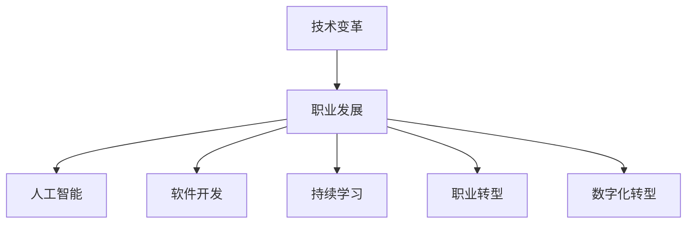

                 

# 程序员如何应对行业变革与转型

> 关键词：技术变革, 职业发展, 人工智能, 软件开发, 持续学习, 职业转型, 数字化转型

## 1. 背景介绍

### 1.1 问题由来

在21世纪科技飞速发展的背景下，行业变革已不可避免地到来。无论是在制造业、零售业、金融业，还是教育、医疗等传统领域，自动化、数字化、智能化正在逐步改变企业的运营模式。对于程序员，无论是在产品开发、系统运维，还是数据分析等岗位，技术变革带来的影响深远而巨大。

技术变革不仅改变了企业的生产方式和运营效率，也对从业者的职业发展提出了新的挑战和要求。程序员必须适应新环境，不断提升自身能力，以保持竞争力。而本文将探讨如何通过技术学习与实践，适应行业变革，实现职业转型与发展。

### 1.2 问题核心关键点

行业变革与转型所带来的核心挑战包括：
- **技术更新快速**：新兴技术不断涌现，需要不断学习新知识以适应变化。
- **岗位要求变化**：企业需求发生变化，传统岗位职责不断拓展。
- **跨领域融合**：多种技术需求融合，跨学科知识成为必要。
- **持续学习压力**：终身学习成为常态，持续提升能力至关重要。
- **职业路径选择**：需明确新环境下的职业发展方向，进行职业规划。

## 2. 核心概念与联系

### 2.1 核心概念概述

本文将介绍几个关键概念及其相互联系：

- **技术变革 (Technological Change)**：新技术、新方法、新工具不断涌现，原有的技术体系和工具集不断更新迭代。
- **职业发展 (Career Development)**：通过技术学习、技能提升、项目实践等方式，实现个人职业生涯的提升。
- **人工智能 (Artificial Intelligence, AI)**：机器学习、深度学习、自然语言处理等技术的应用，推动各行各业向智能化方向发展。
- **软件开发 (Software Development)**：涉及系统设计、需求分析、编码实现、测试部署等全栈流程。
- **持续学习 (Continuous Learning)**：通过在线课程、书籍、论坛等渠道不断学习新知识和技能。
- **职业转型 (Career Transition)**：根据行业需求和个人兴趣，选择新的职业方向并实现转型。
- **数字化转型 (Digital Transformation)**：企业通过数字化技术提升业务效率和竞争力。

这些概念通过一条主线的联系起来，共同构成程序员应对行业变革与转型的框架：



通过理解这些概念之间的逻辑关系，可以更好地把握行业变革与转型的本质，为应对这些变化制定有效策略。

## 3. 核心算法原理 & 具体操作步骤

### 3.1 算法原理概述

应对行业变革与转型的核心算法原理是通过持续学习和技能提升，不断适应新技术和岗位需求。该算法原理基于以下假设：

- 个人技能和知识是动态变化的。
- 新技能和新知识可以通过学习获得。
- 新技术和新工具的应用能够提升效率和竞争力。

其核心步骤包括：

1. 识别行业趋势和技术变革方向。
2. 确定需要学习的新技能和新工具。
3. 制定学习计划和实践路径。
4. 通过项目实践验证和优化学习效果。

### 3.2 算法步骤详解

#### 3.2.1 识别行业趋势和技术变革方向

- **调研市场与企业需求**：通过行业报告、技术博客、招聘信息等渠道，了解当前和未来技术趋势。
- **参与行业活动**：参加技术会议、研讨会、技术沙龙，与行业专家交流，获取最新动态。
- **加入技术社区**：加入GitHub、Stack Overflow等技术社区，关注热门项目和讨论，跟踪技术发展。

#### 3.2.2 确定需要学习的新技能和新工具

- **技能盘点**：评估现有技能与新岗位要求之间的差距。
- **目标设定**：根据行业需求和个人兴趣，设定学习目标和技能提升路径。
- **资源选择**：选择合适的学习资源，如在线课程、书籍、视频等。

#### 3.2.3 制定学习计划和实践路径

- **时间管理**：合理安排学习时间，保证每日有固定时间进行学习。
- **学习方法**：采用混合学习方法，如观看视频、阅读书籍、参加实战项目等。
- **技能验证**：通过小项目或开源贡献，验证所学技能。

#### 3.2.4 通过项目实践验证和优化学习效果

- **项目选择**：选择与所学技能相关的实际项目，提升实战能力。
- **问题解决**：通过解决项目中遇到的问题，积累经验和技能。
- **反馈迭代**：根据项目反馈，调整学习计划和方法，优化学习效果。

### 3.3 算法优缺点

#### 3.3.1 算法优点

- **灵活性**：学习方式多样化，适合不同时间、地点和需求。
- **实用性**：通过实践验证技能，能够快速应用到实际工作中。
- **效率提升**：掌握新技能后，可以提升工作效率和业务价值。

#### 3.3.2 算法缺点

- **时间和精力投入**：持续学习需要大量时间和精力，可能与日常生活发生冲突。
- **学习资源选择**：优质学习资源稀缺，需要花费时间筛选和筛选。
- **反馈和评估**：学习效果的评估和优化需要时间和经验，存在一定滞后性。

### 3.4 算法应用领域

该算法适用于各种软件开发岗位，包括前端开发、后端开发、全栈开发、数据开发、测试等。具体应用领域包括：

- **技术栈更新**：通过学习新语言、新框架、新工具，更新技术栈。
- **系统架构优化**：通过学习新的系统设计理念和方法，提升系统架构质量。
- **项目管理提升**：学习敏捷开发、DevOps等管理方法，提升项目管理和交付效率。
- **数据科学与分析**：学习大数据、机器学习、深度学习等技术，进行数据驱动决策。

## 4. 数学模型和公式 & 详细讲解 & 举例说明

### 4.1 数学模型构建

本文使用机器学习模型来类比程序员的技能提升过程。假设技能提升的效果由学习时间和学习质量决定，可构建如下数学模型：

- 设 $T$ 为学习时间，$Q$ 为学习质量。
- 技能提升效果 $P = f(T, Q)$，其中 $f$ 为映射函数，$P$ 表示技能提升的程度。

模型中 $T$ 和 $Q$ 的取值通常需要通过实验和实践来确定，不同的学习资源和项目实践对 $T$ 和 $Q$ 的影响不同。

### 4.2 公式推导过程

为了简化模型，假定 $f(T, Q)$ 为线性关系，即：

$$
P = k_1T + k_2Q
$$

其中 $k_1$ 和 $k_2$ 为模型参数，需要通过实际数据进行拟合。

### 4.3 案例分析与讲解

- **学习时间优化**：通过实验数据拟合出 $k_1$ 和 $k_2$，并确定最优学习时间分配策略。
- **学习质量提升**：通过项目实践和反馈，优化学习资源选择和评估方法。
- **实际应用**：根据模型预测结果，制定个人学习计划，优化技能提升效果。

## 5. 项目实践：代码实例和详细解释说明

### 5.1 开发环境搭建

以下是使用Python进行机器学习项目开发的开发环境配置流程：

1. **安装Python**：从官网下载并安装Python，选择最新版本。
2. **安装Anaconda**：安装Anaconda，用于创建独立的Python环境。
3. **创建虚拟环境**：
```bash
conda create -n my_env python=3.8
conda activate my_env
```

4. **安装依赖包**：
```bash
pip install numpy pandas matplotlib sklearn scikit-learn jupyter notebook
```

5. **启动Jupyter Notebook**：
```bash
jupyter notebook
```

完成上述步骤后，即可在`my_env`环境中开始机器学习项目开发。

### 5.2 源代码详细实现

以下是一个简单的机器学习项目，使用线性回归模型进行技能提升效果的预测：

```python
import numpy as np
from sklearn.linear_model import LinearRegression
from sklearn.model_selection import train_test_split

# 生成模拟数据
T = np.linspace(0, 100, 1000)
Q = np.random.randn(1000)
P = 0.5 * T + 0.8 * Q + np.random.randn(1000)

# 分割数据集
X_train, X_test, y_train, y_test = train_test_split(T, P, test_size=0.2)

# 训练模型
model = LinearRegression()
model.fit(X_train.reshape(-1, 1), y_train)

# 预测效果
y_pred = model.predict(X_test.reshape(-1, 1))

# 输出结果
print("R-squared:", model.score(X_test.reshape(-1, 1), y_test))
```

### 5.3 代码解读与分析

**模型生成**：使用NumPy生成模拟数据，其中 $T$ 为学习时间，$Q$ 为学习质量，$P$ 为技能提升效果。

**数据分割**：将数据集分割为训练集和测试集，以验证模型效果。

**模型训练**：使用线性回归模型对训练集进行拟合，得到模型参数 $k_1$ 和 $k_2$。

**效果预测**：使用模型对测试集进行预测，输出预测结果和R-squared指标。

**结果解读**：分析R-squared指标，判断模型预测效果和参数选择是否合理。

## 6. 实际应用场景

### 6.1 智能制造

在智能制造领域，通过持续学习和技能提升，程序员可以参与智能设备和生产系统的开发和维护。例如，学习物联网技术、机器人编程、数据处理等新技能，提升工业自动化水平。

具体应用包括：
- 开发智能传感器和监测系统。
- 实现机器人自动化操作和路径规划。
- 进行数据分析和预测维护。

### 6.2 智慧城市

智慧城市建设需要大量信息技术人才，程序员可以参与智能交通、智慧能源、公共安全等领域的项目。

具体应用包括：
- 开发智能交通管理系统。
- 实现智慧能源监控和优化。
- 构建公共安全监控和预警系统。

### 6.3 在线教育

在线教育平台需要程序员开发课程管理系统、智能推荐系统、互动直播等功能。

具体应用包括：
- 开发智能学习助手，根据学生行为和成绩进行个性化推荐。
- 实现互动直播系统，提高教学效果。
- 开发课程管理平台，支持在线课程发布和管理。

### 6.4 未来应用展望

未来，随着技术变革的加速，程序员需要掌握更多跨领域的知识和技能。具体展望如下：

- **人工智能与大数据**：掌握AI算法和大数据技术，支持智能决策和分析。
- **区块链与加密技术**：学习区块链和加密技术，保障数据安全和隐私。
- **云计算与边缘计算**：了解云计算和边缘计算架构，提升系统可扩展性和可靠性。
- **人机交互与自然语言处理**：掌握自然语言处理技术，实现人机交互系统的智能化。

## 7. 工具和资源推荐

### 7.1 学习资源推荐

以下是几款推荐的在线学习平台和资源：

- **Coursera**：提供大量高质量的在线课程，涵盖计算机科学、数据科学、人工智能等多个领域。
- **edX**：由哈佛大学和麻省理工学院联合创办，提供多种专业课程和证书。
- **Udacity**：专注于编程和技能培训，提供纳米学位和微专业课程。
- **Kaggle**：数据科学竞赛平台，通过参与实际项目，提升数据分析和机器学习技能。
- **Stack Overflow**：技术问答社区，积累编程问题和解决方案，提升问题解决能力。

### 7.2 开发工具推荐

以下是几款推荐的开发工具：

- **GitHub**：全球最大的代码托管平台，支持版本控制和协作开发。
- **Jupyter Notebook**：交互式编程环境，支持Python、R等多种语言，方便编写和调试代码。
- **PyCharm**：Python IDE，提供代码补全、调试、测试等一站式开发工具。
- **Visual Studio Code**：轻量级代码编辑器，支持多种语言和插件。
- **Google Colab**：基于Jupyter Notebook的在线开发环境，免费提供GPU/TPU算力。

### 7.3 相关论文推荐

以下是几篇经典的相关论文，推荐阅读：

- **Artificial Intelligence: A Modern Approach**：人工智能领域的经典教材，涵盖了人工智能的各个分支和技术。
- **Deep Learning**：深度学习领域的经典教材，介绍了深度学习的基本原理和应用。
- **Programming Pearls**：计算机编程领域的经典书籍，提供了编程中的经典问题和解决方案。
- **Machine Learning Yearning**：由深度学习专家Andrew Ng撰写，介绍了机器学习的最佳实践和经验。
- **The Humble Programmer**：程序设计领域的经典书籍，介绍了程序设计的思考方式和技巧。

## 8. 总结：未来发展趋势与挑战

### 8.1 总结

本文全面介绍了程序员如何应对行业变革与转型的方法，从技术变革到职业发展，详细探讨了核心概念和算法原理。通过项目实践和案例分析，说明了如何制定有效的学习计划和实践路径。

通过本文的系统梳理，程序员可以更好地理解技术变革和职业发展的内在联系，制定有效的应对策略，实现职业转型与发展。

### 8.2 未来发展趋势

未来，技术变革的步伐将进一步加快，程序员需要不断提升自身能力，才能保持竞争力。具体发展趋势如下：

- **技术栈多元化**：掌握多种编程语言和技术栈，实现跨平台和跨技术的开发。
- **知识结构化**：构建系统的知识结构，提升整体技能和思维能力。
- **应用场景多样化**：参与跨领域的项目和应用，拓展职业发展空间。
- **终身学习**：保持持续学习的习惯，适应技术演进的节奏。

### 8.3 面临的挑战

程序员在应对行业变革与转型的过程中，将面临诸多挑战：

- **技术更新快**：需要不断学习新知识，跟上技术发展步伐。
- **跨领域知识**：需掌握跨领域的知识和技能，提升综合能力。
- **时间和精力**：平衡学习和工作，需要高效的时间管理。
- **资源选择**：找到高质量的学习资源和实践机会。
- **效果评估**：及时评估学习效果，进行优化和调整。

### 8.4 研究展望

未来的研究需要在以下几个方面进行突破：

- **终身学习系统**：构建终身学习平台，提供个性化推荐和学习路径。
- **技能验证机制**：开发技能评估工具，帮助开发者验证技能掌握情况。
- **跨领域知识库**：构建跨领域知识库，方便程序员获取多领域的知识。
- **自动化学习工具**：开发自动化学习工具，提升学习效率。

## 9. 附录：常见问题与解答

**Q1: 如何平衡学习和工作？**

A: 制定合理的学习计划，将学习时间融入工作和生活，利用碎片时间进行学习。

**Q2: 如何选择合适的学习资源？**

A: 根据学习目标和兴趣，选择质量高、评价好的学习资源，如Coursera、edX、Udacity等平台。

**Q3: 学习效果如何评估？**

A: 通过项目实践、在线评测和反馈，评估学习效果，及时调整学习计划。

**Q4: 如何提升学习效率？**

A: 采用混合学习方法，结合在线课程、书籍、视频等多种资源，提高学习效果。

**Q5: 如何获取跨领域的知识？**

A: 参与跨领域项目和开源社区，积累多领域的实践经验，构建跨领域的知识结构。

---

作者：禅与计算机程序设计艺术 / Zen and the Art of Computer Programming

