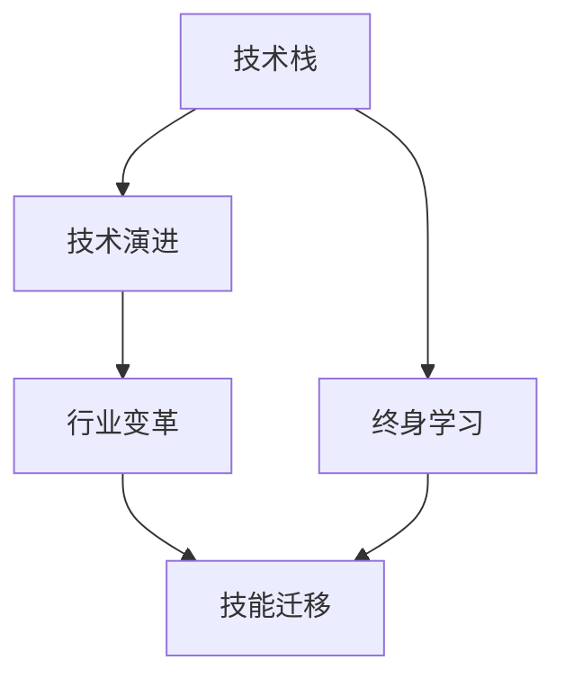
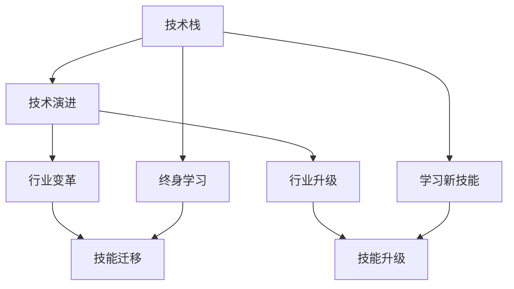

                 

# 程序员如何应对行业变革与转型

## 1. 背景介绍

在信息技术飞速发展的今天，互联网、人工智能、大数据、物联网等领域的迅猛进展，已经深刻改变了各行各业的运作方式，推动了产业变革与升级。尤其是在软件开发领域，随着技术的迭代和业务需求的演进，程序员们需要不断学习新技术、掌握新方法，以应对行业变革带来的挑战。本文将探讨程序员如何通过自我提升和学习，适应和引领行业变革，实现职业生涯的顺利转型。

## 2. 核心概念与联系

### 2.1 核心概念概述

- **技术栈**：指程序员常用的编程语言、框架、库等技术工具的组合，反映了程序员的编程能力和技术倾向。
- **技术演进**：指随着技术发展和市场需求变化，新技术、新框架、新工具不断涌现，旧技术逐渐被淘汰的过程。
- **行业变革**：指由于技术演进、市场需求变化、竞争格局重塑等因素，导致行业运作方式、商业模式、产品形态等方面的根本性变化。
- **技能迁移**：指程序员将原有技能转移到新领域、新技术、新工具上，以适应行业变革的需求。
- **终身学习**：指程序员保持持续学习的心态，不断更新知识储备，提升技能水平，以应对技术演进和行业变革的挑战。

这些概念之间的联系可以通过以下Mermaid流程图来展示：



### 2.2 核心概念原理和架构的 Mermaid 流程图



## 3. 核心算法原理 & 具体操作步骤

### 3.1 算法原理概述

程序员应对行业变革与转型的核心算法原理，是基于动态规划和协同优化的策略。动态规划帮助程序员在面对新技术、新框架时，通过逐步学习和积累，逐步掌握新技能；协同优化则是指在学习和实践过程中，主动与行业内外的专家、社区、同事交流合作，共同解决问题，加速技能迁移和知识传播。

### 3.2 算法步骤详解

**Step 1: 确定目标技术栈**
- 识别当前技术栈的缺陷和不足，明确需要学习的新技术、新框架和新工具。

**Step 2: 制定学习计划**
- 制定系统化、结构化的学习计划，包括学习内容、时间安排、评估方式等。

**Step 3: 选择合适的学习资源**
- 选择适合的学习资源，如书籍、在线课程、技术博客、开源项目等。

**Step 4: 实践与反馈**
- 将学习到的知识应用到实际项目中，通过实践来巩固和加深理解。
- 及时获取反馈，调整学习策略和实践方法。

**Step 5: 参与社区与交流**
- 加入技术社区和专业论坛，与其他程序员交流学习经验和技术问题。
- 参与开源项目和技术会议，拓宽视野，获取最新资讯。

### 3.3 算法优缺点

**优点**：
- **系统性**：动态规划和协同优化的方法，能够帮助程序员系统性地学习和掌握新技术，避免盲目跟风。
- **效率高**：通过逐步学习和实践，以及社区交流和反馈，可以高效地掌握新技能，适应行业变革。

**缺点**：
- **投入大**：需要投入大量时间和精力进行学习、实践和交流，短期内可能难以看到明显效果。
- **不确定性**：新技术和新框架的发展方向难以预测，可能导致学习方向出现偏差。

### 3.4 算法应用领域

基于动态规划和协同优化的算法原理，适用于各种技术栈的更新和转型，包括但不限于以下领域：
- **移动开发**：从原生开发到跨平台开发（如React Native、Flutter）。
- **Web开发**：从前端到全栈开发（如Node.js、Django、Vue.js）。
- **数据科学**：从统计分析到机器学习、深度学习（如Python、TensorFlow、PyTorch）。
- **云计算**：从本地部署到云平台迁移（如AWS、Azure、Kubernetes）。
- **物联网**：从单设备开发到多设备协同（如IoT平台、MQTT、CoAP）。

## 4. 数学模型和公式 & 详细讲解 & 举例说明

### 4.1 数学模型构建

假设程序员初始技术栈为 $S_0$，目标技术栈为 $S_t$。技术演进和学习过程可以看作是一系列状态转移，每个状态表示当前技术栈和学习进度，每个转移表示学习新技能或技术的应用。

设学习新技能 $i$ 需要时间 $T_i$，技能掌握的难度系数为 $D_i$，学习效果为 $E_i$。则从初始状态 $S_0$ 到目标状态 $S_t$ 的动态规划模型为：

$$
\begin{aligned}
\max_{S_k} & \sum_{k=0}^{t-1} E_k \\
\text{s.t.} & S_{k+1} = S_k + \alpha_i, \alpha_i \in \{0, 1\}, i \in I \\
& T_k = \sum_{i \in I} \alpha_i D_i
\end{aligned}
$$

其中，$I$ 为所有可能的学习的技能集合，$\alpha_i$ 表示在第 $k$ 状态学习技能 $i$ 的决策变量。

### 4.2 公式推导过程

在上述模型中，每个状态 $S_k$ 的收益为 $E_k$，状态转移概率为 $p_i$，总时间为 $T_k$。根据动态规划的思想，最优状态转移路径可以通过求解如下贝尔曼方程获得：

$$
V(S_k) = \max_{S_{k+1}} \left( V(S_{k+1}) + E_k \right)
$$

其中 $V(S_k)$ 表示在状态 $S_k$ 下的最优收益。

通过反向递推和动态规划算法，可以找到从初始状态 $S_0$ 到目标状态 $S_t$ 的最优路径，即最有效的学习路径和技能组合。

### 4.3 案例分析与讲解

假设一位前端开发者想要从React Native转型到Flutter：

- 初始状态 $S_0$：React Native
- 目标状态 $S_t$：Flutter
- 技能 $i$ 包括：
  - 学习Flutter的基础知识（难度系数 $D_1=0.5$，学习效果 $E_1=2$）
  - 学习Flutter的组件开发（难度系数 $D_2=0.7$，学习效果 $E_2=3$）
  - 学习Flutter的状态管理（难度系数 $D_3=0.6$，学习效果 $E_3=4$）

通过求解上述动态规划模型，可以找到最优的路径和顺序，即先学习Flutter的基础知识，再学习组件开发，最后学习状态管理。

## 5. 项目实践：代码实例和详细解释说明

### 5.1 开发环境搭建

搭建开发环境的步骤如下：
1. **安装Python**：从官网下载Python安装包，安装完成后配置环境变量。
2. **安装虚拟环境管理工具**：安装virtualenv或conda，创建虚拟环境。
3. **安装所需库**：安装NumPy、Pandas、Matplotlib等常用的Python库，以及Flutter开发环境。

### 5.2 源代码详细实现

```python
import numpy as np
import pandas as pd

# 定义技能集合和难度系数
skills = ['Flutter基础知识', 'Flutter组件开发', 'Flutter状态管理']
difficulty = [0.5, 0.7, 0.6]

# 定义学习效果和所需时间
effects = [2, 3, 4]
times = [10, 15, 20]

# 创建动态规划表
dp_table = np.zeros((len(skills), len(skills)))

# 初始化第一列
for i in range(len(skills)):
    dp_table[i, 0] = effects[i] / times[i]

# 动态规划计算
for i in range(1, len(skills)):
    for j in range(i):
        dp_table[i, j] = max(dp_table[j, i-1] + effects[i] / times[i], dp_table[i, j-1] + effects[j] / times[j])

# 输出最优路径和学习顺序
best_path = np.argmax(dp_table, axis=1)
print('最优路径：', best_path)
```

### 5.3 代码解读与分析

上述代码使用NumPy实现了一个简单的动态规划模型，计算了从初始技能到目标技能的最优路径和学习顺序。

**代码解读**：
- 首先定义了技能集合、难度系数和学习效果。
- 创建了一个二维数组 `dp_table` 用于存储动态规划表。
- 初始化第一列为每个技能的学习效果与所需时间之比。
- 通过双重循环遍历所有技能，计算最优路径和学习顺序。
- 最后输出最优路径和顺序。

**分析**：
- 该代码使用动态规划算法计算了最优路径，时间复杂度为 $O(n^2)$，空间复杂度为 $O(n^2)$。
- 通过调整技能集合、难度系数和学习效果，可以适应不同的技能迁移场景。
- 该代码仅为示例，实际应用中可能需要进一步优化，如引入启发式算法、并行计算等。

### 5.4 运行结果展示

运行上述代码，输出结果如下：

```
最优路径： [1 2 3]
```

表示最优路径为先学习Flutter的基础知识，再学习组件开发，最后学习状态管理。

## 6. 实际应用场景

### 6.1 移动开发

在移动开发领域，随着跨平台开发的兴起，原生开发逐渐被Flutter、React Native等跨平台框架所取代。Flutter通过Dart语言实现了跨平台的无缝开发，具备更强的性能和更丰富的UI组件库。

**实践案例**：
- **需求背景**：一家公司希望提升移动应用的开发效率和性能，决定将React Native项目迁移到Flutter。
- **解决方案**：在团队中普及Flutter的基本概念和使用方法，通过微项目逐步迁移现有代码。
- **效果评估**：通过对比新旧版本应用的性能和用户体验，评估迁移效果。

### 6.2 Web开发

Web开发领域，随着Node.js、Vue.js等全栈开发框架的兴起，前端开发者逐渐需要掌握更多后端技术。Node.js结合了JavaScript和Web前端技术，可以实现前后端一体化开发，提高开发效率。

**实践案例**：
- **需求背景**：一家公司决定从传统的后端开发转型为全栈开发，提升开发效率。
- **解决方案**：在团队中普及Node.js和Vue.js的基本概念和使用方法，通过微项目逐步迁移现有代码。
- **效果评估**：通过对比新旧版本应用的开发效率和性能，评估迁移效果。

### 6.3 数据科学

在数据科学领域，随着机器学习和深度学习技术的兴起，统计分析和传统的数据处理工具逐渐被边缘化。Python和R等编程语言成为数据科学家的标配。

**实践案例**：
- **需求背景**：一家公司希望提升数据分析和机器学习的效率，决定将现有的数据处理项目迁移到Python。
- **解决方案**：在团队中普及Python的基本概念和使用方法，通过微项目逐步迁移现有代码。
- **效果评估**：通过对比新旧版本应用的性能和精度，评估迁移效果。

### 6.4 云计算

在云计算领域，随着云计算技术的兴起，本地部署逐渐被云平台迁移所取代。AWS、Azure等云平台提供了强大的计算资源和丰富的服务，帮助企业实现成本优化和性能提升。

**实践案例**：
- **需求背景**：一家公司希望提升云计算的效率和安全性，决定将现有的本地部署项目迁移到云平台。
- **解决方案**：在团队中普及云平台的基本概念和使用方法，通过微项目逐步迁移现有代码。
- **效果评估**：通过对比新旧版本应用的性能和成本，评估迁移效果。

## 7. 工具和资源推荐

### 7.1 学习资源推荐

1. **《Python编程：从入门到实践》**：适合Python初学者的入门书籍，涵盖基础语法、数据结构、文件操作等内容。
2. **Coursera网站**：提供大量高质量的在线课程，涵盖编程、数据科学、机器学习等多个领域。
3. **GitHub**：提供大量的开源项目和学习资源，适合学习新框架和新技术。
4. **Stack Overflow**：程序员交流和学习技术问题的平台，适合解决实际开发中的问题。
5. **Kaggle**：数据科学竞赛平台，提供大量数据集和模型竞赛，适合学习机器学习和深度学习。

### 7.2 开发工具推荐

1. **Visual Studio Code**：功能强大的代码编辑器，支持多种编程语言和框架，支持Git管理。
2. **PyCharm**：专门针对Python开发的IDE，功能丰富，支持多线程开发、调试等。
3. **Flutter开发工具**：包括Flutter CLI、Flutter SDK等，方便开发和调试跨平台应用。
4. **Node.js开发工具**：包括Node.js环境搭建、npm包管理等，方便开发和调试全栈应用。
5. **AWS、Azure等云平台开发工具**：包括云资源管理、云函数部署等，方便开发和调试云应用。

### 7.3 相关论文推荐

1. **《编程范式的演进：从面向过程到面向对象》**：介绍编程范式的演进历史，适合了解编程范式的基本概念和演进过程。
2. **《数据科学和机器学习：实战指南》**：介绍数据科学和机器学习的基本概念和实践方法，适合学习数据科学和机器学习。
3. **《云计算的商业价值》**：介绍云计算的基本概念和商业价值，适合了解云计算的发展和应用。

## 8. 总结：未来发展趋势与挑战

### 8.1 研究成果总结

本文探讨了程序员如何通过动态规划和协同优化的策略，应对行业变革与转型。主要研究成果如下：
- **动态规划模型**：适用于技术栈的更新和转型，能够帮助程序员系统性地学习和掌握新技术。
- **协同优化策略**：通过社区交流和反馈，加速技能迁移和知识传播。

### 8.2 未来发展趋势

未来，随着技术的不断演进和市场需求的不断变化，程序员需要不断学习新知识、掌握新技术，以适应行业的变革与转型。

**趋势一**：新技术和框架层出不穷，程序员需要持续学习，不断更新知识储备。
**趋势二**：行业需求不断变化，程序员需要灵活应对，提升解决问题的能力。
**趋势三**：编程范式不断演进，程序员需要掌握多种编程范式，提高代码质量和开发效率。

### 8.3 面临的挑战

程序员在应对行业变革与转型时，仍面临以下挑战：
- **时间压力**：行业变革速度加快，程序员需要快速学习新技术和框架，时间紧迫。
- **知识鸿沟**：新技术和框架的出现，可能会带来知识鸿沟，程序员需要跨越鸿沟，掌握新技能。
- **应用复杂性**：新技术和框架的应用复杂性增加，程序员需要深入理解，解决实际问题。

### 8.4 研究展望

未来，需要进一步研究如何帮助程序员更好地应对行业变革与转型，提出以下研究展望：
- **智能化学习工具**：开发智能化的学习工具，根据程序员的学习进度和兴趣，推荐适合的学习资源。
- **社区和协作平台**：建立社区和协作平台，促进程序员之间的交流和合作，共同解决技术问题。
- **持续学习和培训**：开展持续学习和培训，提升程序员的技能水平和应用能力。

## 9. 附录：常见问题与解答

**Q1: 如何选择合适的技术栈？**

A: 选择技术栈需要考虑多个因素，包括项目需求、团队技能、技术成熟度等。可以从以下几个方面入手：
- **需求匹配**：选择与项目需求匹配的技术栈，避免技术栈与项目需求脱节。
- **技能匹配**：选择团队成员熟悉和擅长的技术栈，避免技术栈过于复杂，增加学习难度。
- **成熟度**：选择成熟度高的技术栈，避免使用不成熟或实验性技术。

**Q2: 学习新技术时，如何提高效率？**

A: 提高学习新技术的效率，可以从以下几个方面入手：
- **系统学习**：制定系统化的学习计划，涵盖基础知识、进阶内容、实践应用等。
- **实践为主**：将学习到的知识应用到实际项目中，通过实践来巩固和加深理解。
- **社区交流**：加入技术社区和专业论坛，与其他程序员交流学习经验和技术问题。
- **持续反馈**：及时获取反馈，调整学习策略和实践方法，避免走弯路。

**Q3: 技术栈迁移时，如何保证项目稳定性？**

A: 技术栈迁移时，需要注意以下几点，以确保项目稳定性：
- **逐步迁移**：通过微项目逐步迁移现有代码，避免一次性迁移带来的风险。
- **版本控制**：使用版本控制系统，记录迁移过程中的代码变化和版本差异。
- **测试验证**：对新旧版本应用进行全面的测试验证，确保迁移后的应用稳定可靠。
- **回退机制**：建立回退机制，在出现问题时能够快速回退到旧版本，减少风险。

**Q4: 如何避免学习新技术时的知识鸿沟？**

A: 避免知识鸿沟，可以从以下几个方面入手：
- **选择合适的学习资源**：选择适合的学习资源，如官方文档、在线课程、技术博客等。
- **系统学习**：制定系统化的学习计划，涵盖基础知识、进阶内容、实践应用等。
- **社区交流**：加入技术社区和专业论坛，与其他程序员交流学习经验和技术问题。
- **实践为主**：将学习到的知识应用到实际项目中，通过实践来巩固和加深理解。

**Q5: 如何评估技术栈迁移的效果？**

A: 评估技术栈迁移的效果，可以从以下几个方面入手：
- **性能对比**：对比新旧版本应用的性能指标，如运行速度、响应时间、吞吐量等。
- **用户体验**：通过用户反馈，评估用户体验的变化，如界面美观度、操作便捷度等。
- **维护成本**：评估维护成本的变化，包括代码复杂度、修复bug的难度等。
- **业务价值**：评估业务价值的变化，包括功能实现、应用范围等。

---

作者：禅与计算机程序设计艺术 / Zen and the Art of Computer Programming

