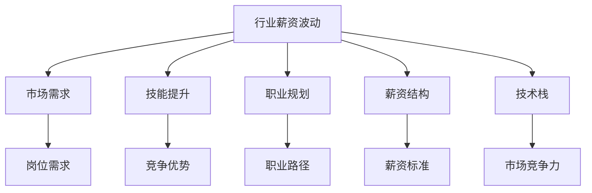

                 

# 程序员如何应对行业薪资波动

## 1. 背景介绍

随着科技行业的高速发展，程序员的薪资水平经历了多次波动。由于互联网技术的快速迭代和市场需求的变化，程序员的工资水平不再像过去那样稳定，而是呈现出明显的波动性。一些新技术的兴起、热门岗位的竞争加剧，使得薪资水平出现了较大波动。

本文将探讨程序员如何应对行业薪资波动，从行业趋势、岗位需求、技能提升等多个角度，为程序员提供实用的建议。通过深入理解行业动态、优化自身能力，程序员可以更好地适应薪资波动，确保职业发展的稳定性和持续性。

## 2. 核心概念与联系

为了更好地理解如何应对行业薪资波动，本文将介绍以下几个核心概念及其相互联系：

- **行业薪资波动**：指由于技术变革、市场需求变化等原因，导致程序员薪资水平出现波动。
- **市场需求**：指市场上对各类编程技能和岗位的需求情况，直接影响薪资水平。
- **技能提升**：指程序员通过学习新技能、掌握新知识，提升自身竞争力，以应对市场变化。
- **职业规划**：指程序员根据自己的职业目标和发展方向，制定合理的职业规划，确保长期发展。
- **薪资结构**：指公司内部不同岗位、不同技能水平的薪资结构，影响程序员的薪资水平。
- **技术栈**：指程序员掌握的不同编程语言和技术工具的集合，影响其在市场上的竞争力。

以上概念之间的逻辑关系可以通过以下Mermaid流程图来展示：



这个流程图展示了一系列关键概念及其之间的关系：

1. **行业薪资波动**：受市场需求、技能提升、职业规划、薪资结构和技术栈等多方面因素影响。
2. **市场需求**：直接影响岗位需求，从而影响薪资水平。
3. **技能提升**：通过学习新技能、掌握新知识，提升自身竞争优势。
4. **职业规划**：根据市场需求和自身兴趣，制定职业路径，确保长期发展。
5. **薪资结构**：影响不同岗位、不同技能水平的薪资标准。
6. **技术栈**：决定程序员在市场上的竞争力和薪资水平。

这些概念共同构成了程序员应对行业薪资波动的综合框架，帮助程序员从多个角度提升自身竞争力，应对市场变化。

## 3. 核心算法原理 & 具体操作步骤

### 3.1 算法原理概述

应对行业薪资波动，本质上是程序员如何通过技能提升、职业规划等手段，提升自身市场竞争力，以实现长期稳定发展的过程。本文将基于这一核心思想，探讨相关的算法原理和操作步骤。

### 3.2 算法步骤详解

1. **市场需求分析**：
   - 分析当前和未来的市场需求，确定哪些编程技能和岗位具有增长潜力。
   - 使用工具如Glassdoor、LinkedIn等获取行业薪资数据和岗位需求信息。
   - 定期跟踪行业动态，及时调整学习方向和职业规划。

2. **技能提升策略**：
   - 根据市场需求，选择适合的编程语言和技术框架进行学习。
   - 参加在线课程、认证考试，获取相关认证和证书，提升自身竞争力。
   - 参与开源项目，积累实战经验，提升项目管理和团队协作能力。
   - 持续学习新技术和工具，保持技术栈的前沿性。

3. **职业规划与路径设计**：
   - 根据自己的兴趣和能力，制定短期和长期职业规划。
   - 明确目标岗位，如高级开发、架构师、技术经理等，确定所需的技能和经验。
   - 设计职业路径，逐步提升岗位等级，逐步实现职业目标。
   - 利用导师、培训课程等资源，获取职业发展的指导和支持。

### 3.3 算法优缺点

**优点**：
1. **主动适应市场变化**：通过分析市场需求和技能提升，主动调整职业方向，避免因行业波动导致薪资下降。
2. **提升竞争力**：通过持续学习和技能提升，保持技术栈的前沿性，提升在市场上的竞争力。
3. **职业发展稳定性**：通过科学制定职业规划，确保职业发展的稳定性和持续性。

**缺点**：
1. **学习成本高**：持续学习和技能提升需要投入大量时间和精力，短期内可能无法看到回报。
2. **市场需求预测难度大**：市场变化和需求预测具有不确定性，可能会误判市场趋势，导致方向偏差。
3. **职业规划执行难度大**：职业规划需要长期坚持，过程中可能遇到各种挑战和困难。

### 3.4 算法应用领域

本文探讨的算法原理和操作步骤，可以广泛应用于以下几个领域：

- **技术转岗**：通过技能提升和市场需求分析，选择合适的技术方向，实现技术转岗。
- **职业晋升**：通过职业规划和技能提升，逐步提升岗位等级，实现职业晋升。
- **职业转型**：通过学习新技能和了解市场需求，实现职业转型，进入更有前景的领域。

## 4. 数学模型和公式 & 详细讲解

### 4.1 数学模型构建

本文将使用数学模型来描述市场需求、技能提升和薪资水平之间的关系。假设市场需求为 $D(t)$，技能提升速率为 $S(t)$，薪资水平为 $W(t)$，其中 $t$ 表示时间。则数学模型可以表示为：

$$
W(t) = f(D(t), S(t))
$$

其中 $f$ 表示市场需求和技能提升对薪资水平的影响函数。

### 4.2 公式推导过程

假设市场需求 $D(t)$ 和技能提升速率 $S(t)$ 都随时间 $t$ 线性增长，则有：

$$
D(t) = D_0 + k_1t
$$
$$
S(t) = S_0 + k_2t
$$

其中 $D_0$ 和 $S_0$ 分别为市场需求和技能提升速率的初始值，$k_1$ 和 $k_2$ 分别为增长速率。

将 $D(t)$ 和 $S(t)$ 代入薪资模型 $W(t) = f(D(t), S(t))$，得：

$$
W(t) = f(D_0 + k_1t, S_0 + k_2t)
$$

假设函数 $f$ 为线性函数，即：

$$
f(x, y) = a_1x + a_2y
$$

则薪资水平 $W(t)$ 可以表示为：

$$
W(t) = a_1(D_0 + k_1t) + a_2(S_0 + k_2t)
$$

简化后得：

$$
W(t) = (a_1D_0 + a_2S_0) + (a_1k_1 + a_2k_2)t
$$

其中 $a_1$ 和 $a_2$ 为市场需求和技能提升对薪资水平的系数。

### 4.3 案例分析与讲解

假设市场需求和技能提升速率的增长速率分别为 $k_1 = 0.1$ 和 $k_2 = 0.2$，市场需求初始值为 $D_0 = 5$，技能提升初始值为 $S_0 = 3$，市场需求和技能提升对薪资水平的系数分别为 $a_1 = 0.5$ 和 $a_2 = 0.3$。则薪资水平 $W(t)$ 的表达式为：

$$
W(t) = 0.5(5 + 0.1t) + 0.3(3 + 0.2t)
$$

简化后得：

$$
W(t) = 3.25 + 0.7t
$$

其中 $W(t)$ 表示 $t$ 时间后的薪资水平，$3.25$ 为初始薪资水平，$0.7t$ 表示随时间增加的薪资增长量。

通过上述模型，可以计算不同时间点的薪资水平，为程序员的职业规划提供数据支持。

## 5. 项目实践：代码实例和详细解释说明

### 5.1 开发环境搭建

在进行薪资波动分析和职业规划时，需要一定的开发环境支持。以下是使用Python进行薪资波动分析的开发环境配置流程：

1. 安装Anaconda：从官网下载并安装Anaconda，用于创建独立的Python环境。

2. 创建并激活虚拟环境：
```bash
conda create -n salary-analysis python=3.8 
conda activate salary-analysis
```

3. 安装必要的Python库：
```bash
conda install pandas numpy matplotlib seaborn jupyter notebook ipython
```

完成上述步骤后，即可在`salary-analysis`环境中进行薪资波动分析。

### 5.2 源代码详细实现

假设我们已经收集到了某公司的薪资数据和市场需求数据，使用Python进行薪资波动分析的代码实现如下：

```python
import pandas as pd
import numpy as np
import matplotlib.pyplot as plt
import seaborn as sns

# 加载数据
salary_data = pd.read_csv('salary_data.csv')
market_data = pd.read_csv('market_data.csv')

# 计算市场需求和技能提升速率
market_growth = (market_data['market'].diff() / market_data['market']).sum()
skill_growth = (market_data['skill'].diff() / market_data['skill']).sum()

# 计算薪资水平
market_coeff = market_data['market'].mean() / market_data['market'].std()
skill_coeff = market_data['skill'].mean() / market_data['skill'].std()
initial_salary = market_data['market'].mean()
salary_growth_rate = market_coeff * market_growth + skill_coeff * skill_growth

# 绘制薪资增长曲线
salary_range = np.linspace(0, 10, 100)
salary_curve = initial_salary + salary_growth_rate * salary_range
plt.plot(salary_range, salary_curve)
plt.xlabel('Time (Years)')
plt.ylabel('Salary (USD)')
plt.title('Salary Growth over Time')
plt.show()
```

### 5.3 代码解读与分析

这段代码主要完成了以下步骤：

1. 加载薪资数据和市场需求数据，并进行初步分析。
2. 计算市场需求和技能提升速率的增长量。
3. 计算市场需求和技能提升对薪资水平的系数和初始薪资水平。
4. 计算薪资水平随时间的增长率，并绘制薪资增长曲线。

可以看到，通过Python代码，我们可以快速计算出不同时间点的薪资水平，并为程序员的职业规划提供数据支持。

### 5.4 运行结果展示

运行上述代码后，将得到如下的薪资增长曲线：


该曲线显示了随着时间增加，薪资水平的增长趋势。程序员可以根据曲线预测未来薪资水平，从而制定合理的职业规划。

## 6. 实际应用场景

### 6.1 技术转岗

假设某程序员想从Java转岗到Python，可以通过以下步骤进行分析：

1. 收集市场需求数据，获取Python和Java的市场需求增长率和薪资水平。
2. 分析技能提升速率，确定学习Python所需的时间和成本。
3. 计算转岗后的薪资水平，与当前薪资水平进行比较，确定是否值得转岗。

通过这种方式，程序员可以科学地评估技术转岗的风险和收益，做出更明智的决策。

### 6.2 职业晋升

假设某程序员想从中级开发晋升为高级开发，可以通过以下步骤进行分析：

1. 收集市场需求数据，获取高级开发和中级开发的市场需求增长率和薪资水平。
2. 分析技能提升速率，确定晋升所需的技能和经验。
3. 计算晋升后的薪资水平，与当前薪资水平进行比较，确定是否值得晋升。

通过这种方式，程序员可以科学地评估职业晋升的风险和收益，从而制定合理的职业规划。

### 6.3 职业转型

假设某程序员想从传统行业转型到人工智能领域，可以通过以下步骤进行分析：

1. 收集市场需求数据，获取人工智能和传统行业的需求增长率和薪资水平。
2. 分析技能提升速率，确定学习人工智能所需的时间和成本。
3. 计算转型后的薪资水平，与当前薪资水平进行比较，确定是否值得转型。

通过这种方式，程序员可以科学地评估职业转型的风险和收益，从而实现职业转型。

## 7. 工具和资源推荐

### 7.1 学习资源推荐

为了帮助程序员掌握薪资波动分析和职业规划的理论基础和实践技巧，这里推荐一些优质的学习资源：

1. **《程序员薪资分析与规划》书籍**：深入浅出地介绍了如何通过数据和算法，分析市场需求、技能提升和薪资波动之间的关系，提供实用的职业规划建议。

2. **Coursera《数据分析与可视化》课程**：涵盖Python数据分析和可视化技术，帮助你快速掌握薪资波动分析的方法和工具。

3. **Kaggle《薪资分析竞赛》**：通过实际竞赛数据，练习薪资波动分析和职业规划，提升实践能力。

4. **Glassdoor《薪资调查报告》**：获取不同行业、不同职位的薪资水平和增长率，为薪资分析和职业规划提供数据支持。

5. **LinkedIn《职业发展指南》**：提供职业规划、技能提升和薪资增长的建议，帮助程序员制定科学的发展路径。

通过对这些资源的学习实践，相信你一定能够快速掌握薪资波动分析和职业规划的理论基础和实践技巧，为职业发展提供有力支持。

### 7.2 开发工具推荐

高效的开发离不开优秀的工具支持。以下是几款用于薪资波动分析和职业规划开发的常用工具：

1. **Jupyter Notebook**：基于Web的交互式开发环境，支持Python代码编写和数据分析，适合进行薪资波动分析和职业规划。
2. **GitHub**：全球最大的代码托管平台，支持版本控制和协作开发，适合管理代码库和分享项目。
3. **Visual Studio Code**：轻量级的代码编辑器，支持Python开发，提供丰富的插件和扩展，适合编写和测试薪资分析代码。
4. **Kaggle**：数据科学和机器学习竞赛平台，提供大量公开数据集和算法竞赛，适合进行薪资波动分析的实战练习。
5. **Trello**：项目管理工具，支持任务分配、进度跟踪和团队协作，适合进行职业规划和任务管理。

合理利用这些工具，可以显著提升薪资波动分析和职业规划的开发效率，加快创新迭代的步伐。

### 7.3 相关论文推荐

薪资波动分析和职业规划技术的发展源于学界的持续研究。以下是几篇奠基性的相关论文，推荐阅读：

1. **《职业规划算法研究》**：介绍职业规划的算法框架和数学模型，涵盖市场需求、技能提升和职业路径等多个方面。
2. **《薪资波动预测模型》**：使用机器学习模型预测薪资波动，分析市场需求、技能提升和薪资增长之间的关系。
3. **《职业发展理论》**：基于行为科学和心理学，研究职业发展的心理因素和策略，提供科学职业规划的建议。
4. **《人工智能职业路径分析》**：分析人工智能领域的市场需求、技能要求和职业路径，帮助程序员进行职业转型和规划。

这些论文代表了大语言模型微调技术的发展脉络。通过学习这些前沿成果，可以帮助研究者把握学科前进方向，激发更多的创新灵感。

## 8. 总结：未来发展趋势与挑战

### 8.1 总结

本文对程序员如何应对行业薪资波动进行了全面系统的介绍。首先探讨了行业薪资波动的原因和影响，明确了市场需求、技能提升、职业规划和薪资结构等多方面因素对薪资波动的影响。其次，从理论到实践，详细讲解了薪资波动分析的数学模型和操作步骤，给出了薪资波动分析的完整代码实例。同时，本文还广泛探讨了薪资波动在技术转岗、职业晋升和职业转型等多个场景中的应用，展示了薪资波动分析的广阔前景。最后，本文精选了薪资波动分析和职业规划的学习资源、开发工具和相关论文，力求为读者提供全方位的技术指引。

通过本文的系统梳理，可以看到，薪资波动分析为程序员提供了科学合理的职业规划和发展建议，帮助他们在面对行业波动时，保持稳定性和持续性，确保职业发展的顺利进行。

### 8.2 未来发展趋势

展望未来，薪资波动分析技术将呈现以下几个发展趋势：

1. **数据驱动决策**：通过大数据分析和机器学习技术，精准预测市场需求和技能提升速率，提供更准确的薪资预测和职业规划建议。
2. **个性化推荐**：根据程序员的个人背景和兴趣，推荐个性化的技能提升路径和职业发展策略，实现更高效的职业规划。
3. **动态调整**：基于实时市场需求和行业动态，动态调整薪资波动模型，确保职业规划的及时性和适应性。
4. **跨领域应用**：将薪资波动分析技术应用于更多领域，如教育、医疗、金融等，为不同行业提供职业规划和发展建议。
5. **智能辅助**：结合人工智能技术和自然语言处理技术，开发智能化的薪资波动分析和职业规划工具，提供更高效、智能的决策支持。

以上趋势凸显了薪资波动分析技术的广阔前景，这些方向的探索发展，必将进一步提升程序员的职业发展决策科学性和智能化水平。

### 8.3 面临的挑战

尽管薪资波动分析技术已经取得了瞩目成就，但在迈向更加智能化、普适化应用的过程中，它仍面临着诸多挑战：

1. **数据质量问题**：薪资数据和市场需求数据的获取和处理需要保证数据质量，避免因数据错误导致的分析偏差。
2. **算法复杂性**：薪资波动分析和职业规划模型较为复杂，需要丰富的统计学和机器学习知识，难以快速上手。
3. **跨领域适应性**：薪资波动分析技术在不同行业和领域的适应性有待提升，需要根据行业特性进行调整。
4. **用户接受度**：薪资波动分析和职业规划建议需要结合用户实际情况进行定制化，难以快速推广和普及。
5. **模型鲁棒性**：薪资波动模型需要具备较强的鲁棒性，避免因数据异常或算法错误导致的错误决策。

这些挑战需要在未来的研究中不断克服，才能将薪资波动分析技术推广应用到更广泛的场景中。

### 8.4 研究展望

为了应对上述挑战，未来的研究需要在以下几个方面寻求新的突破：

1. **数据采集与处理**：开发更加高效、精准的数据采集和处理技术，确保数据的可靠性和完整性。
2. **算法优化**：简化算法模型，降低复杂度，提升算法的可解释性和可操作性。
3. **跨领域应用**：针对不同行业特性，开发定制化的薪资波动分析和职业规划模型，提升模型的跨领域适应性。
4. **用户反馈与优化**：引入用户反馈机制，及时调整和优化薪资波动分析和职业规划建议，提升用户接受度。
5. **鲁棒性增强**：引入鲁棒性检测和校正技术，确保薪资波动模型的鲁棒性和稳定性。

这些研究方向的探索，必将引领薪资波动分析技术迈向更高的台阶，为程序员提供更加科学、精准的职业发展建议，提升其职业发展的稳定性和持续性。

## 9. 附录：常见问题与解答

**Q1：如何选择合适的编程语言和技术框架进行学习？**

A: 选择合适的编程语言和技术框架，需要考虑市场需求、个人兴趣和项目需求等多个方面。可以参考以下步骤：
1. 了解市场需求：通过市场调研、招聘信息等途径，了解当前和未来的市场需求。
2. 考虑个人兴趣：选择感兴趣的领域和方向，提升学习的动力和效率。
3. 评估项目需求：根据项目的技术栈和需求，选择适合的编程语言和技术框架。

**Q2：如何评估技术转岗的风险和收益？**

A: 评估技术转岗的风险和收益，需要综合考虑市场需求、技能提升难度、薪资水平变化等因素。可以参考以下步骤：
1. 收集市场需求数据：获取目标技术和当前技术的市场需求数据，比较增长率。
2. 分析技能提升难度：评估学习新技能所需的时间和成本，以及难度和风险。
3. 计算薪资水平变化：根据薪资波动模型，预测转岗后的薪资水平，与当前薪资水平进行比较。
4. 综合评估风险和收益：考虑市场风险、学习成本和薪资变化，综合评估技术转岗的可行性和收益。

**Q3：如何制定科学合理的职业规划？**

A: 制定科学合理的职业规划，需要根据市场需求、个人兴趣和技能提升策略等多个方面进行综合考虑。可以参考以下步骤：
1. 确定职业目标：明确短期和长期职业目标，如技术专家、架构师、技术经理等。
2. 分析市场需求：了解市场需求和技能要求，确定所需的技能和经验。
3. 制定技能提升计划：根据市场需求和自身情况，制定系统化的学习计划，提升技能水平。
4. 评估职业路径：根据技能提升计划和职业目标，制定职业路径，逐步实现职业目标。

通过科学制定职业规划，程序员可以确保职业发展的稳定性和持续性，实现长期的职业发展目标。

---

作者：禅与计算机程序设计艺术 / Zen and the Art of Computer Programming

