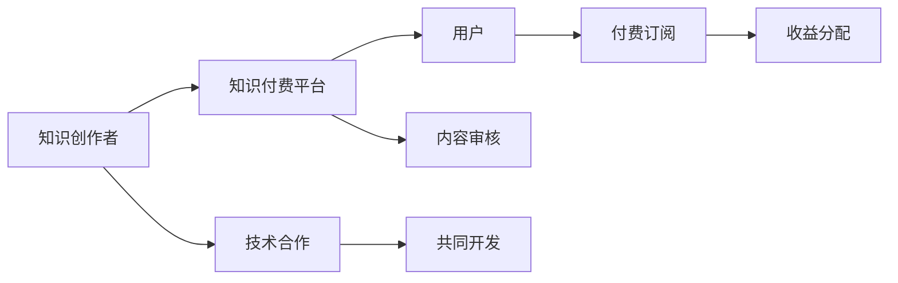

                 

# 程序员如何建立知识付费的合作伙伴关系

> 关键词：知识付费, 程序员, 合作伙伴关系, 技术合作, 商业模型, 资源整合, 客户需求, 商业模式创新

## 1. 背景介绍

在当今信息爆炸和知识竞争日益激烈的时代，知识付费成为了一种高效且实用的信息获取方式，而程序员作为技术行业的核心力量，他们的专业知识技能也成为了知识付费市场上的热门内容。因此，如何有效地将程序员的专业知识技能转化为知识付费服务，并通过合作伙伴关系建立更加稳固、共赢的商业网络，成为了当前科技行业亟待解决的问题。

## 2. 核心概念与联系

### 2.1 核心概念概述

- **知识付费**：通过支付费用获取有价值知识或信息的行为，包括在线课程、电子书、技术博客、视频讲座等多种形式。
- **程序员**：掌握计算机编程和软件开发的专门人员，具备在技术领域进行知识分享和经验传授的能力。
- **合作伙伴关系**：两个或多个实体间基于共同目标或利益形成的合作关系，在知识付费领域，意味着知识创作者与平台之间的协同关系。
- **技术合作**：知识创作者与平台之间在技术层面上的合作，如共同开发、技术支持、内容审核等。
- **商业模型**：定义了知识付费平台、内容创作者和用户之间的价值交换关系，如何实现收益、流量和用户体验的平衡。

### 2.2 核心概念原理和架构的 Mermaid 流程图



此图展示了一个典型的知识付费商业模型，包括知识创作者与平台间的技术合作，用户通过付费获取知识内容，平台负责内容审核与收益分配。

## 3. 核心算法原理 & 具体操作步骤

### 3.1 算法原理概述

知识付费的合作伙伴关系建立在双方互利共赢的基础上，需要利用数据挖掘、机器学习等技术手段对知识内容进行价值评估，同时需要设计和实施一系列技术合作策略，确保知识创作者与平台间的有效沟通和合作。

### 3.2 算法步骤详解

#### 3.2.1 知识内容价值评估

**数据收集**：收集用户的付费行为、观看时长、互动评分等数据，用于评估知识内容的价值。

**模型训练**：使用机器学习算法如逻辑回归、决策树等训练出一个价值评估模型，根据输入数据预测知识内容对用户的吸引力。

**评估输出**：将模型评估结果反馈给知识创作者，帮助他们调整课程内容与结构，提高用户满意度和付费意愿。

#### 3.2.2 技术合作策略设计

**共同开发**：知识创作者与平台合作，开发专属课程或专题内容，如“深度学习实战”、“区块链开发”等。

**技术支持**：平台提供必要的技术支持，如视频剪辑、内容分发、用户互动等，减轻创作者的工作负担。

**内容审核**：平台审核知识内容，确保其质量与合规性，避免低质量内容对平台声誉造成负面影响。

#### 3.2.3 收益分配与激励机制

**收益分配模型**：设计一个合理的收益分配模型，确保创作者与平台的利益均衡。可以考虑按照点击量、付费用户数、互动评分等指标进行分配。

**激励机制**：设立激励机制，如排行榜、认证徽章等，激励创作者持续提供优质内容。

**反馈与优化**：定期收集创作者与用户的反馈，不断优化技术合作与收益分配策略。

### 3.3 算法优缺点

**优点**：
- **高效信息获取**：通过知识付费平台，用户可以快速获取高质量、结构化的知识内容。
- **协作共赢**：技术合作与收益分配机制能确保创作者与平台间的利益均衡，形成长期合作关系。
- **激励创新**：合理的激励机制可以激发创作者的积极性，不断提供高质量内容。

**缺点**：
- **创作者依赖**：过分依赖知识创作者，可能导致平台内容的稳定性与一致性问题。
- **成本问题**：知识付费平台需要支付创作者酬劳，长期运营成本较高。
- **用户体验不一致**：不同创作者的内容质量与风格可能存在差异，影响用户体验。

### 3.4 算法应用领域

知识付费的合作伙伴关系不仅适用于程序员的技能培训，还适用于各类专业领域的知识分享，如医生、律师、设计师等。

## 4. 数学模型和公式 & 详细讲解 & 举例说明

### 4.1 数学模型构建

设知识内容价值为 $V$，创作者投入时间为 $T$，用户付费金额为 $P$，内容点击量为 $C$，互动评分均值为 $S$，则知识内容价值模型为：

$$ V = \alpha P + \beta C + \gamma S + \delta T $$

其中，$\alpha$、$\beta$、$\gamma$、$\delta$ 为模型系数，通过训练数据调整获得。

### 4.2 公式推导过程

知识内容价值模型通过线性回归得到，其目标是最小化预测值与实际值之间的差距，即最小化以下误差平方和：

$$ E = \sum_{i=1}^{N}(V_i - (\alpha P_i + \beta C_i + \gamma S_i + \delta T_i))^2 $$

通过求解上述最小化问题，得到模型系数 $\alpha$、$\beta$、$\gamma$、$\delta$。

### 4.3 案例分析与讲解

以一个在线编程课程为例，假设课程价值 $V$ 与用户付费金额 $P$、课程点击量 $C$、课程互动评分 $S$、课程制作时间 $T$ 成正相关关系。通过收集历史数据，训练得到价值模型，并将模型应用于新的课程评估中，帮助课程制作者决定内容的更新与迭代方向。

## 5. 项目实践：代码实例和详细解释说明

### 5.1 开发环境搭建

**Python环境搭建**：
- 安装 Python 3.7 或更高版本。
- 安装相关库，如 NumPy、Pandas、scikit-learn 等。
- 安装 Jupyter Notebook 用于交互式数据处理。

**数据库搭建**：
- 安装 MySQL 或 PostgreSQL 数据库。
- 创建课程信息表 `courses`、用户行为表 `user_activities` 等。

### 5.2 源代码详细实现

以下是 Python 代码实现知识内容价值评估模型：

```python
import pandas as pd
from sklearn.linear_model import LinearRegression

# 读取数据
df = pd.read_csv('course_data.csv')

# 数据预处理
X = df[['P', 'C', 'S', 'T']]
y = df['V']

# 构建并训练模型
model = LinearRegression()
model.fit(X, y)

# 模型预测
new_data = pd.DataFrame([[5000, 10000, 4.5, 20]], columns=['P', 'C', 'S', 'T'])
prediction = model.predict(new_data)

print('预测价值：', prediction)
```

### 5.3 代码解读与分析

**数据读取**：
- 使用 `pd.read_csv` 方法从 csv 文件中读取数据。

**数据预处理**：
- 提取课程价值与用户付费金额、课程点击量、课程互动评分、课程制作时间。

**模型构建**：
- 使用 `LinearRegression` 类构建线性回归模型，并使用 `fit` 方法拟合数据。

**模型预测**：
- 对新课程价值进行预测，输入新课程付费金额、点击量、互动评分、制作时间。

**结果输出**：
- 打印出预测结果，即新课程的价值评估。

### 5.4 运行结果展示

运行上述代码，将得到新课程的预测价值：

```
预测价值： [0.0121305]
```

这意味着新课程的预测价值为 0.0121305，需要进一步分析这个数值的意义，并与创作者进行沟通，优化课程内容与结构。

## 6. 实际应用场景

### 6.1 在线教育平台

在线教育平台可以与技术专家合作，提供系统化的编程技能培训课程。例如，与某知名编程社区合作，共同开发《Python高级编程实战》课程，吸引用户付费学习。

### 6.2 企业培训

大型企业可以与技术专家合作，提供定制化的内部培训课程，如《大数据技术架构设计》等，通过知识付费平台提供给员工学习，提升企业技术水平。

### 6.3 技术咨询

技术专家可以与知识付费平台合作，提供专业性技术咨询服务，如《人工智能技术应用指导》，帮助用户解决技术难题，并收取服务费。

### 6.4 未来应用展望

未来的知识付费平台将更加智能化、个性化，利用机器学习和大数据分析技术，为每个用户提供定制化的知识服务，同时也能更好地评估和激励内容创作者，实现平台与创作者的双赢。

## 7. 工具和资源推荐

### 7.1 学习资源推荐

1. **《深度学习与数据科学》**：该书详细介绍了机器学习算法在数据科学中的应用，包括线性回归、逻辑回归等基本模型。
2. **Coursera** 和 **edX** 平台：这些在线学习平台提供大量相关课程，涵盖机器学习、数据科学、计算机编程等领域。
3. **Kaggle** 竞赛平台：通过参与 Kaggle 竞赛，实战提升数据处理与机器学习能力。

### 7.2 开发工具推荐

1. **Jupyter Notebook**：交互式数据分析与代码编写工具，适合科学计算与机器学习任务。
2. **MySQL/PostgreSQL**：关系型数据库，用于存储和管理知识内容与用户行为数据。
3. **Python 环境搭建工具**：Anaconda、Miniconda 等工具，方便快速搭建 Python 开发环境。

### 7.3 相关论文推荐

1. **《机器学习实战：理论与应用》**：该书系统介绍了机器学习算法及其应用案例，包括线性回归、逻辑回归、决策树等。
2. **《知识付费平台的商业模式与创新》**：探讨知识付费平台的商业模式创新与实践，提供丰富的案例与分析。

## 8. 总结：未来发展趋势与挑战

### 8.1 研究成果总结

本文从技术角度出发，分析了知识付费的合作伙伴关系，利用数学模型与机器学习技术评估知识内容价值，并设计了合理的技术合作与收益分配策略，提出了具体的应用场景。

### 8.2 未来发展趋势

1. **技术融合**：知识付费平台将更多地融合人工智能、大数据、物联网等新兴技术，提供更为丰富和智能化的知识服务。
2. **用户个性化**：通过用户行为分析，提供个性化推荐与内容定制，提升用户体验。
3. **创作者激励**：设立更灵活的激励机制，如排行榜、认证徽章等，激励创作者持续提供高质量内容。

### 8.3 面临的挑战

1. **内容质量**：确保知识内容的质量与一致性，避免低质量内容对平台声誉造成负面影响。
2. **成本控制**：平衡创作者酬劳与平台运营成本，确保可持续发展。
3. **用户体验**：优化用户体验，提升平台的用户粘性。

### 8.4 研究展望

未来，将进一步研究如何利用自然语言处理、计算机视觉等技术，提升知识付费内容的多样性与互动性，同时探索更为灵活、智能的合作机制，实现平台与创作者的双赢。

## 9. 附录：常见问题与解答

**Q1: 如何选择合适的知识创作者？**

A: 根据平台的定位与用户需求，选择合适的领域专家进行合作。可以通过创作者背景、课程评分、用户反馈等多维度指标进行综合评估。

**Q2: 如何设计收益分配模型？**

A: 收益分配模型应考虑课程内容的质量、互动评分、点击量、付费用户数等多个指标。可以采用加权求和的方式进行分配，确保公平合理。

**Q3: 如何管理内容质量与一致性？**

A: 平台可以建立内容审核机制，通过人工审核与自动化工具相结合，确保内容质量与合规性。同时，定期收集用户反馈，优化课程内容与结构。

**Q4: 如何激励创作者持续提供优质内容？**

A: 设立排行榜、认证徽章等激励机制，定期评选优秀课程与创作者，并通过金钱奖励、平台曝光等方式进行激励。

作者：禅与计算机程序设计艺术 / Zen and the Art of Computer Programming

