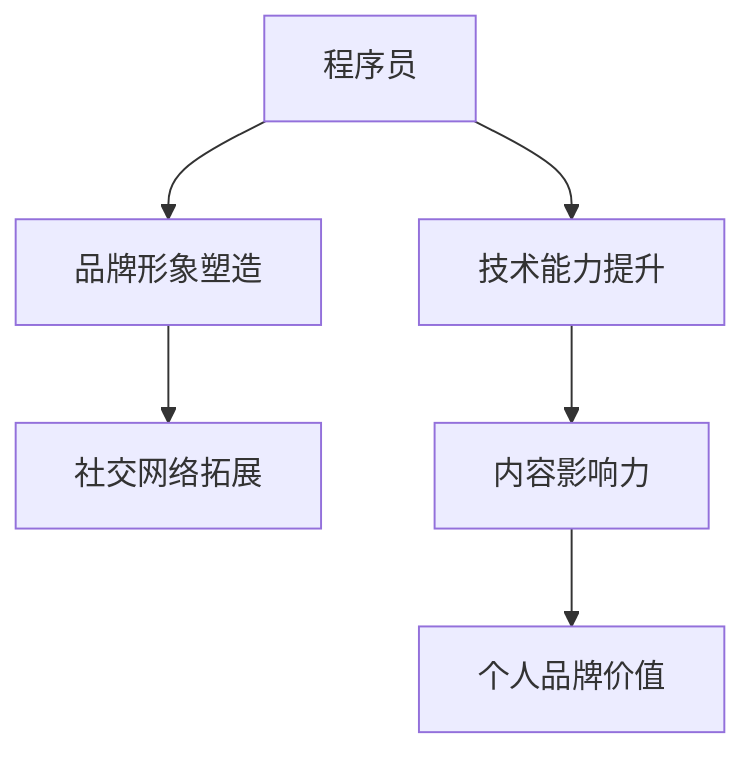

                 

# 程序员如何打造个人知识品牌IP

> 关键词：程序员, 知识品牌IP, 个人品牌打造, 技术博客, 代码分享, 技术社区, 知识分享

## 1. 背景介绍

在互联网时代，程序员不再只是编码机器，而成为技术知识的发声者。随着个人品牌IP的兴起，越来越多的程序员通过技术博客、开源项目、技术分享等方式，打造自己的知识品牌，不仅提升了自己的职业发展，也在社会上产生了深远影响。本文将从背景介绍、核心概念、算法原理到实践指南，全面系统地介绍程序员如何打造个人知识品牌IP。

## 2. 核心概念与联系

### 2.1 核心概念概述

打造个人知识品牌IP，不仅是对个人技术水平的提升，更是对个人影响力的扩展。核心概念包括：

- **程序员**：在互联网和软件开发领域工作的专业人员。
- **知识品牌IP**：通过分享技术知识，建立个人品牌影响力。
- **技术博客**：记录和分享技术经验的个人博客。
- **开源项目**：向公众开放的代码项目，可以促进技术交流与合作。
- **技术社区**：围绕特定技术领域形成的交流、学习和协作平台。
- **知识分享**：通过教学、讲座、培训等方式，将知识传递给更多人。

### 2.2 核心概念联系

构建个人知识品牌IP，是一个系统化的过程，涉及技术、品牌、社交等多方面内容。

- **技术能力提升**：通过不断学习新知识、掌握新技能，提升自身技术水平。
- **品牌形象塑造**：通过持续输出高质量内容，建立专业、可信赖的个人品牌形象。
- **社交网络拓展**：在技术社区、开源平台等社交网络上建立联系，扩大影响力。
- **内容影响力**：通过技术博客、开源项目等渠道，提升内容在技术界的认可度。
- **个人品牌价值**：将个人品牌与市场价值结合，通过商业变现实现收益。

这些概念之间的逻辑关系可以通过以下Mermaid流程图来展示：



## 3. 核心算法原理 & 具体操作步骤

### 3.1 算法原理概述

打造个人知识品牌IP，本质上是一个通过技术知识分享，不断提升个人影响力的过程。算法原理包括：

- **自监督学习**：通过大量无监督数据学习到通用知识。
- **知识迁移**：将通用知识迁移到特定领域，解决实际问题。
- **内容推荐算法**：通过算法推荐优质内容，吸引更多读者。
- **社交网络传播**：利用社交网络传播技术，扩大影响力。

### 3.2 算法步骤详解

**Step 1: 准备技术资源**
- 学习新技术，提升技术储备。
- 使用开源工具，如GitHub、Stack Overflow等。

**Step 2: 确定内容方向**
- 选择擅长的技术领域。
- 确定内容输出形式，如技术博客、开源项目、教学视频等。

**Step 3: 搭建输出平台**
- 选择适合的博客平台，如Medium、CSDN、博客园等。
- 创建开源项目，在GitHub上分享代码。

**Step 4: 发布优质内容**
- 编写高质量的技术文章，深入浅出地解释技术原理和应用。
- 维护开源项目，定期更新代码和文档。

**Step 5: 活跃技术社区**
- 在技术社区（如Stack Overflow、知乎、微信技术群等）积极互动。
- 参加技术会议和讲座，拓展人脉。

**Step 6: 运营社交媒体**
- 选择适合的社交媒体平台（如Twitter、LinkedIn、微信等）。
- 发布技术相关的文章和链接，吸引关注。

### 3.3 算法优缺点

打造个人知识品牌IP的算法具有以下优点：
- **广泛覆盖**：通过多种形式的内容输出，覆盖更广泛的受众。
- **高效传播**：借助社交网络，可以快速传播技术知识。
- **精准定位**：通过算法推荐，精准触达感兴趣的技术人群。

同时，也存在以下局限性：
- **时间成本高**：需要投入大量时间进行内容创作和技术分享。
- **内容质量要求高**：高质量的内容才能吸引读者和粉丝。
- **市场需求波动**：市场需求和技术变化会影响内容产出和传播效果。

### 3.4 算法应用领域

个人知识品牌IP的应用领域广泛，包括但不限于：

- **技术博客**：撰写技术文章，记录技术学习和实践过程。
- **开源项目**：共享代码和资源，促进技术交流和合作。
- **技术社区**：参与技术讨论，分享技术见解。
- **在线课程**：通过视频和直播，传授技术知识和技能。
- **技术讲座**：在行业会议和技术峰会上分享技术成果。

## 4. 数学模型和公式 & 详细讲解 & 举例说明

### 4.1 数学模型构建

个人知识品牌IP的数学模型，涉及技术影响力和社交网络的影响。

设 $T$ 为技术影响力，$S$ 为社交网络影响力。则整体影响力 $I$ 可以表示为：

$$
I = f(T, S)
$$

其中 $f$ 为一个非线性函数，表示技术和社交网络的相互作用。

### 4.2 公式推导过程

以技术博客为例，内容的影响力 $I$ 可以分解为内容质量和曝光度两个因素：

$$
I = C \times E
$$

其中 $C$ 为内容质量，$E$ 为内容曝光度。

内容质量 $C$ 可以通过读者反馈、点赞数等指标衡量。内容曝光度 $E$ 可以通过社交网络传播、搜索引擎优化等手段提升。

### 4.3 案例分析与讲解

假设某技术博客每月发布一篇文章，平均每篇文章被阅读 10,000 次，点赞数为 200 个。文章通过社交媒体传播，平均每篇文章被转发 500 次。则该博客的技术影响力 $T$ 和社交网络影响力 $S$ 可以分别计算为：

$$
T = 10,000 \times 200 = 2,000,000
$$

$$
S = 500 \times 500 = 250,000
$$

整体影响力 $I$ 为：

$$
I = f(T, S) = f(2,000,000, 250,000)
$$

通过不断优化技术内容和社交传播策略，可以进一步提升影响力。

## 5. 项目实践：代码实例和详细解释说明

### 5.1 开发环境搭建

#### 5.1.1 技术栈选择

技术栈的选择应根据内容形式和传播平台决定。例如，技术博客可以选择WordPress或Hexo，开源项目可以选择GitHub或GitLab。

#### 5.1.2 环境配置

以技术博客为例，可以使用Linux服务器搭建WordPress博客平台，配置必要的插件和主题。

### 5.2 源代码详细实现

#### 5.2.1 技术博客

- **博客搭建**：使用WordPress或Hexo搭建个人博客平台。
- **内容创作**：编写技术文章，使用Markdown格式编写，并发布到博客。
- **SEO优化**：使用SEO插件优化博客内容，提升搜索引擎排名。

#### 5.2.2 开源项目

- **项目创建**：在GitHub上创建开源项目，编写代码和文档。
- **版本控制**：使用Git进行版本控制，记录代码变更。
- **代码协作**：邀请社区成员参与代码审核和贡献。

### 5.3 代码解读与分析

#### 5.3.1 技术博客

技术博客的代码主要涉及WordPress插件和主题的配置，以及Markdown文件的内容编写。以下是一个简化的博客发布示例：

```python
from wordpress import WordPress

wp = WordPress(url='https://example.com', api_key='my_api_key')

# 创建博客文章
wp.create_post(
    title='My First Technical Article',
    content='This is my first technical article on [My Blog](https://example.com)',
    categories=['Technology'],
    tags=['Programming', 'Blogging']
)

# 获取博客文章列表
articles = wp.get_posts()
for article in articles:
    print(article.title)
```

#### 5.3.2 开源项目

开源项目的代码涉及Git和版本控制。以下是一个简化的GitHub开源项目示例：

```python
import os

# 克隆GitHub项目
repo_url = 'https://github.com/example/my_project.git'
os.system('git clone ' + repo_url)

# 创建本地分支
os.system('git checkout -b my_feature')

# 提交代码变更
os.system('git add .')
os.system('git commit -m "Add my feature"')

# 推送代码到远程分支
os.system('git push origin my_feature')
```

### 5.4 运行结果展示

#### 5.4.1 技术博客

- **文章发布**：通过博客平台发布文章，查看阅读数和点赞数。
- **社交分享**：通过社交媒体平台分享文章链接，查看转发和评论数。

#### 5.4.2 开源项目

- **代码提交**：通过GitHub提交代码变更，查看提交记录和贡献者列表。
- **代码协作**：邀请社区成员参与代码审核和贡献，查看代码变更和评论。

## 6. 实际应用场景

### 6.1 技术博客

**场景1: 技术分享与交流**
- **应用**：技术博客是程序员分享技术经验、交流技术见解的重要渠道。
- **优势**：形式灵活，内容丰富，便于读者理解和分享。
- **示例**：如DZone、Medium等平台上的技术博客。

**场景2: 职业发展与招聘**
- **应用**：技术博客可以作为简历补充，展示个人技术能力和项目经验。
- **优势**：权威可信，内容持续更新，吸引潜在雇主关注。
- **示例**：如CSDN、博客园等平台上的技术博客。

### 6.2 开源项目

**场景1: 代码贡献与合作**
- **应用**：开源项目可以吸引技术爱好者和开发者共同参与代码贡献和合作。
- **优势**：开源透明，社区活跃，促进技术交流与合作。
- **示例**：如GitHub上的开源项目，如TensorFlow、PyTorch等。

**场景2: 技术创新与突破**
- **应用**：通过开源项目，可以快速迭代技术方案，实现技术突破和创新。
- **优势**：汇聚全球开发者力量，加速技术研发进程。
- **示例**：如Kubernetes、Prometheus等开源项目。

### 6.3 技术社区

**场景1: 技术讨论与问题解答**
- **应用**：技术社区可以提供技术讨论平台，解答技术疑问。
- **优势**：平台活跃，知识丰富，便于技术交流和问题解决。
- **示例**：如Stack Overflow、知乎等平台。

**场景2: 技术学习与培训**
- **应用**：技术社区可以提供技术学习资源，提供在线课程和培训。
- **优势**：资源丰富，实时更新，便于技术学习与技能提升。
- **示例**：如Udemy、Coursera等在线学习平台。

## 7. 工具和资源推荐

### 7.1 学习资源推荐

- **《编程珠玑》**：学习编程技巧和算法优化的经典书籍。
- **《深入理解计算机系统》**：了解计算机底层原理和系统设计的必读书籍。
- **《Clean Code》**：提升代码质量和编程风格的经典书籍。
- **Coursera**：提供来自世界顶尖大学的在线课程。
- **edX**：提供高质量的在线课程和证书项目。

### 7.2 开发工具推荐

- **Git**：版本控制工具，支持代码管理、协作和发布。
- **GitHub**：开源代码托管平台，支持代码协作和版本控制。
- **Jupyter Notebook**：支持编写和运行Python代码的交互式平台。
- **PyCharm**：Python开发环境，支持代码调试和项目管理。
- **Visual Studio Code**：轻量级的代码编辑器，支持多种编程语言。

### 7.3 相关论文推荐

- **《软件工程的原理与实践》**：介绍软件开发和项目管理的基础知识。
- **《软件设计和模式》**：讲解软件设计原则和常用设计模式的经典书籍。
- **《云计算基础》**：介绍云计算原理和应用的必读书籍。
- **《深度学习》**：介绍深度学习理论和实践的经典书籍。
- **《人工智能》**：介绍人工智能基础理论和应用的经典书籍。

## 8. 总结：未来发展趋势与挑战

### 8.1 总结

本文全面系统地介绍了程序员如何打造个人知识品牌IP。从背景介绍到核心概念，从算法原理到实践指南，通过技术博客、开源项目、技术社区等具体案例，展示了如何通过技术知识分享，提升个人影响力。

### 8.2 未来发展趋势

- **技术生态更加繁荣**：技术博客和开源项目将更加繁荣，成为技术交流和合作的重要平台。
- **技术社区更加活跃**：技术社区将成为技术学习和协作的主要渠道，促进技术知识传播和应用。
- **内容质量不断提升**：高质量的技术文章和开源项目将逐渐增多，提升技术内容的影响力。
- **技术社区更加多元**：技术社区将涵盖更多技术领域，形成更全面的技术知识体系。
- **技术生态更加多样化**：除了传统的技术博客和开源项目，将涌现更多创新的内容形式和技术平台。

### 8.3 面临的挑战

- **时间成本高**：持续的技术学习和内容输出需要大量时间和精力。
- **内容质量要求高**：高质量的技术内容才能吸引读者和粉丝。
- **市场需求波动**：市场需求和技术变化会影响内容产出和传播效果。
- **竞争激烈**：技术博客和开源项目数量众多，如何脱颖而出是一大挑战。
- **技术门槛高**：技术内容的创作和传播需要较高的技术水平和知识储备。

### 8.4 研究展望

未来，个人知识品牌IP的发展方向包括：

- **内容多样化**：技术博客和开源项目将涵盖更多技术领域，内容形式更加多样化。
- **技术社区更加专业化**：技术社区将更加专业化，涵盖更多技术领域和应用场景。
- **技术合作更加紧密**：技术社区和技术平台将促进更紧密的技术合作和知识共享。
- **技术传播更加广泛**：通过技术博客和开源项目，技术知识将更广泛地传播和应用。

## 9. 附录：常见问题与解答

**Q1: 如何选择合适的技术博客平台？**

A: 选择合适的技术博客平台应考虑以下因素：
- **平台活跃度**：选择用户活跃、内容丰富的平台。
- **SEO优化能力**：选择支持SEO优化的平台，提升搜索引擎排名。
- **内容管理系统**：选择易于管理和更新的平台，方便内容创作和发布。

**Q2: 如何提升技术博客的阅读量和关注度？**

A: 提升技术博客的阅读量和关注度需要综合考虑以下因素：
- **内容质量**：提供高质量的技术文章和实例，解决实际问题。
- **SEO优化**：使用SEO工具优化文章标题、标签和描述，提升搜索引擎排名。
- **社交媒体传播**：通过社交媒体平台分享文章链接，吸引更多读者。

**Q3: 如何选择开源项目并参与贡献？**

A: 选择开源项目并参与贡献需要考虑以下因素：
- **项目活跃度**：选择活跃度高、维护良好的项目。
- **项目难度**：选择适合自己技术水平的项目，逐步提升技术能力。
- **社区贡献**：积极参与社区讨论和问题解答，提升社区影响力。

**Q4: 如何在技术社区中建立影响力？**

A: 在技术社区中建立影响力需要综合考虑以下因素：
- **积极互动**：积极参与技术讨论和问题解答，展示技术实力。
- **发布优质内容**：发布高质量的技术文章和代码，分享技术见解。
- **定期更新**：定期发布新内容，保持社区活跃度。

通过不断提升技术能力和积极参与技术社区，程序员可以逐步建立起自己的个人知识品牌IP，实现个人职业发展和影响力提升。未来，随着技术生态的不断繁荣和创新，个人知识品牌IP将迎来更广阔的发展空间。

