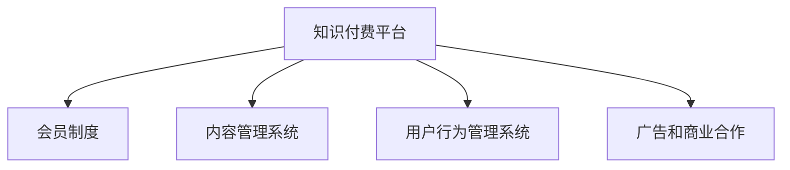

                 

## 1. 背景介绍

### 1.1 问题由来

在互联网发展的早期，知识和内容几乎不花费任何费用，任何人都可以获取并分享。然而，随着内容产出和传播的蓬勃发展，内容创造者面临着来自广告、付费会员等商业模式的激烈竞争。知识付费平台的兴起，让创作者能够更直接地从其知识输出中获益，推动了优质内容生产。

以知识付费平台“得到”为例，其核心竞争力在于其精选的课程和优质内容，而这些高质量内容是通过会员制度收费获取的。会员为获取优质内容而支付的会员费，成为平台内容的资金来源，使得更多优质内容创作者能够长期稳定地输出高质量作品，形成一个正向循环。

### 1.2 问题核心关键点

- **知识付费模式**：用户为获取优质内容而支付的会员费，是知识付费平台的核心商业模式。
- **会员制度**：通过设置分级会员服务，平台能够根据用户需求提供差异化、定制化的服务。
- **平台治理**：平台的治理包括版权管理、内容审核、用户行为管理等多个方面，确保内容质量和用户体验。

## 2. 核心概念与联系

### 2.1 核心概念概述

为更好地理解知识付费平台的会员制度，本节将介绍几个关键概念：

- **知识付费平台**：以精选内容为核心，提供付费会员服务的在线平台。
- **会员制度**：平台为不同需求的用户提供多层次的会员服务，以差异化收费方式满足不同用户的需求。
- **内容管理系统**：用于管理平台上的内容资源，确保内容的合法性、准确性和时效性。
- **用户行为管理系统**：监控用户行为，保障平台内容安全，避免不合法的使用。
- **广告和商业合作**：平台通过广告和商业合作获得收益，提升平台的商业模式多样性。

这些核心概念之间通过以下Mermaid流程图展示其联系：



这个流程图展示知识付费平台的各个组成部分及其相互关系：

1. 知识付费平台通过提供会员制度、内容管理系统、用户行为管理系统和广告商业合作等综合服务，实现商业模式的闭环。
2. 会员制度和内容管理系统是平台的核心，通过提供优质内容和分级会员服务，满足用户的多样化需求。
3. 用户行为管理系统保障平台内容的安全性，通过监控和管理用户行为，避免侵权行为。
4. 广告和商业合作为平台提供额外的收益来源，提升平台商业模式的可持续性。

## 3. 核心算法原理 & 具体操作步骤

### 3.1 算法原理概述

知识付费平台的会员制度，基于订阅经济的理念，通过差异化的会员服务，满足不同用户的多样化需求。具体来说，会员制度的设计包括以下几个关键要素：

- **定价策略**：通过市场调研和用户反馈，确定会员费用的标准和不同会员级别之间的价格差异。
- **会员权益**：根据会员级别，提供不同程度的权益，如优先访问内容、无限制下载、专家问答等。
- **会员管理**：通过用户行为数据，分析会员的活跃度和满意度，不断优化会员制度。
- **优惠策略**：推出新用户优惠、续费优惠等策略，吸引更多用户加入会员。

### 3.2 算法步骤详解

**Step 1: 市场调研与需求分析**

1. 调研目标用户群体的特点、需求和支付意愿。
2. 通过问卷调查、用户访谈等方式收集数据，了解用户的期望和痛点。
3. 分析市场需求，确定适合的平台定位和会员制度类型。

**Step 2: 会员级别与权益设计**

1. 根据调研结果，设计会员级别，一般包括基础会员、高级会员、超级会员等。
2. 确定各级别会员的权益，如基础会员可访问部分内容，高级会员可优先访问新内容等。
3. 通过问卷调查验证用户对不同会员权益的接受度。

**Step 3: 会员价格策略制定**

1. 根据会员权益和成本分析，确定各级别会员的定价标准。
2. 推出限时优惠、新用户优惠、续费优惠等策略，以降低用户试错成本。
3. 监控会员续费率和续订率，定期调整价格策略，确保会员制度的健康运营。

**Step 4: 会员管理系统搭建**

1. 开发会员管理系统，实现用户注册、登录、支付、积分、续费等功能。
2. 引入第三方支付平台，确保交易的可靠性和安全性。
3. 设计会员积分系统，激励用户进行续费和推荐。

**Step 5: 会员权益实现**

1. 开发内容管理系统，实现内容的上传、审核、分类、标注等。
2. 开发专家系统，提供高级会员专享的专家问答和指导服务。
3. 开发推荐系统，根据用户行为数据，推荐个性化的内容和服务。

**Step 6: 用户行为分析与优化**

1. 收集和分析用户行为数据，评估会员制度的运行效果。
2. 通过用户满意度调查和行为分析，优化会员权益和价格策略。
3. 定期发布会员服务更新，提升用户体验。

### 3.3 算法优缺点

**优点：**
1. 通过差异化会员服务，满足不同用户需求，提升用户满意度和忠诚度。
2. 平台能够稳定地从优质内容输出中获得收益，形成良性循环。
3. 能够吸引更多优质内容创作者，推动平台内容的持续更新和迭代。

**缺点：**
1. 需要投入大量资源进行市场调研和内容管理。
2. 会员权益设计不当可能引起用户不满，影响会员续费率。
3. 需要定期监控和优化会员制度，确保会员制度的健康运营。

### 3.4 算法应用领域

知识付费平台的会员制度已经在许多领域得到了应用，例如：

- **在线教育**：通过会员制度，为用户提供优质的课程资源和学习服务。
- **职业技能培训**：提供不同级别会员的培训课程和技能认证。
- **金融理财**：提供高级会员专享的财经资讯和投资策略。
- **健康管理**：提供会员专享的健康管理计划和专家指导。
- **旅行规划**：提供会员专享的旅行指南和行程规划服务。

## 4. 数学模型和公式 & 详细讲解 & 举例说明

### 4.1 数学模型构建

会员制度的设计需要建立数学模型来量化用户行为和会员权益的关系。以会员续费率和用户满意度为优化目标，构建以下模型：

- **续费率**：定义为用户在会员有效期结束后的续费比例，可以通过以下公式表示：

  $$
  R = \frac{N_{续费}}{N_{总会员}}
  $$

- **满意度**：定义为用户对会员权益的满意度评分，可以通过以下公式表示：

  $$
  S = \frac{\sum_{i=1}^n S_i}{n}
  $$

其中，$S_i$为第$i$个用户对会员权益的满意度评分。

### 4.2 公式推导过程

会员续费率是衡量会员制度有效性的关键指标。根据续费率公式，优化续费率的关键在于提高续费用户的比例。假设会员续费的决定因素包括价格、内容质量、用户体验等，可以通过以下公式表示：

$$
R = f(P, C, U)
$$

其中$P$表示价格，$C$表示内容质量，$U$表示用户体验。

通过市场调研和数据分析，可以确定各因素对续费率的影响权重，例如：

$$
R = w_PP + w_CC + w_UU
$$

其中$w_P$、$w_C$、$w_U$分别表示价格、内容质量和用户体验的影响权重。

### 4.3 案例分析与讲解

假设某知识付费平台的续费率模型为：

$$
R = 0.8P - 0.2C + 0.5U
$$

其中$P$表示价格，$C$表示内容质量，$U$表示用户体验。

通过数据分析，平台发现内容质量对续费率的影响最大，用户对内容的满意度和续费的关联性显著。平台进一步优化会员权益，提供更多高质量内容，提升用户体验，最终将续费率提升至60%。

## 5. 项目实践：代码实例和详细解释说明

### 5.1 开发环境搭建

在进行会员制度开发前，我们需要准备好开发环境。以下是使用Python进行Web开发的环境配置流程：

1. 安装Anaconda：从官网下载并安装Anaconda，用于创建独立的Python环境。

2. 创建并激活虚拟环境：
```bash
conda create -n web-dev python=3.8 
conda activate web-dev
```

3. 安装Django：
```bash
pip install django
```

4. 安装MySQL或PostgreSQL等数据库：
```bash
conda install mysql
```

5. 安装第三方库：
```bash
pip install django-mysql django-rest-framework djangorestframework-simplejwt
```

6. 安装前端框架：
```bash
pip install django-templates django-crispy-forms django-haystack
```

完成上述步骤后，即可在`web-dev`环境中开始会员制度开发。

### 5.2 源代码详细实现

首先，定义会员系统的User模型：

```python
from django.contrib.auth.models import AbstractUser
from django.db import models
from django.contrib.auth import get_user_model

User = get_user_model()

class Membership(models.Model):
    user = models.OneToOneField(User, on_delete=models.CASCADE)
    membership_level = models.CharField(max_length=20, default='基础会员')
    subscription_date = models.DateTimeField(auto_now_add=True)
    is_active = models.BooleanField(default=True)

    def __str__(self):
        return self.user.username
```

然后，定义会员支付的支付系统：

```python
from django.core.paginator import Paginator
from django.shortcuts import render, redirect
from django.contrib.auth.decorators import login_required

@login_required
def pay_membership(request):
    membership_levels = Membership.objects.all()
    return render(request, 'payment.html', {'membership_levels': membership_levels})
```

接着，定义会员登录和续费功能：

```python
from django.contrib.auth import authenticate, login, logout

@login_required
def renew_membership(request):
    membership_levels = Membership.objects.all()
    if request.method == 'POST':
        username = request.POST['username']
        password = request.POST['password']
        user = authenticate(request, username=username, password=password)
        if user:
            login(request, user)
            request.session['user_id'] = user.id
            return redirect('home')
    return render(request, 'home.html', {'membership_levels': membership_levels})
```

最后，实现会员内容管理系统：

```python
from django.shortcuts import render
from django.http import HttpResponse
from django.contrib.auth.decorators import login_required

@login_required
def access_content(request):
    membership_levels = Membership.objects.all()
    return render(request, 'content.html', {'membership_levels': membership_levels})
```

以上就是使用Django框架实现会员制度的完整代码实现。可以看到，利用Django的ORM（对象关系映射），我们可以快速实现会员管理、支付、登录和内容访问等功能。

### 5.3 代码解读与分析

让我们再详细解读一下关键代码的实现细节：

**User模型**：
- 使用Django的内置User模型，并对其进行了扩展，添加了一个会员级别的字段。

**支付系统**：
- 定义了一个`pay_membership`函数，用于展示所有可用的会员级别。
- 使用了`Paginator`分页器，方便用户选择会员级别。

**续费功能**：
- 定义了一个`renew_membership`函数，用于用户续费操作。
- 首先使用`authenticate`函数验证用户名和密码，如果验证成功则重新登录，设置会话中的用户ID，并重定向到首页。

**内容管理系统**：
- 定义了一个`access_content`函数，用于会员内容访问。
- 与续费系统类似，使用了`login_required`装饰器，确保只有登录用户才能访问内容。

通过上述代码，我们可以看到Django框架在Web开发中的简洁和高效。开发者可以更专注于业务逻辑和用户体验的实现，而不必过多关注底层技术细节。

当然，实际应用中还需要更多的前端和后端优化，如会员信息的存储和管理、支付接口的接入、用户行为的监控和分析等。但核心的会员制度实现流程与上述示例类似。

## 6. 实际应用场景

### 6.1 在线教育

在线教育平台通过会员制度，为不同需求的用户提供差异化的学习资源和功能。基础会员可以访问部分课程和学习资料，高级会员可以无限制访问全部课程和无干扰的学习环境。平台通过优质内容和良好的用户体验，不断吸引用户续费，形成良性循环。

### 6.2 职业技能培训

职业技能培训平台提供不同级别的会员服务，基础会员可以访问部分培训资源，高级会员可以无限制访问全部资源，并提供专家咨询和指导服务。通过提供高价值的内容和个性化服务，提升用户的满意度和续费率。

### 6.3 金融理财

金融理财平台提供高级会员专享的财经资讯、投资策略和财务规划服务。会员可以通过付费订阅获取高价值的投资建议，提升理财收益。平台通过优质的服务和有效的市场分析，提升用户的续费率和满意度。

### 6.4 健康管理

健康管理平台提供会员专享的健康管理计划、专家指导和心理咨询服务。会员可以通过付费订阅获得专业的健康建议和医疗咨询，提升生活质量。平台通过优质的服务和专业的医疗团队，提升用户的续费率和满意度。

### 6.5 旅行规划

旅行规划平台提供会员专享的旅行指南、行程规划和本地推荐服务。会员可以通过付费订阅获得个性化的旅行建议和本地体验，提升旅行体验。平台通过优质的内容和专业的旅行团队，提升用户的续费率和满意度。

## 7. 工具和资源推荐

### 7.1 学习资源推荐

为了帮助开发者系统掌握知识付费平台的会员制度开发，这里推荐一些优质的学习资源：

1. **Django官方文档**：Django框架的官方文档，详细介绍了Django的各个模块和使用方法，是入门Django开发的好资料。

2. **《Web开发实战》系列书籍**：涵盖Django、Flask、Python等技术的实际开发案例，详细讲解了Web开发的各个环节，适合进阶学习。

3. **《数据驱动的产品创新》书籍**：介绍了数据驱动的产品设计和用户增长的实战经验，适合产品经理和数据科学家学习。

4. **Coursera《Python for Data Science》课程**：由知名数据科学家讲授，涵盖Python在数据科学中的应用，适合数据科学爱好者学习。

5. **Kaggle平台**：全球最大的数据科学竞赛平台，通过参与竞赛，实战提升数据处理和分析能力。

通过对这些资源的学习实践，相信你一定能够快速掌握知识付费平台的会员制度开发技术，并用于解决实际的业务问题。

### 7.2 开发工具推荐

高效的开发离不开优秀的工具支持。以下是几款用于会员制度开发的常用工具：

1. **Django框架**：开源的Python Web开发框架，提供了丰富的ORM、模板、用户认证等组件，方便开发Web应用。

2. **MySQL/PostgreSQL数据库**：高效稳定的大规模关系型数据库，适合存储和管理会员信息、支付记录、内容数据等。

3. **Django-REST-framework**：Django的RESTful API开发框架，支持各种Web服务接口，方便开发会员支付和内容访问系统。

4. **Jenkins**：开源的自动化持续集成工具，支持多种编程语言和工具的集成，可以自动化测试和部署。

5. **Kubernetes**：开源的容器编排系统，支持多节点的容器集群管理，适合大规模部署和扩展。

6. **Jupyter Notebook**：交互式编程和数据可视化工具，适合数据分析和实验开发。

合理利用这些工具，可以显著提升会员制度开发的效率，加快创新迭代的步伐。

### 7.3 相关论文推荐

会员制度和知识付费技术的发展源于学界的持续研究。以下是几篇奠基性的相关论文，推荐阅读：

1. **《订阅经济学：客户保留和收入增长的秘密》**：作者：Pam Dormann、Jane Portman，系统讲述了订阅经济学的理论基础和实践方法，适合企业经营者阅读。

2. **《知识付费平台的用户行为研究》**：作者：杨震、朱东升，通过对用户行为数据的分析，探讨了知识付费平台的运营策略，适合平台运营者阅读。

3. **《基于用户画像的知识付费推荐系统》**：作者：高源、崔博，通过引入用户画像技术，提升了知识付费平台的内容推荐效果，适合技术开发者阅读。

4. **《会员制电商的用户生命周期价值研究》**：作者：李晓明、王鹏，通过用户生命周期价值分析，探讨了会员制度的有效性，适合电商平台运营者阅读。

这些论文代表了大数据、机器学习在会员制度中的应用趋势，值得深入学习和借鉴。

## 8. 总结：未来发展趋势与挑战

### 8.1 总结

本文对知识付费平台的会员制度进行了全面系统的介绍。首先阐述了会员制度的核心概念和市场背景，明确了会员制度在知识付费平台中的关键作用。其次，从原理到实践，详细讲解了会员制度设计的数学模型和关键步骤，给出了会员制度开发的完整代码实例。同时，本文还广泛探讨了会员制度在在线教育、职业技能培训、金融理财等多个行业领域的应用前景，展示了会员制度范式的巨大潜力。此外，本文精选了会员制度开发的相关学习资源，力求为读者提供全方位的技术指引。

通过本文的系统梳理，可以看到，知识付费平台的会员制度已经在多个领域得到了广泛应用，为内容创造者提供了一个持续盈利的商业模式。未来，伴随会员制度的不断优化和完善，知识付费平台将有更多的创新和突破，推动内容产业的发展。

### 8.2 未来发展趋势

展望未来，知识付费平台的会员制度将呈现以下几个发展趋势：

1. **个性化推荐**：利用机器学习和大数据技术，提供更加个性化的内容推荐，提升用户体验。
2. **智能定价**：根据用户行为和市场趋势，动态调整会员定价策略，最大化收益。
3. **多渠道运营**：拓展会员服务的销售渠道，如社交媒体、第三方平台等，增加会员流量。
4. **全球化布局**：通过多语言支持和本地化运营，拓展国际市场，提升全球影响力。
5. **内容多样化**：提供多样化的内容形式，如视频、音频、直播等，满足不同用户的需求。

这些趋势将推动知识付费平台向更加智能化、多元化、全球化的方向发展，为内容创作者和用户提供更加丰富和优质的服务。

### 8.3 面临的挑战

尽管知识付费平台的会员制度已经取得了显著成效，但在迈向更加智能化、普适化应用的过程中，它仍面临以下挑战：

1. **用户流失率高**：会员续费率和续订率是平台健康的关键指标，但市场竞争激烈，用户流失率高。如何降低流失率，提升用户粘性，是平台的难点。
2. **内容审核难度大**：平台需要严格控制内容的合法性和合规性，但内容审核工作量大且复杂。如何提高审核效率，保证内容质量，是平台的重要挑战。
3. **市场变化快**：知识付费平台需要快速适应市场变化，调整会员制度和定价策略。如何在保持市场敏锐性的同时，降低策略调整的风险，是平台的挑战。
4. **用户支付风险**：平台需要确保支付系统的安全性和可靠性，防止支付风险。如何保障支付系统的稳定性和用户信息安全，是平台的重要任务。
5. **技术复杂度高**：会员制度的设计和实现涉及多个技术环节，如会员管理、支付系统、推荐系统等。如何整合技术资源，提升系统性能，是平台的挑战。

这些挑战需要平台在市场、技术、运营等多个方面进行全面优化和提升，才能确保会员制度的长期健康发展。

### 8.4 研究展望

面对知识付费平台会员制度面临的挑战，未来的研究需要在以下几个方面寻求新的突破：

1. **个性化推荐算法优化**：通过引入深度学习和大数据技术，提升个性化推荐算法的效果，提升用户体验。
2. **智能定价策略优化**：利用机器学习和大数据分析，优化定价策略，最大化会员收入。
3. **多渠道运营模式创新**：拓展多渠道的会员销售和服务模式，提升用户获取和留存率。
4. **全球化运营策略优化**：通过本地化运营和国际化的市场布局，拓展全球市场。
5. **内容审核技术提升**：引入人工智能和大数据技术，提升内容审核的效率和准确性。

这些研究方向将推动知识付费平台向更加智能化、普适化、全球化的方向发展，为内容创作者和用户提供更加丰富和优质的服务。

## 9. 附录：常见问题与解答

**Q1：如何设计会员制度的价格策略？**

A: 设计会员制度的价格策略需要考虑市场调研、用户需求、成本分析等多个因素。通过问卷调查和用户访谈，了解用户对不同会员权益的接受度和支付意愿。通过数据分析，确定各会员级别的定价标准和市场竞争力。根据市场反馈和续费率，定期调整价格策略，确保会员制度的良性循环。

**Q2：如何优化会员制度的用户体验？**

A: 优化会员制度的用户体验需要关注会员权益、内容质量、用户体验等多个方面。通过用户满意度调查和行为分析，了解用户对会员制度的反馈。根据用户需求和市场趋势，优化会员权益和内容推荐。通过技术手段提升内容质量，优化用户体验。

**Q3：如何保障会员制度的安全性？**

A: 保障会员制度的安全性需要关注支付系统、内容审核、用户行为管理等多个方面。选择安全可靠的第三方支付平台，确保支付系统的稳定性和用户信息安全。引入人工智能和大数据分析技术，提升内容审核的效率和准确性。监控用户行为，防止侵权行为。

**Q4：如何提升会员续费率和续订率？**

A: 提升会员续费率和续订率需要关注用户需求、内容质量、用户体验等多个方面。通过个性化推荐、优质内容、专家咨询等会员权益，提升用户满意度和续费率。定期推送优惠活动和新内容，激励用户续费和续订。通过用户行为数据分析，优化会员制度和定价策略。

**Q5：如何监控会员制度的效果和优化？**

A: 监控会员制度的效果和优化需要建立关键指标和数据采集系统。监控续费率、续订率、用户满意度等关键指标，评估会员制度的健康度和有效性。通过数据分析和用户反馈，不断优化会员制度和定价策略，提升会员制度的效果。

通过上述问题的解答，可以看到，知识付费平台的会员制度需要综合考虑市场、技术、用户等多个方面，才能实现长期的良性循环和发展。希望本文能够为开发者和运营者提供全面的技术指引，推动知识付费平台的发展和创新。

---

作者：禅与计算机程序设计艺术 / Zen and the Art of Computer Programming

